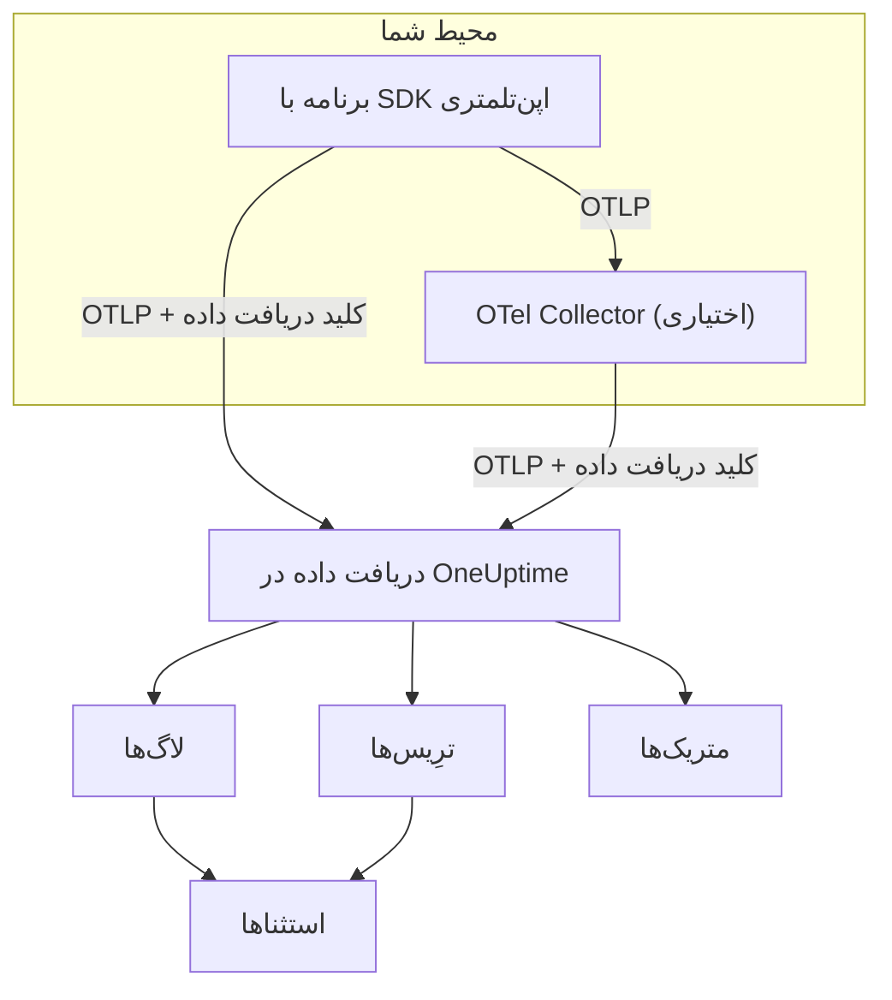

# OpenTelemetry

لاگ‌ها، متریک‌ها و ترِیس‌ها از راه OpenTelemetry Protocol (OTLP) وارد OneUptime می‌شوند. هر SDK اپن‌تلمتری، یا یک OpenTelemetry Collector، را با یک کلید دریافت داده به سمت OneUptime بفرستید تا داده‌هایتان در **لاگ‌ها**، **ترِیس‌ها**، **متریک‌ها** و **استثناها** نمایش داده شوند. این صفحه در چند دقیقه یک سرویس را به ارسال داده می‌رساند و سپس نقطه‌های پایانی، محدودیت‌ها و خطاهایی را که در محیط عملیاتی لازم دارید شرح می‌دهد.

:::cards
- [شروع سریع](#شروع-سریع): یک کلید بسازید، چهار متغیر محیطی را تنظیم کنید و SDK را اضافه کنید.
- [استفاده از Collector](#ارسال-از-راه-opentelemetry-collector): OneUptime را به‌عنوان صادرکننده به Collectorی که از قبل دارید اضافه کنید.
- [نقطه‌های پایانی و محدودیت‌ها](#نقطههای-پایانی-و-محدودیتها): نشانی‌ها، پورت‌ها، کدگذاری‌ها، محدودیت‌های اندازه و کدهای وضعیت.
- [عیب‌یابی](#عیبیابی): وقتی داده‌ای نمی‌رسد چه چیزی را بررسی کنید.
:::

## چگونه کار می‌کند

برنامهٔ شما OTLP را مستقیم به OneUptime صادر می‌کند، یا به یک OpenTelemetry Collector که آن را جلو می‌فرستد. هر درخواست کلید دریافت داده را در سرآیند `x-oneuptime-token` با خود دارد و OneUptime با همین کلید پروژهٔ شما را پیدا می‌کند.



- **سرویس‌ها خودکار ساخته می‌شوند.** ویژگی منبع `service.name` (که با `OTEL_SERVICE_NAME` تنظیم می‌شود) نام سرویسی است که داده‌هایتان به آن تعلق دارند. OneUptime نخستین باری که داده‌ای برسد سرویس را می‌سازد و آن را در **محصولات → سرویس‌ها** نشان می‌دهد.
- **خطاها به استثنا تبدیل می‌شوند.** رویدادهای استثنا روی spanها و استثناهایی که در لاگ‌ها ثبت شده‌اند در **استثناها** به‌صورت مسئله گروه‌بندی می‌شوند — [استثناها از لاگ‌ها](#استثناها-از-لاگها) را ببینید.

## پیش از شروع

- یک پروژهٔ OneUptime که در آن بتوانید کلید دریافت داده بسازید: مالکان و مدیران پروژه می‌توانند، و هر کسی که مجوز **Create Telemetry Ingestion Key** را دارد نیز می‌تواند.
- برنامه‌ای که بتوانید SDK اپن‌تلمتری را به آن اضافه کنید، یا یک OpenTelemetry Collector.
- دسترسی HTTPS خروجی (پورت ۴۴۳) از برنامه یا Collector به `oneuptime.com`، یا به میزبان OneUptime خودتان.

> [!NOTE]
> در OneUptime Cloud، هزینهٔ تله‌متری به ازای هر گیگابایت دریافت‌شده محاسبه می‌شود. پروژه‌ای که روی پلن Free است، پیش از ارسال تله‌متری به یک روش پرداخت نیاز دارد — پنجره‌ای که کلید را می‌سازد قیمت‌ها را نشان می‌دهد.

## شروع سریع

:::steps
### ساخت کلید دریافت داده

1. به **محصولات → تنظیمات پروژه** بروید.
2. در منوی کناری، **تله‌متری و APM** را باز کنید و **کلیدهای دریافت داده** را برگزینید.
3. روی **ساخت کلید دریافت داده** کلیک کنید. پنجره یک نام را پر می‌کند و نوع کلید **سرور** را برمی‌گزیند که برنامه‌ها و Collectorها با آن داده می‌فرستند. اگر خواستید نامش را عوض کنید و سپس روی **ساخت کلید دریافت داده** کلیک کنید.


کلید تازه در صفحهٔ خودش باز می‌شود. **کلید محرمانه** آن را کپی کنید — این همان توکنی است که به‌عنوان `x-oneuptime-token` می‌فرستید.


### تنظیم متغیرهای محیطی اپن‌تلمتری

همهٔ SDKهای اپن‌تلمتری همان متغیرهای محیطی استاندارد را می‌خوانند، پس این گام در همهٔ زبان‌ها یکسان است.

| متغیر محیطی | مقدار | کارکرد |
| --- | --- | --- |
| `OTEL_EXPORTER_OTLP_ENDPOINT` | `https://oneuptime.com/otlp` | مقصد ارسال. SDK خودش `/v1/traces`، `/v1/metrics` و `/v1/logs` را اضافه می‌کند. |
| `OTEL_EXPORTER_OTLP_HEADERS` | `x-oneuptime-token=YOUR_ONEUPTIME_INGESTION_KEY` | کلید دریافت داده را با هر درخواست می‌فرستد. |
| `OTEL_EXPORTER_OTLP_PROTOCOL` | `http/protobuf` | OTLP روی HTTP. برخی SDKها به‌طور پیش‌فرض gRPC را به کار می‌برند که نقطهٔ پایانی دیگری دارد. |
| `OTEL_SERVICE_NAME` | `my-service` | سرویسی که داده‌هایتان در OneUptime زیر آن نمایش داده می‌شوند. |

```bash
export OTEL_EXPORTER_OTLP_ENDPOINT="https://oneuptime.com/otlp"
export OTEL_EXPORTER_OTLP_HEADERS="x-oneuptime-token=YOUR_ONEUPTIME_INGESTION_KEY"
export OTEL_EXPORTER_OTLP_PROTOCOL="http/protobuf"
export OTEL_SERVICE_NAME="my-service"
```

میزبانی شخصی دارید؟ به جای `https://oneuptime.com` نشانی نمونهٔ OneUptime خودتان را بگذارید، برای نمونه `https://oneuptime.example.com/otlp`. برای برچسب زدن محیط روی استثناها، `OTEL_RESOURCE_ATTRIBUTES` را نیز روی `deployment.environment=production` تنظیم کنید.

### افزودن اپن‌تلمتری به برنامه

زبان خود را برگزینید. هر پیکربندی متغیرهای محیطی بالا را می‌خواند، پس هیچ نقطهٔ پایانی یا کلیدی در کد شما نمی‌آید.

:::tabs
@tab Node.js
SDK، ابزارگذاری‌های خودکار و صادرکننده‌های OTLP/HTTP را نصب کنید:

```bash
npm install @opentelemetry/sdk-node @opentelemetry/auto-instrumentations-node \
  @opentelemetry/exporter-trace-otlp-proto @opentelemetry/exporter-metrics-otlp-proto \
  @opentelemetry/exporter-logs-otlp-proto @opentelemetry/sdk-metrics @opentelemetry/sdk-logs
```

SDK را در یک فایل جداگانه بسازید:

```javascript title="instrumentation.js"
const { NodeSDK } = require("@opentelemetry/sdk-node");
const { getNodeAutoInstrumentations } = require("@opentelemetry/auto-instrumentations-node");
const { OTLPTraceExporter } = require("@opentelemetry/exporter-trace-otlp-proto");
const { OTLPMetricExporter } = require("@opentelemetry/exporter-metrics-otlp-proto");
const { OTLPLogExporter } = require("@opentelemetry/exporter-logs-otlp-proto");
const { PeriodicExportingMetricReader } = require("@opentelemetry/sdk-metrics");
const { BatchLogRecordProcessor } = require("@opentelemetry/sdk-logs");

// The exporters read OTEL_EXPORTER_OTLP_ENDPOINT and OTEL_EXPORTER_OTLP_HEADERS.
const sdk = new NodeSDK({
  traceExporter: new OTLPTraceExporter(),
  metricReader: new PeriodicExportingMetricReader({
    exporter: new OTLPMetricExporter(),
  }),
  logRecordProcessors: [new BatchLogRecordProcessor(new OTLPLogExporter())],
  instrumentations: [getNodeAutoInstrumentations()],
});

sdk.start();
```

آن را پیش از کد برنامه بارگذاری کنید:

```bash
node --require ./instrumentation.js app.js
```
@tab Python
توزیع اپن‌تلمتری و صادرکننده را نصب کنید، سپس ابزارگذاری کتابخانه‌هایی را که برنامه‌تان به کار می‌برد:

```bash
pip install opentelemetry-distro opentelemetry-exporter-otlp
opentelemetry-bootstrap -a install
```

برنامه را از راه `opentelemetry-instrument` اجرا کنید. این ابزار ترِیس‌ها، متریک‌ها و لاگ‌ها را صادر می‌کند؛ متغیر لاگ‌گیری رکوردهایی را هم که با ماژول `logging` پایتون نوشته می‌شوند می‌فرستد:

```bash
OTEL_PYTHON_LOGGING_AUTO_INSTRUMENTATION_ENABLED=true opentelemetry-instrument python app.py
```
@tab Go
SDK و صادرکننده‌های OTLP/HTTP را اضافه کنید:

```bash
go get go.opentelemetry.io/otel go.opentelemetry.io/otel/sdk go.opentelemetry.io/otel/sdk/metric \
  go.opentelemetry.io/otel/exporters/otlp/otlptrace/otlptracehttp \
  go.opentelemetry.io/otel/exporters/otlp/otlpmetric/otlpmetrichttp
```

هنگام شروع برنامه، فراهم‌کننده‌های tracer و meter را بسازید:

```go title="main.go"
package main

import (
	"context"
	"log"

	"go.opentelemetry.io/otel"
	"go.opentelemetry.io/otel/exporters/otlp/otlpmetric/otlpmetrichttp"
	"go.opentelemetry.io/otel/exporters/otlp/otlptrace/otlptracehttp"
	sdkmetric "go.opentelemetry.io/otel/sdk/metric"
	sdktrace "go.opentelemetry.io/otel/sdk/trace"
)

func main() {
	ctx := context.Background()

	// Both exporters read OTEL_EXPORTER_OTLP_ENDPOINT and OTEL_EXPORTER_OTLP_HEADERS.
	traceExporter, err := otlptracehttp.New(ctx)
	if err != nil {
		log.Fatal(err)
	}
	tracerProvider := sdktrace.NewTracerProvider(sdktrace.WithBatcher(traceExporter))
	defer tracerProvider.Shutdown(ctx)
	otel.SetTracerProvider(tracerProvider)

	metricExporter, err := otlpmetrichttp.New(ctx)
	if err != nil {
		log.Fatal(err)
	}
	meterProvider := sdkmetric.NewMeterProvider(
		sdkmetric.WithReader(sdkmetric.NewPeriodicReader(metricExporter)),
	)
	defer meterProvider.Shutdown(ctx)
	otel.SetMeterProvider(meterProvider)

	// Your application code.
}
```

فراهم‌کننده‌ها `OTEL_SERVICE_NAME` را از محیط می‌گیرند. برای لاگ‌ها، `otlploghttp` را همراه یک پل لاگ مانند `otelslog` اضافه کنید؛ آن هم همین متغیرها را می‌خواند.
@tab Java
عامل جاوای اپن‌تلمتری را بارگیری کنید و آن را به برنامه‌تان متصل کنید. نیازی به تغییر کد نیست:

```bash
curl -L -O https://github.com/open-telemetry/opentelemetry-java-instrumentation/releases/latest/download/opentelemetry-javaagent.jar
java -javaagent:opentelemetry-javaagent.jar -jar my-app.jar
```

این عامل چارچوب‌ها و کتابخانه‌های رایج را ابزارگذاری می‌کند و ترِیس‌ها، متریک‌ها و لاگ‌هایی را که با Logback یا Log4j نوشته می‌شوند صادر می‌کند.
@tab .NET
بسته‌های اپن‌تلمتری برای ASP.NET Core را اضافه کنید:

```bash
dotnet add package OpenTelemetry.Extensions.Hosting
dotnet add package OpenTelemetry.Exporter.OpenTelemetryProtocol
dotnet add package OpenTelemetry.Instrumentation.AspNetCore
dotnet add package OpenTelemetry.Instrumentation.Http
```

اپن‌تلمتری را هنگام راه‌اندازی ثبت کنید. `UseOtlpExporter()` ترِیس‌ها، متریک‌ها و لاگ‌ها را می‌فرستد و متغیرهای `OTEL_EXPORTER_OTLP_*` را می‌خواند:

```csharp title="Program.cs"
using OpenTelemetry;
using OpenTelemetry.Metrics;
using OpenTelemetry.Trace;

var builder = WebApplication.CreateBuilder(args);

builder.Services.AddOpenTelemetry()
    .WithTracing(tracing => tracing
        .AddAspNetCoreInstrumentation()
        .AddHttpClientInstrumentation())
    .WithMetrics(metrics => metrics
        .AddAspNetCoreInstrumentation()
        .AddHttpClientInstrumentation())
    .WithLogging()
    .UseOtlpExporter();

var app = builder.Build();
app.Run();
```

از Serilog استفاده می‌کنید؟ برای فرستادن لاگ‌های آن به OneUptime، [Serilog](/docs/telemetry/serilog) را ببینید.
:::

### بررسی رسیدن داده

از OneUptime بپرسید که آیا کلید شما را می‌پذیرد:

```bash
curl -i -H "x-oneuptime-token: YOUR_ONEUPTIME_INGESTION_KEY" \
  https://oneuptime.com/otlp/v1/validate
```

کلیدی که کار می‌کند `200` را همراه `"valid": true` برمی‌گرداند. هر حالت دیگری `401` را با پیامی برمی‌گرداند که می‌گوید چه چیزی نادرست است — ناشناخته، غیرفعال یا منقضی.

سپس برنامه را اجرا کنید و یک دقیقه با آن کار کنید. **محصولات → سرویس‌ها** را باز کنید: سرویس شما با نامی که در `OTEL_SERVICE_NAME` گذاشته‌اید فهرست شده است، همراه با لاگ‌ها، ترِیس‌ها، متریک‌ها و استثناهایش. **محصولات → لاگ‌ها**، **محصولات → ترِیس‌ها** و **محصولات → متریک‌ها** همین داده‌ها را برای همهٔ سرویس‌ها نشان می‌دهند.
:::

:::details فرستادن یک لاگ آزمایشی بدون SDK
OTLP/HTTP قالب JSON را هم می‌پذیرد، پس می‌توانید یک لاگ را با `curl` بفرستید. مقدار `9` برای `severityNumber` آن را به یک لاگ اطلاعاتی تبدیل می‌کند:

```bash
curl -i https://oneuptime.com/otlp/v1/logs \
  -H "Content-Type: application/json" \
  -H "x-oneuptime-token: YOUR_ONEUPTIME_INGESTION_KEY" \
  -d '{
    "resourceLogs": [{
      "resource": {
        "attributes": [
          { "key": "service.name", "value": { "stringValue": "my-service" } }
        ]
      },
      "scopeLogs": [{
        "logRecords": [{
          "severityNumber": 9,
          "body": { "stringValue": "Hello from curl" }
        }]
      }]
    }]
  }'
```

پاسخ `200` یعنی لاگ پذیرفته شده است. در چند ثانیه در **محصولات → لاگ‌ها** و در سرویس `my-service` نمایش داده می‌شود.
:::

## ارسال از راه OpenTelemetry Collector

وقتی از پیش یک Collector دارید، وقتی می‌خواهید داده‌ها را در یک جا دسته‌بندی، پالایش یا غنی کنید، یا برای اینکه کلید دریافت داده بیرون از برنامه‌هایتان بماند، یک Collector اجرا کنید. برنامه‌ها به Collector صادر می‌کنند و فقط Collector با OneUptime حرف می‌زند.

:::steps
### افزودن OneUptime به‌عنوان صادرکننده

یک صادرکنندهٔ `otlphttp` که به OneUptime اشاره می‌کند اضافه کنید و همهٔ خط‌لوله‌ها را از آن عبور دهید:

```yaml title="otel-collector-config.yaml"
receivers:
  otlp:
    protocols:
      grpc:
        endpoint: 0.0.0.0:4317
      http:
        endpoint: 0.0.0.0:4318

processors:
  batch: {}

exporters:
  otlphttp:
    endpoint: https://oneuptime.com/otlp
    headers:
      x-oneuptime-token: YOUR_ONEUPTIME_INGESTION_KEY

service:
  pipelines:
    traces:
      receivers: [otlp]
      processors: [batch]
      exporters: [otlphttp]
    metrics:
      receivers: [otlp]
      processors: [batch]
      exporters: [otlphttp]
    logs:
      receivers: [otlp]
      processors: [batch]
      exporters: [otlphttp]
```

پیش‌فرض‌های صادرکننده را نگه دارید: protobuf فشرده با gzip می‌فرستد و OneUptime هر دو را می‌پذیرد. سرآیند `Content-Type` را روی صادرکننده تنظیم نکنید — OneUptime رمزگشا را از روی همین سرآیند انتخاب می‌کند، پس نوع محتوای JSON جلوی بایت‌های protobuf دریافت داده را خراب می‌کند.

### اجرای Collector

:::tabs
@tab Docker
```bash
docker run -d --name otel-collector \
  -p 4317:4317 -p 4318:4318 \
  -v "$(pwd)/otel-collector-config.yaml:/etc/otelcol-contrib/config.yaml" \
  otel/opentelemetry-collector-contrib:latest
```
@tab Linux
```bash
otelcol-contrib --config otel-collector-config.yaml
```
:::

Collector روی پورت `4317` (gRPC) و `4318` (HTTP) به OTLP گوش می‌دهد؛ همان پورت‌هایی که SDKها به‌طور پیش‌فرض به آن‌ها می‌فرستند.

### هدایت برنامه‌ها به Collector

در برنامه‌هایتان `OTEL_EXPORTER_OTLP_ENDPOINT` را روی Collector تنظیم کنید، برای نمونه `http://localhost:4318`، و `OTEL_EXPORTER_OTLP_HEADERS` را حذف کنید — کلید را Collector اضافه می‌کند. `OTEL_SERVICE_NAME` را در هر برنامه نگه دارید.

داده‌ها دقیقاً مانند شروع سریع به OneUptime می‌رسند. اگر نرسیدند، لاگ خود Collector دلیلش را می‌گوید — [عیب‌یابی](#عیبیابی) را ببینید.
:::

از پیش به فروشندهٔ دیگری صادر می‌کنید؟ صادرکنندهٔ `otlphttp` را کنار صادرکنندهٔ موجود اضافه کنید و هر دو را در `exporters` هر خط‌لوله فهرست کنید تا در مدت مقایسه به هر دو بفرستید. برای جمع‌آوری متریک‌های میزبان و فایل‌های لاگ هم، راهنمای [Host OpenTelemetry Collector](/docs/telemetry/host-otel-collector) را ببینید.

## نقطه‌های پایانی و محدودیت‌ها

| تنظیم | OTLP/HTTP (پیشنهادی) | OTLP/gRPC |
| --- | --- | --- |
| نقطهٔ پایانی | `https://oneuptime.com/otlp` | `https://oneuptime.com:443` |
| احراز هویت | سرآیند `x-oneuptime-token` | فراداده `x-oneuptime-token` |
| کدگذاری | Protobuf (`application/x-protobuf`) یا JSON (`application/json`) | Protobuf |
| فشرده‌سازی | بدون فشرده‌سازی، `gzip`، `deflate` یا `zstd` | بدون فشرده‌سازی یا `gzip` |
| اندازهٔ درخواست | تا ۴ مگابایت برای هر درخواست روی `/otlp` | تا ۴ مگابایت برای هر پیام |

روی HTTP، هر سیگنال مسیر خودش را زیر نقطهٔ پایانی دارد. SDKها و Collector آن را برایتان اضافه می‌کنند؛ فقط وقتی ابزاری نشانی کامل می‌خواهد خودتان آن را تنظیم کنید.

| سیگنال | نشانی OTLP/HTTP |
| --- | --- |
| ترِیس‌ها | `https://oneuptime.com/otlp/v1/traces` |
| متریک‌ها | `https://oneuptime.com/otlp/v1/metrics` |
| لاگ‌ها | `https://oneuptime.com/otlp/v1/logs` |
| پروفایل‌ها | `https://oneuptime.com/otlp/v1/profiles` |

برای پروفایل‌گیری پیوسته، بیشتر پروفایل‌گیرها به جای این، به نقطهٔ پایانی سازگار با Pyroscope می‌فرستند — [پروفایل‌گیری پیوسته](/docs/telemetry/profiles) را ببینید. Collectorی که پروفایل‌های OTLP صادر می‌کند باید `profiles_endpoint` صادرکننده را روی `https://oneuptime.com/otlp/v1/profiles` بگذارد، چون به‌طور پیش‌فرض پروفایل‌ها را به یک مسیر توسعه می‌فرستد که OneUptime ارائه نمی‌کند.

### OTLP روی gRPC

سرویس OTLP/gRPC روی همان میزبان برنامهٔ وب، روی پورت ۴۴۳ و از راه TLS ارائه می‌شود. `OTEL_EXPORTER_OTLP_PROTOCOL` را روی `grpc` و `OTEL_EXPORTER_OTLP_ENDPOINT` را روی `https://oneuptime.com:443` بگذارید و همان سرآیند `x-oneuptime-token` را بفرستید. در Collector، صادرکنندهٔ `otlp` را با `endpoint: oneuptime.com:443` و همان `headers` به کار ببرید.

در نصب با میزبانی شخصی، gRPC فقط از راه HTTPS به OneUptime می‌رسد: اتصال HTTP ساده (h2c) رد می‌شود. اگر نمونهٔ شما روی HTTP ساده ارائه می‌شود، از OTLP/HTTP استفاده کنید.

دو تنظیم از تنظیمات یک کلید فقط بر OTLP/HTTP اثر دارند: **Requests Per Minute Limit** و **Pinned Service Name**. داده‌ای که روی gRPC فرستاده می‌شود همان `service.name` ارسالی خودش را نگه می‌دارد و در این سقف شمرده نمی‌شود.

### پاسخ‌ها

همین که داده در صف قرار گیرد OneUptime به صادرکننده پاسخ می‌دهد و داده چند ثانیه بعد نمایش داده می‌شود.

| پاسخ | وضعیت gRPC | معنا | چه باید کرد |
| --- | --- | --- | --- |
| `200` | `OK` | پذیرفته شد. | هیچ. |
| `401` | `UNAUTHENTICATED` | کلید وجود ندارد، ناشناخته است یا منقضی شده است. | مقدار `x-oneuptime-token` را با **کلید محرمانه** آن کلید مقایسه کنید. |
| `402` | `PERMISSION_DENIED` | فقط OneUptime Cloud: پروژه روی پلن Free است و روش پرداخت ندارد. | یکی در **تنظیمات پروژه → صورت‌حساب و فاکتورها → صورت‌حساب** اضافه کنید. |
| `413` | — | درخواست از محدودیت اندازه بزرگ‌تر است. | دسته‌های کوچک‌تری بفرستید. |
| `415` | — | `Content-Encoding` پشتیبانی‌نشده. | از `gzip`، `deflate` یا `zstd` استفاده کنید، یا بدون فشرده‌سازی بفرستید. |
| `422` | `PERMISSION_DENIED` | کلید غیرفعال است، یا کلید مرورگری است که بیرون از مبداهای مجازش به کار رفته است. | کلید را دوباره فعال کنید، یا با یک کلید سرور بفرستید. |
| `429` | — | **Requests Per Minute Limit** کلید پر شده است. | در آغاز هیچ: صادرکننده‌ها پس از زمان `Retry-After` دوباره تلاش می‌کنند. اگر تکرار شد، سقف را بالا ببرید. |
| `503` | `UNAVAILABLE` | OneUptime در حال راه‌اندازی است، یا صف دریافت داده در دسترس نیست. | هیچ: صادرکننده‌های OTLP خودشان پس از `503` دوباره تلاش می‌کنند. |

`401`، `402`، `413`، `415` و `422` برای صادرکننده‌های OTLP خطاهای دائمی‌اند: صادرکننده به جای تلاش دوباره، دسته را کنار می‌گذارد و خطا را ثبت می‌کند.

### راه‌اندازی دوباره و ارتقا

در مدتی که OneUptime دوباره راه‌اندازی یا ارتقا داده می‌شود، تا آماده شدن به صادرکننده‌ها با `503` و `Retry-After: 5` پاسخ می‌دهد و صادرکننده‌ها آن‌ها را دوباره می‌فرستند. صادرکنندهٔ یک Collector به‌طور پیش‌فرض پنج دقیقه به تلاش دوباره ادامه می‌دهد (`retry_on_failure`) و آنچه را نتوانسته بفرستد در `sending_queue` خودش نگه می‌دارد، پس هر دو را روشن بگذارید. زمانی که OneUptime داده دریافت نمی‌کرد هرگز به حساب سرورها، میزبان‌ها یا منابع دیگر شما گذاشته نمی‌شود: [وقتی OneUptime داده دریافت نمی‌کند](/docs/monitor/when-oneuptime-is-not-receiving#هنگام-راهاندازی) را ببینید.

### کلیدهای دریافت داده

صفحهٔ هر کلید، در **تنظیمات پروژه → تله‌متری و APM → کلیدهای دریافت داده**، این تنظیمات را دارد:

| تنظیم | کارکرد |
| --- | --- |
| **نوع کلید** | **سرور** (پیش‌فرض) برای برنامه‌ها، Collectorها و عامل‌ها. **Browser** برای کلیدهایی که درون یک صفحهٔ وب منتشر می‌شوند: فقط نوشتنی، و فقط از **Allowed Origins** خودش پذیرفته می‌شود. پس از ساخته شدن کلید نمی‌توان آن را تغییر داد. |
| **Allowed Origins** | مبداهای وبی که یک کلید مرورگر از آن‌ها کار می‌کند، مانند `https://app.example.com`. روی کلید سرور نادیده گرفته می‌شود. |
| **Pinned Service Name** | اگر تنظیم شود، `service.name` را روی هر چیزی که با این کلید از راه OTLP/HTTP فرستاده می‌شود جایگزین می‌کند. |
| **فعال** | خاموشش کنید تا پذیرش داده‌هایی که با این کلید فرستاده می‌شوند بی‌درنگ متوقف شود، بی آنکه کلید حذف شود. |
| **تاریخ انقضا** | پس از این تاریخ کلید رد می‌شود. خالی یعنی هرگز منقضی نمی‌شود. |
| **Requests Per Minute Limit** | بیشترین شمار درخواست‌های OTLP/HTTP در دقیقه که با این کلید پذیرفته می‌شود، برای همهٔ کلاینت‌هایی که آن را به کار می‌برند روی هم. خالی یعنی برای کلید سرور بدون سقف و برای کلید مرورگر ۶٬۰۰۰. |
| **Last Used At** | آخرین باری که داده‌ای با این کلید پذیرفته شد. با آن کلیدهایی را پیدا کنید که چرخاندن یا حذفشان بی‌خطر است. |

**بازنشانی کلید محرمانه** در صفحهٔ کلید، مقدار محرمانه را عوض می‌کند. هر برنامه و Collectorی که با مقدار قدیمی می‌فرستد تا وقتی به‌روزش نکنید رد می‌شود.

## OneUptime با میزبانی شخصی

هر آنچه در این صفحه آمده روی نصب خودتان هم همین‌طور کار می‌کند. هر جا این صفحه `https://oneuptime.com` می‌گوید، نشانی OneUptime خودتان را بگذارید:

- مقدار `OTEL_EXPORTER_OTLP_ENDPOINT` برابر `https://YOUR-ONEUPTIME-HOST/otlp` است، یا `http://YOUR-ONEUPTIME-HOST/otlp` اگر OneUptime را روی HTTP ساده ارائه می‌کنید.
- ingress همراه، درخواست‌هایی تا ۴ مگابایت را روی `/otlp` می‌پذیرد. پراکسی‌ای که جلوی OneUptime اجرا می‌کنید ممکن است سقف کمتری داشته باشد — ingress-nginx به‌طور پیش‌فرض `proxy-body-size` را ۱ مگابایت می‌گذارد — پس آن را برای `/otlp` هم بالا ببرید، وگرنه صادرکننده‌ها `413` می‌بینند.
- اگر `DISABLE_TELEMETRY_INGESTION=true` تنظیم شده باشد، OneUptime هر صادرشدنی را می‌پذیرد و هیچ چیز ذخیره نمی‌کند. وقتی یک نمونهٔ با میزبانی شخصی هیچ داده‌ای نشان نمی‌دهد، پیش از هر چیز این را بررسی کنید.

## استثناها از لاگ‌ها

استثناها درون **logs** شما پیدا می‌شوند و در همان نمای **استثناها** که خطاهای ترِیس به آن می‌رسند جمع می‌شوند. هر لاگ از پیش به یک سرویس یا میزبان تعلق دارد، پس استثنا به همان نسبت داده می‌شود. استثناهای لاگ و ترِیس گروه‌بندی بر پایهٔ اثرانگشت مشترکی دارند، پس خطایی که هم یک ترِیس و هم یک لاگ گزارشش کنند به یک مسئلهٔ واحد تبدیل می‌شود.

یک لاگ از دو راه به استثنا تبدیل می‌شود:

| تشخیص | لاگ‌هایی که شامل می‌شود | چگونه کار می‌کند |
| --- | --- | --- |
| **ویژگی‌های استثنا** (پیشنهادی) | هر لاگی | رکورد لاگی که ویژگی اپن‌تلمتری `exception.type`، `exception.message` یا `exception.stacktrace` را داشته باشد مستقیم به استثنا تبدیل می‌شود. بیشتر یکپارچه‌سازی‌های لاگ‌گیری وقتی استثنایی را لاگ می‌کنید این‌ها را تنظیم می‌کنند: appenderهای Logback و Log4j، Serilog و ابزارگذاری لاگ‌گیری پایتون. این روش دقیق است و در همهٔ زبان‌ها کار می‌کند. |
| **ردپای پشته در متن لاگ** | لاگ‌های error و fatal که شناسهٔ ترِیس و شناسهٔ span ندارند | ۱۶ کیلوبایت نخست متن برای یافتن ردپای پشتهٔ JavaScript، Python، Java، Go، Ruby، C#/.NET یا PHP پویش می‌شود و نوع، پیام و فریم‌ها از آن بیرون کشیده می‌شوند. لاگی که درون یک span نوشته شده نادیده گرفته می‌شود، چون خود span استثنا را گزارش می‌کند. |

پویش متن برای لاگ‌های متن ساده مانند stdout خام، journald یا syslog که یک Collector می‌خواند مناسب است. ردپای پشتهٔ چندخطی باید به‌صورت یک رکورد لاگ برسد، پس ترکیب چندخطی را در Collector روشن کنید — راهنمای [Host OpenTelemetry Collector](/docs/telemetry/host-otel-collector) را ببینید.

تشخیص به‌طور پیش‌فرض روشن است. در نصب با میزبانی شخصی، با تنظیم `TELEMETRY_LOG_EXCEPTION_EXTRACTION_ENABLED=false` روی سرویس `app` خاموشش کنید — و اگر worker اختصاصی چارت Helm را اجرا می‌کنید، روی `worker` هم.

## عیب‌یابی

:::details هیچ داده‌ای نمایش داده نمی‌شود و صادرکننده `401` را ثبت می‌کند
کلید وجود ندارد، ناشناخته است یا منقضی شده است. بررسی کنید که `OTEL_EXPORTER_OTLP_HEADERS` برابر `x-oneuptime-token=` و پس از آن **کلید محرمانه** کلید باشد، بدون نقل‌قول یا فاصله درون مقدار، و اینکه کلید به پروژه‌ای که می‌بینید تعلق داشته باشد. درخواست اعتبارسنجی در [بررسی رسیدن داده](#بررسی-رسیدن-داده) می‌گوید کدام حالت است.
:::

:::details صادرکننده `422` را ثبت می‌کند
کلید غیرفعال است، یا کلید مرورگر است. **فعال** را در تنظیمات کلید دوباره روشن کنید، یا یک کلید **سرور** بسازید: کلید مرورگر فقط از صفحهٔ وبی روی یکی از مبداهای مجازش پذیرفته می‌شود.
:::

:::details صادرکننده `402` را ثبت می‌کند
پروژه روی پلن Free در OneUptime Cloud است و روش پرداخت ندارد، و تله‌متری بر پایهٔ مصرف صورت‌حساب می‌شود. یک روش پرداخت در **تنظیمات پروژه → صورت‌حساب و فاکتورها → صورت‌حساب** اضافه کنید تا صادرشده‌ها دوباره پذیرفته شوند.
:::

:::details صادرکننده `404` را ثبت می‌کند
SDK به مسیر نادرستی می‌فرستد. `OTEL_EXPORTER_OTLP_ENDPOINT` باید به `/otlp` ختم شود، بدون اسلش پایانی و بدون `/v1/...` — آن را SDK اضافه می‌کند. اگر متغیری ویژهٔ یک سیگنال مانند `OTEL_EXPORTER_OTLP_TRACES_ENDPOINT` تنظیم کنید، نشانی کامل می‌خواهد، برای نمونه `https://oneuptime.com/otlp/v1/traces`.
:::

:::details هیچ اتفاقی نمی‌افتد و SDK خطای اتصال ثبت می‌کند
احتمالاً SDK روی gRPC به یک نقطهٔ پایانی HTTP، یا به `localhost` صادر می‌کند. `OTEL_EXPORTER_OTLP_PROTOCOL=http/protobuf` را تنظیم کنید، یا از نقطهٔ پایانی gRPC که در [OTLP روی gRPC](#otlp-روی-grpc) آمده استفاده کنید. همچنین بررسی کنید که فرایند واقعاً متغیرهای محیطی را می‌بیند — در کانتینر آن‌ها را روی کانتینر تنظیم کنید، نه در shell خودتان.
:::

:::details Collector خطای `Exporting failed` را با `413` ثبت می‌کند
یک دسته از محدودیت اندازه بزرگ‌تر است. اندازهٔ دسته را کم کنید، برای نمونه با `send_batch_max_size: 1000` روی پردازندهٔ `batch`. اگر پشت پراکسی خودتان میزبانی شخصی دارید، سقف اندازهٔ بدنهٔ آن پراکسی را هم بررسی کنید.
:::

:::details داده زیر سرویس نادرست، یا زیر Unknown Service می‌رسد
سرویس از ویژگی منبع `service.name` می‌آید. `OTEL_SERVICE_NAME` را در هر برنامه تنظیم کنید. اگر کلید **Pinned Service Name** داشته باشد، هر صادرشدهٔ OTLP/HTTP با آن کلید به جای آن زیر همان نام ثبت می‌شود.
:::

## گام‌های بعدی

:::cards
- [نحو جست‌وجو](/docs/telemetry/search-syntax): لاگ‌ها، ترِیس‌ها، متریک‌ها و استثناها را در کاوشگرها پالایش کنید.
- [خط‌لوله‌های لاگ](/docs/telemetry/log-pipelines): لاگ‌ها را هنگام رسیدن تجزیه و غنی کنید.
- [مانیتور لاگ‌ها](/docs/monitor/logs-monitor): وقتی لاگ‌های منطبق ظاهر می‌شوند هشدار بگیرید.
- [Host OpenTelemetry Collector](/docs/telemetry/host-otel-collector): متریک‌های میزبان و فایل‌های لاگ را با یک Collector جمع‌آوری کنید.
:::
