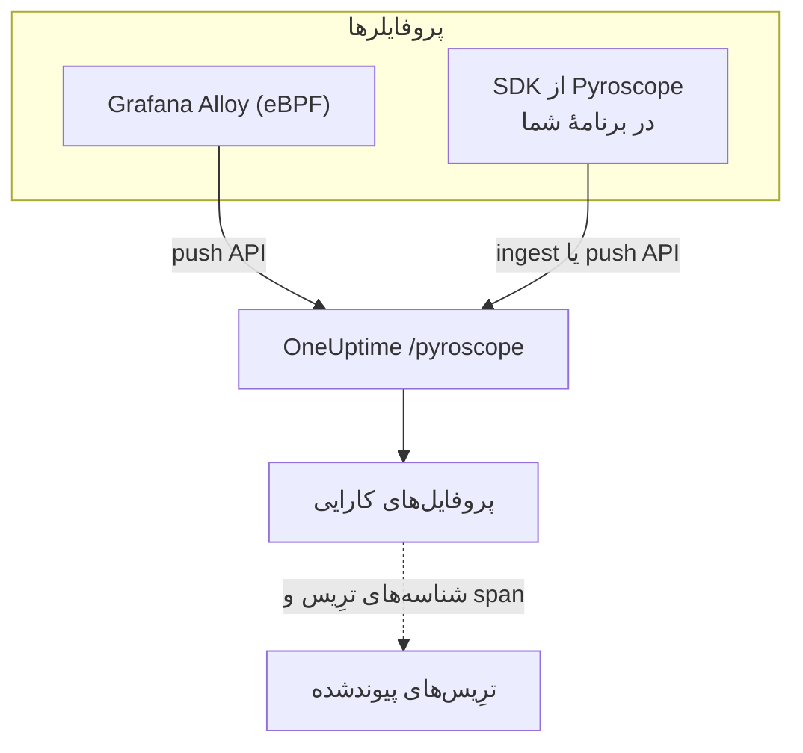

# پروفایل‌گیری پیوسته

پروفایل‌گیری پیوسته نشان می‌دهد برنامهٔ شما زمان پردازنده و حافظه را تابع به تابع چگونه مصرف می‌کند. OneUptime یک **API دریافت سازگار با Pyroscope** ارائه می‌دهد، پس هر چیزی که بتواند به یک سرور Pyroscope داده بفرستد — پروفایلر eBPF در Grafana Alloy یا یک SDK زبانی Pyroscope — می‌تواند به OneUptime هم بفرستد، و نتیجه را به‌صورت نمودار شعله کنار لاگ‌ها، متریک‌ها و ترِیس‌هایتان می‌خوانید.

:::cards
- [ارسال پروفایل‌ها](#ارسال-پروفایلها): Grafana Alloy با eBPF، یا یک SDK از Pyroscope در برنامهٔ شما.
- [نقطهٔ پایانی دریافت](#نقطهٔ-پایانی-دریافت): نشانی پایه و سه راه فرستادن کلید.
- [بررسی درستی کار](#بررسی-درستی-کار): کلید، صفحه و وضعیت بارگذاری را بررسی کنید.
- [کاوش پروفایل‌ها](#کاوش-پروفایلها-در-oneuptime): نمودارهای شعله، توابع برتر، مقایسه‌ها و پیوند به ترِیس‌ها.
:::

## چگونه کار می‌کند

یک پروفایلر از فرایندهای شما نمونه می‌گیرد و هر چند ثانیه یک پروفایل را با کلید دریافت داده‌تان به نقطهٔ پایانی `/pyroscope` در OneUptime بارگذاری می‌کند. OneUptime هر پروفایل را زیر سرویسی که نام می‌برد ذخیره می‌کند و آن را به‌صورت نمودار شعله در **پروفایل‌های کارایی** نمایش می‌دهد.



## پیش از شروع

به یک کلید دریافت تله‌متری از نوع **سرور** نیاز دارید. اگر هنوز ندارید:

:::steps
### کلیدهای دریافت داده را باز کنید

به **محصولات → تنظیمات پروژه** بروید، در منوی کناری **تله‌متری و APM** را باز کنید و **کلیدهای دریافت داده** را برگزینید.


### یک کلید بسازید

روی **ساخت کلید دریافت داده** کلیک کنید. پنجره نام کلید را پر کرده و **سرور** را برگزیده است — نوع کلیدی که برنامه‌ها و جمع‌کننده‌ها با آن داده می‌فرستند — پس برای ساختن آن روی **ساخت کلید دریافت داده** کلیک کنید، یا نخست نامش را عوض کنید.

### کلید محرمانه را کپی کنید

کلید تازه در صفحهٔ خودش باز می‌شود. **کلید محرمانه** آن را کپی کنید: این همان توکن دریافت داده است که نمونه‌های زیر `YOUR_ONEUPTIME_INGESTION_TOKEN` می‌نامند.


:::

## نقطهٔ پایانی دریافت

| تنظیم | مقدار |
| --- | --- |
| نشانی پایه (نشانی سرور Pyroscope) | `https://oneuptime.com/pyroscope` |
| سرآیند احراز هویت | `x-oneuptime-token: YOUR_ONEUPTIME_INGESTION_TOKEN` |

کلاینت‌ها مسیر خودشان را به نشانی پایه می‌افزایند — `/ingest` برای بیشتر SDKهای Pyroscope، و `/push.v1.PusherService/Push` برای Grafana Alloy و SDK داتنت از v0.14 به بعد — پس همیشه فقط نشانی پایه را، بدون اسلش پایانی، پیکربندی می‌کنید.

OneUptime توکن دریافت داده را از هرکدام از این‌ها می‌خواند، پس هرکدام را که کلاینتتان پشتیبانی می‌کند به کار ببرید:

| روش | چه زمانی به کار ببرید |
| --- | --- |
| سرآیند `x-oneuptime-token` | کلاینت‌هایی که اجازهٔ افزودن سرآیند سفارشی می‌دهند. |
| `Authorization: Bearer <token>` | SDKهایی با گزینهٔ `authToken` / `auth_token` — همین را می‌فرستند. |
| احراز هویت پایهٔ HTTP، با توکن به‌عنوان **گذرواژه** (هر نام کاربری) | کلاینت‌هایی که فقط نام کاربری و گذرواژهٔ احراز هویت پایه را ارائه می‌دهند. |

> [!NOTE]
> OneUptime را خودتان میزبانی می‌کنید؟ `https://oneuptime.com` را با میزبان خودتان جایگزین کنید، برای نمونه `https://YOUR-ONEUPTIME-HOST/pyroscope`.

## قالب‌های پروفایل پشتیبانی‌شده

| قالب | فرستنده | پشتیبانی |
| --- | --- | --- |
| pprof (protobuf دودویی، به‌دلخواه با فشرده‌سازی gzip) | SDKهای Pyroscope برای Go، Node.js و داتنت؛ Grafana Alloy | بله |
| متن folded / collapsed | SDKهای Pyroscope برای Python، Ruby و Rust (قالب بارگذاری پیش‌فرضشان) | بله |
| JFR (Java Flight Recorder) | عامل Java در Pyroscope | هنوز نه — برای سرویس‌های Java از Grafana Alloy استفاده کنید |

## ارسال پروفایل‌ها

Grafana Alloy هر فرایند روی یک میزبان را بدون تغییر کد پروفایل می‌کند و راه پیشنهادی برای شروع است. در مقابل، SDK از Pyroscope درون برنامهٔ شما اجرا می‌شود.

:::tabs
@tab Grafana Alloy
[Grafana Alloy](https://grafana.com/docs/alloy/latest/) با eBPF پروفایل‌های پردازنده را از هر فرایند روی یک میزبان Linux جمع می‌کند — بدون عاملی درون برنامهٔ شما و بدون تغییر کد. برای Go، Rust، C/C++، Java، Python، Ruby، PHP، Node.js و داتنت کار می‌کند.

پیکربندی Alloy را بسازید:

```hcl title="alloy-config.alloy"
discovery.process "all" {
  refresh_interval = "60s"
}

discovery.relabel "alloy_profiles" {
  targets = discovery.process.all.targets

  rule {
    action       = "replace"
    source_labels = ["__meta_process_exe"]
    target_label  = "service_name"
  }
}

pyroscope.ebpf "default" {
  targets    = discovery.relabel.alloy_profiles.output
  forward_to = [pyroscope.write.oneuptime.receiver]

  collect_interval = "15s"
  sample_rate      = 97
}

pyroscope.write "oneuptime" {
  endpoint {
    url = "https://oneuptime.com/pyroscope"
    headers = {
      "x-oneuptime-token" = "YOUR_ONEUPTIME_INGESTION_TOKEN",
    }
  }
}
```

آن را با Docker اجرا کنید. eBPF به یک کانتینر ممتاز با فضای نام PID میزبان نیاز دارد:

```yaml title="docker-compose.yml"
services:
  alloy:
    image: grafana/alloy:latest
    privileged: true
    pid: host
    volumes:
      - ./alloy-config.alloy:/etc/alloy/config.alloy
      - /proc:/proc:ro
      - /sys:/sys:ro
    command:
      - run
      - /etc/alloy/config.alloy
```

یا آن را مستقیم روی میزبان اجرا کنید:

```bash
alloy run alloy-config.alloy
```

قاعدهٔ relabel سرویس هر پروفایل را به نام فایل اجرایی فرایند نام‌گذاری می‌کند.
@tab Go
SDK زبان Go قالب pprof را بارگذاری می‌کند. نشانی سرور آن را روی نشانی پایهٔ OneUptime بگذارید و توکن دریافت داده را به‌عنوان توکن احراز هویت بدهید:

```go
import "github.com/grafana/pyroscope-go"

pyroscope.Start(pyroscope.Config{
    ApplicationName: "my-service",
    ServerAddress:   "https://oneuptime.com/pyroscope",
    AuthToken:       "YOUR_ONEUPTIME_INGESTION_TOKEN",
    ProfileTypes: []pyroscope.ProfileType{
        pyroscope.ProfileCPU,
        pyroscope.ProfileAllocObjects,
        pyroscope.ProfileAllocSpace,
        pyroscope.ProfileInuseObjects,
        pyroscope.ProfileInuseSpace,
        pyroscope.ProfileGoroutines,
    },
})
```
@tab Node.js
SDK زبان Node.js قالب pprof را بارگذاری می‌کند:

```javascript
const Pyroscope = require("@pyroscope/nodejs");

Pyroscope.init({
  serverAddress: "https://oneuptime.com/pyroscope",
  appName: "my-service",
  authToken: "YOUR_ONEUPTIME_INGESTION_TOKEN",
});

Pyroscope.start();
```
@tab Python
SDK زبان Python متن folded را بارگذاری می‌کند:

```python
import pyroscope

pyroscope.configure(
    application_name="my-service",
    server_address="https://oneuptime.com/pyroscope",
    auth_token="YOUR_ONEUPTIME_INGESTION_TOKEN",
)
```
@tab .NET
پروفایلر داتنت در Pyroscope یک پروفایلر بومی CLR است: به تغییر کد نیازی ندارد و کاملاً با متغیرهای محیطی روشن می‌شود. نسخهٔ مناسب ایمیج خود را از [pyroscope-dotnet releases](https://github.com/grafana/pyroscope-dotnet/releases) دانلود کنید — `glibc` یا `musl` برای Alpine، `x86_64` یا `aarch64` — و آن را در زمان اجرا بارگذاری کنید:

```dockerfile title="Dockerfile"
FROM alpine:3.20 AS pyroscope-profiler
ARG PYROSCOPE_DOTNET_VERSION=1.5.1
ADD https://github.com/grafana/pyroscope-dotnet/releases/download/pyroscope-${PYROSCOPE_DOTNET_VERSION}/pyroscope.${PYROSCOPE_DOTNET_VERSION}-glibc-x86_64.tar.gz /tmp/pyroscope.tar.gz
RUN mkdir -p /pyroscope && tar -xzf /tmp/pyroscope.tar.gz -C /pyroscope

FROM mcr.microsoft.com/dotnet/aspnet:10.0
# ... your application ...
COPY --from=pyroscope-profiler /pyroscope /pyroscope
ENV CORECLR_ENABLE_PROFILING=1
ENV CORECLR_PROFILER={BD1A650D-AC5D-4896-B64F-D6FA25D6B26A}
ENV CORECLR_PROFILER_PATH=/pyroscope/Pyroscope.Profiler.Native.so
ENV LD_PRELOAD=/pyroscope/Pyroscope.Linux.ApiWrapper.x64.so
ENV LD_LIBRARY_PATH=/pyroscope
```

سپس آن را به سمت OneUptime بفرستید، برای نمونه در محیط Kubernetes / Helm خود:

```bash
PYROSCOPE_APPLICATION_NAME=my-service
PYROSCOPE_PROFILING_ENABLED=1
PYROSCOPE_SERVER_ADDRESS=https://oneuptime.com/pyroscope
PYROSCOPE_BASIC_AUTH_USER=oneuptime
PYROSCOPE_BASIC_AUTH_PASSWORD=YOUR_ONEUPTIME_INGESTION_TOKEN
```

توکن دریافت داده در گذرواژهٔ احراز هویت پایه قرار می‌گیرد. نام کاربری می‌تواند هر مقدار ناخالی باشد، اما تا هر دو تنظیم نشوند پروفایلر هیچ اعتبارنامه‌ای نمی‌فرستد. برای فرستادن توکن به‌صورت سرآیند، `PYROSCOPE_HTTP_HEADERS={"x-oneuptime-token":"YOUR_ONEUPTIME_INGESTION_TOKEN"}` را تنظیم کنید.

روش فرستادن توکن به نسخهٔ پروفایلر بستگی دارد. نسخهٔ 1.5 و بعد از آن `PYROSCOPE_AUTH_TOKEN` را نادیده می‌گیرند، پس اگر از نسخه‌ای قدیمی‌تر ارتقا دهید و آن تنظیم را نگه دارید، هر بارگذاری با `401` رد می‌شود:

| نسخهٔ pyroscope-dotnet | مقصد بارگذاری | تنظیم توکن |
| --- | --- | --- |
| v0.13 و پیش از آن | `/pyroscope/ingest` | `PYROSCOPE_AUTH_TOKEN` |
| v0.14 تا 1.4 | `/pyroscope/push.v1.PusherService/Push` | `PYROSCOPE_AUTH_TOKEN` |
| 1.5 و بعد از آن | `/pyroscope/push.v1.PusherService/Push` | `PYROSCOPE_BASIC_AUTH_USER=oneuptime` و `PYROSCOPE_BASIC_AUTH_PASSWORD=<token>` (هر دو باید تنظیم شوند)، یا `PYROSCOPE_HTTP_HEADERS={"x-oneuptime-token":"<token>"}` |

نسخه‌های پیش از 1.0 به‌جای `pyroscope-<version>` برچسب `v<version>-pyroscope` دارند (برای نمونه `https://github.com/grafana/pyroscope-dotnet/releases/download/v0.13.0-pyroscope/pyroscope.0.13.0-glibc-x86_64.tar.gz`)؛ GUID پروفایلر و نام فایل‌ها در همهٔ نسخه‌ها یکسان است.

پروفایل‌گیری پردازنده به‌طور پیش‌فرض روشن است. پروفایل‌گیری زمان دیواری، تخصیص حافظه، استثنا و رقابت قفل اختیاری‌اند: `PYROSCOPE_PROFILING_WALLTIME_ENABLED`، `PYROSCOPE_PROFILING_ALLOCATION_ENABLED`، `PYROSCOPE_PROFILING_EXCEPTION_ENABLED` یا `PYROSCOPE_PROFILING_LOCK_ENABLED` را روی `true` بگذارید. برچسب‌های ثابت در `PYROSCOPE_LABELS` (`key:value,key:value`) قرار می‌گیرند.

پروفایلر هر ۱۵ ثانیه بارگذاری می‌کند و بارگذاری‌هایش را فشرده **نمی‌کند**، پس یک سرویس پرکار می‌تواند در هر بارگذاری چند مگابایت بفرستد. ورودی خود OneUptime روی `/pyroscope` تا ۱۶ MB می‌پذیرد؛ اگر پراکسی دیگری جلوی OneUptime قرار دارد (برای نمونه ingress-nginx که `proxy-body-size` پیش‌فرضش ۱ MB است)، محدودیت اندازهٔ بدنهٔ آن را هم برای `/pyroscope` بالا ببرید، وگرنه بارگذاری‌های بزرگ پیش از رسیدن به OneUptime با `413` رد می‌شوند.
@tab Java
عامل Java در Pyroscope پروفایل‌ها را با قالب JFR بارگذاری می‌کند که OneUptime هنوز آن را دریافت نمی‌کند. به‌جای آن سرویس‌های Java را با Grafana Alloy (زبانهٔ **Grafana Alloy**) پروفایل کنید — پروفایل‌های پردازندهٔ JVM را بدون عامل و بدون تغییر کد می‌گیرد.
:::

**Ruby** و **Rust** مانند Go، Node.js و Python کار می‌کنند: [SDK زبان خود از Pyroscope](https://grafana.com/docs/pyroscope/latest/configure-client/) را نصب کنید و نشانی سرور را روی `https://oneuptime.com/pyroscope` بگذارید، با توکن دریافت داده به‌عنوان توکن احراز هویت (یا اگر نسخهٔ SDK شما فقط احراز هویت پایه را ارائه می‌دهد، به‌عنوان گذرواژهٔ احراز هویت پایه).

## انواع پروفایل پشتیبانی‌شده

یک pprof می‌تواند چند نوع نمونه اعلام کند؛ هر پروفایل بارگذاری‌شده زیر یکی از آن‌ها ذخیره می‌شود — زمان پردازنده (`cpu` به نانوثانیه) اگر داشته باشد، وگرنه زمان دیواری، وگرنه بایت‌های در حال استفاده و سپس بایت‌های تخصیص‌یافته، وگرنه نخستین نوعی که اعلام کرده است. هر نوعی ذخیره می‌شود و قابل مشاهده است؛ نوع‌های زیر در رابط OneUptime گروه‌بندی، واحد و برچسب درجه‌یک دارند:

| نوع پروفایل | نمایش به‌صورت | واحد |
| --- | --- | --- |
| `cpu`، `samples` | زمان پردازنده | نانوثانیه |
| `wall` | زمان دیواری | نانوثانیه |
| `inuse_space`، `alloc_space`، `heap` | حافظه (بایت) | بایت |
| `inuse_objects`، `alloc_objects` | حافظه (شمار اشیا) | شمار |
| `mutex`، `contention`، `block` | رقابت قفل | نانوثانیه |
| `goroutine` | Goroutineها (Go) | شمار |

هر چیز دیگری (برای نمونه یک نوع نمونهٔ سفارشی) با نام خامش زیر «دیگر» نمایش داده می‌شود.

## بررسی درستی کار

:::steps
### توکن خود را بررسی کنید

نقطه‌های پایانی دریافت به توکنِ غایب یا نامعتبر با `401` پاسخ می‌دهند، اما بیشتر پروفایلرها آن را جایی که ببینید نشان نمی‌دهند (برای نمونه پروفایلر داتنت پاسخ‌های HTTP را فقط در سطح debug ثبت می‌کند). مستقیم از نقطهٔ پایانی اعتبارسنجی بپرسید:

```bash
curl -i -H "x-oneuptime-token: YOUR_ONEUPTIME_INGESTION_TOKEN" \
  https://oneuptime.com/otlp/v1/validate
```

توکن معتبر `200` را با `{"valid": true, ...}` برمی‌گرداند، و `keyType` آن باید `Server` باشد: کلید مرورگر هم معتبر است، اما نمی‌تواند پروفایل بفرستد. توکن ناشناخته، باطل‌شده، غیرفعال یا منقضی `401` برمی‌گرداند.

### صفحهٔ پروفایل‌ها را باز کنید

در داشبورد OneUptime به **محصولات → پروفایل‌های کارایی** بروید. با فاصلهٔ جمع‌آوری ۱۵ ثانیه‌ای Alloy (یا فاصلهٔ بارگذاری ۱۰ تا ۱۵ ثانیه‌ای SDKها)، نخستین پروفایل‌ها و نمودارهای شعلهٔ آن‌ها ظرف یکی دو دقیقه پس از شروع عامل ظاهر می‌شوند.

### سرویس را بررسی کنید

پروفایل‌ها به سرویس تله‌متری‌ای پیوست می‌شوند که `application_name` / `appName` / `PYROSCOPE_APPLICATION_NAME` در SDK نام می‌برد (یا در قاعدهٔ relabel بالا در Alloy، نام فایل اجرایی فرایند).

### هنوز چیزی نیست؟ وضعیت بارگذاری را ببینید

برای پروفایلر داتنت، `DD_TRACE_DEBUG=1` را یک دقیقه روی برنامه تنظیم کنید: سپس برای هر بارگذاری یک خط `PyroscopePprofSink <status>` ثبت می‌کند. `200` یعنی OneUptime آن را پذیرفته است؛ `401` مشکل توکن است؛ `404` معمولاً یعنی `PYROSCOPE_SERVER_ADDRESS` پسوند `/pyroscope` را ندارد؛ `413` یعنی پراکسی‌ای جلوی OneUptime اندازهٔ بارگذاری را رد کرده است (زبانهٔ **.NET** را در [ارسال پروفایل‌ها](#ارسال-پروفایلها) ببینید). اگر OneUptime را خودتان اجرا می‌کنید، لاگ دسترسی ورودی (nginx) هم همان وضعیت را برای هر درخواست `/pyroscope` ثبت می‌کند.
:::

## کاوش پروفایل‌ها در OneUptime

**محصولات → پروفایل‌های کارایی** نمای کلی‌ای را باز می‌کند از اینکه زمان در سرویس‌هایتان کجا صرف می‌شود، و **همه پروفایل‌ها** هر بارگذاری را فهرست می‌کند. آنچه را می‌خواهید تحلیل کنید برگزینید — **همه‌چیز**، **زمان پردازنده**، **حافظه** یا **قفل‌ها**، یا یک نوع مشخص مانند **زمان دیواری** یا **Goroutineها**.

صفحهٔ یک پروفایل سه نما دارد:

| نما | چه نشان می‌دهد |
| --- | --- |
| **نمودار شعله** | هر میله تابعی در پشتهٔ فراخوانی است و پهنایش با زمان یا منابعی که مصرف کرده متناسب است. روی یک تابع کلیک کنید تا بزرگ‌نمایی شود و فراخواننده‌ها و فراخوانده‌هایش را ببینید. |
| **Top functions** | توابع پروفایل، مرتب‌شده بر اساس زمان خودی یا زمان کل. **Only my code** فریم‌های کتابخانه را پنهان می‌کند. |
| **Diff vs. baseline** | پروفایل در مقایسه با یک دورهٔ پیشین — **در مقایسه با ۱ ساعت پیش**، **در مقایسه با دیروز** یا **در مقایسه با هفته گذشته** — همراه با توابع **Most regressed** و **Most improved**. |

**Download pprof** پروفایل را برای ابزارهای محلی مانند `go tool pprof` ذخیره می‌کند.

### هم‌بستگی با ترِیس

وقتی یک پروفایل شناسه‌های ترِیس و span را با خود دارد (برای نمونه به‌صورت برچسب‌های نمونهٔ `trace_id` / `span_id`)، می‌توانید از یک span کند در ترِیس مستقیم به پروفایل پردازنده یا حافظهٔ متناظر بروید تا دقیقاً بفهمید چه کدی در حال اجرا بوده است، و **Open linked trace** مسیر برعکس را می‌رود.

زبانهٔ **پروفایل** یک span نمونه‌های پیوندشده به spanهای تودرتوی زیر آن را هم دربر دارد، چون پروفایلرها اغلب زمان پردازندهٔ یک درخواست را به یک span فرزند نسبت می‌دهند، نه به خود span درخواست.

## نگهداری داده

پروفایل‌ها به اندازهٔ دورهٔ نگهداری تله‌متری پروژهٔ شما نگه داشته می‌شوند: **تنظیمات پروژه → تله‌متری و APM → نگهداری داده** مقدار **نگهداری پیش‌فرض (روز)** را تعیین می‌کند، که اگر تغییرش ندهید ۱۵ روز است. داده‌ها با پایان دورهٔ نگهداری خودکار حذف می‌شوند. پلن‌هایی که بازنویسی نگهداری را دارند می‌توانند پروفایل‌ها را بیشتر یا کمتر از دیگر تله‌متری نگه دارند، یا نگهداری را برای هر سرویس در صفحهٔ **تنظیمات** آن سرویس تعیین کنند.

## گام‌های بعدی

:::cards
- [مانیتور پروفایل‌ها](/docs/monitor/profiles-monitor): بر اساس شمار و نوع، روی پروفایل‌هایی که سرویس‌هایتان می‌فرستند هشدار بگیرید.
- [OpenTelemetry](/docs/telemetry/open-telemetry): ترِیس‌هایی را بفرستید که پروفایل‌هایتان به آن‌ها پیوند می‌خورند.
- [عامل Kubernetes](/docs/telemetry/kubernetes-agent): با پروفایلر eBPF عامل، یک خوشهٔ کامل را پروفایل کنید.
:::
