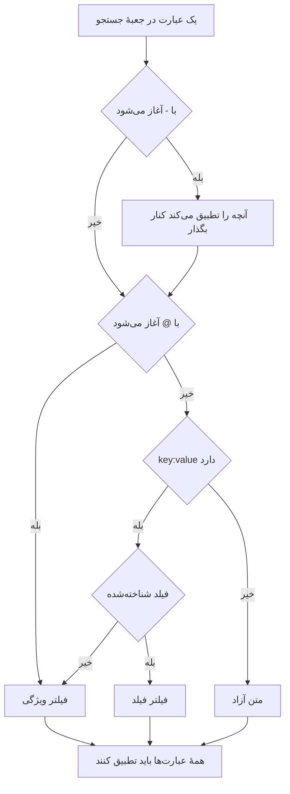

# نحو جستجو

جعبهٔ جستجوی بالای کاوشگرهای لاگ‌ها، ترِیس‌ها، متریک‌ها و استثناها یک زبان پرس‌وجو را می‌فهمد. پرس‌وجو فهرستی از فیلترهاست که با فاصله از هم جدا شده‌اند، و **هر فیلتر باید برقرار باشد** — میان فیلترها هیچ OR ضمنی وجود ندارد. هنگام جستجو از این صفحه به‌عنوان مرجع استفاده کنید.

:::cards
- [دو گونه فیلتر](#دو-گونه-فیلتر): فیلدهای داخلی، ویژگی‌ها و متن آزاد.
- [تطبیق مقادیر](#تطبیق-مقادیر): جانشین‌ها، دربرداشتن، مقایسه‌ها و فهرست‌ها.
- [کنار گذاشتن](#کنار-گذاشتن): هر فیلتری را با یک `-` در ابتدایش وارونه کنید.
- [فیلدها به تفکیک سیگنال](#فیلدها-به-تفکیک-سیگنال): در هر کاوشگر بر چه چیزهایی می‌توانید فیلتر کنید.
:::

## پرس‌وجو چگونه خوانده می‌شود

```text
severity:error @platform.team:a* -@http.method:GET timeout
```

این چنین خوانده می‌شود: لاگ‌های سطح خطا که ویژگی `platform.team` آن‌ها با `a` آغاز می‌شود، ویژگی `http.method` آن‌ها `GET` نیست، و پیامشان به `timeout` اشاره می‌کند.

| عبارت | گونه | با چه تطبیق می‌کند |
| --- | --- | --- |
| `severity:error` | فیلد | شدت لاگ Error است. |
| `@platform.team:a*` | ویژگی | ویژگی `platform.team` با `a` آغاز می‌شود. |
| `-@http.method:GET` | ویژگی کنارگذاشته | ویژگی `http.method` هر چیزی جز `GET` است. |
| `timeout` | متن آزاد | پیام `timeout` را دربر دارد. |

هر عبارتِ جداشده با فاصله جداگانه خوانده می‌شود و سپس همه با AND ترکیب می‌شوند:



## دو گونه فیلتر

| شکل | چه چیزی را فیلتر می‌کند | نمونه |
| --- | --- | --- |
| `field:value` | یک فیلد داخلیِ سیگنال | `severity:error` |
| `@attribute:value` | یک ویژگی OpenTelemetry روی سطر | `@http.status_code:500` |
| واژه‌های تنها | پیام (لاگ‌ها)، نام span (ترِیس‌ها)، نام متریک (متریک‌ها) یا پیام استثنا (استثناها) | `connection refused` |

یک `key:value` تنها که کلیدش فیلد شناخته‌شده‌ای نیست ویژگی در نظر گرفته می‌شود، پس `k8s.pod:api-0` و `@k8s.pod:api-0` یک معنا دارند. پیشوند `@` همیشه یعنی «در ویژگی‌ها بگرد»، با یک استثنا: در کاوشگر استثناها، `@type:`، `@service:`، `@env:` و `@class:` همچنان همان فیلدها را فیلتر می‌کنند.

متنی که فقط اتفاقاً دونقطه دارد متن می‌ماند — `https://example.com` و `12:30` به‌عنوان واژه جستجو می‌شوند و فیلتر خوانده نمی‌شوند.

## تطبیق مقادیر

هرچه در این جدول است روی هر ویژگی و بیشتر فیلدهای داخلی کار می‌کند؛ [فیلدها به تفکیک سیگنال](#فیلدها-به-تفکیک-سیگنال) فیلدهایی را که مقدار را ساده‌تر می‌خوانند مشخص می‌کند.

| آنچه می‌نویسید | با چه تطبیق می‌کند |
| --- | --- |
| `@k:abc` | دقیقاً `abc` |
| `@k:a*` | هر چیزی که با `a` آغاز شود — `abc`، `alpha` |
| `@k:*c` | هر چیزی که به `c` ختم شود |
| `@k:a*c` | با `a` آغاز و به `c` ختم شود |
| `@k:a?c` | `?` دقیقاً یک نویسه است — `abc`، `axc`، اما نه `ac` |
| `@k:*` | ویژگی وجود دارد و خالی نیست |
| `@k:~abc` | هر جایی `abc` را دربر دارد |
| `@k:!abc` | هر چیزی جز `abc` |
| `@k:>100` | بزرگ‌تر از ۱۰۰. همچنین `>=`، `<`، `<=` |
| `@k:(a OR b)` | هرکدام از دو مقدار. `@k:[a, b]` همین است |
| `@k:(a* OR b*)` | هرکدام از دو الگو |

تطبیق جانشین و «دربر دارد» بزرگی و کوچکی حروف را نادیده می‌گیرند؛ تطبیق دقیق نه، چون با مقدار دقیقاً همان‌طور که ذخیره شده مقایسه می‌شود.

### مقادیر دارای فاصله

مقدار را در گیومهٔ دوتایی بگذارید:

```text
name:"SELECT wp_options"
@k8s.container.name:"my container"
```

گیومه‌ها از **فاصله‌ها** محافظت می‌کنند، نه از جانشین‌ها — `@k:"a b*"` همچنان با هر چیزی که با `a b` آغاز شود تطبیق می‌کند.

### `*`، `?` و دیگر نشانه‌های نگارشی به‌صورت تحت‌اللفظی

بک‌اسلش نویسهٔ بعدی را تحت‌اللفظی می‌کند:

| آنچه می‌نویسید | با چه تطبیق می‌کند |
| --- | --- |
| `@k:a\*b` | دقیقاً `a*b` |
| `@k:\~abc` | دقیقاً `~abc` |
| `@k:\>5` | دقیقاً `>5` |

مقادیری که `%` یا `_` دارند به گریز نیازی ندارند — همیشه تحت‌اللفظی‌اند.

## کنار گذاشتن

یک `-` در ابتدا هر فیلتری را وارونه می‌کند، از جمله فیلترهای بالا:

| آنچه می‌نویسید | با چه تطبیق می‌کند |
| --- | --- |
| `-severity:debug` | همه‌چیز جز debug |
| `-@platform.team:a*` | هر سطری که `platform.team` آن با `a` آغاز **نشود**، از جمله سطرهایی که اصلاً `platform.team` ندارند |
| `-@k:*` | ویژگی وجود ندارد یا خالی است |
| `-@k:(a OR b)` | هیچ‌کدام از دو مقدار |
| `-@k:>100` | ۱۰۰ یا کمتر |
| `-@k:~abc` | `abc` را دربر ندارد |

در کاوشگر ترِیس‌ها، `-` فقط ویژگی‌ها را کنار می‌گذارد. `-status:error` به‌عنوان متنی برای یافتن در نام spanها خوانده می‌شود و چیزی پیدا نمی‌کند؛ به‌جای آن مقادیری را که می‌خواهید مشخص کنید، مانند `status:(ok OR unset)`.

## فیلدها به تفکیک سیگنال

نام فیلدها به بزرگی و کوچکی حروف حساس نیستند: `statusMessage:` و `statusmessage:` یک فیلدند.

### لاگ‌ها

| فیلد | نام‌های مستعار | یادداشت‌ها |
| --- | --- | --- |
| `severity` | `level` | `fatal`، `error`، `warning` (یا `warn`)، `info` (یا `information`)، `debug`، `trace`، `unspecified` — با هر بزرگی و کوچکی |
| `service` | | نام سرویس، به‌طور کامل و با هر بزرگی و کوچکی |
| `trace` | | شناسهٔ ترِیس |
| `span` | | شناسهٔ span |
| `message` | `msg`، `log`، `body` | خط لاگ. واژه‌های تنها هم همین را جستجو می‌کنند |

### ترِیس‌ها

فیلدهای ترِیس یک مقدار ساده یا فهرستی از نوع «هرکدام از» مانند `status:(ok OR unset)` می‌پذیرند، و `duration` افزون بر این `>` و `<` را هم می‌پذیرد. جانشین‌ها، `~`، `!` و `-` در ابتدا اینجا فقط روی ویژگی‌ها کار می‌کنند.

| فیلد | یادداشت‌ها |
| --- | --- |
| `service` | نام سرویس |
| `name` | نام span. یک مقدار با هر بخشی از آن تطبیق می‌کند. واژه‌های تنها هم همین را جستجو می‌کنند |
| `status` | `ok`، `error`، `unset` (unset = هیچ وضعیت خطایی تنظیم نشده است، پیش‌فرض OpenTelemetry) |
| `kind` | `server`، `client`، `producer`، `consumer`، `internal` |
| `duration` | میلی‌ثانیه: `duration:>500`، `duration:<200` یا یک مقدار دقیق |
| `statusMessage` | متن پیام وضعیت. یک مقدار با هر بخشی از آن تطبیق می‌کند |
| `hasException` | `true` یا `false` |
| `trace`، `span` | شناسه‌ها |

### متریک‌ها

| فیلد | یادداشت‌ها |
| --- | --- |
| `name` | نام متریک. یک مقدار ساده با هر بخشی از آن تطبیق می‌کند، پس `name:http.server` متریک `http.server.request.duration` را پیدا می‌کند. واژه‌های تنها هم همین را جستجو می‌کنند |
| `service` | نام سرویس. یک مقدار ساده با هر بخشی از آن تطبیق می‌کند |

### استثناها

| فیلد | نام‌های مستعار | یادداشت‌ها |
| --- | --- | --- |
| `type` | `exceptionType` | نوع استثنا، برای نمونه `type:TypeError` |
| `env` | `environment` | محیط، از ویژگی منبع `deployment.environment` |
| `service` | | نام سرویس. یک مقدار ساده با هر بخشی از آن تطبیق می‌کند |
| `class` | `errorClass` | خطا تقصیر کیست: `code-fault`، `user-error`، `expected-denial`، `infrastructure` یا `unknown` |

واژه‌های تنها پیام استثنا را جستجو می‌کنند.

کاوشگر **Security Events** همین زبان را با فیلدهای خودش به کار می‌برد، مانند `severity`، `tactic` و `user` — [رویدادهای امنیتی](/docs/telemetry/security-events) را ببینید.

## ترکیب فیلترها

فیلترها با AND ترکیب می‌شوند. می‌توان `AND` را میانشان نوشت و چیزی را تغییر نمی‌دهد:

```text
severity:error service:api          # both must hold
severity:error AND service:api      # identical
```

**میان** فیلترها هیچ OR یا NOT وجود ندارد: `OR` و `NOT` نوشته‌شده در آنجا نادیده گرفته می‌شوند، پس `NOT severity:debug` همان معنای `severity:debug` را دارد. با یک `-` در ابتدا کنار بگذارید (`-severity:debug`)، و برای تطبیق یک کلید با هرکدام از دو مقدار، از شکل «هرکدام از» استفاده کنید:

```text
@http.method:(GET OR POST)
```

دو فیلتر روی یک کلید با AND ترکیب می‌شوند، و بازه یا الگوی دوطرفه همین‌گونه نوشته می‌شود:

```text
@http.status_code:>=500 @http.status_code:<=599
@k:a* @k:*z
```

## نشان‌ها و جعبهٔ جستجو

زدن Enter روی یک عبارت `key:value` آن را اعمال می‌کند، معمولاً به‌صورت نشانی بالای نتایج. نشان مقدار را دقیقاً همان‌طور که نوشته شده حمل می‌کند، پس جانشین جانشین می‌ماند. عبارتی که نشان نمی‌تواند حمل کند، مانند یک `-key:value` کنارگذاشته، در جعبهٔ جستجو می‌ماند و از همان‌جا فیلتر می‌کند. کلیک روی مقداری در نوار کناری وجه‌ها همان نوع نشان را با مقدار گریزخورده می‌افزاید — مقدار ذخیره‌شده‌ای که اتفاقاً `*` دارد برای همان مقدار تحت‌اللفظی فیلتر می‌کند، نه به‌عنوان الگو.

نشان‌ها بخشی از نمای ذخیره‌شده و نشانی صفحه‌اند، پس فیلتر پس از تازه‌سازی، در نشانک و در پیوند اشتراکی باقی می‌ماند.

## نکته‌ها

- **کلیدهای** ویژگی برای فیلترهای جانشین، «دربر دارد» و پیشوند/پسوند بدون حساسیت به بزرگی و کوچکی حروف تطبیق می‌شوند، پس لازم نیست به یاد بیاورید که به‌صورت `requestId` دریافت شده یا `requestid`.
- فیلتر `-@k:...` با سطرهایی که هرگز آن ویژگی را نداشته‌اند هم تطبیق می‌کند — سطری که اصلاً `platform.team` ندارد بدیهی است که با `a` آغاز نمی‌شود.
- مقایسه‌های عددی روی مقادیر ویژگی که به‌صورت متن ذخیره شده‌اند کار می‌کنند؛ مقداری که عدد نیست هرگز شرط مقایسه را برآورده نمی‌کند.

## گام‌های بعدی

:::cards
- [بزرگ‌نمایی یک بازه زمانی](/docs/telemetry/charts-and-time-ranges): کاوشگرها را به لحظهٔ مهم محدود کنید.
- [خط‌های لوله لاگ](/docs/telemetry/log-pipelines): بخش‌هایی از خط لاگ را به ویژگی‌های قابل جستجو تبدیل کنید.
- [مانیتور لاگ‌ها](/docs/monitor/logs-monitor): وقتی لاگ‌هایی که جستجو می‌کنید ظاهر شدند هشدار بگیرید.
- [OpenTelemetry](/docs/telemetry/open-telemetry): لاگ، متریک و ترِیس بفرستید تا جستجو کنید.
:::
