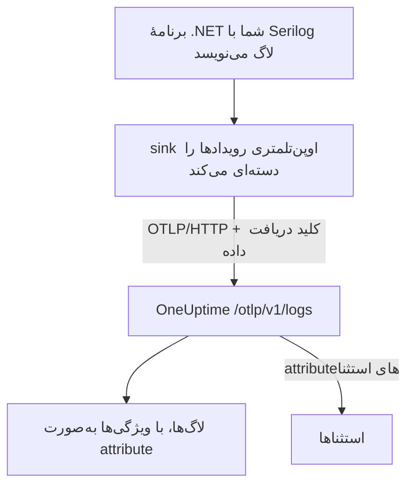

# Serilog (.NET)

[Serilog](https://serilog.net) پرکاربردترین کتابخانهٔ لاگ‌نویسی ساختاریافته برای .NET است. با sink رسمی [`Serilog.Sinks.OpenTelemetry`](https://github.com/serilog/serilog-sinks-opentelemetry)، هر رویدادی که برنامهٔ شما با Serilog ثبت می‌کند از راه OpenTelemetry Protocol (OTLP) به OneUptime فرستاده می‌شود و با ویژگی‌های ساختاریافته، شدت و پیوندش به ترِیس در **محصولات → لاگ‌ها** قابل جستجو می‌شود.

لازم نیست بستهٔ ویژهٔ OneUptime نصب کنید: sink با همان نقطهٔ پایانی OTLP کار می‌کند که OneUptime برای همهٔ داده‌های OpenTelemetry فراهم کرده است. این روش برای برنامه‌های کنسولی، سرویس‌های worker، برنامه‌های ASP.NET Core و هر چیز دیگری که روی .NET اجرا می‌شود کار می‌کند.

:::cards
- [راه‌اندازی sink](#راهاندازی-sink): دو بسته را نصب کنید و آن‌ها را در کد یا در `appsettings.json` پیکربندی کنید.
- [استثناها](#استثناها): استثناهای ثبت‌شده در استثناها به مسئله تبدیل می‌شوند.
- [عیب‌یابی](#عیبیابی): وقتی هیچ لاگی نمی‌رسد چه چیزهایی را بررسی کنید.
:::

## چگونه کار می‌کند



sink رویدادهای لاگ را دسته‌ای می‌کند و در پس‌زمینه می‌فرستد. هر ویژگی نام‌دار به یک attribute لاگ تبدیل می‌شود، و استثنایی که با Serilog ثبت شده باشد با attributeهایی می‌رسد که OneUptime از آن‌ها یک مسئله می‌سازد.

## پیش از شروع

- یک پروژهٔ OneUptime. در OneUptime Cloud هزینهٔ تله‌متری بر پایهٔ هر گیگابایت دریافت‌شده محاسبه می‌شود ([قیمت‌ها](https://oneuptime.com/pricing) را ببینید)، و پروژه‌ای که روی پلن Free است پیش از ارسال تله‌متری به یک روش پرداخت نیاز دارد.
- یک برنامهٔ .NET که از Serilog استفاده می‌کند یا می‌تواند استفاده کند.
- یک کلید دریافت دادهٔ تله‌متری برای احراز هویت لاگ‌هایتان. اگر ندارید:

:::steps
### کلیدهای دریافت داده را باز کنید

به **محصولات → تنظیمات پروژه** بروید، در منوی کناری **تله‌متری و APM** را باز کنید و **کلیدهای دریافت داده** را برگزینید.


### یک کلید بسازید

روی **ساخت کلید دریافت داده** کلیک کنید. در پنجره، نام کلید از پیش پر شده و **سرور** انتخاب شده است، یعنی همان نوع کلیدی که برنامه‌ها و Collectorها با آن داده می‌فرستند؛ پس برای ساختن کلید روی **ساخت کلید دریافت داده** کلیک کنید، یا پیش از آن نامش را تغییر دهید.

### کلید محرمانه را کپی کنید

کلید تازه در صفحهٔ خودش باز می‌شود. **کلید محرمانه** آن را کپی کنید: این همان `YOUR_TELEMETRY_INGESTION_TOKEN` در نمونه‌های زیر است.


:::

## آنچه از OneUptime لازم دارید

| تنظیم | مقدار |
| ------------- | ------------------------------------------------------------ |
| نقطهٔ پایانی OTLP | `https://oneuptime.com/otlp` |
| سرآیند احراز هویت | `x-oneuptime-token: YOUR_TELEMETRY_INGESTION_TOKEN` |
| نام سرویس | نامی که سرویس شما باید با آن نمایش داده شود، برای نمونه `my-service` |

> [!NOTE]
> OneUptime را خودتان میزبانی می‌کنید؟ به‌جای `https://oneuptime.com/otlp` از `https://YOUR-ONEUPTIME-HOST/otlp` استفاده کنید (یا `http://...` اگر TLS را خاتمه نمی‌دهید). بقیهٔ چیزها همان می‌ماند.

وقتی پروتکل روی `HttpProtobuf` باشد، sink مسیر `/v1/logs` را به نقطهٔ پایانی اضافه می‌کند، پس نشانی نهایی‌ای که به آن می‌فرستد `https://oneuptime.com/otlp/v1/logs` است. فقط کافی است نقطهٔ پایانی پایهٔ `/otlp` را بدهید.

## راه‌اندازی sink

:::steps
### بسته‌های NuGet را نصب کنید

Serilog و sink اوپن‌تلمتری را به پروژه‌تان اضافه کنید:

```bash
dotnet add package Serilog
dotnet add package Serilog.Sinks.OpenTelemetry
```

اگر sink را از `appsettings.json` پیکربندی می‌کنید، `Serilog.Settings.Configuration` را هم اضافه کنید. برای برنامه‌های ASP.NET Core بستهٔ `Serilog.AspNetCore` را اضافه کنید که Serilog را به میزبان و خط لولهٔ درخواست‌ها وصل می‌کند:

```bash
dotnet add package Serilog.Settings.Configuration
dotnet add package Serilog.AspNetCore
```

### sink را پیکربندی کنید

sink را به سمت نقطهٔ پایانی OTLP در OneUptime بفرستید، پروتکل را روی `HttpProtobuf` بگذارید، توکن دریافت داده را به‌صورت سرآیند بدهید و به لاگ‌ها یک `service.name` بزنید. آن را در کد، در `appsettings.json` یا در میزبان ASP.NET Core پیکربندی کنید:

:::tabs
@tab در کد
```csharp title="Program.cs"
using Serilog;
using Serilog.Sinks.OpenTelemetry;

Log.Logger = new LoggerConfiguration()
    .MinimumLevel.Information()
    .Enrich.FromLogContext()
    .WriteTo.Console() // optional: keep local logs too
    .WriteTo.OpenTelemetry(options =>
    {
        // Base OTLP endpoint. The sink appends /v1/logs automatically.
        options.Endpoint = "https://oneuptime.com/otlp";
        options.Protocol = OtlpProtocol.HttpProtobuf;

        // Authenticate with your OneUptime telemetry ingestion token.
        options.Headers = new Dictionary<string, string>
        {
            ["x-oneuptime-token"] = "YOUR_TELEMETRY_INGESTION_TOKEN"
        };

        // Identify your service in OneUptime.
        options.ResourceAttributes = new Dictionary<string, object>
        {
            ["service.name"] = "my-service",
            ["deployment.environment"] = "production"
        };
    })
    .CreateLogger();

try
{
    Log.Information("Application starting up");
    // ... your application code ...
}
finally
{
    // Flush any buffered logs before the process exits.
    Log.CloseAndFlush();
}
```
@tab appsettings.json
تنظیمات sink را در `appsettings.json` بگذارید:

```json title="appsettings.json"
{
  "Serilog": {
    "Using": ["Serilog.Sinks.OpenTelemetry"],
    "MinimumLevel": "Information",
    "WriteTo": [
      {
        "Name": "OpenTelemetry",
        "Args": {
          "endpoint": "https://oneuptime.com/otlp",
          "protocol": "HttpProtobuf",
          "headers": {
            "x-oneuptime-token": "YOUR_TELEMETRY_INGESTION_TOKEN"
          },
          "resourceAttributes": {
            "service.name": "my-service",
            "deployment.environment": "production"
          }
        }
      }
    ]
  }
}
```

سپس logger را از روی پیکربندی بسازید:

```csharp title="Program.cs"
using Serilog;
using Microsoft.Extensions.Configuration;

IConfiguration configuration = new ConfigurationBuilder()
    .AddJsonFile("appsettings.json")
    .Build();

Log.Logger = new LoggerConfiguration()
    .ReadFrom.Configuration(configuration)
    .CreateLogger();
```
@tab ASP.NET Core
برای ASP.NET Core (میزبانی مینیمال در .NET 6 و بالاتر) از `Serilog.AspNetCore` استفاده کنید تا Serilog جای logger پیش‌فرض را بگیرد و لاگ‌های فریم‌ورک و درخواست‌ها را هم ثبت کند:

```csharp title="Program.cs"
using Serilog;
using Serilog.Sinks.OpenTelemetry;

var builder = WebApplication.CreateBuilder(args);

builder.Host.UseSerilog((context, services, configuration) =>
{
    configuration
        .ReadFrom.Configuration(context.Configuration)
        .Enrich.FromLogContext()
        .WriteTo.OpenTelemetry(options =>
        {
            options.Endpoint = "https://oneuptime.com/otlp";
            options.Protocol = OtlpProtocol.HttpProtobuf;
            options.Headers = new Dictionary<string, string>
            {
                ["x-oneuptime-token"] = "YOUR_TELEMETRY_INGESTION_TOKEN"
            };
            options.ResourceAttributes = new Dictionary<string, object>
            {
                ["service.name"] = "my-service"
            };
        });
});

var app = builder.Build();

// Logs one summary event per HTTP request.
app.UseSerilogRequestLogging();

app.MapGet("/", () => "Hello World");
app.Run();
```
:::

> [!IMPORTANT]
> sink رویدادهای لاگ را دسته‌ای می‌کند و به‌صورت ناهمگام می‌فرستد. همیشه پیش از بسته شدن برنامه `Log.CloseAndFlush()` را فراخوانی کنید (یا logger را dispose کنید)، وگرنه ممکن است آخرین دستهٔ لاگ‌ها از دست برود. در ASP.NET Core، `Serilog.AspNetCore` هنگام خاموشی عادی این کار را برایتان انجام می‌دهد.

> [!TIP]
> توکن را از کنترل نسخه دور نگه دارید. آن را از یک متغیر محیطی یا یک انبار رمزها بخوانید و هنگام راه‌اندازی به پیکربندی بدهید، نه اینکه در `appsettings.json` کامیت کنید.

### لاگ بنویسید

مثل همیشه از Serilog استفاده کنید. ویژگی‌های ساختاریافته حفظ می‌شوند و در OneUptime به attributeهای قابل جستجو تبدیل می‌شوند:

```csharp
Log.Information("Order {OrderId} placed by {CustomerId} for {Amount:C}",
    orderId, customerId, amount);

Log.Warning("Payment gateway slow: {LatencyMs}ms", latencyMs);
```

هر ویژگی نام‌دار (`OrderId`، `CustomerId`، `Amount`، `LatencyMs`) به‌صورت یک attribute لاگ فرستاده می‌شود، پس می‌توانید در کاوشگر **محصولات → لاگ‌ها** بر پایهٔ آن‌ها فیلتر و جستجو کنید.

### بررسی کنید لاگ‌ها می‌رسند

برنامه را اجرا کنید و چند رویداد لاگ بنویسید. در چند ثانیه، آن‌ها در **محصولات → لاگ‌ها** و در صفحهٔ سرویس شما زیر **محصولات → سرویس‌ها** نمایش داده می‌شوند؛ نام سرویس همان `service.name` است که تنظیم کرده‌اید (`my-service`). ویژگی‌های ساختاریافتهٔ آن‌ها به‌عنوان فیلتر در دسترس است.
:::

## استثناها

وقتی با Serilog یک استثنا ثبت می‌کنید، sink attributeهای OpenTelemetry یعنی `exception.type`، `exception.message` و `exception.stacktrace` را به رکورد لاگ پیوست می‌کند:

```csharp
try
{
    ProcessPayment();
}
catch (Exception ex)
{
    Log.Error(ex, "Failed to process payment for order {OrderId}", orderId);
}
```

OneUptime این attributeها را تشخیص می‌دهد و خطا را بر پایهٔ اثرانگشت، به‌صورت یک مسئله در **استثناها** گروه‌بندی می‌کند و به سرویس درست نسبت می‌دهد. خطایی که هم یک ترِیس و هم یک لاگ گزارش کنند، در یک مسئلهٔ واحد ادغام می‌شود. برای جزئیات شیوهٔ تشخیص، [استثناها از لاگ‌ها](/docs/telemetry/open-telemetry#استثناها-از-لاگها) را ببینید.

## پیوند با ترِیس‌ها

اگر برنامهٔ شما برای ترِیس‌ها با OpenTelemetry .NET SDK هم ابزارگذاری شده باشد، رویدادهای Serilog که درون یک span فعال تولید می‌شوند به‌طور خودکار `TraceId` و `SpanId` فعلی را می‌گیرند (این بخشی از `IncludedData` پیش‌فرض sink است). به این ترتیب OneUptime می‌تواند یک خط لاگ را مستقیم به ترِیسی که در آن رخ داده پیوند دهد، و شما می‌توانید از یک لاگ به درخواست پیرامونش بروید و برگردید.

برای فرستادن ترِیس‌ها و متریک‌ها هم، راه‌اندازی .NET را در [شروع سریع OpenTelemetry](/docs/telemetry/open-telemetry#شروع-سریع) ببینید.

## عیب‌یابی

:::details هیچ لاگی نمایش داده نمی‌شود
مقدار `x-oneuptime-token` را دوباره بررسی کنید و مطمئن شوید به پروژه‌ای که می‌بینید تعلق دارد. بررسی کنید نقطهٔ پایانی `https://oneuptime.com/otlp` باشد (فقط مسیر پایه؛ خودتان `/v1/logs` را اضافه نکنید). برای دیدن علت شکست sink، هنگام راه‌اندازی خروجی خطای خود Serilog را با `Serilog.Debugging.SelfLog.Enable(Console.Error)` روشن کنید: کد وضعیتی را که OneUptime برگردانده چاپ می‌کند.
:::

:::details لاگ‌ها فقط هنگام بسته شدن برنامه نمایش داده می‌شوند، یا آخرین لاگ‌ها گم می‌شوند
مطمئن شوید `Log.CloseAndFlush()` هنگام خاموشی اجرا می‌شود. sink رویدادها را دسته‌ای می‌کند، پس اگر فرایند بدون flush کشته شود، لاگ‌های بافرشده از دست می‌روند.
:::

:::details خطای 401 Unauthorized، و چیزی دریافت نمی‌شود
کلید وجود ندارد، ناشناخته است یا منقضی شده است. مطمئن شوید نام سرآیند دقیقاً `x-oneuptime-token` است و مقدارش **کلید محرمانه** آن کلید است.
:::

:::details خطای 402 یا 422، و چیزی دریافت نمی‌شود
`402`: در OneUptime Cloud، پروژه روی پلن Free است و روش پرداخت ندارد. یکی در **تنظیمات پروژه → صورت‌حساب و فاکتورها → صورت‌حساب** اضافه کنید. `422`: کلید غیرفعال است، یا کلید مرورگر است. **فعال** را در تنظیمات کلید دوباره روشن کنید، یا یک کلید **سرور** بسازید.
:::

:::details لاگ‌ها با نام سرویس نادرست می‌رسند
`service.name` را در `ResourceAttributes` (کد) یا `resourceAttributes` (appsettings.json) تنظیم کنید. بدون آن، لاگ‌هایتان به‌جای نام سرویس شما زیر نام موقتی ثبت می‌شوند که sink به‌جای آن می‌فرستد.
:::

:::details خطای اتصال به نمونهٔ خودمیزبان
مطمئن شوید پروتکل با طرح نقطهٔ پایانی شما (`https://` یا `http://`) جور است و میزبان OneUptime از سوی برنامه در دسترس است.
:::

اگر پرسشی دارید یا به کمک نیاز دارید، به support@oneuptime.com ایمیل بزنید.

## گام‌های بعدی

:::cards
- [OpenTelemetry](/docs/telemetry/open-telemetry): ترِیس‌ها و متریک‌ها را هم از .NET بفرستید.
- [خط‌های لوله لاگ](/docs/telemetry/log-pipelines): لاگ‌ها را هنگام رسیدن تجزیه و غنی کنید.
- [مانیتور لاگ‌ها](/docs/monitor/logs-monitor): وقتی لاگ‌های منطبق پیدا شدند هشدار بدهید.
- [نحو جستجو](/docs/telemetry/search-syntax): بر پایهٔ ویژگی‌های Serilog فیلتر کنید.
:::
