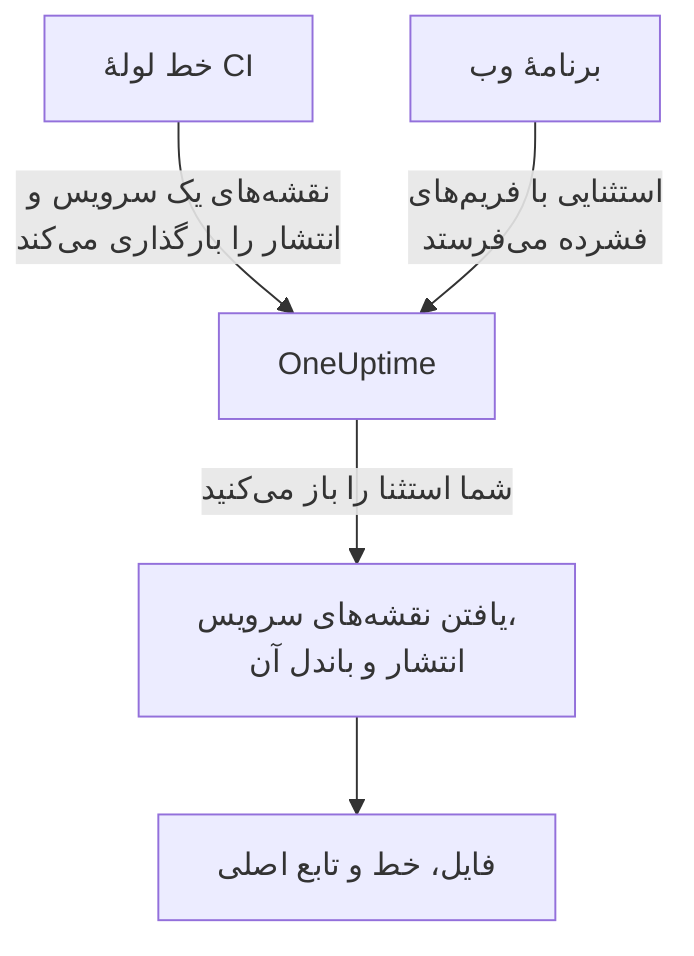

# نقشه‌های منبع

نقشه‌های منبع بیلد فرانت‌اند خود را در OneUptime بارگذاری کنید تا استثناهای مرورگر در **استثناها** نام فایل‌ها، خط‌ها و توابع اصلی شما را به‌جای نام‌های فشرده‌شده نشان دهند. این صفحه برای توسعه‌دهندگان فرانت‌اندی است که از پیش تله‌متری مرورگر را به OneUptime می‌فرستند.

:::cards
- [تطبیق چگونه کار می‌کند](#تطبیق-چگونه-کار-میکند): نام سرویس، انتشار و فایل باندل.
- [بارگذاری نقشه‌های منبع](#بارگذاری-نقشههای-منبع): یک درخواست `curl` از CI.
- [محدودیت‌ها](#محدودیتها): اندازه‌ها، شمارها و تنظیمات خودمیزبان.
- [مشاهدهٔ ردهای پشتهٔ بازگشایی‌شده](#مشاهدهٔ-ردهای-پشتهٔ-بازگشاییشده): یک فریم بازگشایی‌شده چگونه به نظر می‌رسد.
:::

## نمای کلی

باندل‌های فرانت‌اند در محیط عملیاتی فشرده (minify) شده‌اند، پس یک استثنای مرورگر که با SDK وب اپن‌تلمتری گرفته شده با فریم‌هایی مانند این می‌رسد:

```text
TypeError: Cannot read properties of undefined (reading 'id')
    at e.onSelect (https://app.example.com/assets/main.a8f1b2.js:1:48291)
```

نقشه‌های منبع بیلد خود را در OneUptime بارگذاری کنید تا داشبورد استثناها آن فریم‌ها را به فایل، خط و نام تابع اصلی بازگشایی کند — و اگر نقشه با `sourcesContent` ساخته شده باشد، خط‌های پیرامون منبع اصلی شما را هم نشان دهد.

نقشه‌ها از راه یک API احرازشده در OneUptime بارگذاری می‌شوند و **هرگز از سایت شما واکشی نمی‌شوند**، پس می‌توانید (و باید) همچنان با `hidden-source-map` (webpack) یا `sourcemap: 'hidden'` (Vite / Rollup) بیلد کنید و فایل‌های `.map` را هرگز کنار باندل‌هایتان منتشر نکنید.



## تطبیق چگونه کار می‌کند

نقشهٔ منبع با سه کلید ذخیره می‌شود:

| کلید | باید تطبیق کند با |
|---|---|
| نام سرویس | ویژگی منبع `service.name` در OpenTelemetry که برنامهٔ وب شما تله‌متری را با آن می‌فرستد |
| نسخهٔ سرویس | ویژگی منبع `service.version` (شناسهٔ انتشار شما) |
| مسیر باندل | فایل فشرده‌ای که نقشه برای آن ساخته شده، برای نمونه `main.a8f1b2.js` |

وقتی استثنایی را باز می‌کنید، OneUptime نقشه‌های بارگذاری‌شده برای سرویس و انتشار آن استثنا را پیدا می‌کند، هر فریم پشته را با نام فایل به یک باندل تطبیق می‌دهد (پسوند مسیر کافی است — `main.a8f1b2.js` با `https://app.example.com/assets/main.a8f1b2.js` تطبیق می‌کند)، و خط و ستون فشرده را از راه نقشه بازگشایی می‌کند. بازگشایی با تأخیر و هنگام مشاهدهٔ استثنا انجام می‌شود، هرگز در مسیر دریافت داده — پس نقشه‌ای که چند دقیقه *پس از* نخستین خطای یک انتشار تازه بارگذاری شود همچنان به‌طور عطف به ماسبق اعمال می‌شود.

## پیش از شروع

- یک کلید دریافت تله‌متری از نوع **سرور**، از **تنظیمات پروژه → تله‌متری و APM → کلیدهای دریافت داده**. [ساخت کلید دریافت داده](/docs/telemetry/open-telemetry#ساخت-کلید-دریافت-داده) را ببینید.
- یک برنامهٔ وب که از پیش با SDK وب اپن‌تلمتری استثناها را به OneUptime می‌فرستد — [راه‌اندازی مرورگر](/docs/rum/browser-setup) را ببینید.
- بیلدی که نقشهٔ منبع می‌نویسد، با `sourcesContent` (پیش‌فرض بیشتر باندلرها) اگر تکه‌های منبع را پیرامون هر فریم می‌خواهید.

## بارگذاری نقشه‌های منبع

:::steps
### `service.version` را با تله‌متری خود بفرستید

برنامهٔ وب شما باید `service.version` را بفرستد، و این باید همان رشته‌ای باشد که نقشه‌ها را با آن بارگذاری می‌کنید:

```javascript
import { resourceFromAttributes } from "@opentelemetry/resources";

const resource = resourceFromAttributes({
  "service.name": "my-web-app",
  "service.version": "1.4.2", // same value you upload maps with
});
```

هر شناسهٔ انتشار پایداری کار می‌کند — یک نسخهٔ معنایی، یک SHA کامیت git، یک شمارهٔ بیلد — به شرطی که `serviceVersion` بارگذاری‌شده و ویژگی منبع `service.version` یک رشته باشند.

### پس از هر بیلد عملیاتی نقشه‌ها را بارگذاری کنید

از CI بارگذاری کنید، با کلید دریافت داده در سرآیند `x-oneuptime-token`:

```bash
curl --fail -X POST "https://oneuptime.com/source-maps/v1/upload" \
  -H "x-oneuptime-token: YOUR_TELEMETRY_INGESTION_KEY" \
  -F "serviceName=my-web-app" \
  -F "serviceVersion=1.4.2" \
  -F "sourcemap=@dist/assets/main.a8f1b2.js.map" \
  -F "sourcemap=@dist/assets/vendor.9c3d4e.js.map"
```

در نصب‌های خودمیزبان، `oneuptime.com` را با میزبان OneUptime خود جایگزین کنید. `Authorization: Bearer YOUR_KEY` هم به‌جای سرآیند `x-oneuptime-token` پذیرفته می‌شود.

### بارگذاری را بررسی کنید

بارگذاری موفق یک بدنهٔ JSON با فهرست نقشه‌های ذخیره‌شده برمی‌گرداند، پس CI می‌تواند روی آن ادعا کند. نقشه‌ها در صفحهٔ **Source Maps** سرویس در OneUptime هم فهرست می‌شوند.
:::

یک گام معمول CI هر نقشه‌ای را که بیلد تولید کرده بارگذاری می‌کند:

```bash
VERSION="$(git rev-parse --short HEAD)"

find dist -name "*.js.map" -print0 | while IFS= read -r -d '' map; do
  curl --fail -X POST "https://oneuptime.com/source-maps/v1/upload" \
    -H "x-oneuptime-token: $ONEUPTIME_INGESTION_KEY" \
    -F "serviceName=my-web-app" \
    -F "serviceVersion=$VERSION" \
    -F "sourcemap=@$map"
done
```

### قواعد بارگذاری

- مسیر باندل هر فایل بارگذاری‌شده نام فایل آن است با حذف `.map` پایانی — `main.a8f1b2.js.map` می‌شود `main.a8f1b2.js`. اگر نام فایل نقشهٔ شما از این قرارداد پیروی نمی‌کند، در هر درخواست یک فایل بارگذاری کنید و فیلد `bundlePath` را صریحاً بفرستید.
- بارگذاری دوبارهٔ همان باندل برای همان سرویس و نسخه جای نقشهٔ پیشین را می‌گیرد، پس تلاش‌های دوبارهٔ CI بی‌خطرند.
- فایل‌ها باید JSON از نوع [source map v3](https://tc39.es/ecma426/) باشند (همان چیزی که هر باندلر امروزی تولید می‌کند — نقشه‌های نمایه‌دار با `sections` هم پشتیبانی می‌شوند).
- اگر گردانندهٔ نصب خودمیزبان شما دریافت تله‌متری را غیرفعال کرده باشد (`DISABLE_TELEMETRY_INGESTION`)، بارگذاری‌ها یک پاسخ موفق خالی برمی‌گردانند و چیزی ذخیره نمی‌شود — همان رفتاری که هر نقطهٔ پایانی دریافت تله‌متری در آن حالت دارد. بارگذاری واقعی همیشه یک بدنهٔ JSON با فهرست نقشه‌های ذخیره‌شده برمی‌گرداند، پس CI می‌تواند این دو را از هم تشخیص دهد.

## محدودیت‌ها

هر فایل `.map` می‌تواند تا ۵۰ MB باشد، اما ورودی **کل بدنهٔ درخواست** را هم به ۵۰ MB محدود می‌کند — پس نقشه‌های بزرگ را در هر درخواست یکی بارگذاری کنید. در هر درخواست تا ۵۰ فایل پذیرفته می‌شود، و یک انتشار (سرویس + نسخه) در مجموع حداکثر ۱٬۰۰۰ نقشه نگه می‌دارد؛ بارگذاری‌ای که از آن فراتر برود با پیامی که محدودیت را نام می‌برد رد می‌شود. بیلدی که بیش از ظرفیت یک درخواست نقشه تولید می‌کند کافی است چند درخواست بفرستد — بارگذاری‌های یک انتشار روی هم انباشته می‌شوند.

نصب‌های خودمیزبان می‌توانند این مقادیر را تغییر دهند. هر پنج مقدار متغیر محیطی معمولی‌اند، و چارت Helm آن‌ها را زیر `sourceMaps` در `values.yaml` در دسترس می‌گذارد:

| `values.yaml` | متغیر محیطی | پیش‌فرض |
| --- | --- | --- |
| `sourceMaps.maxMapsPerRelease` | `SOURCE_MAP_MAX_MAPS_PER_RELEASE` | `1000` |
| `sourceMaps.maxFilesPerRequest` | `SOURCE_MAP_MAX_FILES_PER_REQUEST` | `50` |
| `sourceMaps.maxFileSizeBytes` | `SOURCE_MAP_MAX_FILE_SIZE_BYTES` | `52428800` |
| `sourceMaps.maxBytesPerResolve` | `SOURCE_MAP_MAX_BYTES_PER_RESOLVE` | `536870912` |
| `sourceMaps.retentionDays` | `SOURCE_MAP_RETENTION_DAYS` | `90` |

اگر بیلد شما از پیش‌فرض بزرگ‌تر شد، مقداری که باید بالا ببرید `maxMapsPerRelease` است؛ این فقط محدودیتی بر شکل ذخیره‌سازی است، چون بار بازگشایی را `maxBytesPerResolve` محدود می‌کند نه شمار نقشه‌های یک انتشار. `maxFilesPerRequest` و `maxFileSizeBytes` را فقط می‌توان **پایین آورد** — بدنهٔ multipart پیش از احراز هویت درخواست تجزیه می‌شود، پس سقف‌های مشترکِ بالای آن‌ها همان چیزی است که فراخوانندهٔ احرازنشده به آن مقید است، و مقدار بزرگ‌تر به‌جای اعمال شدن تا سقف کاهش می‌یابد.

## مشاهدهٔ ردهای پشتهٔ بازگشایی‌شده

هر استثنایی را زیر **استثناها** در داشبورد باز کنید. فریم‌هایی که از راه نقشهٔ منبع بازگشایی شده‌اند نشان **Source mapped** دارند و نام تابع و محل فایل اصلی را نمایش می‌دهند؛ باز کردن یک فریم، تکهٔ منبع اصلی (وقتی نقشه `sourcesContent` دارد) را کنار محل فشرده نشان می‌دهد.

نقشه‌های بارگذاری‌شدهٔ یک سرویس را می‌توان در **محصولات → سرویس‌ها → سرویس شما → Source Maps** بازبینی و حذف کرد، که انتشار، باندل، اندازه و زمان بارگذاری هر نقشه را فهرست می‌کند.

## نگهداری

نقشه‌های منبع ۹۰ روز پس از بارگذاری نگه داشته و سپس خودکار حذف می‌شوند. یک نقشه فقط تا وقتی سودمند است که استثناهای انتشار آن درون پنجرهٔ نگهداری تله‌متری شما باشند، پس این دوره به‌راحتی از استثناهایی که بازگشایی می‌کند بیشتر دوام می‌آورد. اگر دوباره به نقشه‌های یک انتشار نیاز داشتید، آن‌ها را دوباره بارگذاری کنید.

## امنیت

- نقشه‌ها از راه یک نقطهٔ پایانی احرازشده بارگذاری و در پروژهٔ OneUptime شما ذخیره می‌شوند — هرگز از وب‌سایت شما واکشی نمی‌شوند، پس نقشه‌های منبع پنهان پنهان می‌مانند.
- محتوای خام نقشه (که اگر با `sourcesContent` ساخته شده باشد منبع اصلی شما را دربر دارد) را فقط مالکان و مدیران پروژه و هر کسی که مجوز **Read Telemetry Source Map** را دارد می‌توانند بازخوانی کنند. دیگر اعضای تیم فقط فریم‌های بازگشایی‌شده و چند خط منبع پیرامون محل هر خرابی را در استثناهایی می‌بینند که از پیش به آن‌ها دسترسی دارند.
- حذف یک سرویس نقشه‌های منبع آن را هم حذف می‌کند.

## رفع اشکال

:::details فریم‌ها هنوز فشرده‌اند
انتشار استثنا نقشهٔ تطبیق‌کننده‌ای ندارد. بررسی کنید که `service.version` ای که برنامه‌تان می‌فرستد دقیقاً همان `serviceVersion` ای باشد که با آن بارگذاری کرده‌اید، که `serviceName` با `service.name` تطبیق کند، و که برای آن فایل باندل نقشه‌ای بارگذاری شده باشد: صفحهٔ **Source Maps** سرویس انتشار و باندل هر نقشه را فهرست می‌کند.
:::

:::details بارگذاری رد شد چون یک نقشه بیش از حد بزرگ است
یک نقشه می‌تواند تا ۵۰ MB باشد، و کل درخواست هم همین‌طور. نقشه‌های بزرگ را مانند حلقهٔ CI بالا، در هر درخواست یکی بارگذاری کنید.
:::

## گام‌های بعدی

:::cards
- [راه‌اندازی مرورگر](/docs/rum/browser-setup): ترِیس‌ها و استثناهای مرورگر را با SDK وب اپن‌تلمتری بفرستید.
- [مانیتور استثناها](/docs/monitor/exceptions-monitor): وقتی استثناهای تازه ظاهر شدند هشدار بگیرید.
- [OpenTelemetry](/docs/telemetry/open-telemetry): نقطه‌های پایانی، کلیدها و محدودیت‌های همهٔ تله‌متری.
:::
