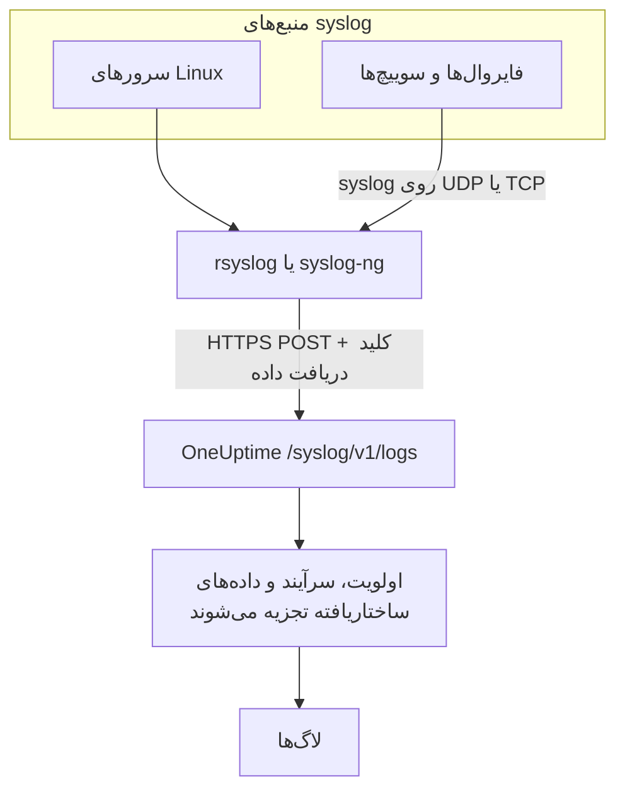

# Syslog

OneUptime، syslog را از راه HTTPS می‌پذیرد. پیام‌های RFC 5424 یا RFC 3164 را با کلید دریافت داده‌تان به `/syslog/v1/logs` بفرستید تا هرکدام به یک لاگ قابل جستجو تبدیل شود، با اولویت، facility، شدت، میزبان، برنامه و داده‌های ساختاریافته‌اش به‌صورت attribute. از آن برای ارسال از rsyslog، syslog-ng یا هر رله‌ای که بتواند درخواست HTTP بفرستد استفاده کنید.

:::cards
- [فرستادن یک پیام آزمایشی](#فرستادن-یک-پیام-آزمایشی): فقط یک درخواست `curl`.
- [ارسال از rsyslog](#ارسال-از-rsyslog): هرچه یک سرور یا رله دریافت می‌کند را بفرستید.
- [attributeهای تجزیه‌شده](#attributeهای-تجزیهشده): آنچه OneUptime از هر پیام بیرون می‌کشد.
- [عیب‌یابی](#عیبیابی): درخواست‌های ردشده و سرویس‌های نامنتظر.
:::

## چگونه کار می‌کند



OneUptime به‌محض اینکه پیام‌ها را از درخواست خواند پاسخ می‌دهد، و کمی بعد آن‌ها را تجزیه و ذخیره می‌کند. متن پیام در بدنهٔ لاگ می‌ماند و همهٔ چیزهای دیگر به attribute تبدیل می‌شوند.

> [!TIP]
> دستگاه‌های شبکه‌ای که با یک پراب OneUptime پایش می‌کنید می‌توانند syslog خود را بی‌واسطهٔ رله، از راه UDP مستقیم به پراب بفرستند؛ آنگاه لاگ‌ها روی همان دستگاه در OneUptime نمایش داده می‌شوند. [راهنماهای سازندگان تجهیزات شبکه (Sophos، Extreme، Cambium)](/docs/monitor/network-vendor-guides) را ببینید.

## پیش از شروع

- **یک پروژهٔ OneUptime** – در OneUptime Cloud هزینهٔ تله‌متری بر پایهٔ هر گیگابایت دریافت‌شده محاسبه می‌شود، و پروژه‌ای که روی پلن Free است پیش از ارسال تله‌متری به یک روش پرداخت نیاز دارد.
- **کلید دریافت دادهٔ تله‌متری** – یک کلید **سرور** در **محصولات → تنظیمات پروژه → تله‌متری و APM → کلیدهای دریافت داده** بسازید و **کلید محرمانه** آن را کپی کنید. آن را در سرآیند `x-oneuptime-token` می‌فرستید.
- **ابزار ارسال syslog** – هر ابزاری که بتواند درخواست HTTP POST بفرستد (برای نمونه `curl`، `rsyslog` از راه `omhttp`، یا `syslog-ng` با مقصد HTTP خودش).
- **نام سرویس (اختیاری)** – سرآیند `x-oneuptime-service-name` را تنظیم کنید تا لاگ‌های ورودی زیر یک سرویس تله‌متری مشخص گروه‌بندی شوند. اگر آن را نگذارید، OneUptime به‌ترتیب از `APP-NAME` در syslog، نام میزبان یا `Syslog` استفاده می‌کند.

## نقطهٔ پایانی

```http
POST https://oneuptime.com/syslog/v1/logs
```

| سرآیند | الزامی | مقدار |
| --- | --- | --- |
| `x-oneuptime-token` | بله | کلید دریافت دادهٔ شما. |
| `Content-Type` | بله، برای بدنهٔ JSON | `application/json` |
| `x-oneuptime-service-name` | خیر | سرویسی که لاگ‌ها به آن تعلق دارند. |
| `Content-Encoding` | خیر | `gzip`، برای بدنهٔ فشرده. |

اگر OneUptime را خودتان میزبانی می‌کنید، به‌جای `oneuptime.com` میزبان خودتان را بنویسید.

## بدنهٔ درخواست

یک بار JSON با آرایهٔ `messages` بفرستید. هر دو قالب RFC 5424 و RFC 3164 (BSD) پشتیبانی می‌شوند و می‌توانید آن‌ها را در یک درخواست با هم بفرستید:

```json
{
  "messages": [
    "<34>1 2025-03-02T14:48:05.003Z web-01 nginx 7421 ID47 [env@32473 host=\"web-01\"] 502 on /api/login",
    "<13>Feb  5 17:32:18 db-01 postgres[2419]: connection received from 10.0.0.12"
  ]
}
```

### قالب‌های پشتیبانی‌شدهٔ بدنه

| بدنه | چگونه بفرستید |
| --- | --- |
| یک شیء JSON با آرایهٔ `messages` | `Content-Type: application/json`؛ پیشنهادشده. |
| یک آرایهٔ JSON از پیام‌ها | `Content-Type: application/json`. |
| یک شیء JSON با یک `message` | `Content-Type: application/json`. مقداری که چند خط دارد به‌صورت چند پیام خوانده می‌شود. |
| پیام‌هایی که با خط جدید از هم جدا شده‌اند | با gzip فشرده شده و با `Content-Encoding: gzip` فرستاده می‌شوند. |

بدنهٔ متن سادهٔ فشرده‌نشده با gzip خوانده نمی‌شود و درخواست با `400` رد می‌شود. بدنه‌ای که با gzip فشرده شده باشد همیشه به‌صورت پیام‌های جداشده با خط جدید خوانده می‌شود، پس بدنهٔ JSON را فشرده نکنید. هر درخواست را زیر ۱ مگابایت نگه دارید: ingress در OneUptime سقف پیش‌فرض nginx برای اندازهٔ بدنهٔ درخواست را برای این نقطهٔ پایانی بالا نمی‌برد.

## فرستادن یک پیام آزمایشی

```bash
curl \
  -X POST https://oneuptime.com/syslog/v1/logs \
  -H "Content-Type: application/json" \
  -H "x-oneuptime-token: YOUR_TELEMETRY_KEY" \
  -H "x-oneuptime-service-name: production-web" \
  -d '{
    "messages": [
      "<34>1 2025-03-02T14:48:05.003Z web-01 nginx 7421 ID47 [env@32473 host=\"web-01\"] 502 on /api/login"
    ]
  }'
```

پاسخ `200` یعنی پیام پذیرفته شده است. **محصولات → لاگ‌ها** را باز کنید: لاگ در سرویس `production-web` با بدنهٔ `502 on /api/login`، شدت `Error` و attributeهای بخش [attributeهای تجزیه‌شده](#attributeهای-تجزیهشده) نمایش داده می‌شود.

## ارسال از rsyslog

rsyslog با ماژول خروجی HTTP خود، `omhttp`، به OneUptime می‌فرستد.

:::steps
### مطمئن شوید `omhttp` در دسترس است

پیکربندی زیر آن را با `module(load="omhttp")` بارگذاری می‌کند. اگر rsyslog گزارش داد که نمی‌تواند ماژول را بارگذاری کند، بسته‌ای را که `omhttp` را برای توزیع شما فراهم می‌کند نصب کنید.

### مقصد OneUptime را اضافه کنید

فایل `/etc/rsyslog.d/oneuptime.conf` را بسازید. قالب، هر پیام را به‌صورت یک خط RFC 5424 بازسازی می‌کند و آن را در بدنهٔ JSON که OneUptime انتظار دارد می‌پیچد:

```text title="/etc/rsyslog.d/oneuptime.conf"
module(load="omhttp")

template(name="OneUptimeJson" type="string"
         string="{\"messages\":[\"<%PRI%>1 %TIMESTAMP:::date-rfc3339% %HOSTNAME% %APP-NAME% %PROCID% %MSGID% - %msg:::json%\"]}")

action(
  type="omhttp"
  server="oneuptime.com"
  serverport="443"
  usehttps="on"
  restpath="syslog/v1/logs"
  httpheaders=[
    "x-oneuptime-token: YOUR_TELEMETRY_KEY",
    "x-oneuptime-service-name: rsyslog-demo"
  ]
  template="OneUptimeJson"
)
```

`restpath` مسیر را بدون اسلش آغازین می‌گیرد. `omhttp` به‌طور پیش‌فرض یک `Content-Type` از نوع JSON می‌فرستد، که دقیقاً همان چیزی است که این قالب می‌سازد.

### پیکربندی را بررسی و rsyslog را دوباره راه‌اندازی کنید

```bash
sudo rsyslogd -N1
sudo systemctl restart rsyslog
```

`rsyslogd -N1` پیکربندی را بدون راه‌اندازی rsyslog اعتبارسنجی می‌کند. پس از راه‌اندازی دوباره، پیام‌های تازه در **محصولات → لاگ‌ها** در سرویس `rsyslog-demo` نمایش داده می‌شوند.
:::

این action هر پیامی را که rsyslog رسیدگی می‌کند ارسال می‌کند: برنامه‌های محلی، ژورنال systemd اگر rsyslog آن را بخواند، و هرچه از شبکه دریافت کند.

### رله کردن syslog دستگاه‌های شبکه

فایروال‌ها، سوییچ‌ها و دیگر دستگاه‌ها اغلب syslog را فقط از راه UDP یا TCP می‌فرستند. آن‌ها را به سمت یک رلهٔ rsyslog بفرستید و بگذارید رله از راه HTTPS ارسال کند. یک شنونده به پیکربندی رله، پیش از `action`، اضافه کنید:

```text title="/etc/rsyslog.d/oneuptime.conf"
module(load="imudp")
input(type="imudp" port="514")
```

`x-oneuptime-service-name` را روی نامی مانند `perimeter-firewall` بگذارید، یا سرآیند را حذف کنید تا لاگ‌های هر دستگاه بر پایهٔ نام میزبانش گروه‌بندی شوند. بسیاری از دستگاه‌ها پیام خود را به‌صورت جفت‌های `key=value` می‌نویسند؛ یک [Key=Value Parser](/docs/telemetry/log-pipelines#keyvalue-parser) آن‌ها را به attribute تبدیل می‌کند.

:::details فرستادن دسته‌ای به‌جای یک درخواست برای هر پیام
rsyslog می‌تواند پیام‌ها را دسته‌ای کند و با gzip فشرده کند، که OneUptime آن را به‌صورت پیام‌های جداشده با خط جدید می‌خواند. قالب و action را با این‌ها جایگزین کنید:

```text title="/etc/rsyslog.d/oneuptime.conf"
template(name="OneUptimeLine" type="string"
         string="<%PRI%>1 %TIMESTAMP:::date-rfc3339% %HOSTNAME% %APP-NAME% %PROCID% %MSGID% - %msg%")

action(
  type="omhttp"
  server="oneuptime.com"
  serverport="443"
  usehttps="on"
  restpath="syslog/v1/logs"
  httpheaders=["x-oneuptime-token: YOUR_TELEMETRY_KEY"]
  template="OneUptimeLine"
  batch="on"
  batch.format="newline"
  compress="on"
)
```

`compress="on"` را نگه دارید: OneUptime پیام‌های جداشده با خط جدید را فقط از بدنه‌ای که با gzip فشرده شده باشد می‌خواند.
:::

### ابزارهای ارسال دیگر

- **syslog-ng** – از مقصد HTTP آن با همان نشانی، همان سرآیندها و همان بدنهٔ JSON استفاده کنید.
- **Fluent Bit** – syslog را با ورودی `syslog` در Fluent Bit دریافت کنید و مثل هر لاگ دیگری ارسال کنید. [Fluent Bit](/docs/telemetry/fluentbit) را ببینید.

## attributeهای تجزیه‌شده

OneUptime به‌طور خودکار این attributeها را به هر ورودی لاگ اضافه می‌کند:

| attribute | مقدار | از پیام آزمایشی |
| --- | --- | --- |
| `syslog.priority` | اولویت، `<PRI>` | `34` |
| `syslog.facility.code`، `syslog.facility.name` | facility، برگرفته از اولویت | `4`، `security` |
| `syslog.severity.code`، `syslog.severity.name` | شدت، برگرفته از اولویت | `2`، `critical` |
| `syslog.version` | نسخهٔ RFC 5424 | `1` |
| `syslog.hostname` | `HOSTNAME` | `web-01` |
| `syslog.appName` | `APP-NAME`، یا برچسب RFC 3164 | `nginx` |
| `syslog.processId` | `PROCID` | `7421` |
| `syslog.messageId` | `MSGID` | `ID47` |
| `syslog.structured.raw` | دادهٔ ساختاریافتهٔ RFC 5424، همان‌گونه که فرستاده شده | `[env@32473 host="web-01"]` |
| `syslog.structured.*` | هر پارامتر دادهٔ ساختاریافته، به‌صورت تخت | `syslog.structured.env_32473.host` = `web-01` |
| `syslog.raw` | پیام اصلی، برای ردگیری | کل خط |

این attributeها در کاوشگر **محصولات → لاگ‌ها** قابل جستجو می‌شوند؛ برای نمونه `@syslog.severity.name:error` یا `@syslog.hostname:web-01`. [نحو جستجو](/docs/telemetry/search-syntax) را ببینید.

خود پیام در بدنهٔ لاگ می‌ماند. فایروال‌هایی مانند Sophos XGS و Fortinet FortiGate آن را به‌صورت جفت‌های `key=value` می‌نویسند (`log_component="IPSec" con_name="HQ-Branch1" status="Terminated"`)؛ برای اینکه این جفت‌ها هم به attribute تبدیل شوند، یک پردازشگر **Key=Value Parser** در یک [خط لولهٔ لاگ](/docs/telemetry/log-pipelines#keyvalue-parser) اضافه کنید.

### شدت

| شدت syslog | کد | شدت در OneUptime |
| --- | --- | --- |
| Emergency، Alert | `0`، `1` | `Fatal` |
| Critical، Error | `2`، `3` | `Error` |
| Warning | `4` | `Warning` |
| Notice، Informational | `5`، `6` | `Information` |
| Debug | `7` | `Debug` |
| پیام بدون اولویت | — | `Unspecified` |

پیامی که مُهر زمانی ندارد با زمانی ذخیره می‌شود که OneUptime آن را دریافت کرده است.

### سرویس

هر لاگ زیر یک سرویس تله‌متری ثبت می‌شود که OneUptime نخستین باری که داده‌ای برسد آن را می‌سازد. سرویس، نخستین مورد موجود از میان این‌هاست:

1. سرآیند `x-oneuptime-service-name`؛
2. `APP-NAME` پیام (یا برچسب آن)؛
3. نام میزبان پیام؛
4. `Syslog`.

## عیب‌یابی

:::details HTTP 401
کلید وجود ندارد، ناشناخته است یا منقضی شده است. بررسی کنید که سرآیند `x-oneuptime-token` **کلید محرمانه** یکی از کلیدهای دریافت دادهٔ پروژه‌ای را داشته باشد که باید لاگ‌ها را دریافت کند.
:::

:::details HTTP 402 یا 422
`402`: در OneUptime Cloud، پروژه روی پلن Free است و روش پرداخت ندارد. یکی در **تنظیمات پروژه → صورت‌حساب و فاکتورها → صورت‌حساب** اضافه کنید. `422`: کلید غیرفعال است، یا کلید مرورگر است. **فعال** را در تنظیمات کلید دوباره روشن کنید، یا یک کلید **سرور** بسازید.
:::

:::details HTTP 400، یا هیچ لاگی نمایش داده نمی‌شود
مطمئن شوید بدنهٔ درخواست واقعاً خط‌های syslog دارد، به‌صورت JSON با `Content-Type: application/json`. بدنه‌های خالی، و بدنه‌های متن ساده‌ای که با gzip فشرده نشده‌اند، با HTTP 400 رد می‌شوند.
:::

:::details HTTP 413
درخواست بزرگ‌تر از اندازه‌ای است که ingress می‌پذیرد. در هر درخواست پیام‌های کمتری بفرستید.
:::

:::details لاگ‌ها با نام سرویسی نامنتظر می‌رسند
`x-oneuptime-service-name` را تنظیم کنید تا منطق تشخیص پیش‌فرض، که نخست `APP-NAME` و سپس نام میزبان را به کار می‌برد، کنار گذاشته شود.
:::

## گام‌های بعدی

:::cards
- [خط‌های لوله لاگ](/docs/telemetry/log-pipelines): پیام‌های `key=value` را به attribute تجزیه کنید.
- [قواعد ضبط لاگ](/docs/telemetry/log-recording-rules): عددهای درون syslog را به متریک تبدیل کنید.
- [مانیتور لاگ‌ها](/docs/monitor/logs-monitor): وقتی پیام‌های syslog منطبق می‌رسند هشدار بدهید.
:::
