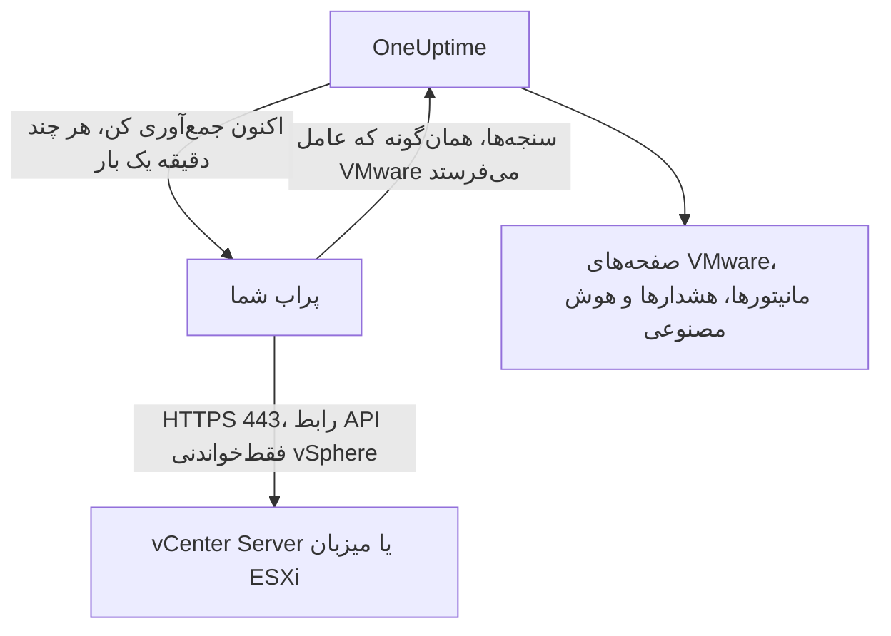

# VMware بدون عامل

یک vCenter Server یا یک میزبان ESXi مستقل را بدون نصب هیچ چیزی پایش کنید: نشانی vCenter و یک حساب فقط‌خواندنی را در OneUptime وارد کنید، پرابی را که به آن می‌رسد برگزینید، و پراب همان داده‌هایی را جمع‌آوری می‌کند که [عامل VMware](/docs/telemetry/vmware) جمع می‌کرد. هیچ عاملی برای نصب، ارتقا یا روشن نگه داشتن نیست، و هیچ ماشین جداگانه‌ای هم برای آماده‌سازی نیست.

:::cards
- [پیش از شروع](#پیش-از-شروع): پرابی که به vCenter برسد، و یک حساب فقط‌خواندنی.
- [اتصال یک vCenter](#اتصال-یک-vcenter): چهار فیلد، یک آزمایش و یک نام.
- [رفع اشکال](#رفع-اشکال): معنای هر پیام و آنچه آن را برطرف می‌کند.
:::

## چگونه کار می‌کند

پراب هر چند دقیقه یک بار با حسابی که ذخیره کرده‌اید وارد vCenter می‌شود، فهرست موجودی، شمارنده‌های کارایی و آمار vSAN را می‌خواند و آن‌ها را به OneUptime می‌فرستد. این داده‌ها دقیقاً همان‌گونه می‌رسند که داده‌های عامل VMware، پس هر صفحهٔ VMware، هر [مانیتور VMware](/docs/monitor/vmware-monitor)، هر الگوی هشدار و OneUptime AI آن‌ها را یکسان می‌خوانند. پراب نشست vCenter خود را میان جمع‌آوری‌ها نگه می‌دارد تا گزارش رویدادهای vCenter از ورودها پر نشود.

## پراب یا عامل؟

| | یک پراب (این صفحه) | عامل VMware |
|---|---|---|
| آنچه اجرا می‌کنید | پرابی که از پیش اجرا می‌کنید، یا یک پراب تازه | عامل، روی ماشینی جداگانه |
| جای نگهداری حساب | رمزگذاری‌شده در OneUptime، فقط برای پراب فرستاده می‌شود | در فایل `.env` عامل |
| آنچه باید به آن برسد | ‏vCenter روی TCP 443، از پراب | ‏vCenter روی TCP 443، از عامل |
| بزرگ‌ترین vCenter | حدود ۴۸ مبی‌بایت سنجه در هر جمع‌آوری | بدون محدودیت |
| ‏syslog ‏ESXi و عامل هوش مصنوعی | گنجانده نشده | گنجانده شده |

هر دو همان داده‌ها را می‌فرستند. هر زمان بخواهید می‌توانید یک vCenter را در صفحهٔ **تنظیمات** آن از یکی به دیگری ببرید.

## پیش از شروع

- **پرابی که بتواند روی TCP 443 به vCenter برسد.** معمولاً یک [پراب سفارشی](/docs/probe/custom-probe) در شبکهٔ vCenter است. در OneUptime Cloud، پراب‌های مشترک هرگز رمز عبور vCenter را دریافت نمی‌کنند، پس یک پراب از آنِ خودتان اضافه کنید. در یک نمونهٔ خودمیزبان، پراب‌های خودِ نمونه هم می‌توانند جمع‌آوری کنند.
- **یک کاربر vSphere با نقش Read-Only** روی شیء vCenter سطح بالا، با گزینهٔ **Propagate to children** تیک‌خورده. مراحل [ساخت کاربر فقط‌خواندنی vSphere](/docs/telemetry/vmware#ساخت-کاربر-فقطخواندنی-vsphere) را دنبال کنید: این همان حسابی است که عامل به کار می‌برد.

> [!IMPORTANT]
> بدون **Propagate to children**، کاربر وارد می‌شود اما چیزی نمی‌بیند، و پراب گزارش می‌دهد که حساب نمی‌تواند فهرست موجودی vCenter را بخواند.

## اتصال یک vCenter

:::steps
### فهرست vCenterها را باز کنید
در OneUptime، **VMware → همهٔ vCenterها** را باز کنید و روی **اتصال vCenter** کلیک کنید.

### نشانی و حساب را وارد کنید
نشانی‌ای را که vSphere Client را با آن باز می‌کنید وارد کنید، مانند `https://vcsa.example.com`، نام کاربری را همراه با دامنه‌اش، مانند `oneuptime@vsphere.local`، و رمز عبور آن را. پرابی را که به vCenter می‌رسد برگزینید.

### اتصال را بیازمایید
در گام بعد، روی **آزمایش اتصال** کلیک کنید. پراب وارد می‌شود، آنچه را حساب می‌تواند ببیند می‌خواند و خارج می‌شود، و نتیجه می‌گوید چند مرکز داده، خوشه، میزبان، ماشین مجازی و دیتااستور پیدا کرده است.

### به گواهی vCenter اعتماد کنید
‏vCenter به‌طور پیش‌فرض از گواهیِ مرجع خودش استفاده می‌کند که پراب به آن اعتماد ندارد. آن‌گاه آزمایش گواهی را نشان می‌دهد: اثر انگشت آن را با اثر انگشت خودِ vCenter مقایسه کنید، سپس روی **اعتماد به این گواهی** کلیک کنید.

### نام بگذارید و متصل کنید
نام به‌طور پیش‌فرض نام میزبان vCenter است. برای ذخیره، روی **اتصال vCenter** کلیک کنید.
:::

صفحهٔ **نمای کلی** vCenter کارت **جمع‌آوری داده** را نشان می‌دهد. این کارت تا نخستین جمع‌آوری، که ظرف یک دقیقه آغاز می‌شود، **در حال بررسی** و سپس **در حال جمع‌آوری** را نشان می‌دهد و فهرست موجودی پر می‌شود.

## گواهی‌ها

پراب هرگز بررسی گواهی را نادیده نمی‌گیرد. هر اتصال یک دست‌دهی کامل TLS را به پایان می‌رساند، و سپس:

- اگر هیچ گواهی مورد اعتمادی تعیین نشده باشد، گواهی vCenter باید از مرجعی باشد که ماشین پراب به آن اعتماد دارد، و برای نشانی‌ای که وارد کرده‌اید صادر شده باشد؛
- اگر گواهی مورد اعتمادی تعیین شده باشد، vCenter باید دقیقاً همان گواهی را ارائه کند که با اثر انگشت SHA-256 آن شناخته می‌شود. هیچ چیز دیگری پذیرفته نمی‌شود، حتی گواهی‌ای که به‌طور عمومی مورد اعتماد است.

برای بررسی یک اثر انگشت، در vSphere Client بخش **Administration → Certificates → Certificate Management** را باز کنید، یا روی ماشین پراب `openssl s_client -connect vcsa.example.com:443 </dev/null | openssl x509 -noout -fingerprint -sha256` را اجرا کنید.

وقتی گواهی vCenter تمدید می‌شود، جمع‌آوری با **گواهی vCenter تغییر کرده است** متوقف می‌شود و گواهی جدید نشان داده می‌شود. تا وقتی که در صفحهٔ **نمای کلی** یا **تنظیمات** vCenter به آن اعتماد نکنید، چیزی به vCenter فرستاده نمی‌شود.

## رمز عبور ذخیره‌شده

رمز عبور رمزگذاری‌شده و فقط‌نوشتنی است: هیچ‌کس نمی‌تواند آن را دوباره بخواند، و API هرگز آن را برنمی‌گرداند. فقط به پرابی فرستاده می‌شود که vCenter را جمع‌آوری می‌کند، و پراب آن را در حافظه نگه می‌دارد.

رمز عبور ذخیره‌شده فقط و فقط به همان نشانی، از راه همان پراب و برای همان گواهی‌ای فرستاده می‌شود که برایشان وارد شده است. تغییر نشانی، پراب یا گواهی مورد اعتماد، رمز عبور را دوباره می‌خواهد، پس هیچ‌کس که بتواند vCenter را ویرایش کند نمی‌تواند آن را جای دیگری بفرستد. اعتماد به گواهی‌ای که پراب در نشانی ذخیره‌شده یافته است، رمز عبور را نگه می‌دارد.

## جابه‌جایی میان عامل و پراب

صفحهٔ **تنظیمات** vCenter را باز کنید. کارت **جمع‌آوری داده** آن برای vCenterی که عامل می‌فرستد **جمع‌آوری با پراب** و برای vCenterی که پراب جمع‌آوری می‌کند **استفاده از عامل VMware** را پیشنهاد می‌دهد. رفتن به عامل، رمز عبور ذخیره‌شده را فراموش می‌کند.

> [!WARNING]
> به محض اینکه نخستین جمع‌آوری پراب موفق شد، عامل VMware را متوقف کنید. تا وقتی هر دو اجرا می‌شوند، هر سنجه دو بار می‌رسد.

## مرجع

| تنظیم | پیش‌فرض | توضیحات |
|---|---|---|
| فاصلهٔ جمع‌آوری | ۲ دقیقه | از ۱ تا ۶۰ دقیقه. برای فشار کمتر بر یک vCenter بزرگ، آن را کمتر جمع‌آوری کنید. |
| جمع‌آوری‌های هم‌زمان | ۴ برای هر پراب | جمع‌آوری‌ای که کندتر از فاصلهٔ خود باشد رد می‌شود، و هرگز روی هم انباشته نمی‌شود. |
| بزرگ‌ترین جمع‌آوری | حدود ۴۸ مبی‌بایت | ‏vCenterهای بزرگ‌تر به عامل VMware نیاز دارند. |
| آزمایش اتصال | ۹۰ ثانیه تا آغاز | آزمایشی که هیچ پرابی به‌موقع برش ندارد، یا بیش از ۲ دقیقه طول بکشد، ناموفق پاسخ داده می‌شود. |

## رفع اشکال

:::details گواهی vCenter مورد اعتماد نیست
‏vCenter گواهیِ مرجع خودش را ارائه می‌کند. اثر انگشت نشان‌داده‌شده را با گواهی vCenter مقایسه کنید، سپس روی **اعتماد به این گواهی** کلیک کنید.
:::

:::details vCenter ورود را رد کرد
نام کاربری کامل را همراه با دامنه‌اش به کار ببرید، مانند `oneuptime@vsphere.local`، و رمز عبور را بررسی کنید و مطمئن شوید که حساب قفل نشده است. آن‌ها را با **ویرایش اتصال** در صفحهٔ **تنظیمات** vCenter تغییر دهید.
:::

:::details کاربر نمی‌تواند فهرست موجودی vCenter را بخواند
به کاربر نقش Read-Only را روی شیء vCenter سطح بالا بدهید و **Propagate to children** را تیک بزنید.
:::

:::details پراب هیچ پاسخی از vCenter دریافت نمی‌کند
شبکهٔ پراب نمی‌تواند روی TCP 443 به vCenter برسد. این ترافیک را در دیوار آتش مجاز کنید، یا پرابی را در شبکهٔ vCenter برگزینید.
:::

:::details پراب این را برنداشت
پراب برون‌خط است، یا نسخه‌ای از OneUptime را اجرا می‌کند که قدیمی‌تر از جمع‌آوری VMware است. در جدول **پراب‌های سفارشی** بررسی کنید که متصل باشد، و آن را به‌روزرسانی کنید.
:::

:::details این vCenter برای جمع‌آوری با پراب بیش از حد بزرگ است
سنجه‌های آن از حدی که یک بارگذاری پراب مجاز است بزرگ‌ترند. برای این vCenter از [عامل VMware](/docs/telemetry/vmware) استفاده کنید.
:::

## گام‌های بعدی

:::cards
- [مانیتور VMware](/docs/monitor/vmware-monitor): هشدار دربارهٔ میزبان‌ها، ماشین‌های مجازی، دیتااستورها و خوشه‌ها.
- [پراب سفارشی](/docs/probe/custom-probe): یک پراب در شبکهٔ vCenter اجرا کنید.
- [عامل VMware](/docs/telemetry/vmware): به‌جای آن، vCenter را با عامل جمع‌آوری کنید.
:::
