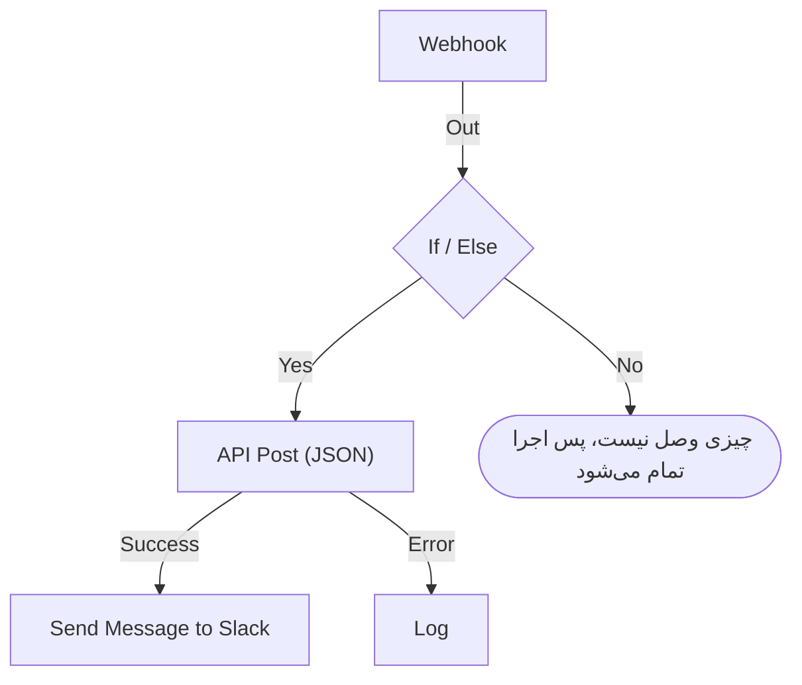

# نوشتن یک گردش کاری

یک گردش کاری را در **سازنده** آن می‌سازید: بومی که روی آن بلوک‌ها را اضافه می‌کنید، به هم وصلشان می‌کنید و تنظیماتشان را پر می‌کنید. این صفحه نشان می‌دهد چگونه یک گردش کاری بسازید، [بلوک اضافه کنید](#افزودن-بلوکها)، بلوک‌ها را [وصل](#وصل-کردن-بلوکها) و [پیکربندی](#پیکربندی-یک-بلوک) کنید، [مقدارها را بین آن‌ها جابه‌جا کنید](#استفاده-از-مقدارهای-بلوکهای-قبلی) و [گردش کاری را روشن کنید](#روشن-کردن-آن).

برای ساختن یک گردش کاری، **گردش‌های کاری** را باز کنید و روی **ساخت گردش کاری** کلیک کنید. پنجره **ساخت یک گردش کاری** اول می‌پرسد چگونه می‌خواهید شروع کنید و سپس نامی می‌خواهد. قالبی که به تنظیمات خودش نیاز دارد، مانند یک نشانی وب‌هوک Slack، آن‌ها را در یک گام اضافه می‌پرسد و به‌صورت متغیرهای گردش کاری ذخیره می‌کند، تا بعداً بتوانید بدون ویرایش گردش کاری تغییرشان دهید.

انتخاب کنید چگونه شروع کنید:

- **شروع از صفر**، در بالای پنجره، یک بوم خالی به شما می‌دهد. بیشتر گردش‌های کاری از همین‌جا شروع می‌شوند.
- **یا از یک قالب شروع کنید** چند قالب **پیشنهادی** نشان می‌دهد. برای بقیه، کنار کادر جستجو یک دسته انتخاب کنید، مانند **حوادث**، **مانیتورها** یا **Jira**، یا **همه قالب‌ها**، یا در **جستجو در قالب‌ها…** تایپ کنید. هر واژه‌ای که تایپ می‌کنید باید مطابقت داشته باشد.

روی یک قالب کلیک کنید تا ببینید چه می‌کند: تریگرش، بلوک‌هایی که از آن‌ها ساخته شده و تنظیماتی که خواهد پرسید. سپس روی **استفاده از این قالب** کلیک کنید، یا روی قالب دوبار کلیک کنید. در کادر جستجو، کلیدهای جهت‌نما یک قالب را انتخاب می‌کنند و **Enter** آن را به کار می‌برد. `/` شما را به کادر جستجو برمی‌گرداند.

گردش‌های کاری خاموش ساخته می‌شوند، پس تا روشنشان نکنید هیچ چیز اجرا نمی‌شود. گردش کاری تازه در **سازنده** باز می‌شود، همان بومی که رویش طراحی‌اش می‌کنید.

## بوم

گردش کاری‌ای که از صفر ساخته شده با یک بلوک خط‌چین تنها باز می‌شود که رویش **Choose what starts this workflow** نوشته شده است. این بلوک نقطه شروع است — برای انتخاب تریگر رویش کلیک کنید. گردش کاری‌ای که از یک قالب ساخته شده، با بلوک‌هایی که از پیش سر جایشان هستند باز می‌شود.

هر گردش کاری در بالا دقیقاً یک **تریگر** دارد. هر چیز دیگری یک **مؤلفه** است که کاری انجام می‌دهد. برای عوض کردن تریگر، حذفش کنید: نگه‌دارنده خط‌چین به جایش برمی‌گردد و با کلیک روی آن می‌توانید یکی دیگر انتخاب کنید. وقتی بلوکی را حذف می‌کنید، خط‌هایش هم حذف می‌شوند، پس تریگر تازه را دوباره به نخستین بلوک وصل کنید.

تغییرها خودکار ذخیره می‌شوند. یک برچسب در نوار ابزار وضعیت را نشان می‌دهد: تا تغییر در راه است **در حال ذخیره…** ، سپس **ذخیره شد**، یا اگر ذخیره ممکن نشد **ذخیره نشد**. بوم دکمه ذخیره ندارد و گام انتشار جداگانه‌ای هم ندارد.

## افزودن بلوک‌ها

| برای افزودن            | روی این کلیک کنید                                              | پنلی که باز می‌شود            |
| ---------------------- | -------------------------------------------------------------- | ----------------------------- |
| تریگر                  | بلوک نگه‌دارنده خط‌چین                                        | **Add Trigger**               |
| هر بلوک دیگر           | **افزودن مؤلفه**، در نوار ابزار بالای بوم                      | **افزودن مؤلفه**              |

هر دو پنل روی بلوک‌هایی که بیشتر گردش‌های کاری به کار می‌برند، زیر **Popular**، باز می‌شوند و بقیه بلوک‌های داخلی پس از آن می‌آیند. زیر **OneUptime resources** روی منبعی مانند **حادثه** کلیک کنید تا ببینید با آن چه کارهایی می‌توانید بکنید؛ **Browse all resources** همه آن‌ها را نشان می‌دهد. یا جستجو کنید: چند واژه تایپ کنید، مانند `create incident`، و بهترین تطابق اول می‌آید. برای رفتن به کادر جستجو `/` را بزنید، برای حرکت بین نتیجه‌ها کلیدهای جهت‌نما را، و برای افزودن بلوک برجسته‌شده **Enter** را. کلیک روی یک بلوک هم آن را اضافه می‌کند.

بلوک تازه زیر پایین‌ترین بلوک بوم قرار می‌گیرد، و تریگر تازه جای بلوک خط‌چین بالا را می‌گیرد. بلوک تازه انتخاب‌شده است و اگر بیرون از دید بیفتد، بوم فقط به اندازه‌ای پیمایش می‌کند که آن را نشان دهد. تنظیماتش خودشان باز نمی‌شوند: هر وقت آماده پیکربندی‌اش بودید روی بلوک کلیک کنید. تا تنظیمات الزامی‌اش پر نشده، رویش **Click to set up** نوشته شده است.

بلوک‌ها را هر جا خواستید بکشید؛ بوم هنگام کشیدن آن‌ها را به یک شبکه می‌چسباند. جای بلوک‌ها ذخیره می‌شود، پس نفر بعدی همان چیدمانی را می‌بیند که شما گذاشته‌اید.

## روی یک بلوک چه چیزی هست

| فیلد                                  | کاری که می‌کند                                                                                                                                                                                                                                                                                                |
| ------------------------------------- | ------------------------------------------------------------------------------------------------------------------------------------------------------------------------------------------------------------------------------------------------------------------------------------------------------------- |
| **Identifier** (زیر **ID**)           | شناسه کوتاهی که روی بلوک نشان داده می‌شود، مانند `log-1`. بلوک‌های دیگر با همین به این بلوک ارجاع می‌دهند، پس اگر نامش را عوض کنید، همه ارجاع‌های `{{local.components.…}}` که به آن اشاره دارند می‌شکنند. سرعنوان بلوک نام خود مؤلفه است و نمی‌توان تغییرش داد.                                             |
| **تنظیمات**                           | آنچه بلوک برای انجام کارش نیاز دارد — یک نشانی، یک کانال Slack، متن یک پیام. فیلدهای اختیاری با **(اختیاری)** مشخص شده‌اند؛ بقیه الزامی‌اند. یک کلید روشن/خاموش هیچ‌کدام از این دو نشان را ندارد، چون همیشه مقداری دارد. تنظیماتی که کمتر به کار می‌روند زیر **فیلدهای بیشتر** جمع شده‌اند، که سرعنوانش نامشان را می‌آورد و پرشده‌ها را نشان می‌دهد. |
| **Input**                             | نقطه لبه بالا، جایی که خط‌های بلوک‌های قبلی وارد می‌شوند. تریگرها آن را ندارند — پیش از آن‌ها هیچ چیز اجرا نمی‌شود.                                                                                                                                                                                         |
| **Outputs**                           | نقطه‌های لبه پایین، با برچسب‌هایی درست بالای آن‌ها، جایی که خط‌ها به بلوک‌های بعدی بیرون می‌روند. بسیاری از بلوک‌ها خروجی‌های جداگانه **Success** و **Error** دارند تا بتوانید هر دو حالت را مدیریت کنید.                                                                                                   |

## وصل کردن بلوک‌ها

از نقطه‌ای در پایین یک بلوک به نقطه بالای بلوک بعدی بکشید. خطی که می‌کشید تعیین می‌کند پس از آن چه اجرا شود.

- اگر از **Success** وصل کنید، بلوک بعدی فقط وقتی اجرا می‌شود که بلوک قبلی موفق شده باشد.
- اگر از **Error** وصل کنید، بلوک بعدی فقط وقتی اجرا می‌شود که بلوک قبلی شکست خورده باشد.
- اگر خروجی‌ای را وصل نکنید، آن مسیر همان‌جا متوقف می‌شود.

می‌توانید یک خروجی را به چند بلوک وصل کنید. همه اجرا می‌شوند — اما یکی پس از دیگری، در یک صف، نه به‌طور موازی. به ترتیب بین شاخه‌ها تکیه نکنید و فرض نکنید که از نظر زمانی هم‌پوشانی دارند.

هر بلوک در هر اجرا حداکثر یک بار اجرا می‌شود. خطی که به بلوکی می‌رسد که پیش‌تر اجرا شده — به عقب در بوم، یا از شاخه‌ای دیگر پس از اینکه شاخه نخست به آن رسیده — اجرا را با خطا متوقف می‌کند، تا گردش کاری نتواند در حلقه بچرخد.

## پیکربندی یک بلوک

روی یک بلوک کلیک کنید تا تنظیماتش در یک پنجره باز شود، یا با **Tab** به آن بروید و **Enter** را بزنید. تنظیمات را پر کنید و روی **ذخیره** کلیک کنید.

هر تنظیم همان ورودی‌ای را دارد که مقدارش نیاز دارد:

| تنظیم شامل چیست                                  | آنچه می‌گیرید                                                                  |
| ------------------------------------------------ | ------------------------------------------------------------------------------ |
| کلمات: یک پیام، یک پرامپت، مقداری برای لاگ        | فیلدی که با تایپ کردن بزرگ‌تر می‌شود. **Enter** سطر تازه‌ای شروع می‌کند.        |
| مقدار کوتاه: یک نشانی، یک شناسه، یک سطر موضوع    | یک سطر.                                                                        |
| کد یا HTML                                       | یک ویرایشگر کد.                                                                |
| JSON                                             | یک ویرایشگر JSON.                                                              |
| روشن یا خاموش                                    | کلیدی با نامش در کنارش. برای تغییرش روی کلید یا نام کلیک کنید.                 |

پنجره روی همان چیزی باز می‌شود که احتمالاً برایش آمده‌اید. برای یک تریگر **وب‌هوک**، نشانی آن است، با یک دکمه **کپی نشانی**، روش‌هایی که می‌پذیرد و یک درخواست نمونه. برای یک تریگر **Manual**، نحوه شروع گردش کاری است. هر بلوک دیگری روی تنظیماتش باز می‌شود. بلوکی که تنظیمی ندارد اصلاً بخش **تنظیمات** ندارد.

زیر آن، از بالا به پایین:

- **ID**، **Inputs** و **Outputs**، کنار هم — شناسه بلوک، از کجا به آن می‌رسند و پس از آن چه اجرا می‌شود.
- **Returns** — داده‌ای که این بلوک به گام‌های بعدی می‌دهد. هر مقدار ارجاع دقیقی را که آن را می‌خواند نشان می‌دهد، همراه با دکمه‌ای برای کپی کردنش.
- **How to use** — اینکه بلوک در یک جمله چه می‌کند، گام‌های پیکربندی‌اش، نمونه‌ای برای کپی و اشتباه‌هایی که افراد معمولاً می‌کنند. نمونه از گردش کاری شما ساخته می‌شود: هر جا داده را در پیامی می‌گذارد، از شناسه همین بلوک و مقدارهای تریگر استفاده می‌کند. **Learn more** توضیح طولانی‌تر را باز می‌کند و پیوندها به راهنمای کامل می‌روند. هر بلوکی آن را دارد و دکمه **How to use** در بالای پنجره مستقیم به آن‌جا می‌پرد.

در پایین این‌ها هست:

- **حذف** — این بلوک را برمی‌دارد. اول می‌پرسد و بلوک را با نوع و شناسه‌اش نام می‌برد، مانند **Send Email (send-email-2)** ، تا بدانید کدام‌یک از چند بلوک همسان از بین می‌رود.
- **Run just this step** — فقط همین یک بلوک را اجرا می‌کند، بدون بقیه گردش کاری. مقدارهایی که از گام‌های دیگر می‌خواند خالی می‌رسند، و هر چیزی که می‌فرستد، می‌نویسد یا حذف می‌کند واقعاً رخ می‌دهد. همه شرط‌های پیش از بلوک را رد می‌کند، پس فقط کسانی که اجازه ویرایش گردش کاری را دارند می‌توانند از آن استفاده کنند.

### استفاده از مقدارهای بلوک‌های قبلی

بیشتر تنظیمات می‌توانند از مقدار یک بلوک قبلی یا یک متغیر استفاده کنند — داده این‌گونه از یک بلوک به بلوک بعدی جریان می‌یابد. هر تنظیمی از این دست در انتهایش یک دکمه **{ }** دارد. این دکمه فهرستی از مقدارهایی را که می‌توانید به کار ببرید باز می‌کند: هر بلوک قبلی با نامش، همراه با هر مقداری که برمی‌گرداند — نامش، محتوایش و نوعش — سپس متغیرهای گردش کاری‌تان و متغیرهای سراسری. در فهرست جستجو کنید، یکی را با ماوس یا با کلیدهای جهت‌نما و **Enter** انتخاب کنید، و مقدار در جای مکان‌نما درج می‌شود.

در تنظیم، یک مقدار به شکل یک تراشه نشان داده می‌شود، مانند **Webhook › Request Body**. نشانگر را رویش نگه دارید تا ارجاعی را که نماینده آن است ببینید، `{{local.components.webhook-1.returnValues.request-body}}`، که همان چیزی است که ذخیره می‌شود. مکان‌نما با یک حرکت از روی تراشه می‌پرد، **Backspace** کل آن را برمی‌دارد، و کپی کردنش ارجاع را کپی می‌کند. اگر نحو را بلدید، به جای آن `{{` را تایپ کنید: همان فهرست زیر تنظیم باز می‌شود و با تایپ کردن کوچک‌تر می‌شود.

- **فقط مقدارهایی پیشنهاد می‌شوند که وجود خواهند داشت.** یعنی تریگر و بلوک‌هایی که پیش از این بلوک اجرا می‌شوند. بلوکی که بعداً اجرا می‌شود هنوز هیچ خروجی‌ای ندارد. تا وقتی بلوکی وصل نشده، فقط مقدارهای تریگر نشان داده می‌شوند و فهرست همین را می‌گوید.
- **یک رکورد روی فیلدهایش باز می‌شود.** یک بلوک Find One یا On Create کل رکورد را برمی‌گرداند. آن را انتخاب کنید تا فیلدهایش را ببینید، که آن‌هایی که **Select Fields** بلوک می‌خواند اول می‌آیند. یک مقدار JSON یا مجموعه‌ای از هدرها روی فیلدی باز می‌شود که در آن مسیری تایپ می‌کنید، مانند `title` یا `alerts[0].status`.
- **وقتی بلوکی یک بار اجرا شد، فهرست می‌داند در مقدارهایش چه هست.** هر مقدار می‌گوید در آخرین اجرا چه داشت — `"production"` یا `3 fields` — و یک مقدار JSON یا مجموعه‌ای از هدرها روی فیلدهایی که داشت باز می‌شود، هر کدام با محتوایش. پس از **Request Body** یک وب‌هوک، به جای تایپ کردن مسیر، **incident.title** را انتخاب می‌کنید. جستجو هم این فیلدها را پیدا می‌کند: `title` را تایپ کنید، یا `{{` و ابتدای یک مسیر را. فیلدهای یک رکورد هم نشان می‌دهند چه داشتند. فیلدها از آخرین اجرا می‌آیند، پس فیلدی که درخواست بعدی حذفش کند در آن اجرا خالی است. مقداری که شبیه یک راز است، مانند هدر `Authorization`، یک توکن یا یک گذرواژه، بدون محتوایش نشان داده می‌شود.
- **وب‌هوکی که هنوز درخواستی دریافت نکرده همین را می‌گوید** در بالای مقدارهایش، همراه با **Copy test request**: دستوری `curl` که `{"message": "Hello"}` را به نشانی وب‌هوک گردش کاری می‌فرستد. آن را در حالی که فهرست باز است در یک ترمینال اجرا کنید، و فیلدهای درخواست به‌محض پایان اجرایی که شروع می‌کند، معمولاً در چند ثانیه، در فهرست ظاهر می‌شوند. گردش کاری باید فعال باشد، وگرنه درخواست رد می‌شود. فقط کسانی که اجازه دیدن نشانی وب‌هوک را دارند این دکمه را می‌بینند. تریگر Incoming Email که هنوز ایمیلی دریافت نکرده در همان جا همین را می‌گوید؛ یک ایمیل به نشانی آن بفرستید تا هدرها و پیوست‌هایش به همین شکل ظاهر شوند.
- **ویرایشگرهای کد در نوار ابزارشان Insert value دارند.** در JSON، نقل‌قول‌هایی را که یک مقدار درون یک سند نیاز دارد اضافه می‌کند. **Run Custom JavaScript** مقدارها را از طریق **Arguments** خود می‌خواند، پس کدش انتخابگر ندارد.
- **عددها، گذرواژه‌ها، کلیدها و تاریخ‌ها کنترل خودشان را نگه می‌دارند،** با **{ }** در کنارشان. مقدار انتخاب‌شده جای کنترل را می‌گیرد و **abc** به تایپ کردن برمی‌گرداند.

تراشه‌ای که چیزی را می‌خواند که وجود ندارد نارنجی می‌شود: بلوکی که نامش عوض شده یا حذف شده، مقداری که بلوک برنمی‌گرداند، بلوکی که بعداً اجرا می‌شود، یا متغیری که وجود ندارد. راهنمای ابزارش می‌گوید کدام است. برای نحو ارجاع، [متغیرها](/docs/workflows/variables) را ببینید.

## بررسی‌ها هنگام ساخت

سازنده هر بار که گراف را تغییر می‌دهید کل آن را بررسی می‌کند و آنچه پیدا کند را در برچسبی در نوار ابزار گزارش می‌دهد. روی برچسب کلیک کنید تا **Problems with this workflow** باز شود، که هر مشکل را فهرست می‌کند و شما را به بلوک مربوطه می‌برد. روی بوم، بلوکی که تنظیمات الزامی‌اش هنوز خالی است **Click to set up** را نشان می‌دهد، و بلوکی با مشکلی دیگر در گوشه‌اش یک نشان دارد: قرمز برای خطا، نارنجی برای هشدار. نشانگر را روی نشان نگه دارید تا بخوانید چه چیزی اشتباه است.

اشتباه‌هایی را می‌گیرد که در غیر این صورت تا وقتی اجرایی خراب نشود دیده نمی‌شوند:

- گردش کاری بدون تریگر؛
- دو بلوک با یک شناسه یکسان، یا شناسه‌ای که نقطه دارد؛
- بلوکی که چیزی به آن وصل نیست؛
- تنظیم الزامی‌ای که خالی مانده؛
- JSON نامعتبر؛
- فاصله درون `{{ }}`؛
- ارجاع به گام یا مقدار برگشتی‌ای که وجود ندارد.

یک چیز را نمی‌تواند بررسی کند: اینکه آیا نام یک متغیر وجود دارد. تنظیمات یک بلوک می‌تواند — ارجاع به متغیری که وجود ندارد آن‌جا به شکل یک تراشه نارنجی نشان داده می‌شود. هر جای دیگر، متغیری که نامش عوض شده نخستین بار در لاگ اجرا آشکار می‌شود.

## اولین گردش کاری شما

سریع‌ترین راه آشنا شدن با بوم، یک گردش کاری دوبلوکی است که دستی شروعش می‌کنید:

:::steps
1. روی بلوک نگه‌دارنده خط‌چین کلیک کنید، سپس در پنل **Add Trigger** روی **Manual** کلیک کنید.
2. روی **افزودن مؤلفه** کلیک کنید، سپس زیر **Popular** روی **لاگ** کلیک کنید. بلوک تازه زیر تریگر قرار می‌گیرد. نقطه **Execute** تریگر را به پایین تا نقطه ورودی بلوک Log وصل کنید.
3. روی بلوک Log که رویش **Click to set up** نوشته شده کلیک کنید و در **Value** آن `Hello from ` را تایپ کنید. روی **{ }** کلیک کنید، سپس زیر **Manual** روی **JSON** کلیک کنید. تنظیم **Manual › JSON** را نشان می‌دهد و `{{local.components.manual-1.returnValues.value}}` را ذخیره می‌کند. `manual-1` همان **Identifier** تریگر است که روی بلوک تریگر نشان داده می‌شود. روی **ذخیره** کلیک کنید.
4. در بالای سازنده، **فعال** را روشن کنید. یک گردش کاری غیرفعال اصلاً اجرا نمی‌شود، حتی دستی؛ اگر از این گام بگذرید، **اجرای گردش کاری** اول از شما می‌خواهد روشنش کنید.
5. در **سازنده**، روی **اجرای گردش کاری** کلیک کنید، در فیلد **JSON** عبارت `{ "name": "Ada" }` را تایپ کنید، روی **Run Workflow Manually** کلیک کنید و با **Run** تأیید کنید.
6. پنل **اجرای گردش کاری** خودش باز می‌شود و اجرا را دنبال می‌کند. لاگ `Value:` و پس از آن `Hello from { "name": "Ada" }` را نشان می‌دهد.
:::

این چرخه — افزودن، وصل کردن، پیکربندی، اجرا، خواندن لاگ — روشی است که هر گردش کاری را با آن می‌سازید.

> [!TIP]
> JSON تایپ‌شده در **اجرای گردش کاری** به همان شکل متنی که تایپ کرده‌اید به تریگر Manual می‌رسد. برای خواندن فیلدی در آن، مانند `name`، یک بلوک **Text to JSON** اضافه کنید، **JSON** تریگر را در **Text** آن بگذارید و فیلد را از **JSON** همان بلوک بخوانید: `{{local.components.text-to-json-1.returnValues.json.name}}`.

## روشن کردن آن

گردش‌های کاری تازه غیرفعال شروع می‌شوند، و هر گردش کاری‌ای که تکثیر یا وارد کنید هم همین‌طور. تا وقتی گردش کاری خاموش است، سازنده این را بالای بوم می‌گوید، همراه با دکمه **روشن کردن گردش کاری**.

کلید **فعال** در بالای **سازنده** است، کنار **افزودن مؤلفه** و **اجرای گردش کاری**. در صفحه **نمای کلی** گردش کاری هم هست، که کارت **جزئیات گردش کاری** آن وضعیت کنونی را به شکل برچسب سبز **فعال** یا برچسب قرمز **غیرفعال** نشان می‌دهد: روی **ویرایش گردش کاری** کلیک کنید و **فیلدهای بیشتر** را باز کنید. فقط کسانی که اجازه ویرایش گردش کاری را دارند می‌توانند روشن یا خاموشش کنند؛ بقیه کلید را کم‌رنگ می‌بینند.

یک گردش کاری غیرفعال اصلاً اجرا نمی‌شود، هر طور که شروع شود:

| شروع‌شده با                                                | وقتی گردش کاری خاموش است                                                                                                                                                                  |
| ---------------------------------------------------------- | ----------------------------------------------------------------------------------------------------------------------------------------------------------------------------------------- |
| تریگرش: یک زمان‌بندی، یک رویداد OneUptime یا یک ایمیل     | نادیده گرفته می‌شود.                                                                                                                                                                      |
| **اجرای گردش کاری** یا **Run just this step**              | سازنده به جای آن می‌پرسد **این گردش کاری روشن شود؟** . **روشن کردن و اجرا** (یا **روشن کردن و اجرای مرحله**) گردش کاری را روشن می‌کند و سپس آنچه خواسته بودید را با مقدارهایی که دادید اجرا می‌کند. |
| فراخوانی نشانی وب‌هوک آن                                  | با HTTP 400 و "This workflow is turned off, so it can't run. Turn it on with the Enabled switch at the top of its Builder, then try again." رد می‌شود.                                      |
| بلوک **Execute Workflow** یک گردش کاری دیگر                | آن بلوک مسیر **Error** خود را می‌رود و خطا نام گردش کاری‌ای را که فراخوانده می‌آورد.                                                                                                      |

پس ترتیب این است: بسازیدش، با **اجرای گردش کاری** آزمایشش کنید، لاگ اجرا را بخوانید، و اگر برای فعال شدن تریگرش آماده نیستید، **فعال** را دوباره خاموش کنید. برای آزمایش یک بلوک بدون اجرای همه چیز، در تنظیمات همان بلوک از **Run just this step** استفاده کنید.

برای مکث دادن به یک گردش کاری بدون حذف آن، **فعال** را خاموش کنید. هیچ اجرای تازه‌ای شروع نمی‌شود. اجرایی که در جریان است تمام می‌شود، اما اجرایی که روی یک بلوک **Sleep** منتظر مانده هنگام بیدار شدن لغو و به‌عنوان خطا ثبت می‌شود.

## مرتب‌سازی

- بلوک‌ها را برای جابه‌جا کردنشان بکشید. چیدمان ذخیره می‌شود.
- برای حذف یک خط، یکی از دو سرش را از نقطه دور بکشید و روی جای خالی بوم رها کنید.
- برای حذف یک بلوک، رویش کلیک کنید و از **حذف** در پایین پنجره تنظیماتش استفاده کنید. انتخاب یک بلوک یا یک خط و زدن Backspace هم آن را برمی‌دارد.
- راهی برای تکثیر یک بلوک تنها وجود ندارد. **تکثیر گردش کاری** در صفحه **تنظیمات** گردش کاری کل آن را کپی می‌کند. نام کپی پر شده است و پس از گردش‌های کاری پروژه شماره می‌خورد ("Nightly Sync" به شکل "Nightly Sync 2" کپی می‌شود)، و کپی غیرفعال باز می‌شود.
- بلوک‌ها را از بالا به پایین بچینید تا در همان جهتی که اجرا می‌شوند خوانده شوند — ورودی در لبه بالا و خروجی‌ها در لبه پایین است، پس جریان به‌طور طبیعی رو به پایین می‌رود.

## گام‌های بعدی

:::cards
- [تریگرها](/docs/workflows/triggers): پنج راهی که یک گردش کاری می‌تواند شروع شود.
- [مؤلفه‌ها](/docs/workflows/components): هر بلوکی که می‌توانید اضافه کنید، با تنظیمات و خروجی‌هایش.
- [متغیرها](/docs/workflows/variables): داده را بین بلوک‌ها جابه‌جا کنید و رازها را بیرون از آن‌ها نگه دارید.
- [اجراها](/docs/workflows/runs-and-logs): بررسی کنید هر اجرا گام‌به‌گام چه کرد.
:::
