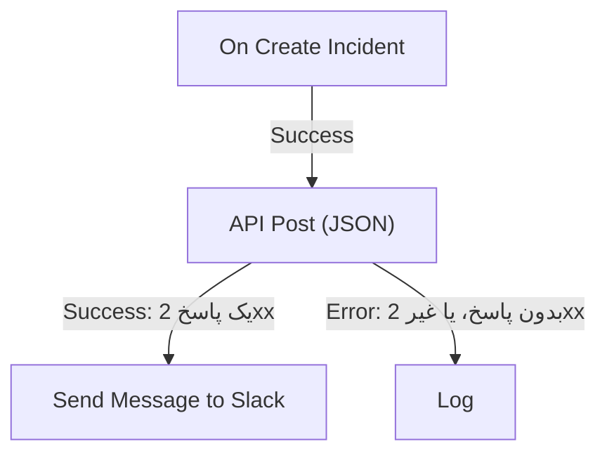

# اجزای گردش کاری

مؤلفه‌ها بلوک‌هایی‌اند که پس از تریگر اضافه می‌کنید. هر کدام یک کار انجام می‌دهد — پیامی می‌فرستد، یک API را فرامی‌خواند، شرطی را بررسی می‌کند، رکوردی از OneUptime را تغییر می‌دهد — و سپس یکی از خروجی‌هایش را به سوی بلوک‌هایی که به آن وصل‌اند انتخاب می‌کند. این صفحه کاتالوگ است: هر بلوک به چه نیاز دارد، چه برمی‌گرداند و کی هر خروجی را انتخاب می‌کند.

هنگام ساختن به‌ندرت لازم است این صفحه باز باشد. تنظیمات هر بلوک با **How to use** تمام می‌شود: کاری که بلوک می‌کند، گام‌های پیکربندی‌اش، نمونه‌ای ساخته‌شده از گردش کاری خودتان و اشتباه‌هایی که افراد معمولاً می‌کنند. برای افزودن و وصل کردن بلوک‌ها، [نوشتن یک گردش کاری](/docs/workflows/authoring) را ببینید.

:::cards
- [فرستادن پیام](#slack): Slack، Microsoft Teams، Discord، Telegram، IRC و ایمیل.
- [فراخوانی یک API](#api): به هر API مبتنی بر HTTP درخواست بفرستید و پاسخ را بخوانید.
- [افزودن منطق](#conditions): روی یک مقدار انشعاب بگیرید، داده را تغییر شکل دهید، صبر کنید یا لاگ بنویسید.
- [کار با رکوردهای OneUptime](#مؤلفههای-داده-oneuptime): مانیتورها، حوادث و بیشتر را پیدا کنید، بسازید، به‌روزرسانی و حذف کنید.
:::

## کدام مؤلفه را به کار ببرم؟

| برای اینکه…                                                   | از این استفاده کنید                                               |
| ------------------------------------------------------------- | ----------------------------------------------------------------- |
| در یک ابزار گفت‌وگو پیام بگذارید                              | [Slack](#slack)، [Microsoft Teams](#microsoft-teams)، [Discord](#discord)، [Telegram](#telegram) یا [IRC](#irc) |
| از طریق کارساز ایمیل خودتان ایمیل بفرستید                     | [Email](#email)                                                   |
| هر API دیگر یا سرویس خودتان را فرابخوانید                     | [API](#api)                                                       |
| متن را خلاصه، دسته‌بندی یا پیش‌نویس کنید                      | [Generate Text with AI](#generate-text-with-ai)                   |
| بسته به یک مقدار این مسیر یا آن مسیر را بروید                 | [Conditions](#conditions)                                         |
| داده را بین دو بلوک تغییر شکل دهید                            | [JSON](#json) یا [Custom Code](#custom-code)                      |
| پیش از بلوک بعدی صبر کنید                                     | [Sleep](#sleep)                                                   |
| یک گردش کاری دیگر را شروع کنید                                | [Execute Workflow](#execute-workflow)                             |
| حوادث، مانیتورها و رکوردهای دیگر را بخوانید یا تغییر دهید     | [مؤلفه‌های داده OneUptime](#مؤلفههای-داده-oneuptime)            |

یک بلوک اختصاصی از یک بلوک عمومی بهتر است: بلوک Slack محدودیت‌های Slack را می‌شناسد و یک بلوک رکورد فیلدهای رکورد را، پس خطاها و لاگ‌های روشن‌تری از یک بلوک **API** که همان کار را می‌کند می‌گیرید.

## هر بلوک چگونه کار می‌کند

یک بلوک وقتی اجرا می‌شود که بلوک پیش از آن خروجی‌ای را که به آن وصل است انتخاب کند. تنظیماتش را می‌خواند، کارش را انجام می‌دهد و سپس یکی از خروجی‌هایش را انتخاب می‌کند. پس از آن فقط بلوک‌هایی اجرا می‌شوند که به همان خروجی وصل‌اند.



- **تنظیمات** همان چیزی است که پر می‌کنید. تنظیماتی که با **(اختیاری)** مشخص شده‌اند می‌توانند خالی بمانند. تنظیماتی که کمتر به کار می‌روند زیر **فیلدهای بیشتر** جمع شده‌اند.
- **Outputs** نقطه‌های لبه پایین‌اند. بیشتر بلوک‌ها **Success** و **Error** دارند؛ [Conditions](#conditions) دارای **Yes** و **No** است.
- **Returns** مقدارهایی‌اند که یک بلوک به بلوک‌های بعدی می‌دهد، مانند **Response Body** یک API. یک بلوک بعدی هر کدام را با `{{local.components.<block ID>.returnValues.<value ID>}}` می‌خواند؛ دکمه **{ }** در یک تنظیم آن را برایتان درج می‌کند. [متغیرها](/docs/workflows/variables#خروجی-مؤلفهها-داده-از-بلوکهای-قبلی) را ببینید.

بلوکی که **Error** را انتخاب کند اجرا را ناموفق نمی‌کند: اجرا مسیر **Error** را دنبال می‌کند، یا اگر چیزی به آن وصل نباشد همان‌جا تمام می‌شود. در مقابل، یک تنظیم الزامی که خالی مانده، یا تنظیمی که هرگز نمی‌تواند کار کند، اجرا را با خطا متوقف می‌کند.

## API

به هر نشانی یک درخواست HTTP بفرستید. برای هر روش یک بلوک هست: **API Get (JSON)**، **API Post (JSON)**، **API Put (JSON)**، **API Patch (JSON)** و **API Delete (JSON)**.

| تنظیم               | کاری که می‌کند                                                                                                                       |
| ------------------- | ------------------------------------------------------------------------------------------------------------------------------------ |
| **URL**             | نشانی‌ای که فراخوانده می‌شود، `http` یا `https`.                                                                                     |
| **Request Body**    | JSON برای فرستادن. معمولاً فقط درخواست‌های `POST`، `PUT` و `PATCH` به آن نیاز دارند.                                                 |
| **Request Headers** | هدرهایی که همراه فرستاده می‌شوند، مانند یک کلید API. زیر **فیلدهای بیشتر**. مقدارهایشان در لاگ اجرا پنهان می‌شوند.                   |

| خروجی       | چه زمانی                                                                                       |
| ----------- | ---------------------------------------------------------------------------------------------- |
| **Success** | کارساز با وضعیت 2xx پاسخ داد.                                                                  |
| **Error**   | درخواست شکست خورد: کارساز در دسترس نبود، یا با وضعیت دیگری پاسخ داد.                           |

در هر حال، بلوک **Response Status**، **Response Headers** و **Response Body** را برمی‌گرداند، و وقتی شکست بخورد **Error** را هم با دلیلش. فیلدی از یک پاسخ JSON را با افزودن نامش به ارجاع بخوانید، مانند `{{local.components.api-get-1.returnValues.response-body.id}}`.

تغییرمسیرها دنبال نمی‌شوند، پس بلوک را به نشانی‌ای که پاسخ می‌دهد نشانه بگیرید. درخواست‌ها از OneUptime بیرون می‌روند: نشانی‌ای که به یک نشانی شبکه خصوصی تحلیل شود رد می‌شود، مگر اینکه مدیر یک نصب خودمیزبان اجازه‌اش را بدهد، و اجرا با دلیلش متوقف می‌شود. [دسترسی شبکه خروجی](/docs/workflows/configuration#دسترسی-شبکه-خروجی) را ببینید.

## AI

### Generate Text with AI

از یک پرامپت و زمینه JSON اختیاری، یک پاسخ متنی تولید کنید. بلوک از ارائه‌دهنده پیش‌فرض LLM پروژه استفاده می‌کند، یا وقتی پروژه هیچ ندارد از ارائه‌دهنده سراسری نصب. ارائه‌دهندگان به‌طور متمرکز در **تنظیمات پروژه → هوش مصنوعی → ارائه‌دهندگان LLM** پیکربندی می‌شوند؛ کلیدها و نقطه‌های پایانی آن‌ها هرگز جزو تنظیمات بلوک نیستند.

| تنظیم                     | کاری که می‌کند                                                                                                                                                    |
| ------------------------- | ----------------------------------------------------------------------------------------------------------------------------------------------------------------- |
| **System Instructions**   | راهنمایی اختیاری درباره نقش، لحن و محدودیت‌های مدل.                                                                                                              |
| **Prompt**                | کار. دقیقاً همان‌طور که می‌نویسید فرستاده می‌شود، پس Markdown مشکلی ندارد، و می‌تواند متغیرها و مقدارهای بلوک‌های قبلی را در خود داشته باشد.                       |
| **Context**               | JSON اختیاری که آگاهانه همراه می‌فرستید. پس از یک نشانگر صریح پایان پیام افزوده می‌شود و داده غیرقابل‌اعتماد به حساب می‌آید.                                      |
| **Temperature**           | زیر **فیلدهای بیشتر**. میزان تنوع از `0` تا `1`؛ پیش‌فرض `0.2` است، برای خودکارسازی پیش‌بینی‌پذیر. مدل‌های کنونی Claude، یعنی Opus 4.7 و پس از آن و همه مدل‌های Claude 5، خودشان نمونه‌برداری را انتخاب می‌کنند: OneUptime **Temperature** را از درخواست‌های آن‌ها حذف می‌کند، پس روی آن‌ها اثری ندارد. |
| **Maximum Output Tokens** | زیر **فیلدهای بیشتر**. از `1` تا `4096`؛ پیش‌فرض `1024` است.                                                                                                     |

System Instructions، Prompt و Context سریال‌شده روی هم به ۵۰٬۰۰۰ نویسه محدودند. تصویری که به شکل base64 در آن‌ها جاسازی شده، مانند نماگرفت یک مانیتور مصنوعی در توضیحات یک حادثه، پیش از اندازه‌گیری با یادداشت کوتاهی مانند `[image omitted: PNG, 340 KB]` جایگزین می‌شود، چون مدل متن می‌خواند، نه تصویر. لاگ اجرا می‌گوید چه چیزی کنار گذاشته شد. درخواست به ارائه‌دهنده حداکثر ۶۰ ثانیه طول می‌کشد و یک بار تلاش می‌شود. در هر پروژه حداکثر سه درخواست هوش مصنوعی گردش کاری می‌توانند هم‌زمان اجرا شوند.

این بلوک **Response** (متن تولیدشده)، **Provider** و **Model** (آنچه پاسخ داد)، **Total Tokens** و **Completion Tokens** (مصرفی که ارائه‌دهنده گزارش کرد)، **LLM Log ID** (مدخل این فراخوانی در لاگ‌های هوش مصنوعی) و **Error** را برمی‌گرداند.

**Success** را به بلوک‌هایی که از پاسخ استفاده می‌کنند وصل کنید و **Error** را به یک جایگزین: شکست‌های اعتبارسنجی، دسترسی، ارائه‌دهنده، بودجه، صورت‌حساب و مهلت زمانی همه آن مسیر را می‌روند. بلوک هیچ ابزاری نمی‌فرستد، پس مدل نمی‌تواند خودش OneUptime را پرس‌وجو کند، APIها را فرابخواند یا داده را تغییر دهد.

> [!WARNING]
> خروجی مدل متنی غیرقابل‌اعتماد است. پیش از رسیدنش به مشتریان بازبینی‌اش کنید و هرگز اجازه ندهید متن آزاد هوش مصنوعی به‌تنهایی درباره یک کنش ویرانگر تصمیم بگیرد. برای اینکه چه چیزی به ارائه‌دهنده فرستاده می‌شود، چه چیزی لاگ می‌شود و هزینه‌اش چیست، [مؤلفه‌های هوش مصنوعی](/docs/workflows/configuration#مؤلفههای-هوش-مصنوعی) را ببینید.

## Slack

از طریق یک وب‌هوک ورودی در یک کانال Slack پیام بگذارید.

| تنظیم                          | کاری که می‌کند                                                                                                                                                                                               |
| ------------------------------ | ------------------------------------------------------------------------------------------------------------------------------------------------------------------------------------------------------------ |
| **Slack Incoming Webhook URL** | وب‌هوک کانالی که باید در آن پیام گذاشته شود. باید با `https://hooks.slack.com/services/` شروع شود. راهنمای Slack برای [ساختن یکی](https://api.slack.com/messaging/webhooks) چند دقیقه طول می‌کشد.           |
| **Message Text**               | متنی که فرستاده می‌شود. دقیقاً همان‌طور که می‌نویسید فرستاده می‌شود، پس از قالب‌بندی خود Slack استفاده کنید: `*bold*`، `_italic_`، `~strikethrough~` و `<https://example.com|a link>`. متنی بلندتر از یک بخش Slack (۳٬۰۰۰ نویسه) در چند بخش فرستاده می‌شود؛ بیش از ده بخش، بریده می‌شود و با "… (truncated — see OneUptime for the full text)" پایان می‌یابد. |

**Success** وقتی فعال می‌شود که Slack پیام را پذیرفت، و **Error** وقتی Slack آن را رد کرد، با دلیل Slack در **Error**. این بلوک‌ها از طریق وب‌هوک تنظیماتشان پیام می‌گذارند، نه از طریق اتصال Slack پروژه شما.

## Microsoft Teams

در یک کانال Microsoft Teams پیام بگذارید. نام این بلوک **Send Message to Teams** است.

| تنظیم                          | کاری که می‌کند                                                                                                                                                                                                                                |
| ------------------------------ | --------------------------------------------------------------------------------------------------------------------------------------------------------------------------------------------------------------------------------------------- |
| **Teams Incoming Webhook URL** | وب‌هوک کانالی که باید در آن پیام گذاشته شود، یک نشانی `https` روی `office.com`، `office365.com`، `logic.azure.com` یا `environment.api.powerplatform.com`. راهنمای Microsoft نشان می‌دهد چگونه [با Teams Workflows یکی بسازید](https://support.microsoft.com/en-us/teams/apps-service/create-incoming-webhooks-with-workflows-for-microsoft-teams). |
| **Message Text**               | متنی که فرستاده می‌شود. پیامی بزرگ‌تر از آنچه یک وب‌هوک ورودی می‌پذیرد (حدود ۱۲٬۰۰۰ نویسه، به شکلی که فرستاده می‌شود اندازه‌گیری می‌شود) بریده می‌شود و با "… (truncated — see OneUptime for the full text)" پایان می‌یابد.                  |

## Discord

از طریق یک وب‌هوک ورودی در یک کانال Discord پیام بگذارید.

| تنظیم                            | کاری که می‌کند                                                                                                                                     |
| -------------------------------- | -------------------------------------------------------------------------------------------------------------------------------------------------- |
| **Discord Incoming Webhook URL** | وب‌هوک کانال، یک نشانی `https` روی `discord.com` یا `discordapp.com`.                                                                              |
| **Message Text**                 | متنی که فرستاده می‌شود. پیامی بیش از ۲٬۰۰۰ نویسه، که حد Discord است، بریده می‌شود و با "… (truncated — see OneUptime for the full text)" پایان می‌یابد. |

## Telegram

با یک ربات به یک گفت‌وگوی Telegram پیام بفرستید.

| تنظیم                  | کاری که می‌کند                                                                                                                                     |
| ---------------------- | -------------------------------------------------------------------------------------------------------------------------------------------------- |
| **Telegram Bot Token** | توکنی که BotFather به ربات شما داد، مانند `123456789:ABCdef…`. توکنی با هر شکل دیگری اجرا را متوقف می‌کند، بدون اینکه توکن در لاگ نوشته شود.        |
| **Chat ID**            | گفت‌وگویی که باید در آن پیام گذاشته شود: شناسه آن، یا `@username` یک کانال. اول ربات را به گروه یا کانال اضافه کنید. برای نوشتن به یک فرد، آن فرد باید گفت‌وگویی را با ربات شروع کرده باشد. |
| **Message Text**       | متنی که فرستاده می‌شود. پیامی بیش از ۴٬۰۹۶ نویسه، که حد Telegram است، بریده می‌شود و با "… (truncated — see OneUptime for the full text)" پایان می‌یابد. |

وقتی Telegram پیام را رد کند، **Error** با دلیل Telegram فعال می‌شود.

## IRC

در یک کانال IRC روی هر شبکه IRC پیام بگذارید: Libera.Chat، OFTC یا کارساز خودتان. IRC وب‌هوک ندارد، پس بلوک خودش به کارساز وصل می‌شود، وارد کانال می‌شود، پیام را می‌فرستد و دوباره بیرون می‌رود.

| تنظیم            | کاری که می‌کند                                                                                                                                                                                                                                     |
| ---------------- | -------------------------------------------------------------------------------------------------------------------------------------------------------------------------------------------------------------------------------------------------- |
| **IRC Server**   | نام میزبان کارساز، مانند `irc.libera.chat`. فقط نام: بدون `ircs://` و بدون درگاه.                                                                                                                                                                 |
| **Channel**      | کانالی که باید در آن پیام گذاشته شود، مانند `#ops`. باید یک کانال باشد: نام مستعاری که این‌جا تایپ شود به جای گرفتن پیام خصوصی رد می‌شود.                                                                                                         |
| **Message Text** | متنی که فرستاده می‌شود. هر سطر به‌عنوان یک پیام IRC جداگانه فرستاده می‌شود، و سطر بلند شکسته می‌شود تا جا شود. یک پیام حداکثر به شکل ۱۵ سطر IRC فرستاده می‌شود: بلندتر از آن بریده می‌شود و سطر آخرش همین را می‌گوید. IRC مارک‌داون ندارد، پس متن همان‌طور که نوشته شده فرستاده می‌شود؛ کدهای قالب‌بندی خود IRC، مانند پررنگ و رنگ‌ها، کار می‌کنند. |

زیر **فیلدهای بیشتر**:

| تنظیم                                    | کاری که می‌کند                                                                                                                                                                                                     |
| ---------------------------------------- | ------------------------------------------------------------------------------------------------------------------------------------------------------------------------------------------------------------------ |
| **Nickname**                             | پیام از طرف چه کسی است. پیش‌فرض `OneUptime` است. اگر نام مستعار گرفته شده باشد، بلوک آن را با یک زیرخط یا عدد افزوده امتحان می‌کند، و سپس برای کارسازی که نام مستعار بلندتری نمی‌پذیرد، با چنین نویسه‌ای به جای آخرین نویسه‌ها. |
| **Port**                                 | درگاه کارساز. پیش‌فرض `6697` است، یا `6667` وقتی **Disable TLS** روشن باشد.                                                                                                                                        |
| **Disable TLS**                          | بلوک از طریق TLS وصل می‌شود و گواهی کارساز را بررسی می‌کند. این را فقط برای کارسازی روشن کنید که TLS ارائه نمی‌دهد؛ آن‌وقت گذرواژه، اگر باشد، رمزنگاری‌نشده فرستاده می‌شود. برای اعتماد به گواهی‌ای از مرجع صدور گواهی خودتان، یک نصب خودمیزبان به جای آن `NODE_EXTRA_CA_CERTS` را تنظیم می‌کند. |
| **Channel Key**                          | کلید کانالی که کلید دارد (حالت `+k`).                                                                                                                                                                              |
| **Send Without Joining**                 | بدون ورود به کانال پیام می‌گذارد، تا کانال آمدن و رفتن بلوک را نبیند. فقط جایی کار می‌کند که کانال پیام‌های بیرونی را بپذیرد (بدون حالت `+n`).                                                                    |
| **Server Password**                      | گذرواژه‌ای که کارساز یا بانسر شما هنگام اتصال می‌خواهد.                                                                                                                                                            |
| **SASL Username** و **SASL Password**    | در شبکه‌هایی که از SASL استفاده می‌کنند وارد حساب خود شوید، مانند Libera.Chat که آن را برای اتصال از برخی نشانی‌های ابری و VPN الزامی می‌کند. هر دو را پر کنید یا هیچ‌کدام را.                                     |

**Success** وقتی فعال می‌شود که کارساز همه سطرها را پذیرفته باشد. بلوک این را با خواستن پاسخ به یک ping پس از سطر آخر بررسی می‌کند: کارساز به ترتیب پاسخ می‌دهد، پس اگر پیام رد شده باشد، رد شدن زودتر می‌رسد. بانسری مانند ZNC خودش به ping پاسخ می‌دهد، پس بلوک یک ثانیه بیشتر برای پاسخ شبکه پشت آن گوش می‌دهد.

**Error** وقتی فعال می‌شود که کارساز در دسترس نباشد، اتصال، نام مستعار، یک گذرواژه یا کانال را رد کند، یا پیام را رد کند. دلیل را منتقل می‌کند، اگر کارساز کلماتی داده باشد با کلمات خود کارساز. در مقابل، نبود **IRC Server**، **Channel** یا **Message Text**، یا تنظیمی که هرگز نمی‌توانست کار کند، اجرا را متوقف می‌کند.

هر اجرای بلوک یک اتصال جداگانه است، و شبکه‌های IRC محدود می‌کنند که یک نشانی چند بار می‌تواند وصل شود: رگباری از پیام‌ها ممکن است با دلیلی مانند "Reconnecting too fast" رد شود و مانند هر رد شدن دیگری **Error** را بگیرد. برای گردش کاری‌ای که ممکن است در هر دقیقه بارها فعال شود، آنچه باید بگوید را در یک پیام جمع کنید، یا از طریق کارساز خودتان بفرستید.

گذرواژه‌ها را در [متغیرهای سراسری راز](/docs/workflows/variables#متغیرهای-سراسری) نگه دارید و در تنظیم از متغیر استفاده کنید؛ به هر حال در لاگ‌های اجرا پنهان می‌شوند. اتصال به نشانی‌های حلقه‌برگشت (`localhost`، `127.0.0.1`)، پیوند-محلی و فراداده ابری رد می‌شود. در OneUptime Cloud، کارسازی روی یک نشانی شبکه خصوصی، یا نامی که به چنین نشانی‌ای تحلیل شود، هم رد می‌شود. نصب‌های خودمیزبان می‌توانند به یک کارساز IRC در شبکه خودشان برسند، مگر اینکه `DATA_SOURCE_BLOCK_PRIVATE_ADDRESSES` روی `true` تنظیم شده باشد.

## Email

از طریق یک کارساز SMTP که روی بلوک تعیین می‌کنید ایمیل بفرستید. نام این بلوک **Send Email** است.

| تنظیم                                   | کاری که می‌کند                                                                                        |
| --------------------------------------- | ----------------------------------------------------------------------------------------------------- |
| **From Email**                          | فرستنده، برای نمونه `Alerts <alerts@company.com>`.                                                    |
| **To Email**                            | نشانی گیرنده. چند نشانی را با ویرگول یا نقطه‌ویرگول جدا کنید.                                        |
| **Subject**                             | سطر موضوع.                                                                                            |
| **Email Body**                          | پیام، که به شکل HTML فرستاده می‌شود.                                                                  |
| **SMTP HOST** و **SMTP Port**           | کارساز ایمیلی که باید به آن وصل شد.                                                                   |
| **SMTP Username** و **SMTP Password**   | اختیاری. هر دو را پر کنید یا هیچ‌کدام را.                                                             |
| **Use Implicit TLS**                    | برای TLS ضمنی روشن کنید، معمولاً روی درگاه ۴۶۵. برای STARTTLS خاموش بگذارید، معمولاً روی درگاه ۵۸۷.     |

**Success** وقتی فعال می‌شود که کارساز SMTP پیام را پذیرفت. **Error** وقتی فعال می‌شود که میزبان SMTP رد شود، کارساز در دسترس نباشد یا پیام را رد کند، و پیام خطا را منتقل می‌کند. در مقابل، نبود **To Email**، **From Email**، **SMTP HOST** یا **SMTP Port** اجرا را متوقف می‌کند.

بلوک مستقیم به کارساز تنظیماتش وصل می‌شود. از تنظیمات [SMTP](/docs/emails/smtp) پروژه شما یا کارساز ایمیل خود OneUptime استفاده نمی‌کند، و ایمیل‌هایی که می‌فرستد در لاگ‌های اعلان نمی‌آیند. برای بررسی کاری که کرد، به [اجراها](/docs/workflows/runs-and-logs)ی گردش کاری نگاه کنید.

اتصال به نشانی‌های حلقه‌برگشت (`localhost`، `127.0.0.1`)، پیوند-محلی و فراداده ابری رد می‌شود. در OneUptime Cloud، یک میزبان SMTP روی نشانی شبکه خصوصی، یا نامی که به چنین نشانی‌ای تحلیل شود، هم رد می‌شود. نصب‌های خودمیزبان می‌توانند به یک کارساز ایمیل در شبکه خودشان برسند، مگر اینکه `DATA_SOURCE_BLOCK_PRIVATE_ADDRESSES` روی `true` تنظیم شده باشد. میزبان ردشده خروجی **Error** را می‌گیرد و چیزی فرستاده نمی‌شود.

## Custom Code

وقتی بلوک‌های دیگر نمی‌توانند کاری را که لازم دارید انجام دهند، چند خط JavaScript اجرا کنید. نام این بلوک **Run Custom JavaScript** است.

| تنظیم               | کاری که می‌کند                                                                                                                       |
| ------------------- | ------------------------------------------------------------------------------------------------------------------------------------ |
| **JavaScript Code** | کد شما. آنچه با `return` برمی‌گرداند **Value** بلوک می‌شود. می‌تواند از `await` استفاده کند.                                         |
| **Arguments**       | یک شیء JSON از مقدارها برای کد، که کد آن‌ها را به شکل `args` می‌خواند. متغیرها و مقدارهای بلوک‌های قبلی را این‌جا بگذارید؛ خود کد نمی‌تواند آن‌ها را بخواند. |

```json title="Arguments"
{ "title": "{{local.components.incident-on-create-1.returnValues.model.title}}" }
```

```javascript title="JavaScript Code"
const words = args.title.split(" ");

return {
  shortTitle: words.slice(0, 5).join(" "),
  wordCount: words.length,
};
```

یک بلوک بعدی عنوان کوتاه را به شکل `{{local.components.javascript-1.returnValues.returnValue.shortTitle}}` می‌خواند.

کد در یک محیط ایزوله اجرا می‌شود که `args`، `console.log` (که در لاگ اجرا نوشته می‌شود)، `axios` برای درخواست‌های HTTP، `crypto` و `sleep` دارد. هیچ سامانه پرونده و هیچ فرایندی ندارد، و درخواست‌هایش تابع همان قواعد نشانی بلوک API هستند. به‌طور پیش‌فرض ۵ ثانیه وقت دارد؛ یک نصب خودمیزبان آن را با `WORKFLOW_SCRIPT_TIMEOUT_IN_MS` تغییر می‌دهد.

**Success** با **Value** برگردانده‌شده فعال می‌شود، و **Error** وقتی کد خطا پرتاب کند یا وقتش تمام شود، با پیام در **Error**. برای اسکریپت‌های سنگین‌تر به جای آن از یک [رانبوک](/docs/runbooks/index) استفاده کنید.

## JSON

بین متن و JSON تبدیل کنید، یا دو شیء JSON را ترکیب کنید.

| بلوک             | چه می‌گیرد                               | چه برمی‌گرداند                                                                                             |
| ---------------- | ---------------------------------------- | ---------------------------------------------------------------------------------------------------------- |
| **JSON to Text** | **JSON**، یک شیء                         | **Text**: شیء به شکل یک رشته. وقتی بلوک بعدی متن انتظار دارد کارآمد است.                                   |
| **Text to JSON** | **Text**، که می‌تواند چندخطی باشد        | **JSON**: شیء تجزیه‌شده، تا بتوانید فیلدهایش را بخوانید. روی JSONی که به شکل متن رسیده به کارش ببرید.     |
| **Merge JSON**   | **JSON 1** و **JSON 2**                  | **JSON**: یک شیء با کلیدهای هر دو. جایی که هر دو کلیدی دارند، **JSON 2** برنده است.                        |

**Text to JSON** وقتی متن JSON نباشد **Error** را می‌گیرد. نبود یک ورودی، یا ورودی‌ای برای **Merge JSON** که شیء نباشد، اجرا را متوقف می‌کند.

## Conditions

روی یک مقایسه انشعاب بگیرید. در پنل **افزودن مؤلفه** نام این بلوک **If / Else** است، زیر **Popular**.

تنظیماتش مانند یک جمله خوانده می‌شود: **اگر** *مقداری که بررسی می‌شود* *مقایسه* *مقداری که با آن مقایسه می‌شود*، روی **Yes** ادامه بده، وگرنه روی **No**. زیر تنظیمات، شرط با کلمات بازخوانی می‌شود تا ببینید همان چیزی را می‌گوید که منظور شماست. روی بوم هم بلوک شرطش را نشان می‌دهد، برای نمونه *اگر environment is equal to “production”*.

| تنظیم              | کاری که می‌کند                                                                                                                           |
| ------------------ | ---------------------------------------------------------------------------------------------------------------------------------------- |
| **Value to check** | معمولاً مقداری از یک بلوک قبلی. برای انتخابش در فیلد **{ }** را بزنید، یا `{{` را تایپ کنید.                                             |
| **Comparison**     | نحوه مقایسه، با کلمات. مقایسه‌ها در ادامه آمده‌اند.                                                                                      |
| **Compare with**   | آنچه با آن مقایسه می‌شود، که به همان روش تایپ یا انتخاب می‌شود. **خالی است**، **خالی نیست**، **is true** و **is false** از آن استفاده نمی‌کنند. |
| **Compare as**     | زیر مقایسه جمع شده است: **متن**، **شماره** یا **True / False**. برای مرتب کردن تاریخ‌هایی که به شکل `2026-10-01` نوشته شده‌اند **متن** را انتخاب کنید، یا برای برابر کردن `200` و `200.0` **شماره** را. |

مقایسه‌ها:

- **is equal to** و **is not equal to**؛
- برای متن: **شامل است**، **شامل نیست**، **شروع می‌شود با** و **پایان می‌یابد با**؛
- برای عددها: **بزرگ‌تر است از**، **is greater than or equal to**، **کوچک‌تر است از** و **is less than or equal to**؛
- **خالی است** و **خالی نیست**، که بررسی می‌کنند آیا اصلاً مقداری هست؛
- **is true** و **is false**.

مقایسه‌های عددی عددها را مقایسه می‌کنند و مقایسه‌های متنی متن را، پس به‌ندرت به **Compare as** نیاز دارید. مقدارها این‌گونه مقایسه می‌شوند:

- به‌عنوان متن، بزرگی و کوچکی حروف مهم است: `Error` همان `error` نیست.
- به‌عنوان عدد، متنی که عدد نیست `0` حساب می‌شود. تنظیمات به چنین مقدار تایپ‌شده‌ای اشاره می‌کنند.
- به‌عنوان درست یا نادرست، فقط `true` درست حساب می‌شود.
- **خالی است** با هیچ چیز، متن خالی، فهرست یا شیء خالی، یا مقداری که بلوک قبلی نداشت، مانند فیلدی که وب‌هوک نفرستاد، برقرار می‌شود. `0` و `false` مقدارند، پس خالی نیستند.

وقتی شرط برقرار باشد **Yes** اجرا می‌شود و وقتی نباشد **No**. بلوک‌هایی که پیش از گرفتن این نام‌ها توسط تنظیمات راه‌اندازی شده‌اند دقیقاً مثل قبل اجرا می‌شوند. یک گزینه قدیمی دیگر ارائه نمی‌شود: مقایسه یک مقدار به‌عنوان **Null** یا **Undefined**، که محتوای مقدار را نادیده می‌گرفت. بلوکی که هنوز از آن استفاده می‌کند وقتی بازش کنید همین را می‌گوید؛ برای بررسی نبود یک مقدار، **خالی است** را انتخاب کنید.

## Sleep

اجرا را پیش از بلوک بعدی مکث دهید، تا به سامانه‌ای دیگر لحظه‌ای برای رسیدن فرصت دهید یا بعداً پیگیری کنید.

**Days**، **Hours**، **Minutes** و **Seconds** با هم جمع می‌شوند. طولانی‌ترین انتظار ۳۰ روز است: انتظار طولانی‌تر به ۳۰ روز کوتاه می‌شود و لاگ اجرا همین را می‌گوید.

در حین انتظار، اجرا با وضعیت **در انتظار** کنار گذاشته می‌شود و وقتی زمان تمام شد دوباره برداشته می‌شود، پس یک انتظار طولانی چیزی را معطل نمی‌کند. اجرایی که گردش کاری‌اش در این میان خاموش یا بایگانی شده باشد، هنگام بیدار شدن لغو می‌شود.

## Log

مقداری را در لاگ اجرا بنویسید. جای دیگری را تغییر نمی‌دهد، و همین آن را ساده‌ترین راه برای دیدن محتوای یک مقدار می‌کند.

**Value** همان چیزی است که نوشته می‌شود. می‌تواند چندخطی باشد و مقدارهای بلوک‌های قبلی را در خود داشته باشد، مانند `{{local.components.webhook-1.returnValues.request-body}}`. بلوک پس از پایان کارش **Out** را می‌گیرد.

## Execute Workflow

یک گردش کاری دیگر را در همان پروژه شروع کنید. گردش کاری شما بدون انتظار برای پایان آن یکی ادامه می‌دهد.

| تنظیم         | کاری که می‌کند                                                                                                                            |
| ------------- | ----------------------------------------------------------------------------------------------------------------------------------------- |
| **Workflow**  | گردش کاری‌ای که شروع می‌شود. باید فعال باشد و، برای گرفتن آرگومان‌ها، یک تریگر **Manual** داشته باشد.                                     |
| **Arguments** | JSON برای فرستادن همراه. تریگر Manual گردش کاری دیگر هر کلید را به‌عنوان مقداری جداگانه منتقل می‌کند: با `{"customerId": "42"}`، آن گردش کاری `{{local.components.manual-1.returnValues.customerId}}` را می‌خواند. |

**Out** به‌محض اینکه گردش کاری دیگر در صف قرار بگیرد فعال می‌شود. **Error** وقتی فعال می‌شود که این ممکن نباشد: وجود ندارد، خاموش یا بایگانی‌شده است، یا شروع کردنش حلقه می‌سازد.

از آن برای اشتراک منطق مشترک استفاده کنید: یک گردش کاری «پیام گذاشتن در کانال حادثه» را یک بار بسازید و از هر گردش کاری‌ای که به آن نیاز دارد شروعش کنید. زنجیره‌ای از گردش‌های کاری که یکدیگر را شروع می‌کنند نمی‌تواند به خودش برگردد و حداکثر ۱۰ سطح عمق دارد. [پیکربندی و ایمنی](/docs/workflows/configuration#محدودیت-فراخوانی-گردشهای-کاری-دیگر) را ببینید.

## مؤلفه‌های داده OneUptime

برای هر نوع رکورد در OneUptime (مانیتورها، حوادث، هشدارها، صفحه‌های وضعیت، سیاست‌های آنکال و بسیاری دیگر)، پنل **افزودن مؤلفه** این مؤلفه‌ها را دارد: زیر **OneUptime resources** روی نوع رکورد کلیک کنید (**Browse all resources** آن‌هایی را که نشان داده نمی‌شوند دارد)، یا نام نوع را جستجو کنید. هر عنوان از نوع رکورد ساخته می‌شود، پس مجموعه Monitor این است:

| مؤلفه                    | کاری که می‌کند                                                                 |
| ------------------------ | ------------------------------------------------------------------------------ |
| **Find One Monitor**     | یک رکورد مطابق با پرس‌وجو را می‌خواند.                                         |
| **Find Many Monitors**   | فهرستی از رکوردهای مطابق با پرس‌وجو را می‌خواند.                              |
| **Create One Monitor**   | یک رکورد را از یک شیء JSON اضافه می‌کند.                                       |
| **Create Many Monitors** | چند رکورد را از یک آرایه JSON اضافه می‌کند.                                    |
| **Update One Monitor**   | داده‌ای را که باید نوشته شود روی یک رکورد مطابق اعمال می‌کند.                  |
| **Update Many Monitors** | داده‌ای را که باید نوشته شود روی رکوردهای مطابق، تا **Limit**، اعمال می‌کند.   |
| **Delete One Monitor**   | یک رکورد مطابق را حذف می‌کند.                                                  |
| **Delete Many Monitors** | رکوردهای مطابق را، تا **Limit**، حذف می‌کند.                                   |

همین مجموعه سه تریگر هم به شما می‌دهد — **On Create Monitor**، **On Update Monitor** و **On Delete Monitor**. [تریگرها](/docs/workflows/triggers#تریگرهای-رویداد-oneuptime) را ببینید.

یک نوع فقط مؤلفه‌هایی را ارائه می‌دهد که مدلش اجازه می‌دهد. یک نوع فقط‌خواندنی دو مؤلفه Find دارد و هیچ چیز دیگر، پس اگر **Delete One Monitor** را در پنل پیدا نکردید، آن نوع اجازه‌اش را نمی‌دهد.

یک گردش کاری این‌گونه داده OneUptime را می‌خواند و تغییر می‌دهد. برای نمونه، وب‌هوکی از ابزار CI شما می‌تواند با **Create One Incident** حادثه‌ای با جزئیات شکست باز کند.

این مؤلفه‌ها به‌عنوان Project Admin پروژه گردش کاری عمل می‌کنند: کاری که یک Project Admin اجازه‌اش را ندارد، یا طرح شما شاملش نمی‌شود، رد می‌شود و لاگ اجرا دلیلش را می‌گوید. [گام‌های گردش کاری چه کاری می‌توانند بکنند](/docs/workflows/configuration#گامهای-گردش-کاری-چه-کاری-میتوانند-بکنند) را ببینید.

### اعلام یک حادثه از روی یک قالب

**Create One Incident** می‌تواند حادثه را از روی یکی از [قالب‌های حادثه](/docs/incidents/settings#قالبهای-حادثه) شما اعلام کند: آن را زیر **Incident Template**، نخستین تنظیم گام، انتخاب کنید. قالب هر فیلدی را که **JSON Object** جا انداخته پر می‌کند — عنوان، توضیحات، شدت، وضعیت آغازین، مانیتورها و منابع دیگر، سیاست‌های آنکال، برچسب‌ها، صفحه‌های وضعیت و فیلدهای سفارشی — و مالکانش مالکان حادثه می‌شوند. هر چیزی که در **JSON Object** تنظیم کنید، از جمله وضعیت، بر قالب برتری دارد، پس با یک قالب انتخاب‌شده، **JSON Object** فقط به آنچه باید متفاوت باشد نیاز دارد و می‌تواند خالی بماند.

حادثه قالبی را که از رویش اعلام شده در `createdIncidentTemplateId` ثبت می‌کند. این ستون را OneUptime تنظیم می‌کند: گامی که آن را در **JSON Object** بفرستد رد می‌شود و لاگ اجرایش شما را به **Incident Template** راهنمایی می‌کند. قالبی از پروژه‌ای دیگر، یا قالبی که حذف شده، باعث می‌شود گام خروجی **Error** خود را بگیرد، و در طرحی که قالب‌های حادثه را شامل نمی‌شود، گام با طرحی که لازم دارد رد می‌شود. [نحوه اعمال یک قالب](/docs/incidents/settings#قالب-چگونه-اعمال-میشود) را ببینید.

## کار با رکوردها

هر فیلد روی یک مؤلفه داده از نام **ستون**های خود رکورد استفاده می‌کند — همان نام‌هایی که API دارد، نه برچسب‌های فرم داشبورد. ستون شناسه `_id` است. هجی `id` هر جا که بتوانید نام ستونی تایپ کنید به‌عنوان نام مستعار پذیرفته می‌شود، اما رکورد `_id` را برمی‌گرداند، پس هنگام بیرون آوردن همان را بخوانید:

```json
{ "_id": "00000000-0000-0000-0000-000000000000" }
```

**Query** تعیین می‌کند مؤلفه روی کدام رکوردها کار کند. کلیدها ستون‌اند و مقدارها آنچه باید مطابقت داشته باشد:

```json
{ "monitorType": "Website", "isEnabled": true }
```

یک پرس‌وجو همیشه به پروژه‌ای که گردش کاری در آن اجرا می‌شود محدود است. نمی‌توانید به رکوردهای پروژه‌ای دیگر برسید، و لازم نیست خودتان پروژه را به پرس‌وجو اضافه کنید.

**JSON Object** در Create One، **JSON Array** در Create Many و **Data (JSON Object)** در مؤلفه‌های Update فیلدهایی را که باید نوشته شوند با همان کلیدها حمل می‌کنند:

```json
{ "name": "Checkout API", "monitorType": "Website" }
```

کلیدی که ستون نیست به جای رد شدن نادیده گرفته می‌شود — لاگ اجرا کلیدهای کنارگذاشته‌شده را نام می‌برد، پس وقتی فیلدی ثبت نمی‌شود آن‌جا را نگاه کنید. **Select Fields**، در مؤلفه‌های Find و تریگرها، از همان کلیدهای ستون با مقدار `true` استفاده می‌کند: `{"_id": true, "name": true}`.

**فیلدهای سفارشی** یک ستون‌اند، `customFields`، که مقدار هر فیلد سفارشی را زیر نام آن فیلد نگه می‌دارد. مؤلفه‌های Update فقط فیلدهای سفارشی‌ای را که نام می‌برید تغییر می‌دهند و بقیه مقدارشان را نگه می‌دارند:

```json
{ "customFields": { "Notification Count": 1 } }
```

**Notification Count** را تنظیم می‌کند و فیلدهای سفارشی دیگر رکورد را همان‌طور که بودند باقی می‌گذارد. برای پاک کردن یک فیلد سفارشی آن را روی `null` بگذارید، یا برای پاک کردن همه خود `customFields` را روی `null` بگذارید. دو گردش کاری که در یک لحظه فیلدهای سفارشی متفاوتی از یک رکورد را به‌روزرسانی می‌کنند، هر دو ثبت می‌شوند. این فقط درباره مؤلفه‌های Update صدق می‌کند: API در OneUptime `customFields` را یکجا می‌نویسد، پس درخواستی به آن باید هر فیلد سفارشی‌ای را که می‌خواهید نگه دارید شامل شود.

به‌ندرت لازم است این کلیدها را خودتان تایپ کنید. در تنظیمات مؤلفه، **Add a field** (یا **Add a condition** در یک پرس‌وجو) ستون‌های مدل را با نامشان نشان می‌دهد، همراه با نوع مقداری که هر کدام می‌گیرد. با نام، با کلید ستون یا با کاری که فیلد انجام می‌دهد جستجو کنید و **Enter** را بزنید تا بهترین تطابق اضافه شود. هنگام ساختن، فیلدهایی که رکورد بدون آن‌ها ساخته نمی‌شود اول می‌آیند، سپس فیلدهای اصلی مدل (آن‌هایی که اگر جا بیندازید خودش پر می‌کند) و سپس بقیه.

فیلدهایی که OneUptime خودش پر می‌کند هنگام نوشتن یک رکورد ارائه نمی‌شوند: `_id` رکورد، **تاریخ ساخت**، **تاریخ به‌روزرسانی**، **Created by User**، اسلاگ‌ها، شماره‌های رکورد و وضعیت‌های اعلان. اینکه چه کسی و کی رکوردی را ساخت، بایگانی کرد یا حل کرد هرگز چیزی نیست که یک گردش کاری تنظیم کند: رکوردی که یک گردش کاری می‌سازد ساخته‌شده توسط هیچ‌کس است، مقداری که یک گردش کاری برای یکی از این فیلدها کنار فیلدهای دیگر بفرستد نادیده گرفته می‌شود، و Updateای که چیز دیگری نفرستد با پیامی که نام آن‌ها را می‌برد شکست می‌خورد. یک به‌روزرسانی فقط فیلدهایی را ارائه می‌دهد که پس از وجود یک رکورد قابل تغییرند. یک پرس‌وجو همچنان شناسه، مهرهای زمانی و **Created by User** را ارائه می‌دهد، چون برای پالایش سودمندند. **Deleted At** هیچ‌جا ارائه نمی‌شود: رکوردها کامل حذف می‌شوند، پس همیشه خالی است.

**Skip** و **Limit** دو فیلد عددی در Find Many، Update Many و Delete Many هستند، زیر **فیلدهای بیشتر** — `Skip: 0` همراه با `Limit: 100` صد تطابق نخست را می‌گیرد. **Limit** به‌طور پیش‌فرض `10` است، و در Update Many و Delete Many محدود می‌کند که واقعاً چند رکورد نوشته شوند، نه فقط چند رکورد برگردند. پس `Items Deleted: 10` یعنی ده رکورد حذف شد، نه اینکه ده رکورد مطابقت داشت. وقتی می‌خواهید بیش از ده رکورد را تغییر دهید، **Limit** را بالا ببرید.

**Success** و **Error** می‌گویند پرس‌وجو اجرا شد یا نه، نه اینکه چه پیدا کرد. پرس‌وجویی که با چیزی مطابقت ندارد `0` را برمی‌گرداند و باز هم از **Success** بیرون می‌رود — این خطا نیست. برای انشعاب بر اساس اینکه آیا چیزی مطابقت داشت، شمار برگردانده‌شده را در یک بلوک **If / Else** بخوانید.

## گام‌های بعدی

:::cards
- [متغیرها](/docs/workflows/variables): مقدارها را بین بلوک‌ها جابه‌جا کنید و رازها را بیرون از آن‌ها نگه دارید.
- [اجراها](/docs/workflows/runs-and-logs): ببینید هر بلوک در یک اجرا چه دریافت کرد و چه برگرداند.
- [پیکربندی و ایمنی](/docs/workflows/configuration): محدودیت‌ها، دسترسی‌ها و آنچه گام‌ها مجازند.
:::
