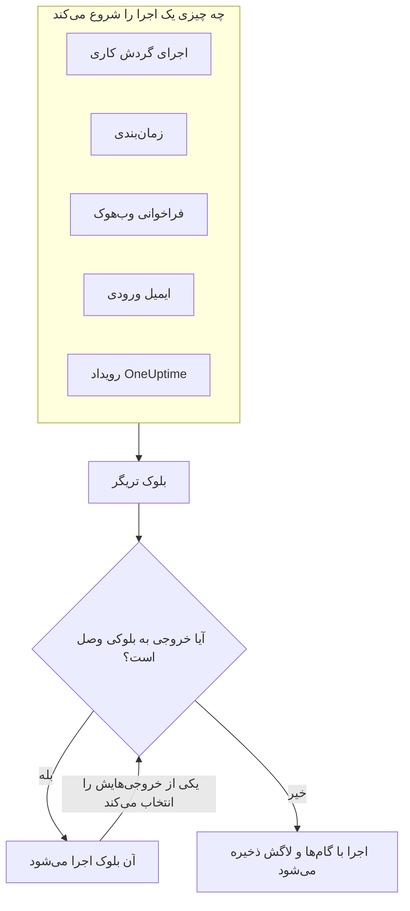
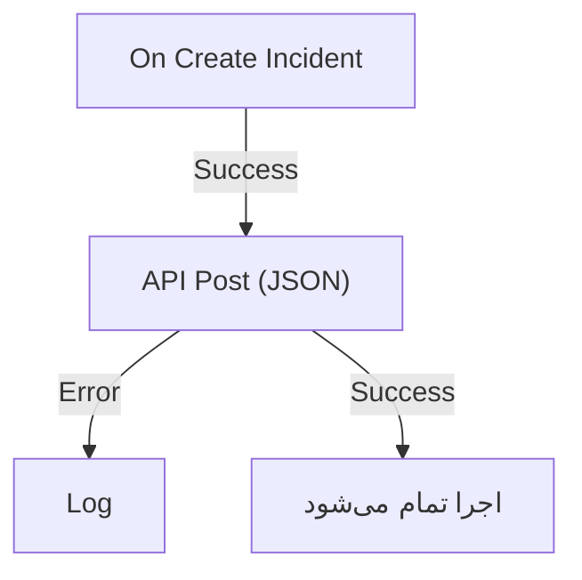

# نمای کلی گردش‌های کاری

گردش‌های کاری کار را در OneUptime بدون کد خودکار می‌کنند. بلوک‌ها را روی یک بوم می‌گذارید، به هم وصلشان می‌کنید، و گردش کاری هر بار که تریگرش فعال شود خودش اجرا می‌شود: حادثه‌ای ساخته می‌شود، زمانی از زمان‌بندی فرا می‌رسد، ابزار دیگری یک نشانی را فراخوانی می‌کند، یا ایمیلی می‌رسد. از آن‌ها برای وصل کردن OneUptime به بقیه پشته فنی‌تان و انجام کارهای پیگیری روزمره استفاده کنید، در حالی که خودتان روی خود مشکل کار می‌کنید.

:::cards
- [نوشتن یک گردش کاری](/docs/workflows/authoring): یک گردش کاری بسازید، سپس بلوک‌هایش را روی بوم اضافه، وصل و تنظیم کنید.
- [تریگرها](/docs/workflows/triggers): یک گردش کاری را دستی، طبق زمان‌بندی، از یک وب‌هوک، یک ایمیل یا یک رویداد OneUptime شروع کنید.
- [مؤلفه‌ها](/docs/workflows/components): هر بلوکی که می‌توانید اضافه کنید، از فراخوانی API تا رکوردهای OneUptime.
- [اجراها](/docs/workflows/runs-and-logs): ببینید هر اجرا گام‌به‌گام چه کرد.
:::

## یک گردش کاری چگونه کار می‌کند

هر گردش کاری سه بخش دارد:

1. **یک تریگر** — چیزی که گردش کاری را شروع می‌کند: یک اجرای دستی، یک زمان‌بندی، یک فراخوانی وب‌هوک، یک ایمیل ورودی، یا رویدادی در OneUptime مانند یک حادثه تازه. هر گردش کاری دقیقاً یکی دارد.
2. **مؤلفه‌ها** — کاری که گردش کاری انجام می‌دهد: فرستادن پیام، فراخوانی یک API، بررسی یک شرط، ساختن یا به‌روزرسانی یک رکورد OneUptime.
3. **اتصال‌ها** — خط‌هایی که از یک بلوک به بلوک بعدی می‌کشید. این‌ها تعیین می‌کنند چه چیزی پس از چه چیزی اجرا شود.

وقتی تریگر فعال می‌شود، OneUptime یک **اجرا** را شروع می‌کند. هر بلوک با انتخاب یکی از خروجی‌هایش به پایان می‌رسد، مانند **Success** یا **Error**، **Yes** یا **No**، و پس از آن فقط بلوک‌هایی اجرا می‌شوند که به همان خروجی وصل‌اند. اگر هیچ بلوکی به خروجی‌ای که یک بلوک انتخاب کرده وصل نباشد، آن مسیر همان‌جا تمام می‌شود. اجرا همراه با وضعیتش، مسیری که طی کرده و آنچه هر بلوک دریافت و برگرداند ذخیره می‌شود.



همه این‌ها را به‌صورت دیداری روی یک بوم می‌سازید. بیشتر گردش‌های کاری اصلاً به کد نیاز ندارند؛ وقتی نیاز باشد، یک بلوک **Run Custom JavaScript** چند خط JavaScript اجرا می‌کند.

## با گردش‌های کاری چه می‌توانید بکنید

- **OneUptime را به ابزارهای دیگرتان وصل کنید** — در Slack، Microsoft Teams، Discord، Telegram یا IRC پیام بگذارید، تیکت Jira بسازید، یا به هر API در پشته‌تان درخواست بفرستید.
- **به آنچه در OneUptime رخ می‌دهد واکنش نشان دهید** — وقتی حادثه‌ای ساخته می‌شود، به کانال درست خبر دهید و خودکار یک تیکت باز کنید.
- **کارها را طبق زمان‌بندی اجرا کنید** — هر پنج دقیقه، هر شب، هر دوشنبه صبح.
- **داده را از بیرون دریافت کنید** — بگذارید سامانه‌های دیگر با فراخوانی نشانی گردش کاری یا فرستادن ایمیل به نشانی آن، گردش کاری را شروع کنند.
- **خودکارسازی مشترک را دوباره به کار ببرید** — یک بار بسازیدش و از هر گردش کاری دیگری با یک بلوک **Execute Workflow** شروعش کنید.

## اصطلاح‌های کلیدی

| اصطلاح             | معنی                                                                                                   |
| ------------------ | ------------------------------------------------------------------------------------------------------ |
| **گردش کاری**      | کل خودکارسازی: یک نام، یک بوم از بلوک‌ها، و کلیدی برای روشن یا خاموش کردن آن.                          |
| **تریگر**          | نخستین بلوک. تعیین می‌کند گردش کاری کی اجرا شود. هر گردش کاری دقیقاً یکی دارد.                        |
| **مؤلفه**          | هر بلوک دیگر: پیام می‌فرستد، درخواست می‌دهد، شرطی را بررسی می‌کند یا رکوردی را تغییر می‌دهد.            |
| **خروجی**          | نقطه‌ای در پایین یک بلوک، مانند **Success** یا **Error**. خط‌هایی که از آن بیرون می‌آیند به بلوک‌های بعدی می‌رسند. |
| **اجرا**           | یک بار اجرای گردش کاری، که با وضعیت، مهرهای زمانی و کاری که هر بلوک کرد ذخیره می‌شود.                  |
| **متغیر سراسری**   | مقداری، مانند یک کلید API، که یک بار ذخیره‌اش می‌کنید و در هر گردش کاری پروژه به کارش می‌برید.          |

## پیش از شروع

- **طرحی که گردش‌های کاری را شامل شود.** در OneUptime Cloud، گردش‌های کاری به طرح **Growth** یا بالاتر نیاز دارند، و هر طرح در هر ۳۰ روز تعداد مشخصی اجرا را مجاز می‌داند — [محدودیت‌های طرح](/docs/workflows/configuration#محدودیتهای-طرح) را ببینید. نصب‌های خودمیزبانِ بدون صورت‌حساب هیچ‌کدام از این محدودیت‌ها را ندارند.
- **مجوز ساختن.** ساختن و تغییر دادن گردش‌های کاری به **Workflow Admin**، **Project Admin** یا **Project Owner**، یا نقشی سفارشی با مجوزهای متناظر نیاز دارد. یک **Workflow Member** می‌تواند گردش‌های کاری را باز کند و دستی اجرایشان کند، اما نمی‌تواند تغییرشان دهد. [دسترسی‌ها](/docs/workflows/configuration#دسترسیها) را ببینید.

## گردش‌های کاری را کجای OneUptime پیدا کنیم

در نوار بالا **محصولات** را باز کنید و زیر **داشبوردها و خودکارسازی** گزینه **گردش‌های کاری** را انتخاب کنید. منوی آن شامل این‌هاست:

- **گردش‌های کاری** — فهرست گردش‌های کاری شما. یکی تازه بسازید یا یکی موجود را باز کنید.
- **متغیرهای سراسری** — مقدارهایی که همه گردش‌های کاری شما مشترکاً دارند.
- **لاگ‌ها → اجراها** — تاریخچه اجرای همه گردش‌های کاری پروژه‌تان.
- **تنظیمات → قواعد برچسب** و **قواعد مالکیت** — به گردش‌های کاری تازه خودکار برچسب بزنید و مالکانشان را تعیین کنید.
- **پیشرفته → بایگانی‌شده** — گردش‌های کاری‌ای که بایگانی کرده‌اید. هرگز اجرا نمی‌شوند و در فهرست نمی‌آیند؛ از همین‌جا از بایگانی خارجشان کنید. [بایگانی کردن یک گردش کاری](/docs/workflows/configuration#بایگانی-کردن-یک-گردش-کاری) را ببینید.
- **توسعه‌دهنده** — چگونه گردش‌های کاری را با Terraform، API یا یک دستیار هوش مصنوعی مدیریت کنید.

یک گردش کاری را باز کنید تا منوی خودش این‌ها را نشان دهد:

- **نمای کلی** — نام، توضیحات، برچسب‌ها و کلید **فعال**.
- **سازنده** — بومی که گردش کاری را روی آن طراحی می‌کنید، با کلید **فعال** در بالای آن.
- **متغیرهای گردش کاری** — مقدارهایی که فقط به همین گردش کاری تعلق دارند.
- **لاگ‌ها → اجراها** — هر اجرای این گردش کاری، با جزئیات.
- **مالکان** — افراد و تیم‌هایی که مسئول این گردش کاری‌اند.
- **توسعه‌دهنده** — چگونه این گردش کاری را با Terraform، API یا یک دستیار هوش مصنوعی مدیریت کنید.
- **تنظیمات** — تکثیر، خروجی گرفتن و بایگانی کردن.

**تنظیمات** در بخش **پیشرفته** منو، کنار **گزارش‌های ممیزی** و **حذف گردش کاری** قرار دارد. **پیشرفته** و **توسعه‌دهنده** در این منو و در هر منوی دیگری در ابتدا جمع‌شده‌اند، تا صفحه‌هایی که هر روز به کار می‌برید اول بیایند. روی نام یک بخش کلیک کنید تا صفحه‌هایش نمایش داده شوند. وقتی در یکی از آن صفحه‌ها باشید، خودش باز می‌شود.

## ساخت اولین گردش کاری

هر گردش کاری به همین روش ساخته می‌شود:

:::steps
1. **بسازید** — یک نقطه شروع انتخاب کنید، سپس برای گردش کاری‌تان نامی بگذارید. [نوشتن یک گردش کاری](/docs/workflows/authoring) را ببینید.
2. **یک تریگر انتخاب کنید** — دستی، زمان‌بندی‌شده، وب‌هوک، ایمیل ورودی، یا رویدادی از OneUptime. [تریگرها](/docs/workflows/triggers) را ببینید.
3. **مؤلفه‌ها را اضافه کنید** — کنش‌ها را روی بوم بگذارید و به هم وصلشان کنید. [مؤلفه‌ها](/docs/workflows/components) را ببینید.
4. **روشنش کنید** — در بالای **سازنده**، **فعال** را روشن کنید. یک گردش کاری غیرفعال اصلاً اجرا نمی‌شود، حتی دستی.
5. **آزمایش کنید** — در **سازنده** روی **اجرای گردش کاری** کلیک کنید و اجرا را در حین رخ دادن تماشا کنید.
:::

نمونه زیر این گام‌ها را برای یک گردش کاری واقعی دنبال می‌کند.

## نمونه: فرستادن حادثه‌های تازه به یک وب‌هوک

این گردش کاری یک خلاصه JSON از هر حادثه تازه را به نشانی‌ای که خودتان تعیین می‌کنید می‌فرستد — یک سامانه تیکت، یک انبار داده، هر چیزی که وب‌هوک بپذیرد — و وقتی درخواست شکست بخورد، دلیلش را در لاگ اجرا می‌نویسد.



> [!TIP]
> قالب **Forward new incidents to another system** همین گردش کاری را برایتان می‌سازد. هنگام ساختن یک گردش کاری، آن را زیر **حوادث** پیدا کنید.

:::steps
### ساختن گردش کاری

**گردش‌های کاری** را باز کنید و روی **ساخت گردش کاری** کلیک کنید. روی **شروع از صفر** کلیک کنید، نام گردش کاری را `Send new incidents to a webhook` بگذارید و روی **ساخت گردش کاری** کلیک کنید.

گردش کاری تازه در **سازنده** و در حالت خاموش باز می‌شود.

### افزودن تریگر

روی بلوک خط‌چین **Choose what starts this workflow** کلیک کنید، سپس در پنل **Add Trigger** زیر **Popular** روی **On Create Incident** کلیک کنید.

تریگر جای بلوک خط‌چین را می‌گیرد. شناسه‌ای که روی آن هست، `incident-on-create-1`، همان چیزی است که بلوک‌های بعدی با آن به این تریگر ارجاع می‌دهند.

### انتخاب فیلدهای حادثه

روی تریگر کلیک کنید. در **Select Fields** فیلدهایی را که درخواست باید با خود ببرد، مانند عنوان و توضیحات، علامت بزنید و روی **ذخیره** کلیک کنید.

تریگر حادثه تازه را همراه با این فیلدها به جلو می‌فرستد. فیلدی که انتخاب نکنید خالی می‌رسد.

### افزودن بلوک API

روی **افزودن مؤلفه** کلیک کنید، سپس زیر **Popular** روی **API Post (JSON)** کلیک کنید. از نقطه **Success** تریگر به پایین تا نقطه بالایی بلوک تازه بکشید.

### پر کردن درخواست

روی بلوک API که رویش **Click to set up** نوشته شده کلیک کنید. نقطه پایانی خود را در **URL** بگذارید. در **Request Body** محتوای JSON برای فرستادن را بنویسید، هر جا لازم بود با **{ }** فیلدهای حادثه را درج کنید، و روی **ذخیره** کلیک کنید.

```json title="Request Body"
{
  "id": "{{local.components.incident-on-create-1.returnValues.model._id}}",
  "title": "{{local.components.incident-on-create-1.returnValues.model.title}}",
  "description": "{{local.components.incident-on-create-1.returnValues.model.description}}"
}
```

وقتی گردش کاری اجرا می‌شود، هر ارجاع `{{…}}` با مقدار حادثه جایگزین می‌شود. برای نحو، [متغیرها](/docs/workflows/variables) را ببینید.

### گرفتن شکست‌ها

روی **افزودن مؤلفه** کلیک کنید، سپس روی **لاگ** کلیک کنید. نقطه **Error** بلوک API را به آن وصل کنید، سپس **Value** بلوک Log را روی `Could not send the incident: {{local.components.api-post-1.returnValues.error}}` بگذارید.

درخواستی که شکست بخورد — نشانی‌ای که در دسترس نیست، یا پاسخی که 2xx نیست — حالا این مسیر را می‌رود و لاگ اجرا دلیلش را می‌گوید.

### روشن کردنش

در بالای **سازنده**، **فعال** را روشن کنید.

### آزمایشش

روی **اجرای گردش کاری** کلیک کنید، **شناسه حادثه** یکی از حادثه‌های همین پروژه را وارد کنید، روی **Run Workflow Manually** کلیک کنید و با **Run** تأیید کنید.

پنل **اجرای گردش کاری** باز می‌شود و اجرا را دنبال می‌کند. گام **API Post (JSON)** را باز کنید تا بدنه‌ای که فرستاد و پاسخی که گرفت را ببینید.
:::

از این پس، هر حادثه تازه در پروژه یک اجرا را شروع می‌کند. همه آن‌ها را در [اجراها](/docs/workflows/runs-and-logs)ی گردش کاری پیدا می‌کنید.

> [!NOTE]
> درخواست از OneUptime بیرون می‌رود. در OneUptime Cloud، نشانی باید از اینترنت در دسترس باشد. یک نصب خودمیزبان نشانی‌های شبکه خصوصی را رد می‌کند، مگر اینکه مدیری اجازه‌شان را بدهد — [دسترسی شبکه خروجی](/docs/workflows/configuration#دسترسی-شبکه-خروجی) را ببینید.

## گردش‌های کاری چگونه با بقیه OneUptime جور می‌شوند

- **مانیتورها** مشکل را تشخیص می‌دهند. **حوادث** و **هشدارها** آن را ثبت می‌کنند. **گردش‌های کاری** به آن واکنش نشان می‌دهند.
- **رانبوک‌ها** رویه‌های پاسخی‌اند که تیم شما هنگام یک حادثه، هشدار یا رویداد نگهداری طی می‌کند: گام‌های دستی، تأییدها و اسکریپت‌ها، با حضور افراد. گردش‌های کاری بدون نظارت اجرا می‌شوند. وقتی کسی باید در طول کار تصمیم بگیرد از یک [رانبوک](/docs/runbooks/index) استفاده کنید، و وقتی هر گام خودکار است از یک گردش کاری.
- **اتصال‌های فضای کاری** یک پروژه را برای کانال‌های حادثه و اعلان‌ها به Slack و Microsoft Teams وصل می‌کنند. بلوک‌های Slack و Microsoft Teams در گردش کاری از آن‌ها استفاده نمی‌کنند: هر بلوک از طریق نشانی وب‌هوک ورودی خودش پیام می‌گذارد.

## گام‌های بعدی

:::cards
- [نوشتن یک گردش کاری](/docs/workflows/authoring): با بوم، بلوک‌ها و تنظیمات آن‌ها کار کنید.
- [متغیرها](/docs/workflows/variables): داده را بین بلوک‌ها جابه‌جا کنید و رازها را بیرون از گردش‌های کاری‌تان نگه دارید.
- [پیکربندی و ایمنی](/docs/workflows/configuration): دسترسی‌ها، محدودیت‌ها و امنیت پیش از راه‌اندازی.
:::
