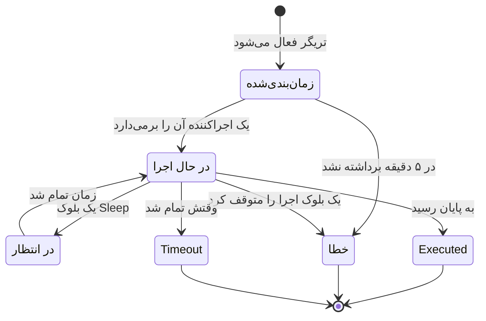

# اجراهای گردش کاری

هر بار که یک گردش کاری اجرا می‌شود، OneUptime رکوردی از آنچه رخ داد ذخیره می‌کند — کی اجرا شد، آیا کار کرد، و هر بلوک چه دریافت کرد و چه برگرداند. به این رکورد یک **اجرا** می‌گویند. با اجراها تأیید می‌کنید که یک گردش کاری کار کرد، گردش کاری‌ای را که کار نکرد عیب‌یابی می‌کنید، و به فعالیت‌های گذشته نگاه می‌کنید.

:::cards
- [وضعیت‌های اجرا](#وضعیتهای-اجرا): معنای زمان‌بندی‌شده، در انتظار، Executed و وضعیت‌های دیگر.
- [خواندن یک اجرا](#خواندن-یک-اجرا): مسیری را که یک اجرا رفت، بلوک به بلوک دنبال کنید.
- [عیب‌یابی](#عیبیابی): گردش کاری‌ای که اجرا نشد، بلوکی که هرگز اجرا نشد، مقداری که خالی رسید.
:::

## کجا پیدایشان کنیم

| صفحه                                  | آنچه می‌بینید                                                                                       |
| ------------------------------------- | --------------------------------------------------------------------------------------------------- |
| **گردش‌های کاری → لاگ‌ها → اجراها**   | هر اجرا از هر گردش کاری در پروژه. بر اساس نام گردش کاری، وضعیت و زمان فیلتر کنید.                  |
| **گردش کاری → لاگ‌ها → اجراها**       | فقط اجراهای همین یک گردش کاری. این صفحه به جای فیلتر گردش کاری، فیلتر **شناسه اجرا** دارد.          |
| **یک اجرای تنها**                     | با دکمه **مشاهده لاگ‌ها** در ردیف یک اجرا باز می‌شود — خود ردیف‌های اجرا قابل کلیک نیستند.          |

شروع یک اجرا از **سازنده** همان نمای **اجرای گردش کاری** را باز می‌کند که از پیش اجرا را دنبال می‌کند، تا به جای گشتن به دنبالش پس از پایان، رخ دادنش را تماشا کنید.

## وضعیت‌های اجرا

| وضعیت                               | معنایش                                                                                                                                                                                                                                                                |
| ----------------------------------- | --------------------------------------------------------------------------------------------------------------------------------------------------------------------------------------------------------------------------------------------------------------------- |
| **زمان‌بندی‌شده**                   | تریگر فعال شد و اجرا در صف یک اجراکننده است. معمولاً کسری از یک ثانیه. اجرایی که پس از ۵ دقیقه هنوز زمان‌بندی‌شده باشد شکست می‌خورد: چیزی آن را برنداشت.                                                                                                         |
| **در حال اجرا**                     | گردش کاری در جریان است.                                                                                                                                                                                                                                               |
| **در انتظار**                       | اجرا روی یک بلوک **Sleep** کنار گذاشته شده و خودش از سر گرفته می‌شود. در حین انتظار هیچ کارگری را اشغال نمی‌کند.                                                                                                                                                   |
| **Executed**                        | اجرا بدون شکست به پایان رسید. این وضعیت موفقیت است: روی برچسب وضعیت **Executed** نوشته می‌شود، نه "Success".                                                                                                                                                        |
| **خطا**                             | یک بلوک اجرا را متوقف کرد. همچنین وقتی به کار می‌رود که یک اجرای در صف هرگز برداشته نشود، وقتی از سرگیری یک اجرای خوابیده گم شود، وقتی یک عبارت زمان‌بندی قابل تحلیل نباشد، و وقتی گردش کاری در حالی که اجرا روی یک بلوک **Sleep** منتظر بود خاموش یا بایگانی شده باشد. |
| **Timeout**                         | اجرا بیش از حد مجاز طول کشید: به‌طور پیش‌فرض ۲ دقیقه. [یک اجرا چقدر می‌تواند طول بکشد](/docs/workflows/configuration#یک-اجرا-چقدر-میتواند-طول-بکشد) را ببینید.                                                                                                             |
| **Execution Exceeded Current Plan** | پروژه اجراهای گردش کاری خود در ۳۰ روز گذشته را تمام کرده، یا اشتراک پرداخت نشده است. اجرا ثبت می‌شود اما انجام نمی‌شود. فقط در OneUptime Cloud.                                                                                                                     |

بلوکی که خروجی **Error** خود را برمی‌گزیند — مثلاً بلوک APIای که پاسخ 4xx گرفته — اجرا را ناموفق نمی‌کند. بلوک‌هایی که به **Error** وصل‌اند اجرا می‌شوند، و اجرا همچنان با **Executed** پایان می‌یابد. خود گام به رنگ قرمز کشیده می‌شود، تا بتوانید پیدایش کنید.

## خواندن یک اجرا

برای باز کردن یک اجرا، روی **مشاهده لاگ‌ها** در آن کلیک کنید. نمای **اجرای گردش کاری** دو زبانه دارد، **گام‌ها** و **Full Log**.

### زبانه گام‌ها

مسیری که اجرا رفت، یک کارت شماره‌دار برای هر بلوک، به ترتیبی که اجرا شدند. بدون باز کردن چیزی، هر کارت این‌ها را نشان می‌دهد:

- عنوان و شناسه بلوک، اینکه **موفق** بود یا **ناموفق**، و چقدر طول کشید.
- کدام خروجی را برگزید، با همان نامی که بوم به آن می‌دهد، و به کجا رسید: شماره و نام گام بعدی، یا یادداشتی که می‌گوید چیزی به آن وصل نیست، پس اجرا یا آن شاخه همان‌جا تمام شد. گامی که به آن رسید ولی هرگز اجرا نشد **(did not run)** را نشان می‌دهد. خروجی Error به رنگ قرمز کشیده می‌شود؛ Yes و No فقط راهی‌اند که اجرا رفت. برای دیدن معنای یک خروجی، اشاره‌گر را روی نامش نگه دارید.
- خطای گام، اگر شکست خورده باشد، و هر هشداری درباره آن — برای نمونه ارجاعی مانند `{{…}}` که به هیچ چیز تحلیل نشد.

برای دیدن دو بخش جزئیات، یک کارت را باز کنید:

| بخش          | آنچه نشان می‌دهد                                                                                                                                                                                                 |
| ------------ | ---------------------------------------------------------------------------------------------------------------------------------------------------------------------------------------------------------------- |
| **Received** | تنظیماتی که به بلوک داده شد، با نام و به ترتیبی که فهرست تنظیماتش آن‌ها را می‌آورد، پس از پر شدن همه متغیرها. تنظیمی که به گام دیگر یا یک متغیر ارجاع می‌دهد، ارجاع را کنار مقداری که به آن تبدیل شد نشان می‌دهد، و وقتی به هیچ چیز تبدیل نشد **Did not resolve** را. |
| **Returned** | آنچه تولید کرد، با شناسه هر مقدار (بخش آخر یک ارجاع `returnValues`). فهرست‌ها و شیءها با تورفتگی نشان داده می‌شوند.                                                                                              |

گام‌های ناموفق، گام‌های دارای هشدار، و تنها گام یک اجرا، باز شروع می‌شوند. شمارنده زبانه **گام‌ها** وقتی چیزی شکست خورده باشد قرمز، و وقتی گامی هشدار داشته باشد کهربایی می‌شود.

چند نوع اجرا جور دیگری خوانده می‌شوند:

- **آزمون یک گام.** اجرایی که با **Run just this step** شروع شده، در بالا **Only this step ran** را نشان می‌دهد. گام‌های پیش از آن اجرا نشدند، پس مقدارهایی که از آن‌ها می‌خواند وجود ندارند (برای آن‌ها منتظر هشدار **Did not resolve** باشید)، و گام‌های پس از آن **(not run in this test)** را نشان می‌دهند. برای امتحان کل مسیر از **اجرای گردش کاری** استفاده کنید.
- **اجرایی که بین گام‌ها متوقف شد.** اگر اجرا به دلیلی متوقف شد که هیچ گامی توضیحش نمی‌دهد — بین گام‌ها وقتش تمام شد، یا پیش از نخستین گامش شکست خورد — مسیر با **The run stopped here** و دلیل آن پایان می‌یابد.
- **اجرای خوابیده.** اجرایی که روی یک بلوک **Sleep** منتظر است با **Sleeping** و زمانی که خودش ادامه می‌دهد پایان می‌یابد؛ گام‌های پس از Sleep عبارت **(not run yet)** را نشان می‌دهند.

شناسه زیر عنوان هر گام دقیقاً همان چیزی است که در یک ارجاع `{{local.components.<id>.returnValues.…}}` قرار می‌گیرد، و همین این نما را سریع‌ترین راه برای درست نوشتن یک ارجاع می‌کند.

مقدارهای نشان‌داده‌شده همان چیزی‌اند که بلوک دریافت کرد، پس از پر شدن متغیرها و پیش از اینکه بلوک کاری با آن‌ها بکند، با دو استثنا: رازها و فیلدهایی که بلوک حساس علامت می‌زند پنهان می‌شوند، و مقداری بلندتر از ۴٬۰۰۰ نویسه با "… (truncated)" کوتاه می‌شود. یک اجرا ۱۰۰ گام آخرش را نگه می‌دارد؛ اجرایی طولانی، یا اجرایی که بارها از سر گرفته شده، جایی که گام‌های قبلی کنار گذاشته شدند یک یادداشت کهربایی نشان می‌دهد. اجراهایی که پیش از نگه داشتن نام خروجی‌ها ثبت شده‌اند، خروجی را با شناسه‌اش نشان می‌دهند، بدون اینکه بگویند به کجا رسید.

### زبانه Full Log

لاگ خام و سطر به سطری که اجراکننده نوشت، از جمله هر چیزی که خود بلوک‌ها لاگ کردند، مانند مقدار یک بلوک **Log** یا `console.log` یک اسکریپت. وقتی زبانه گام‌ها شکست را توضیح نمی‌دهد از آن استفاده کنید.

## کپی و دانلود یک اجرا

بالای نمای **اجرای گردش کاری**، کنار دکمه بستن آن، **کپی لاگ** کل **Full Log** را در کلیپ‌بورد شما می‌گذارد، آماده چسباندن در یک گفت‌وگو یا یک تیکت. **دانلود** اجرا را به شکل یک فایل ذخیره می‌کند:

| دانلود                          | آنچه می‌گیرید                                                                                                                                                                                                                          |
| ------------------------------- | -------------------------------------------------------------------------------------------------------------------------------------------------------------------------------------------------------------------------------------- |
| **دانلود لاگ**                  | یک فایل `.txt` با لاگ کامل، دقیقاً همان‌طور که اجراکننده چاپ کرد، هر قدر هم بلند، زیر یک سرآغاز کوتاه: نام و شناسه گردش کاری، شناسه اجرا، وضعیتش، و اینکه کی زمان‌بندی شد، شروع شد و به پایان رسید.                                  |
| **دانلود اجرا به‌صورت JSON**    | یک فایل `.json` با همان واقعیت‌ها به شکل داده، گام‌هایی که زبانه **گام‌ها** نشان می‌دهد (آنچه هر کدام دریافت کرد و برگرداند، و کدام خروجی را برگزید)، و لاگ به شکل فهرستی از سطرها. گام‌ها همان شکلی را دارند که API در `stepTrace` یک اجرا برمی‌گرداند، و مانند زبانه **گام‌ها**، ۱۰۰ گام آخر اجرا هستند. لاگ همیشه کامل است. |

همین دو دانلود در منوی **⋯** هر اجرا در هر دو فهرست اجراها هم هستند، تا بتوانید یک اجرا را بدون باز کردنش ذخیره کنید. اجرایی را که از **سازنده** شروع کرده‌اید می‌توان در حالی که هنوز در جریان است کپی یا دانلود کرد؛ آنچه را تا آن لحظه لاگ کرده می‌گیرید.

نام فایل‌ها از گردش کاری، اجرا و زمان شروع آن به وقت UTC ساخته می‌شود، پس پوشه‌ای از آن‌ها اول بر اساس گردش کاری و سپس بر اساس زمان مرتب می‌شود: `nightly-sync-run-<run id>-2026-09-30T10-00-01.txt`.

یک دانلود چیزی ندارد که نتوانید از پیش در اجرا بخوانید. رازها و فیلدهایی که یک بلوک حساس علامت می‌زند هنگام ثبت اجرا پنهان می‌شوند، پس در فایل هم پنهان‌اند، و هر کسی که بتواند یک اجرا را باز کند می‌تواند دانلودش کند.

## عیب‌یابی

:::details گردش کاری من اجرا نشد
1. مطمئن شوید گردش کاری **فعال** است: کلید آن بالای **سازنده** آن است، که وقتی گردش کاری خاموش است این را بالای بوم می‌گوید. گردش‌های کاری تازه غیرفعال شروع می‌شوند، و یک گردش کاری غیرفعال هر اجرایی را رد می‌کند — از جمله اجراهای دستی. یک فراخوانی وب‌هوک به آن پاسخ HTTP 400 را با پیامی می‌گیرد که می‌گوید چگونه روشنش کنید.
2. برای یک تریگر رویداد OneUptime، مطمئن شوید رویداد واقعاً رخ داده است: رکورد را باز کنید و تاریخچه‌اش را بررسی کنید. یک تریگر **On Update** با **Listen on** فقط وقتی فعال می‌شود که یکی از آن فیلدها تغییر کرده باشد.
3. برای یک تریگر وب‌هوک، مطمئن شوید سامانه دیگر به نشانی درست می‌فرستد. بیشتر ابزارها هنگام فرستادن یک وب‌هوک آن را لاگ می‌کنند — آن‌جا را بررسی کنید.
4. برای یک تریگر زمان‌بندی، مطمئن شوید عبارت cron با زمانی که انتظار دارید جور است. زمان‌بندی‌ها به وقت UTC اجرا می‌شوند.

اگر اجرا ظاهر می‌شود ولی با وضعیت **Execution Exceeded Current Plan**، پروژه همه اجراهای گردش کاری خود در ۳۰ روز گذشته را مصرف کرده، یا اشتراک پرداخت نشده است. لاگ اجرا تعداد و حد طرح شما را می‌گوید. این فقط درباره OneUptime Cloud صدق می‌کند.
:::

:::details یک بلوک بعدی هرگز اجرا نشد
بلوکی که اجرا نمی‌شود معمولاً مشکلی در اتصال‌هاست. **سازنده** را باز کنید و بررسی کنید:

- آیا خروجی بلوک قبلی به ورودی این بلوک وصل است؟
- آیا بلوک قبلی خروجی دیگری از آنچه انتظار داشتید برگزید — **Error** به جای **Success**، یا **No** به جای **Yes**؟ زبانه **گام‌ها** می‌گوید کدام خروجی را برگزید و به کجا رسید، یا اینکه چیزی به آن وصل نیست.
:::

:::details یک مقدار خالی رسید، یا به شکل متن {{…}}
اجرا را باز کنید و به گام نگاه کنید. ارجاعی که تحلیل نشد روی خود گام به شکل یک هشدار اعلام می‌شود، و تنظیم آن در بخش **Received** با **Did not resolve** علامت می‌خورد.

- اگر متن خام `{{local.components.…}}` را می‌بینید، ارجاع تحلیل نشد. معمولاً این یک غلط تایپی در شناسه مؤلفه یا شناسه مقدار بازگشتی است — به یاد داشته باشید که منظور **Identifier** بلوک است، نه نامی که روی آن نوشته شده. املای خود `local.components` را هم بررسی کنید: `{{local.componets.api-get-1.returnValues.response-body}}` به شکل متن خام فرستاده می‌شود و اجرا باز هم **Executed** را گزارش می‌کند. اگر اجرا یک آزمون **Run just this step** بود، بلوک قبلی اصلاً اجرا نشد — به جای آن کل گردش کاری را اجرا کنید.
- اگر **Empty text** را می‌بینید، بلوک قبلی اجرا شد ولی آن فیلد را تولید نکرد.

همین هشدار در زبانه **Full Log** هم به شکل سطری می‌آید که با `Warning:` شروع می‌شود.
:::

:::details وقتی دستی اجرایش می‌کنم کار می‌کند ولی از تریگر نه
**سازنده** را باز کنید، روی **اجرای گردش کاری** کلیک کنید، و فیلدهای تریگر را با مقدارهایی پر کنید که شبیه چیزی‌اند که تریگر واقعی می‌فرستد. سپس مقدارهای **Received** آن اجرا را کنار مقدارهای اجرای واقعی مقایسه کنید. تفاوت معمولاً نام یا نوع یک فیلد است.
:::

## اجرای دوباره یک گردش کاری

دکمه‌ای برای "تلاش دوباره این اجرا" وجود ندارد. اجراهای قدیمی هرگز خودکار دوباره اجرا نمی‌شوند، چون ممکن است تکرار اثرهای جانبی‌شان — پیام‌های Slack، فراخوانی‌های API، تیکت‌ها — امن نباشد. برای انجام دوباره کار، گردش کاری را درست کنید و بگذارید تریگر واقعی بعدی آن را فعال کند، یا **سازنده** را باز کنید و با همان مقدارها روی **اجرای گردش کاری** کلیک کنید.

## اجراها چه مدت نگه داشته می‌شوند؟

در OneUptime Cloud، اجراها **۳۰ روز** نگه داشته و سپس حذف می‌شوند — به همین دلیل هر دو فهرست اجراها می‌گویند ۳۰ روز گذشته را پوشش می‌دهند. نصب‌های خودمیزبان اجراها را تا وقتی حذفشان کنید نگه می‌دارند؛ اگر یک گردش کاری خیلی زیاد اجرا می‌شود و تاریخچه شما را شلوغ می‌کند، خاموشش کنید یا حذفش کنید.

اجراهایی که پیش از افزوده شدن ردگیری گام‌ها ثبت شده‌اند محتوای **گام‌ها** ندارند و فقط **Full Log** خود را نشان می‌دهند.

## گام‌های بعدی

:::cards
- [پیکربندی و ایمنی](/docs/workflows/configuration): محدودیت‌های زمانی، محدودیت‌های طرح و آنچه در لاگ‌ها پنهان می‌شود.
- [متغیرها](/docs/workflows/variables): نحو ارجاعی که بلوک‌هایتان به کار می‌برند.
- [مؤلفه‌ها](/docs/workflows/components): آنچه هر بلوک برمی‌گرداند و کی هر خروجی را برمی‌گزیند.
:::
