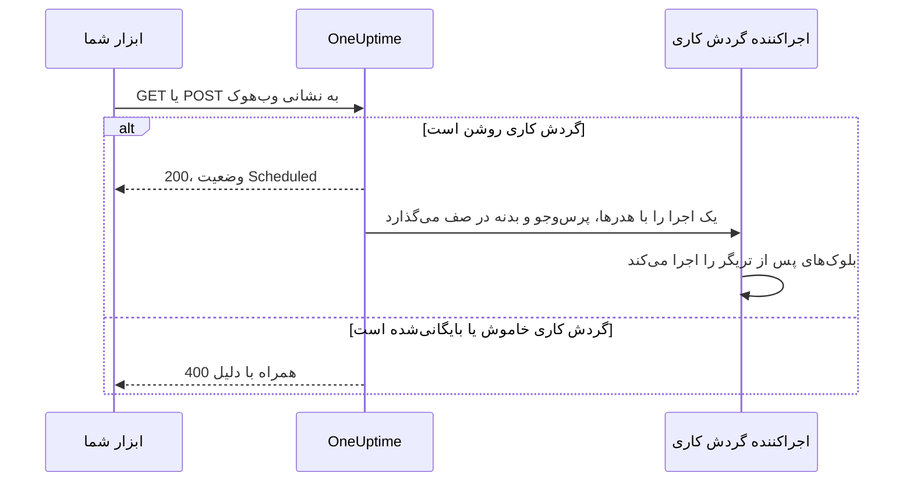
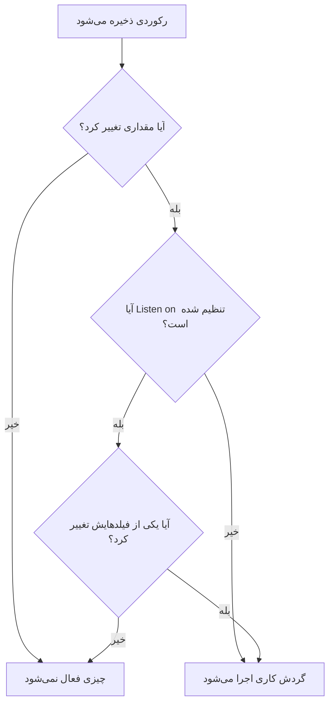

# تریگرهای گردش کاری

تریگر نخستین بلوک یک گردش کاری است — تعیین می‌کند گردش کاری کی اجرا شود. هر گردش کاری دقیقاً یک تریگر دارد. از میان پنج نوع انتخاب می‌کنید.

:::cards
- [دستی](#manual): گردش کاری را از سازنده یا از یک گردش کاری دیگر شروع کنید.
- [زمان‌بندی](#schedule): آن را طبق یک زمان‌بندی تکرارشونده که با یک عبارت cron نوشته شده اجرا کنید.
- [وب‌هوک](#webhook): بگذارید سامانه‌ای دیگر با فراخوانی یک نشانی شروعش کند.
- [ایمیل ورودی](#incoming-email): با هر ایمیلی که به نشانی اختصاصی‌اش فرستاده شود شروعش کنید.
- [تریگرهای رویداد OneUptime](#تریگرهای-رویداد-oneuptime): وقتی رکوردی ساخته، به‌روزرسانی یا حذف می‌شود واکنش نشان دهید.
:::

برای افزودن تریگر، روی بلوک خط‌چین **Choose what starts this workflow** در بوم یک گردش کاری تازه کلیک کنید. برای تغییرش، بلوک تریگر را حذف کنید تا بلوک خط‌چین برگردد. [نوشتن یک گردش کاری](/docs/workflows/authoring#افزودن-بلوکها) را ببینید.

## کدام تریگر را انتخاب کنم؟

| اگر می‌خواهید…                                 | انتخاب کنید                 |
| ---------------------------------------------- | --------------------------- |
| با کلیک روی یک دکمه گردش کاری را اجرا کنید     | **Manual**                  |
| طبق یک زمان‌بندی تکرارشونده اجرا کنید          | **زمان‌بندی**               |
| بگذارید سامانه‌ای دیگر داده بفرستد             | **وب‌هوک**                  |
| از یک ایمیل شروع کنید                          | **Incoming Email**          |
| به چیزی در OneUptime واکنش نشان دهید           | **رویداد OneUptime**        |

یک گردش کاری فقط می‌تواند یک تریگر داشته باشد. اگر به دو راه برای شروع یک خودکارسازی یکسان نیاز دارید، منطق مشترک را در گردش کاری‌ای با تریگر **Manual** بسازید و آن را از دو گردش کاری «پوششی» نازک با یک بلوک **Execute Workflow** شروع کنید.

## Manual

گردش کاری را هر وقت خواستید اجرا کنید: در صفحه **سازنده** روی **اجرای گردش کاری** کلیک کنید، **JSON** تریگر را پر کنید، روی **Run Workflow Manually** کلیک کنید و با **Run** تأیید کنید. یک گردش کاری دیگر هم می‌تواند با یک بلوک **Execute Workflow** آن را شروع کند.

مناسب برای: خودکارسازی یک‌کلیکی که برایش دکمه می‌خواهید، مانند «چرخاندن این کلید» یا «فرستادن یک هشدار آزمایشی»، و منطقی که بین گردش‌های کاری مشترک است.

**Returns**: **JSON** — آنچه اجرا با آن شروع شد.

- از **اجرای گردش کاری**، همان JSON است که تایپ کرده‌اید، به شکل متن. برای خواندن فیلدی در آن، اول آن را از یک بلوک **Text to JSON** عبور دهید.
- از یک بلوک **Execute Workflow**، هر کلید در **Arguments** بلوک یک مقدار جداگانه است. با `{"customerId": "42"}`، یک بلوک بعدی `{{local.components.manual-1.returnValues.customerId}}` را می‌خواند، که در آن `manual-1` شناسه تریگر Manual است.

## Schedule

گردش کاری را طبق یک زمان‌بندی تکرارشونده اجرا کنید. در **Schedule at** تعیین کنید هر چند وقت: یکی از **Common schedules** را انتخاب کنید، یک عبارت **Custom cron** تایپ کنید، یا **متغیر**ی را انتخاب کنید که عبارتی در آن است. زیر فیلد، زمان‌بندی با کلمات توصیف می‌شود و **Next runs** هم کنارش می‌آید.

مناسب برای: پاک‌سازی شبانه، همگام‌سازی ساعتی، گزارش‌های هفتگی.

زمان‌ها به UTC هستند، پس هنگام انتخاب ساعت از منطقه زمانی خودتان تبدیل کنید. پنج بخش یک عبارت cron عبارت‌اند از دقیقه، ساعت، روز ماه، ماه و روز هفته:

| عبارت         | اجرا می‌شود                            |
| ------------- | -------------------------------------- |
| `*/5 * * * *` | هر ۵ دقیقه.                            |
| `0 * * * *`   | هر ساعت، سر ساعت.                      |
| `0 0 * * *`   | هر روز در نیمه‌شب UTC.                 |
| `0 9 * * 1-5` | هر روز کاری ساعت ۹:۰۰ UTC.             |
| `0 9 * * 1`   | هر دوشنبه ساعت ۹:۰۰ UTC.               |

تا وقتی گردش کاری خاموش است چیزی زمان‌بندی نمی‌شود. زمان‌بندی‌ای که **متغیر** دارد یک متغیر گردش کاری یا سراسری را می‌خواند، مانند `{{local.variables.schedule}}`. اگر به یک عبارت cron معتبر تبدیل نشود، گردش کاری زمان‌بندی نمی‌شود و یک اجرای ناموفق در فهرست اجراهایش دلیلش را می‌گوید.

برای آزمایش گردش کاری بدون انتظار برای زمان‌بندی، در **سازنده** روی **اجرای گردش کاری** کلیک کنید: بی‌درنگ یک اجرا شروع می‌شود.

## Webhook

OneUptime به گردش کاری یک نشانی اختصاصی می‌دهد. هر چیزی که این نشانی را فراخوانی کند گردش کاری را شروع می‌کند و هدرها، پارامترهای پرس‌وجو و بدنه درخواست را همراهش می‌فرستد.

مناسب برای: دریافت داده در OneUptime از ابزاری دیگر — فراخوان‌های بازگشتی CI/CD، هشدارهای پایش دیگر، ثبت‌نام‌ها در CRM شما.

برای گرفتن نشانی، روی تریگر وب‌هوک روی بوم کلیک کنید. نشانی در بالای تنظیماتش است، با یک دکمه **کپی نشانی**، روش‌هایی که می‌پذیرد، و یک دستور `curl` که می‌توانید برای امتحانش در یک ترمینال جای‌گذاری کنید:

```bash
curl -X POST "https://oneuptime.example.com/workflow/trigger/<secret key>" \
  -H "Content-Type: application/json" \
  -d '{"message": "Hello"}'
```

نشانی هم `GET` و هم `POST` را می‌پذیرد. فراخواننده رسید سریعی می‌گیرد، `{"status": "Scheduled"}` — خود گردش کاری در پس‌زمینه اجرا می‌شود، پس فراخواننده هرگز نمی‌بیند چه می‌کند. فراخوانی یک گردش کاری خاموش یا بایگانی‌شده با HTTP 400 و دلیلش رد می‌شود.



**Returns**:

| مقدار                    | محتوا                                                                                                                  |
| ------------------------ | ---------------------------------------------------------------------------------------------------------------------- |
| **Request Headers**      | هر هدر درخواست، با نامی با حروف کوچک، مانند `content-type`.                                                            |
| **Request Query Params** | پارامترهای پرس‌وجوی نشانی، بر اساس نام.                                                                                |
| **Request Body**         | بدنه‌ای که فراخواننده فرستاد. یک بدنه JSON که با `Content-Type: application/json` فرستاده شود فیلدبه‌فیلد خوانده می‌شود. |

یک فیلد را با افزودن نامش به ارجاع بخوانید، مانند `{{local.components.webhook-1.returnValues.request-body.message}}`.

وقتی درخواستی رسید، انتخابگر مقدار در هر بلوک پس از تریگر می‌داند در آن چه بود: فیلدهای بدنه، هدرها و پارامترهای پرس‌وجو را نشان می‌دهد، هر کدام با محتوایش، تا بتوانید به جای تایپ کردن مسیر، `incident.title` را انتخاب کنید. تا آن موقع می‌گوید هنوز درخواستی نرسیده و **Copy test request** را پیشنهاد می‌کند، یعنی دستوری `curl` به آن نشانی؛ فیلدها به‌محض پایان اجرایی که درخواست شروع می‌کند ظاهر می‌شوند. [استفاده از مقدارهای بلوک‌های قبلی](/docs/workflows/authoring#استفاده-از-مقدارهای-بلوکهای-قبلی) را ببینید.

برای آزمایش گردش کاری بدون ابزار دیگر، در **سازنده** روی **اجرای گردش کاری** کلیک کنید و هدرها، پارامترهای پرس‌وجو و یک بدنه وارد کنید.

### نشانی وب‌هوک را خصوصی نگه دارید

بخش آخر نشانی کلید راز گردش کاری است، و هر کسی که نشانی را دارد می‌تواند گردش کاری را شروع کند. به همین دلیل کلید تا وقتی روی **نمایش** کلیک نکنید پنهان است، و **کپی نشانی** کل نشانی را بدون نمایشش کپی می‌کند.

اگر نشانی لو رفت، در همان جا روی **بازنشانی نشانی** کلیک کنید: گردش کاری نشانی تازه‌ای می‌گیرد و نشانی قدیمی بی‌درنگ از کار می‌افتد، پس هر چیزی را که آن را فرامی‌خواند به‌روز کنید. فقط کسانی که اجازه ویرایش گردش کاری را دارند می‌توانند نشانی‌اش را ببینند یا بازنشانی کنند — [امنیت وب‌هوک](/docs/workflows/configuration#امنیت-وبهوک) را ببینید.

> [!WARNING]
> با نشانی مثل یک گذرواژه رفتار کنید. هر کسی که آن را داشته باشد می‌تواند بدون ورود به سامانه گردش کاری شما را شروع کند.

## Incoming Email

OneUptime به گردش کاری یک نشانی ایمیل اختصاصی می‌دهد. هر ایمیلی که به این نشانی فرستاده شود گردش کاری را شروع می‌کند و ایمیل را همراهش می‌فرستد: چه کسی آن را فرستاد، برای چه کسی بود، موضوع، متن و HTML، هدرها، و نام پیوست‌ها اگر باشند.

مناسب برای: واکنش به ایمیل‌های سامانه‌هایی که نمی‌توانند وب‌هوک فراخوانی کنند — هشدارهای ابزارهای پایش قدیمی، اعلان‌های وضعیت یک فروشنده، گزارشی که یک کار شبانه با ایمیل می‌فرستد.

برای گرفتن نشانی، روی تریگر Incoming Email روی بوم کلیک کنید. نشانی در بالای تنظیماتش است، با یک دکمه **کپی نشانی**. آن را به چیزی بدهید که باید گردش کاری را شروع کند: ابزاری که فقط می‌تواند ایمیل بفرستد، تنظیمات اعلان یک فروشنده، یا یک قاعده بازارسال در صندوق پستی خودتان.

هر ایمیل اجرای خودش را شروع می‌کند. ایمیل به گردش کاری می‌رسد، چه نشانی در گیرنده یا رونوشت باشد، چه رونوشت پنهان، چه از طریق یک قاعده بازارسال. ایمیلی که نشانی را دو بار نام ببرد یک اجرا را شروع می‌کند.

**Returns**:

| مقدار           | محتوا                                                                                                    |
| --------------- | -------------------------------------------------------------------------------------------------------- |
| **From**        | نشانی فرستنده.                                                                                           |
| **To**          | همه کسانی که ایمیل خطاب به آن‌ها بود، در یک سطر، مانند `ops@example.com, oncall@example.com`.            |
| **CC**          | همه کسانی که رونوشت ایمیل را گرفتند، در یک سطر.                                                          |
| **Subject**     | سطر موضوع.                                                                                               |
| **Body**        | متن ساده ایمیل.                                                                                          |
| **HTML Body**   | HTML ایمیل، اگر داشته باشد. Body و HTML Body هر کدام در ۱ مگابایت بریده می‌شوند.                         |
| **Headers**     | هر هدر ایمیل، با نامی با حروف کوچک، مانند `message-id`.                                                  |
| **Attachments** | نام، نوع و اندازه هر پیوست. خود پرونده‌ها ذخیره نمی‌شوند.                                                |
| **Received At** | زمانی که OneUptime ایمیل را دریافت کرد.                                                                  |

وقتی ایمیلی رسید، انتخابگر مقدار در هر بلوک پس از تریگر می‌داند در آن چه بود: هر هدر و هر پیوستی را که ایمیل داشت با محتوایش نشان می‌دهد، تا بتوانید به جای تایپ کردن مسیر، `headers.message-id` را انتخاب کنید. تا آن موقع می‌گوید هنوز ایمیلی به این نشانی نرسیده است. [استفاده از مقدارهای بلوک‌های قبلی](/docs/workflows/authoring#استفاده-از-مقدارهای-بلوکهای-قبلی) را ببینید.

برای امتحان گردش کاری بدون فرستادن ایمیل، در صفحه **سازنده** روی **اجرای گردش کاری** کلیک کنید و یک فرستنده، یک موضوع و یک بدنه پر کنید. مقدارهایی که خالی بگذارید خالی می‌رسند.

ایمیل فقط وقتی گردش کاری را شروع می‌کند که روشن باشد. ایمیلی که به یک گردش کاری خاموش فرستاده شود نادیده گرفته می‌شود، و ایمیلی که به گردش کاری‌ای فرستاده شود که تریگرش دیگر Incoming Email نیست هم همین‌طور.

### نشانی ایمیل را خصوصی نگه دارید

بخشی از نشانی که پیش از `@` می‌آید کلید راز گردش کاری را در خود دارد، و هر کسی که نشانی را دارد می‌تواند گردش کاری را شروع کند. به همین دلیل کلید تا وقتی روی **نمایش** کلیک نکنید پنهان است، و **کپی نشانی** کل نشانی را بدون نمایشش کپی می‌کند.

اگر نشانی لو رفت، در همان جا روی **بازنشانی نشانی** کلیک کنید: گردش کاری نشانی تازه‌ای می‌گیرد و از آن پس ایمیل به نشانی قدیمی نادیده گرفته می‌شود، پس نشانی تازه را به هر چیزی بدهید که به گردش کاری ایمیل می‌زند. فقط کسانی که اجازه ویرایش گردش کاری را دارند می‌توانند نشانی‌اش را ببینند یا بازنشانی کنند — [امنیت ایمیل ورودی](/docs/workflows/configuration#امنیت-ایمیل-ورودی) را ببینید.

> [!WARNING]
> هر کسی می‌تواند هر فرستنده‌ای را روی یک ایمیل بگذارد، پس **From** گواهی بر اینکه چه کسی آن را فرستاده نیست. پیش از اینکه یک گام کار مهمی انجام دهد، چیزی را بررسی کنید که فقط فرستنده واقعی می‌داند.

> [!NOTE]
> در یک نصب خودمیزبان، OneUptime ایمیل را از طریق یک ارائه‌دهنده ایمیل ورودی که مدیر شما پیکربندی می‌کند دریافت می‌کند — [SendGrid Inbound Email](/docs/self-hosted/sendgrid-inbound-email) را ببینید. تا آن موقع تریگر نشانی‌ای ندارد و تنظیماتش همین را می‌گویند.

## تریگرهای رویداد OneUptime

تقریباً همه چیز در OneUptime — مانیتورها، حوادث، هشدارها، نگهداری‌های زمان‌بندی‌شده، صفحه‌های وضعیت، سیاست‌های آنکال، تیم‌ها — می‌تواند یک گردش کاری را شروع کند. هر کدام تا سه رویداد ارائه می‌دهد:

- **On Create** — وقتی مورد تازه‌ای اضافه می‌شود فعال می‌شود.
- **On Update** — وقتی یکی تغییر می‌کند فعال می‌شود. ذخیره کردن رکوردی با همان مقدارهایی که از پیش دارد، مانند فرمی که بدون تغییر ذخیره شده یا کلیدی که به همان حالت قبلی فرستاده شده، تغییر حساب نمی‌شود و آن را فعال نمی‌کند.
- **On Delete** — وقتی یکی حذف می‌شود فعال می‌شود.

این‌گونه «وقتی X در OneUptime رخ داد، Y را انجام بده» را می‌سازید، بدون اینکه در یک حلقه چیزها را بررسی کنید.

**On Update** را می‌توان با **Listen on** به برخی فیلدها محدود کرد: آن‌وقت فقط وقتی فعال می‌شود که به‌روزرسانی یکی از آن‌ها را به هر مقداری تغییر دهد — خاموش کردن یک کلید یا پاک کردن یک فیلد هم حساب می‌شود.



**On Create** و **On Update** رکورد را همراه با فیلدهایی که در **Select Fields** تریگر انتخاب کرده‌اید به بلوک بعدی می‌فرستند. برای نمونه، تریگر **Incident → On Create** حادثه تازه را به جلو می‌فرستد، تا بلوک بعدی بتواند عنوان، توضیحات، شدت یا هر فیلد دیگری را که انتخاب کرده‌اید بخواند، مانند `{{local.components.incident-on-create-1.returnValues.model.title}}`. فیلدی که انتخاب نکرده‌اید خالی می‌رسد.

**On Delete** فقط شناسه رکورد حذف‌شده را می‌فرستد: وقتی گردش کاری اجرا می‌شود رکورد دیگر وجود ندارد، پس فیلدهای دیگرش را نمی‌توان خواند.

برای آزمایش یک تریگر رویداد بدون انتظار برای رویداد، در **سازنده** روی **اجرای گردش کاری** کلیک کنید و شناسه یک رکورد موجود را وارد کنید، مانند یک **شناسه حادثه**. اجرا آن رکورد را با فیلدهایی که انتخاب کرده‌اید می‌خواند.

### رویدادهایی که تیم‌ها بیشتر استفاده می‌کنند

| منبع                                      | تیم‌ها برای چه به کارش می‌برند                                                            |
| ----------------------------------------- | ----------------------------------------------------------------------------------------- |
| **حادثه**                                 | واکنش وقتی حادثه‌ای اعلام، به‌روزرسانی (تأییدشده، حل‌شده) یا حذف می‌شود.                  |
| **هشدار**                                 | همان سه رویداد، برای هشدارها.                                                             |
| **مانیتور**                               | واکنش وقتی مانیتوری اضافه، ویرایش یا برداشته می‌شود.                                      |
| **رویداد تعمیر و نگهداری زمان‌بندی‌شده**  | اعلام خودکار یک بازه نگهداری وقتی زمان‌بندی می‌شود.                                       |
| **مشترک صفحه وضعیت**                      | خوشامدگویی به کسی که مشترک یک صفحه وضعیت می‌شود.                                          |
| **سیاست آنکال**                           | همگام‌سازی تغییرهای سیاست با یک سامانه آنکال دیگر.                                        |

در پنل **Add Trigger** این‌ها زیر **OneUptime resources** هستند: روی منبع کلیک کنید، سپس روی تریگر. **Browse all resources** همه را دارد، و کادر جستجو با چند واژه تریگری را پیدا می‌کند، مانند `incident created`.

## گام‌های بعدی

:::cards
- [مؤلفه‌ها](/docs/workflows/components): کنش‌هایی که پس از تریگر اضافه می‌کنید.
- [متغیرها](/docs/workflows/variables): آنچه را تریگر فرستاده در بلوک‌های بعدی بخوانید.
- [اجراها](/docs/workflows/runs-and-logs): مطمئن شوید تریگرتان فعال شد و ببینید چه آورد.
:::
