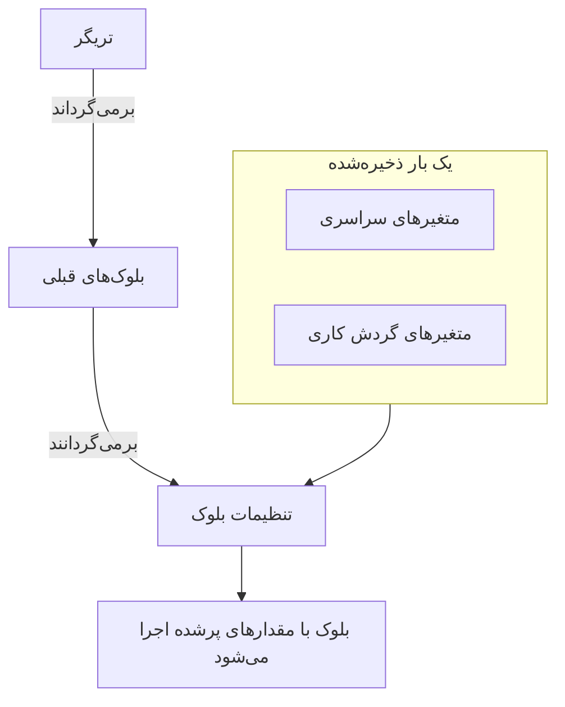
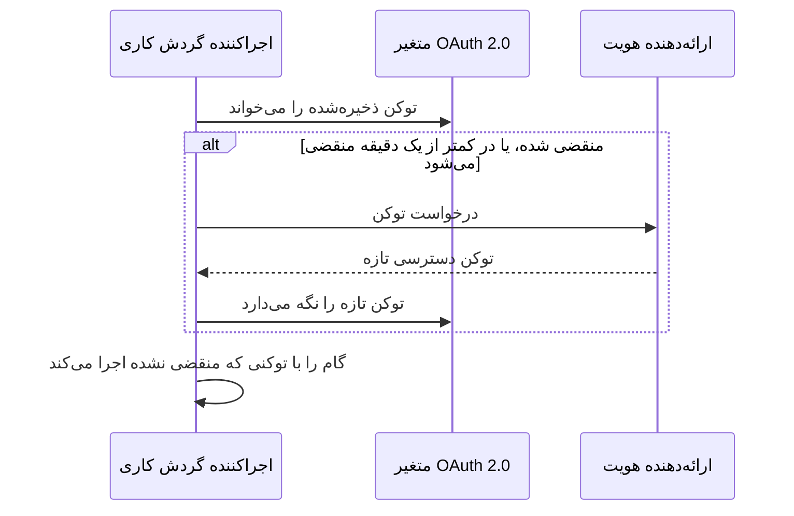

# متغیرهای گردش کاری

متغیرها راهی‌اند که داده در یک گردش کاری جابه‌جا می‌شود: از تریگر به اولین بلوک، از یک بلوک به بلوک بعدی، و از مقدارهایی که یک بار ذخیره می‌کنید به هر بلوکی که به آن‌ها نیاز دارد. تنظیم یک بلوک مقداری را با ارجاعی درون آکولادهای دوتایی می‌خواند، و اجراکننده درست پیش از اجرای بلوک آن را پر می‌کند.

| مقدار                       | از کجا می‌آید                                              | یک بلوک چگونه آن را می‌خواند                           |
| --------------------------- | ---------------------------------------------------------- | ----------------------------------------------------- |
| **متغیر سراسری**            | ذخیره‌شده زیر **گردش‌های کاری → متغیرهای سراسری**          | `{{global.variables.NAME}}`                          |
| **متغیر گردش کاری**         | ذخیره‌شده در صفحه **متغیرهای گردش کاری** یک گردش کاری      | `{{local.variables.NAME}}`                           |
| **مقدار یک بلوک قبلی**      | آنچه تریگر یا یک بلوک قبلی در این اجرا برگرداند            | `{{local.components.BLOCK_ID.returnValues.VALUE_ID}}` |



به‌ندرت لازم است ارجاعی را تایپ کنید. روی **{ }** در انتهای یک تنظیم کلیک کنید، یا `{{` را در آن تایپ کنید، و مقدار را از یک فهرست انتخاب کنید. [استفاده از مقدارهای بلوک‌های قبلی](/docs/workflows/authoring#استفاده-از-مقدارهای-بلوکهای-قبلی) را ببینید.

## متغیرهای سراسری

مقدارهایی در سطح پروژه که یک بار ذخیره می‌کنید و در هر گردش کاری دوباره به کار می‌برید: کلیدهای API، نشانی‌ها، نام کانال‌ها — هر چیزی که نمی‌خواهید در ده گردش کاری مختلف کپی کنید.

:::steps
### باز کردن متغیرهای سراسری

به **گردش‌های کاری → متغیرهای سراسری** بروید و روی **ساخت متغیر گردش کاری** کلیک کنید.

### نام‌گذاری متغیر

در گام **متغیر**، این‌ها را پر کنید:

- **نام** — نامی که با آن به متغیر ارجاع می‌دهید. دست‌کم دو نویسه، بدون فاصله، و فقط حروف، عددها، خط تیره و زیرخط. `UPPER_SNAKE_CASE` عادت خوبی است، چون در بلوک‌هایتان به چشم می‌آید.
- **توضیحات** — اختیاری، متنی آزاد برای یادآوری اینکه برای چیست.

روی **بعدی** کلیک کنید.

### دادن مقدار به آن

در گام **مقدار**، این‌ها را پر کنید:

- **محتوا** — خود مقدار. فیلدی برای متن بلند است، پس مقدارهای چندخطی هم کار می‌کنند.
- **راز** — وقتی روشن باشد، مقدار از لاگ‌های اجرا و ردگیری‌های گام‌ها پاک می‌شود.

روی **ساخت متغیر گردش کاری** کلیک کنید. برای تغییر نام یا توضیحات پیش از آن، در فهرست گام‌های کنار فرم (که در صفحه‌های پهن‌تر نشان داده می‌شود) روی **متغیر** کلیک کنید؛ آنچه در هر دو گام تایپ کرده‌اید حفظ می‌شود.
:::

از یک متغیر سراسری در هر گردش کاری این‌گونه استفاده کنید:

```text
{{global.variables.NAME}}
```

برای نمونه، اگر کلید PagerDuty خود را با نام `PAGERDUTY_KEY` ذخیره کرده باشید، هر بلوکی می‌تواند آن را به شکل `{{global.variables.PAGERDUTY_KEY}}` به کار ببرد — ویرایشگر ارجاع را ذخیره می‌کند، و لاگ‌نویسی گردش کاری مقدار راز تحلیل‌شده را پاک می‌کند.

فهرست نام و توضیحات هر متغیر را نشان می‌دهد. برای باز کردن صفحه یک متغیر، روی **مشاهده** در ردیف آن کلیک کنید. این صفحه نشان می‌دهد متغیر ایستاست یا OAuth 2.0، و هر کار دیگری را همان‌جا انجام می‌دهید:

| دکمه                         | کاری که می‌کند                                                                                                                                   |
| ---------------------------- | ------------------------------------------------------------------------------------------------------------------------------------------------ |
| **ویرایش متغیر**             | نام، توضیحات و — برای یک متغیر ایستا که هنوز راز نیست — نشان راز را تغییر می‌دهد. متغیری که یک بار راز شود، راز می‌ماند.                       |
| **Update Content**           | یک مقدار ایستا را جایگزین می‌کند. محتوای ذخیره‌شده قابل بازخوانی نیست، پس مقدار تازه را کامل تایپ می‌کنید.                                      |
| **Use in Workflows**         | ارجاع دقیقی را که باید در بلوک‌هایتان بچسبانید، همراه با یک دکمه کپی، نشان می‌دهد.                                                              |
| **حذف متغیر گردش کاری**      | پس از گرفتن تأیید شما، آن را حذف می‌کند. پیام تأیید نام متغیر را می‌آورد، تا بتوانید مطمئن شوید همان متغیری است که منظورتان است.               |

برای ساختن متغیری از نوع **توکن دسترسی OAuth 2.0** به جای آن، منوی **بیشتر** (**⋯**) را کنار **ساخت متغیر گردش کاری** باز کنید و **Create OAuth 2.0 Variable** را انتخاب کنید. متغیرهای OAuth 2.0 در ادامه [بخش خودشان](#متغیرهای-oauth-20-توکنهایی-که-خودشان-را-تازه-میکنند) را دارند. نوع یک متغیر پس از ذخیره شدن قابل تغییر نیست.

می‌توانید یک متغیر را از طریق API هم به‌روزرسانی کنید، که [در پایان همین صفحه](#بهروزرسانی-یک-متغیر-از-درون-یک-گردش-کاری) آمده است. متغیرهای سراسری و گردش کاری قابلیتی از طرح Growth هستند.

## متغیرهای محلی گردش کاری

متغیرهایی که به یک گردش کاری محدودند و زیر **متغیرهای گردش کاری** در منوی همان گردش کاری مدیریت می‌شوند. درست مانند متغیرهای سراسری کار می‌کنند: **ساخت متغیر گردش کاری** یک متغیر ایستا می‌سازد، منوی **بیشتر** (**⋯**) یک متغیر OAuth 2.0 می‌سازد، و **مشاهده** صفحه خود متغیر را باز می‌کند. با این به آن‌ها ارجاع دهید:

```text
{{local.variables.NAME}}
```

برای مقداری که فقط همان گردش کاری به آن نیاز دارد از آن استفاده کنید، مانند نشانی وب‌هوک Slack یک قالب. قالب‌هایی که تنظیماتی می‌پرسند آن‌ها را به‌عنوان متغیرهای گردش کاری ذخیره می‌کنند، تا بتوانید بعداً بدون ویرایش بلوک‌ها تغییرشان دهید.

## متغیرهای OAuth 2.0 (توکن‌هایی که خودشان را تازه می‌کنند)

یک توکن bearer که در یک متغیر ایستا چسبانده شود تا وقتی منقضی شود کار می‌کند، که معمولاً در کمتر از یک ساعت است. پس از آن، هر اجرایی که از آن استفاده می‌کند با `401 Unauthorized` شکست می‌خورد تا اینکه کسی توکن تازه‌ای بچسباند. متغیری از نوع **توکن دسترسی OAuth 2.0** به جای خود توکن، آنچه را تبادل توکن OAuth لازم دارد ذخیره می‌کند، و OneUptime توکن را به‌روز نگه می‌دارد.

دقیقاً مانند هر متغیر دیگری از آن استفاده می‌کنید:

```http
Authorization: Bearer {{global.variables.CRM_API_TOKEN}}
```

### توکن چگونه تازه می‌ماند



- نخستین باری که یک گردش کاری از متغیر استفاده می‌کند، OneUptime از نقطه پایانی توکن ارائه‌دهنده هویت شما یک توکن دسترسی می‌خواهد و آن را نگه می‌دارد.
- پیش از هر گامی که به متغیر ارجاع می‌دهد، اجراکننده توکن را بررسی می‌کند. اگر منقضی شده باشد، یا در دقیقه بعد منقضی شود، پیش از اجرای گام یک توکن تازه گرفته می‌شود. مؤلفه همیشه توکنی دریافت می‌کند که منقضی نشده است، هر قدر هم متغیر بی‌استفاده مانده باشد و هر قدر هم اجرا طول کشیده باشد.
- فقط گام‌هایی که واقعاً به متغیر ارجاع می‌دهند باعث تازه‌سازی می‌شوند. اجرایی که هرگز از یک متغیر استفاده نمی‌کند هرگز توکن آن را نمی‌گیرد، و به این دلیل که آن ارائه‌دهنده از کار افتاده است شکست نمی‌خورد.
- وقتی چند اجرا هم‌زمان به توکن تازه‌ای نیاز دارند، یکی از آن‌ها آن را می‌گیرد و بقیه از همان استفاده می‌کنند.
- اگر ارائه‌دهنده نگوید توکن کی منقضی می‌شود (بدون `expires_in`، و توکن یک JWT با ادعای `exp` نیست)، OneUptime در هر اجرا یک بار توکن تازه‌ای می‌گیرد و آن را بین گام‌های همان اجرا به اشتراک می‌گذارد.

### انواع اعطا

| نوع اعطا               | برای چه به کارش ببرید                                                                                                                                                                                                                              |
| ---------------------- | --------------------------------------------------------------------------------------------------------------------------------------------------------------------------------------------------------------------------------------------------- |
| **Client Credentials** | OneUptime به‌عنوان برنامه شما وارد می‌شود. انتخاب معمول برای APIهای کارساز به کارساز، مانند Microsoft Graph، APIهای Auth0 یا Okta، یا یک سرویس داخلی پشت Keycloak.                                                                                 |
| **توکن تازه‌سازی**     | دسترسی واگذارشده از طرف یک کاربر. برنامه را یک بار مجاز کنید (برای نمونه در محیط آزمایش OAuth ارائه‌دهنده‌تان یا با Postman) و توکن تازه‌سازی‌ای را که می‌گیرید بچسبانید. OneUptime آن را با توکن‌های دسترسی مبادله می‌کند، و اگر ارائه‌دهنده‌تان توکن‌های تازه‌سازی را می‌چرخاند، هر توکن تازه‌سازی جدید را ذخیره می‌کند. یک کلاینت عمومی بدون کلید محرمانه کلاینت هم کار می‌کند. |

### ساختن یک متغیر OAuth 2.0

**Create OAuth 2.0 Variable** در هر گام یک چیز می‌پرسد:

1. **متغیر**: نامی که گردش‌های کاری با آن به متغیر ارجاع می‌دهند، و یک توضیح.
2. **ارائه‌دهنده**: **ارائه‌دهنده هویت** خود را انتخاب کنید و OneUptime **نشانی توکن** آن را پر می‌کند:

   | ارائه‌دهنده هویت | نشانی توکنی که پر می‌کند |
   |---|---|
   | Microsoft Entra ID | `https://login.microsoftonline.com/{tenant-id}/oauth2/v2.0/token` |
   | Google | `https://oauth2.googleapis.com/token` |
   | Okta | `https://{your-domain}/oauth2/default/v1/token` |
   | Auth0 | `https://{your-domain}/oauth/token` |

   بخش درون آکولاد را با مقدار خودتان جایگزین کنید، مانند Directory (tenant) ID یا دامنه Okta خود. تا وقتی نشانی هنوز چنین بخشی دارد، فرم جلو نمی‌رود. برای هر ارائه‌دهنده دیگری، **ارائه‌دهنده دیگر** را انتخاب کنید و نقطه پایانی توکن آن را خودتان وارد کنید. سپس **نوع اعطا** را انتخاب کنید. انتخاب Google گزینه **توکن تازه‌سازی** را برمی‌گزیند، چون کلاینت‌های OAuth گوگل نمی‌توانند از Client Credentials استفاده کنند. ارائه‌دهنده فقط فرم را پر می‌کند؛ همراه متغیر ذخیره نمی‌شود.
3. **اعتبارنامه‌ها**: **شناسه کلاینت** و **کلید محرمانه کلاینت** برنامه‌ای که نزد ارائه‌دهنده ثبت کرده‌اید و، برای اعطای توکن تازه‌سازی، **توکن تازه‌سازی**. یک کلاینت عمومی با اعطای توکن تازه‌سازی می‌تواند کلید محرمانه کلاینت را خالی بگذارد.
4. **پیشرفته**، همه اختیاری:
   - **دامنه**: با فاصله از هم جدا می‌شوند. برای گرفتن دامنه‌های پیش‌فرض ارائه‌دهنده خالی‌اش بگذارید. برای Client Credentials، Microsoft Entra ID به دامنه‌ای نیاز دارد که با `/.default` پایان یابد (مانند `https://graph.microsoft.com/.default`) و Okta به یک دامنه سفارشی نیاز دارد.
   - **پارامترهای اضافی**: فیلدهای فرم اضافی برای درخواست توکن، مانند `audience` برای Auth0 (که برای Client Credentials لازم است) یا `resource` برای Azure AD v1. هر کسی که بتواند متغیر را بخواند این‌ها را هم می‌تواند بخواند، پس رازها را این‌جا نگذارید.
   - **احراز هویت کلاینت**: اینکه شناسه و کلید محرمانه کلاینت در یک هدر HTTP Basic فرستاده شوند (پیش‌فرض) یا در بدنه درخواست. اگر ارائه‌دهنده‌تان با `invalid_client` پاسخ داد، گزینه دیگر را امتحان کنید.

زیر برخی فیلدها، فرم یک سطر راهنما برای ارائه‌دهنده‌ای که انتخاب کرده‌اید می‌افزاید، برای نمونه اینکه Microsoft Entra ID شناسه tenant شما را کجا نشان می‌دهد، و اینکه کلید محرمانه کلاینت آن **Value** راز است، نه **Secret ID** آن.

وقتی یک متغیر OAuth 2.0 تازه را ذخیره می‌کنید، OneUptime بی‌درنگ نخستین توکنش را می‌گیرد و به شما می‌گوید ارائه‌دهنده چه گفت. یک غلط تایپی در کلید محرمانه یا نشانی همان موقع آشکار می‌شود، نه ساعت‌ها بعد در یک اجرای ناموفق. گرفتن توکن در متغیر می‌نویسد، پس این کار به مجوز ویرایش متغیرهای گردش کاری نیاز دارد؛ اگر بتوانید متغیر بسازید ولی نتوانید ویرایشش کنید، به جای آن نخستین اجرای گردش کاری‌ای که از متغیر استفاده می‌کند توکنش را می‌گیرد.

صفحه متغیر (روی **مشاهده** در ردیف آن کلیک کنید) یک کارت **OAuth 2.0 Settings** دارد. **ویرایش تنظیمات** همان گام‌های **ارائه‌دهنده** (نشانی توکن)، **اعتبارنامه‌ها** (شناسه کلاینت) و **پیشرفته** (دامنه، پارامترهای اضافی، احراز هویت کلاینت) را طی می‌کند. **بعدی** جلو می‌رود و **ذخیره تغییرات** در گام آخر است. همه گام‌ها از پیش پر شده‌اند، پس فهرست گام‌های کنار فرم هر کدام را باز می‌کند: یک تنظیم را در گام خودش تغییر دهید، سپس گام آخر را باز کنید و ذخیره کنید. نوع اعطا پس از ذخیره ثابت است.

### کارت توکن دسترسی

کارت **توکن دسترسی** در صفحه یک متغیر OAuth 2.0 یکی از این‌ها را نشان می‌دهد:

| وضعیت                      | معنایش                                                                                                                               |
| -------------------------- | ------------------------------------------------------------------------------------------------------------------------------------ |
| **Valid**                  | توکن ذخیره‌شده هنوز منقضی نشده است.                                                                                                  |
| **منقضی‌شده**              | برای متغیری که اخیراً هیچ گردش کاری از آن استفاده نکرده عادی است. اجرای بعدی‌ای که از آن استفاده کند توکن تازه‌ای می‌گیرد.            |
| **هنوز دریافت نشده است**   | از زمان ساخت متغیر یا تغییر تنظیماتش هیچ توکنی گرفته نشده است.                                                                       |
| **No expiry reported**     | ارائه‌دهنده نگفت توکن کی منقضی می‌شود، پس هر اجرا توکن تازه‌ای می‌گیرد.                                                              |
| **Refresh failed**         | آخرین تلاش برای گرفتن توکن شکست خورد. دلیل ارائه‌دهنده به‌طور کامل، همراه با زمان رخ دادنش، نشان داده می‌شود. تازه‌سازی موفق بعدی آن را پاک می‌کند. |

**تازه‌سازی فوری**، زیر وضعیت، بی‌درنگ توکن تازه‌ای می‌گیرد. از آن برای بررسی تنظیمات تازه بدون اجرای یک گردش کاری استفاده کنید. **Update Credentials**، روی کارت **OAuth 2.0 Settings**، کلید محرمانه کلاینت یا توکن تازه‌سازی را جایگزین می‌کند و سپس با آن‌ها توکنی می‌گیرد. تغییر هر تنظیمی (نشانی توکن، شناسه کلاینت، دامنه و مانند آن) توکن ذخیره‌شده را دور می‌اندازد، پس اجرای بعدی با تنظیمات تازه توکنی می‌گیرد.

### وقتی ارائه‌دهنده نمی‌پذیرد

گامی که به توکن نیاز داشت پیش از اجرا شکست می‌خورد، و لاگ اجرا نام متغیر را می‌برد و پاسخ ارائه‌دهنده را نقل می‌کند، برای نمونه `Could not get an OAuth 2.0 access token for {{global.variables.CRM_API_TOKEN}}: The token endpoint refused the request (HTTP 400): invalid_grant - Token has been expired or revoked.` همین دلیل روی کارت **توکن دسترسی** متغیر هم می‌آید. خطای `invalid_grant` روی یک متغیر با اعطای توکن تازه‌سازی تقریباً همیشه یعنی خود توکن تازه‌سازی منقضی یا باطل شده است، و راه‌حلش **Update Credentials** است.

اگر تازه‌سازی شکست بخورد در حالی که توکن ذخیره‌شده هنوز واقعاً منقضی نشده (فقط درون حاشیه یک‌دقیقه‌ای بود)، گام با توکن ذخیره‌شده ادامه می‌دهد و لاگ همین را می‌گوید.

### امنیت

- متغیرهای OAuth 2.0 همیشه رازند. توکن دسترسی در لاگ‌های اجرا و ردگیری‌های گام‌ها با `[REDACTED]` جایگزین می‌شود، از جمله توکنی که در میانه یک اجرا عوض شده باشد.
- کلید محرمانه کلاینت، توکن تازه‌سازی و توکن دسترسی در پایگاه داده رمزنگاری می‌شوند و هرگز از طریق API یا داشبورد قابل بازخوانی نیستند. **تازه‌سازی فوری** می‌گوید توکن تازه کی منقضی می‌شود، اما هرگز خود توکن را نشان نمی‌دهد.
- نشانی توکن باید `http` یا `https` باشد. درخواست به نشانی‌های حلقه‌برگشت، پیوند-محلی و فراداده ابری رد می‌شود. در OneUptime Cloud، نشانی‌های شبکه خصوصی هم رد می‌شوند. نصب‌های خودمیزبان می‌توانند به ارائه‌دهنده هویتی در شبکه خودشان برسند. OneUptime در درخواست‌های توکن تغییرمسیرها را دنبال نمی‌کند، پس نشانی توکن را به نشانی‌ای نشانه بگیرید که نقطه پایانی واقعاً روی آن پاسخ می‌دهد. یک درخواست توکن پس از ۲۰ ثانیه رها می‌شود.

### تبدیل یک توکن ایستای موجود به OAuth 2.0

نوع یک متغیر پس از ذخیره ثابت است. متغیر ایستا را حذف کنید و یک متغیر OAuth 2.0 با **همان نام** بسازید. گردش‌های کاری با نام به متغیرها ارجاع می‌دهند، پس بدون هیچ تغییری متغیر تازه را برمی‌دارند.

## خروجی مؤلفه‌ها (داده از بلوک‌های قبلی)

هر تریگر و مؤلفه می‌تواند در حین اجرا خروجی تولید کند. به جای تایپ کامل یک ارجاع، آن را با دکمه **{ }** در هر تنظیم، یا با تایپ `{{` در آن، درج کنید — دقیقاً همان شناسه‌هایی را درج می‌کند که اجراکننده انتظار دارد، و مقدار را به شکل تراشه‌ای نشان می‌دهد که نام بلوک و مقدار را دارد.

می‌توانید از بلوکی هم که مقدار را تولید می‌کند شروع کنید: تنظیمات آن هر خروجی را زیر **Returns** فهرست می‌کنند، همراه با ارجاع دقیق و دکمه‌ای برای کپی آن.

به خروجی یک بلوک قبلی این‌گونه ارجاع دهید:

```text
{{local.components.COMPONENT_ID.returnValues.FIELD_ID}}
```

مقدار `COMPONENT_ID` همان **Identifier** بلوک است — شناسه کوتاهی که روی بلوک نشان داده می‌شود، نه نامی که روی آن نوشته شده. بلوک‌های تازه شناسه‌ای مانند `api-get-1` می‌گیرند، و می‌توانید آن را در بخش **ID** بلوک تغییر نام دهید. تغییر نامش هر ارجاعی را که از پیش به آن اشاره می‌کند می‌شکند، درست مانند تغییر نام یک متغیر. مقدار `FIELD_ID` شناسه مقدار است، و مسیری پس از آن یک فیلد از یک مقدار JSON را می‌خواند.

| پس از بلوکی مانند…                                               | بخوانید                                                                                |
| ---------------------------------------------------------------- | -------------------------------------------------------------------------------------- |
| یک بلوک **API** با شناسه `lookup-user`                           | کد وضعیتش: `{{local.components.lookup-user.returnValues.response-status}}`. بدنه‌اش: `{{local.components.lookup-user.returnValues.response-body}}`. |
| یک بلوک **Run Custom JavaScript** با شناسه `transform`           | آنچه برگرداند: `{{local.components.transform.returnValues.returnValue}}`.              |
| یک تریگر **On Create Incident** با شناسه `incident-on-create-1`  | عنوان حادثه: `{{local.components.incident-on-create-1.returnValues.model.title}}`. تریگرهای رکورد یک مقدار برمی‌گردانند، `model`، و شما درون آن می‌روید. |

مقدارهای بلوک فقط در طول اجرای جاری وجود دارند. هر اجرای تازه از نو شروع می‌شود.

## متغیرها کجا کار می‌کنند

تقریباً هر فیلد متنی متغیر می‌پذیرد:

- نشانی روی یک بلوک API.
- متن پیام در Slack، Teams، Discord، Telegram، IRC و Email.
- موضوع و بدنه یک ایمیل.
- هدرها و فیلدهای بدنه (درون مقدارهای رشته‌ای).
- هر دو طرف یک بلوک **If / Else**.

در فیلدهای JSON — **Data (JSON Object)**، **Query** و **Select Fields** در مؤلفه‌های رکورد، **Request Body** یک بلوک API، و **Arguments** در **Run Custom JavaScript** — یک ارجاع بسته به جایی که قرار گرفته پر می‌شود:

- **درون گیومه، متن است.** `{"title": "Down: {{local.components.ci-webhook.returnValues.request-body.service}}"}` مقدار را درون رشته می‌گذارد. گیومه‌ها، بک‌اسلش‌ها و شکست‌های سطر در مقدار گریز داده می‌شوند، پس JSON معتبر می‌ماند و مقدار یک رشته باقی می‌ماند.
- **به‌تنهایی، خود مقدار است.** `{"customFields": {{local.components.transform.returnValues.returnValue}}}` کل شیء را می‌گذارد، فهرست فهرست می‌ماند و عدد عدد. متنی که خودش JSON است — `5`، `true`، یا شیئی که یک بلوک به شکل متن JSON برگرداند — به‌عنوان همان مقدار گذاشته می‌شود. هر متن دیگری به‌عنوان رشته گذاشته می‌شود.

ارجاعی که درون گیومه‌های یک کلید باشد هم متن است. اگر لازم است ساختاری را به‌طور پویا بسازید، از یک بلوک **Run Custom JavaScript** برای ساختنش استفاده کنید و سپس خروجی‌اش را به بلوک بعدی بدهید.

بلوک **Run Custom JavaScript** متغیرها را خودکار دریافت نمی‌کند — چیزی به محیط ایزوله تزریق نمی‌شود. `{{global.variables.NAME}}` (یا هر ارجاع مؤلفه‌ای) را در فیلد JSON **Arguments** بلوک بگذارید؛ این مقدارها پیش از اجرای اسکریپت جایگزین می‌شوند و به شکل `args` می‌رسند.

## حلقه زدن روی آرایه‌ها

درون یک فیلد متنی می‌توانید تکه‌ای از متن را برای هر عضو یک فهرست با `{{#each path}}…{{/each}}` تکرار کنید. درون این بلوک، `{{property}}` از عضو جاری می‌خواند، `{{@index}}` جایگاه آن با شروع از صفر است، و `{{this}}` برای فهرست‌هایی از مقدارهای ساده خود عضو است. نام‌های درون یک بلوک `{{#each}}` پیرایش می‌شوند، پس فاصله‌های اضافی آن‌جا بی‌ضررند — برخلاف هر جای دیگر.

برای نمونه، این **Message Text** هر هشداری را که یک وب‌هوک فرستاد فهرست می‌کند:

```text title="Message Text"
{{#each local.components.ci-webhook.returnValues.request-body.alerts}}
- {{@index}}: {{name}} is {{status}}
{{/each}}
```

## نمونه‌ها

### ساختن بار داده از یک وب‌هوک

یک وب‌هوک با بدنه‌ای مانند `{ "service": "checkout", "status": "failed" }` می‌رسد. برای تبدیل آن به یک حادثه OneUptime:

1. تریگر **وب‌هوک** با شناسه `ci-webhook`.
2. بلوک **If / Else**: **Value to check** فیلد `status` از Request Body وب‌هوک است (`{{local.components.ci-webhook.returnValues.request-body.status}}`)، **Comparison** برابر **is equal to** است، و **Compare with** برابر `failed` است.
3. از شاخه **Yes**، یک بلوک **Create One Incident** با:
   - عنوان: `CI build failed: {{local.components.ci-webhook.returnValues.request-body.service}}`
   - توضیحات: `See {{local.components.ci-webhook.returnValues.request-body.url}} for the logs.`

### استفاده از یک راز در فراخوانی API

گردش کاری‌ای که PagerDuty را فرامی‌خواند:

1. `PAGERDUTY_KEY` را به‌عنوان یک متغیر سراسری راز ذخیره کنید.
2. در بلوک **API**، هدر `Authorization` را روی `Token token={{global.variables.PAGERDUTY_KEY}}` بگذارید.

کلید بیرون از گردش کاری و لاگ‌ها می‌ماند.

### زنجیر کردن دو فراخوانی API

فراخوانی اول شناسه‌ای به شما می‌دهد که دومی به آن نیاز دارد:

1. مؤلفه **API** با شناسه `lookup-order`: در **URL** آن، پس از `/orders?email=`، با **{ }** مقدار JSON تریگر دستی را با مسیر `email` درج کنید.
2. مؤلفه **API** با شناسه `cancel-order`: `POST /orders/{{local.components.lookup-order.returnValues.response-body.id}}/cancel`.

اگر `lookup-order` شکست بخورد، خروجی **Error** آن به جای **Success** فعال می‌شود. آن را به یک بلوک Email یا Slack وصل کنید تا شکست‌ها از چشم نیفتند.

## به‌روزرسانی یک متغیر از درون یک گردش کاری

یک الگوی رایج چرخاندن یک اعتبارنامه بر اساس زمان‌بندی است: یک توکن تازه از یک سرویس بیرونی بگیرید، سپس آن را دوباره در متغیر ذخیره کنید تا اجرای بعدی آن را بردارد. این کار را با یک بلوک **API** انجام دهید که API در OneUptime را فرامی‌خواند.

اگر اعتبارنامه یک توکن دسترسی OAuth 2.0 است، لازم نیست این را خودتان بسازید. یک [متغیر OAuth 2.0](#متغیرهای-oauth-20-توکنهایی-که-خودشان-را-تازه-میکنند) توکن را خودش می‌گیرد و تازه می‌کند.

درخواست `PUT /api/workflow-variable/<variable-id>` را با یک هدر `ApiKey` بفرستید، و — این همان بخشی است که افراد را به اشتباه می‌اندازد — فیلدهایی را که می‌خواهید تغییر دهید **درون یک شیء `data` بپیچید**:

```json title="Request Body"
{
  "data": {
    "content": "{{local.components.get-token.returnValues.response-body.access_token}}"
  }
}
```

بدنه‌ای تخت بدون پوشش `data` با خطای ۴۰۰ رد می‌شود. فقط فیلدهایی را بفرستید که واقعاً می‌خواهید تغییر دهید؛ `name` و `description` می‌توانند بیرون از بار داده بمانند.

کلید API به **Edit Workflow Variables** نیاز دارد. هیچ مجوز خواندنی لازم نیست — به‌روزرسانی ردیف را بازخوانی نمی‌کند.

دو نکته که باید مراقبشان باشید:

- **متغیری را که به آن ارجاع می‌دهید تغییر نام ندهید.** `name` بخشی از `{{local.variables.NAME}}` است. تغییرش هر ارجاع موجود را تحلیل‌نشده باقی می‌گذارد، و یک ارجاع تحلیل‌نشده به شکل متن خام عبور داده می‌شود — [نکته‌های ریز](#نکتههای-ریز) را ببینید.
- **یک متغیر را می‌توان این‌گونه نوشت ولی هرگز بازخوانی نکرد.** `content` برای هر متغیری، راز باشد یا نه، از طریق API فقط‌نوشتنی است. همین یک متغیر را جای امنی برای نگه داشتن یک توکن چرخشی می‌کند. راز علامت زدن آن، افزون بر این، مقدار را از لاگ‌های اجرا و ردگیری‌های گام‌ها بیرون نگه می‌دارد.

## نکته‌های ریز

- **از { } استفاده کنید (یا `{{` را تایپ کنید).** دقیقاً همان شناسه‌های مؤلفه، مقدار بازگشتی و متغیری را درج می‌کند که اجراکننده انتظار دارد، و فقط مقدارهایی را پیشنهاد می‌دهد که هنگام اجرای بلوک وجود دارند.
- **نام متغیرها به بزرگی و کوچکی حروف حساس است.** `{{global.variables.MyKey}}` و `{{global.variables.mykey}}` متفاوت‌اند.
- **ارجاعی که تحلیل نشود همان‌طور باقی می‌ماند، نه خالی.** ارجاع به چیزی که وجود ندارد خطا نیست، و رشته خالی هم به شما نمی‌دهد: آکولادها مستقیم عبور داده می‌شوند، پس `{{local.components.api-get-1.returnValues.body}}` با یک شناسه گام غلط‌تایپ‌شده عیناً در پیام Slack، نشانی یا بدنه درخواست شما می‌نشیند، و اجرا باز هم **Executed** را گزارش می‌کند. زبانه **گام‌ها** در اجرا روی گام هشداری نشان می‌دهد که هر ارجاعی را که از دست در رفته نام می‌برد، و تنظیمی را که ارجاع در آن بود با **Did not resolve** علامت می‌زند؛ لاگ اجرا هم همان سطر هشدار را دارد.
- **پنل مشکلات نمی‌تواند نام متغیرها را بررسی کند.** ارجاع‌های مؤلفه‌ای را که نمی‌تواند تطبیق دهد — یک شناسه گام ناشناخته، یک مقدار بازگشتی ناشناخته، یک ریشه بدشکل — پیش از ذخیره علامت می‌زند. نمی‌تواند بگوید یک متغیر وجود دارد یا نه. تنظیمات یک بلوک می‌توانند: ارجاع به متغیری که وجود ندارد آن‌جا به شکل یک تراشه کهربایی نشان داده می‌شود. وگرنه یک متغیر تغییرنام‌یافته فقط با لاگ اجرا آشکار می‌شود.
- **فاصله‌های درون آکولادها پیرایش نمی‌شوند.** `{{ local.variables.NAME }}` جستجویی متفاوت از `{{local.variables.NAME}}` است و هرگز تحلیل نمی‌شود. تنها استثنا درون یک بلوک `{{#each}}` است، که نام‌ها در آن پیرایش می‌شوند.

## گام‌های بعدی

:::cards
- [مؤلفه‌ها](/docs/workflows/components): آنچه هر بلوک لازم دارد و برمی‌گرداند.
- [اجراها](/docs/workflows/runs-and-logs): ببینید هر ارجاع در یک اجرا به چه مقداری تبدیل شد.
- [پیکربندی و ایمنی](/docs/workflows/configuration#رازها): رازها را بیرون از بلوک‌ها، فایل‌های صادرشده و لاگ‌ها نگه دارید.
:::
