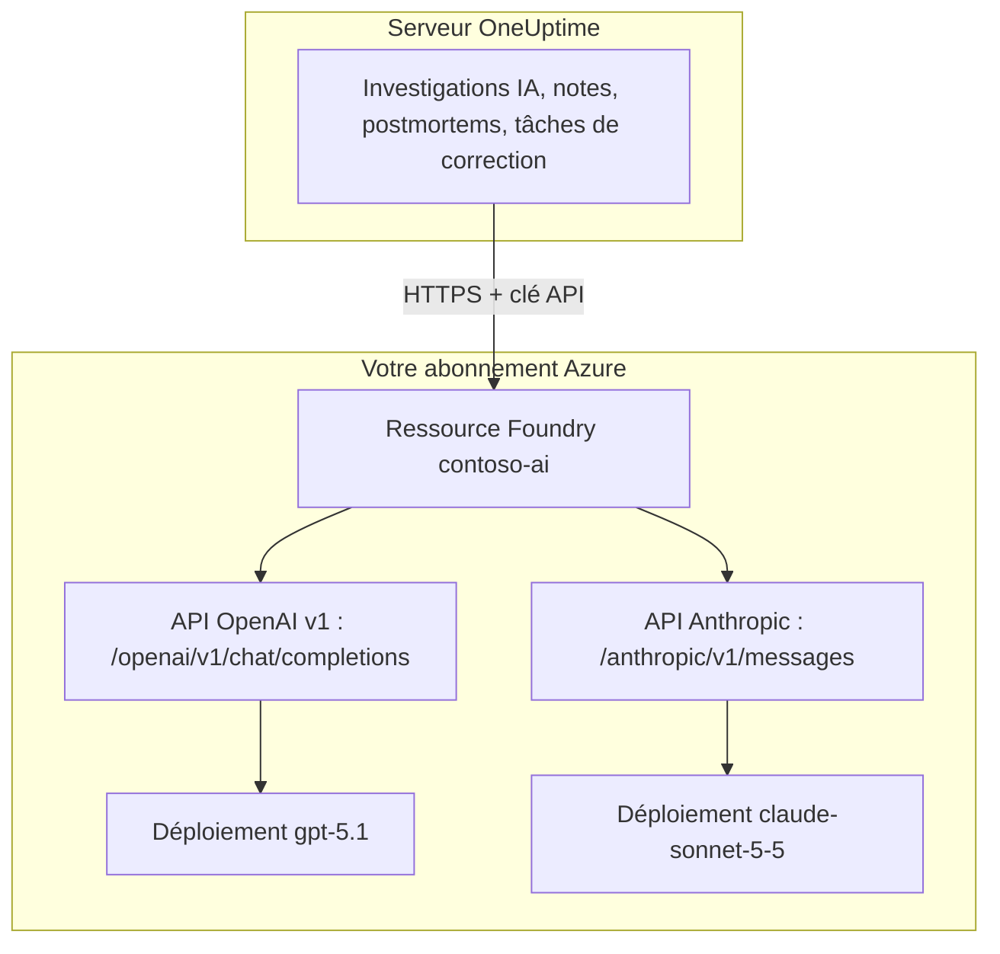

# Microsoft Foundry et Azure OpenAI

Faites tourner les fonctionnalités d'IA de OneUptime sur des modèles que vous déployez dans Microsoft Foundry (anciennement Azure AI Foundry) ou Azure OpenAI. OneUptime envoie chaque requête directement à votre ressource, dans votre abonnement Azure : les prompts et les réponses sont traités par le déploiement que vous avez choisi, là où vous l'avez choisi. Cette page vous mène d'un abonnement vide à un fournisseur qui fonctionne : la ressource Azure, le déploiement du modèle, le point de terminaison et la clé, les réglages de OneUptime, le réseau, et que faire quand une requête échoue.

:::cards
- [Configurer Azure](#configurer-microsoft-foundry): Créer une ressource, déployer un modèle, copier son point de terminaison et sa clé.
- [Connecter OneUptime](#connecter-oneuptime): Quatre champs dans les paramètres du projet, puis le bouton Tester.
- [Auto-hébergé](#configurer-une-instance-auto-hébergée-avec-des-variables-denvironnement): Un fournisseur pour tous les projets, depuis des variables d'environnement.
- [Dépannage](#dépannage): 401, 403, un déploiement introuvable, une api-version.
:::

## Fonctionnement

OneUptime appelle votre ressource Foundry en HTTPS depuis le serveur OneUptime, jamais depuis le navigateur des utilisateurs. Chaque requête porte l'une des clés API de la ressource et désigne le déploiement qui doit y répondre.



Un seul type de fournisseur, **Azure OpenAI / Microsoft Foundry**, couvre tous les déploiements de la ressource. L'URL de base indique à OneUptime quelle API appeler :

| Modèle déployé | API appelée par OneUptime | URL de base |
| --- | --- | --- |
| Modèles OpenAI, comme GPT-5.1 et GPT-4.1 | OpenAI v1 chat completions | `https://contoso-ai.openai.azure.com/openai/v1` |
| Foundry Models avec chat completions, comme DeepSeek et Grok | OpenAI v1 chat completions | `https://contoso-ai.services.ai.azure.com/openai/v1` |
| Claude | Anthropic Messages | `https://contoso-ai.services.ai.azure.com/anthropic` |

> [!IMPORTANT]
> Les fonctionnalités d'IA de OneUptime appellent des outils : pendant leur travail, elles interrogent vos moniteurs, vos incidents et votre télémétrie. Déployez un modèle qui prend en charge l'appel d'outils (function calling). Le bouton **Tester** du fournisseur le vérifie pour vous.

## Avant de commencer

Il vous faut un abonnement Azure, un rôle qui permet de créer et de lire la ressource, et un rôle OneUptime autorisé à ajouter des fournisseurs LLM.

| Pour | Ce qu'il vous faut dans Azure |
| --- | --- |
| Créer la ressource | **Owner** ou **Contributor** sur le groupe de ressources, ou **Foundry Account Owner** |
| Déployer un modèle | **Owner** ou **Contributor** sur le groupe de ressources, ou **Foundry Owner** ou **Foundry Account Owner** sur la ressource. Claude demande en plus l'autorisation de s'abonner aux offres d'Azure Marketplace |
| Lire les clés de la ressource | Un rôle avec `Microsoft.CognitiveServices/accounts/listKeys/action`, comme **Owner**, **Contributor** ou **Cognitive Services Contributor** |

OneUptime lui-même n'a besoin d'aucun rôle Azure. Une clé donne à elle seule accès à tous les déploiements de la ressource, sans contrôle de rôle : traitez-la comme un mot de passe.

Dans OneUptime, ajouter un fournisseur à un projet demande **Project Owner**, **Project Admin**, **Project Member**, **Settings Admin**, **Settings Member** ou **Create LLM**. Une instance auto-hébergée peut à la place enregistrer un fournisseur pour tous les projets depuis des variables d'environnement, ce qui demande un accès au serveur.

## Configurer Microsoft Foundry

:::steps
### Créer une ressource

Dans le [portail Foundry](https://ai.azure.com), créez une ressource Foundry ou choisissez-en une existante. Une ressource Azure OpenAI fonctionne de la même façon. Notez le nom de la ressource : c'est la première partie de son point de terminaison, comme `contoso-ai` dans `https://contoso-ai.openai.azure.com`.

Choisissez une région qui propose le modèle voulu. Laissez pour l'instant l'accès réseau de la ressource ouvert à tous les réseaux ; [Exigences réseau](#exigences-réseau) explique quand et comment le fermer.

### Déployer un modèle

Dans le portail Foundry, sélectionnez **Discover**, puis **Models**, et choisissez un modèle, par exemple `gpt-5.1` ou `claude-sonnet-5-5`. Sélectionnez **Deploy**, puis **Custom settings** :

- **Deployment name** : Foundry y met le nom du modèle. OneUptime demande le déploiement sous ce nom, notez-le donc exactement.
- **Deployment type** : décide où les prompts sont traités. Voir [Où vos données sont traitées](#où-vos-données-sont-traitées).

Sélectionnez **Deploy** et attendez que l'état du déploiement soit **Succeeded**.

### Copier le point de terminaison et une clé

Dans le [portail Azure](https://portal.azure.com), ouvrez la ressource, puis **Resource Management** > **Keys and Endpoint**. Copiez l'**Endpoint** et **KEY 1**. Gardez **KEY 2** pour la rotation : basculez OneUptime dessus, puis régénérez **KEY 1**.

Dans le portail Foundry, la même clé se trouve dans l'onglet **Details** du déploiement, à côté de son **Target URI**.
:::

:::details Vous préférez la ligne de commande ?
Les mêmes étapes avec Azure CLI. `--model-version` attend une version que le catalogue de modèles indique pour le modèle.

```bash
az cognitiveservices account create \
  --name contoso-ai --resource-group oneuptime-ai \
  --kind AIServices --sku S0 --location eastus2 \
  --custom-domain contoso-ai

az cognitiveservices account deployment create \
  --name contoso-ai --resource-group oneuptime-ai \
  --deployment-name gpt-5.1 \
  --model-name gpt-5.1 --model-version <version> --model-format OpenAI \
  --sku-name GlobalStandard --sku-capacity 50

# KEY 1
az cognitiveservices account keys list \
  --name contoso-ai --resource-group oneuptime-ai \
  --query key1 --output tsv
```

Avec `--custom-domain contoso-ai`, le point de terminaison de la ressource est `https://contoso-ai.openai.azure.com`.
:::

## Connecter OneUptime

:::steps
### Ouvrir les fournisseurs LLM

Allez dans **Paramètres du projet** > **IA** > **Fournisseurs LLM** et cliquez sur **Créer : Fournisseur LLM**.

### Nommer le fournisseur

Dans **Informations de base**, saisissez un **Nom**, comme `Azure gpt-5.1`, et, si vous le souhaitez, une **Description**. Cliquez sur **Suivant**.

### Remplir les paramètres du fournisseur

| Champ | Valeur à saisir |
| --- | --- |
| **Fournisseur LLM** | **Azure OpenAI / Microsoft Foundry** |
| **Clé API** | **KEY 1** ou **KEY 2** de la ressource |
| **Nom du modèle** | Le nom du déploiement, exactement comme Foundry l'affiche, comme `gpt-5.1` |
| **URL de base** | Le point de terminaison de la ressource avec `/openai/v1`, comme `https://contoso-ai.openai.azure.com/openai/v1`. Pour Claude : `https://contoso-ai.services.ai.azure.com/anthropic` |

**Définir par défaut**, sous **Plus de champs**, est activé : les fonctionnalités d'IA utilisent le fournisseur par défaut du projet. Cliquez sur **Créer : Fournisseur LLM**.

### Tester la connexion

Cliquez sur **Tester** dans la ligne du fournisseur. Un fournisseur qui fonctionne répond "Connection successful. The LLM provider responded to a test prompt and used tool calling." Si le test échoue, le message dit ce qu'Azure a répondu et ce qu'il faut changer ; voir [Dépannage](#dépannage).
:::

Le fournisseur terminé, en exemple :

```text
Nom: Azure gpt-5.1
Fournisseur LLM: Azure OpenAI / Microsoft Foundry
Clé API: <KEY 1 de contoso-ai>
Nom du modèle: gpt-5.1
URL de base: https://contoso-ai.openai.azure.com/openai/v1
```

Désormais, les fonctionnalités d'IA du projet utilisent ce déploiement. Sur OneUptime Cloud, leurs requêtes ne sont pas payées avec les crédits IA du projet : Azure les facture à votre abonnement.

## Formats de l'URL de base

OneUptime accepte le point de terminaison sous les formes que montrent les portails Azure et Foundry, et envoie chaque requête à l'adresse indiquée en regard. Préférez les formes courtes : l'URL de base contient au plus 100 caractères.

| URL de base | Les requêtes vont à |
| --- | --- |
| `https://contoso-ai.openai.azure.com` | `https://contoso-ai.openai.azure.com/openai/v1/chat/completions` |
| `https://contoso-ai.openai.azure.com/openai/v1` | `https://contoso-ai.openai.azure.com/openai/v1/chat/completions` |
| `https://contoso-ai.services.ai.azure.com/openai/v1` | `https://contoso-ai.services.ai.azure.com/openai/v1/chat/completions` |
| `https://contoso-ai.openai.azure.com/openai/deployments/gpt-4o` | `https://contoso-ai.openai.azure.com/openai/deployments/gpt-4o/chat/completions?api-version=2024-10-21` |
| `https://contoso-ai.services.ai.azure.com/anthropic` | `https://contoso-ai.services.ai.azure.com/anthropic/v1/messages` |

- **L'API v1** (`/openai/v1`) est l'API actuelle de Microsoft. Elle n'a besoin d'aucune `api-version`, prend le nom du déploiement comme modèle et sert aussi bien les modèles OpenAI que les autres Foundry Models. Utilisez-la pour les nouveaux fournisseurs.
- **Une URL de déploiement** (`/openai/deployments/<name>`) désigne elle-même le déploiement, et Azure suit ce nom plutôt que le **Nom du modèle**. OneUptime ajoute `api-version=2024-10-21`, sauf si l'URL de base a sa propre `api-version`. Les fournisseurs enregistrés ainsi fonctionnent comme avant.
- **Le Target URI d'un déploiement**, collé tel quel depuis le portail Foundry, fonctionne aussi, tant qu'il tient en 100 caractères.
- **Claude** : Foundry ne sert Claude que par l'API Anthropic Messages, au chemin `/anthropic` de la ressource. OneUptime l'appelle avec la même clé. Le type de fournisseur **Anthropic** l'atteint aussi, avec la même URL de base.

## Configurer une instance auto-hébergée avec des variables d'environnement

Sur une instance auto-hébergée, les variables `GLOBAL_LLM_PROVIDER_*` enregistrent au démarrage un fournisseur LLM global, que tout projet sans fournisseur à lui utilise, tâches de correction IA comprises. Le fournisseur propre à un projet passe toujours en premier.

```bash
GLOBAL_LLM_PROVIDER_TYPE=AzureOpenAI
GLOBAL_LLM_PROVIDER_NAME=Azure gpt-5.1
GLOBAL_LLM_PROVIDER_BASE_URL=https://contoso-ai.openai.azure.com/openai/v1
GLOBAL_LLM_PROVIDER_MODEL_NAME=gpt-5.1
GLOBAL_LLM_PROVIDER_API_KEY=<KEY 1 of contoso-ai>
```

:::tabs
@tab Docker Compose
Ajoutez les variables à `config.env`, puis relancez OneUptime comme vous l'avez lancé :

```bash
(export $(grep -v '^#' config.env | xargs) && docker compose up --remove-orphans -d)
```
@tab Kubernetes
Gardez la clé dans un Secret, et passez les variables avec le `extraEnv` global du chart :

```bash
kubectl create secret generic azure-foundry \
  --namespace oneuptime --from-literal=api-key='<KEY 1 of contoso-ai>'
```

```yaml title="values.yaml"
extraEnv:
  - name: GLOBAL_LLM_PROVIDER_TYPE
    value: AzureOpenAI
  - name: GLOBAL_LLM_PROVIDER_NAME
    value: Azure gpt-5.1
  - name: GLOBAL_LLM_PROVIDER_BASE_URL
    value: https://contoso-ai.openai.azure.com/openai/v1
  - name: GLOBAL_LLM_PROVIDER_MODEL_NAME
    value: gpt-5.1
  - name: GLOBAL_LLM_PROVIDER_API_KEY
    valueFrom:
      secretKeyRef:
        name: azure-foundry
        key: api-key
```

Lancez ensuite `helm upgrade` avec ces valeurs.
:::

Le fournisseur suit les variables : les modifier le met à jour au démarrage suivant, et retirer `GLOBAL_LLM_PROVIDER_TYPE` le supprime. Une clé ou une URL de base manquante pour ce type est signalée dans le journal de démarrage. Voir [Fournisseurs LLM](/docs/ai/llm-provider) pour chaque variable et chaque type de fournisseur.

## Exigences réseau

Le serveur OneUptime ouvre des connexions HTTPS, sur le port 443, vers le nom d'hôte de la ressource, comme `contoso-ai.openai.azure.com` ou `contoso-ai.services.ai.azure.com`. Autorisez ce trafic sortant dans votre pare-feu ou votre proxy.

- **OneUptime Cloud** atteint la ressource par Internet : la ressource doit donc accepter le trafic public. Pour garder la ressource hors d'Internet, auto-hébergez OneUptime.
- **Auto-hébergé, point de terminaison privé** : placez la ressource derrière un point de terminaison privé dans un réseau virtuel que le serveur OneUptime atteint, et liez-y les zones DNS privées `privatelink.openai.azure.com`, `privatelink.services.ai.azure.com` et `privatelink.cognitiveservices.azure.com`, pour que le nom d'hôte habituel de la ressource se résolve vers son adresse privée. L'URL de base ne change pas.
- **Adresses privées** : une instance auto-hébergée se connecte aux adresses privées, sauf si `DATA_SOURCE_BLOCK_PRIVATE_ADDRESSES=true` est défini. Un fournisseur LLM global s'y connecte dans tous les cas.
- **Règles réseau de la ressource** : sous **Networking** de la ressource, **Selected networks and private endpoints** bloque tout le reste. Une requête refusée par une règle échoue avec un 403.

## Où vos données sont traitées

Le type de déploiement choisi au déploiement du modèle décide où Azure traite les prompts de OneUptime et les réponses du modèle. Les données stockées au repos restent dans la géographie Azure de la ressource.

| Type de déploiement | Les prompts et les réponses sont traités |
| --- | --- |
| Global Standard, Global Provisioned | Dans n'importe quelle région Azure |
| Data Zone Standard, Data Zone Provisioned | Uniquement dans la zone de données : les États-Unis, l'Union européenne ou l'Asie-Pacifique |
| Standard, Regional Provisioned | Dans la géographie Azure de la ressource |

Les déploiements Claude sont soit **Hosted on Azure**, soit **Hosted on Anthropic**. Choisissez **Hosted on Azure** pour garder les prompts et les réponses dans Azure. Voir les [types de déploiement](https://learn.microsoft.com/en-us/azure/foundry/foundry-models/concepts/deployment-types) de Microsoft pour les détails.

## Exemple de requête et de réponse

Pour vérifier un déploiement en dehors de OneUptime, envoyez-lui avec `curl` la requête que OneUptime envoie :

:::tabs
@tab OpenAI v1 API
```bash
curl https://contoso-ai.openai.azure.com/openai/v1/chat/completions \
  -H "Content-Type: application/json" \
  -H "api-key: $AZURE_API_KEY" \
  -d '{
    "model": "gpt-5.1",
    "messages": [
      { "role": "user", "content": "Reply with the word: OK" }
    ]
  }'
```

La réponse, abrégée :

```json
{
  "id": "chatcmpl-7R1nGnsXO8n4oi9UPz2f3UHdgAYMn",
  "object": "chat.completion",
  "model": "gpt-5.1",
  "choices": [
    {
      "index": 0,
      "finish_reason": "stop",
      "message": { "role": "assistant", "content": "OK" }
    }
  ],
  "usage": { "prompt_tokens": 12, "completion_tokens": 2, "total_tokens": 14 }
}
```
@tab Anthropic API
```bash
curl https://contoso-ai.services.ai.azure.com/anthropic/v1/messages \
  -H "Content-Type: application/json" \
  -H "x-api-key: $AZURE_API_KEY" \
  -H "anthropic-version: 2023-06-01" \
  -d '{
    "model": "claude-sonnet-5-5",
    "max_tokens": 1024,
    "messages": [
      { "role": "user", "content": "Reply with the word: OK" }
    ]
  }'
```

La réponse, abrégée :

```json
{
  "id": "msg_01XFDUDYJgAACzvnptvVoYEL",
  "type": "message",
  "role": "assistant",
  "model": "claude-sonnet-5-5",
  "content": [{ "type": "text", "text": "OK" }],
  "stop_reason": "end_turn",
  "usage": { "input_tokens": 14, "output_tokens": 4 }
}
```
:::

Les requêtes de OneUptime lui-même contiennent davantage : ses instructions, la conversation, les outils que le modèle peut appeler et une limite de tokens. Dans la réponse, il lit le texte, les appels d'outils, la raison de l'arrêt du modèle et la consommation de tokens, que **Paramètres du projet** > **IA** > **Journaux IA** liste pour chaque requête. Les **Paramètres supplémentaires** du fournisseur sont ajoutés à chaque requête.

## Microsoft Entra ID et ressources sans clé

OneUptime se connecte à la ressource avec l'une de ses clés API. La connexion avec Microsoft Entra ID, en tant que principal de service ou identité managée, n'est pas encore prise en charge.

Si votre organisation désactive l'accès par clé pour les ressources d'IA (`disableLocalAuth`), les requêtes échouent avec `AuthenticationTypeDisabled`. Autorisez l'accès par clé sur la ressource qu'utilise OneUptime, ou placez Azure API Management devant :

1. Importez le déploiement de la ressource dans API Management en tant qu'API Azure OpenAI. API Management se connecte alors à la ressource avec sa propre identité managée.
2. Réglez le nom d'en-tête de la clé d'abonnement de l'API sur `api-key`.
3. Dans OneUptime, réglez l'**URL de base** sur l'adresse de l'API dans API Management pour le déploiement, comme `https://contoso-apim.azure-api.net/aoai/openai/deployments/gpt-5.1`, avec l'`api-version` dont le déploiement a besoin, comme pour toute URL de déploiement. Réglez la **Clé API** sur une clé d'abonnement API Management.

Les modèles Claude qui n'acceptent que Microsoft Entra ID, comme Claude Mythos, ne peuvent pas encore être utilisés.

## Dépannage

OneUptime place en tête de l'erreur ce qu'il faut changer, puis la réponse d'Azure elle-même. Le bouton **Tester** l'affiche en entier ; les **Journaux IA** en gardent les 490 premiers caractères.

:::details "Azure did not accept the API key" (401)
La clé est fausse, a été régénérée ou appartient à une autre ressource. Copiez de nouveau **KEY 1** depuis **Keys and Endpoint** de la ressource que désigne l'URL de base, et collez-la dans **Clé API**.
:::

:::details "Key-based authentication is turned off for this resource" (403)
Azure a répondu `AuthenticationTypeDisabled` : la ressource n'accepte que Microsoft Entra ID. Voir [Microsoft Entra ID et ressources sans clé](#microsoft-entra-id-et-ressources-sans-clé).
:::

:::details "Azure refused the request" (403)
Une règle réseau de la ressource a bloqué la requête. Vérifiez les réglages **Networking** de la ressource au regard des [exigences réseau](#exigences-réseau).
:::

:::details "This resource has no deployment named ..." (404)
Azure a répondu `DeploymentNotFound`. Réglez le **Nom du modèle** sur le nom du déploiement, exactement comme le portail Foundry le liste. Un déploiement créé ces dernières minutes n'est peut-être pas encore prêt. Si l'URL de base est une URL de déploiement, c'est le nom après `/openai/deployments/` qu'il faut vérifier.
:::

:::details "Azure found nothing at this address" (404)
L'URL de base ne mène à aucune API Azure OpenAI. Utilisez le point de terminaison de la ressource avec `/openai/v1`, comme `https://contoso-ai.openai.azure.com/openai/v1`. Le point de terminaison d'inférence de modèles du SDK Azure AI Inference retiré (`/models`) n'en est pas une : utilisez `/openai/v1` sur la même ressource.
:::

:::details "This model needs api-version ... or later" (400)
Une URL de déploiement demande `api-version=2024-10-21` sauf si elle en indique une autre, et les modèles récents, comme la série o et GPT-5, refusent des versions aussi anciennes. Passez l'URL de base sur l'API v1, `https://contoso-ai.openai.azure.com/openai/v1`, avec le nom du déploiement comme **Nom du modèle**. Ou ajoutez à l'URL de base la version qu'Azure indique, comme `?api-version=2024-12-01-preview`.
:::

:::details "Azure's v1 API takes no dated api-version" (400)
L'URL de base se termine par `/openai/v1` et a aussi une `api-version` datée. Retirez l'`api-version` de l'URL de base.
:::

:::details "URL de base ne peut pas dépasser 100 caractères."
Un Target URI avec son `api-version` est souvent plus long. Utilisez le point de terminaison de la ressource avec `/openai/v1` et mettez le nom du déploiement dans **Nom du modèle**.
:::

:::details "...could not be reached" ou "...host name could not be resolved"
Le serveur OneUptime n'a pas pu se connecter à la ressource. Sur OneUptime Cloud, la ressource doit être joignable depuis Internet. Sur une instance auto-hébergée, vérifiez que le serveur résout le nom d'hôte de la ressource, par la zone DNS privée pour un point de terminaison privé, et que le HTTPS sortant est autorisé.
:::

:::details Trop de requêtes (429)
Le quota de tokens par minute du déploiement est épuisé. Les fonctionnalités d'IA attendent et réessaient, jusqu'à dix tentatives en cinq minutes environ, avant de signaler l'échec ; le bouton **Tester** abandonne plus tôt. Augmentez le quota du déploiement dans le portail Foundry, ou passez à un autre type de déploiement.
:::

## Étapes suivantes

:::cards
- [Fournisseurs LLM](/docs/ai/llm-provider): Tous les types de fournisseurs, et comment un projet en choisit un.
- [AI SRE](/docs/ai/ai-sre): Les investigations qui tournent sur ce fournisseur.
- [Ask AI](/docs/ai/ask-ai): Des questions sur votre système, avec la réponse dans le tableau de bord.
:::
