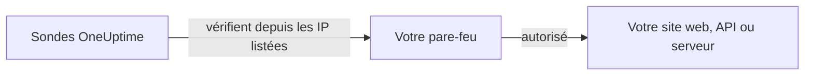

# Adresses IP

Les sondes d'OneUptime Cloud vérifient vos sites web, API et serveurs depuis un ensemble fixe d'adresses IP. Si un pare-feu ou une liste d'autorisation se trouve devant ce que vous surveillez, autorisez ces adresses pour que les vérifications passent.



## Adresses IP à autoriser

Autorisez dans votre pare-feu le trafic provenant de ces adresses :

{{IP_WHITELIST}}

> [!NOTE]
> Ces adresses peuvent changer. OneUptime vous prévient à l'avance lorsque c'est le cas. Pour rester à jour sans surveiller les annonces, [récupérez la liste](#récupérer-la-liste-par-programmation) chaque fois que vous mettez à jour votre pare-feu.

## Récupérer la liste par programmation

La même liste est servie en JSON, sans clé API, pour qu'un script puisse garder vos règles de pare-feu à jour :

```bash
curl -s https://oneuptime.com/ip-whitelist
```

```json
{
  "ipWhitelist": ["<list of IPs>"]
}
```

`ipWhitelist` est un tableau qui contient une adresse par entrée. Pour afficher une adresse par ligne, par exemple pour alimenter un script de pare-feu :

```bash
curl -s https://oneuptime.com/ip-whitelist | jq -r '.ipWhitelist[]'
```

## OneUptime auto-hébergé

Sur votre propre instance, cette page et le point de terminaison `/ip-whitelist` affichent les adresses du paramètre `IP_WHITELIST` de l'instance, une liste séparée par des virgules. Indiquez-y les adresses depuis lesquelles vos propres sondes envoient leurs vérifications.

:::tabs
@tab Kubernetes
Définissez la valeur `ipWhitelist` du chart Helm :

```yaml title="values.yaml"
ipWhitelist: "203.0.113.1,203.0.113.2"
```
@tab Docker Compose
`config.env` ne la transmet pas à l'application. Ajoutez-la à l'environnement du service `app` dans un fichier `docker-compose.override.yml` à côté de `docker-compose.yml`, puis redémarrez OneUptime :

```yaml title="docker-compose.override.yml"
services:
  app:
    environment:
      IP_WHITELIST: "203.0.113.1,203.0.113.2"
```
:::

Quand rien n'est défini, cette page affiche **No IP addresses configured.** et le point de terminaison renvoie un tableau `ipWhitelist` vide.

## Étapes suivantes

:::cards
- [Sondes personnalisées](/docs/probe/custom-probe): Exécuter une sonde dans votre propre réseau au lieu d'ouvrir le pare-feu.
- [Créer un moniteur](/docs/monitor/create-monitor): Commencer à vérifier un site web, une API ou un serveur.
:::
