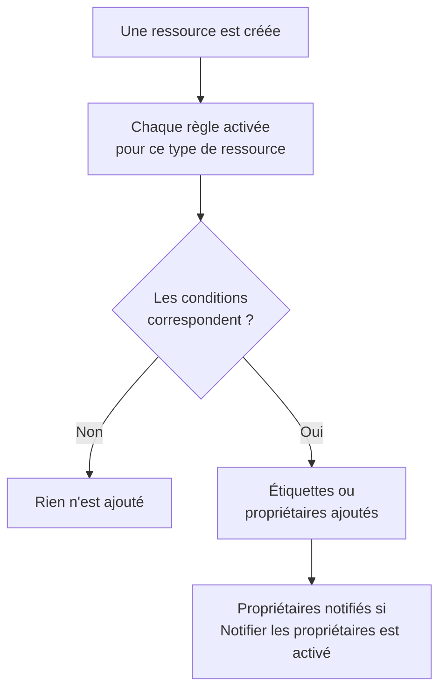

# Règles d'étiquettes et de propriétaires

Les règles d'étiquettes et les règles de propriétaires organisent vos ressources à votre place. Une **règle d'étiquettes** ajoute des étiquettes à chaque nouvelle ressource qui lui correspond, et une **règle de propriétaires** lui ajoute des utilisateurs et des équipes comme propriétaires : un nouvel incident de base de données reçoit l'étiquette _Base de données_ et appartient à l'équipe base de données sans que personne ait à y penser.

:::cards
- [Créer une règle](#créer-une-règle): Deux étapes : ce à quoi la règle correspond, puis ce qu'elle ajoute.
- [Hériter des étiquettes et des propriétaires](#hériter-des-étiquettes-et-des-propriétaires): Transmettre ce que portent les moniteurs, hôtes et services d'un événement.
- [Quand les règles s'exécutent](#quand-les-règles-sexécutent): Les nouvelles ressources, et **Run Now** pour celles que vous avez déjà.
:::

## Fonctionnement

Les règles s'exécutent quand une ressource est créée. Chaque règle activée vérifie ses conditions sur la nouvelle ressource, et chaque règle qui correspond ajoute ce qu'elle ajoute.

Les étiquettes et les propriétaires servent à filtrer et à regrouper les ressources, déterminent qui OneUptime prévient à leur sujet et ce que couvrent les [autorisations limitées par étiquettes ou à ses propres ressources](/docs/permissions/index). Les règles les gardent cohérents sans que personne ait à y penser.

## Où trouver les règles

Chaque produit doté d'étiquettes et de propriétaires a les deux, dans ses **Paramètres** (pour les incidents, les alertes et la maintenance planifiée, dans **Règles**) : moniteurs, incidents et épisodes d'incident, alertes et épisodes d'alerte, événements de maintenance planifiée, pages de statut, services, hôtes, clusters Kubernetes, hôtes Docker, clusters Docker Swarm, hôtes Podman, clusters Proxmox, vCenter VMware, clusters Ceph, baies de stockage, bases de données, files d'attente, flottes IoT, fonctions serverless, ressources cloud, applications RUM, tableaux de bord, politiques d'astreinte, plannings d'astreinte, politiques d'appels entrants, workflows, runbooks, équipements réseau et SLO.

Par exemple, les règles d'étiquettes des moniteurs se trouvent dans **Moniteurs → Paramètres → Règles d'étiquettes**, et celles des incidents dans **Incidents → Règles → Règles d'étiquettes**. **Paramètres** et **Règles** sont repliés au départ dans le menu latéral : cliquez sur le titre de la section pour l'ouvrir. Les pages des incidents et des alertes ont un onglet **Règles d'incident** (ou **Règles d'alerte**) et un onglet **Règles d'épisode**.

## Créer une règle

Toutes les règles d'étiquettes et de propriétaires se créent de la même façon, en deux étapes.

:::steps
### Ouvrir la liste des règles

Ouvrez la page **Règles d'étiquettes** ou **Règles de propriétaire** du produit et cliquez sur son bouton de création, qui porte le nom de la règle, par exemple **Créer : Règle d'étiquettes des moniteurs**.

### Choisir ce à quoi la règle correspond

À l'étape **Correspondance**, cliquez sur **Ajouter une condition** pour chaque condition que la ressource doit remplir. Avec deux conditions ou plus, choisissez **Toutes requises** ou **Au moins une requise**. Une règle sans condition correspond à toute nouvelle ressource.

### Choisir ce que la règle ajoute

À l'étape **Étiquettes**, choisissez les **Étiquettes à ajouter**. Pour une règle de propriétaires, l'étape s'appelle **Propriétaires** : **Ajouter un propriétaire** ouvre une seule liste de personnes et d'équipes.

Le **Nom** est rempli d'après vos choix (_Ajouter Production_, _Ajouter Platform comme propriétaires_) et suit vos choix jusqu'à ce que vous saisissiez votre propre nom. Une règle qui ne fait qu'hériter est nommée d'après ce dont elle hérite (voir plus bas).

### Vérifier les champs repliés

**Plus de champs** contient la **Description** facultative et, pour une règle de propriétaires, **Notifier les propriétaires**, activé par défaut : les propriétaires qu'une règle ajoute reçoivent la même notification « vous avez été ajouté comme propriétaire » qu'un propriétaire ajouté à la main. Désactivez-le pour ajouter des propriétaires sans les prévenir.

### Enregistrer la règle

À la dernière étape, cliquez de nouveau sur le bouton qui porte le nom de la règle, par exemple **Créer : Règle d'étiquettes des moniteurs**. La règle démarre activée, et la liste l'affiche avec une pastille verte **Activé**.
:::

Une nouvelle règle doit ajouter quelque chose : au moins une étiquette (ou un propriétaire) ou, pour une règle d'incident, d'alerte ou de maintenance planifiée, quelque chose dont elle hérite (voir plus bas). Pour mettre une règle en pause sans la supprimer, désactivez **Activé** dans son formulaire de modification ; la liste affiche alors une pastille rouge **Désactivé**.

### Quelle que soit la façon dont la règle est créée

Il en va de même pour une règle créée par l'API, Terraform, un workflow ou une [importation de règles d'étiquettes](/docs/configuration/label-rule-import-export) : OneUptime refuse une nouvelle règle qui n'ajoute rien, avec un message qui nomme les champs à remplir. Ces messages sont en anglais dans toutes les langues.

| Règle | Message |
| --- | --- |
| Règle d'étiquettes | This label rule adds nothing. Choose at least one label in Labels to Add. |
| Règle d'étiquettes d'incident, d'alerte ou de maintenance planifiée | This label rule adds nothing. Choose at least one label in Labels to Add, or turn on an Inherit Labels switch. |
| Règle de propriétaires | This owner rule adds nothing. Choose at least one user or team in Owner Users or Owner Teams. |
| Règle de propriétaires d'incident, d'alerte ou de maintenance planifiée | This owner rule adds nothing. Choose at least one user or team in Owner Users or Owner Teams, or turn on an Inherit Owners switch. |

- **API** : définissez `labelsToAdd` (ou `ownerUsers` / `ownerTeams`) sur au moins un enregistrement du projet, ou l'un des interrupteurs `inheritLabelsFrom…` (`inheritOwnersFrom…`) de la règle sur `true`, un booléen JSON.
- **Terraform** : une ressource de règle d'étiquettes ou de propriétaires qui n'ajoute rien échoue à `terraform apply` avec le message ci-dessus. Donnez-lui `labels_to_add` (ou `owner_users` / `owner_teams`) ou activez l'un de ses interrupteurs d'héritage.

Les règles que vous avez déjà ne sont pas touchées : voir [Modifier une règle](#modifier-une-règle).

## Hériter des étiquettes et des propriétaires

Les règles d'incident, d'alerte et de maintenance planifiée peuvent aussi transmettre ce que portent les ressources concernées par un événement. Sous **Étiquettes à ajouter** (ou **Propriétaires**), la section repliée **Hériter des étiquettes** (ou **Hériter des propriétaires**) contient six interrupteurs :

- **Hériter des étiquettes des moniteurs** : chaque étiquette des moniteurs de l'incident est aussi ajoutée à l'incident. Une alerte n'a qu'un moniteur ; pour une règle d'alerte, l'interrupteur s'appelle donc **Hériter des étiquettes du moniteur** (et pour une règle de propriétaires d'alerte, **Hériter des propriétaires du moniteur**).
- **Hériter des étiquettes des hôtes**, **Hériter des étiquettes des clusters Kubernetes**, **Hériter des étiquettes des hôtes Docker**, **Hériter des étiquettes des hôtes Podman** et **Hériter des étiquettes des services** font de même pour ces ressources.

Les règles de propriétaires ont les six mêmes interrupteurs pour les propriétaires (**Hériter des propriétaires des moniteurs**, etc.). Tant qu'aucun interrupteur n'est activé, la section repliée indique à quoi elle sert ; pour une règle qui hérite, elle s'ouvre d'elle-même. Les règles d'épisode n'ont pas d'interrupteurs d'héritage.

Une règle qui hérite peut laisser **Étiquettes à ajouter** (ou **Propriétaires**) vide : elle ajoute ce dont elle hérite. Une telle règle est nommée d'après ce dont elle hérite :

| Interrupteurs activés | Nom |
| --- | --- |
| **Hériter des étiquettes des moniteurs** | _Hériter des étiquettes : moniteurs_ |
| **Hériter des étiquettes des moniteurs** et **Hériter des étiquettes des hôtes** | _Hériter des étiquettes : moniteurs, hôtes_ |
| **Hériter des étiquettes du moniteur**, pour une règle d'alerte | _Hériter des étiquettes : moniteur_ |

Le nom suit les interrupteurs jusqu'à ce que vous choisissiez une étiquette (la règle est alors nommée d'après ses étiquettes) ou que vous saisissiez votre propre nom.

## Modifier une règle

Le formulaire de modification d'une règle a les deux mêmes étapes et ajoute l'interrupteur **Activé**. Il n'exige pas ce que la règle ajoute : une règle enregistrée avant que OneUptime ne le demande (par l'API, Terraform, une importation ou l'ancien formulaire) peut n'ajouter rien du tout, et une modification peut retirer tout ce qu'une règle ajoute.

Une telle règle peut toujours être renommée, désactivée ou supprimée, y compris par l'API et Terraform. La liste marque une règle qui n'ajoute rien avec **N'ajoute rien** à côté de son statut, tout comme la page de la règle. Modifiez-la pour choisir ce qu'elle ajoute, ou supprimez-la.

## Quand les règles s'exécutent

Chaque règle activée s'exécute quand une ressource est créée, depuis le tableau de bord ou par l'API, et chaque règle qui correspond ajoute ce qu'elle ajoute :

- Si plusieurs règles correspondent, elles ajoutent toutes leurs étiquettes et leurs propriétaires.
- Une règle ne retire jamais rien : ni les étiquettes ou propriétaires ajoutés à la main, ni ceux qu'elle a ajoutés elle-même.
- Une règle désactivée ne fait rien.

Une règle écrite aujourd'hui s'applique aux ressources créées après elle. Pour l'appliquer à celles que vous avez déjà, utilisez **Run Now** : voir [Exécuter des règles sur les ressources existantes](/docs/configuration/run-rules-now). Les règles d'étiquettes peuvent aussi être copiées d'un projet à l'autre : voir [Importer et exporter des règles d'étiquettes](/docs/configuration/label-rule-import-export).

## Étapes suivantes

:::cards
- [Exécuter des règles sur les ressources existantes](/docs/configuration/run-rules-now): Appliquer une règle aux ressources que vous avez déjà.
- [Importer et exporter des règles d'étiquettes](/docs/configuration/label-rule-import-export): Copier des règles d'étiquettes entre projets au format JSON.
- [Paramètres et automatisation des incidents](/docs/incidents/settings): Les autres règles qu'un incident peut exécuter.
- [Règles d'étiquettes et de propriétaires des SLO](/docs/slo/label-and-owner-rules): Ce sur quoi portent les règles des SLO.
:::
