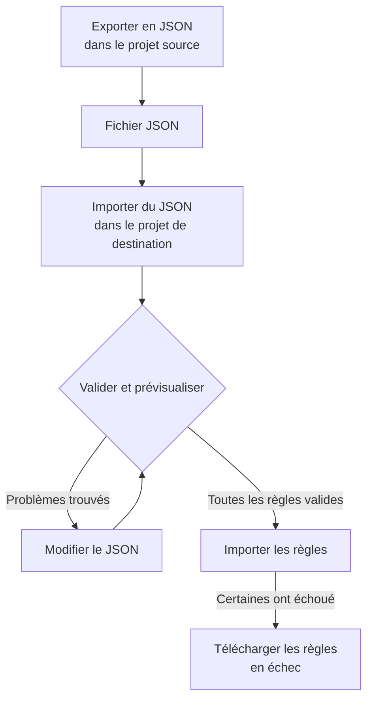

# Importer et exporter des règles d'étiquettes

Copiez des règles d'étiquettes d'un projet à l'autre, ou créez-en beaucoup à la fois, sous forme de fichier JSON. Chaque page **Règles d'étiquettes** propose les actions **Exporter en JSON** et **Importer du JSON** dans son menu **Plus d'options** (**⋯**), y compris pour les incidents, les alertes, les moniteurs et les équipements réseau. La seule exception est VMware : ses règles d'étiquettes de vCenter n'ont ni l'une ni l'autre.



## Exporter des règles

Ouvrez **Plus d'options** et sélectionnez **Exporter en JSON** pour télécharger toutes les règles de ce type du projet courant. L'export inclut les règles des autres pages du tableau et ignore les filtres du tableau.

Le fichier conserve pour chaque règle son état d'activation, ses conditions, ses étiquettes à ajouter et ses options d'héritage d'étiquettes. Les identifiants de projet, les identifiants de règle et les champs d'audit sont omis.

Les étiquettes, moniteurs et gravités liés sont écrits sous leur nom exact. Une importation ne les crée pas : ils doivent déjà exister dans le projet de destination.

## Importer des règles

:::steps
### Ouvrir Importer du JSON

Ouvrez la page **Règles d'étiquettes** du projet de destination et sélectionnez **Plus d'options → Importer du JSON**.

### Ajouter le fichier

Téléversez un fichier d'export JSON, ou collez son contenu.

### Valider et prévisualiser

Sélectionnez **Validate and preview**. Chaque règle est vérifiée avant qu'aucune ne soit créée, et les ressources référencées doivent exister dans le projet de destination avec des noms uniques et correspondants.

### Relire l'aperçu

Vérifiez les noms des règles, leur état, leurs étiquettes et leurs conditions. Un lot important s'affiche page par page. Pour corriger quelque chose, sélectionnez **Modifier le JSON** et validez de nouveau.

### Importer

Sélectionnez le bouton d'importation, qui compte les règles (par exemple **Import 2 rules**), et gardez la fenêtre ouverte jusqu'à l'affichage des résultats.
:::

Une importation ajoute de nouvelles règles et conserve celles qui existent ; importer de nouveau le même fichier crée donc une autre copie. Les autorisations de création habituelles et la validation côté serveur s'appliquent à chaque règle.

Si certaines règles échouent, sélectionnez **Télécharger les règles en échec** pour n'enregistrer que ces lignes, corrigez-les et importez ce fichier de nouveau. Quand une requête expire, vérifiez la liste des règles avant de réessayer : le serveur a peut-être enregistré la règle avant que sa réponse ne se perde.

## Créer un lot en JSON

Exportez une règle existante pour obtenir un exemple pour votre type de ressource, puis modifiez ou ajoutez des entrées dans le tableau `items`. Cet exemple crée deux règles d'étiquettes de moniteurs. Les étiquettes `Production` et `Infrastructure` doivent déjà exister dans le projet de destination.

```json title="monitor-label-rules.json"
{
  "fileType": "oneuptime-label-rules",
  "schemaVersion": 1,
  "resourceType": "MonitorLabelRule",
  "items": [
    {
      "name": "Production API monitors",
      "description": "Label production API monitors automatically",
      "isEnabled": true,
      "monitorNamePattern": "^api-prod-",
      "monitorLabels": [],
      "labelsToAdd": ["Production"]
    },
    {
      "name": "Database monitors",
      "isEnabled": false,
      "monitorNamePattern": "^database-",
      "labelsToAdd": ["Infrastructure"]
    }
  ]
}
```

| Champ | Contenu |
| --- | --- |
| `fileType` | Toujours `oneuptime-label-rules`. |
| `schemaVersion` | Toujours `1`. |
| `resourceType` | Le type de règle que contient le fichier, par exemple `MonitorLabelRule`. |
| `items` | Les règles, un objet chacune. Un fichier en contient au moins une. |

Utilisez des booléens JSON pour `isEnabled`, du texte pour les motifs et des tableaux de noms pour les ressources liées.

Ceci arrête tout le lot avant l'étape d'importation : motifs invalides, champs inconnus, noms manquants et références ambiguës. De même pour une règle qui n'ajoute rien (un `labelsToAdd` vide et, pour une règle d'incident, d'alerte ou de maintenance planifiée, aucun interrupteur `inheritLabelsFrom…` à `true`), car OneUptime refuse d'en créer une (voir [Règles d'étiquettes et de propriétaires](/docs/configuration/label-and-owner-rules#quelle-que-soit-la-façon-dont-la-règle-est-créée)). Un export peut contenir une telle règle si elle a été enregistrée avant cette vérification ; donnez-lui une étiquette ou retirez-la du fichier avant l'importation.

> [!NOTE]
> Les fichiers et le JSON collé sont limités à 10 Mo.

## Copier entre types de ressources

Gardez le `resourceType` d'origine dans le fichier et ouvrez **Importer du JSON** sur la page de destination. Les motifs compatibles de nom principal ou de titre, les motifs de description et les étiquettes prérequises sont associés aux champs de la destination, et l'aperçu liste ces correspondances pour que vous puissiez les vérifier. Les références aux gravités d'incident et d'alerte sont rapprochées des noms de gravité de la destination.

Les conditions ou actions que la destination ne prend pas en charge bloquent l'importation. Par exemple, une règle d'incident limitée à certains moniteurs ne peut pas être copiée vers les règles d'équipements réseau sans modifier ces conditions.

> [!WARNING]
> Les règles d'étiquettes des équipements réseau et des SLO acceptent les caractères génériques en plus des expressions régulières. Un transfert entre ces règles et d'autres types de règles refuse les motifs contenant `*` ou des espaces autour, car ils y correspondent différemment. Modifiez ces motifs pour la destination, ou gardez la règle dans le même type de ressource. Les règles d'étiquettes des équipements réseau et des SLO peuvent s'échanger n'importe quel motif, car elles correspondent de la même façon.

## Étapes suivantes

:::cards
- [Règles d'étiquettes et de propriétaires](/docs/configuration/label-and-owner-rules): Ce à quoi une règle d'étiquettes correspond et ce qu'elle ajoute.
- [Exécuter des règles sur les ressources existantes](/docs/configuration/run-rules-now): Appliquer les règles importées aux ressources que vous avez déjà.
:::
