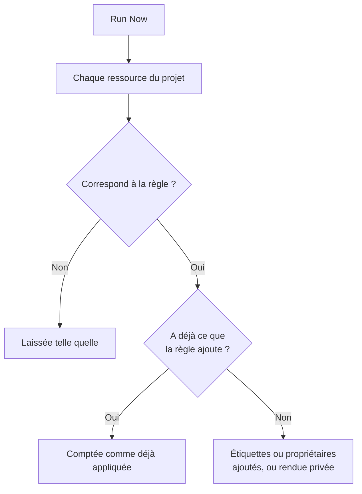

# Exécuter des règles sur les ressources existantes

Les règles d'étiquettes, de propriétaires et de confidentialité s'exécutent automatiquement quand une ressource est **créée**. Une règle écrite aujourd'hui ne change donc rien aux moniteurs, incidents ou hôtes que vous avez déjà. **Run Now** comble cet écart : il applique une règle à chaque ressource qui existe déjà dans le projet.

## Quelles règles peuvent être exécutées

- **Règles d'étiquettes** et **Règles de propriétaire**, pour chaque ressource qui en a : moniteurs, incidents, épisodes d'incident, alertes, épisodes d'alerte, événements de maintenance planifiée, pages de statut, services, hôtes, clusters Kubernetes, hôtes Docker, clusters Docker Swarm, hôtes Podman, clusters Proxmox, vCenter VMware, clusters Ceph, baies de stockage, bases de données, files d'attente, flottes IoT, fonctions serverless, ressources cloud, applications RUM, tableaux de bord, politiques d'astreinte, plannings d'astreinte, politiques d'appels entrants, workflows, runbooks, équipements réseau et SLO.
- **Règles de confidentialité**, pour les incidents, les alertes, les épisodes d'incident et les épisodes d'alerte.
- **Règles de moniteurs** sur une page de statut. Elles resynchronisent déjà la page chaque fois qu'une règle est enregistrée ; en exécuter une la resynchronise immédiatement.
- **Règles de moniteurs** sur un SLO. Elles resynchronisent déjà le SLO chaque fois qu'une règle est enregistrée ; en exécuter une resynchronise immédiatement les moniteurs du SLO. Voir [Moniteurs et règles de moniteurs](/docs/slo/monitor-rules).

Les règles qui déclenchent une action au lieu de décrire une ressource (**Règles d'astreinte**, **Règles de runbook**, **Règles de remédiation automatique** et **Règles de regroupement**) ne peuvent pas être exécutées sur des enregistrements existants. Les exécuter appellerait des personnes, lancerait des runbooks, démarrerait des corrections ou réorganiserait des épisodes pour des incidents déjà terminés.

## Avant de commencer

Pour exécuter une règle, il vous faut l'autorisation de modifier la règle **et** de modifier les ressources qu'elle change : par exemple, une règle d'étiquettes de moniteurs demande à la fois l'autorisation de modifier les règles d'étiquettes de moniteurs et celle de modifier les moniteurs. Les règles de propriétaires demandent en plus l'autorisation d'ajouter des propriétaires. Les règles de moniteurs d'une page de statut ou d'un SLO ne demandent que l'autorisation de modifier la règle.

> [!IMPORTANT]
> Une autorisation limitée à certaines étiquettes, ou aux ressources dont vous êtes propriétaire, ne suffit pas : une exécution peut changer toutes les ressources du projet. Les listes de blocage des équipes s'appliquent comme partout ailleurs, et un blocage limité à certaines étiquettes compte aussi : une exécution changerait les ressources qui portent ces étiquettes, donc un blocage avec étiquettes sur la modification des ressources qu'une règle change refuse l'exécution.

Les règles d'un réseau demandent la même chose quand vous les exécutez sur les équipements que vous avez déjà. **Run Now** d'une règle d'affectation de site ou d'étiquettes d'équipement demande l'autorisation de modifier la règle et **Edit Network Device**. **Simulation** et **Run Rule** d'une règle d'importation automatique demandent l'autorisation de modifier la règle, **Create Network Device** et, quand la règle a un modèle de moniteur, **Create Monitor**. Chacune doit couvrir tout le projet. Voir [Importer automatiquement avec des règles d'importation automatique](/docs/monitor/network-device-monitor#importing-automatically-with-auto-import-rules).

## Exécuter une règle

:::steps
### Ouvrir la liste des règles

Ouvrez la page des règles, par exemple **Moniteurs → Paramètres → Règles d'étiquettes**.

### Sélectionner Run Now

Ouvrez le menu **⋯** au bout de la ligne de la règle et sélectionnez **Run Now**, ou sélectionnez **Voir** puis **Run Now** sur la page de la règle. Une boîte de dialogue indique ce que fera l'exécution.

### Choisir de notifier ou non les nouveaux propriétaires

Pour une règle de propriétaires, choisissez si vous voulez **Notifier les propriétaires que cette exécution ajoute**. Cette option est désactivée par défaut et ne s'applique que si la règle elle-même a **Notifier les propriétaires** activé. Un propriétaire est notifié une fois pour chaque ressource à laquelle il est ajouté.

### Lancer la règle

Sélectionnez **Run Rule** et gardez la boîte de dialogue ouverte. Sur un grand projet, la boîte de dialogue montre où en est l'exécution.

### Lire le rapport

Quand l'exécution est terminée, la boîte de dialogue indique à combien de ressources la règle correspondait, combien elle en a modifié et combien avaient déjà ce que la règle ajoute.
:::

## Exécuter plusieurs règles

Sélectionnez des règles dans le tableau, ouvrez le menu des actions groupées et choisissez **Run Now**. Les règles sélectionnées s'exécutent l'une après l'autre.

- Les propriétaires ajoutés par une exécution groupée ne sont jamais notifiés. Pour les notifier, exécutez plutôt une seule règle.
- Une règle qui ne peut pas s'exécuter (par exemple parce qu'elle est désactivée) est listée avec la raison, et les autres règles s'exécutent quand même.

## Ce que fait une exécution

- **Elle ne fait qu'ajouter.** Des étiquettes sont ajoutées, des propriétaires ajoutés, des ressources rendues privées. Rien n'est retiré et rien n'est rendu public ; exécuter une règle de nouveau est donc sans risque : la deuxième exécution indique que tout était déjà appliqué.
- **Chaque ressource du projet est évaluée**, y compris les incidents et les alertes résolus.
- **Les propriétaires existants sont ignorés**, jamais ajoutés deux fois.
- **Seules les étiquettes propres à votre projet sont ajoutées.** Une étiquette nommée par la règle qui ne fait plus partie des étiquettes de votre projet est ignorée, et les autres étiquettes de la règle sont quand même ajoutées. Il en va de même quand une règle s'exécute sur une nouvelle ressource.
- **La règle est appliquée de la même façon qu'à la création**, y compris les étiquettes et les propriétaires hérités des moniteurs, hôtes et services d'un incident. Quand la ressource a un fil d'activité, le fil indique quelle règle l'a modifiée.
- **Les règles désactivées ne s'exécutent pas.** Activez d'abord la règle.
- **Les règles de moniteurs des pages de statut** ajoutent les moniteurs auxquels elles correspondent et retirent ceux qu'elles avaient ajoutés et auxquels elles ne correspondent plus. Les moniteurs ajoutés à la main à la page ne sont jamais touchés.
- **Une seule exécution couvre jusqu'à 100 000 ressources.** Sur un projet plus grand, l'exécution s'arrête et l'indique ; exécutez de nouveau la règle pour continuer.

## Étapes suivantes

:::cards
- [Règles d'étiquettes et de propriétaires](/docs/configuration/label-and-owner-rules): Écrire les règles qu'une exécution applique.
- [Importer et exporter des règles d'étiquettes](/docs/configuration/label-rule-import-export): Importer d'abord des règles d'étiquettes depuis un autre projet.
- [Paramètres et automatisation des incidents](/docs/incidents/settings): Les règles des incidents, y compris les règles de confidentialité.
:::
