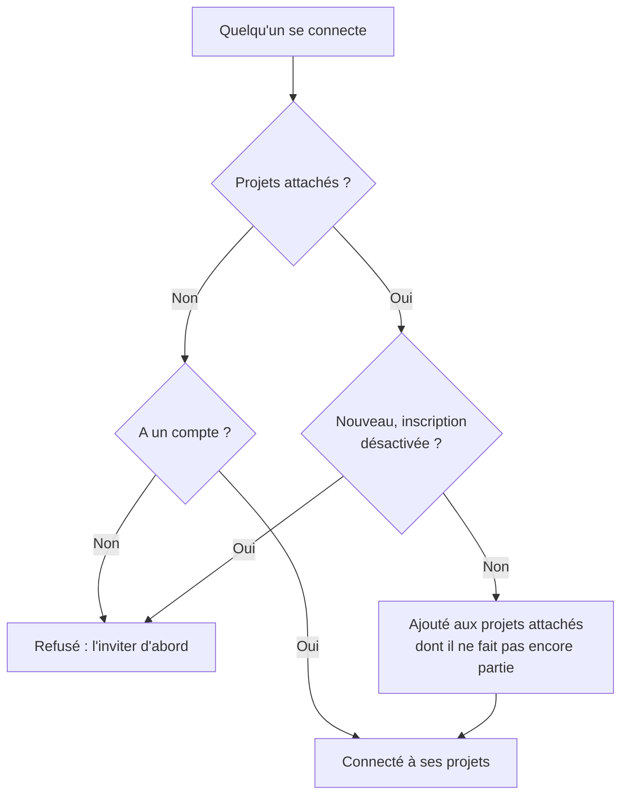

# SSO global

Le SSO global permet à un **administrateur de l'instance** OneUptime (master admin) de configurer **une seule fois**, au niveau de l'instance, un fournisseur d'identité SAML 2.0 ou OpenID Connect (OIDC), puis de le relier à n'importe quel projet du serveur. Au lieu que chaque propriétaire de projet configure son propre fournisseur d'identité, un administrateur principal en configure un qui sert toute l'instance.

> [!NOTE]
> Le SSO global, y compris l'interrupteur "Require SSO for Login" valable pour toute l'instance, fait partie de toutes les éditions d'OneUptime : chaque instance auto-hébergée l'a, la Community Edition comprise, et il ne nécessite aucune licence. Il relève de l'administration de l'instance et ne s'applique donc pas à OneUptime Cloud. Consultez [Édition Enterprise](/docs/self-hosted/enterprise) pour voir ce que comprend chaque édition.

:::cards
- [Configurer un fournisseur](#configurer-le-sso-global): Le créer, donner les URL d'OneUptime à votre fournisseur d'identité et le tester.
- [Connexion des utilisateurs](#connexion-des-utilisateurs): Membres existants uniquement, ou nouveaux venus ajoutés aux projets que vous attachez.
- [Imposer le SSO](#imposer-le-sso): Exiger le SSO pour un projet ou pour toute l'instance.
- [Désactiver un fournisseur](#désactiver-ou-supprimer-un-fournisseur): Ce qui prend fin, et les modifications qu'OneUptime refuse.
:::

## SSO global et SSO de projet

|                    | SSO de projet                                        | SSO global                                            |
| ------------------ | ---------------------------------------------------- | ----------------------------------------------------- |
| Configuré par      | Propriétaire/admin du projet (Paramètres du projet)  | Administrateur principal de l'instance (Admin Dashboard) |
| Portée             | Un seul projet                                       | Toute l'instance — reliable à n'importe quel projet   |
| Résultat de la connexion | Accès à ce seul projet                         | Accès à chaque projet que l'utilisateur peut atteindre |

Pour le fournisseur propre à un seul projet, consultez [SSO](/docs/identity/sso).

## Configurer le SSO global

:::steps
### Ouvrir la liste des fournisseurs

:::tabs
@tab SAML
Connectez-vous en tant qu'administrateur principal et ouvrez l'Admin Dashboard avec **Paramètres admin** dans votre menu utilisateur. Allez ensuite dans **Paramètres** > **Authentification** > **Global SSO**.
@tab OpenID Connect
Connectez-vous en tant qu'administrateur principal et ouvrez l'Admin Dashboard avec **Paramètres admin** dans votre menu utilisateur. Allez ensuite dans **Paramètres** > **Authentification** > **Global OIDC**.
:::

### Créer le fournisseur

:::tabs
@tab SAML
- Cliquez sur **Create Global SSO**.
- Saisissez un **Nom**, la **Sign On URL** et l'**Issuer** de votre fournisseur d'identité, puis collez le **Public Certificate**. Tout le reste est prérempli sous **Plus de champs** : la **Signature Method** (`RSA-SHA256`), la **Digest Method** (`SHA256`) et une description (`Sign in with` suivi du nom). Ne les modifiez que si votre IdP l'exige. L'enregistrement ouvre la page du fournisseur.
@tab OpenID Connect
- Cliquez sur **Create Global OIDC**.
- Saisissez un **Nom**, l'**Issuer URL**, ainsi que le **Client ID** et le **Client Secret** de l'application que vous avez enregistrée dans votre IdP. Coller l'URL de découverte de l'IdP dans **Issuer URL** fonctionne aussi. Tout le reste est prérempli sous **Plus de champs** : la **Discovery URL** (l'émetteur suivi de `/.well-known/openid-configuration`), les **Scopes** (`openid email profile`), les noms de revendications `email` et `name`, et une description (`Sign in with` suivi du nom). Ne les modifiez que si votre IdP l'exige. L'enregistrement ouvre la page du fournisseur.
:::

### Copier les URL d'OneUptime dans votre fournisseur d'identité

:::tabs
@tab SAML
Sur la page du fournisseur, la carte **Identity Provider URLs** affiche l'**ACS URL (Assertion Consumer Service / Reply URL)** et l'**Issuer (Entity ID)**. Collez les deux dans votre fournisseur d'identité (Okta, Microsoft Entra ID, OneLogin, JumpCloud et d'autres).
@tab OpenID Connect
Sur la page du fournisseur, la carte **Identity Provider URL** affiche la **Redirect URI (Callback URL)**. Ajoutez-la aux URI de redirection autorisées de votre fournisseur d'identité.
:::

### Activer le fournisseur

Un nouveau fournisseur est désactivé au départ. Cliquez sur **Edit Configuration** sur la page du fournisseur et activez **Activé**.

Activer un fournisseur global ajoute seulement une option "Sign in with SSO" sur la page de connexion — cela n'impose jamais le SSO et n'exclut personne ; vous pouvez donc l'activer, le tester et le désactiver sans risque si besoin.

### Tester le fournisseur

Utilisez le lien de la carte **Test this SSO provider** (**Test this OIDC provider** pour OpenID Connect) pour effectuer une connexion complète via votre fournisseur d'identité. Vous n'avez pas besoin d'attacher de projet au préalable : le test vous connecte aux projets dont vous faites déjà partie. Le fournisseur doit être activé pour que le lien fonctionne.
:::

## Connexion des utilisateurs

Le comportement d'un fournisseur global dépend des projets que vous lui attachez ou non :

- **Aucun projet attaché (tous les projets / invitation d'abord) :** les utilisateurs peuvent se connecter avec le fournisseur et accéder à **tout projet dont ils sont déjà membres**. Les nouveaux utilisateurs ne sont **pas** créés automatiquement — un utilisateur doit d'abord être invité dans un projet. Utilisez ce mode pour un SSO à l'échelle de l'entreprise quand les appartenances sont gérées ailleurs.

- **Projets attachés (approvisionnement automatique) :** Ouvrez le fournisseur et utilisez le tableau **Attached Projects** pour attacher un ou plusieurs projets, chacun avec un ensemble d'équipes par défaut. Les utilisateurs qui se connectent sont **approvisionnés automatiquement** dans ces projets et ajoutés aux équipes par défaut lors de leur première connexion. Un projet que vous attachez commence avec son équipe des membres ; choisissez d'autres équipes si les nouveaux venus doivent commencer avec un autre accès. Ajoutez un projet + des équipes à la fois pour construire la liste ; pour modifier un attachement, supprimez-le et ajoutez-le à nouveau.

Une personne déjà membre d'un projet attaché garde les équipes qu'elle y a.

Deux interrupteurs du fournisseur modifient ce comportement. Les deux sont désactivés au départ, repliés sous **Plus de champs** :

| Interrupteur | Ce qu'il fait lorsqu'il est activé |
| --- | --- |
| **Disable Sign Up with SSO** | Les personnes doivent être invitées dans un projet avant de pouvoir se connecter avec ce fournisseur, même si des projets sont attachés. Personne n'est créé lors de sa première connexion. |
| **Restrict to Attached Projects** | Se connecter avec ce fournisseur ne satisfait l'exigence de SSO que dans les projets qui lui sont attachés ; des personnes déjà connectées peuvent donc perdre l'accès à d'autres projets. Lorsqu'il est désactivé, la connexion la satisfait dans chaque projet dont la personne fait partie, et les projets attachés décident seulement où les nouveaux venus sont ajoutés. |

## Imposer le SSO

Configurer un fournisseur global n'oblige personne à l'utiliser ; la connexion par mot de passe fonctionne toujours. Pour exiger le SSO, activez l'exigence pour un projet ou pour toute l'instance :

- **Par projet :** un projet peut exiger le SSO, et éventuellement un fournisseur *précis* (de projet ou global). Consultez [Exiger le SSO pour votre projet](/docs/identity/sso#exiger-le-sso-pour-votre-projet).
- **Pour toute l'instance :** **Admin** > **Paramètres** > **Authentification** comporte un interrupteur **Exiger le SSO pour la connexion** qui impose le SSO à chaque utilisateur de l'instance. Il demande une confirmation avant de s'activer et enregistre dès que vous confirmez. Les administrateurs principaux en restent exemptés pour ne jamais être exclus.

Activer **Exiger le SSO pour la connexion** nécessite un fournisseur SSO qui connecte des personnes, pour que personne ne soit exclu :

- Pour toute l'instance, chaque projet qui n'exige pas lui-même le SSO en a besoin d'un : l'un de ses propres fournisseurs SAML ou OIDC activé, ou un fournisseur global activé qui connecte des personnes à ce projet. Tant qu'un projet n'en a aucun, l'activation de l'interrupteur est refusée, et le message nomme les projets (ou, s'ils sont nombreux, les premiers et leur nombre). Activez d'abord un fournisseur global, ou un fournisseur dans ces projets. Un projet qui exige un fournisseur précis a besoin de celui-là : tant qu'il est désactivé, supprimé ou qu'il ne connecte personne à ce projet, le message nomme ce projet à part — activez d'abord ce fournisseur, ou exigez-en un autre dans ce projet.
- Pour un projet, la même chose est demandée à ce projet, et au fournisseur qu'il exige s'il en exige un.
- Un enregistrement qui envoie **Exiger le SSO pour la connexion** activé alors qu'il l'est déjà — avec d'autres paramètres ou depuis l'API — est vérifié de la même façon, pour l'instance comme pour un projet, tout comme un enregistrement qui nomme le fournisseur déjà exigé par un projet.
- Pour un nouveau projet, qui n'a pas encore de fournisseur à lui : tant que l'instance exige le SSO, créer un projet nécessite un fournisseur global activé qui connecte des personnes à tous les projets, sinon personne, pas même la personne qui l'a créé, ne pourrait l'ouvrir. Sans lui, la création d'un projet est refusée, et le message demande à un administrateur du serveur d'en activer un. Les administrateurs principaux peuvent toujours créer des projets. Un projet créé avec **Exiger le SSO pour la connexion** déjà activé a besoin de la même chose, quel que soit son créateur.

Le désactiver n'est jamais refusé.

## Désactiver ou supprimer un fournisseur

Désactiver un fournisseur global, le supprimer ou le restreindre à ses projets attachés met fin aux connexions qu'il a accordées là où il ne connecte plus personne. Là où le SSO est exigé, les personnes qui se sont connectées avec lui doivent se reconnecter avec le SSO à leur prochaine requête, les pages qu'elles ont ouvertes cessent aussitôt de recevoir les mises à jour en direct, et un client MCP qu'une personne a connecté après s'être connectée avec lui cesse de fonctionner dans le projet.

Réactiver le fournisseur ne rétablit pas ces connexions : les personnes se reconnectent avec lui. Un fournisseur déjà désactivé au moment de votre mise à niveau compte comme désactivé lors de la mise à niveau.

Un nouveau certificat ou secret client, d'autres URL ou un nouveau nom laissent tout le monde connecté.

### Chaque projet qui exige le SSO garde un moyen d'entrer

Un projet qui exige le SSO, lui-même ou parce que toute l'instance l'exige, garde toujours un fournisseur avec lequel les personnes peuvent s'y connecter. Ces modifications sont donc refusées tant qu'elles laisseraient un tel projet sans aucun fournisseur, ou lui retireraient le fournisseur qu'il exige :

- désactiver un fournisseur global, le supprimer ou le restreindre à ses projets attachés ;
- pour un fournisseur restreint à ses projets attachés : attacher son premier projet (jusque-là, il connecte des personnes à tous les projets), désactiver un attachement, le déplacer vers un autre projet ou fournisseur, ou le retirer.

Le message nomme les projets, ou les premiers d'entre eux et leur nombre. Activez d'abord un autre fournisseur pour eux, l'un des leurs ou un fournisseur global, ou désactivez-y **Exiger le SSO pour la connexion**. Un projet qui exige ce fournisseur précis est nommé à part : exigez-y d'abord un autre fournisseur, ou désactivez **Exiger le SSO pour la connexion**.

Les modifications qui permettent à un fournisseur de connecter plus de personnes — l'activer, activer un attachement, lever la restriction — ne sont jamais refusées. Elles atteignent immédiatement tous les serveurs d'application, comme la désactivation de **Exiger le SSO pour la connexion** : les personnes peuvent se connecter avec le fournisseur tout de suite. Ce n'est que si une autre modification du même fournisseur est enregistrée au même instant qu'un serveur d'application peut mettre jusqu'à une minute à suivre.

Deux modifications de qui peut se connecter sont vérifiées l'une après l'autre. Si une autre est enregistrée au même moment et prend plus de temps que d'habitude — l'activation de **Exiger le SSO pour la connexion** pour toute l'instance lit chaque projet —, une modification est refusée avec "Another change to who can sign in with SSO is being saved. Try again in a moment." : enregistrez-la de nouveau. Un projet créé à ce moment-là attend lui aussi la modification, et s'il attend trop longtemps, il est refusé avec "The server's SSO settings are being changed. Create the project again in a moment."

## Dépannage

:::details "You must be invited to a project on this OneUptime instance before you can sign in with SSO"
La personne n'a pas encore de compte OneUptime, et le fournisseur n'en crée pas : soit aucun projet ne lui est attaché, soit **Disable Sign Up with SSO** est activé. Invitez-la dans un projet, ou attachez un projet au fournisseur.
:::

:::details "This SSO provider does not grant access to any project you are a member of"
**Restrict to Attached Projects** est activé, et la personne n'est membre d'aucun projet attaché au fournisseur. Attachez l'un de ses projets, ou ajoutez-la à un projet attaché.
:::

:::details "You are not a member of any project on this OneUptime instance"
La personne a un compte mais n'appartient à aucun projet, et le fournisseur n'a rien où l'ajouter. Invitez-la dans un projet, ou attachez au fournisseur un projet avec des équipes par défaut.
:::

:::details "Issuer URL does not match"
Pour un fournisseur SAML, l'émetteur figurant dans la réponse de votre fournisseur d'identité n'est pas l'**Issuer** enregistré sur le fournisseur. Copiez-le de nouveau depuis votre fournisseur d'identité ; les deux doivent correspondre exactement.
:::

## Étapes suivantes

:::cards
- [SSO](/docs/identity/sso): Configurer le fournisseur SAML ou OIDC propre à un projet.
- [SCIM](/docs/identity/scim): Laisser votre fournisseur d'identité ajouter et retirer des personnes automatiquement.
- [Utilisateurs, équipes et autorisations](/docs/permissions/index): Ce que les équipes rejointes par les nouveaux venus leur permettent de faire.
:::
