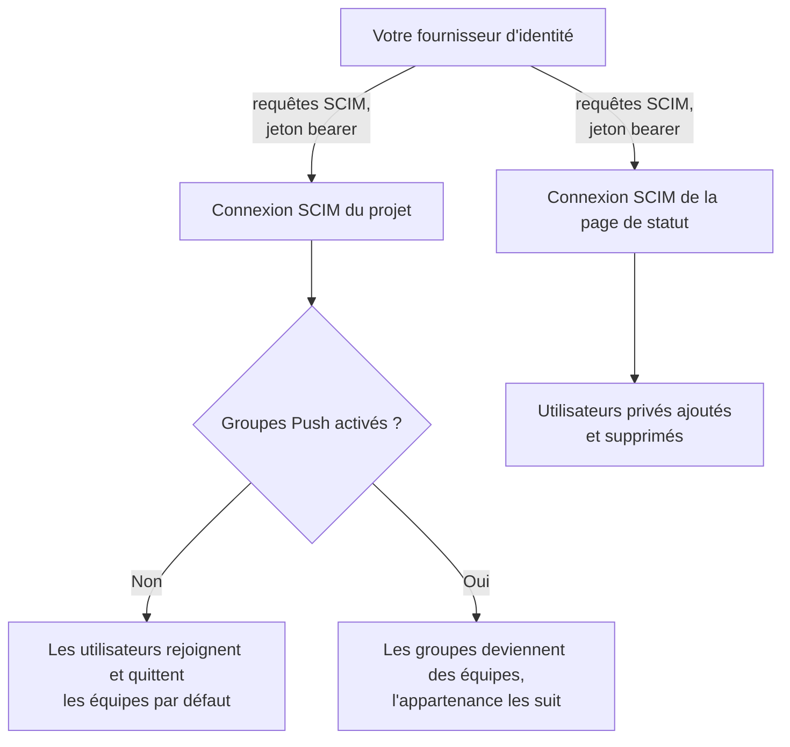
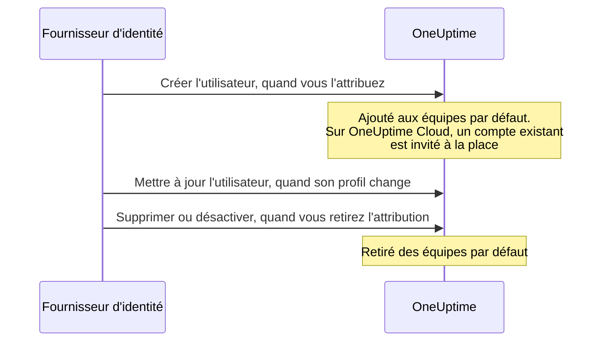

# SCIM

SCIM (System for Cross-domain Identity Management) provisionne et déprovisionne automatiquement les personnes. Votre fournisseur d'identité (IdP) — Microsoft Entra ID, Okta ou tout autre système SCIM 2.0 — ajoute des personnes à vos projets OneUptime et à vos pages de statut privées quand vous les leur attribuez, et les retire quand vous retirez l'attribution.

> [!NOTE]
> **Édition :** SCIM fait partie de l'édition Enterprise d'OneUptime. Sur OneUptime Cloud, il est disponible à partir du plan **Scale**. Les installations auto-hébergées ont besoin de l'image de l'édition Enterprise et d'une licence. Consultez [Édition Enterprise](/docs/self-hosted/enterprise). Sans licence valide (après l'essai de 14 jours, ou 30 jours après l'expiration d'une licence), les requêtes SCIM sont refusées jusqu'à l'activation d'une licence.

:::cards
- [Configurer le SCIM de projet](#configurer-le-scim-de-projet): Créer une connexion et donner son URL et son jeton à votre IdP.
- [Configurer le SCIM de page de statut](#configurer-le-scim-de-page-de-statut): Provisionner les utilisateurs privés d'une page de statut.
- [Connecter votre fournisseur d'identité](#configurer-votre-fournisseur-didentité): Étape par étape pour Microsoft Entra ID et Okta.
- [FAQ](#questions-fréquentes): Utilisateurs existants, déprovisionnement, changements d'e-mail.
:::

## Fonctionnement

Votre fournisseur d'identité appelle le point de terminaison SCIM d'OneUptime, authentifié par un jeton bearer, chaque fois que vous attribuez, modifiez ou retirez quelqu'un. Ce que change la requête dépend de l'endroit où se trouve la connexion :



L'intégration SCIM apporte les avantages suivants :

- **Provisionnement automatique des utilisateurs** : les utilisateurs sont créés dans OneUptime quand ils sont attribués dans votre IdP.
- **Déprovisionnement automatique des utilisateurs** : les utilisateurs sont retirés d'OneUptime quand leur attribution est retirée dans votre IdP.
- **Synchronisation des attributs utilisateur** : les informations des utilisateurs restent alignées entre votre IdP et OneUptime.
- **Gestion centralisée des accès** : l'accès à OneUptime se gère depuis votre système de gestion des identités existant.

SCIM et le [SSO](/docs/identity/sso) sont indépendants : SCIM décide qui fait partie d'un projet, le SSO comment les personnes se connectent. La plupart des organisations utilisent les deux.

## SCIM pour les projets

Le SCIM de projet permet aux fournisseurs d'identité de gérer les membres des équipes dans les projets OneUptime.

### Configurer le SCIM de projet

Seul un propriétaire du projet peut ajouter ou modifier la connexion SCIM d'un projet, ou voir ou réinitialiser son jeton bearer : via SCIM, votre fournisseur d'identité peut ajouter des personnes à n'importe quelle équipe du projet.
:::steps
1. **Ouvrir les paramètres du projet**

   - Ouvrez votre projet OneUptime
   - Allez dans **Paramètres du projet** > **Sécurité** > **SCIM**

2. **Configurer les paramètres SCIM**

   - Saisissez un **Nom**. **Équipes par défaut** commence par l'équipe des membres de votre projet : les nouveaux utilisateurs sont ajoutés à ces équipes
   - Sous **Plus de champs**, **Provisionner automatiquement les utilisateurs** (ajouter les utilisateurs quand ils sont attribués dans votre IdP) et **Déprovisionner automatiquement les utilisateurs** (retirer les utilisateurs quand leur attribution est retirée dans votre IdP) sont activés, et **Activer les groupes Push** est désactivé. Modifiez-les là si besoin
   - Enregistrez. La boîte de dialogue avec la **SCIM Base URL** et le **Bearer Token** pour la configuration de votre IdP s'ouvre immédiatement

3. **Configurer votre fournisseur d'identité**

   - Utilisez la **SCIM Base URL** de la boîte de dialogue. Sur OneUptime Cloud, c'est `https://oneuptime.com/identity/scim/v2/<scim-id>` ; une installation auto-hébergée affiche son propre hôte
   - Configurez l'authentification par jeton bearer avec le **Bearer Token** de la boîte de dialogue
   - Mappez les attributs utilisateur (l'e-mail est obligatoire). [Configurer votre fournisseur d'identité](#configurer-votre-fournisseur-didentité) donne les détails pour Microsoft Entra ID et Okta
:::

Pour revoir les URL, sélectionnez **Voir les URL SCIM** sur la ligne de la connexion. **Réinitialiser le jeton Bearer** remplace le jeton ; mettez à jour votre fournisseur d'identité avec le nouveau.

### Provisionnement d'un utilisateur de projet



Une personne qui avait déjà un compte OneUptime rejoint le projet une fois qu'elle accepte l'invitation sur OneUptime Cloud (voir la [FAQ](#questions-fréquentes)). L'accès accordé par des équipes autres que les équipes par défaut de la connexion n'est pas touché.

## SCIM pour les pages de statut

Le SCIM de page de statut permet aux fournisseurs d'identité de provisionner et de déprovisionner les utilisateurs privés de page de statut, qui peuvent accéder aux pages de statut privées.

### Configurer le SCIM de page de statut

:::steps
1. **Ouvrir les paramètres de la page de statut**

   - Ouvrez **Pages de statut** et sélectionnez votre page de statut
   - Allez dans **Sécurité** > **SCIM**

2. **Configurer les paramètres SCIM**

   - Saisissez un **Nom**. Sous **Plus de champs**, **Provisionner automatiquement les utilisateurs** (ajouter des utilisateurs privés quand ils sont attribués dans votre IdP) et **Déprovisionner automatiquement les utilisateurs** (supprimer les utilisateurs privés quand leur attribution est retirée dans votre IdP) sont activés. Modifiez-les là si besoin
   - Enregistrez. La boîte de dialogue avec la **SCIM Base URL** et le **Bearer Token** pour la configuration de votre IdP s'ouvre immédiatement

3. **Configurer votre fournisseur d'identité**

   - Utilisez la **SCIM Base URL** de la boîte de dialogue. Sur OneUptime Cloud, c'est `https://oneuptime.com/identity/status-page-scim/v2/<scim-id>`
   - Configurez l'authentification par jeton bearer avec le jeton fourni
   - Mappez les attributs utilisateur (l'e-mail est obligatoire)
:::

Pour revoir les URL, sélectionnez **Afficher les URL des points de terminaison SCIM** sur la ligne de la connexion.

Le SCIM de page de statut ne prend en charge que les utilisateurs. Il ne prend en charge ni les groupes ni leur provisionnement.

### Provisionnement d'un utilisateur privé

```mermaid title="La vie d'un utilisateur privé avec le SCIM de page de statut"
sequenceDiagram
    participant IdP as Fournisseur d'identité
    participant O as OneUptime
    IdP->>O: Créer l'utilisateur, quand vous l'attribuez
    Note over O: L'utilisateur privé peut accéder<br/>à la page de statut privée
    IdP->>O: Supprimer, ou mettre active à false
    Note over O: Utilisateur privé et ses<br/>sessions supprimés
```

> [!WARNING]
> Le déprovisionnement supprime définitivement l'utilisateur privé de la page de statut et toutes ses sessions pour cette page de statut. Si l'utilisateur est de nouveau attribué plus tard, il est provisionné comme un nouvel utilisateur privé. Quand **Déprovisionner automatiquement les utilisateurs** est désactivé, les mises à jour qui règlent `active` sur `false` sont ignorées et les requêtes DELETE sont refusées.

## Configurer votre fournisseur d'identité

Chaque fournisseur ci-dessous commence par la création d'une connexion SCIM de projet dans OneUptime, puis y connecte votre fournisseur d'identité.

### Microsoft Entra ID (anciennement Azure AD)

Microsoft Entra ID offre une gestion des identités de niveau entreprise avec le provisionnement SCIM. Il vous faut :

- Un tenant Microsoft Entra ID avec une licence Premium P1 ou P2 (nécessaire pour le provisionnement automatique).
- Un projet OneUptime sur le plan **Scale** ou supérieur sur OneUptime Cloud.
- Un accès administrateur à Microsoft Entra ID et à OneUptime.

:::steps
#### Créer la connexion SCIM pour Entra ID

1. Connectez-vous à votre tableau de bord OneUptime
2. Allez dans **Paramètres du projet** > **Sécurité** > **SCIM**
3. Cliquez sur **Créer : SCIM**
4. Saisissez un nom parlant (par exemple "Microsoft Entra ID Provisioning")
5. Vérifiez les options :
   - **Équipes par défaut** : commence par l'équipe des membres de votre projet ; les nouveaux utilisateurs sont ajoutés à ces équipes
   - **Provisionner automatiquement les utilisateurs** et **Déprovisionner automatiquement les utilisateurs** : activés, sous **Plus de champs**
   - **Activer les groupes Push** : sous **Plus de champs** ; activez-le si vous voulez gérer l'appartenance aux équipes via les groupes Entra ID
6. Enregistrez la configuration
7. Copiez la **SCIM Base URL** et le **Bearer Token** depuis la boîte de dialogue qui s'ouvre — vous en aurez besoin pour Entra ID

#### Créer une application d'entreprise dans Entra ID

1. Connectez-vous au [Microsoft Entra admin center](https://entra.microsoft.com)
2. Allez dans **Identity** > **Applications** > **Enterprise applications**
3. Cliquez sur **+ New application**, puis sur **+ Create your own application**
4. Saisissez un nom (par exemple "OneUptime")
5. Sélectionnez **Integrate any other application you don't find in the gallery (Non-gallery)** et cliquez sur **Create**

#### Connecter Entra ID à OneUptime

1. Dans votre application d'entreprise OneUptime, allez dans **Provisioning** et cliquez sur **Get started**
2. Réglez **Provisioning Mode** sur **Automatic**
3. Sous **Admin Credentials**, réglez **Tenant URL** sur la **SCIM Base URL** d'OneUptime (par exemple `https://oneuptime.com/identity/scim/v2/<scim-id>`) et **Secret Token** sur le **Bearer Token**
4. Cliquez sur **Test Connection** pour vérifier la configuration, puis sur **Save**

#### Mapper les attributs utilisateur dans Entra ID

1. Dans la section Provisioning, cliquez sur **Mappings**, puis sur **Provision Azure Active Directory Users**
2. Configurez les mappages d'attributs suivants, supprimez ceux dont vous n'avez pas besoin et cliquez sur **Save** :

| Attribut Azure AD                                             | Attribut SCIM d'OneUptime      | Obligatoire |
| ------------------------------------------------------------- | ------------------------------ | ----------- |
| `userPrincipalName`                                           | `userName`                     | Oui         |
| `mail`                                                        | `emails[type eq "work"].value` | Recommandé  |
| `displayName`                                                 | `displayName`                  | Recommandé  |
| `givenName`                                                   | `name.givenName`               | Facultatif  |
| `surname`                                                     | `name.familyName`              | Facultatif  |
| `Switch([IsSoftDeleted], , "False", "True", "True", "False")` | `active`                       | Recommandé  |

#### Mapper les groupes dans Entra ID (facultatif)

Si vous avez activé **Activer les groupes Push** dans OneUptime :

1. Revenez à **Mappings** et cliquez sur **Provision Azure Active Directory Groups**
2. Réglez **Enabled** sur **Yes**
3. Configurez les mappages d'attributs suivants et cliquez sur **Save** :

| Attribut Azure AD | Attribut SCIM d'OneUptime |
| ----------------- | ------------------------- |
| `displayName`     | `displayName`             |
| `members`         | `members`                 |

#### Attribuer des utilisateurs et des groupes dans Entra ID

1. Dans votre application d'entreprise OneUptime, allez dans **Users and groups**
2. Cliquez sur **+ Add user/group**, sélectionnez les utilisateurs et les groupes à provisionner dans OneUptime, puis cliquez sur **Assign**

#### Lancer le provisionnement dans Entra ID

1. Allez dans **Provisioning** > **Overview** et cliquez sur **Start provisioning**
2. Le premier cycle de provisionnement commence ; la première synchronisation peut prendre jusqu'à 40 minutes
3. Surveillez les erreurs dans les **Provisioning logs**. Les personnes attribuées apparaissent dans les équipes du projet dans OneUptime
:::

### Okta

Okta offre une gestion des identités flexible avec la prise en charge de SCIM. Il vous faut :

- Un tenant Okta avec le provisionnement (la fonctionnalité Lifecycle Management).
- Un projet OneUptime sur le plan **Scale** ou supérieur sur OneUptime Cloud.
- Un accès administrateur à Okta et à OneUptime.

:::steps
#### Créer la connexion SCIM pour Okta

1. Connectez-vous à votre tableau de bord OneUptime
2. Allez dans **Paramètres du projet** > **Sécurité** > **SCIM**
3. Cliquez sur **Créer : SCIM**
4. Saisissez un nom parlant (par exemple "Okta Provisioning")
5. Vérifiez les options :
   - **Équipes par défaut** : commence par l'équipe des membres de votre projet ; les nouveaux utilisateurs sont ajoutés à ces équipes
   - **Provisionner automatiquement les utilisateurs** et **Déprovisionner automatiquement les utilisateurs** : activés, sous **Plus de champs**
   - **Activer les groupes Push** : sous **Plus de champs** ; activez-le si vous voulez gérer l'appartenance aux équipes via les groupes Okta
6. Enregistrez la configuration
7. Copiez la **SCIM Base URL** et le **Bearer Token** depuis la boîte de dialogue qui s'ouvre — vous en aurez besoin pour Okta

#### Créer ou ouvrir l'application Okta

Dans l'Okta Admin Console, allez dans **Applications** > **Applications** :

- Si vous utilisez déjà Okta pour le SSO d'OneUptime, ouvrez cette application.
- Sinon, cliquez sur **Create App Integration**, sélectionnez **SAML 2.0**, nommez-la "OneUptime" et terminez la configuration SAML (voir [SSO](/docs/identity/sso)).

#### Activer le provisionnement SCIM dans Okta

1. Dans votre application OneUptime, allez dans l'onglet **General**
2. Dans la section **App Settings**, cliquez sur **Edit**, sélectionnez **SCIM** sous **Provisioning** et cliquez sur **Save**
3. Un nouvel onglet **Provisioning** apparaît

#### Connecter Okta à OneUptime

1. Dans l'onglet **Provisioning**, cliquez sur **Integration**, puis sur **Configure API Integration**, et cochez **Enable API integration**
2. Configurez ce qui suit :
   - **SCIM connector base URL** : la **SCIM Base URL** d'OneUptime (par exemple `https://oneuptime.com/identity/scim/v2/<scim-id>`)
   - **Unique identifier field for users** : `userName`
   - **Supported provisioning actions** : Import New Users and Profile Updates, Push New Users, Push Profile Updates, ainsi que Push Groups si vous utilisez le provisionnement par groupes
   - **Authentication Mode** : **HTTP Header**
   - **Authorization** : le **Bearer Token** d'OneUptime. OneUptime attend l'en-tête `Authorization: Bearer <token>` ; si Okta affiche déjà le mot Bearer devant le champ, saisissez le jeton seul
3. Cliquez sur **Test API Credentials** pour vérifier la connexion, puis sur **Save**

#### Choisir ce qu'Okta provisionne

1. Dans l'onglet **Provisioning**, cliquez sur **To App**, puis sur **Edit**
2. Activez **Create Users**, **Update User Attributes** et **Deactivate Users**, puis cliquez sur **Save**

#### Mapper les attributs utilisateur dans Okta

Faites défiler jusqu'à **Attribute Mappings** et vérifiez ces mappages. Supprimez ceux dont vous n'avez pas besoin :

| Attribut Okta      | Attribut SCIM d'OneUptime       | Direction       |
| ------------------ | ------------------------------- | --------------- |
| `userName`         | `userName`                      | Okta vers l'app |
| `user.email`       | `emails[primary eq true].value` | Okta vers l'app |
| `user.firstName`   | `name.givenName`                | Okta vers l'app |
| `user.lastName`    | `name.familyName`               | Okta vers l'app |
| `user.displayName` | `displayName`                   | Okta vers l'app |

#### Pousser les groupes depuis Okta (facultatif)

Si vous avez activé **Activer les groupes Push** dans OneUptime :

1. Allez dans l'onglet **Push Groups** et cliquez sur **+ Push Groups**
2. Sélectionnez **Find groups by name** ou **Find groups by rule**
3. Recherchez et sélectionnez les groupes à pousser, puis cliquez sur **Save**

#### Attribuer des personnes dans Okta

1. Allez dans l'onglet **Assignments**
2. Cliquez sur **Assign** > **Assign to People** ou **Assign to Groups**, sélectionnez qui provisionner, cliquez sur **Assign** pour chacun, puis sur **Done**

#### Vérifier le provisionnement dans Okta

1. Dans l'Okta Admin Console, allez dans **Reports** > **System Log** et filtrez sur votre application OneUptime
2. Vérifiez que les événements de provisionnement ont réussi et que les personnes apparaissent dans les équipes du projet dans OneUptime
:::

### Autres fournisseurs d'identité

L'implémentation SCIM d'OneUptime suit la spécification SCIM v2.0 et fonctionne avec tout fournisseur d'identité conforme :

| Paramètre | Valeur |
| --- | --- |
| SCIM Base URL | La **SCIM Base URL** d'OneUptime : `https://oneuptime.com/identity/scim/v2/<scim-id>` pour un projet, ou `https://oneuptime.com/identity/status-page-scim/v2/<scim-id>` pour une page de statut |
| Authentification | Jeton HTTP Bearer |
| Identifiant unique d'utilisateur | `userName`, qui doit être une adresse e-mail valide |
| Opérations | GET, POST, PUT, PATCH et DELETE pour les Users, en SCIM de projet comme de page de statut. Les Groups ne sont pris en charge qu'en SCIM de projet. |

## Référence de l'API SCIM

Les chemins sont relatifs à la **SCIM Base URL** de la connexion.

| Point de terminaison     | Méthodes                | Description                                               |
| ------------------------ | ----------------------- | --------------------------------------------------------- |
| `/ServiceProviderConfig` | GET                     | Capacités du serveur SCIM                                 |
| `/Schemas`               | GET                     | Schémas de ressources disponibles                         |
| `/ResourceTypes`         | GET                     | Types de ressources disponibles                           |
| `/Users`                 | GET, POST               | Lister et créer des utilisateurs                          |
| `/Users/{id}`            | GET, PUT, PATCH, DELETE | Gérer un utilisateur                                      |
| `/Groups`                | GET, POST               | Lister et créer des groupes/équipes (SCIM de projet uniquement) |
| `/Groups/{id}`           | GET, PUT, PATCH, DELETE | Gérer un groupe (SCIM de projet uniquement)               |
| `/Bulk`                  | POST                    | Plusieurs opérations en une seule requête                 |

Ce que renvoie `/ServiceProviderConfig` :

| Capacité | Prise en charge |
| --- | --- |
| PATCH | Oui |
| Bulk | Oui, jusqu'à 1 000 opérations et 1 Mo par requête |
| Filtre | Oui, jusqu'à 200 résultats |
| Tri | Oui |
| Changement de mot de passe | Non |
| ETag | Non |
| Authentification | Jeton HTTP Bearer |

Un groupe créé par votre fournisseur d'identité devient une équipe du même nom dans le projet ; une équipe qui porte déjà ce nom est utilisée au lieu d'en créer une nouvelle.

:::details Schéma utilisateur SCIM
```json
{
  "schemas": ["urn:ietf:params:scim:schemas:core:2.0:User"],
  "userName": "user@example.com",
  "name": {
    "givenName": "John",
    "familyName": "Doe",
    "formatted": "John Doe"
  },
  "displayName": "John Doe",
  "emails": [
    {
      "value": "user@example.com",
      "type": "work",
      "primary": true
    }
  ],
  "active": true
}
```
:::

:::details Schéma de groupe SCIM
```json
{
  "schemas": ["urn:ietf:params:scim:schemas:core:2.0:Group"],
  "displayName": "Engineering Team",
  "members": [
    {
      "value": "user-id-here",
      "display": "user@example.com"
    }
  ]
}
```
:::

## Plans et licences

Sur OneUptime Cloud, SCIM nécessite le plan **Scale**. Une installation auto-hébergée nécessite l'édition Enterprise et une licence, comme l'indique la note en haut de cette page.

### En dessous du plan Scale

Sur OneUptime Cloud, le provisionnement SCIM ne fonctionne pleinement que tant que le projet est sur **Scale** ou au-dessus. En dessous — après la fin d'un essai Scale ou une rétrogradation du plan — les connexions SCIM du projet, et celles de ses pages de statut, ne font plus que retirer des personnes, si bien que quiconque part perd quand même son accès :

- **Fonctionne toujours :** désactiver un utilisateur (`active` réglé sur `false`, sur une connexion réglée pour retirer les personnes qu'elle désactive), supprimer un utilisateur, retirer des membres d'un groupe (le `Remove` d'Entra ID sur `members` avec les membres comme valeur, le `remove` d'Okta sur `members[value eq "..."]`, ou le remplacement des membres par une partie de ceux que le groupe a déjà), supprimer un groupe, et une requête `Bulk` composée uniquement de `DELETE`. Les consultations reçoivent aussi une réponse — lister et filtrer les utilisateurs et les groupes, ce que font les fournisseurs d'identité avant de retirer quelqu'un — mais en dessous du plan, une consultation ne crée jamais personne.
- **Refusé :** créer un utilisateur ou un groupe, réactiver un utilisateur (`active` réglé sur `true` pour une personne que la connexion rajouterait à l'une de ses équipes), ajouter quelqu'un à un groupe dont il ne fait pas partie, et modifier seulement l'e-mail ou le nom d'un utilisateur ou le nom d'un groupe. Une requête qui ajoute qui que ce soit est refusée en entier, même si elle retire aussi des personnes, car un `PATCH` SCIM est tout ou rien. Le refus est un `402` avec une erreur au format SCIM, que votre fournisseur d'identité affiche : `SCIM provisioning needs the Scale plan. This project's plan does not include it, so its SCIM connections can only remove people: requests that add or change people or groups are refused. The connections are kept: upgrade the project to Scale in Project Settings > Billing and they work fully again.` Chaque refus apparaît aussi dans les journaux SCIM de la connexion.
- **Un retrait qui modifie aussi un profil** — une désactivation qui envoie un nouvel e-mail ou un nouveau nom, ou une mise à jour de groupe qui retire des membres et renomme le groupe — passe, et laisse l'e-mail, le nom ou le nom du groupe tels quels. Les fournisseurs d'identité renvoient ce qu'ils voient différer ; une modification refusée une fois revient donc avec leurs requêtes suivantes, et un retrait n'attend jamais le plan. Une désactivation sur une connexion qui ne retire pas les personnes qu'elle désactive (déprovisionnement automatique désactivé, ou groupes poussés à la place) ne retire personne ; un nouvel e-mail ou un nouveau nom envoyé avec elle est donc refusé comme une modification à part entière.
- **Une requête qui ne change rien reçoit la réponse habituelle** — le `PUT` d'Okta d'un utilisateur inchangé, avec `active` réglé sur `true`, pour une personne déjà dans toutes les équipes de la connexion ; l'ajout de quelqu'un à un groupe dont il fait déjà partie ; un e-mail renvoyé avec une autre casse ; des attributs qu'OneUptime ne conserve pas, comme un titre ou un service. L'utilisateur privé d'une page de statut est sur la page ou n'y est pas du tout ; `active` réglé sur `true` ne le modifie donc jamais.

Rien n'est supprimé. Passez au plan **Scale** et les connexions fonctionnent de nouveau pleinement, telles quelles, avec le même jeton bearer et rien à reconfigurer dans votre fournisseur d'identité ; un changement de plan prend effet en moins d'une minute. Les fournisseurs d'identité continuent d'appeler selon leur propre calendrier : Okta liste les refus parmi ses erreurs de provisionnement, et Entra ID les affiche dans ses journaux de provisionnement et peut mettre en quarantaine une tâche qui échoue sans cesse, ce qui ralentit ses synchronisations — retraits compris — à environ une par jour. Relancez-y le provisionnement après la mise à niveau, pour que les personnes ajoutées entre-temps soient provisionnées.

En dessous de **Scale**, **Paramètres du projet** > **Sécurité** > **SCIM**, ainsi que la page **SCIM** d'une page de statut, listent les connexions sous l'offre de mise à niveau du plan (**Connexions SCIM encore configurées**) et indiquent qu'elles ne font que retirer des personnes. Supprimez une connexion pour la retirer. Ajouter une connexion, en modifier une ou remplacer son jeton bearer nécessite **Scale**. La liste n'affiche pas les jetons bearer, et seuls les propriétaires du projet peuvent lire un jeton, quel que soit le plan.

## Dépannage

Commencez par l'onglet **Journaux** de **Paramètres du projet** > **Sécurité** > **SCIM** (ou de la page **SCIM** de la page de statut). Il liste les requêtes SCIM envoyées par votre fournisseur d'identité, avec leur statut, et **Voir les détails** montre la requête et la réponse d'OneUptime.

:::details Entra ID : Test Connection échoue
Vérifiez que **Tenant URL** est exactement la **SCIM Base URL** affichée par OneUptime, et que **Secret Token** est le **Bearer Token** actuel. Après **Réinitialiser le jeton Bearer**, l'ancien jeton ne fonctionne plus.
:::

:::details Okta : le test des identifiants API échoue, ou les requêtes reçoivent 401 Unauthorized
Vérifiez la **SCIM connector base URL** et le jeton. OneUptime lit l'en-tête `Authorization: Bearer <token>` ; assurez-vous donc que le mot Bearer est envoyé exactement une fois. Si le jeton a été perdu ou divulgué, sélectionnez **Réinitialiser le jeton Bearer** dans OneUptime et mettez à jour Okta.
:::

:::details Les utilisateurs ne sont pas provisionnés
Vérifiez que les utilisateurs sont attribués à l'application dans votre fournisseur d'identité, que le provisionnement y est activé et que les mappages d'attributs sont corrects. Dans Entra ID, les **Provisioning logs** affichent chaque erreur ; dans Okta, le **System Log**.
:::

:::details Utilisateurs en double dans Okta
Assurez-vous que `userName` est unique et correspond à l'adresse e-mail de l'utilisateur.
:::

:::details Échecs de la poussée des groupes
Vérifiez que les groupes existent dans votre fournisseur d'identité et ont les bons membres, et que **Activer les groupes Push** est activé dans OneUptime.
:::

:::details Les changements d'Entra ID mettent du temps à arriver
Entra ID provisionne selon son propre calendrier : la première synchronisation peut prendre jusqu'à 40 minutes, et les suivantes ont lieu environ toutes les 40 minutes. Une tâche qu'Entra ID a mise en quarantaine se synchronise moins souvent ; corrigez les erreurs de ses **Provisioning logs** et relancez-la.
:::

## Questions fréquentes

:::details Que se passe-t-il quand un utilisateur est déprovisionné ?
Le déprovisionnement peut être demandé par une requête DELETE ou en réglant `active` sur `false` dans une mise à jour PUT/PATCH :

- **SCIM de projet** : avec **Déprovisionner automatiquement les utilisateurs** activé, l'utilisateur est retiré des équipes par défaut configurées dans les paramètres SCIM, tandis que son compte OneUptime est conservé. L'accès accordé par d'autres équipes n'est pas affecté. Quand les groupes Push sont activés, l'appartenance aux équipes est gérée par le provisionnement des groupes.
- **SCIM de page de statut** : avec **Déprovisionner automatiquement les utilisateurs** activé, l'utilisateur privé de la page de statut et toutes ses sessions pour cette page de statut sont supprimés définitivement. Cela ne supprime pas un compte utilisateur OneUptime de projet distinct.
:::

:::details Puis-je utiliser SCIM sans SSO ?
Oui, SCIM et SSO sont des fonctionnalités indépendantes. Vous pouvez utiliser SCIM pour le provisionnement des utilisateurs tout en leur permettant de se connecter avec leurs mots de passe OneUptime ou toute autre méthode d'authentification.
:::

:::details Comment gérer les utilisateurs qui existent déjà dans OneUptime ?
Lorsque SCIM tente de créer un utilisateur qui existe déjà (correspondance par e-mail), OneUptime ne crée pas d'utilisateur en double. La suite dépend de l'endroit où OneUptime s'exécute :

- **Auto-hébergé** : l'utilisateur existant est ajouté immédiatement aux équipes par défaut configurées (ou à l'équipe du groupe, avec les groupes Push).
- **OneUptime Cloud** : Un compte OneUptime appartient à la personne, et non à un projet en particulier ; SCIM ne peut donc pas faire de quelqu'un un membre de votre projet de sa propre autorité. L'utilisateur existant est plutôt **invité** dans les équipes et reçoit l'e-mail d'invitation habituel. Il rejoint le projet lorsqu'il accepte les invitations depuis **Invitations au projet** dans OneUptime, ou lorsqu'il confirme l'authentification unique (SSO) de votre projet depuis l'e-mail que OneUptime envoie lors de sa première connexion SSO. D'ici là, il apparaît comme en attente. Il en va de même lorsqu'un groupe ajoute un utilisateur existant qui n'est pas encore membre de votre projet.

Les utilisateurs que SCIM crée lui-même et les utilisateurs qui sont membres de votre projet sont ajoutés immédiatement dans les deux cas. Confirmer le SSO de votre projet fait de quelqu'un un membre ; il est donc lui aussi ajouté immédiatement. Une personne qui a quitté votre projet depuis est invitée de nouveau.
:::

:::details SCIM peut-il modifier l'adresse e-mail ou le nom d'un utilisateur ?
L'adresse e-mail d'un compte OneUptime est celle avec laquelle cette personne se connecte à chacun des projets dont elle fait partie, et celle où arrivent ses liens de réinitialisation du mot de passe. Par conséquent :

- **OneUptime Cloud** : SCIM ne modifie jamais une adresse e-mail. Une requête qui en modifierait une est refusée avec une erreur SCIM `400` de type `mutability`, et rien de cette requête n'est appliqué ; votre fournisseur d'identité en affiche la raison. Demandez à l'utilisateur de modifier son adresse depuis son propre profil OneUptime. Une requête qui répète l'adresse que le compte possède déjà n'est pas une modification et aboutit.
- **Auto-hébergé** : SCIM ne modifie l'adresse e-mail que d'un utilisateur qui a rejoint ce projet, n'appartient à aucun autre projet et n'est pas administrateur OneUptime. Toute autre modification est refusée de la même manière.

Les noms suivent partout la même règle : SCIM ne met à jour le nom que d'un utilisateur qui a rejoint ce projet, n'appartient à aucun autre projet et n'est pas administrateur OneUptime. Pour tous les autres, le nom reste tel quel et le reste de la requête aboutit quand même.
:::

:::details Quelle est la différence entre les équipes par défaut et les groupes Push ?
- **Équipes par défaut** : tous les utilisateurs provisionnés via SCIM sont ajoutés aux mêmes équipes prédéfinies
- **Groupes Push** : l'appartenance aux équipes est gérée par votre fournisseur d'identité, ce qui permet à différents utilisateurs d'appartenir à différentes équipes selon leurs groupes dans l'IdP
:::

:::details À quelle fréquence la synchronisation a-t-elle lieu ?
Cela dépend de votre fournisseur d'identité :

- **Microsoft Entra ID** : la synchronisation initiale peut prendre jusqu'à 40 minutes ; les suivantes ont lieu toutes les 40 minutes
- **Okta** : quasi temps réel pour la plupart des opérations, avec des synchronisations complètes périodiques
:::

## Étapes suivantes

:::cards
- [SSO](/docs/identity/sso): Laisser les personnes que SCIM provisionne se connecter avec votre fournisseur d'identité.
- [Utilisateurs, équipes et autorisations](/docs/permissions/index): Ce que les équipes par défaut permettent aux nouveaux utilisateurs.
- [SSO global](/docs/identity/global-sso): Un seul fournisseur d'identité pour tous les projets d'une instance auto-hébergée.
:::
