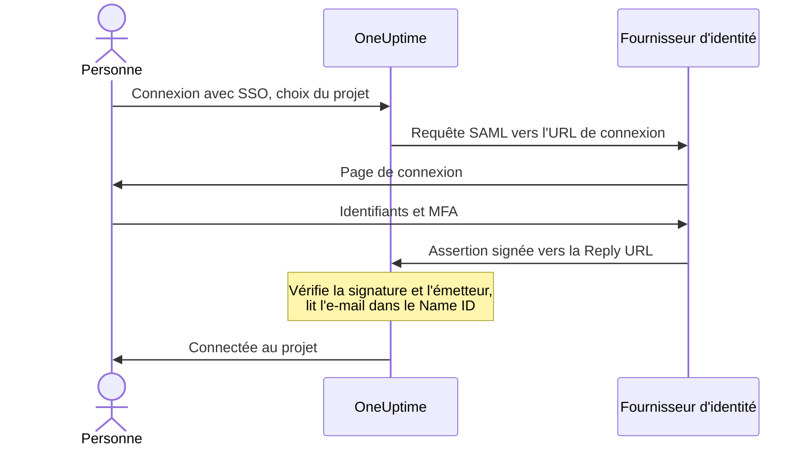

# SSO

L'authentification unique (SSO) permet aux personnes de votre projet de se connecter à OneUptime avec le fournisseur d'identité (IdP) de votre organisation, via SAML 2.0 ou OpenID Connect. Vous gérez les accès, les mots de passe et l'authentification multifacteur en un seul endroit, et vous pouvez exiger le SSO pour tout le monde dans le projet.

> [!NOTE]
> **Édition :** le SSO, y compris "Require SSO for login", fait partie de toutes les éditions d'OneUptime : les installations auto-hébergées l'obtiennent dans la Community Edition, sans licence. Sur OneUptime Cloud, il est disponible à partir du plan **Scale**. Consultez [Édition Enterprise](/docs/self-hosted/enterprise) pour voir ce que comprend chaque édition.

:::cards
- [Configurer un fournisseur SAML](#configurer-le-sso): Le créer dans OneUptime et donner deux URL à votre IdP.
- [Guides des fournisseurs d'identité](#guides-des-fournisseurs-didentité): Keycloak, Microsoft Entra ID et Okta, étape par étape.
- [OpenID Connect](#openid-connect-oidc): Se connecter plutôt via une application OIDC.
- [Exiger le SSO](#exiger-le-sso-pour-votre-projet): Faire du SSO le seul moyen d'entrer dans le projet.
:::

## Fonctionnement de la connexion SAML

Un fournisseur SAML relie un projet à une application de votre fournisseur d'identité. La personne qui se connecte choisit le projet sur la page **Connexion avec SSO** d'OneUptime, se connecte auprès de votre IdP et revient connectée.



OneUptime ne lit que quelques éléments de l'assertion envoyée par votre IdP :

| Dans l'assertion | Ce qu'OneUptime en fait |
| --- | --- |
| Signature | La vérifie avec le **Certificat public** du fournisseur. La réponse doit être signée et ne doit pas être chiffrée. |
| Issuer | Doit correspondre exactement à l'**Émetteur** du fournisseur. |
| Name ID | L'adresse e-mail de la personne. Ce doit être une adresse e-mail valide. |
| `http://schemas.microsoft.com/identity/claims/displayname` | Le nom de la personne, utilisé quand OneUptime crée son compte. Facultatif. |

Les personnes qui se connectent pour la première fois rejoignent les **Équipes** du fournisseur, qui décident de ce qu'elles peuvent faire : voir [Rôles et équipes des utilisateurs SSO](#rôles-et-équipes-des-utilisateurs-sso).

> [!NOTE]
> Sur OneUptime Cloud, la première fois qu'une personne se connecte au projet avec l'un de ses fournisseurs SAML ou OIDC, OneUptime lui envoie un lien par e-mail au lieu de la connecter. Elle l'ouvre, confirme que l'authentification unique du projet peut la connecter, puis poursuit la connexion. Le lien est valable 24 heures. Cela se produit une fois par projet, et de nouveau si la personne quitte le projet puis revient. Les installations auto-hébergées connectent les personnes immédiatement.

## Configurer le SSO

Vous avez besoin de l'autorisation d'ajouter des fournisseurs SSO — **Project Owner**, **Project Admin** ou **Create Project SSO** — et, sur OneUptime Cloud, du plan **Scale**. Pour le côté de votre fournisseur d'identité, consultez les [guides des fournisseurs d'identité](#guides-des-fournisseurs-didentité).

:::steps
1. **Ouvrir les paramètres du projet**

   - Ouvrez votre projet OneUptime
   - Allez dans **Paramètres du projet** > **Sécurité** > **SSO**

2. **Créer la configuration SSO**

   - Cliquez sur **Créer : SSO**
   - Saisissez un **Nom** pour la configuration SSO (par exemple "Keycloak SAML" ou "Okta SAML")
   - Saisissez l'**URL de connexion** fournie par votre fournisseur d'identité
   - Saisissez l'**Émetteur** (Entity ID) fourni par votre fournisseur d'identité
   - Collez le **Certificat public** fourni par votre fournisseur d'identité
   - À l'étape **Connexion**, **Équipes** commence par l'équipe des membres de votre projet : les personnes qui se connectent pour la première fois rejoignent ces équipes. Seules les équipes dans lesquelles vous pourriez inviter quelqu'un sont acceptées : une équipe qui donne plus d'accès que vous n'en avez est signalée sous **Équipes**
   - Tout le reste est prérempli sous **Plus de champs** : la **Méthode de signature** (`RSA-SHA256`), la **Méthode de hachage** (`SHA256`) et une description ("Sign in with" suivi du nom). Ne les modifiez que si votre fournisseur d'identité l'exige

3. **Récupérer les métadonnées SSO d'OneUptime**
   - L'enregistrement ouvre la boîte de dialogue **SSO Configuration**. Vous pouvez la rouvrir avec le bouton **Voir la configuration SSO**
   - Copiez l'**Identifiant (Entity ID)**, par exemple `https://oneuptime.com/<project-id>/<provider-id>` — il est nécessaire dans la configuration de votre IdP
   - Copiez la **Reply URL (Assertion Consumer Service URL)**, par exemple `https://oneuptime.com/identity/idp-login/<project-id>/<provider-id>` — elle est nécessaire dans la configuration de votre IdP
   - Un nouveau fournisseur est désactivé au départ. Une fois que votre IdP a ces deux valeurs, modifiez le fournisseur et activez **Activé**

4. **Tester le fournisseur**
   - Ouvrez le lien de la carte **Test Single Sign On (SSO)** et choisissez le fournisseur sur la page qui s'ouvre. Vous êtes redirigé vers la page de connexion de votre fournisseur d'identité, puis revenez sur OneUptime, connecté
   - Une fois que cela fonctionne, vous pouvez [exiger le SSO](#exiger-le-sso-pour-votre-projet) pour le projet
:::

## Guides des fournisseurs d'identité

Choisissez votre fournisseur d'identité. Chaque guide récupère les valeurs de l'IdP, crée le fournisseur dans OneUptime, puis donne à l'IdP l'**Identifiant (Entity ID)** et la **Reply URL** d'OneUptime.

:::tabs
@tab Keycloak
Keycloak est une solution open source répandue de gestion des identités et des accès. Il vous faut une instance Keycloak en fonctionnement avec un realm, et un accès administrateur à Keycloak et à OneUptime.

:::steps
1. **Rassembler les valeurs de votre realm**

   - **URL de connexion** : `https://<your-keycloak-domain>/auth/realms/<your-realm>/protocol/saml`
   - **Émetteur** : `https://<your-keycloak-domain>/auth/realms/<your-realm>`
   - **Certificat** : le certificat de signature du realm. Ouvrez `https://<your-keycloak-domain>/auth/realms/<your-realm>/protocol/saml/descriptor` et copiez la valeur `X509Certificate`, ou ouvrez **Realm settings** > **Keys** et cliquez sur **Certificate** pour la clé RS256

   Keycloak 17 et les versions suivantes servent ces URL sans le préfixe `/auth`. Placez le certificat entre ses propres lignes, comme ceci :

   ```text
   -----BEGIN CERTIFICATE-----
   MIICnzCCAYcCBgFyPZ8QFzANBgkqhkiG.......
   -----END CERTIFICATE-----
   ```

2. **Créer le fournisseur dans OneUptime**

   Allez dans **Paramètres du projet** > **Sécurité** > **SSO**, cliquez sur **Créer : SSO** et renseignez :
   - **Nom** : un nom descriptif (par exemple `my-project-oneuptime`)
   - **URL de connexion** et **Émetteur** : les valeurs ci-dessus
   - **Certificat public** : le certificat, entre ses propres lignes `BEGIN CERTIFICATE` et `END CERTIFICATE`
   - **Méthode de signature** et **Méthode de hachage** : déjà définies sous **Plus de champs** (`RSA-SHA256` et `SHA256`)

   Enregistrez, puis copiez l'**Identifiant (Entity ID)** et la **Reply URL (Assertion Consumer Service URL)** depuis la boîte de dialogue qui s'ouvre.

3. **Créer le client Keycloak**

   Dans Keycloak, ouvrez **Clients** dans votre realm et créez un client, ou modifiez-en un existant :
   - **Client Protocol** (type de client) : `saml`
   - **Client ID** : l'**Identifiant (Entity ID)** d'OneUptime
   - **Root URL** et **Valid Redirect URIs** : votre URL OneUptime
   - **Assertion Consumer Service POST Binding URL** : la **Reply URL (Assertion Consumer Service URL)** d'OneUptime

4. **Ajuster les paramètres du client**

   - Réglez **Name ID Format** sur `email` et activez **Force Name ID Format**, pour que Keycloak envoie toujours l'e-mail comme Name ID
   - Dans l'onglet **Keys** du client, désactivez **Client signature required** (dans **Signing keys config**) : OneUptime ne signe pas ses requêtes

5. **Activer le fournisseur et le tester**

   Dans OneUptime, modifiez le fournisseur et activez **Activé**, puis ouvrez le lien de la carte **Test Single Sign On (SSO)** et choisissez le fournisseur. Vous devez être redirigé vers la page de connexion Keycloak, puis revenir sur OneUptime.
:::
@tab Microsoft Entra ID
Microsoft Entra ID (anciennement Azure AD / Active Directory) est le service d'identité cloud de Microsoft. Il vous faut un tenant qui prend en charge les applications d'entreprise avec le SSO SAML, et un accès administrateur à Entra ID et à OneUptime.

:::steps
1. **Créer une application d'entreprise dans Entra ID**

   - Connectez-vous au [Microsoft Entra admin center](https://entra.microsoft.com)
   - Allez dans **Identity** > **Applications** > **Enterprise applications**, cliquez sur **+ New application**, puis sur **+ Create your own application**
   - Saisissez un nom (par exemple "OneUptime"), sélectionnez **Integrate any other application you don't find in the gallery (Non-gallery)** et cliquez sur **Create**

2. **Copier les valeurs SAML d'Entra ID**

   - Dans l'application, allez dans **Single sign-on** et sélectionnez **SAML**
   - Dans **SAML Certificates**, téléchargez le **Certificate (Base64)**, ouvrez le fichier dans un éditeur de texte et copiez son contenu
   - Dans **Set up OneUptime**, copiez la **Login URL** et le **Microsoft Entra Identifier** (**Azure AD Identifier** dans les anciens tenants)

3. **Créer le fournisseur dans OneUptime**

   Allez dans **Paramètres du projet** > **Sécurité** > **SSO**, cliquez sur **Créer : SSO** et renseignez :
   - **Nom** : un nom descriptif (par exemple `Azure AD SAML`)
   - **URL de connexion** : la **Login URL**
   - **Émetteur** : le **Microsoft Entra Identifier**
   - **Certificat public** : le certificat Base64, y compris les lignes `BEGIN CERTIFICATE` et `END CERTIFICATE`
   - **Méthode de signature** et **Méthode de hachage** : déjà définies sous **Plus de champs** (`RSA-SHA256` et `SHA256`)

   Enregistrez, puis copiez l'**Identifiant (Entity ID)** et la **Reply URL (Assertion Consumer Service URL)** depuis la boîte de dialogue qui s'ouvre.

4. **Donner à Entra ID les URL d'OneUptime**

   Dans **Basic SAML Configuration**, cliquez sur **Edit** et définissez :
   - **Identifier (Entity ID)** : l'**Identifiant (Entity ID)** d'OneUptime
   - **Reply URL (Assertion Consumer Service URL)** : la **Reply URL** d'OneUptime

   Cliquez sur **Save**.

5. **Envoyer l'e-mail comme Name ID**

   Dans **Attributes & Claims**, cliquez sur **Edit** :
   - Réglez **Unique User Identifier (Name ID)** sur l'adresse e-mail de l'utilisateur : `user.mail`, ou `user.userprincipalname` lorsque c'est l'adresse e-mail
   - Réglez le **Name identifier format** sur `Email address`
   - Ajoutez éventuellement une revendication nommée `http://schemas.microsoft.com/identity/claims/displayname` avec l'attribut source `user.displayname`, pour que les nouveaux comptes reçoivent le nom de la personne. OneUptime ignore les autres revendications

6. **Attribuer des utilisateurs et des groupes**

   Dans **Users and groups** de l'application, cliquez sur **+ Add user/group**, sélectionnez les utilisateurs et les groupes qui doivent avoir accès au SSO, puis cliquez sur **Assign**.

7. **Activer le fournisseur et le tester**

   Dans OneUptime, modifiez le fournisseur et activez **Activé**, puis ouvrez le lien de la carte **Test Single Sign On (SSO)** et choisissez le fournisseur. Vous devez être redirigé vers la page de connexion Microsoft, puis revenir sur OneUptime.
:::
@tab Okta
Okta est une plateforme d'identité largement utilisée qui prend en charge le SSO SAML. Il vous faut une organisation Okta avec un accès administrateur, et un accès administrateur à OneUptime.

:::steps
1. **Créer une application SAML dans Okta**

   - Dans l'Okta Admin Console, allez dans **Applications** > **Applications** et cliquez sur **Create App Integration**
   - Sélectionnez **SAML 2.0** et cliquez sur **Next**, saisissez "OneUptime" comme **App name** et cliquez sur **Next**
   - Okta demande les URL d'OneUptime avant d'afficher les siennes. Pour l'instant, saisissez votre adresse OneUptime (par exemple `https://oneuptime.com`) comme **Single sign-on URL** et comme **Audience URI (SP Entity ID)** : vous remplacerez les deux à l'étape 4
   - Réglez **Name ID format** sur `EmailAddress` et **Application username** sur `Email`
   - Cliquez sur **Next**, sélectionnez **I'm an Okta customer adding an internal app** et cliquez sur **Finish**

2. **Copier les valeurs SAML d'Okta**

   Dans l'onglet **Sign On** de l'application, sous **SAML Signing Certificates**, repérez le certificat actif :
   - Cliquez sur **Actions** > **View IdP metadata**, puis copiez l'**URL de connexion** (Identity Provider Single Sign-On URL) et l'**Émetteur** (Identity Provider Issuer)
   - Cliquez sur **Actions** > **Download certificate**, ouvrez le fichier `.cert` dans un éditeur de texte et copiez son contenu

3. **Créer le fournisseur dans OneUptime**

   Allez dans **Paramètres du projet** > **Sécurité** > **SSO**, cliquez sur **Créer : SSO** et renseignez :
   - **Nom** : un nom descriptif (par exemple `Okta SAML`)
   - **URL de connexion** et **Émetteur** : les valeurs d'Okta
   - **Certificat public** : le certificat, y compris les lignes `BEGIN CERTIFICATE` et `END CERTIFICATE`
   - **Méthode de signature** et **Méthode de hachage** : déjà définies sous **Plus de champs** (`RSA-SHA256` et `SHA256`)

   Enregistrez, puis copiez l'**Identifiant (Entity ID)** et la **Reply URL (Assertion Consumer Service URL)** depuis la boîte de dialogue qui s'ouvre.

4. **Donner à Okta les URL d'OneUptime**

   Dans l'onglet **General** de l'application, cliquez sur **Edit** dans **SAML Settings**, puis sur **Next**, et définissez :
   - **Single sign-on URL** : la **Reply URL (Assertion Consumer Service URL)** d'OneUptime
   - **Audience URI (SP Entity ID)** : l'**Identifiant (Entity ID)** d'OneUptime

   Ajoutez éventuellement une déclaration d'attribut nommée `http://schemas.microsoft.com/identity/claims/displayname` avec la valeur `user.firstName + " " + user.lastName`, pour que les nouveaux comptes reçoivent le nom de la personne. Cliquez sur **Next**, puis sur **Finish**.

5. **Attribuer des personnes**

   Dans l'onglet **Assignments**, cliquez sur **Assign** > **Assign to People** ou **Assign to Groups**, sélectionnez qui obtient l'accès SSO, cliquez sur **Assign** pour chacun, puis sur **Done**.

6. **Activer le fournisseur et le tester**

   Dans OneUptime, modifiez le fournisseur et activez **Activé**, puis ouvrez le lien de la carte **Test Single Sign On (SSO)** et choisissez le fournisseur. Vous devez être redirigé vers la page de connexion Okta, puis revenir sur OneUptime.
:::
@tab Autre
Le SSO d'OneUptime utilise SAML 2.0 et fonctionne avec tout fournisseur d'identité conforme :

:::steps
1. Récupérez l'**URL de connexion** (son point de terminaison SSO), l'**Émetteur** (son Entity ID) et le **Certificat public** (son certificat de signature X.509) de votre fournisseur d'identité. Si votre IdP ne les affiche qu'une fois une application créée, créez l'application avec votre adresse OneUptime comme URL provisoires.
2. Dans OneUptime, créez le fournisseur avec ces valeurs, puis copiez l'**Identifiant (Entity ID)** et la **Reply URL (Assertion Consumer Service URL)** depuis la boîte de dialogue **SSO Configuration** (ou **Voir la configuration SSO**).
3. Dans l'application SAML de votre fournisseur d'identité, définissez l'**Assertion Consumer Service URL / Reply URL** et l'**Entity ID / Audience URI** sur les valeurs d'OneUptime, et le **Name ID Format** sur l'adresse e-mail.
4. La **Méthode de signature** (`RSA-SHA256`) et la **Méthode de hachage** (`SHA256`) sont déjà définies sous **Plus de champs** ; ne les modifiez que si votre fournisseur d'identité signe autrement
5. Activez **Activé** pour le fournisseur, puis testez-le avec le lien de la carte **Test Single Sign On (SSO)**.
:::
:::

## OpenID Connect (OIDC)

Un projet peut aussi se connecter via un fournisseur OpenID Connect, comme Google Workspace, Okta, Microsoft Entra ID, Auth0 ou Keycloak. Vous avez besoin de l'autorisation d'ajouter des fournisseurs OIDC (**Project Owner**, **Project Admin** ou **Create Project OIDC**) et, sur OneUptime Cloud, du plan **Scale**.

:::steps
1. Enregistrez auprès de votre fournisseur d'identité une application (un client OIDC) autorisée à utiliser le flux authorization code avec PKCE, et copiez son **URL de l'émetteur**, son **ID client** et son **Secret client**.
2. Dans OneUptime, allez dans **Paramètres du projet** > **Sécurité** > **OIDC** et cliquez sur **Créer : OIDC**.
3. Saisissez un **Nom** (ce que les personnes voient sur la page de connexion), l'**URL de l'émetteur**, l'**ID client** et le **Secret client**. Vous pouvez aussi coller l'URL de découverte du fournisseur dans **URL de l'émetteur**.
4. À l'étape **Connexion**, **Équipes** commence par l'équipe des membres de votre projet : les personnes qui se connectent pour la première fois rejoignent ces équipes. Tout le reste est prérempli sous **Plus de champs** : l'**URL de découverte** (l'émetteur suivi de `/.well-known/openid-configuration`), les **Portées** (`openid email profile`), les noms de revendications `email` et `name`, et une description ("Sign in with" suivi du nom). Ne les modifiez que si votre fournisseur l'exige. Seules les équipes dans lesquelles vous pourriez inviter quelqu'un sont acceptées : une équipe qui donne plus d'accès que vous n'en avez est signalée sous **Équipes**.
5. Enregistrez. La boîte de dialogue **Configuration OIDC** s'ouvre avec la **Redirect URI** : ajoutez-la aux URI de redirection autorisées de votre application. Un nouveau fournisseur est désactivé au départ : modifiez-le ensuite et activez **Activé**.
6. Utilisez le lien de la carte **Test OpenID Connect (OIDC)** pour vous connecter via le fournisseur avant d'exiger le SSO pour le projet.
:::

## Rôles et équipes des utilisateurs SSO

OneUptime ne reprend pas les rôles ni les groupes de votre fournisseur d'identité. Ce qu'une personne peut faire dépend des équipes dont elle fait partie : un fournisseur ajoute les nouveaux venus à ses **Équipes**, et vous gérez les équipes et leurs autorisations dans OneUptime, comme le décrit [Utilisateurs, équipes et autorisations](/docs/permissions/index). Pour garder l'appartenance aux équipes alignée sur votre fournisseur d'identité, utilisez [SCIM](/docs/identity/scim).

Les équipes d'un fournisseur décident de ce que peuvent faire les personnes qui se connectent avec lui ; un fournisseur n'est donc enregistré qu'avec des équipes dans lesquelles la personne qui l'enregistre pourrait inviter quelqu'un. Chaque enregistrement les vérifie de nouveau : un fournisseur dont les équipes donnent plus d'accès que vous n'en avez ne peut être modifié que par quelqu'un dont l'accès les couvre, comme un propriétaire du projet. Les fournisseurs enregistrés avant cette vérification continuent de connecter les personnes à leurs équipes. Toute personne autorisée à modifier un fournisseur peut toujours le désactiver, afin de pouvoir l'arrêter immédiatement.

## Exiger le SSO pour votre projet

Configurer un fournisseur n'empêche personne de se connecter avec un mot de passe. Pour faire du SSO le seul moyen d'entrer dans le projet, utilisez l'interrupteur **Exiger le SSO pour la connexion** dans **Paramètres du projet** > **Sécurité** > **SSO**, sous vos fournisseurs :

:::steps
1. Testez d'abord votre fournisseur avec le lien de la carte **Test Single Sign On (SSO)**.
2. Activez **Exiger le SSO pour la connexion**. OneUptime demande confirmation avant d'enregistrer quoi que ce soit : à partir de ce moment, tout le monde dans le projet, vous compris, doit se connecter avec le SSO pour l'ouvrir, et toute personne connectée avec un mot de passe est exclue du projet jusqu'à ce qu'elle se connecte avec le SSO.
3. Cliquez sur **Exiger le SSO** pour confirmer. L'interrupteur enregistre immédiatement ; il n'y a pas de bouton d'enregistrement séparé.
:::

Pour activer **Exiger le SSO pour la connexion**, il faut un fournisseur qui connecte des personnes au projet : l'un de ses propres fournisseurs SAML ou OIDC activé, ou un fournisseur global activé qui connecte des personnes à ce projet. Sans fournisseur, OneUptime refuse et indique d'activer d'abord un fournisseur pour le projet et de le tester. Si vous choisissez un fournisseur que le projet exige, ce doit être l'un d'eux, et la même vérification a lieu lorsque vous exigez plus tard un autre fournisseur.

Un enregistrement qui envoie **Exiger le SSO pour la connexion** activé alors qu'il l'est déjà, ou qui nomme le fournisseur déjà exigé par le projet, est vérifié de la même façon — l'API, Terraform et d'autres outils envoient souvent tous les paramètres à chaque enregistrement. Ainsi, tant que le projet n'a aucun fournisseur qui connecte des personnes, ou si le fournisseur exigé a été désactivé depuis, un tel enregistrement est refusé avec les mêmes mots, quoi qu'il modifie par ailleurs : activez d'abord un fournisseur, exigez-en un autre ou désactivez **Exiger le SSO pour la connexion**.

Un nouveau projet est soumis à la même règle. Il n'a pas encore de fournisseur à lui ; le créer avec **Exiger le SSO pour la connexion** déjà activé — seul un administrateur principal (master admin) le peut — nécessite donc un fournisseur global activé qui connecte des personnes à tous les projets, et la création est refusée avec les mêmes mots sans lui. Créez le projet, configurez et testez son fournisseur, puis activez l'interrupteur.

Tant que tout le serveur exige le SSO (**Admin** > **Paramètres** > **Authentification** > **Exiger le SSO pour la connexion**), la création de tout projet nécessite aussi un tel fournisseur global, sinon personne, pas même la personne qui l'a créé, ne pourrait ouvrir le projet. Sans lui, la création d'un projet est refusée, et le message demande à un administrateur du serveur d'en activer un. Les administrateurs principaux peuvent toujours créer des projets.

Désactiver **Exiger le SSO pour la connexion** enregistre dès que vous basculez l'interrupteur et laisse immédiatement les membres revenir avec leur mot de passe — sauf si quelqu'un le réactive au même instant ; un serveur d'application peut alors mettre jusqu'à une minute à suivre. Les propriétaires et les administrateurs du projet, ainsi que les membres disposant de l'autorisation **Edit Project**, peuvent le modifier ; les autres voient l'interrupteur verrouillé, avec l'autorisation qu'il leur faudrait.

> [!NOTE]
> Sur OneUptime Cloud, exiger le SSO nécessite le plan **Scale**, et le désactiver fonctionne avec tous les plans. En dessous de Scale, **Paramètres du projet** > **Sécurité** > **SSO** affiche l'offre de mise à niveau du plan ; un projet qu'un essai Scale a laissé en exigeant le SSO y trouve aussi **Exiger le SSO pour la connexion**, sous l'offre, afin de pouvoir le désactiver. Le réactiver nécessite **Scale**.

## Désactiver ou supprimer un fournisseur

| Ce que vous modifiez | Les personnes qui se sont connectées avec le fournisseur |
| --- | --- |
| Le désactiver ou le supprimer | Se reconnectent avec le SSO à leur prochaine requête, là où le SSO est exigé |
| Un nouveau certificat ou secret client, d'autres URL, un nouveau nom ou d'autres équipes | Restent connectées |
| L'activer | Peuvent se connecter avec lui immédiatement |

Désactiver ou supprimer un fournisseur SAML ou OIDC met fin aux connexions qu'il a accordées. Dans un projet qui exige le SSO, lui-même ou parce que tout le serveur l'exige :

- Toute personne qui s'est connectée avec lui doit se reconnecter avec le SSO à sa prochaine requête, et les pages qu'elle a ouvertes cessent aussitôt de recevoir les mises à jour en direct.
- Un client MCP qu'une personne a connecté après s'être connectée avec lui cesse de fonctionner dans le projet. Reconnectez-le après vous être connecté avec le SSO.
- Réactiver le fournisseur ne rétablit pas ces connexions : les personnes se reconnectent avec lui.

Modifier tout autre élément d'un fournisseur laisse tout le monde connecté : un nouveau certificat ou secret client, d'autres URL, un nouveau nom ou d'autres équipes. Leurs connexions ont été vérifiées au moment où elles ont eu lieu, et la connexion suivante utilise les nouveaux paramètres.

Tant que le projet exige le SSO, OneUptime garde un moyen d'y entrer : vous ne pouvez ni désactiver ni supprimer le dernier fournisseur avec lequel les personnes peuvent se connecter au projet, en comptant les fournisseurs globaux qui y connectent des personnes, ni le fournisseur que le projet exige. Désactivez d'abord **Exiger le SSO pour la connexion**.

Activer un fournisseur permet de se connecter avec lui immédiatement.

Quand tout le serveur exige le SSO (**Admin** > **Paramètres** > **Authentification** > **Exiger le SSO pour la connexion**), chaque projet garde de la même façon un moyen d'y entrer, même un projet qui n'exige pas le SSO lui-même : activez d'abord un autre fournisseur pour lui.

Les fournisseurs globaux sont soumis à la même règle : une modification de l'un d'eux, ou de ses projets attachés, qui laisserait sans fournisseur un projet exigeant le SSO est refusée, en nommant le projet. Consultez [SSO global](/docs/identity/global-sso#désactiver-ou-supprimer-un-fournisseur).

Là où ni le projet ni le serveur n'exigent le SSO, désactiver un fournisseur bloque les nouvelles connexions avec lui. Les personnes déjà connectées le restent, comme celles qui se sont connectées avec un mot de passe.

## Fournisseurs conservés sous le plan Scale

Un fournisseur SAML ou OIDC qu'un projet possède encore continue de connecter des personnes après la fin d'un essai Scale ou une rétrogradation du plan. C'est pourquoi, en dessous de Scale, les pages **SSO** et **OIDC** listent les fournisseurs du projet sous l'offre de mise à niveau (**Fournisseurs SAML encore configurés**, **Fournisseurs OIDC encore configurés**) :

- **Désactiver** arrête un fournisseur immédiatement. OneUptime demande d'abord confirmation.
- **Supprimer** le retire.

Ajouter un fournisseur, en modifier un ou le réactiver nécessite **Scale**. Les personnes autorisées sont les mêmes qu'avec Scale : désactiver un fournisseur nécessite l'autorisation de le modifier, le supprimer l'autorisation de le supprimer.

Tant que le projet exige encore le SSO, ses pages **SSO** et **OIDC** affichent aussi **Exiger le SSO pour la connexion** : désactivez-le avant de désactiver le dernier fournisseur. D'ici là, le dernier fournisseur avec lequel les personnes peuvent se connecter ne peut être ni désactivé ni supprimé, pour que personne ne soit exclu du projet.

Les pages **SSO** et **OIDC** d'une page de statut listent ses propres fournisseurs de la même façon. Tant que la page de statut exige encore le SSO, les deux pages affichent aussi **Exiger le SSO pour la connexion** : désactivez-le avant de désactiver ses fournisseurs, sinon ses utilisateurs privés ne pourront plus se connecter du tout.

## Dépannage

:::details "SSO Config not found"
Le fournisseur est désactivé, ou le lien concerne un fournisseur qui n'existe plus. Un nouveau fournisseur est désactivé au départ : modifiez-le et activez **Activé**.
:::

:::details "No teams added."
La personne ne fait pas encore partie du projet, et le fournisseur n'a aucune **Équipes** où l'ajouter. Modifiez le fournisseur et choisissez au moins une équipe, comme l'équipe des membres de votre projet.
:::

:::details "Issuer URL does not match"
L'émetteur figurant dans l'assertion de votre IdP n'est pas l'**Émetteur** du fournisseur. Copiez-le de nouveau depuis votre IdP — l'URL du realm Keycloak, le **Microsoft Entra Identifier** ou l'Identity Provider Issuer d'Okta — pour que les deux correspondent exactement.
:::

:::details La connexion échoue avec une erreur de signature ou de certificat
Collez le certificat de signature actuel de l'IdP dans **Certificat public**, y compris les lignes `BEGIN CERTIFICATE` et `END CERTIFICATE`. Pour Entra ID, téléchargez le certificat **Base64**, pas le certificat brut ; pour Okta, le certificat de signature actif ; pour Keycloak, le certificat du bon realm.
:::

:::details "Encrypted SAML Responses are not supported"
OneUptime ne déchiffre pas les assertions. Désactivez le chiffrement des assertions pour l'application dans votre IdP, afin qu'il envoie une assertion signée et non chiffrée.
:::

:::details "SAML response did not include a valid email address"
OneUptime lit l'adresse e-mail dans le Name ID. Réglez le Name ID sur l'e-mail de l'utilisateur : **Name ID Format** `email` avec **Force Name ID Format** dans Keycloak, l'**Unique User Identifier (Name ID)** dans Entra ID, ou **Name ID format** `EmailAddress` et **Application username** `Email` dans Okta. L'adresse doit correspondre au compte OneUptime de la personne.
:::

:::details Entra ID : AADSTS700016
L'**Identifier (Entity ID)** dans Entra ID ne correspond pas à celui d'OneUptime. Copiez-le de nouveau depuis **Voir la configuration SSO** ; les deux valeurs doivent être identiques.
:::

:::details Okta : 404, ou une audience qui ne correspond pas
La **Single sign-on URL** dans Okta doit être exactement la **Reply URL** d'OneUptime, et l'**Audience URI** exactement l'**Identifiant (Entity ID)** d'OneUptime. Vérifiez que les deux ont remplacé les valeurs provisoires.
:::

:::details L'utilisateur n'est pas attribué à l'application
Entra ID et Okta ne connectent que les personnes attribuées à l'application. Attribuez l'utilisateur, ou un groupe dont il fait partie.
:::

:::details Keycloak : boucle de redirection
Vérifiez que **Valid Redirect URIs** et **Assertion Consumer Service POST Binding URL** sont définis comme ci-dessus, sur le client du bon realm.
:::

## Étapes suivantes

:::cards
- [SSO global](/docs/identity/global-sso): Un seul fournisseur d'identité pour tous les projets d'une instance auto-hébergée.
- [SCIM](/docs/identity/scim): Laisser votre fournisseur d'identité ajouter et retirer des personnes automatiquement.
- [Utilisateurs, équipes et autorisations](/docs/permissions/index): Ce que les équipes rejointes par les nouveaux venus leur permettent de faire.
:::
