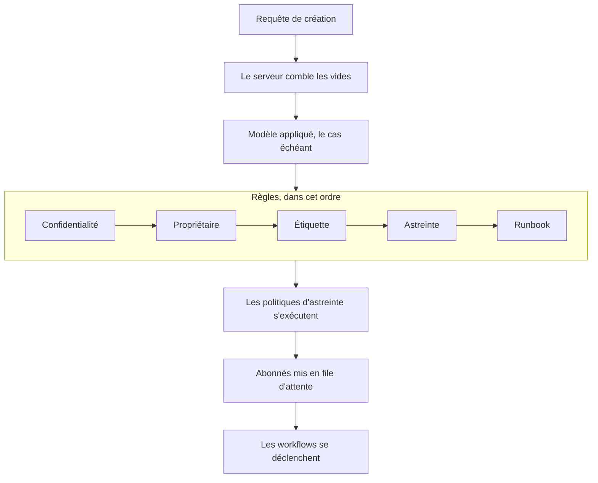

# Déclarer un incident

Déclarer un incident crée l'enregistrement à partir duquel votre équipe travaille : il reçoit un numéro, une gravité et un état de départ, ses politiques d'astreinte alertent des personnes, et — sauf indication contraire — les abonnés de la page de statut en sont informés. Cette page parcourt les cinq façons d'en déclarer un, champ par champ, et ce qui se passe dès qu'il existe.

:::cards
- [En déclarer un à la main](#en-déclarer-un-à-la-main): Le formulaire en trois étapes, champ par champ.
- [Déclarer à partir d'un modèle](#déclarer-à-partir-dun-modèle): Le même type d'incident, prérempli à chaque fois.
- [Déclarer depuis les critères d'un moniteur](#déclarer-automatiquement-depuis-les-critères-dun-moniteur): Laissez une vérification en échec l'ouvrir pour vous.
- [Déclarer par l'API](#déclarer-par-lapi): Depuis votre propre code, un script ou un autre outil.
:::

## Cinq façons de déclarer un incident

Un incident entre dans OneUptime de cinq façons, et toutes aboutissent au même endroit : une ligne de la table `Incident` avec une gravité, un état courant et une liste de ressources affectées. La seule différence est qui remplit les champs — vous à 3 h du matin, un modèle enregistré, les critères d'un moniteur, votre propre code qui appelle l'API, ou une personne extérieure à votre équipe qui remplit un formulaire.

| Si vous voulez…                                                   | Choisissez                                                                  |
| ----------------------------------------------------------------- | --------------------------------------------------------------------------- |
| Ouvrir un incident à la main, en remplissant tout                 | L'assistant **Déclarer un incident**                                        |
| Ouvrir un type d'incident récurrent avec les champs préremplis    | **Créer à partir d'un modèle**                                              |
| En ouvrir un automatiquement quand les vérifications d'un moniteur échouent | Un filtre de critères de moniteur avec **Lorsque les filtres correspondent, déclarer un incident.** |
| En ouvrir un depuis votre propre code, un script ou un autre outil | `POST /api/incident`                                                       |
| Laisser des personnes extérieures à votre équipe signaler un problème via un lien | Un [formulaire](/docs/forms/index)                                   |

Les cinq écrivent le même modèle, si bien qu'un incident ouvert par une sonde ressemble exactement à celui qu'un intervenant a ouvert à la main — à quelques colonnes de suivi près, que le serveur renseigne sur les incidents automatiques. Les intégrations l'écrivent aussi : [Huntress](/docs/integrations/huntress) ouvre un incident pour chaque rapport d'incident que son SOC envoie.

> [!TIP]
> Vous pouvez aussi déclarer un incident à partir d'alertes : **Déclarer un incident** dans une liste d'alertes, dans l'en-tête d'une alerte ou sur la page **Incidents liés** d'une alerte ouvre le même assistant, prérempli à partir des alertes, et les lie au nouvel incident. Une case du formulaire, cochée par défaut, prend aussi les alertes en compte, pour qu'elles cessent d'escalader. Voir [Alertes liées](/docs/incidents/linked-alerts).

## En déclarer un à la main

Le formulaire **Déclarer un nouvel incident** demande un incident en trois étapes — **Détails de l'incident**, **Ressources affectées** et **Astreinte et rôles** — puis affiche un récapitulatif à relire. Quand votre projet demande certains de ses champs personnalisés d'incident à la création, une quatrième étape, **Détails**, vient juste après **Ressources affectées**.

:::steps
1. Ouvrez **Incidents → Tous les incidents** et cliquez sur **Déclarer un incident** en haut à droite de la liste **Incidents**. Le formulaire s'ouvre sur **Détails de l'incident**.
2. Saisissez un **Titre** et choisissez une **Gravité de l'incident**. Le reste du formulaire est facultatif.
3. Cliquez sur **Suivant** pour parcourir les étapes restantes, en remplissant ce que vous savez déjà : moniteurs et autres ressources, politiques d'astreinte, rôles.
4. Relisez le récapitulatif et cliquez sur **Déclarer un incident**. Vous arrivez sur le nouvel incident, et son **Fil d'activité de l'incident** commence à enregistrer.
:::

Seule la première étape a des champs obligatoires, plus tout champ personnalisé que vos administrateurs ont marqué **Obligatoire à la création**, que l'étape **Détails** demande. Chaque étape avant le récapitulatif a un simple bouton **Suivant**, et **Déclarer un incident** se trouve sur le récapitulatif, la dernière étape. Si vous êtes pressé, remplissez **Détails de l'incident** et appuyez sur **Suivant** pour les autres étapes sans les remplir : rattacher des ressources, ajouter des politiques d'astreinte et attribuer des rôles peuvent aussi attendre les pages de l'incident. Appuyer sur **Entrée** dans un champ fait aussi avancer ; cela ne déclare jamais avant le récapitulatif.

> [!TIP]
> Les options dont la plupart des incidents n'ont jamais besoin attendent sous un en-tête **Plus de champs** à la fin de leur étape, replié ; cliquez dessus pour les ouvrir. Tant qu'il est replié, l'en-tête nomme ce qu'il contient et affiche chaque option définie, avec sa valeur — définie par un modèle, par exemple, ou par une alerte privée à partir de laquelle vous déclarez — et il s'ouvre de lui-même quand quelque chose à l'intérieur doit être corrigé. Le récapitulatif ne liste l'une de ces options que lorsqu'elle est définie — sauf **Notifier les abonnés de la page de statut**, qu'il liste toujours, avec qui sera notifié.

**Depuis la page d'une ressource.** **Déclarer un incident** dans l'onglet **Incidents** d'un moniteur, d'un hôte, d'un service, d'un cluster ou de la plupart des autres ressources ouvre le même formulaire avec cette ressource déjà choisie sous **Ressources affectées** : un titre et une gravité suffisent, et l'incident apparaît dans l'onglet d'où vous êtes parti.

:::details Quelles pages de ressource le proposent, et ce qu'elles choisissent
**Déclarer un incident** dans l'onglet **Incidents** d'un moniteur, d'un hôte, d'un cluster Kubernetes, Proxmox, Ceph ou Docker Swarm, d'un hôte Docker ou Podman, d'un vCenter, d'une baie de stockage, d'une flotte IoT, d'une base de données ou d'un service ouvre le même assistant avec cette ressource déjà choisie sous **Ressources affectées** (un moniteur sous **Moniteurs**, tout le reste sous **Autres ressources affectées**), avant tout ce qu'un modèle ajoute. **Créer à partir d'un modèle** dans cet onglet garde aussi la ressource. Le fil d'Ariane repasse par l'onglet de la ressource, et une fois l'incident déclaré, vous arrivez sur le nouvel incident, comme depuis la liste des incidents.

L'onglet **Incidents** d'un élément d'inventaire choisit l'hôte, le service ou le cluster Kubernetes vers lequel pointe l'élément, et le fil d'Ariane repasse par l'onglet de cette ressource. **Créer une alerte** dans l'onglet **Alertes** d'une ressource fonctionne de la même façon : depuis un moniteur, il remplit le **Moniteur** de l'alerte, depuis toute autre ressource, **Autres ressources affectées**.

La ressource est recherchée avec vos propres autorisations : si vous ne pouvez pas la lire, ou si elle a été supprimée, le formulaire s'ouvre simplement sans rien de choisi.
:::

### Étape 1 — Détails de l'incident

- **Titre** — obligatoire. Le résumé d'une ligne que tout le monde verra dans la liste, dans Slack et (si l'incident est visible) sur votre page de statut. Texte indicatif : `Incident Title`.
- **Gravité de l'incident** — obligatoire. L'une des gravités configurées pour votre projet ; les nouveaux projets sont créés avec **Critical Incident**, **Major Incident** et **Minor Incident**.
- **Description** — facultative, écrite en Markdown. C'est le champ qui s'affiche sur la page de statut, alors écrivez-le pour les clients plutôt que pour votre équipe. Une image que vous y placez est montrée à tout le monde tant que l'incident est visible sur les pages de statut, et seulement aux membres de votre projet tant qu'il est masqué. Vous pourrez la modifier plus tard depuis **Description** dans le menu latéral de l'incident.

Sous **Plus de champs** :

- **Déclaré le** — commence au moment où vous avez ouvert la page. C'est l'horodatage à partir duquel toutes les durées de l'incident sont mesurées ; antidatez-le donc si vous consignez quelque chose qui a commencé plus tôt.
- **État initial** — facultatif, et vide au départ. Laissé vide, l'incident démarre dans l'état marqué `isCreatedState`, que les nouveaux projets créent sous le nom **Identifié** — ou dans l'état initial du modèle, quand vous déclarez à partir d'un modèle. Ne choisissez un état ultérieur que si vous consignez un incident qui avait déjà dépassé ce stade, pris en compte ou résolu. Un tel incident n'alerte personne — voir [Déclaré déjà pris en compte ou résolu](#déclaré-déjà-pris-en-compte-ou-résolu).
- **Étiquettes** — facultatives. Les étiquettes regroupent les incidents liés pour que vous puissiez filtrer sur elles, et une équipe dont les autorisations sont limitées à des étiquettes ne voit que les incidents qui portent l'une de ses étiquettes.
- **Incident privé** — case à cocher, désactivée par défaut (`isPrivate`). Un incident privé n'est visible que de ses utilisateurs propriétaires, des membres de ses équipes propriétaires, des administrateurs et des propriétaires du projet — et il est masqué sur toutes les pages de statut, quel que soit tout autre réglage, y compris les pages de statut auxquelles il est limité. La liste des incidents les signale par une pastille rouge **Private**.

> [!NOTE]
> **Les alertes et les épisodes démarrent aussi dans l'état que vous choisissez.** **Créer une alerte**, et **Créer un épisode** dans les listes d'épisodes d'incident et d'alerte, ont le même **État initial** sous **Plus de champs**. Laissé vide, l'alerte ou l'épisode démarre dans l'état de création du projet. Choisissez un état ultérieur pour consigner une alerte ou un épisode déjà pris en compte ou résolu : il démarre dans cet état, sa chronologie d'état commence par lui, et un épisode consigné comme résolu compte immédiatement comme résolu. Ses propriétaires ne sont pas prévenus de ce premier état à part, et les abonnés de la page de statut d'un épisode d'incident en sont informés une fois, à la création de l'épisode. Une alerte ou un épisode consigné ainsi n'alerte personne, comme un incident : voir [Déclaré déjà pris en compte ou résolu](#déclaré-déjà-pris-en-compte-ou-résolu). Par l'API, le même choix se fait avec `currentAlertStateId` ou `currentIncidentStateId` — voir [Référence de l'API OneUptime](/docs/api-reference/api-reference).

:::details Écrire dans l'éditeur Markdown
La description — comme les notes, la cause racine, la remédiation et les champs personnalisés en texte enrichi — s'écrit dans l'éditeur Markdown. Il s'ouvre en mode visuel, qui montre le texte mis en forme ; **Markdown** dans sa barre d'outils passe en mode Markdown, qui montre la source Markdown, et **Visual** revient en arrière. Dans une liste, **Augmenter le retrait** et **Diminuer le retrait** dans sa barre d'outils, ou Tab et Maj+Tab, imbriquent un élément sous celui du dessus et le ressortent ; là où il n'y a rien sous quoi l'imbriquer, et en dehors d'une liste, Tab passe au champ suivant comme d'habitude. En mode visuel, **Bloc de code**, **Tableau** et **Liste de tâches** au milieu ou en fin de ligne coupent la ligne au curseur et placent le nouveau bloc sur ses propres lignes — au bord d'un mot en gras, d'un lien ou d'un code en ligne aussi, sans laisser de mise en forme vide derrière — et **Liste de tâches** dans un élément de liste ajoute sa tâche à la liste de cet élément plutôt que comme sous-tâche. En mode Markdown, **Bloc de code** et **Tableau** s'insèrent au curseur, alors commencez d'abord une nouvelle ligne pour eux, **Liste de tâches** transforme la ligne du curseur en tâche, et **Liste numérotée** numérote chaque niveau d'une liste imbriquée à partir de 1. La barre d'outils tient sur une ligne : les formulaires qui contiennent l'éditeur s'ouvrent dans une large boîte de dialogue, si bien que sur la plupart des écrans tous les boutons tiennent, et là où ce n'est pas le cas — sur un téléphone, ou dans une fenêtre étroite — les boutons qui ne tiennent pas se trouvent sous **Plus de mise en forme** (**⋯**) au bout de la barre d'outils, dans le même ordre, et chacun de ceux que vous y choisissez s'insère là où était le curseur. Sur les écrans les plus étroits, le bouton **Markdown** y passe aussi.

**Annuler.** En mode visuel, Ctrl+Z (Cmd+Z sur Mac) reprend vos modifications une à une, de la plus récente à la plus ancienne — ce que vous avez tapé comme les modifications de l'éditeur lui-même : un retrait augmenté ou diminué, un bloc qu'il a inséré dans une ligne, un collage mis en forme ou en bloc — et Ctrl+Maj+Z (Cmd+Maj+Z) ou Ctrl+Y les rétablit dans le même ordre. En mode Markdown, Ctrl+Z reprend un retrait augmenté ou diminué, la modification d'un bouton de liste et un collage mis en forme, mais pas ce que les boutons **Bloc de code**, **Tableau** et **Ligne horizontale** ont inséré.

**Y coller du contenu.** Coller depuis Word, Google Docs ou une page OneUptime — la description d'un autre incident, par exemple — conserve les listes et leur imbrication, les liens et la mise en forme, et les puces `•` collées deviennent une vraie liste. Les liens qui ne sont qu'une icône, comme l'ancre à côté d'un titre sur GitHub, sont laissés de côté. En mode visuel, du code ou une citation collés dans une ligne deviennent un bloc à part, qui coupe la ligne, et une liste collée dans un élément de liste rejoint la liste de cet élément au lieu de s'y imbriquer — collée dans l'élément vide que laisse Entrée, elle prend la place de cet élément — tandis qu'un bloc de code, une citation ou un tableau collés dans un élément y restent. En mode Markdown, ce que le collage transforme en blocs — du code, une citation, une liste, un titre, plusieurs paragraphes — se place sur ses propres lignes, avec une ligne vide de chaque côté, quand il arrive au milieu d'une ligne, et une liste collée en fin de ligne d'un élément de liste, ou après un `- ` seul, rejoint cette liste au niveau de retrait de l'élément ; du Markdown copié en texte brut s'insère au curseur exactement tel quel. Tout ce que vous collez dans un bloc de code reste exactement tel que vous l'avez copié. Coller par-dessus une sélection qui couvre plusieurs éléments, paragraphes ou cellules de tableau la remplace, comme le ferait la saisie. En mode visuel, un collage ou le bouton **Code** par-dessus des cellules de tableau conserve chaque cellule et chaque colonne, un collage ne laisse derrière lui ni puce, ni citation, ni bloc de code vides, et quand la sélection se termine dans un bloc de code, seule la fin de cette ligne de code rejoint le texte.

**Copier depuis une note.** Un bloc de code copié depuis une note ou une description se recolle en bloc de code dans son langage, tout comme une de ses lignes copiée avec son saut de ligne, comme la copie un triple clic dans Chrome, Edge et Safari. Un mot ou une partie de ligne copiés depuis un bloc de code se collent en code en ligne. Dans Chrome, Edge et Safari, les lignes copiées depuis une vue de code dessinée comme un tableau — l'onglet YAML d'une ressource Kubernetes, les frames de la pile d'appels d'une exception — se collent en texte brut, indentation conservée.
:::

### Étape 2 — Ressources affectées

Les moniteurs viennent en premier, à part, parce que les pages de statut voient un incident à travers ses moniteurs, et le statut que prennent les moniteurs se trouve juste en dessous.

- **Moniteurs** — un champ de recherche qui rattache les moniteurs touchés par l'incident ; son onglet **Étiquettes** ajoute d'un coup tous les moniteurs portant une étiquette. Une page de statut affiche un incident, et en notifie ses abonnés, quand elle liste l'un des moniteurs de l'incident : ce sont donc eux qui décident quelles pages de statut en sont informées (`monitors` sur l'incident).
- **Changer le statut du moniteur en** — facultatif, et affiché seulement une fois au moins un moniteur choisi. Choisit un statut de moniteur appliqué à chaque moniteur rattaché à cet incident, si bien que déclarer l'incident et marquer les moniteurs comme dégradés se fait en une seule action au lieu de deux. Déclarer à partir d'un modèle qui en définit un démarre avec le statut du modèle, affiché dès que vous choisissez un moniteur. Sans moniteur choisi, aucun statut n'est enregistré, pas même celui du modèle ; retirez le dernier moniteur et le champ disparaît jusqu'à ce que vous en choisissiez un autre, ce qui rétablit votre choix. Le statut d'un moniteur est partagé par toutes les pages de statut qui le listent ; avec des pages de statut choisies sous **Plus de champs**, le formulaire vous rappelle donc que le changement apparaît aussi sur les pages que vous n'avez pas choisies.
- **Autres ressources affectées** — un second champ de recherche pour tout le reste de ce que touche l'incident : hôtes, clusters Kubernetes, hôtes Docker et Podman, clusters Proxmox, Ceph et Docker Swarm, vCenters, baies de stockage, flottes IoT, bases de données et services — tout ce que propose, hors moniteurs, la carte **Ressources affectées** de l'incident. En coulisses, ce sont des relations distinctes sur l'incident (`hosts`, `kubernetesClusters`, `dockerHosts`, `podmanHosts`, `services` et d'autres), mais le formulaire les réunit dans un seul sélecteur.

Un moniteur peut indiquer ce qu'il surveille — **Moniteur → Vue d'ensemble → Ressources liées**, les mêmes types de ressources que **Autres ressources affectées**. Choisissez un tel moniteur et ce à quoi il est lié est ajouté aussitôt à **Autres ressources affectées**, et une ligne sous le champ nomme ce qui a été ajouté. Retirez ce que vous ne voulez pas avant de déclarer : rien n'est ajouté de nouveau pour ce moniteur tant que vous restez sur le formulaire, et retirer le moniteur laisse ce qu'il a ajouté. Il en va de même quand un moniteur vient d'un modèle ou de la page depuis laquelle vous déclarez, et sur **Créer une alerte** et **Schedule Maintenance**.

La carte **Ressources affectées** de l'incident pose les mêmes questions quand vous la modifiez plus tard : **Moniteurs**, **Changer le statut du moniteur en** dès qu'il y a un moniteur, puis **Autres ressources affectées**. Enregistrer un incident sans plus aucun moniteur garde le statut qu'il avait.

Sous **Plus de champs** :

- **Limiter à ces pages de statut** — facultatif. Laissé vide, l'incident s'affiche sur toutes les pages de statut qui listent ses moniteurs, et en notifie les abonnés. Choisissez des pages ici et seules les pages choisies parmi celles-ci sont utilisées ; l'onglet **Étiquettes** ajoute d'un coup toutes les pages portant une étiquette. Le formulaire vous avertit quand une page choisie ne liste aucun des moniteurs de l'incident, et quand l'incident est privé, ce qui le masque sur toutes les pages de statut. Voir [Une page de statut par public](/docs/status-pages/one-status-page-per-audience).
- **Notifier les abonnés de la page de statut** — case à cocher, activée par défaut. Contrôle si les abonnés sont notifiés de la création de l'incident (`shouldStatusPageSubscribersBeNotifiedOnIncidentCreated`). La replier sous **Plus de champs** ne change rien à ce qu'elle fait : elle démarre toujours cochée, et le récapitulatif la liste toujours. En dessous, et de nouveau sur le récapitulatif avant l'envoi, **Will notify** liste les pages de statut qui seront prévenues, avec un nombre d'abonnés « jusqu'à » par canal, ainsi que les pages qui ne le seront pas et pourquoi. Quand personne ne sera prévenu (aucun moniteur rattaché, aucune page de statut ne liste les moniteurs, ou les pages n'ont pas encore d'abonnés), il n'affiche rien, et n'avertit que lorsque la portée des pages de statut de l'incident en est la raison. Sur le récapitulatif, **Aperçu**, à côté de **Oui**, montre l'e-mail que recevront les abonnés de chacune de ces pages de statut, et **M'envoyer un test** l'envoie à l'adresse e-mail de votre propre compte ; voir [Abonnés et annonces](/docs/status-pages/subscribers#incidents). Désactivez-la pour du bruit interne que vous voulez tout de même consigner. L'incident reste alors silencieux par défaut : les nouvelles notes publiques qui le concernent, et la boîte de dialogue de changement d'état de sa page de vue d'ensemble (**Prendre en compte**, **Résoudre**, ou le choix d'un autre état), démarrent avec leur propre case **Notifier les abonnés de la page de statut** décochée. Le formulaire manuel de la page **Chronologie d'état** et l'action groupée **Modifier l'état** de la liste des incidents démarrent toujours avec la case cochée.

> [!IMPORTANT]
> **Rattachez des moniteurs même quand cela semble redondant.** Le lien entre un incident et une page de statut passe par les moniteurs de l'incident : une page de statut affiche un incident, et en notifie ses abonnés, quand l'une de ses ressources est l'un des moniteurs de l'incident. **Limiter à ces pages de statut** ne peut que restreindre cette liste, jamais l'élargir, et une page de statut avec **Afficher uniquement les incidents limités à cette page** activé n'affiche que les incidents qui lui sont limités. Un incident sans moniteur rattaché ne notifie absolument aucun abonné de page de statut. Voir [Ressources et groupes de la page de statut](/docs/status-pages/resources-and-groups).

L'indicateur **Should be visible on status page?** (`isVisibleOnStatusPage`) n'est pas dans l'assistant ; il vaut true par défaut. Modifiez-le ensuite depuis **Paramètres** dans le menu latéral de l'incident, où il s'appelle **Visible sur la page de statut**.

**Déclarer masqué et publier plus tard.** Un incident masqué sur les pages de statut à sa création ne prévient aucun abonné, et son statut de notification indique **Ignoré : masqué sur les pages de statut**. Quand vous activez ensuite **Visible sur la page de statut**, le formulaire de modification propose **Notifier les abonnés que cet incident a été créé**, si bien que la routine — déclarer masqué, établir qui est touché, puis publier — les prévient tout de même. La case démarre cochée tant que l'incident n'est pas résolu et décochée une fois qu'il l'est, pour que publier un ancien incident pour mémoire ne l'annonce pas comme nouveau. Elle n'est proposée que si l'incident a été déclaré avec **Notifier les abonnés de la page de statut** activé et n'est pas privé — donc pas pour un incident signalé via un [formulaire](/docs/forms/on-submit), qui est déclaré masqué avec cette option désactivée. Par l'API, envoyez `"miscDataProps": {"notifySubscribersOfIncidentCreatedOnPublish": true}` avec la mise à jour qui passe `isVisibleOnStatusPage` à `true`, ou remettez vous-même `subscriberNotificationStatusOnIncidentCreated` à `Pending`. Un post-mortem publié pendant que l'incident était masqué n'a besoin d'aucune case : activer **Visible sur la page de statut** l'envoie une fois, comme décrit dans [Abonnés et annonces](/docs/status-pages/subscribers#incidents).

### Détails — vos champs personnalisés d'incident

Cette étape n'apparaît que lorsqu'au moins un champ personnalisé d'incident a **Afficher à la création** activé dans **Incidents → Paramètres → Champs personnalisés** — ou, quand vous déclarez à partir d'un modèle, quand les **Champs personnalisés à la création** du modèle en demandent un. Elle demande ces champs, dans leur **Ordre** — celui dans lequel ils sont glissés sur cette page de paramètres — avec la saisie qu'appelle leur type : une liste déroulante, un nombre, une date, un interrupteur oui/non, un texte long, ou du texte enrichi dans l'éditeur Markdown. Elle est aussi omise pour une personne qui ne peut pas lire les champs personnalisés d'incident du projet : sur OneUptime Cloud, il faut l'offre **Growth** ou supérieure, et un rôle qui peut voir les champs personnalisés d'incident.

- Un champ marqué **Obligatoire à la création** doit être rempli avant que vous puissiez déclarer. Un champ oui/non obligatoire — une confirmation, par exemple — doit être activé.
- Un 0 ou un interrupteur laissé désactivé est une réponse, et est enregistré comme tel.
- Un champ dont la valeur est copiée d'un champ personnalisé de moniteur n'est pas demandé une fois que l'incident a un moniteur, car la valeur est copiée du moniteur à la création de l'incident.
- Déclarer à partir d'un modèle démarre l'étape avec les valeurs du modèle, et les valeurs du modèle pour les champs que l'étape ne demande pas sont conservées telles quelles. Une valeur que vous effacez à l'étape reste effacée. Une valeur du modèle qui ne convient plus à son champ — une option de liste déroulante retirée depuis — est laissée de côté plutôt que de faire refuser l'incident.
- Déclarer à partir d'un modèle suit aussi les **Champs personnalisés à la création** du modèle. Un champ qu'il marque **Obligatoire** ou **Facultatif** est demandé même quand le projet ne l'affiche pas à la création, un champ qu'il marque **Masqué** n'est pas demandé — la valeur du modèle s'applique toujours — et un champ laissé sur **Par défaut** suit son propre **Afficher à la création** et **Obligatoire à la création**. Voir [Champs personnalisés à la création](/docs/incidents/settings#champs-personnalisés-à-la-création).

**Obligatoire à la création** n'est vérifié que par le tableau de bord, tout comme les **Champs personnalisés à la création** d'un modèle. Les incidents créés par des moniteurs, l'API, Slack, Microsoft Teams ou l'IA peuvent laisser un champ vide, et chaque champ reste facultatif ensuite sur la page **Champs personnalisés** de l'incident, si bien que corriger une valeur en pleine panne n'exige jamais toutes les autres. Voir [Champs personnalisés](/docs/incidents/settings#champs-personnalisés) pour les types de champs et les réglages.

### Étape 3 — Astreinte et rôles

- **Politique d'astreinte** — une sélection multiple des politiques d'astreinte à exécuter à la création de cet incident. Elle correspond à `onCallDutyPolicies` sur l'incident.
- **Attribuer les rôles de l'incident** — qui prend chaque rôle que votre projet définit, une carte par rôle. Un rôle marqué **Principal** que vous laissez vide vous revient : vous le prenez quand l'incident est déclaré, et le récapitulatif le dit. Un rôle tenu par une seule personne l'indique dès qu'il en a une ; un rôle qui en accepte plusieurs garde son sélecteur.

C'est le seul endroit où une politique d'astreinte est rattachée directement à un incident. Les gravités ne portent pas de politique d'astreinte — la gravité est une étiquette, et elle n'influe sur les alertes que comme *critère de correspondance* dans une règle d'astreinte. Les règles configurées dans **Incidents → Règles → Règles d'astreinte** ajoutent leurs politiques à ce que vous choisissez ici ; l'ensemble final exécuté est l'union sans doublons des deux. Un incident déclaré dans un état ultérieur n'en exécute aucune — voir [Déclaré déjà pris en compte ou résolu](#déclaré-déjà-pris-en-compte-ou-résolu).

Les rôles eux-mêmes se configurent dans **Incidents → Paramètres → Rôles d'incident**. Un nouveau projet en a un, Responsable d'incident ; ajoutez-y Intervenant, Responsable de la communication ou tout ce dont votre processus a besoin. Si vous ne choisissez personne comme Responsable d'incident, vous le devenez quand l'incident est déclaré.

## Déclarer à partir d'un modèle

Si vous déclarez sans cesse le même genre d'incident — le même modèle de titre, la même gravité, la même politique d'astreinte — enregistrez-le une fois comme modèle, puis déclarez à partir de lui :

:::steps
1. Dans la liste **Incidents**, cliquez sur **Créer à partir d'un modèle** (le bouton à contour à côté de **Déclarer un incident**). Une boîte de dialogue **Créer un incident à partir d'un modèle** s'ouvre, avec une liste déroulante **Sélectionner le modèle d'incident**.
2. Choisissez un modèle. Le formulaire de création s'ouvre prérempli.
3. Changez ce qui diffère cette fois-ci, puis parcourez les étapes et déclarez comme d'habitude.
:::

Si votre projet n'a pas encore de modèle, vous obtenez à la place une boîte de dialogue **Aucun modèle d'incident**, avec un bouton **Créer un modèle** qui vous mène à **Incidents → Paramètres → Modèles d'incident**.

Les modèles se construisent avec leur propre assistant en quatre étapes — **Informations du modèle**, **Détails de l'incident**, **Ressources affectées**, **Astreinte** — plus les étapes **Champs personnalisés** et **Champs personnalisés à la création** après **Ressources affectées** quand votre projet a des champs personnalisés d'incident. L'**État initial de l'incident**, les **Propriétaires** et les **Étiquettes** du modèle sont sous **Plus de champs** à la fin de **Détails de l'incident**. **Ressources affectées** pose les questions comme le formulaire de déclaration — **Moniteurs**, puis **Changer le statut du moniteur en**, puis **Autres ressources affectées**, avec **Limiter à ces pages de statut** sous **Plus de champs** — à ceci près qu'un modèle demande toujours le statut du moniteur : il s'applique aussi aux moniteurs choisis quand un incident est déclaré à partir du modèle. Voici les champs :

| Champ                               | Rôle                                                   |
| ----------------------------------- | ------------------------------------------------------ |
| **Nom du modèle**                   | Comment le modèle est identifié dans le sélecteur.     |
| **Description du modèle**           | Une note pour vous-même sur quand y recourir.          |
| **Titre**                           | Le titre prérempli sur l'incident.                     |
| **Description**                     | La description Markdown préremplie sur l'incident.     |
| **Gravité de l'incident**           | La gravité préremplie sur l'incident.                  |
| **État initial de l'incident**      | L'état dans lequel démarrent les incidents de ce modèle. Laissé vide, l'état de départ habituel. Un incident qui démarre pris en compte ou résolu n'alerte personne. |
| **Moniteurs**                       | Les moniteurs à rattacher.                             |
| **Changer le statut du moniteur en** | Le statut de moniteur à appliquer aux moniteurs de l'incident, y compris ceux choisis à sa déclaration. |
| **Autres ressources affectées**     | Les hôtes, clusters et services à rattacher.           |
| **Limiter à ces pages de statut**   | Les pages de statut auxquelles l'incident est limité.  |
| **Politique d'astreinte**           | Les politiques à exécuter à la création de l'incident. |
| **Propriétaires**                   | Les personnes et les équipes propriétaires des incidents créés à partir de ce modèle, choisies dans une seule liste. |
| **Étiquettes**                      | Les étiquettes appliquées à l'incident.                |
| **Champs personnalisés**            | Les valeurs des champs personnalisés de l'incident.    |
| **Champs personnalisés à la création** | Les champs personnalisés que demande l'étape **Détails**, et ceux qui doivent être remplis. |

Quelques règles rapides :

- Les modèles ne sont pas modifiables depuis la liste des modèles — vous en créez un, puis vous l'ouvrez pour le modifier.
- Un modèle ne remplit qu'un champ que vous avez laissé vide. Sur la page de création, le modèle s'applique comme un préremplissage que vous pouvez écraser ; sur le serveur — pour un formulaire qui déclare à partir d'un modèle — un champ n'est rempli à partir du modèle que si la requête a laissé ce champ `undefined`. Ce que l'appelant a fourni l'emporte toujours.
- L'étape **Détails** suit les **Champs personnalisés à la création** du modèle, comme [décrit plus haut](#détails-vos-champs-personnalisés-dincident).
- Les valeurs des champs personnalisés se fusionnent champ par champ. Les valeurs d'un modèle remplissent les champs personnalisés sans lesquels l'incident est déclaré ; une valeur définie à l'étape **Détails**, ou envoyée dans les `customFields` de la requête, l'emporte toujours — `0`, `false` et `null` compris. Un champ copié d'un champ personnalisé de moniteur prend toujours la valeur du moniteur.
- Les valeurs des champs personnalisés d'un modèle existant se trouvent sur sa carte **Champs personnalisés**, à côté de ses autres cartes.
- Les **Propriétaires** du modèle sont ajoutés une fois que les canaux Slack et Microsoft Teams de l'incident existent, si bien qu'une règle de notification qui invite les propriétaires d'incident dans un nouveau canal les invite aussi. Déclarer à partir d'un modèle dans le tableau de bord les ajoute sans la notification « vous avez été ajouté » ; un [formulaire](/docs/forms/on-submit) avec un modèle les notifie, et retient la notification **Incident créé** de l'incident jusqu'à ce qu'ils soient ajoutés, pour qu'elle leur parvienne plutôt qu'aux propriétaires du projet.

## Déclarer automatiquement depuis les critères d'un moniteur

La plupart des incidents ne devraient pas avoir besoin d'un humain pour les saisir. Les critères d'un moniteur peuvent en déclarer un dès qu'un filtre correspond :

:::steps
1. Ouvrez le moniteur, choisissez **Critères** dans son menu latéral et cliquez sur **Modifier les critères de surveillance**. (Un nouveau moniteur demande les mêmes critères pendant sa création.)
2. Dans le filtre de critères qui doit déclarer, activez **Lorsque les filtres correspondent, déclarer un incident.** Une section **Créer un incident** apparaît avec un bouton **Ajouter un incident** — un même filtre de critères peut déclarer plusieurs incidents.
3. Remplissez les champs de l'incident (ci-dessous) et enregistrez. La prochaine fois que le filtre correspond, l'incident est déclaré et alerte ses politiques d'astreinte.
:::

Chaque entrée d'incident comporte :

- **Titre de l'incident** — accepte les modèles ; le texte indicatif suggère quelque chose comme `{{monitorName}} is down`.
- **Gravité** — obligatoire.
- **Description de l'incident** — accepte aussi les modèles.
- **Astreinte → Politiques d'astreinte** — les politiques exécutées à la création de cet incident.
- **Rôles d'incident** — qui prend chaque rôle sur l'incident, choisi sur les mêmes cartes que **Attribuer les rôles de l'incident** dans le formulaire de déclaration, une par rôle. Affiché quand votre projet a des rôles d'incident.
- **Propriété et étiquettes → Propriétaires** (personnes et équipes, choisies dans une seule liste), **Étiquettes**.
- **Plus de champs → Résoudre automatiquement l'incident** (résout l'incident automatiquement quand les critères ne correspondent plus), **Afficher l'incident sur la page de statut**, **Incident privé** et **Notes de remédiation**.

Pour la liste complète des variables `{{variable}}` utilisables dans le titre, la description et les notes de remédiation, voir [Modèles d'incident et d'alerte](/docs/monitor/incident-alert-templating).

Les incidents créés ainsi sont marqués par le serveur : `isCreatedAutomatically` est défini, `createdCriteriaId` enregistre quel filtre de critères s'est déclenché, et `createdByProbe` quelle sonde l'a vu. Pour tout le reste, ils se comportent exactement comme un incident déclaré à la main.

Un incident déclaré par un moniteur est lié à ce que surveille le moniteur : tout ce que nomme sa configuration (l'hôte d'un moniteur d'hôte, le cluster d'un moniteur Kubernetes, les services d'un moniteur de journaux) et tout ce qui figure sous ses **Ressources liées**. La configuration d'un moniteur de site web ou d'API ne nomme aucune infrastructure ; liez-le donc au cluster, aux hôtes ou à la base de données derrière le site : ses incidents apparaissent alors sur les pages de ces ressources, OneUptime AI peut les y examiner, et la correction IA du cluster ou de la ressource peut agir sur eux (voir [AI SRE](/docs/ai/ai-sre#which-incidents-a-clusters-fixes-act-on)). Les alertes créées par un moniteur sont liées de la même façon.

## Déclarer par l'API

Le modèle d'incident expose un point de terminaison CRUD standard ; `POST /api/incident` en crée donc un. Authentifiez-vous avec une clé d'API générée dans **Paramètres du projet → Avancé → Clés API**, envoyée dans l'en-tête `apikey` — la clé identifie le projet, vous n'avez donc pas besoin de passer un identifiant de projet à part.

```bash
curl -X POST https://oneuptime.com/api/incident \
  -H "apikey: $ONEUPTIME_API_KEY" \
  -H "Content-Type: application/json" \
  -d '{
    "data": {
      "title": "Checkout latency above SLO",
      "description": "Investigating elevated p99 latency on the checkout service.",
      "incidentSeverityId": "<incident-severity-id>"
    }
  }'
```

Champs utiles du corps de la requête :

| Champ                    | Obligatoire | Notes                                                                                                                                                                                                                                       |
| ------------------------ | ----------- | ------------------------------------------------------------------------------------------------------------------------------------------------------------------------------------------------------------------------------------------- |
| `title`                  | Oui         | Le titre de l'incident.                                                                                                                                                                                                                     |
| `incidentSeverityId`     | Oui         | L'une des gravités de votre projet. Le serveur vérifie qu'elle appartient au même projet que la clé d'API, et rejette la requête sinon.                                                                                                    |
| `declaredAt`             | Non         | Facultatif ici, même si le formulaire l'exige. Omettez-le et le serveur utilise l'heure actuelle.                                                                                                                                           |
| `currentIncidentStateId` | Non         | L'état de départ ; omis, l'état de création. Vérifié par rapport au projet de la clé d'API, comme la gravité. La même vérification s'applique au statut de moniteur derrière **Changer le statut du moniteur en**.                       |
| `statusPages`            | Non         | Les identifiants des pages de statut auxquelles limiter l'incident, toutes du même projet. Omettez-le pour atteindre toutes les pages de statut qui listent les moniteurs de l'incident. `isScopedToStatusPages` en est déduit, et une valeur que vous envoyez pour celui-ci est ignorée. Voir [Une page de statut par public](/docs/status-pages/one-status-page-per-audience). |
| `customFields`           | Non         | Les valeurs des champs personnalisés de l'incident, indexées par le nom de chaque champ. Chaque valeur envoyée doit convenir à son champ — un nombre pour un champ **Nombre**, l'une des options pour une **Liste déroulante (choix unique)** — sinon la requête est refusée avec une erreur `400` qui nomme le champ. **Obligatoire à la création** n'est pas vérifié ici. Voir [Valeurs des champs personnalisés par l'API](/docs/incidents/settings#valeurs-des-champs-personnalisés-par-lapi). |

Une clé d'API ne peut pas déclarer à partir d'un modèle : une requête qui envoie `createdIncidentTemplateId` est refusée. OneUptime définit cette colonne lui-même, pour les incidents signalés via un [formulaire](/docs/forms/on-submit) et pour l'étape **Create One Incident** d'un workflow, qui déclare à partir du modèle choisi dans son réglage **Incident Template** (voir [Composants de workflow](/docs/workflows/components)). Pour déclarer à partir d'un modèle par l'API, lisez le modèle depuis `/api/incident-templates` et envoyez ses valeurs dans la requête.

Les points de terminaison associés sont `/api/incident-state`, `/api/incident-severity` et `/api/incident-state-timeline`. La [référence de l'API](/reference) générée donne la forme exacte des requêtes et des réponses de chacun, y compris la façon d'exprimer les champs de relation comme les moniteurs.

## Signaler via un formulaire

La cinquième porte d'entrée est destinée aux personnes extérieures à votre équipe. Un formulaire est une page que vous partagez sous forme de lien : toute personne qui l'a peut signaler un problème sans compte OneUptime, et chaque envoi déclare un incident. Vous construisez ce que demande le formulaire — un titre, une description, une gravité, des moniteurs, des champs personnalisés, vos propres questions — et décidez comment les réponses deviennent l'incident : une gravité par défaut, un modèle d'incident à partir duquel déclarer, et des moniteurs, étiquettes, politiques d'astreinte et propriétaires à toujours ajouter.

Les incidents signalés ainsi sont déclarés masqués sur les pages de statut, avec **Notifier les abonnés de la page de statut** désactivé, pour qu'un intervenant les trie avant que rien ne soit public, et une note privée consigne qui les a signalés. Les formulaires sont un produit à part entière, sous **Formulaires** dans le menu **Produits**, et peuvent aussi planifier des événements de maintenance ; voir [Formulaires](/docs/forms/index).

## Numéros et préfixes d'incident

Chaque incident reçoit un numéro séquentiel tiré d'un compteur propre au projet, attribué par le serveur à la création. Deux colonnes le portent : `incidentNumber` (l'entier brut) et `incidentNumberWithPrefix` (ce que vous voyez réellement). Sans préfixe configuré, la valeur affichée est `#42`.

:::steps
1. Allez dans **Incidents → Paramètres → Préfixe de numéro** et cliquez sur **Mettre à jour**.
2. Saisissez le préfixe dans **Préfixe de numéro d'incident**. Le champ prévisualise le numéro pendant la saisie : `INC-` donne `INC-42`. Laissez-le vide pour garder le `#` par défaut.
3. Cliquez sur **Enregistrer les modifications**. Les incidents déclarés à partir de maintenant reçoivent le nouveau préfixe ; les incidents existants gardent leur numéro.
:::

La même boîte de dialogue contient **Préfixe de numéro d'épisode d'incident** pour la numérotation des épisodes. [Préfixes de numéro](/docs/incidents/settings#préfixes-de-numéro) liste les règles que suit un préfixe.

Le numéro apparaît dans la première colonne de la liste des incidents, renvoie vers l'incident, et s'affiche comme **Numéro d'incident** sur la **Vue d'ensemble** de l'incident.

## Ce qui se passe dès qu'un incident est déclaré

L'appel de création fait plus qu'écrire une ligne :



Dans l'ordre :

1. **Le serveur comble les vides.** `declaredAt` vaut maintenant par défaut, l'état courant vaut par défaut l'état `isCreatedState` du projet, et le numéro d'incident et le numéro préfixé sont attribués à partir du compteur du projet.
2. **Un modèle est appliqué**, quand un formulaire ou l'étape **Create One Incident** d'un workflow déclare l'incident à partir d'un modèle (`createdIncidentTemplateId`) — en ne remplissant que les champs que l'appelant a laissés indéfinis ; un état nommé par l'appelant l'emporte sur celui du modèle. Le tableau de bord, lui, applique un modèle dans le formulaire, avant l'envoi de la requête.
3. **Les règles de confidentialité s'exécutent**, et marquent l'incident comme privé quand une règle correspondante le dit. C'est le premier moteur de règles à s'exécuter, si bien que tout ce qui suit voit le bon réglage de confidentialité.
4. **Les règles de propriétaire s'exécutent**, et ajoutent les utilisateurs et équipes propriétaires que nomment les règles correspondantes.
5. **Les règles d'étiquettes s'exécutent**, et ajoutent les étiquettes qui correspondent à l'incident.
6. **Les règles d'astreinte s'exécutent.** Chaque règle activée dans **Incidents → Règles → Règles d'astreinte** dont les critères correspondent ajoute ses politiques à l'incident. Il n'y a ni ordre de priorité ni court-circuit — toutes les règles correspondantes se déclenchent et les politiques sont dédoublonnées.
7. **Les règles de runbook s'exécutent**, et rattachent et lancent les runbooks correspondants. Voir [Runbooks](/docs/runbooks/index).
8. **Les politiques d'astreinte s'exécutent.** Chaque politique de l'incident — choisie dans l'assistant, héritée d'un modèle ou ajoutée par une règle — est exécutée en parallèle avec le type d'événement `IncidentCreated`. L'échec d'une politique n'arrête pas les autres. Une politique archivée n'alerte personne : son journal d'exécution sur l'incident indique qu'elle n'a pas été exécutée parce que la politique est archivée. Un incident déclaré déjà pris en compte ou résolu n'en exécute aucune ; voir [Déclaré déjà pris en compte ou résolu](#déclaré-déjà-pris-en-compte-ou-résolu) plus bas.
9. **Les abonnés sont mis en file d'attente**, si **Notifier les abonnés de la page de statut** est resté activé et que l'incident est visible sur la page de statut. L'envoi est assuré par une tâche d'arrière-plan, pas pendant votre requête, et va aux pages de statut que l'incident atteint : celles qui listent ses moniteurs, restreintes par **Limiter à ces pages de statut**, et sans les pages qui n'affichent que les incidents qui leur sont limités quand il n'est pas limité. Une page de statut archivée n'envoie rien. Sa progression s'affiche comme **Statut de notification de l'abonné** sur la **Vue d'ensemble** de l'incident : ce qui a été envoyé et ce qui a échoué sur chaque page de statut, et **Réessayer** ou **Renvoyer** une fois l'envoi terminé. Voir [Abonnés et annonces](/docs/status-pages/subscribers).
10. **Les workflows se déclenchent.** Le déclencheur **On Create Incident** lance tout workflow construit dessus. Voir [Présentation des workflows](/docs/workflows/index).

À partir de là, l'incident est en cours : il compte dans le badge **Incidents actifs** du menu latéral Incidents (tout état situé au-dessus de votre état résolu compte comme actif), il apparaît sur les pages de statut qui portent l'un de ses moniteurs (seulement celles choisies, si vous l'avez limité), et sa **Chronologie d'état** commence à enregistrer.

### Déclaré déjà pris en compte ou résolu

Choisir un **État initial** ultérieur — dans le formulaire, via l'**État initial de l'incident** d'un modèle, ou avec `currentIncidentStateId` depuis l'API, Terraform ou un workflow — consigne un incident dont quelqu'un s'occupe déjà, ou qui est déjà terminé. Il n'est pas traité comme une nouvelle urgence :

```mermaid title="Ce que déclenche un nouvel incident, selon l'état dans lequel il démarre"
flowchart TB
    start{"État de départ"} -->|"État de création, par défaut"| live["Traité comme nouveau : alerte l'astreinte"]
    start -->|"Pris en compte ou au-delà"| acked["Consigné : n'alerte personne"]
    start -->|"Résolu ou au-delà"| over["Consigné comme terminé"]
    over --> quiet["Ni regroupement, ni runbooks, ni IA, ni canal, ni SLA"]
```

- **À votre état pris en compte ou au-delà** — **Pris en compte**, ou tout état placé en dessous dans **Incidents → Paramètres → État de l'incident** — aucune politique d'astreinte ne s'exécute, personne n'est donc alerté. L'incident liste toujours ses politiques, celles que vous avez choisies et celles qu'ajoutent les règles d'astreinte, et son fil d'activité dit pourquoi en une ligne : _No one was paged. This incident was created already acknowledged, so its on-call policy **Primary** was not run._ Son SLA, si une règle lui en donne un, démarre en étant déjà marqué comme répondu. Tout le reste ci-dessous s'exécute comme pour n'importe quel nouvel incident.
- **À votre état résolu ou au-delà** — **Résolu**, ou tout état placé en dessous — l'incident est terminé ; en plus, rien de ce qui répond à un incident en cours ne s'exécute :
  - il n'est pas regroupé dans un épisode, ce qui pourrait alerter de nouveau ;
  - aucune règle de runbook ni aucune règle de remédiation automatique n'agit sur lui ;
  - OneUptime AI ne l'examine pas — sa carte **Investigation IA** indique qu'il a été créé déjà résolu, et **Ask OneUptime AI** en dessous répond toujours aux questions à son sujet ;
  - aucun canal Slack ou Microsoft Teams n'est créé pour lui ;
  - ses moniteurs gardent leur statut et continuent d'être surveillés, quoi que dise **Changer le statut du moniteur en** ;
  - aucun SLA n'est démarré pour lui.
- **Ce qui se passe quand même :** les règles de confidentialité, de propriétaire, d'étiquettes et d'astreinte s'exécutent, ses propriétaires sont ajoutés et prévenus de sa création, l'entrée **Incident créé** est écrite dans son fil d'activité et publiée dans les canaux Slack et Microsoft Teams que nomment vos règles, et les abonnés de la page de statut sont prévenus quand **Notifier les abonnés de la page de statut** est activé et que l'incident s'affiche sur leur page de statut. Un incident déjà terminé reste une nouvelle pour eux.

Les alertes, les épisodes d'alerte et les épisodes d'incident suivent la même règle : ce qui est créé déjà pris en compte n'alerte personne, et ce qui est créé résolu n'est en plus ni regroupé, ni remédié, ni examiné par l'IA, et n'a pas de canal à lui. Un incident ou une alerte dans l'état de création — l'état par défaut, et celui de tout incident qu'ouvre un moniteur — déclenche tout comme avant.

## Dépannage

:::details La déclaration échoue et demande un état d'incident de création
Si votre projet n'a aucun état portant l'indicateur `isCreatedState`, l'appel de création échoue et vous demande d'ajouter un état d'incident de création depuis les paramètres. Cela n'arrive normalement que sur un projet dont les états ont été fortement modifiés — voir [États et sévérités des incidents](/docs/incidents/states-and-severities).
:::

:::details L'incident a été déclaré, mais aucun abonné de page de statut n'en a été informé
Vérifiez, dans l'ordre : **Notifier les abonnés de la page de statut** était activé ; l'incident a au moins un moniteur rattaché, et une page de statut liste ce moniteur ; l'incident est visible sur les pages de statut et n'est pas privé ; et la page n'est pas exclue par **Limiter à ces pages de statut**. Le **Statut de notification de l'abonné** sur la **Vue d'ensemble** de l'incident indique lequel de ces points l'a bloqué.
:::

:::details L'étape Détails avec nos champs personnalisés n'apparaît pas
L'étape ne s'affiche que lorsqu'un champ a **Afficher à la création** activé, ou que les **Champs personnalisés à la création** d'un modèle en demandent un, et seulement pour une personne qui peut lire les champs personnalisés d'incident du projet — sur OneUptime Cloud, il faut l'offre **Growth** ou supérieure.
:::

## Où lire ensuite

:::cards
- [États et sévérités des incidents](/docs/incidents/states-and-severities): Ce que font les indicateurs d'état et comment ajouter les vôtres.
- [Notes, propriétaires et fil d'incident](/docs/incidents/notes-owners-and-feed): Notes publiques, notes privées, propriétaires et fil d'activité.
- [Paramètres et automatisation des incidents](/docs/incidents/settings): Modèles, champs personnalisés, rôles, règles et déclencheurs de workflow.
- [Abonnés et annonces](/docs/status-pages/subscribers): Qui est informé de l'incident que vous venez de déclarer.
:::
