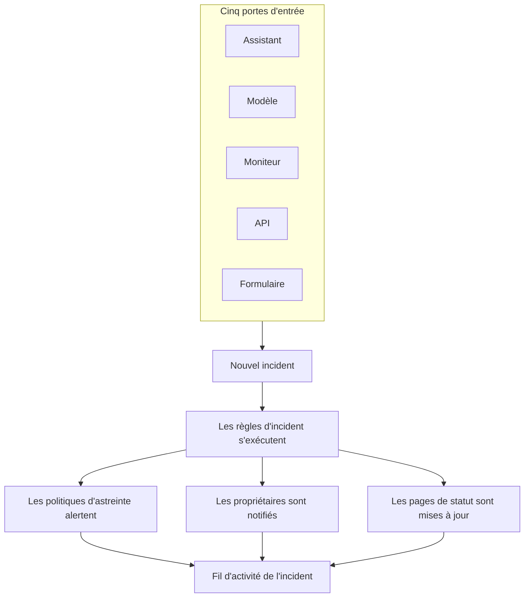
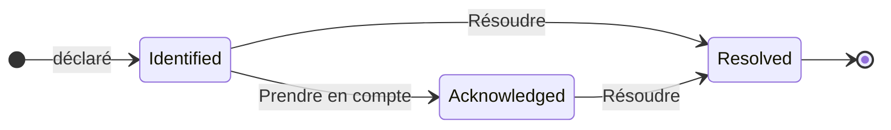

# Vue d'ensemble des incidents

Un incident est l'enregistrement à partir duquel votre équipe travaille quand quelque chose casse : ce qui est touché, la gravité, où en est l'intervention, à qui il appartient, et tout ce qui est consigné en chemin. En déclarer un alerte la bonne rotation d'astreinte, prévient ses propriétaires et — si vous le souhaitez — affiche la panne sur votre page de statut, pour que vos clients sachent que vous êtes dessus.

:::cards
- [Déclarer un incident](/docs/incidents/declaring-incidents): À la main, à partir d'un modèle, depuis un moniteur, par l'API ou via un formulaire.
- [États et sévérités des incidents](/docs/incidents/states-and-severities): Le cycle de vie, et ce que font la prise en compte et la résolution.
- [Notes, propriétaires et fil d'incident](/docs/incidents/notes-owners-and-feed): Les mises à jour pour les clients et pour votre équipe, et qui en est informé.
- [Alertes liées](/docs/incidents/linked-alerts): Rattacher les alertes qu'une panne a levées à l'incident qui les explique.
- [Paramètres et automatisation des incidents](/docs/incidents/settings): Modèles, champs personnalisés, rôles, mesures et règles.
:::

## En un coup d'œil

- **Un produit à part entière** — ouvrez **Incidents** depuis le menu **Produits** de la barre supérieure ; la liste se trouve à `/dashboard/{projectId}/incidents`.
- **Trois états créés d'office** — **Identifié**, **Pris en compte** et **Résolu** sont créés pour chaque nouveau projet. Vous pouvez ajouter les vôtres ; les trois états créés d'office peuvent être renommés et recolorés, mais jamais supprimés.
- **Trois gravités créées d'office** — **Critical Incident**, **Major Incident** et **Minor Incident**. Une gravité est une étiquette avec une couleur et un ordre — elle n'a aucun comportement propre.
- **Cinq portes d'entrée** — l'assistant **Déclarer un incident**, **Créer à partir d'un modèle**, une règle de critères de moniteur, `POST /api/incident`, ou un [formulaire](/docs/forms/index) que toute personne disposant de son lien peut remplir.
- **Numérotés par projet** — chaque incident reçoit un numéro d'incident tiré d'un compteur propre au projet, affiché avec le préfixe de votre projet : `INC-42` dans un nouveau projet, ou `#42` sans préfixe.
- **Deux sortes de notes** — les notes privées (notes internes) pour votre équipe, les notes publiques pour les abonnés de la page de statut.
- **Les alertes se lient aux incidents** — liez les alertes qui font partie d'un incident, ou déclarez un incident directement à partir d'alertes — depuis une liste d'alertes ou depuis la page d'une alerte — et prenez-les en compte au passage. Voir [Alertes liées](/docs/incidents/linked-alerts).
- **Les paramètres vivent sous Incidents, pas sous Paramètres du projet** — états, gravités, modèles, champs personnalisés et moteurs de règles se trouvent tous dans **Incidents → Paramètres** et **Incidents → Règles**.

## Comment ça marche

Vous pouvez déclarer un incident à la main à 3 h du matin, ou laisser un moniteur le déclarer dès que ses critères correspondent. Dans les deux cas, l'incident est le même objet, avec le même cycle de vie et la même trace écrite au bout du compte.

### 1. Il est déclaré

Cinq chemins mènent au même objet :

- **À la main** — dans la liste des incidents, cliquez sur **Déclarer un incident**. Cela ouvre l'assistant **Déclarer un nouvel incident**, en trois étapes : **Détails de l'incident**, **Ressources affectées**, **Astreinte et rôles**. La première étape demande un titre, une gravité et une description, et ce dont la plupart des incidents n'ont jamais besoin est replié sous **Plus de champs**. Seule la première étape demande quelque chose à quoi vous devez répondre : **Suivant** parcourt le reste, et **Déclarer un incident** se trouve sur le récapitulatif final.
  - **À partir d'alertes** — **Déclarer un incident** sur une sélection d'alertes, ou dans l'en-tête d'une alerte, ouvre le même assistant, prérempli à partir des alertes, les lie au nouvel incident et, sauf si vous décochez la case, les prend en compte pour que leur escalade s'arrête — voir [Alertes liées](/docs/incidents/linked-alerts).
- **À partir d'un modèle** — cliquez sur **Créer à partir d'un modèle** et choisissez un **Modèle d'incident** enregistré. Les modèles préremplissent le titre, la description, la gravité, l'état initial, les ressources, les politiques d'astreinte, les propriétaires et les étiquettes.
- **Depuis un moniteur** — une règle de critères de moniteur avec l'option « déclarer un incident » activée crée l'incident automatiquement dès que ses filtres correspondent. Les titres et descriptions y acceptent les modèles `{{variable}}`.
- **Par l'API** — `POST /api/incident` avec une clé d'API. Le serveur renseigne pour vous `declaredAt`, l'état de création et le numéro d'incident.
- **Via un formulaire** — une personne extérieure à votre équipe remplit un formulaire que vous avez partagé sous forme de lien, sans compte OneUptime. L'incident est déclaré masqué sur les pages de statut, à partir du modèle d'incident du formulaire s'il en a un. Voir [Formulaires](/docs/forms/index).

Les intégrations ouvrent aussi des incidents : [Huntress](/docs/integrations/huntress) transforme chaque rapport d'incident envoyé par son SOC en un incident, qui alerte les politiques d'astreinte que vous choisissez. Voir [Déclarer un incident](/docs/incidents/declaring-incidents) pour le détail champ par champ.

### 2. Les bonnes personnes sont informées

À la création, OneUptime exécute l'automatisation que vous avez configurée : règles de confidentialité, règles de propriétaire, règles d'étiquettes, règles d'astreinte et règles de runbook. Toutes les politiques d'astreinte rattachées à l'incident — à la main, depuis un modèle, ou ajoutées par une règle d'astreinte qui correspond — sont exécutées en parallèle.

Les propriétaires sont notifiés sur les canaux que chacun a activés dans **Paramètres utilisateur → Paramètres de notification** : e-mail, SMS, appel vocal, push, WhatsApp, Telegram, Slack, Microsoft Teams ou webhook. Si un incident n'a aucun propriétaire, la notification se rabat sur les propriétaires du projet au lieu d'être perdue.

Si l'incident est visible sur une page de statut et que les notifications aux abonnés sont activées, les abonnés sont prévenus aussi : les abonnés de chaque page de statut qui liste l'un de ses moniteurs, ou seulement ceux des pages auxquelles vous l'avez limité. Voir [Une page de statut par public](/docs/status-pages/one-status-page-per-audience) pour donner à chaque public sa propre page de statut.

> [!NOTE]
> Les notifications sont pilotées par une tâche planifiée qui s'exécute chaque minute ; attendez-vous donc à un délai pouvant aller jusqu'à environ une minute plutôt qu'à un envoi instantané.

### 3. Votre équipe le traite

Les intervenants prennent l'incident en compte, rattachent les ressources affectées, lient les alertes qui en font partie, exécutent des runbooks, attribuent les rôles d'incident et consignent ce qu'ils apprennent au fur et à mesure — notes privées pour l'équipe, notes publiques pour les clients, plus les pages **Cause racine** et **Remédiation** quand la situation s'éclaircit. Tout ce qu'ils font arrive dans le **Fil d'activité de l'incident**, sur la page **Vue d'ensemble**.

### 4. Il est résolu

Cliquer sur **Résoudre** fait passer l'incident à l'état résolu, horodate la chronologie des états, arrête le compteur de durée, rend les moniteurs qu'il retient, et retire l'incident de la section active de toute page de statut où il apparaissait. Rien d'autre n'a besoin de changer pour cela — une page de statut n'affiche que les incidents dans un état situé au-dessus de l'état résolu. Voir [Ce que fait la résolution](/docs/incidents/states-and-severities#ce-que-fait-la-résolution).

Ensuite, vous pouvez rédiger un post-mortem et, si vous le souhaitez, le publier sur la page de statut.

## Termes clés

Une poignée de mots revient sur toutes les autres pages de cette section. Clarifiez-les d'abord.

| Terme                      | Ce que cela veut dire                                                                                                                                    |
| -------------------------- | -------------------------------------------------------------------------------------------------------------------------------------------------------- |
| **Incident**               | L'enregistrement lui-même — titre, description, gravité, état courant, ressources affectées, et tout ce qui y est écrit pendant l'intervention.           |
| **État de l'incident**     | Où en est l'incident dans son cycle de vie. Une ligne propre au projet, avec un nom, une couleur et un `order`, plus les indicateurs qui lui donnent son sens. |
| **Gravité de l'incident**  | À quel point c'est grave. Une ligne propre au projet, avec un nom, une couleur et un `order`. Pure classification — rien dans le produit ne traite une gravité à part. |
| **Numéro d'incident**      | Un compteur par projet affiché `#42`, ou avec un préfixe que vous configurez, `INC-42`.                                                                   |
| **Ressources affectées**   | Les moniteurs, hôtes, clusters Kubernetes, hôtes Docker, services et autres éléments d'infrastructure que vous rattachez à l'incident.                    |
| **Note publique**          | Une mise à jour écrite pour les lecteurs et les abonnés de la page de statut. Elle s'affiche dans la chronologie de la page de statut.                    |
| **Note privée**            | Une note interne (le modèle `IncidentInternalNote`) pour l'équipe d'intervention. Elle n'atteint jamais une page de statut.                               |
| **Propriétaire**           | Un utilisateur ou une équipe responsable de l'incident. Les propriétaires sont notifiés à sa création, quand des notes sont publiées et quand l'état change. |
| **Fil d'activité de l'incident** | La chronologie d'activité en ajout seul sur la **Vue d'ensemble** de l'incident, qui consigne changements d'état, notes, changements de propriétaires, exécutions de règles et notifications. |
| **Chronologie d'état**     | La trace des états par lesquels l'incident est passé, quand et pendant combien de temps — avec le statut de notification des abonnés pour chaque transition. |
| **Alerte liée**            | Une alerte liée à l'incident dans le cadre de son intervention. Une alerte peut être liée à plusieurs incidents, et garde son propre état.               |

## Les trois états que OneUptime crée pour chaque projet

À la création d'un projet, OneUptime crée exactement trois états d'incident, dans cet ordre :

| État               | Ordre | Couleur              | Ce que cela veut dire                                                     |
| ------------------ | ----- | -------------------- | ------------------------------------------------------------------------- |
| **Identifié**      | 1     | Rouge (`#fd625e`)    | L'état dans lequel arrive un incident tout neuf. C'est l'état de création. |
| **Pris en compte** | 2     | Jaune (`#ffbf53`)    | Quelqu'un a pris l'incident en main et travaille dessus.                  |
| **Résolu**         | 3     | Vert (`#2ab57d`)     | L'incident est terminé. C'est sa résolution qui le retire de votre page de statut. |

Les noms ne sont que des libellés — ce qui pilote réellement le comportement, ce sont trois booléens sur la ligne d'état : `isCreatedState`, `isAcknowledgedState` et `isResolvedState`. Un seul état par projet est censé porter chaque indicateur.

Cette distinction compte plus qu'il n'y paraît :

- `isCreatedState` décide où démarre un nouvel incident. Si aucun état n'est explicitement choisi à la création, OneUptime cherche l'état de création du projet et l'utilise.
- `isAcknowledgedState` et `isResolvedState` marquent l'état pris en compte et l'état résolu. La position de l'état d'un incident par rapport à eux pilote les boutons **Prendre en compte** et **Résoudre** de l'en-tête de l'incident, les deux tuiles de statistiques de la **Vue d'ensemble** de l'incident, et le badge de compteur **Incidents actifs** du menu latéral : un incident dans l'état pris en compte ou dans un état qui le suit est pris en compte, et un incident dans l'état résolu ou dans un état qui le suit est résolu.
- **Incidents actifs** est défini uniquement comme « l'état courant se situe au-dessus de l'état résolu ». Un état personnalisé que vous ajoutez au-dessus de l'état résolu est donc actif ; un état que vous placez après compte comme résolu, comme l'état résolu lui-même.

> [!NOTE]
> Le premier état créé d'office s'appelle **Identifié**, même si plusieurs descriptions dans le produit l'appellent encore l'état de création (« created »). Si vous cherchez « Created » dans la liste des états de votre projet, c'est la ligne nommée **Identifié**.

Vous pouvez ajouter vos propres états dans **Incidents → Paramètres → État de l'incident**. Un nouvel état est ajouté juste au-dessus de l'état résolu, et vous réordonnez les lignes en les faisant glisser ; la colonne **Compte comme** indique ce que compte un incident dans chaque état — non pris en compte, pris en compte ou résolu. Les trois états marqués portent l'étiquette **Intégré** : ils gardent leur ordre et ne peuvent pas être supprimés, mais vous pouvez les renommer, les recolorer et les déplacer, ce qui explique pourquoi l'interface lit les noms d'état dynamiquement.

L'ordre est appliqué, pas décoratif : un incident ne peut pas passer à un état situé plus tôt dans l'ordre que son état courant. Tous les détails se trouvent dans [États et sévérités des incidents](/docs/incidents/states-and-severities).

## Les trois gravités que OneUptime crée pour chaque projet

Chaque nouveau projet reçoit aussi trois gravités :

| Gravité               | Ordre | Couleur              | Ce que cela veut dire                                          |
| --------------------- | ----- | -------------------- | -------------------------------------------------------------- |
| **Critical Incident** | 1     | Bordeaux (`#b70400`) | Impact client très élevé, qui exige une intervention immédiate. |
| **Major Incident**    | 2     | Rouge (`#fd625e`)    | Impact important, qui exige généralement une intervention immédiate. |
| **Minor Incident**    | 3     | Jaune (`#ffbf53`)    | Faible impact, généralement traité pendant les heures ouvrées. |

Les gravités ont un `name`, une `description`, une `color` et un `order`, et rien d'autre. Il n'y a pas d'indicateurs, et aucun chemin de code ne traite « Critical Incident » différemment d'une autre ligne. La gravité sert aux humains à trier, et elle est disponible comme critère de correspondance quand vous écrivez des règles d'astreinte — mais choisir une gravité n'alerte, à elle seule, personne.

Modifiez ou ajoutez des gravités dans **Incidents → Paramètres → Gravité de l'incident**. Les descriptions complètes créées d'office se trouvent dans [États et sévérités des incidents](/docs/incidents/states-and-severities).

## Où se trouvent les incidents dans le tableau de bord

Ouvrez **Incidents** depuis le menu **Produits** de la barre supérieure. Son menu latéral est organisé en sections :

| Section            | Ce que vous y faites                                                                                                                                                       |
| ------------------ | -------------------------------------------------------------------------------------------------------------------------------------------------------------------------- |
| **Vue d'ensemble** | **Tous les incidents** et **Incidents actifs** — ce dernier porte un badge rouge avec le nombre d'incidents dans un état situé au-dessus de l'état résolu.                  |
| **Épisodes**       | Les épisodes d'incident, une fonctionnalité de regroupement distincte avec ses propres pages.                                                                             |
| **IA**             | **Analyses**, **Journaux**, **Paramètres** : ce que OneUptime AI a appris de vos incidents et tout ce qu'elle a fait pour eux, et ce qu'elle peut faire d'elle-même — avec les règles qui décident des incidents qu'elle examine et corrige. Voir [AI SRE](/docs/ai/ai-sre). |
| **Espace de travail** | Les espaces de discussion que ce projet a connectés : **Slack**, **Microsoft Teams** ou les deux, chacun avec ses règles de notification pour les incidents. Si aucun n'est connecté, la section contient **Connecter Slack ou Teams**, une page qui présente les deux et explique comment les connecter. |
| **Intégrations**   | Les outils qui ouvrent des incidents d'eux-mêmes : **Huntress**, dont les rapports d'incident deviennent des incidents qui alertent l'astreinte. Voir [Huntress](/docs/integrations/huntress). |
| **Règles**         | Les moteurs de règles : **Règles de regroupement**, **Règles d'astreinte**, **Règles de propriétaire**, **Règles de runbook**, **Règles de confidentialité**, **Règles d'étiquettes**, **Règles SLA**, **Reminder Rules**. |
| **Paramètres**     | **État de l'incident**, **Gravité de l'incident**, **Modèles d'incident**, **Modèles de notes**, **Modèles de post-mortem**, **Champs personnalisés**, **Rôles d'incident**, **Mesures**, **Alertes liées**, **Préfixe de numéro**. |

**Vue d'ensemble** et **Épisodes** sont ouvertes ; **IA**, **Espace de travail**, **Intégrations**, **Règles**, **Paramètres** et **Développeurs** sont repliées par défaut, pour que le menu s'ouvre sur les listes dont vous vous servez chaque jour. Cliquez sur le titre d'une section pour la déplier et trouver les pages dont parle le reste de cette documentation ; une section s'ouvre aussi d'elle-même dès que vous êtes sur l'une de ses pages. La configuration des incidents ne se trouve pas dans les paramètres du projet ; elle vit entièrement ici.

La liste des incidents elle-même affiche **Numéro d'incident**, **Titre**, **État**, **Gravité**, **Ressources affectées**, **Déclaré**, **Durée**, **Étiquettes** et **Propriétaires**, avec une action groupée **Modifier l'état** pour en clore plusieurs d'un coup.

## Ce que montre chaque page d'un incident

Ouvrez un incident : son propre menu latéral regroupe ses pages ainsi :

| Section du menu latéral | Pages                                                                                     |
| ----------------------- | ----------------------------------------------------------------------------------------- |
| **Vue d'ensemble**      | **Vue d'ensemble**, **Chronologie d'état**, **SLA**                                       |
| **Investigation**       | **Description**, **Cause racine**, **Remédiation**, **Runbooks**, **Post-mortem**, **Alertes liées** |
| **Équipe**              | **Rôles**, **Exécutions d'astreinte**, **Propriétaires**                                  |
| **Notifications**       | **Journaux de notification**, **Journaux IA** — repliée jusqu'à ce que vous cliquiez sur **Notifications** |
| **Notes**               | **Notes privées**, **Notes publiques**                                                    |
| **Développeurs**        | **Terraform**, **API**, **Assistants IA** — repliée jusqu'à ce que vous cliquiez sur **Développeurs** |
| **Avancé**              | **Champs personnalisés**, **Paramètres**, **Journaux d'audit**, **Supprimer l'incident** — repliée jusqu'à ce que vous cliquiez sur **Avancé** |

Ce que contient chacune :

- **Vue d'ensemble** — l'intervention d'un coup d'œil. Sous l'en-tête, des tuiles de statistiques montrent le délai de prise en compte, le délai de résolution et la **Durée** totale. La carte **Investigation IA** ouvre la page — ce que OneUptime AI a trouvé, ou pourquoi elle n'a pas démarré —, avec le **Fil d'activité de l'incident** en dessous. À côté se trouvent la carte **Appel vidéo**, la carte **Détails de l'incident** (titre, gravité, étiquettes, numéro d'incident, déclaré le, déclaré par, politiques d'astreinte, et l'ID de l'incident sur une petite ligne **ID** en bas, à un clic de votre presse-papiers), **Rôles d'incident**, une carte **Ressources affectées** et les champs personnalisés de l'incident. Quand votre projet a des [mesures](/docs/incidents/settings#mesures), une carte **Mesures** sous **Détails de l'incident** indique ce que chacune affiche pour cet incident : **12 minutes**, **En cours depuis 5 minutes**, **Non atteint**.
- **Chronologie d'état** — chaque état par lequel l'incident est passé, avec **Commence le**, **Se termine le**, **Durée** et le statut de notification des abonnés pour chaque transition. **Voir la cause** et **Voir les journaux** expliquent pourquoi chaque changement a eu lieu.
- **SLA** — le suivi SLA de cet incident.
- **Description**, **Cause racine**, **Remédiation** — trois pages en Markdown. La description est celle qui s'affiche sur votre page de statut.
- **Runbooks** — les exécutions de runbook rattachées à cet incident.
- **Post-mortem** — le compte rendu et ses pièces jointes, que vous pouvez publier sur la page de statut si vous le souhaitez. **Modifier la note de post-mortem** demande la note et les pièces jointes, puis **Publier sur la page de statut** ; c'est seulement tant que cette option est activée qu'il demande **Notifier les abonnés** et **Post-mortem publié le**, que l'activation de la publication règle sur maintenant. **Générer avec l'IA** rédige la note pour vous, et **Appliquer le modèle** — affiché dès que le projet a un modèle de post-mortem — la démarre à partir d'un modèle. Les abonnés sont prévenus une fois, quand le post-mortem est publié : la première fois que la page de statut l'affiche, ce qui demande **Publier sur la page de statut** activé et une note rédigée. L'enregistrer à nouveau, ou le modifier pendant qu'il est publié, met à jour la page de statut sans prévenir personne ; le republier après l'avoir retiré de la page de statut les prévient de nouveau. Un post-mortem publié pendant que l'incident est masqué est envoyé quand l'incident devient visible. Voir [Le post-mortem](/docs/status-pages/subscribers#incidents).
- **Alertes liées** — les alertes liées à cet incident, avec l'état actuel de chaque alerte, et qui l'a liée et quand. Les alertes ont une page **Incidents liés** correspondante. Voir [Alertes liées](/docs/incidents/linked-alerts).
- **Rôles**, **Exécutions d'astreinte**, **Propriétaires** — qui s'en occupe, quelles politiques se sont déclenchées, et qui est notifié.
- **Journaux de notification**, **Journaux IA**, **Journaux d'audit** — ce qui a été envoyé et ce qui a changé.
- **Notes privées** et **Notes publiques** — ce qui a été dit à votre équipe et à vos clients. Voir [Notes, propriétaires et fil d'incident](/docs/incidents/notes-owners-and-feed).
- **Champs personnalisés**, **Paramètres**, **Supprimer l'incident** — la page **Paramètres** contient **Visible sur la page de statut** et **Incident privé**, la carte **Portée des pages de statut** qui limite l'incident à certaines pages de statut, et la carte **Reminders**, dont l'interrupteur **Envoyer des rappels** s'enregistre dès que vous le basculez et indique quand part le prochain rappel.

## Comment les incidents s'articulent avec le reste de OneUptime

- **Les moniteurs repèrent le problème ; les incidents le consignent.** Une règle de critères de moniteur peut déclarer un incident automatiquement, en préremplissant le titre, la gravité, les politiques d'astreinte, les propriétaires, les étiquettes et les notes de remédiation. Voir [Modèles d'incident et d'alerte](/docs/monitor/incident-alert-templating) pour les variables disponibles.
- **Les alertes sont les signaux ; les incidents sont l'intervention.** Liez à un incident les alertes qu'il explique, depuis l'un ou l'autre côté, et deux interrupteurs de projet, activés pour les nouveaux projets, prennent en compte et résolvent ces alertes en même temps que l'incident. Voir [Alertes liées](/docs/incidents/linked-alerts).
- **Les politiques d'astreinte se chargent d'alerter.** Rattachez des politiques à l'étape **Astreinte et rôles** de l'assistant de déclaration, sur un modèle, ou via **Incidents → Règles → Règles d'astreinte**. Chaque règle qui correspond se déclenche — l'ensemble exécuté est l'union de toutes les correspondances plus tout ce qui est rattaché directement, sans doublons.
- **Les runbooks disent quoi faire.** Les règles de runbook rattachent automatiquement une procédure quand un incident correspondant est créé, et les intervenants peuvent en lancer un à la main depuis l'incident. Voir [Vue d'ensemble des Runbooks](/docs/runbooks/index).
- **Les pages de statut informent les clients.** Un incident apparaît dans la liste active d'une page de statut quand la page liste l'un de ses moniteurs, que les incidents y sont activés, que l'incident est marqué visible sur la page de statut et que son état courant se situe au-dessus de l'état résolu. Un incident limité à certaines pages de statut n'apparaît que sur celles-ci. Les incidents privés sont masqués sur toutes les pages de statut, toujours. Voir [Vue d'ensemble des pages de statut](/docs/status-pages/index) et [Une page de statut par public](/docs/status-pages/one-status-page-per-audience).
- **Les workflows automatisent autour.** Les déclencheurs **On Create Incident**, **On Update Incident** et **On Delete Incident** vous permettent de construire une automatisation sans code sur le cycle de vie de l'incident. Voir [Présentation des workflows](/docs/workflows/index).

## Étapes suivantes

:::cards
- [Déclarer un incident](/docs/incidents/declaring-incidents): Parcourez l'assistant champ par champ, ou déclarez à partir d'un modèle, d'un moniteur ou de l'API.
- [États et sévérités des incidents](/docs/incidents/states-and-severities): Ajoutez vos propres états et voyez exactement ce que fait chacun.
- [Vue d'ensemble des pages de statut](/docs/status-pages/index): Comment les incidents atteignent vos clients.
- [Abonnés et annonces](/docs/status-pages/subscribers): Qui est notifié quand un incident évolue.
:::
