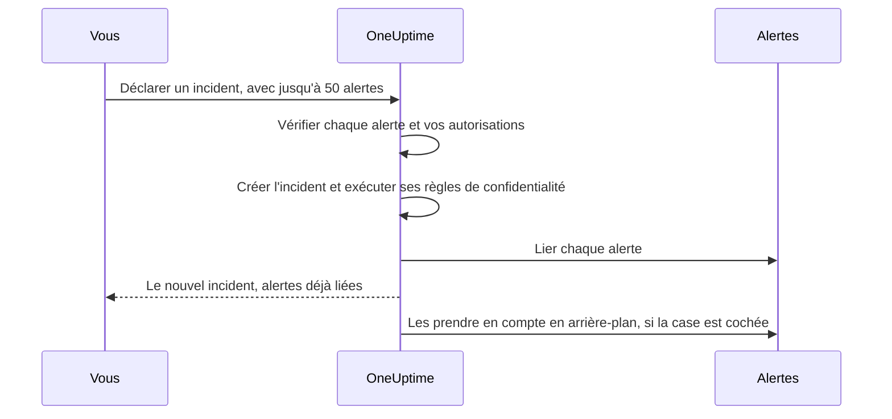

# Alertes liées

Une panne lève rarement une seule alerte. Quand la base de données principale tombe, le moniteur de retard de réplication se déclenche, le moniteur de taux d'erreur de l'API se déclenche, et le SLO de latence du paiement commence à consommer son budget — trois alertes, un problème. Lier ces alertes à l'incident le dit : l'incident est l'endroit où se passe l'intervention, et chaque alerte indique quel incident l'explique.

Un lien n'est qu'un lien. L'alerte garde son propre état, ses propriétaires, ses politiques d'astreinte, ses notes et son fil d'activité ; l'incident garde les siens. Lier ne fusionne et ne copie rien, et à lui seul ne prend jamais en compte, ne résout jamais et ne fait jamais taire une alerte. (Déclarer un nouvel incident à partir d'alertes est différent : le nouvel incident est prérempli à partir d'elles, comme [décrit plus bas](#déclarer-un-incident-à-partir-dalertes), et sauf si vous décochez la case du formulaire, les alertes sont prises en compte au moment où vous le déclarez, ce qui arrête leur escalade — voir [Prendre les alertes en compte en déclarant](#prendre-les-alertes-en-compte-en-déclarant).) Deux interrupteurs de projet, activés pour les nouveaux projets, font suivre aux alertes liées l'incident quand il est pris en compte et résolu — voir [plus bas](#garder-les-états-des-alertes-en-phase-avec-lincident).

:::cards
- [Lier des alertes à un incident](#lier-des-alertes-depuis-un-incident): Depuis l'incident, depuis une alerte, ou plusieurs à la fois.
- [Déclarer un incident à partir d'alertes](#déclarer-un-incident-à-partir-dalertes): Un nouvel incident, prérempli et lié d'un seul coup.
- [Garder les états des alertes en phase](#garder-les-états-des-alertes-en-phase-avec-lincident): Prendre en compte et résoudre les alertes avec l'incident.
- [Autorisations](#autorisations): Qui peut lier, et ce que la liaison lui permet de faire.
:::

> [!TIP]
> Si vous venez d'Opsgenie, c'est la version OneUptime de l'association d'alertes à un incident.

## En un coup d'œil

- **Plusieurs à plusieurs** — un incident peut avoir autant d'alertes liées que nécessaire, et une alerte peut être liée à plusieurs incidents.
- **Trois endroits pour lier** — la page **Alertes liées** de l'incident, la page **Incidents liés** de l'alerte, et l'action groupée **Lier à un incident** des principales listes d'alertes, pour jusqu'à **50** alertes à la fois.
- **Déclarer un incident à partir d'alertes** — **Déclarer un incident** dans une liste d'alertes, dans l'en-tête d'une alerte ou sur sa page **Incidents liés** préremplit un nouvel incident à partir des alertes et les lie à sa création. Une case du formulaire, cochée par défaut, les prend aussi en compte, ce qui arrête leur propre escalade d'astreinte.
- **Consigné des deux côtés** — chaque liaison et dissociation écrit une entrée de fil sur l'incident et sur l'alerte, sauf qu'un incident déclaré à partir d'alertes reçoit une seule entrée qui les liste toutes. Seules les entrées de l'incident sont publiées dans Slack et Microsoft Teams, et le titre d'une alerte ou d'un incident privé n'est jamais écrit de l'autre côté.
- **Les états des alertes suivent l'incident** — deux interrupteurs de projet, tous deux activés pour les nouveaux projets, prennent en compte et résolvent les alertes liées quand l'incident est pris en compte et résolu. Désactivez l'un ou l'autre dans **Incidents → Paramètres → Alertes liées**.
- **Automatisable** — les liens sont une ressource d'API ordinaire, `/api/incident-alert`.

## Comment ça marche

Les alertes sont des signaux : les critères d'un moniteur ont correspondu, un SLO a commencé à consommer son budget, une règle de sécurité s'est déclenchée. Un incident est l'intervention coordonnée face à un problème (voir [Vue d'ensemble des incidents](/docs/incidents/index)). La plupart des problèmes produisent plusieurs signaux, et sans liens, la seule chose qui les rattache à l'intervention est la mémoire de quelqu'un.

```mermaid title="Trois alertes, un incident, et les interrupteurs qui les font avancer"
flowchart TB
    subgraph signals["Alertes"]
        direction LR
        lag["Retard de réplication"]
        errors["Taux d'erreur de l'API"]
        latency["Latence du paiement"]
    end
    signals -->|"liées à"| incident["Incident"]
    incident -->|"pris en compte"| ack["Alertes liées prises en compte"]
    incident -->|"résolu"| res["Alertes liées résolues"]
```

Avec les alertes liées :

- Les intervenants sur l'incident voient, dans une seule liste, quelles alertes en font partie et dans quel état se trouve chacune.
- Quelqu'un qui ouvre l'une de ces alertes voit qu'elle est déjà prise en charge, et sous quel incident, au lieu de déclarer un second incident pour la même panne.
- Le fil d'activité de l'incident consigne quand chaque alerte a été liée et par qui, si bien que la chronologie montre comment la situation s'est dessinée.
- Avec les interrupteurs activés, prendre l'incident en compte arrête les escalades d'astreinte des alertes, pour que les personnes qui traitent l'incident ne soient pas de nouveau alertées par ses symptômes.

## Comment fonctionnent les liens

Un lien relie une alerte à un incident. Les liens vont dans les deux sens — le même lien apparaît sur la page **Alertes liées** de l'incident et sur la page **Incidents liés** de l'alerte.

- **Une alerte peut être liée à plusieurs incidents.** La panne d'une dépendance partagée peut être le symptôme de deux incidents distincts. Chaque incident liste l'alerte, et l'alerte liste les deux incidents.
- **Chaque paire est liée une seule fois.** Lier une alerte à un incident auquel elle est déjà liée est rejeté avec « This alert is already linked to this incident. » — même quand deux personnes lient la même paire au même instant.
- **Les liens sont créés ou supprimés, jamais modifiés.** Un lien n'a pas d'autres champs que son incident, son alerte, la date de sa création et son auteur. Pour déplacer une alerte vers un autre incident, liez-la au nouveau et dissociez-la de l'ancien.
- **Les liens restent dans un projet.** L'alerte et l'incident doivent appartenir au même projet.

## Lier des alertes depuis un incident

:::steps
### Ouvrir la page Alertes liées de l'incident

Ouvrez l'incident et choisissez **Alertes liées** dans la section **Investigation** de son menu latéral. Le tableau liste chaque alerte déjà liée.

### Choisir l'alerte

Cliquez sur **Lier l'alerte** et choisissez-la dans la liste déroulante **Alerte**. La liste déroulante présente les alertes les plus récentes en premier, chacune avec son numéro — comme `ALT-63: Checkout API is offline` — pour que des alertes de même titre, comme les alertes répétées d'un moniteur, puissent être distinguées. Pour trouver une alerte plus ancienne, tapez : la liste déroulante cherche dans toutes les alertes par titre.

### Enregistrer le lien

Cliquez sur **Lier l'alerte** dans la boîte de dialogue. L'alerte apparaît dans le tableau, et les deux fils consignent le lien. Si le lien est refusé, par exemple parce que l'alerte est déjà liée, la boîte de dialogue reste ouverte et dit pourquoi.
:::

| Colonne           | Ce qu'elle montre                                |
| ----------------- | ------------------------------------------------ |
| **Alerte n°**     | Le numéro de l'alerte, comme `#17` ou `ALT-17`.  |
| **Titre**         | Le titre de l'alerte, avec un lien vers l'alerte. |
| **État actuel**   | L'état propre de l'alerte, comme **Pris en compte**. |
| **Lié le**        | Quand l'alerte a été liée.                       |
| **Lié par**       | Qui l'a liée.                                    |

Chaque ligne a **Voir l'alerte** pour ouvrir l'alerte et **Dissocier** pour supprimer le lien.

## Lier des incidents depuis une alerte

Le côté alerte est le miroir du côté incident. Ouvrez une alerte et choisissez **Incidents liés** dans la section **Basique** de son menu latéral. Le tableau liste chaque incident auquel l'alerte est liée, avec le numéro, le titre et l'état actuel de l'incident, ainsi que quand et par qui elle a été liée.

- **Lier l'incident** lie cette alerte à un incident existant. Sa liste déroulante fonctionne comme celle du côté incident : les incidents les plus récents en premier, chacun avec son numéro — comme `INC-42: Checkout is down` — et la saisie cherche dans tous les incidents par titre.
- **Voir l'incident** ouvre un incident lié.
- **Dissocier** supprime un lien.
- **Déclarer un incident** démarre un nouvel incident à partir de cette alerte. Le même bouton se trouve dans l'en-tête de l'alerte, à côté de **Prendre en compte** et **Résoudre**. Voir [Déclarer un incident à partir d'alertes](#déclarer-un-incident-à-partir-dalertes).

## Lier plusieurs alertes à la fois

Les principales listes d'alertes ont deux actions groupées pour cela : **Toutes les alertes** et **Alertes actives**, les alertes actives de la page d'accueil, et la page **Alertes** d'un moniteur, d'un service, d'un hôte, d'un cluster Kubernetes, d'un SLO ou de toute autre ressource qui en a une. La liste **Alertes des membres** d'un épisode d'alerte ne les a pas — sélectionnez plutôt les alertes dans l'une des listes principales. Sélectionnez les alertes, puis choisissez :

- **Lier à un incident** — choisissez l'incident dans la liste déroulante **Incident** et cliquez sur **Lier les alertes**. Les incidents les plus récents sont listés en premier, avec leurs numéros, et la saisie cherche dans tous les incidents par titre. OneUptime lie chaque alerte sélectionnée, en affichant la progression au fur et à mesure. Une alerte déjà liée à cet incident compte comme faite plutôt qu'en échec ; relancer l'action est donc sans danger.
- **Déclarer un incident** — ouvre le formulaire de déclaration d'un nouvel incident prérempli à partir des alertes sélectionnées. Voir la section suivante.

Les deux actions acceptent jusqu'à **50** alertes à la fois. Sélectionnez-en plus et elles sont désactivées, avec une infobulle qui dit pourquoi. Ce plafond existe parce que chaque lien écrit dans les deux fils, et que chaque lien créé avec **Lier à un incident** est aussi publié dans les canaux Slack et Microsoft Teams de l'incident — une sélection de mille alertes les inonderait.

## Déclarer un incident à partir d'alertes

Quand une rafale d'alertes se révèle être un incident que personne n'a encore déclaré, déclarez-le à partir des alertes. Il y a trois façons d'y accéder :

- Sélectionnez les alertes dans l'une des principales listes d'alertes et choisissez **Déclarer un incident**.
- Ouvrez une alerte et cliquez sur **Déclarer un incident** dans son en-tête, à côté de **Prendre en compte** et **Résoudre**. Le bouton y reste une fois l'alerte prise en compte ou résolue, si bien que vous pouvez encore déclarer un incident pour une alerte après coup — pour en faire le post-mortem, par exemple.
- Ouvrez la page **Incidents liés** d'une alerte et cliquez sur **Déclarer un incident**.

Les trois demandent l'autorisation de créer des incidents et d'y lier des alertes. Sans elle, le bouton est verrouillé, et son infobulle nomme l'autorisation manquante.

Quelle que soit la façon choisie, vous arrivez sur le formulaire habituel **Déclarer un nouvel incident**, avec les alertes listées comme celles qui seront liées et ces champs préremplis :

| Champ                     | Prérempli avec                                                                                                                                                                                                                                                                         |
| ------------------------- | -------------------------------------------------------------------------------------------------------------------------------------------------------------------------------------------------------------------------------------------------------------------------------------- |
| **Titre**                 | Une alerte : son titre. Plusieurs : le titre de l'alerte la plus grave.                                                                                                                                                                                                                |
| **Description**           | Une alerte : sa description. Plusieurs : une liste avec une ligne par alerte, donnant son numéro et son titre.                                                                                                                                                                          |
| **Gravité de l'incident** | La gravité de l'alerte la plus grave, traduite en gravité d'incident. Une gravité d'incident de même nom, sans tenir compte de la casse, l'emporte. Sinon, OneUptime prend la gravité d'incident à la même position dans l'ordre des gravités, ou la dernière si vous avez moins de gravités d'incident. |
| **Ressources affectées**  | Tous les moniteurs, hôtes, clusters Kubernetes, hôtes Docker, hôtes Podman et services des alertes sélectionnées, réunis. Les moniteurs vont sous **Moniteurs**, le reste sous **Autres ressources affectées**. Les autres ressources, comme les SLO ou les clusters VMware, Proxmox et Ceph, ne sont pas copiées — ajoutez-les vous-même si l'incident les touche. |
| **Étiquettes**            | Chaque étiquette de chaque alerte sélectionnée.                                                                                                                                                                                                                                        |
| **Incident privé**        | Activé si l'une des alertes est privée. Le formulaire le dit, et les propriétaires des alertes deviennent propriétaires de l'incident — voir plus bas.                                                                                                                                 |

« La plus grave » suit l'ordre de vos gravités d'alerte : la première gravité d'alerte de la liste est la plus grave. Avec les gravités dont part chaque projet, une alerte **Élevé** devient un **Critical Incident** et une alerte **Low** un **Major Incident**.

Tout est modifiable avant l'envoi. **Étiquettes** et **Incident privé** se trouvent sous **Plus de champs** dans la première étape du formulaire, dont l'en-tête replié affiche chacun tant qu'il est défini.

**Une alerte qui a déjà un incident est signalée.** Avec **Déclarer un incident** sur la page de chaque alerte, deux intervenants alertés par la même panne pourraient chacun la déclarer. Le bandeau qui liste les alertes marque donc chaque alerte déjà liée à un incident — « (already linked to Incident INC-42) », avec un lien vers cet incident — et ajoute une remarque, formulée selon le nombre d'alertes liées :

- Toutes les alertes, et il n'y en a qu'une : « This alert is already linked to an incident. If it is the same problem, update that incident instead of declaring another one. »
- Toutes les alertes, et il y en a plusieurs : « These alerts are already linked to incidents. If it is the same problem, update that incident instead of declaring another one. »
- Seulement certaines : « Some of these alerts are already linked to an incident. If it is the same problem, link the other alerts to that incident from the alerts list instead of declaring another one. »

Les liens vers les incidents s'ouvrent dans un nouvel onglet, pour que vous puissiez vérifier l'incident existant sans perdre ce que vous avez rempli dans le formulaire. La remarque est un rappel, pas un blocage, et seuls les incidents que vous avez le droit de voir sont nommés.

**Les politiques d'astreinte ne sont pas copiées.** Les alertes ont exécuté leurs propres politiques d'astreinte à leur création ; les copier sur l'incident alerterait les mêmes personnes une seconde fois. Les politiques d'astreinte de l'incident sont celles que vous choisissez à l'étape **Astreinte et rôles** plus celles qu'ajoutent vos règles d'astreinte des incidents — exactement comme pour tout autre incident.

**Les moniteurs des alertes sont préremplis comme moniteurs affectés.** Comme pour tout incident déclaré à la main, la surveillance active des moniteurs de l'incident est mise en pause jusqu'à sa résolution. Retirez un moniteur de **Moniteurs** à l'étape **Ressources affectées** avant l'envoi s'il doit continuer à être vérifié.

**Une alerte privée donne un incident privé.** Si l'une des alertes est privée, **Incident privé** démarre activé, et le bandeau qui liste les alertes le dit. Un incident privé n'est visible que de ses propriétaires, des Project Owners et des Project Admins ; OneUptime s'assure donc que les personnes qui pouvaient voir les alertes peuvent voir l'incident : une fois l'incident déclaré, les propriétaires de chaque alerte déclarée — utilisateurs comme équipes — sont ajoutés comme propriétaires de l'incident, sans être notifiés. Ils sont ajoutés juste après la création des canaux Slack et Microsoft Teams de l'incident, si bien qu'ils sont invités dans ces canaux comme n'importe quel autre propriétaire. Vous êtes vous aussi propriétaire, comme pour tout incident que vous déclarez. Il en va de même quand une règle de confidentialité d'incident rend le nouvel incident privé. Si vous désactivez **Incident privé** avant l'envoi et qu'aucune règle de confidentialité ne s'applique, l'incident n'est pas privé et aucun propriétaire n'est copié.



Quand vous envoyez le formulaire, le serveur vérifie les alertes avant de créer quoi que ce soit : 50 au plus, chacune une alerte de ce projet que vous avez le droit de voir, et vous devez avoir le droit de lier des alertes à des incidents. Si une vérification échoue, la requête est rejetée et aucun incident n'est créé — un mauvais identifiant d'alerte ne consomme donc jamais un numéro d'incident. Une fois l'incident créé — et ses règles de confidentialité exécutées, pour que les liens sachent s'il est privé — chaque alerte est liée avant que la requête ne réponde, si bien que la page **Alertes liées** de l'incident les liste déjà. Si un seul lien échoue — parce que l'alerte a été supprimée un instant plus tôt, par exemple — l'incident est tout de même déclaré et les autres alertes sont tout de même liées.

Le fil d'activité de l'incident reçoit une seule entrée **Alerte liée** qui liste les alertes, écrite après **Incident créé**, plutôt qu'une par alerte — voir [Le fil, Slack et Microsoft Teams](#le-fil-slack-et-microsoft-teams).

### Prendre les alertes en compte en déclarant

Déclarer un incident n'arrête pas, à lui seul, les alertes de ses alertes : l'escalade d'astreinte d'une alerte ne s'arrête qu'une fois l'alerte elle-même prise en compte. Ainsi, quand l'une des alertes n'est pas encore prise en compte, le bandeau du formulaire a une case à cocher, cochée par défaut — **Acknowledge this alert to stop its escalation** pour une alerte, **Acknowledge these 3 alerts to stop their escalation** pour plusieurs. Si certaines sont déjà prises en compte, elle ne nomme que les autres et dit que le reste est laissé tel quel.

Laissez-la cochée et, une fois l'incident déclaré et les alertes liées :

- **Les alertes sont prises en compte en votre nom.** Chacune passe dans votre état d'alerte **Pris en compte** comme si vous aviez cliqué vous-même sur **Prendre en compte** : la **Chronologie d'état** et le fil d'activité de l'alerte vous nomment, les propriétaires de l'alerte sont notifiés, et le changement est publié dans les canaux Slack et Microsoft Teams de l'alerte comme tout autre changement d'état d'alerte. La cause indique « Acknowledged because Incident INC-42 was declared from this alert. » — ou, pour un incident privé, « Acknowledged because a private incident was declared from this alert. », pour qu'un incident privé ne soit jamais nommé là où le public de l'alerte peut le lire.
- **Leur propre escalade d'astreinte s'arrête en une minute environ.** L'étape d'escalade suivante voit une alerte prise en compte et s'arrête. Les alertes déjà parties ne sont pas rappelées.
- **Les rappels ne s'arrêtent que si la règle de rappel le dit.** Les rappels d'une alerte ne s'arrêtent à la prise en compte que si sa règle de rappel a **Stop Reminders When** réglé sur **Pris en compte** ; sinon ils continuent jusqu'à la résolution de l'alerte.
- **Un épisode d'alerte continue d'escalader.** Si une alerte appartient à un épisode qui alerte par sa propre politique d'astreinte, l'épisode continue d'escalader jusqu'à ce que l'épisode lui-même soit pris en compte.
- **Les alertes déjà prises en compte ou résolues sont laissées tranquilles.** Comme partout ailleurs, les états sont comparés selon leur ordre, si bien qu'une alerte dans un état personnalisé situé après **Pris en compte** compte comme prise en compte, et que rien n'est jamais déplacé vers l'arrière.

Décochez la case pour déclarer sans prendre en compte. Chaque fois que des alertes resteront non prises en compte — la case est décochée ou verrouillée — le formulaire le dit : « Declaring the incident does not acknowledge the alert: it keeps escalating until it is acknowledged. » Et si vous prenez les alertes en compte sans choisir de politique d'astreinte pour l'incident, le récapitulatif de l'étape **Astreinte et rôles** le signale : « The alerts it is declared from are acknowledged too, so their own escalation stops. An alert episode they belong to keeps escalating until the episode is acknowledged, and an incident on-call rule, if any, may still page. »

**Il vous faut l'autorisation de prendre les alertes en compte.** Les prendre en compte en déclarant demande **Create Alert State Timeline** et **Edit Alert** (prendre une alerte en compte sur sa propre page ne demande que la première : voir [Changer un état](/docs/permissions/index#changer-un-état)) : Project Owner, Project Admin, Project Member, Alert Admin et Alert Member ont les deux, tandis qu'Incident Admin et Incident Member, qui peuvent déclarer des incidents à partir d'alertes, n'en ont aucune. Votre portée d'étiquettes et de propriétaires sur les alertes doit aussi inclure chaque alerte qui sera prise en compte — seules celles qui ne le sont pas encore sont vérifiées. Les alertes déjà prises en compte ou résolues ne demandent aucune autorisation et ne bloquent jamais la déclaration. Sans les autorisations, la case est verrouillée, avec une infobulle qui nomme celle qui manque, et vous pouvez tout de même déclarer l'incident. Le serveur vérifie de nouveau avant de créer quoi que ce soit, pour chaque alerte qu'il prendra en compte : si vous ne pouvez pas prendre l'une d'elles en compte, aucun incident n'est créé et le formulaire dit pourquoi — décochez la case et envoyez de nouveau.

**Le projet a besoin d'un état d'alerte Pris en compte.** Chaque projet démarre avec un. Si le vôtre n'en a pas, la case n'est pas proposée.

Les alertes sont prises en compte en arrière-plan, juste après avoir été liées, quelques-unes à la fois — jusqu'à 5 en même temps — si bien que la page de l'incident peut s'ouvrir un instant avant, et que déclarer à partir de nombreuses alertes ne fait pas attendre les dernières derrière toutes les autres. Une alerte qui ne peut pas être prise en compte — parce qu'elle a été supprimée entre-temps, par exemple — est journalisée et n'arrête jamais les autres ni l'incident, et une alerte que quelqu'un d'autre prend en compte ou résout entre-temps est laissée telle qu'il l'a laissée.

**Avec les interrupteurs d'alertes liées du projet activés, ce sont peut-être les interrupteurs qui déplacent les alertes.** Si l'incident est déclaré directement dans un état pris en compte ou résolu et que l'un des [interrupteurs d'alertes liées](#garder-les-états-des-alertes-en-phase-avec-lincident) agit sur cet état, l'interrupteur déplace les alertes liées au moment où elles sont liées, et la case lui laisse ces alertes, pour que chaque alerte n'ait qu'un seul auteur de changement. Elles sont prises en compte ou résolues comme le fait l'interrupteur — avec la cause de l'interrupteur, comme « Acknowledged because linked Incident INC-42 was acknowledged. », qui nomme l'incident par son numéro même quand il est privé — elles ne vous sont pas attribuées, et leurs propriétaires ne sont pas notifiés. Déclarer dans votre premier état d'incident, comme d'habitude, ou avec les interrupteurs désactivés, laisse chaque alerte à la case.

### Déclarer par l'API

`POST /api/incident` accepte les identifiants des alertes à lier dans `miscDataProps`, sous `alertIdsToLink`, et sous `acknowledgeAlertsToLink` s'il faut prendre ces alertes en compte :

```bash
curl -X POST https://oneuptime.com/api/incident \
  -H "apikey: $ONEUPTIME_API_KEY" \
  -H "Content-Type: application/json" \
  -d '{
    "data": {
      "title": "Primary database unavailable",
      "incidentSeverityId": "<incident-severity-id>"
    },
    "miscDataProps": {
      "alertIdsToLink": ["<alert-id>", "<another-alert-id>"],
      "acknowledgeAlertsToLink": true
    }
  }'
```

`alertIdsToLink` est un tableau de 1 à 50 identifiants d'alerte. Les doublons sont ignorés, et les mêmes vérifications que dans le tableau de bord s'appliquent, avant la création de l'incident. Rien n'est prérempli par l'API — envoyez le titre, la gravité et les ressources que vous voulez. La clé d'API doit avoir l'autorisation de créer des incidents et d'y lier des alertes, et elle doit pouvoir lire les alertes. Une clé d'API n'est pas un utilisateur ; les liens créés avec elle n'ont donc pas de **Lié par**. Pour le reste du corps de la requête, voir [Déclarer un incident](/docs/incidents/declaring-incidents).

`acknowledgeAlertsToLink` est facultatif, et désactivé tant que vous ne l'envoyez pas. Mettez-le à `true` pour prendre les alertes en compte une fois liées, comme le fait la case du formulaire — les alertes déjà prises en compte ou résolues sont laissées tranquilles et ne demandent aucune autorisation. Omettez-le, ou envoyez `false`, pour déclarer sans les prendre en compte. Il est vérifié avec les identifiants des alertes, avant la création de l'incident, et la requête est rejetée avec une erreur 400 quand :

- il vaut autre chose que `true` ou `false` ;
- il est envoyé sans `alertIdsToLink` ;
- le projet n'a pas d'état d'alerte Pris en compte ;
- la clé d'API ne peut pas prendre en compte chaque alerte qui ne l'est pas encore — cela demande **Create Alert State Timeline** et **Edit Alert**, avec une portée d'étiquettes qui inclut chacune de ces alertes.

Une clé d'API n'est pas un utilisateur ; les alertes prises en compte avec elle ne sont donc attribuées à personne, tout comme ses liens n'ont pas de **Lié par**.

## Lier et dissocier par l'API

Les liens sont une ressource CRUD standard à `/api/incident-alert`. Pour lier une alerte à un incident, créez-en un :

```bash
curl -X POST https://oneuptime.com/api/incident-alert \
  -H "apikey: $ONEUPTIME_API_KEY" \
  -H "Content-Type: application/json" \
  -d '{
    "data": {
      "incidentId": "<incident-id>",
      "alertId": "<alert-id>"
    }
  }'
```

Pour lister les alertes liées d'un incident, filtrez par `incidentId`. Filtrez plutôt par `alertId` pour trouver les incidents auxquels une alerte est liée :

```bash
curl -X POST https://oneuptime.com/api/incident-alert/get-list \
  -H "apikey: $ONEUPTIME_API_KEY" \
  -H "Content-Type: application/json" \
  -d '{
    "query": { "incidentId": "<incident-id>" },
    "select": { "_id": true, "alertId": true, "createdAt": true },
    "limit": 50,
    "skip": 0
  }'
```

Pour dissocier, supprimez le lien par son propre identifiant — le `_id` du lien, pas celui de l'alerte ou de l'incident :

```bash
curl -X DELETE https://oneuptime.com/api/incident-alert/<link-id> \
  -H "apikey: $ONEUPTIME_API_KEY"
```

Les deux identifiants sont obligatoires. Une requête de liaison est aussi rejetée quand l'alerte ou l'incident appartient à un autre projet ou fait partie de ceux que vous ne pouvez pas voir. L'erreur est la même que l'alerte ou l'incident n'existe pas ou vous soit seulement caché, si bien qu'elle ne révèle jamais l'existence d'un élément privé.

La même ressource alimente les composants de workflow générés — **On Create Incident Alert** se déclenche quand une alerte est liée et **On Delete Incident Alert** quand elle est dissociée — et les outils Incident Alert du serveur MCP. La [référence de l'API](/reference) donne la forme complète des requêtes et des réponses.

## Dissocier

Dissociez depuis l'un ou l'autre côté : **Dissocier** sur une ligne de la page **Alertes liées** de l'incident ou de la page **Incidents liés** de l'alerte, puis confirmez. Pour en dissocier plusieurs à la fois, sélectionnez les lignes et choisissez l'action groupée **Dissocier**. Elle ne supprime que les liens — les alertes et les incidents eux-mêmes ne sont pas supprimés.

Dissocier supprime le lien et rien d'autre. L'alerte et l'incident gardent leurs états, et une alerte prise en compte ou résolue à cause de l'incident le reste — les états des alertes ne reculent jamais. Les deux fils consignent la dissociation.

## Autorisations

La liaison a quatre autorisations granulaires qui lui sont propres, dans le groupe **Incident** de la [Référence des autorisations](/docs/permissions/reference) :

| Autorisation              | Ce qu'elle permet                                                                                                      | Rôles qui l'incluent                                                                                     |
| ------------------------- | ---------------------------------------------------------------------------------------------------------------------- | -------------------------------------------------------------------------------------------------------- |
| **Create Incident Alert** | Lier une alerte à un incident, y compris en déclarant un incident à partir d'alertes. Vous devez aussi pouvoir lire les deux. | Project Owner, Project Admin, Project Member, Incident Admin, Incident Member, Alert Admin, Alert Member |
| **Delete Incident Alert** | Dissocier.                                                                                                             | Project Owner, Project Admin, Project Member, Incident Admin, Incident Member, Alert Admin, Alert Member |
| **Read Incident Alert**   | Voir les listes **Alertes liées** et **Incidents liés**.                                                               | Tous ceux ci-dessus, plus Viewer, Incident Viewer et Alert Viewer                                        |
| **Edit Incident Alert**   | Rien en pratique — un lien n'a aucun champ modifiable.                                                                 | Project Owner, Project Admin, Project Member, Incident Admin, Incident Member, Alert Admin, Alert Member |

Les rôles d'alerte sont inclus pour que les personnes qui traitent les alertes puissent les lier, et les rôles d'incident pour que les personnes qui traitent les incidents le puissent aussi. Aucun ne suffit seul, car un lien n'est créé que si vous pouvez lire les deux côtés :

- **Un rôle d'alerte a aussi besoin d'un accès en lecture aux incidents** — ajoutez Viewer, Incident Viewer ou Read Incident.
- **Un rôle d'incident a aussi besoin d'un accès en lecture aux alertes** — ajoutez Viewer, Alert Viewer ou Read Alert.

Trois règles de plus s'appliquent par-dessus :

- **Vous devez pouvoir voir les deux côtés.** Un lien n'est créé que si vous pouvez lire à la fois l'alerte et l'incident. Les alertes et incidents privés, ainsi que les restrictions par étiquettes, s'appliquent comme d'habitude.
- **Un lien appartient à son incident.** Le fait de voir un lien suit votre accès à son incident : les restrictions par étiquettes et la portée des propriétaires sur les incidents s'appliquent aussi au lien.
- **Lier demande un accès en lecture à une alerte, pas en modification.** Avec les interrupteurs d'alertes liées du projet activés, comme ils le sont dans les nouveaux projets, cela suffit pour qu'un lien prenne en compte ou résolve l'alerte — voir [Qui déplace une alerte liée](#qui-déplace-une-alerte-liée).

Déclarer un incident à partir d'alertes demande aussi l'autorisation de créer des incidents, et prendre ses alertes en compte en déclarant demande **Create Alert State Timeline** et **Edit Alert** sur chacune de celles qui ne sont pas encore prises en compte — voir [Prendre les alertes en compte en déclarant](#prendre-les-alertes-en-compte-en-déclarant). Dans le tableau de bord, une action pour laquelle il vous manque une autorisation est verrouillée, et son infobulle nomme l'autorisation manquante. Cela comprend l'accès en lecture à l'autre côté : **Lier l'alerte** est verrouillé si vous ne pouvez pas lire les alertes, et **Lier l'incident** et **Lier à un incident** si vous ne pouvez pas lire les incidents. Pour savoir comment se combinent rôles, autorisations granulaires, étiquettes et portée des propriétaires, voir [Utilisateurs, équipes et autorisations](/docs/permissions/index).

## Le fil, Slack et Microsoft Teams

Chaque liaison et dissociation est écrite dans les deux fils, attribuée à qui a fait le changement :

| Changement   | Fil de l'incident                    | Fil de l'alerte                                     |
| ------------ | ------------------------------------ | --------------------------------------------------- |
| Liaison      | **Alerte liée** (`AlertLinked`)      | **Liée à un incident** (`LinkedToIncident`)         |
| Dissociation | **Alerte dissociée** (`AlertUnlinked`) | **Dissociée d'un incident** (`UnlinkedFromIncident`) |

Chaque entrée nomme l'autre côté par son numéro et renvoie vers lui, si bien que vous pouvez passer du fil de l'incident à l'alerte et inversement. Elle donne aussi le titre de l'autre côté, sauf si celui-ci est privé :

- **Le titre d'une alerte privée reste hors de l'entrée de l'incident**, et donc hors de Slack et de Microsoft Teams. L'entrée indique, par exemple, « Linked Alert #12 (private alert) to Incident #5 ».
- **Le titre d'un incident privé reste hors de l'entrée de l'alerte**, qui indique « Linked to Incident #5 (private incident) ».

Cela vaut même quand les deux sont privés, car une alerte privée et un incident privé peuvent avoir des propriétaires différents. Ouvrir l'alerte ou l'incident lié est soumis à sa propre confidentialité, comme d'habitude.

**Seules les entrées de l'incident atteignent Slack et Microsoft Teams.** **Alerte liée** et **Alerte dissociée** sont publiées partout où vont les autres mises à jour du fil de l'incident. Les entrées côté alerte restent dans le tableau de bord ; un lien produit donc un message au lieu de deux. Voir [Intégration Slack](/docs/workspace-connections/slack) et [Intégration Microsoft Teams](/docs/workspace-connections/microsoft-teams) pour configurer ces canaux.

**Déclarer un incident à partir d'alertes écrit une entrée, pas une par alerte.** Les liens créés au moment où l'incident est déclaré n'écrivent pas leurs propres entrées **Alerte liée**. À la place, une fois l'entrée **Incident créé** de l'incident publiée — et les propres canaux Slack et Microsoft Teams de l'incident créés, si vous les utilisez — l'incident reçoit une seule entrée **Alerte liée** : « Declared from 3 alerts: », suivi d'une ligne par alerte avec son numéro et son titre (une alerte privée sans son titre). C'est l'unique message publié dans Slack et Microsoft Teams. Chaque alerte reçoit toujours sa propre entrée **Liée à un incident**.

Les boîtes de dialogue **Filtrer par type d'événement** des deux fils, dans le menu **⋯** de chaque fil, listent ces types d'événements, si bien que vous pouvez afficher ou masquer l'activité de liaison comme tout autre type d'entrée. Pour en savoir plus sur le fil de l'incident, voir [Notes, propriétaires et fil d'incident](/docs/incidents/notes-owners-and-feed).

## Garder les états des alertes en phase avec l'incident

Deux interrupteurs de projet permettent à l'incident d'emmener ses alertes liées avec lui. Les deux sont activés pour les nouveaux projets. Un projet créé avant qu'ils ne soient activés par défaut garde le réglage qu'il avait, qui est désactivé sauf si quelqu'un les a activés. Ils ont leur propre page de paramètres, **Incidents → Paramètres → Alertes liées**, où chacun est un interrupteur de la carte **Alertes liées** qui s'enregistre dès que vous le basculez. Seuls les Project Owners et les Project Admins peuvent les changer ; pour tous les autres, les interrupteurs sont verrouillés et indiquent l'autorisation nécessaire :

- **Prendre en compte les alertes liées quand l'incident est pris en compte** — quand l'incident atteint votre état pris en compte, chaque alerte liée qui n'est pas encore prise en compte passe dans votre état d'alerte **Pris en compte**. C'est ce qui arrête les escalades d'astreinte de ces alertes : l'étape d'escalade suivante voit une alerte prise en compte et s'arrête, en une minute environ. Les alertes déjà parties ne sont pas rappelées. Les rappels d'alerte s'arrêtent aussi quand la règle de rappel de l'alerte a **Stop Reminders When** réglé sur **Pris en compte** ; sinon ils continuent jusqu'à la résolution de l'alerte.
- **Résoudre les alertes liées quand l'incident est résolu** — quand l'incident atteint votre état résolu, chaque alerte liée qui n'est pas encore résolue passe dans votre état d'alerte **Résolu**, sauf une alerte encore liée à un autre incident non résolu. Cette alerte reste ouverte pour l'autre incident — prise en compte, si l'interrupteur de prise en compte est aussi activé — et est résolue quand le dernier de ses incidents l'est.

Avec les deux interrupteurs désactivés, la liaison ne change rien à l'état d'une alerte. Une alerte liée reste où elle est jusqu'à ce que quelqu'un la déplace, sa politique d'astreinte continue d'escalader, et ses rappels continuent d'arriver. La seule exception est la déclaration d'un incident à partir d'alertes avec la case du formulaire laissée cochée, qui les prend en compte au moment de déclarer — voir [Prendre les alertes en compte en déclarant](#prendre-les-alertes-en-compte-en-déclarant).

### Comment se comportent les interrupteurs

- **L'ordre, pas les noms.** « Atteint » veut dire que l'état courant de l'incident est à l'état pris en compte ou résolu, ou au-delà, dans l'ordre de vos états. Un état personnalisé entre Pris en compte et Résolu, comme un état **Surveillance**, compte comme pris en compte. Les alertes sont comparées de la même façon, si bien qu'une alerte dans un état personnalisé situé après **Pris en compte** compte déjà comme prise en compte.
- **Jamais vers l'arrière.** Seules les alertes en retard sur l'état cible avancent. Une alerte déjà prise en compte est laissée tranquille par l'interrupteur de prise en compte, et une alerte résolue n'est jamais touchée.
- **Résoudre avec seulement l'interrupteur de prise en compte activé** prend en compte les alertes liées, car résolu est au-delà de pris en compte.
- **Lier à un incident déjà pris en compte ou résolu** applique aussitôt les interrupteurs à la nouvelle alerte, comme si l'incident venait de changer d'état.
- **Rouvrir un incident ne rouvre pas ses alertes.** Les alertes ne peuvent pas passer à un état antérieur.
- **Seul l'état courant compte.** Ajouter une entrée passée à la **Chronologie d'état** de l'incident — une entrée avec un **Se termine le** — ne déplace aucune alerte.
- **La liaison seule ne change jamais l'état d'une alerte.** Avec les deux interrupteurs désactivés, l'incident ne déplace jamais ses alertes.

Les alertes changent d'état en arrière-plan, juste après l'incident. Chaque changement passe par la propre chronologie d'état de l'alerte avec une cause comme « Acknowledged because linked Incident INC-42 was acknowledged. », si bien que la **Chronologie d'état** et le fil d'activité de l'alerte montrent pourquoi elle a bougé. Les propriétaires de l'alerte ne reçoivent pas de notification de changement d'état pour cela, mais le changement d'état est publié dans Slack et Microsoft Teams comme tout autre changement d'état d'alerte. L'échec du déplacement d'une alerte n'arrête pas les autres.

### Qui déplace une alerte liée

Activer un interrupteur confie les états des alertes liées à l'incident, à dessein : l'incident est l'endroit où l'intervention est menée, donc qui mène l'incident mène aussi ses alertes. À partir de là :

- **Quiconque peut changer l'état d'un incident déplace ses alertes liées.** Prendre en compte ou résoudre l'incident les prend en compte ou les résout.
- **Quiconque peut lier une alerte peut la déplacer.** Lier une alerte à un incident déjà pris en compte ou résolu déplace l'alerte au moment de la liaison.

Aucun des deux ne demande l'autorisation de modifier les alertes. OneUptime les déplace lui-même, et lier ne demande qu'un accès en lecture à une alerte. Ainsi, avec l'interrupteur de prise en compte activé, quiconque peut lier des alertes ou changer l'état des incidents peut prendre en compte — et arrêter l'escalade d'astreinte de — toute alerte qu'il voit ; avec l'interrupteur de résolution activé, il peut la résoudre. C'est pourquoi seuls les Project Owners et les Project Admins peuvent changer les interrupteurs. Ils sont activés dans un nouveau projet ; désactivez-les donc si les états des alertes ne doivent être changés que par des personnes qui peuvent modifier les alertes.

### Résoudre les alertes issues de moniteurs

La prise en compte est toujours sans risque pour l'alerte d'un moniteur : une alerte prise en compte compte toujours comme ouverte, si bien que le moniteur continue de l'utiliser au lieu d'en ouvrir une autre.

> [!WARNING]
> La résolution est différente. Si le moniteur est toujours en échec quand son alerte est résolue, la vérification suivante du moniteur ouvre une nouvelle alerte — et la nouvelle alerte n'est pas liée à l'incident. Si vos incidents sont souvent résolus avant que leurs moniteurs ne se rétablissent, désactivez l'interrupteur de résolution et ne gardez que celui de prise en compte, ou ne résolvez les incidents qu'une fois leurs moniteurs en bonne santé.

## Supprimer des alertes et des incidents

- **Supprimer une alerte** la retire de chaque incident auquel elle était liée. Les incidents restent par ailleurs inchangés.
- **Supprimer un incident** supprime ses liens. Les alertes restent par ailleurs inchangées et gardent leurs états.
- **Supprimer un projet** supprime tous ses liens avec tout le reste.

Aucune de ces actions n'écrit d'entrée **Alerte dissociée** ou **Dissociée d'un incident** dans le fil — seule une dissociation explicite le fait.

## Étapes suivantes

:::cards
- [Déclarer un incident](/docs/incidents/declaring-incidents): Le formulaire de déclaration, les modèles, les critères de moniteur et l'API.
- [États et sévérités des incidents](/docs/incidents/states-and-severities): L'ordre des états auquel se comparent les interrupteurs.
- [Paramètres et automatisation des incidents](/docs/incidents/settings): Les pages de paramètres des incidents, dont Alertes liées.
- [Utilisateurs, équipes et autorisations](/docs/permissions/index): Rôles, autorisations granulaires et portée.
:::
