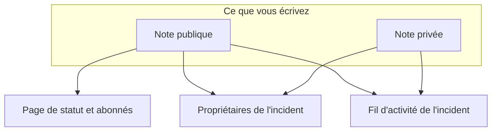

# Notes, propriétaires et fil d'incident

Chaque incident accumule une trace écrite pendant que vous le traitez : des mises à jour pour vos clients, des notes de travail pour votre équipe, et un fil d'activité de tout ce qui s'est passé. Cette page couvre la rédaction des notes publiques et privées, qui chacune atteint, le fil d'activité de l'incident, et les propriétaires informés de chaque changement.

:::cards
- [Publier une note publique](#publier-une-note-publique): Dites aux clients ce que vous savez, sur la page de statut et par notification.
- [Quand les abonnés sont notifiés](#quand-une-note-publique-atteint-vraiment-les-abonnés): Les vérifications que passe une note publique, et son badge.
- [Le fil d'activité de l'incident](#le-fil-dactivité-de-lincident): La chronologie de tout ce qui s'est passé.
- [Propriétaires](#propriétaires): Qui est responsable, et ce qu'on leur dit.
:::

## Comment ça marche

Une partie de ce que vous écrivez est destinée à vos clients — la mise à jour publiée sur la page de statut à 02 h 14 pour dire que vous avez trouvé le mauvais déploiement. Le reste est destiné à votre équipe — la pile d'appels que quelqu'un a collée, le graphique qui a enfin pris sens, la décision de basculer. OneUptime sépare ces deux publics, et consigne les deux sur l'incident.



Les **Notes publiques** sont publiées sur votre page de statut et peuvent notifier les abonnés. Les **Notes privées** (le modèle `IncidentInternalNote`) restent dans le tableau de bord. Sous les deux se trouvent le **Fil d'activité de l'incident**, une chronologie en ajout seul qui consigne tout ce qui est arrivé à l'incident, et la liste des **Propriétaires**, qui décide qui est prévenu.

Tout cela est accessible depuis le menu latéral de l'incident : **Notes → Notes publiques**, **Notes → Notes privées** et **Équipe → Propriétaires**. Le fil d'activité se trouve sur la page **Vue d'ensemble** de l'incident.

## Notes publiques et notes privées

Les deux types de notes se ressemblent dans le tableau de bord et se comportent très différemment.

|                               | Note publique                                                       | Note privée                                                     |
| ----------------------------- | ------------------------------------------------------------------- | --------------------------------------------------------------- |
| Modèle                        | `IncidentPublicNote`                                                | `IncidentInternalNote`                                          |
| Affichée sur les pages de statut | Oui, dans la chronologie de l'incident                           | Jamais — rien dans l'application des pages de statut ne les lit |
| Heure de publication          | `postedAt`, que vous pouvez définir vous-même                       | Aucune : horodatée et triée par `createdAt`                     |
| Notifie les abonnés           | Quand **Notifier les abonnés à la page de statut** est cochée       | Jamais : elle n'a aucun champ d'abonné                          |
| Pièces jointes accessibles par | Les visiteurs de la page de statut, via une route de la page de statut | Uniquement l'API authentifiée du tableau de bord           |
| Notifie les propriétaires     | Oui                                                                 | Oui                                                             |

**Ce que « privée » veut vraiment dire.** Cela veut dire « non publiée sur la page de statut » — pas « réservée à un groupe de personnes plus restreint ». Les rôles intégrés qui peuvent lire un incident lisent les deux types de notes, si bien que quiconque peut lire l'incident peut généralement lire ses notes privées ; dans un rôle personnalisé, ce sont des autorisations distinctes, **Read Incident Status Page Note** et **Read Incident Internal Note**. Si vous devez restreindre qui peut voir un incident tout court, utilisez l'indicateur **Incident privé** (`isPrivate`) sur l'incident lui-même, qui masque l'incident sur toutes les pages de statut et le limite aux utilisateurs propriétaires de l'incident, aux membres de ses équipes propriétaires, et aux administrateurs et propriétaires du projet.

**Les propriétaires voient les deux.** La tâche de notification des propriétaires interroge les notes publiques et privées ensemble. Une note privée est privée vis-à-vis de vos abonnés, pas des personnes qui interviennent.

| Si vous voulez…                                                  | Choisissez        |
| ---------------------------------------------------------------- | ----------------- |
| Dire aux clients ce que vous savez et quand vous en saurez plus  | **Note publique** |
| Antidater une mise à jour déjà envoyée ailleurs                  | **Note publique** |
| Consigner une hypothèse, une commande exécutée ou une impasse    | **Note privée**   |
| Joindre un dump mémoire ou une capture d'un tableau de bord interne | **Note privée** |

## Publier une note publique

:::steps
### Ouvrir les notes publiques

Ouvrez l'incident et choisissez **Notes → Notes publiques** dans son menu latéral. L'éditeur au-dessus des notes dit qui lira la note avant que vous la publiiez : **Public · Visible on your status page**.

### Rédiger la mise à jour

Rédigez la note en Markdown, ou partez de l'un de vos **Modèles** ou de **Rédiger avec l'IA**. Ajoutez des fichiers avec **Rattacher** si les abonnés doivent les voir.

### Décider qui est prévenu

Laissez **Notifier les abonnés à la page de statut** cochée pour notifier les abonnés, ou décochez-la pour publier discrètement. **Will notify**, en dessous, montre quelles pages de statut la note atteindra, et **Aperçu** montre l'e-mail qu'elles recevront.

### La publier

Cliquez sur **Post update**, ou appuyez sur Ctrl+Entrée (⌘+Entrée sur Mac). La note apparaît en haut de la liste, avec un badge qui suit sa notification.
:::

Le même éditeur s'ouvre dans une boîte de dialogue depuis **Ajouter une note publique** dans le menu **Actions** du fil d'activité de l'incident (voir [Le fil d'activité de l'incident](#le-fil-dactivité-de-lincident)) ; une note s'écrit donc de la même façon depuis l'un ou l'autre endroit.

| Contrôle                                    | Rôle                                                                                                                                          |
| ------------------------------------------- | --------------------------------------------------------------------------------------------------------------------------------------------- |
| La note                                     | Le corps, en Markdown. Obligatoire.                                                                                                           |
| **Modèles**                                 | Insère l'un de vos modèles de notes dans la note, après ce que vous avez déjà tapé. Voir [Modèles de notes](#modèles-de-notes).                 |
| **Rédiger avec l'IA**                       | Rédige la note à partir de l'incident, pour que vous la modifiiez. Voir [Générer une note avec l'IA](#générer-une-note-avec-lia).            |
| **Rattacher**                               | Des fichiers partagés avec les abonnés sur la page de statut. Facultatif.                                                                     |
| **Posted now**                              | L'heure de publication qu'indique la note : le moment où vous la publiez, sauf si vous choisissez ici une heure antérieure, dans votre fuseau horaire actuel. |
| **Notifier les abonnés à la page de statut** | Case à cocher. Cochée par défaut, sauf si l'incident a été déclaré sans notifier les abonnés — elle démarre alors décochée. Décochez-la pour publier discrètement. |

**Les incidents discrets restent discrets.** Si un incident a été déclaré avec **Notifier les abonnés de la page de statut** désactivé (ou comme incident privé), ses abonnés n'en ont jamais été informés ; une note publique ne devrait donc pas être la première chose qu'ils apprennent. Sur un tel incident, la case démarre décochée, avec une ligne en dessous qui explique pourquoi. Vous pouvez toujours la cocher pour notifier les abonnés de cette note. Les notes publiées sans choix explicite suivent la même règle : les notes Slack et Microsoft Teams, les workflows, et les requêtes d'API qui omettent `shouldStatusPageSubscribersBeNotifiedOnNoteCreated`. Un `true` ou un `false` explicite est toujours conservé. Les notes publiques des [événements de maintenance planifiée](/docs/status-pages/subscribers#événements-de-maintenance-planifiée) et des [épisodes d'incident](/docs/status-pages/subscribers) suivent une règle semblable, selon que l'événement ou l'épisode lui-même a notifié les abonnés à sa création ; rendre un épisode privé n'y change rien.

**Voir qui la note atteindra.** Tant que **Notifier les abonnés à la page de statut** est cochée, une ligne **Will notify** en dessous liste les pages de statut que la note atteindra, avec un nombre d'abonnés « jusqu'à » par canal, ainsi que les pages qui listent les moniteurs de l'incident mais ne seront pas prévenues, avec la raison. Quand personne ne sera prévenu, elle n'affiche rien, sauf si l'incident est masqué sur les pages de statut ou si la portée des pages de statut de l'incident en est la raison. Elle suit la portée des pages de statut de l'incident, si bien qu'une note sur un incident limité à deux pages de site indique qu'elle atteindra ces deux-là. Voir [Une page de statut par public](/docs/status-pages/one-status-page-per-audience).

**Voir ce qu'ils recevront.** À côté de la même case, **Aperçu** montre l'e-mail que recevront les abonnés de chacune de ces pages de statut pour la note que vous rédigez, ainsi que le modèle qu'il utilise et pourquoi. Le lien reste grisé tant que la note n'a pas de texte. **M'envoyer un test** envoie cet e-mail à l'adresse de votre propre compte, et à personne d'autre. Voir [Abonnés et annonces](/docs/status-pages/subscribers#incidents).

> [!TIP]
> **L'heure de publication est le véritable horodatage de la note.** Les pages de statut trient et affichent les notes publiques par `postedAt`, pas selon le moment où vous les avez tapées — si vous rattrapez sur la page de statut une mise à jour envoyée il y a 40 minutes, choisissez **Posted now** et indiquez quand elle a réellement eu lieu. Si une note arrive par l'API (`/api/incident-public-note`) sans heure, OneUptime y met l'heure actuelle.

Chaque note montre qui l'a écrite, son heure de publication, le Markdown rendu avec ses pièces jointes et, dans son en-tête, où en est sa notification aux abonnés. **Search notes…** trouve les notes d'après ce qu'elles disent, et le fil peut se lire du plus récent au plus ancien ou l'inverse.

## Publier une note privée

**Notes → Notes privées** est volontairement plus sobre. C'est le même éditeur, qui indique **Private · Only your team can see this**, avec la note, **Modèles**, **Rédiger avec l'IA** et **Rattacher** pour les fichiers destinés à l'équipe d'intervention. **Ajouter une note privée** dans le menu **Actions** du fil d'activité de l'incident l'ouvre dans une boîte de dialogue. Par l'API, les notes privées sont `/api/incident-internal-note`.

Pas d'heure de publication, pas de case pour les abonnés — la note est horodatée à sa création.

Les deux types de notes s'écrivent dans l'éditeur Markdown, qui imbrique les éléments de liste avec **Augmenter le retrait** et **Diminuer le retrait** — ou Tab et Maj+Tab — et conserve les listes, les liens et la mise en forme de ce que vous collez depuis Word, Google Docs ou une autre page OneUptime. Ctrl+Z reprend un retrait augmenté ou diminué, et en mode visuel les blocs et les collages que l'éditeur a insérés aussi, dans l'ordre de votre saisie. Un bloc de code copié depuis une note se recolle en bloc de code, et un mot copié depuis un bloc en code en ligne. Voir [Déclarer un incident](/docs/incidents/declaring-incidents#étape-1-détails-de-lincident).

## Pièces jointes des notes

Les deux types de notes acceptent des pièces jointes via le bouton **Rattacher** de l'éditeur, et les deux affichent sous le corps de la note une liste des pièces jointes avec un lien **Download attachment** par fichier.

Là où ils divergent, c'est sur qui peut récupérer le fichier :

- **Les pièces jointes des notes publiques** sont téléchargeables par les visiteurs de la page de statut via une route de la page de statut, avec la note elle-même.
- **Les pièces jointes des notes privées** ne sont accessibles que par l'API authentifiée du tableau de bord. Il n'existe aucune route de page de statut pour elles.

Les pièces jointes relèvent donc de la même décision public/privé que le texte de la note. Une image de chronologie destinée aux clients va dans une note publique ; un dump de configuration dans une note privée.

Les images suivent la même décision. Une image que vous collez ou déposez dans une note, ou que vous ajoutez avec **Importer une image**, est stockée dans le projet de l'incident et affichée dans la note, et qui peut la voir dépend de la note :

- **Dans une note privée** — ou dans une note publique avant sa publication — une image n'est montrée qu'aux membres du projet, connectés de la façon qu'exige le projet. Toute autre personne qui ouvre son adresse ne voit rien, comme s'il n'y avait pas d'image.
- **Dans une note publique**, une image est montrée à tous ceux qui peuvent voir la note : sur la page de statut, et dans les e-mails que reçoivent ses abonnés. Une note publique est montrée avec son incident, jamais sans lui : tant que l'incident est masqué sur les pages de statut ou privé, les images de ses notes ne sont, elles aussi, montrées qu'aux membres du projet.

Chaque fichier envoyé démarre privé, depuis le tableau de bord comme depuis l'API. Une image n'est visible par tout le monde que tant que quelque chose que montrent vos pages de statut la contient : une note publique tant que son incident, son épisode ou son événement de maintenance planifiée est affiché sur les pages de statut, une annonce à partir du moment où elle commence à s'afficher, la description de l'incident tant que l'incident est **Visible sur la page de statut** et non privé, son post-mortem une fois celui-ci publié là aussi, la description d'un épisode ou d'un événement de maintenance planifiée tant qu'il est affiché sur les pages de statut (jamais tant que l'épisode est privé), et les descriptions de vue d'ensemble, de groupe et de ressource propres à la page de statut. Quand cela cesse — l'incident est masqué ou rendu privé, l'image est retirée du texte, la note ou l'incident est supprimé — l'image redevient privée, sauf si autre chose que montrent vos pages de statut la contient encore. La description et le message de remerciement d'un formulaire montrent leurs images à tout le monde de la même façon, tant que le formulaire accepte des envois.

Lire une note par l'API, Terraform ou un workflow ne liste que les pièces jointes que le lecteur peut ouvrir : les fichiers du projet de la note, et les fichiers publics. Une pièce jointe qu'une note désigne dans un autre projet est omise de la liste, comme si la note ne l'avait pas.

## Générer une note avec l'IA

L'éditeur a un bouton **Rédiger avec l'IA**, sur les deux pages de notes et dans les boîtes de dialogue **Ajouter une note publique** et **Ajouter une note privée** du fil d'activité. Il envoie l'incident au fournisseur d'IA de votre projet et dépose le Markdown généré dans la note, où vous le modifiez avant de publier — rien n'est publié automatiquement.

| Boîte de dialogue                               | Ce qu'elle rédige                                                    | Modèles                                                           |
| ----------------------------------------------- | -------------------------------------------------------------------- | ----------------------------------------------------------------- |
| **Générer une note publique avec l'IA**         | Une note destinée aux clients, à partir d'une analyse des données de l'incident. | **Status Update**, **Resolution Notice**, **Maintenance Update** |
| **Générer une note privée avec l'IA**           | Une note technique interne.                                          | **Investigation Update**, **Technical Analysis**, **Shift Handoff** |

Derrière le bouton, le tableau de bord envoie une requête à `/incident/generate-note-from-ai/{incidentId}` avec le modèle choisi et un type de note `public` ou `internal`.

Ce qui est envoyé, c'est le texte de l'incident. Une image ou un fichier qui y est intégré — une capture d'écran collée dans la description, par exemple — est remplacé par une courte mention comme `[image omitted: PNG, 340 KB]`, et chaque champ de texte est coupé à 16 000 caractères, si bien qu'un seul gros collage n'évince jamais le reste. L'incident lui-même garde ses images.

## Modèles de notes

Si votre équipe écrit les trois mêmes mises à jour à chaque panne, enregistrez-les une fois. Le menu **Modèles** de l'éditeur les liste, sur les deux pages de notes et dans les boîtes de dialogue de notes du fil d'activité, et en choisir un l'insère dans la note.

Les modèles sont partagés entre notes publiques et privées : une seule liste de modèles sert les deux, et le même modèle peut être inséré dans l'un ou l'autre type de note.

Les variables d'un modèle — `{{incident.title}}`, `{{incident.state}}`, `{{incident.customFields.impact}}` et les autres listées sous [Modèles de notes](/docs/incidents/settings#modèles-de-notes) — sont remplies avec les valeurs actuelles de l'incident quand vous le choisissez, sur les pages de notes comme dans les boîtes de dialogue **Prendre en compte** et **Résoudre**. Ce que vous aviez déjà tapé n'est jamais modifié, et une variable sans valeur reste telle qu'elle est écrite.

> [!IMPORTANT]
> Relisez la note remplie avant d'en publier une publique : `{{incident.affectedStatusPages}}` nomme chaque page de statut que l'incident atteint, et les abonnés de toutes ces pages la lisent.

Vous les gérez dans **Incidents → Paramètres → Modèles de notes** — la carte s'intitule **Modèles de notes publiques ou privées pour les incidents** et son formulaire tient sur une page : **Nom du modèle** et **Description du modèle**, tous deux obligatoires, puis le corps. Tant que vous n'en avez aucun, le menu **Modèles** le dit et renvoie vers cette page.

## Publier des notes depuis Slack ou Microsoft Teams

Si vous avez connecté un espace de travail, les intervenants n'ont jamais à quitter le canal. Slack et Microsoft Teams proposent tous deux une action d'ajout de note qui ouvre une boîte de dialogue avec une liste déroulante **Note Type** — **Public Note** (publiée sur la page de statut) ou **Private Note** (visible seulement des membres de l'équipe) — et une zone de texte **Note**, et qui écrit le résultat directement sur l'incident.

Trois détails à connaître :

- **Protection contre les doublons** — chaque note enregistre le message Slack dont elle provient (`postedFromSlackMessageId`, au format `channel_id:message_ts`), si bien que plusieurs personnes réagissant au même message produisent une note, pas cinq.
- **Les notes font écho** — publier l'un ou l'autre type de note pousse aussi un message dans le canal d'incident connecté, car l'élément de fil d'activité de la note est créé avec la notification de l'espace de travail activée.
- **Publiée au nom de la personne qui l'a demandée** — une note issue de la boîte de dialogue ou d'une réaction est publiée avec les autorisations OneUptime de cette personne ; il lui faut donc l'autorisation de publier ce type de note sur l'incident. En cas de refus, on lui dit pourquoi — dans un message direct sur Slack, et dans la conversation sur Microsoft Teams (dans le fil du message, pour une réaction) — et rien n'est publié.

## Quand une note publique atteint vraiment les abonnés

Créer une note publique avec **Notifier les abonnés de la page de statut** cochée ne garantit pas à lui seul qu'un e-mail part. La note doit franchir une chaîne de vérifications, et chaque échec consigne une raison précise au lieu de lever une erreur :

```mermaid title="Les vérifications que passe une note publique avant que les abonnés en soient informés"
flowchart TB
    note["Note publique publiée"] --> box{"Case Notifier cochée ?"}
    box -->|Non| skipped["Abonnés non notifiés"]
    box -->|Oui| incident{"Incident sur des pages de statut ?"}
    incident -->|Non| skipped
    incident -->|Oui| pages{"Page dans la portée ?"}
    pages -->|Non| skipped
    pages -->|Oui| prefs{"Abonné inscrit ?"}
    prefs -->|Oui| sent["Message envoyé"]
```

1. **Notifier les abonnés de la page de statut** doit être cochée. Sinon, la note est marquée comme ignorée dès sa création. Elle démarre décochée sur les incidents déclarés sans notifier les abonnés.
2. La note doit appartenir à un incident qui existe toujours.
3. L'incident doit avoir au moins un moniteur rattaché — sans moniteur, il n'y a aucune ressource de page de statut vers laquelle acheminer la note.
4. L'indicateur **Visible sur la page de statut** (`isVisibleOnStatusPage`) de l'incident doit être vrai, et l'incident ne doit pas être privé (`isPrivate`). Un incident privé est masqué sur toutes les pages de statut, quoi que dise l'indicateur — voir [Garder un incident hors de la page de statut](/docs/incidents/states-and-severities#garder-un-incident-hors-de-la-page-de-statut).
5. Chaque page de statut que l'incident atteint doit avoir **Afficher les incidents** (`showIncidentsOnStatusPage`) activé. Les pages qu'il atteint sont celles qui listent ses moniteurs, restreintes aux pages auxquelles l'incident est limité, s'il y en a. Un incident qui n'est limité à aucune page ignore les pages qui n'affichent que les incidents qui leur sont limités. Voir [Une page de statut par public](/docs/status-pages/one-status-page-per-audience).
6. Chaque abonné doit satisfaire ses propres préférences — ne pas être désabonné, et être abonné à cette ressource et au type d'événement `Incident` là où la page laisse les abonnés choisir.

> [!NOTE]
> **Les notifications ne sont pas instantanées.** La tâche qui les envoie s'exécute une fois par minute ; attendez-vous donc à environ une minute au plus entre l'enregistrement de la note et le départ du courrier. C'est ce que veut dire **Notification prochaine des abonnés** sur une note, et **Sending Soon** sur les notifications propres de l'incident.

L'en-tête d'une note publique suit tout le parcours avec un badge. Cliquez dessus pour voir le message de statut de la notification, qui dit ce qui s'est passé :

| Badge                                     | Ce que cela veut dire                                                                                                                             |
| ----------------------------------------- | ------------------------------------------------------------------------------------------------------------------------------------------------- |
| **Subscribers not notified**              | Rien n'a été envoyé : la note a été publiée avec **Notifier les abonnés de la page de statut** décochée, ou l'une des barrières ci-dessus s'est fermée. La raison est consignée. |
| **Notification prochaine des abonnés**    | En file d'attente, en attente de la prochaine exécution de la tâche d'envoi.                                                                      |
| **Notification des abonnés**              | La tâche parcourt la liste des abonnés.                                                                                                           |
| **Subscribers notified**                  | Le message de chaque abonné a été envoyé. Le message de statut indique, par page de statut, combien sont partis sur chaque canal.                 |
| **Échec de la notification**              | Tous les abonnés ne l'ont pas reçu, ou la tâche s'est arrêtée sur une erreur. Le message de statut dit lequel des deux.                           |

**Envoyé veut dire envoyé.** La tâche attend chaque message : un e-mail ou un SMS compte comme envoyé dès que le serveur de messagerie ou le fournisseur de SMS l'a pris en charge, et un message Slack, Microsoft Teams ou webhook dès que l'autre bout a répondu. Un message refusé, en erreur, ou sans réponse sous 4 minutes compte comme en échec, et un seul échec fait passer le badge à **Échec de la notification** ; les autres abonnés le reçoivent tout de même. Le message de statut ressemble alors à `Not every subscriber was sent this notification: 2 of 61 messages failed. Site 03: 41 email sent. Site 07: 16 email, 2 SMS sent; 2 email failed.` « Envoyé » s'arrête là où OneUptime peut voir : un serveur de messagerie peut encore renvoyer un e-mail plus tard.

:::details Grandes pages et longs envois
Les abonnés d'une page de statut sont lus 10 000 à la fois jusqu'à ce que chacun ait été atteint, et 20 messages sont en vol en même temps. Une notification cesse de lancer de nouveaux messages au bout de 20 minutes : ce qu'elle n'a pas atteint d'ici là est listé, et elle est marquée **Échec de la notification**. Un envoi interrompu en cours de route — son serveur a redémarré ou a cessé de répondre — est lui aussi marqué **Échec de la notification**, avec un message commençant par `Interrupted:`, une fois qu'il est en **Notification des abonnés** depuis 40 minutes, pour qu'il n'y reste jamais indéfiniment. Voir [Abonnés et annonces](/docs/status-pages/subscribers).
:::

### Renvoyer la notification d'une note

Cliquez sur le badge de notification d'une note pour voir ce qui s'est passé. Une note dont la notification a échoué propose **Réessayer la notification**, et une note dont la notification est partie propose **Renvoyer la notification**. Les deux demandent d'abord confirmation : la confirmation liste les pages de statut que la note atteindrait maintenant, avec un nombre « jusqu'à » par canal, ou dit qu'elle n'atteindrait personne, et explique ce qui va se passer. L'une comme l'autre remet la note en attente pour que la prochaine exécution la prenne, et l'envoie à chaque page de statut que l'incident atteint maintenant, y compris aux abonnés qui l'ont déjà reçue. Si vous avez changé les pages auxquelles l'incident est limité depuis la publication de la note, elle part vers les pages auxquelles il est limité maintenant. Une note publiée avec **Notifier les abonnés de la page de statut** décochée ne propose ni l'une ni l'autre, car elle n'a jamais été destinée à être envoyée, et aucune n'est proposée tant qu'une notification est encore en file d'attente ou en cours d'envoi. Les notes publiques des événements de maintenance planifiée et des épisodes d'incident ne gardent **Réessayer la notification** qu'après un échec.

Renvoyer la notification d'une note dit à chaque abonné ce que dit la note, exactement comme sa publication ; cela demande donc l'autorisation de publier des notes publiques qui notifient les abonnés en plus de l'autorisation de modifier les notes publiques. Par l'API, c'est la même mise à jour que fait le tableau de bord, en remettant `subscriberNotificationStatusOnNoteCreated` à `Pending` ; elle est refusée pour un appelant sans ces autorisations, pour une note publiée sans notifier les abonnés, et pendant l'envoi de la notification de la note.

:::details Comment reprend la notification « créé » de l'incident
Seule la notification « créé » de l'incident reprend là où elle s'est arrêtée : elle garde une trace des pages de statut auxquelles elle a tout envoyé, et **Réessayer** sur la **Vue d'ensemble** de l'incident les ignore. La trace est tenue par page de statut, pas par abonné ; une page sur laquelle elle s'est arrêtée en cours de route reçoit donc de nouveau l'envoi complet, y compris pour les abonnés de cette page qui l'avaient déjà reçu. La confirmation de **Réessayer** propose **La renvoyer à chaque page de statut, y compris les pages déjà atteintes**, ce qui la transforme en **Renvoyer à toutes les pages**, et **Renvoyer** après un succès l'envoie de nouveau à chaque page. Voir [Une page de statut par public](/docs/status-pages/one-status-page-per-audience#adding-status-pages).
:::

### Modifier une note publique

**Modifier une note publique se fait en silence, sauf si vous le demandez.** Le formulaire de modification de la note a une case **Notifier les abonnés de cette mise à jour**, décochée à chaque fois. Cochez-la pour un changement dont les abonnés doivent être informés et ils reçoivent la note modifiée, marquée comme mise à jour ; la note affiche alors un second badge pour la mise à jour à côté du badge d'origine, avec son propre **Réessayer la notification** après un échec :

| Badge de mise à jour                | Ce que cela veut dire                                 |
| ----------------------------------- | ----------------------------------------------------- |
| **Mise à jour en file d'attente**   | En attente de la prochaine exécution de la tâche d'envoi. |
| **Envoi de la mise à jour**         | La tâche parcourt la liste des abonnés.               |
| **Mise à jour envoyée**             | Chaque abonné a reçu la note modifiée.                |
| **Échec de la mise à jour**         | Tous les abonnés ne l'ont pas reçue.                  |
| **Mise à jour non envoyée**         | L'une des barrières ci-dessus l'a arrêtée.            |

Une mise à jour envoyée n'est pas reproposée : modifiez la note avec la case cochée pour envoyer le dernier texte, ou renvoyez la note elle-même. Si la notification d'origine n'est pas encore partie, aucune mise à jour distincte n'est envoyée — l'original porte la modification. Si elle est en cours d'envoi à ce moment-là, la mise à jour attend qu'elle se termine puis part. La case et le **Réessayer la notification** de la mise à jour demandent les mêmes autorisations que le renvoi de la notification de la note ; sans elles, vous pouvez toujours modifier la note, sans notifier personne. Voir [Abonnés et annonces](/docs/status-pages/subscribers).

Le message que reçoivent réellement les abonnés est construit à partir d'un modèle par page de statut et par canal — e-mail, SMS, Slack et Microsoft Teams ont chacun leur propre modèle pour l'événement **Subscriber Incident Note Created**, avec des variables pour le nom et l'URL de la page de statut, le lien de détails, les ressources affectées, la gravité et le titre de l'incident, le corps de la note, les étiquettes de l'incident, ses pages de statut affectées et ses champs personnalisés, et un lien de désabonnement propre à chaque abonné. Les messages par défaut par e-mail, Slack et Microsoft Teams listent aussi les champs personnalisés de l'incident marqués **Inclure dans les notifications aux abonnés**, avec leurs valeurs actuelles. Voir [Abonnés et annonces](/docs/status-pages/subscribers) pour la configuration de ces modèles et de ces canaux.

## Le fil d'activité de l'incident

La carte **Fil d'activité de l'incident** se trouve en bas de la colonne de gauche de la page **Vue d'ensemble** de l'incident. C'est l'histoire de l'incident dans l'ordre : chaque élément est une icône, l'avatar et le nom de qui l'a provoqué, un horodatage relatif avec l'heure locale exacte au survol, et un corps en Markdown. Par défaut, les éléments les plus récents sont en haut.

Certains éléments portent des détails supplémentaires — une notification aux propriétaires liste toutes les personnes à qui un message a été envoyé, par exemple, et une notification aux abonnés liste chaque page de statut à laquelle elle est allée, avec le nombre de messages envoyés et en échec sur chaque canal et l'objet sous lequel son e-mail est parti, suivi, quand elle en a envoyé, des valeurs de champs personnalisés qu'elle a placées dans un message, sous **Custom fields sent**. Ceux-là affichent un bouton **Plus d'informations** qui ouvre un panneau **Plus d'informations**.

L'en-tête de la carte a aussi un menu **Actions** pour agir sans quitter la chronologie :

- **Exécuter le runbook** — lance un [runbook](/docs/runbooks/index) sur cet incident.
- **Exécuter la politique d'astreinte** — alerte une politique à la demande. Une politique archivée n'alerte personne : son journal d'exécution sur l'incident indique qu'elle n'a pas été exécutée parce que la politique est archivée.
- **Ajouter une note publique** — l'éditeur de la page **Notes publiques**, dans une boîte de dialogue : rédigez la note, puis **Post update**. Les modèles, **Rédiger avec l'IA**, les pièces jointes, **Notifier les abonnés à la page de statut** avec qui elle atteindra, et **Aperçu** sont tous là. La note est publiée maintenant ; pour l'antidater, choisissez **Posted now**.
- **Ajouter une note privée** — l'éditeur de la page **Notes privées**, dans une boîte de dialogue : rédigez la note, puis **Add note**.

Les deux actions de note sont verrouillées, avec le nom de l'autorisation manquante, pour une personne qui ne peut pas écrire de notes. Une fois une note publiée, la boîte de dialogue se ferme et le fil l'affiche.

Tout le reste se trouve derrière le bouton **⋯** à côté, le même bouton **Plus d'options** que l'en-tête de carte d'un tableau, pour que l'en-tête affiche le moins de boutons possible :

- **Plus récents d'abord** / **Plus anciens d'abord** — l'ordre de lecture du fil. Une coche marque celui en usage, et votre navigateur retient le choix pour le fil de chaque incident.
- **Filtrer par type d'événement** — une boîte de dialogue qui liste les types d'événements du fil, chacun avec l'icône que portent ses éléments, et un champ de recherche quand la liste est longue. Cochez ceux à afficher et choisissez **Appliquer les filtres** ; sans rien de coché, tous les types d'événements s'affichent. Tant que le fil est filtré, un encadré au-dessus indique combien de types d'événements il montre, avec une puce pour chacun, **Modifier les filtres** et **Effacer les filtres**. Le filtre n'est pas enregistré : quittez l'incident et son fil affiche de nouveau tout.
- **Actualiser** — recharge le fil.

> [!NOTE]
> **Le fil est en ajout seul, et ce n'est pas votre journal d'audit.** L'API permet de créer et de lire des éléments du fil mais pas de les modifier ni de les supprimer, si bien que personne ne peut réécrire discrètement l'histoire d'un incident. Il n'est pas permanent non plus : sur les installations facturées, les lignes du fil de plus de trois ans sont supprimées. Pour une trace durable de qui a changé quoi, utilisez **Avancé → Journaux d'audit** dans le menu latéral de l'incident.

## Ce que consigne le fil

Les éléments du fil sont écrits par le service des incidents lui-même, par les deux services de notes, par la chronologie d'état, par les changements de propriétaires et de membres, par la liaison et la dissociation d'alertes, par les moteurs de règles, par l'exécution d'astreinte, par les exécutions d'investigation et de post-mortem de l'IA, et par les tâches planifiées de notification. Les types d'événements couvrent :

- **L'incident lui-même** — `IncidentCreated`, `IncidentUpdated`, `IncidentStateChanged`. Une entrée `IncidentUpdated` consigne ce qu'une modification a changé : le titre, la description, la cause racine, les notes de remédiation, les étiquettes, la gravité, les moniteurs et le statut qui leur est appliqué, et les pages de statut ajoutées à la portée de l'incident ou retirées. Elle a une ligne pour chaque valeur qui a changé et aucune pour une valeur enregistrée telle quelle, si bien qu'enregistrer une carte sans rien changer, ou un client d'API ou un workflow qui réécrit l'incident tel qu'il est, n'ajoute aucune entrée. Un texte qui se lit pareil est le même (fins de ligne et espaces autour mis à part), et des étiquettes sont les mêmes si l'ensemble est le même dans n'importe quel ordre ; une valeur effacée se lit comme retirée, et retirer toutes les étiquettes comme « All labels removed. ». Les entrées **Alert updated** d'une alerte fonctionnent de la même façon.
- **Notes et comptes rendus** — `PublicNote`, `PrivateNote`, `RootCause`, `RemediationNotes`, `PostmortemNote`. Un élément `PostmortemNote` est écrit quand la note du post-mortem change, pas à chaque enregistrement du post-mortem.
- **Personnes** — `OwnerUserAdded`, `OwnerTeamAdded`, `OwnerUserRemoved`, `OwnerTeamRemoved`, `IncidentMemberAdded`, `IncidentMemberRemoved`.
- **Alertes liées** — `AlertLinked` et `AlertUnlinked`, affichées comme **Alerte liée** et **Alerte dissociée**.
- **Notifications** — `OwnerNotificationSent`, `SubscriberNotificationSent`, `OnCallPolicy`, `OnCallNotification`.
- **Automatisation** — `LabelRuleExecuted`, `OwnerRuleExecuted`, `PrivacyRuleExecuted`, `OnCallRuleExecuted`, `AutoRemediation`.
- **Appels vidéo** — `VideoCallStarted` et `VideoCallFailed` : un appel démarré pour l'incident, avec son lien pour rejoindre, ou la raison pour laquelle un fournisseur n'a pas pu en démarrer un. Voir [Appels vidéo](/docs/workspace-connections/video-calls).

Chaque type a sa propre icône, si bien que vous pouvez parcourir un long fil et repérer les changements d'état au milieu du bavardage. L'analyse de cause racine générée par l'IA est marquée distinctement et rendue dans un mode Markdown restreint. L'élément **Incident créé**, l'élément qui consigne un nouveau titre et les éléments d'entrée ou de sortie d'un épisode affichent un titre exactement tel qu'il a été saisi : ils échappent `\`, `[`, `]`, `*`, `_`, `~`, les accents graves et \< dans le titre, si bien qu'un titre ne peut pas devenir une image, du HTML brut, une mention Slack comme \<!here\>, un lien dont le texte cache sa destination, ni du gras, de l'italique ou du code. Une adresse dans un titre s'affiche toujours comme un lien vers cette même adresse.

La liaison d'une alerte est aussi consignée sur l'alerte. Les alertes ont leur propre fil, où le même changement apparaît comme **Liée à un incident** (`LinkedToIncident`) ou **Dissociée d'un incident** (`UnlinkedFromIncident`), en nommant l'incident. Seules les entrées **Alerte liée** et **Alerte dissociée** de l'incident sont publiées dans Slack et Microsoft Teams, si bien que chaque liaison est annoncée une fois. Un incident déclaré à partir d'alertes reçoit une seule entrée **Alerte liée** qui les liste toutes au lieu d'une par alerte, et le titre d'une alerte ou d'un incident privé est omis de l'entrée de l'autre côté. Voir [Alertes liées](/docs/incidents/linked-alerts).

Les fils respectent la confidentialité des incidents : pour les incidents privés, les lectures du fil sont filtrées de la même façon que l'incident.

## Propriétaires

Les propriétaires sont les personnes et les équipes responsables d'un incident. Ce sont eux que visent les notifications de tout ce qui lui arrive — et ce sont eux qui font qu'un incident ne passe pas inaperçu pendant que chacun suppose qu'un autre s'en occupe.

Ouvrez **Équipe → Propriétaires** dans le menu latéral de l'incident. La carte **Propriétaires** affiche un badge de compteur et décrit les propriétaires comme les personnes et équipes responsables de cet incident, notifiées des changements, avec un décompte du type « 2 people · 1 team ». Les propriétaires s'affichent en avatars superposés ; en survoler un montre l'e-mail de la personne ou indique que l'entrée est une **Équipe**.

- Cliquez sur **Ajouter un propriétaire** pour ouvrir un sélecteur avec un champ de recherche de personnes ou d'équipes.
- Cliquez sur le contrôle de retrait d'un avatar pour ouvrir la confirmation **Supprimer le propriétaire**, puis sur **Supprimer**.
- Tant qu'il n'y a aucun propriétaire, la carte le dit et vous invite à ajouter un coéquipier ou une équipe pour qu'ils soient notifiés des changements.

Les utilisateurs propriétaires et les équipes propriétaires sont des enregistrements distincts — ajouter une équipe fait de chaque membre de cette équipe un propriétaire pour les notifications, sans les lister un par un. Par l'API, ce sont `/api/incident-owner-user` et `/api/incident-owner-team`.

Seules les équipes et les membres de votre propre projet peuvent être propriétaires. Le sélecteur ne propose qu'eux, et les propriétaires ajoutés par l'API, Terraform ou un workflow y sont soumis aussi : une équipe d'un autre projet, ou une personne qui n'est pas membre du projet, est refusée.

## Comment les propriétaires sont attribués

Quatre chemins mènent à la liste des propriétaires :

- **Depuis un modèle d'incident** — les modèles portent un champ **Propriétaires** : les personnes et les équipes propriétaires de l'incident, qui seront notifiées quand il est créé ou mis à jour, choisies dans la même liste qu'**Ajouter un propriétaire**. Créer un incident à partir du modèle les préremplit, et ils sont ajoutés une fois que les canaux Slack et Microsoft Teams de l'incident existent, si bien qu'une règle de notification qui invite les propriétaires d'incident dans un nouveau canal les invite aussi. Le tableau de bord, et l'étape **Create One Incident** d'un workflow avec un **Incident Template** choisi, les ajoutent sans la notification « vous avez été ajouté » ; un [formulaire](/docs/forms/on-submit) avec un modèle les notifie, et retient la notification **Incident créé** de l'incident jusqu'à ce qu'ils soient ajoutés. Voir [Déclarer un incident](/docs/incidents/declaring-incidents).
- **Depuis les règles de propriétaire des incidents** — les règles correspondantes ajoutent des propriétaires automatiquement à la création.
- **À la création par l'API** — les utilisateurs et équipes propriétaires passés avec l'appel de création sont ajoutés de la même façon, une fois les canaux créés, et sans la notification « vous avez été ajouté ».
- **À la main** — le contrôle **Ajouter un propriétaire** de la page **Propriétaires**, à tout moment de l'incident.

Ajouter deux fois la même personne est sans risque ; les propriétaires déjà attribués ne sont pas dupliqués.

## Règles de propriétaire des incidents

Les **Règles de propriétaire des incidents** attribuent automatiquement des utilisateurs et des équipes propriétaires quand des incidents correspondants sont créés — la couche d'acheminement qui fait qu'un incident de base de données arrive à l'équipe base de données sans que personne n'y pense. Vous les trouvez dans **Incidents → Règles → Règles de propriétaire**, avec le reste de l'automatisation des incidents, couverte dans [Paramètres et automatisation des incidents](/docs/incidents/settings).

Le formulaire de règle a deux étapes — **Correspondance**, les conditions qu'un incident doit remplir, puis **Propriétaires**, ce que la règle ajoute :

- **Propriétaires** — **Ajouter un propriétaire** ouvre une liste unique de personnes et d'équipes ; cliquez sur chacune pour l'ajouter, et retirez un choix avec le **×** de sa puce. Quand la règle correspond, chaque personne et équipe choisie est ajoutée comme propriétaire, et les propriétaires déjà attribués ne sont pas dupliqués.
- **Hériter des propriétaires**, replié sous **Propriétaires** — attribue les propriétaires à partir d'entités liées au lieu de les nommer. **Hériter des propriétaires des moniteurs** fait de chaque propriétaire des moniteurs de l'incident un propriétaire de l'incident, et **Hériter des propriétaires des hôtes**, **Hériter des propriétaires des clusters Kubernetes**, **Hériter des propriétaires des hôtes Docker**, **Hériter des propriétaires des hôtes Podman** et **Hériter des propriétaires des services** font de même pour ces ressources.

Une nouvelle règle doit ajouter quelqu'un : choisissez au moins un propriétaire, ou activez un interrupteur **Hériter des propriétaires**. L'API et Terraform refusent aussi une nouvelle règle qui n'ajoute personne. Son **Nom** est rempli à partir des propriétaires que vous choisissez — ou, pour une règle qui ne fait qu'hériter, à partir de ses interrupteurs (_Inherit owners from monitors_) — jusqu'à ce que vous tapiez un nom à vous. Modifier une règle n'exige jamais de propriétaires, si bien qu'une ancienne règle qui n'ajoute rien peut toujours être renommée ou désactivée ; la liste la marque **N'ajoute rien**. Voir [Règles d'étiquettes et de propriétaires](/docs/configuration/label-and-owner-rules).

**Notifier les propriétaires**, sous **Plus de champs**, décide si les personnes sont prévenues. Laissez-le activé pour un véritable acheminement ; désactivez-le pour ajouter des propriétaires en silence — utile quand une règle est une commodité de suivi plutôt qu'une alerte.

Chaque exécution de règle est écrite dans le fil d'activité de l'incident, si bien que vous pouvez toujours savoir si une personne a été ajoutée par une règle ou par un humain.

## Ce dont les propriétaires sont notifiés

Cinq tâches notifient les propriétaires, chacune s'exécutant une fois par minute :

| Notification                  | Quand                                                        | Objet de l'e-mail                                              |
| ----------------------------- | ------------------------------------------------------------ | -------------------------------------------------------------- |
| **Incident créé**             | L'incident est déclaré.                                      | `[New Incident {number}] - {title}`                            |
| **Une note a été publiée**    | Une note publique *ou* privée est publiée.                   | `[Update Incident {number}] - {title}`                         |
| **L'état a changé**           | L'incident passe à un autre état.                            | `[{State} Incident {number}] - {title}`                        |
| **Vous avez été ajouté**      | Vous êtes ajouté comme propriétaire.                         | `You have been added as the owner of Incident {number} - {title}` |
| **Toujours non résolu**       | Un rappel, piloté par l'heure du prochain rappel de l'incident. | `[Reminder] Incident {number} is still {state} - {title}`   |

Chaque notification part sur les canaux que la personne a activés dans **Paramètres utilisateur → Paramètres de notification** — e-mail, SMS, appel vocal, push, WhatsApp, Telegram, Slack, Microsoft Teams ou webhook — qui décident de ce qui est réellement envoyé. Chaque destinataire peut désactiver chacune individuellement — les réglages par utilisateur sont formulés comme l'envoi des notifications d'incident créé, de note publiée, de changement d'état, d'ajout de propriétaire, d'affectation de membre et de rappel tant que l'incident est ouvert. Quelqu'un qui ne veut qu'un appel pour les changements d'état peut avoir exactement cela. Voir [États et sévérités des incidents](/docs/incidents/states-and-severities) pour ce que signifie un changement d'état.

**Les incidents sans propriétaire ne sont pas muets.** Si un incident n'a aucun propriétaire, les tâches de notification se rabattent sur les propriétaires du projet, pour que rien ne se perde. La notification **Incident créé** d'un incident signalé via un formulaire dont le modèle a des propriétaires attend ces propriétaires à la place. Chaque personne notifiée est aussi ajoutée à l'élément de fil correspondant, si bien que vous pouvez voir ensuite exactement qui a été prévenu et à quelle adresse.

## Étapes suivantes

:::cards
- [Paramètres et automatisation des incidents](/docs/incidents/settings): Règles de propriétaire, modèles de notes et le reste de l'automatisation.
- [Abonnés et annonces](/docs/status-pages/subscribers): Où finissent les notes publiques et qui les reçoit.
- [Une page de statut par public](/docs/status-pages/one-status-page-per-audience): Quelles pages de statut atteignent les notes d'un incident.
- [États et sévérités des incidents](/docs/incidents/states-and-severities): La machine à états qui alimente la moitié du fil.
:::
