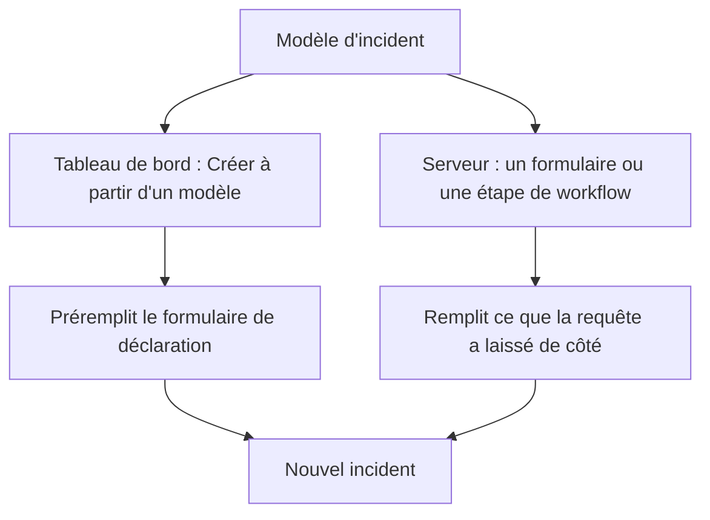
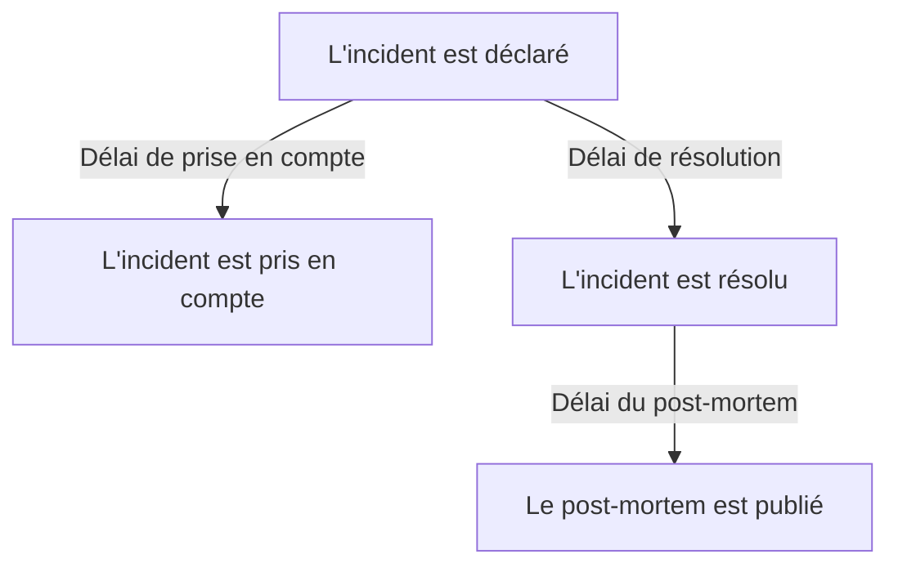

# Paramètres et automatisation des incidents

La configuration des incidents se trouve dans **Incidents**, pas dans **Paramètres du projet** : les états et les gravités, les modèles, les champs personnalisés, les rôles, les mesures et les préfixes de numéro, ainsi que les règles qui agissent sur chaque nouvel incident. Cette page est la référence de chacune de ces pages, et de ce qui s'exécute de lui-même dès qu'un incident est déclaré.

:::cards
- [Modèles d'incident](#modèles-dincident): Déclarez le même type d'incident, prérempli, à chaque fois.
- [Champs personnalisés](#champs-personnalisés): Vos propres champs sur chaque incident, demandés à sa déclaration.
- [Mesures](#mesures): Le délai de prise en compte, de résolution ou d'atténuation, calculé pour chaque incident.
- [Règles](#les-règles-qui-sexécutent-à-la-création-dun-incident): Propriétaires, étiquettes, alertes et épisodes, définis automatiquement.
:::

## Où se trouvent les paramètres des incidents

Ouvrez **Incidents** depuis le menu **Produits** de la barre supérieure, puis dépliez **Paramètres** en bas de son menu latéral. **Règles** et **Paramètres** démarrent tous deux repliés ; dépliez-les donc avant que les pages ci-dessous n'apparaissent. Tout ici est propre au projet : les modèles, les rôles, les champs personnalisés et les règles appartiennent à un projet et s'appliquent à chaque incident qui y est déclaré, sur des routes commençant par `/dashboard/{projectId}/incidents/settings/`.

| Page                          | Ce que vous y faites                                                                               |
| ----------------------------- | -------------------------------------------------------------------------------------------------- |
| **État de l'incident**        | Ajouter, renommer, recolorer et réordonner les états par lesquels passe un incident.               |
| **Gravité de l'incident**     | Ajouter, renommer, recolorer et réordonner les niveaux de gravité.                                 |
| **Modèles d'incident**        | Préremplir tout un incident — titre, description, ressources, politiques d'astreinte, propriétaires, étiquettes. |
| **Modèles de notes**          | Du texte réutilisable pour les notes publiques et privées.                                         |
| **Modèles de post-mortem**    | Des structures de post-mortem réutilisables.                                                       |
| **Champs personnalisés**      | Définir des champs supplémentaires qui apparaissent sur chaque incident.                           |
| **Rôles d'incident**          | Définir les rôles auxquels vous affectez les intervenants, comme Responsable d'incident.            |
| **Mesures**                   | Mesurer combien de temps prennent les choses, comme le délai de prise en compte ou de résolution, sur chaque incident. |
| **Alertes liées**             | Choisir si les alertes liées à un incident sont prises en compte et résolues avec lui. Les deux sont activés pour les nouveaux projets. |
| **Préfixe de numéro**         | Le texte devant les numéros d'incident et d'épisode, comme `INC-` dans `INC-42`.                   |

Ce que OneUptime AI fait de lui-même ne se règle pas ici : il a sa propre section, **Incidents → IA**, sur des routes commençant par `/dashboard/{projectId}/incidents/ai/`. Sa page **Paramètres** active ou désactive l'examen des nouveaux incidents, leur correction automatique (désactivée jusqu'à ce que vous l'activiez) — avec, rangées dessous, les pull requests de correction et de télémétrie manquante qui font partie de la correction — et les brouillons de post-mortem, chacun s'enregistrant dès que vous le basculez ; les règles d'investigation et les règles de remédiation automatique qui restreignent les incidents examinés et corrigés, ainsi que les limites facultatives dans lesquelles l'IA travaille, sont repliées sous **Plus de paramètres**, et aucune ne s'applique tant que vous ne la définissez pas. **Analyses** et **Journaux** se trouvent à côté : ce que l'IA a appris de vos incidents, et tout ce qu'elle a fait. Voir [AI SRE](/docs/ai/ai-sre).

**État de l'incident** et **Gravité de l'incident** sont traités en détail dans [États et sévérités des incidents](/docs/incidents/states-and-severities) — le reste de cette page reprend à partir de **Modèles d'incident**. Les formulaires qui permettent à des personnes extérieures à votre équipe de signaler des incidents sont un produit à part entière : voir [Formulaires](/docs/forms/index). Les outils qui ouvrent des incidents d'eux-mêmes, comme [Huntress](/docs/integrations/huntress), se configurent sous **Incidents → Intégrations**.

Dépliez **Règles** et vous obtenez huit pages de plus : **Règles de regroupement**, **Règles d'astreinte**, **Règles de propriétaire**, **Règles de runbook**, **Règles de confidentialité**, **Règles d'étiquettes**, **Règles SLA** et **Reminder Rules**. Elles sont traitées plus bas.

## Modèles d'incident

Un modèle d'incident est le squelette enregistré d'un incident. Au lieu de retaper le même titre, la même liste de moniteurs et la même politique d'astreinte chaque fois que le cluster de paiement vacille, vous l'enregistrez une fois et déclarez à partir de lui.

:::steps
1. Allez dans **Incidents → Paramètres → Modèles d'incident** (`/dashboard/{projectId}/incidents/settings/templates`). La carte s'intitule **Modèles d'incident**.
2. Cliquez sur **Créer : Modèle d'incident**. Nommez le modèle dans **Informations du modèle**, puis remplissez l'incident qu'il déclare dans **Détails de l'incident** : un **Titre**, une **Gravité de l'incident** et une **Description**.
3. Appuyez sur **Suivant** pour parcourir les étapes facultatives — les ressources qu'il touche, ses champs personnalisés et ses politiques d'astreinte — en remplissant ce que partage chaque incident de ce type.
4. Cliquez sur **Créer : Modèle d'incident** à la dernière étape. Le modèle est désormais proposé par **Créer à partir d'un modèle** dans la liste des incidents.
:::

La création vous fait parcourir un assistant en quatre étapes, avec deux étapes de plus quand votre projet a des champs personnalisés d'incident. Seules les deux premières demandent quelque chose à quoi vous devez répondre : **Suivant** parcourt les étapes facultatives qui suivent, et **Créer : Modèle d'incident** se trouve à la dernière étape.

- **Informations du modèle** — **Nom du modèle** et **Description du modèle**. Ils nomment le modèle lui-même ; ils n'apparaissent jamais sur l'incident.
- **Détails de l'incident** — **Titre**, **Description** (Markdown) et **Gravité de l'incident**. Sous **Plus de champs**, dont l'en-tête replié nomme les trois et affiche chacun de ceux qui sont définis :
  - **État initial de l'incident** — l'état dans lequel démarrent les incidents déclarés à partir du modèle. Il démarre vide, comme dans le formulaire de déclaration, et ses options sont listées dans l'ordre des états. Laissé vide, comme le dit son texte indicatif, ils démarrent dans l'état de départ habituel : l'état de création du projet, celui dans lequel démarre chaque nouvel incident. Un modèle enregistré avec un état le garde.
  - **Propriétaires** — les personnes et les équipes propriétaires des incidents déclarés à partir du modèle. **Ajouter un propriétaire** ouvre une liste unique des deux, la même liste que la page **Propriétaires** d'un incident ; chaque choix s'affiche comme une puce que vous pouvez retirer. Un modèle existant les montre sur une carte **Propriétaires**.
  - **Étiquettes** — les étiquettes avec lesquelles démarrent les incidents déclarés à partir du modèle.
- **Ressources affectées** — comme dans le formulaire de déclaration : **Moniteurs**, puis **Changer le statut du moniteur en**, puis **Autres ressources affectées** pour les hôtes, clusters et services, avec **Limiter à ces pages de statut** sous **Plus de champs**. Un modèle demande toujours **Changer le statut du moniteur en**, qu'il y ait des moniteurs choisis ou non : ce réglage s'applique aussi aux moniteurs choisis quand un incident est déclaré à partir du modèle, où le formulaire de déclaration l'affiche dès que le premier moniteur est choisi. La carte **Ressources affectées** d'un modèle existant pose la même question, et montre le statut que choisit le modèle, ou **Les moniteurs gardent leur statut.** quand il n'en choisit aucun. **Limiter à ces pages de statut** limite les incidents déclarés à partir du modèle à certaines des pages de statut qui listent leurs moniteurs — un modèle `Region East outage` peut emporter les pages du site Est. Un modèle existant le montre sur une carte **Portée des pages de statut**, avec **Modifier la portée des pages de statut**. Voir [Une page de statut par public](/docs/status-pages/one-status-page-per-audience).
- **Champs personnalisés** — seulement quand votre projet a des champs personnalisés d'incident : les valeurs avec lesquelles démarrent les incidents déclarés à partir de ce modèle. Chaque champ est proposé ici, pas seulement ceux que demande l'étape **Détails**, et aucun n'est obligatoire. Un modèle existant a une carte **Champs personnalisés** pour les modifier.
- **Champs personnalisés à la création** — aussi seulement quand votre projet a des champs personnalisés d'incident : ceux que demande l'étape **Détails** quand un incident est déclaré à partir de ce modèle, et ceux qui doivent être remplis. Un modèle existant a une carte **Champs personnalisés à la création** pour les modifier. Voir [Champs personnalisés à la création](#champs-personnalisés-à-la-création).
- **Astreinte** — **Politique d'astreinte**, les politiques à exécuter quand un incident créé à partir de ce modèle est déclaré.

Quelques règles rapides :

- La liste des modèles n'affiche que **Nom** et **Description**. Les lignes ne sont ni modifiables ni supprimables depuis la liste — ouvrez un modèle (`/dashboard/{projectId}/incidents/settings/templates/{modelId}`) pour le modifier.
- Quiconque peut modifier un modèle peut changer ses détails et ses ressources affectées, **État initial de l'incident** et **Changer le statut du moniteur en** compris : les Project Owners, Project Admins et Project Members, les Incident Admins et Incident Members, et un rôle avec **Edit Incident Template**.
- Les modèles prennent en charge l'import et l'export JSON, pour que vous puissiez en déplacer un d'un projet à l'autre.
- Sans modèle, la liste indique **Aucun modèle d'incident trouvé** avec **Créer : Modèle d'incident** juste en dessous.
- Sans modèle non plus, **Créer à partir d'un modèle** dans la liste des incidents ouvre une boîte de dialogue **Aucun modèle d'incident** qui dit où les modèles se créent, et son bouton **Créer un modèle** ouvre **Incidents → Paramètres → Modèles d'incident**.

### Comment un modèle est appliqué

Il y a deux chemins, et ils fusionnent de la même façon.



- **Dans le tableau de bord** — le bouton **Créer à partir d'un modèle** de la liste des incidents ouvre un sélecteur **Sélectionner le modèle d'incident**, et la page de déclaration lit le modèle depuis le paramètre de requête `incidentTemplateId`, puis préremplit le formulaire avec le modèle plus ses équipes propriétaires et ses utilisateurs propriétaires. Son étape **Détails** suit les [champs personnalisés à la création](#champs-personnalisés-à-la-création) du modèle. Les propriétaires deviennent propriétaires de l'incident sans être notifiés, une fois que les canaux Slack et Microsoft Teams de l'incident existent, si bien qu'une règle de notification qui invite les propriétaires d'incident dans un nouveau canal les invite aussi.
- **Sur le serveur** — un [formulaire](/docs/forms/on-submit#the-incident-template) qui a un **Modèle d'incident**, et l'étape **Create One Incident** d'un workflow avec un réglage **Incident Template** choisi, déclarent l'incident à partir du modèle sur le serveur. L'étape lit le modèle en tant que Project Admin du projet du workflow ; un modèle d'un autre projet, ou un modèle supprimé, est donc refusé, et sur une offre qui n'inclut pas les modèles d'incident, l'étape est refusée avec l'offre nécessaire. Les propriétaires du modèle deviennent propriétaires de l'incident, comme dans le tableau de bord. Voir [Composants de workflow](/docs/workflows/components).

Un incident déclaré sur le serveur enregistre le modèle dans `createdIncidentTemplateId`. Seul OneUptime définit cette colonne, pour un formulaire ou une étape de workflow qui nomme un modèle : une clé d'API ou un utilisateur connecté ne le peut pas, et une requête qui envoie `createdIncidentTemplateId` est refusée. Pour déclarer à partir d'un modèle par l'API, lisez-le depuis `/api/incident-templates` et envoyez ses valeurs dans la requête.

> [!IMPORTANT]
> L'essentiel est la règle de fusion : **un modèle ne remplit qu'un champ que vous avez laissé indéfini**. Le titre, la description, la gravité de l'incident, l'état initial de l'incident, le statut de moniteur derrière **Changer le statut du moniteur en**, les moniteurs, hôtes, clusters Kubernetes, hôtes Docker, hôtes Podman, services, politiques d'astreinte, étiquettes et pages de statut ne sont copiés depuis le modèle que si l'appelant ou le formulaire n'a rien fourni. Ce que vous définissez explicitement l'emporte toujours, y compris un état : un incident qui nomme son état démarre dans celui-ci et prend tout de même tout le reste du modèle, comme dans le tableau de bord. Les valeurs des champs personnalisés se fusionnent champ par champ : le modèle remplit les champs sans lesquels l'incident a été déclaré, et une valeur que vous définissez — `0`, `false` et `null` compris — l'emporte sur celle du modèle.

### Champs personnalisés à la création

Les paramètres du projet décident de ce que demande l'étape **Détails** quand un incident est déclaré : **Afficher à la création** demande un champ, et **Obligatoire à la création** le rend obligatoire. Un modèle peut changer les deux pour les incidents déclarés à partir de lui. Sa carte **Champs personnalisés à la création** — et l'étape de l'assistant du même nom — liste chaque champ personnalisé d'incident dans son **Ordre**, avec un réglage chacun :

| Réglage          | Quand un incident est déclaré à partir de ce modèle                                                                                 |
| ---------------- | ----------------------------------------------------------------------------------------------------------------------------------- |
| **Par défaut**   | Le champ suit ses propres **Afficher à la création** et **Obligatoire à la création**. L'option dit lequel, comme **Par défaut (Obligatoire)**. |
| **Obligatoire**  | L'étape **Détails** demande le champ, et il doit être rempli. Un champ oui/non doit être activé.                                     |
| **Facultatif**   | L'étape demande le champ, et il peut rester vide — même quand le projet l'exige.                                                    |
| **Masqué**       | L'étape ne demande pas le champ, même quand le projet l'affiche ou l'exige. La valeur propre du modèle pour ce champ est tout de même appliquée. |

Sur la carte, un champ que le modèle règle sur **Obligatoire**, **Facultatif** ou **Masqué** affiche aussi, sous son type, ce qu'en fait le projet : **Valeur par défaut du projet : Obligatoire**, **Valeur par défaut du projet : Facultatif** ou **Valeur par défaut du projet : Non affiché**. Toute personne qui peut voir le modèle le voit.

Servez-vous-en quand les incidents d'un modèle ont besoin d'une réponse que d'autres n'ont pas — un niveau de client sur un modèle `Customer data exposure`, par exemple — ou pour écarter d'un modèle où elle n'a pas sa place une question que le projet pose partout.

- **Indexés par la variable de modèle.** Chaque réglage est enregistré sous la **Variable de modèle** du champ, qui ne change jamais ; renommer un champ conserve donc son réglage. Un champ supprimé puis recréé avec le même nom retrouve son réglage — contrairement aux questions d'un formulaire, qui désignent un champ par son ID, si bien qu'un champ supprimé puis recréé n'est plus demandé tant qu'il n'est pas ajouté de nouveau.
- **Modifier et Enregistrer les relisent.** **Modifier** sur la carte relit les champs et les réglages du modèle, avec un indicateur de chargement dans la boîte de dialogue pendant ce temps, et **Enregistrer** les relit encore une fois et n'écrit que les champs que vous y avez modifiés. Ainsi, un changement qu'un autre administrateur a fait entre-temps sur d'autres champs est conservé — y compris un réglage qu'il a donné à un champ créé pendant que votre boîte de dialogue était ouverte — et un changement que vous avez fait sur un champ supprimé entre-temps n'est pas écrit. La carte liste ensuite les champs tels qu'ils sont. S'ils ne peuvent pas être lus quand vous appuyez sur **Modifier**, la boîte de dialogue dit pourquoi et propose **Réessayer** au lieu d'**Enregistrer** ; quand vous appuyez sur **Enregistrer**, elle dit pourquoi, n'enregistre rien et garde vos choix.
- **Seul le tableau de bord les applique.** Comme **Obligatoire à la création**, ces réglages façonnent le formulaire **Déclarer un incident** et rien d'autre. Les incidents déclarés par l'API, par un workflow, un moniteur, Slack, Microsoft Teams ou l'IA n'y sont pas soumis, et les [formulaires](/docs/forms/building) posent leurs propres questions. Voir [Obligatoire à la création n'est vérifié que par le tableau de bord](#obligatoire-à-la-création-nest-vérifié-que-par-le-tableau-de-bord).
- **Un champ copié d'un champ personnalisé de moniteur** n'est toujours pas demandé une fois que l'incident a un moniteur, quoi que dise le modèle.
- **Quiconque peut modifier les modèles d'incident peut les changer** — Project Members et Incident Members compris — même pour un champ qu'un Project Admin a rendu **Obligatoire à la création** pour tout le projet. Les réglages à l'échelle du projet, eux, demandent un Project Owner, un Project Admin ou l'autorisation **Edit Incident Custom Field**.
- **Ils voyagent avec le modèle.** L'export JSON d'un modèle les inclut, et dans le projet où vous l'importez, ils s'appliquent aux champs qui ont la même **Variable de modèle**.

Par l'API, ce sont les `customFieldSettings` du modèle : un objet indexé par la **Variable de modèle** de chaque champ, avec `Required`, `Optional`, `Hidden` ou `Default` pour chaque champ.

```json title="customFieldSettings"
{
  "customFieldSettings": {
    "impact": "Required",
    "affected_location": "Optional",
    "additional_information": "Hidden"
  }
}
```

Un champ non listé suit ses propres réglages, comme avec `Default`. Une requête est refusée avec une erreur `400` quand une clé n'est pas une **Variable de modèle** valide — lettres minuscules, chiffres et tirets bas — ou qu'une valeur n'est pas l'une des quatre. Une clé qui ne correspond à aucun champ est conservée, et ignorée.

## Modèles de notes

Les modèles de notes donnent aux intervenants des textes prêts à l'emploi pour les mises à jour d'incident, pour qu'une mise à jour de page de statut à 3 h du matin ne soit pas écrite de zéro par quelqu'un à moitié endormi.

:::steps
1. Allez dans **Incidents → Paramètres → Modèles de notes** (`/dashboard/{projectId}/incidents/settings/note-templates`). La carte s'intitule **Modèles de notes publiques ou privées pour les incidents** — une seule bibliothèque sert les deux types de notes.
2. Cliquez sur **Créer : Modèle de note d'incident** et remplissez son unique page : **Nom du modèle** et **Description du modèle**, tous deux obligatoires, puis la **Note** elle-même, en Markdown, obligatoire : le texte par lequel commence une note quand le modèle est choisi.
3. Enregistrez-le. Le modèle est proposé par **Modèles** sur les deux pages de notes, et par **Sélectionner le modèle de note** dans les boîtes de dialogue **Prendre en compte l'incident** et **Résoudre l'incident**.
:::

Comme pour les modèles d'incident, les lignes se créent et se consultent plutôt qu'elles ne se modifient dans la liste ; ouvrez un modèle pour le modifier.

**Variables.** Un modèle de note peut contenir des variables remplies avec les valeurs de l'incident quand le modèle est choisi, si bien que l'auteur voit — et peut encore modifier — le texte final avant de le publier :

| Variable                            | Remplie avec                                                       |
| ----------------------------------- | ------------------------------------------------------------------ |
| `{{incident.title}}`                | Le titre de l'incident.                                            |
| `{{incident.number}}`               | Son numéro, par exemple `INC-42` ou `#42`.                         |
| `{{incident.severity}}`             | Sa gravité.                                                        |
| `{{incident.state}}`                | Son état courant.                                                  |
| `{{incident.startedAt}}`            | Quand il a été déclaré, dans le fuseau horaire de l'auteur, avec le fuseau nommé. |
| `{{incident.labels}}`               | Ses étiquettes, séparées par des virgules.                         |
| `{{incident.affectedStatusPages}}`  | Les pages de statut où il s'affiche et qu'il notifie, que l'auteur peut voir. |
| `{{incident.customFields.<key>}}`   | La valeur d'un champ personnalisé, d'après la **Variable de modèle** du champ, que l'éditeur **Note** liste sous **Variables de modèle** avec le nom du champ. |

Les champs personnalisés s'écrivaient autrefois `{{customFields.<key>}}` ; les modèles qui l'utilisent encore sont remplis de la même façon. Une variable sans valeur, ou absente de la liste, reste exactement telle qu'elle est écrite, pour que l'auteur la remplisse. Les valeurs sont placées comme du texte : le titre d'un incident ne peut pas devenir une image, du HTML ou un lien dont le texte cache sa destination dans la note publiée, même si une adresse qu'il contient s'affiche toujours comme un lien vers cette adresse. Un champ personnalisé **Texte enrichi (Markdown)** est placé comme le Markdown qu'il est.

> [!IMPORTANT]
> Les variables de champ personnalisé, d'étiquettes et de pages de statut remplissent les propres données de votre équipe, chaque champ personnalisé qu'il soit marqué **Inclure dans les notifications aux abonnés** ou non, et une seule bibliothèque sert aussi les notes publiques, affichées sur les pages de statut de l'incident et envoyées par e-mail à leurs abonnés. Relisez le texte rempli avant de publier une note publique.

**Insérer une variable.** Vous n'avez jamais besoin de taper le nom d'une variable. L'éditeur **Note** propose les variables de trois façons, et chacune insère la variable à l'emplacement du curseur :

- **Variables de modèle**, replié sous l'éditeur : ouvrez-le pour voir chaque variable avec ce qui la remplit — les champs personnalisés d'incident du projet, par leur nom — et cliquez sur l'une d'elles.
- **Insérer une variable**, au bout de la barre d'outils de l'éditeur : la même liste, avec un champ de recherche.
- Taper `{{` dans la note ouvre la liste sous le curseur. Continuez à taper pour la restreindre, choisissez avec les flèches, et appuyez sur Entrée ou Tab pour insérer la variable ; Échap ferme la liste.

La même liste, le même bouton et le même `{{` accompagnent les autres modèles qui ont des variables : les rappels de note d'une règle SLA, le titre et la description d'épisode d'une règle de regroupement d'incidents ou d'alertes, la description d'incident et d'alerte et les notes de remédiation d'une règle de moniteur, les modèles d'une règle de taux de consommation de SLO, et les modèles de notification personnalisés des abonnés d'une page de statut.

Les modèles de notes apparaissent là où vous en avez réellement besoin : les boîtes de dialogue de confirmation **Prendre en compte l'incident** et **Résoudre l'incident** proposent toutes deux **Sélectionner le modèle de note** au-dessus du champ **Note publique**, replié sous **Ajouter une note publique**. Voir [Notes, propriétaires et fil d'incident](/docs/incidents/notes-owners-and-feed) pour les différences entre notes publiques et privées.

## Modèles de post-mortem

Un modèle de post-mortem est le squelette du compte rendu que vous produisez après un incident — vos titres, vos questions guides, vos questions récurrentes — pour que chaque revue du projet suive la même forme.

:::steps
1. Allez dans **Incidents → Paramètres → Modèles de post-mortem** (`/dashboard/{projectId}/incidents/settings/postmortem-templates`). La carte s'intitule **Modèles de post-mortem**.
2. Cliquez sur **Créer : Modèle de post-mortem d'incident** et remplissez son unique page : **Nom du modèle** et **Description du modèle**, tous deux obligatoires, puis **Modèle de post-mortem**, le corps lui-même, en Markdown, obligatoire.
3. Enregistrez-le. La page **Post-mortem** de chaque incident propose désormais **Appliquer le modèle**.
:::

Vous en appliquez un depuis l'incident, pas depuis les paramètres. Ouvrez un incident, choisissez **Post-mortem** dans son menu latéral (`/dashboard/{projectId}/incidents/{incidentId}/postmortem`), et utilisez **Appliquer le modèle**. Cela ouvre une boîte de dialogue **Appliquer le modèle de post-mortem** avec une liste déroulante **Sélectionner le modèle** ; en choisir un charge le corps du modèle dans l'éditeur **Note du post-mortem**, où vous le modifiez avant d'enregistrer. Les épisodes d'incident ont la même page **Post-mortem** et puisent dans la même bibliothèque de modèles. **Appliquer le modèle** ne s'affiche qu'une fois que le projet a un modèle de post-mortem ; s'il n'y en a qu'un, il est déjà choisi. L'éditeur s'ouvre sur le post-mortem de l'incident tel qu'il est, avec le modèle comme note, si bien que sa présence sur la page de statut, sa date de publication et ses pièces jointes restent telles qu'elles étaient.

## Champs personnalisés

Les champs personnalisés vous permettent de porter vos propres métadonnées sur chaque incident — un nom de service interne, une référence de ticket de changement, un niveau de client — et de poser les mêmes questions chaque fois qu'un incident est déclaré, comme son impact et le moment où sa résolution est attendue.

:::steps
1. Allez dans **Incidents → Paramètres → Champs personnalisés** (`/dashboard/{projectId}/incidents/settings/custom-fields`). La page s'intitule **Champs personnalisés des incidents** et liste les champs dans leur **Ordre**, chacun avec seulement son **Nom du champ** et son **Type de champ**.
2. Cliquez sur **Créer : Champ personnalisé des incidents** et remplissez son **Nom du champ**, sa **Description du champ** et son **Type de champ** — et, pour un type liste déroulante, ses options, juste sous le type.
3. Pour demander le champ chaque fois qu'un incident est déclaré, ouvrez **Plus de champs** et activez **Afficher à la création**, et **Obligatoire à la création** s'il faut y répondre.
4. Enregistrez-le, puis faites glisser la ligne par sa poignée à l'endroit où le champ doit être listé. **Modifier** sur la ligne d'un champ ouvre le reste de ses réglages.
:::

Créer un champ demande son **Nom du champ**, sa **Description du champ** et son **Type de champ** sur une seule page — et, pour un type liste déroulante, ses options, juste sous le type. Les valeurs d'un nouveau champ se saisissent à la main. Tout le reste est sous **Plus de champs**, qui démarre replié que vous créiez ou modifiiez un champ ; replié, son en-tête nomme ce qu'il contient et montre ce qui est défini. Pour créer un champ qui copie plutôt sa valeur d'un champ personnalisé de moniteur, ouvrez le menu **Plus** (**⋯**) à côté de **Créer : Champ personnalisé des incidents** et choisissez **Créer un champ personnalisé mappé** — voir [Champs copiés d'un moniteur](#champs-copiés-dun-moniteur).

Chaque définition a :

- **Nom du champ** — obligatoire, au moins deux caractères. Le texte indicatif suggère un nom en forme d'identifiant comme `internal-service`.
- **Description du champ** — facultative.
- **Type de champ** — obligatoire. Il choisit la façon dont les données sont saisies ; les types sont listés plus bas. Les types liste déroulante ont aussi besoin de leurs options.
- **Options de la liste déroulante** — les valeurs qui apparaissent dans la liste déroulante, chacune avec une couleur facultative : le petit bouton à côté d'une option montre sa couleur et ouvre les mêmes couleurs nommées que tout autre champ de couleur, avec **Aucune couleur** en premier et **Couleur personnalisée** pour un code exact. Faites glisser une option par la poignée au début de sa ligne pour changer sa place dans la liste. Les options peuvent être ajoutées, renommées et retirées alors que des incidents ont déjà des valeurs ; voir [Modifier les options d'une liste déroulante](#modifier-les-options-dune-liste-déroulante).
- **Ordre** — la place du champ parmi les champs personnalisés de l'incident : sur la page **Champs personnalisés** de l'incident, à l'étape **Détails** et dans les messages aux abonnés. Il n'y a pas de nombre à saisir : faites glisser un champ par la poignée au début de sa ligne pour le monter ou le descendre, et un nouveau champ est ajouté à la fin. Le glisser-déposer est désactivé tant qu'un filtre ou une recherche restreint la liste.
- **Afficher à la création** — sous **Plus de champs**. Demande le champ à l'étape **Détails** quand un incident est déclaré depuis le tableau de bord (voir [Déclarer un incident](/docs/incidents/declaring-incidents)). Un modèle d'incident peut donner à n'importe quel champ une valeur de départ, affiché à la création ou non, et peut demander un champ ou l'omettre pour les incidents déclarés à partir de lui — voir [Champs personnalisés à la création](#champs-personnalisés-à-la-création). Les [formulaires](/docs/forms/building#custom-fields) ne le suivent pas : un formulaire ne demande que les champs qui lui ont été ajoutés.
- **Obligatoire à la création** — sous **Plus de champs**, proposé dès qu'**Afficher à la création** est activé. L'étape **Détails** ne vous laisse pas déclarer l'incident tant que le champ n'est pas rempli, et un champ **Booléen** doit être activé. Seul le tableau de bord le vérifie ; voir [Obligatoire à la création n'est vérifié que par le tableau de bord](#obligatoire-à-la-création-nest-vérifié-que-par-le-tableau-de-bord).
- **Inclure dans les notifications aux abonnés** — sous **Plus de champs**. Envoie le champ et sa valeur aux abonnés des pages de statut avec les messages de l'incident : l'e-mail, les messages Slack et Microsoft Teams et les webhooks par défaut, mais pas les SMS. Les abonnés sont généralement extérieurs à votre équipe ; ne l'activez donc que pour des champs sans risque à partager. Voir [Abonnés et annonces](/docs/status-pages/subscribers#incidents).
- **Variable de modèle** — la clé par laquelle un modèle atteint le champ, `{{incident.customFields.<key>}}`, dans les modèles de notes et les modèles de notification personnalisés des abonnés. Elle est construite à partir du nom du champ à sa création — lettres minuscules, chiffres et tirets bas, si bien que `Expected Resolution` devient `expected_resolution`, avec `_2`, `_3` et ainsi de suite ajoutés quand un autre champ a déjà la clé — et elle ne change pas quand le champ est renommé. Personne ne la définit à la main : l'API ignore une valeur envoyée pour elle. Les modèles écrits avec l'ancien `{{customFields.<key>}}` continuent de fonctionner. Vous n'avez jamais besoin de la chercher : les éditeurs qui l'insèrent — la **Note** d'un modèle de note et les modèles de notification personnalisés des abonnés d'une page de statut pour les événements d'incident — listent la variable de chaque champ sous **Variables de modèle**, avec le nom du champ. Le formulaire **Modifier** d'un champ l'affiche aussi, en lecture seule, en bas de **Plus de champs**, avec un bouton qui la copie.

**Ordre**, **Afficher à la création**, **Obligatoire à la création**, **Inclure dans les notifications aux abonnés** et **Variable de modèle** n'existent que sur les champs personnalisés d'incident. Les champs personnalisés des moniteurs, des alertes, des événements de maintenance planifiée et des autres ressources ne les ont pas.

Les définitions vivent dans leur propre modèle ; les valeurs vivent sur l'incident lui-même, dans la colonne `customFields`. Sur un incident donné, vous les remplissez depuis **Champs personnalisés** dans le menu latéral de l'incident (`/dashboard/{projectId}/incidents/{incidentId}/custom-fields`), où les champs sont listés dans leur **Ordre**. Les modèles d'incident gardent des valeurs pour les mêmes champs dans leurs propres `customFields`.

**Une lacune à connaître.** Les définitions de champs personnalisés d'incident sont la seule partie de la famille des incidents sans déclencheurs de workflow — voir la section sur les workflows plus bas.

### Types de champs

| Type de champ                          | Saisi sous forme de                                   | Utile pour                                         |
| -------------------------------------- | ----------------------------------------------------- | -------------------------------------------------- |
| **Texte**                              | Une ligne de texte                                    | Une référence de ticket de changement, un nom de service interne |
| **Nombre**                             | Un nombre                                             | Une durée estimée en minutes, des utilisateurs touchés |
| **Booléen**                            | Un interrupteur oui/non                               | Une confirmation, « visible par les clients »      |
| **Liste déroulante (choix unique)**    | Une option dans une liste                             | Impact, région                                     |
| **Liste déroulante (choix multiple)**  | Plusieurs options dans une liste                      | Systèmes touchés                                   |
| **Date**                               | Une date                                              | Une date de renouvellement de contrat              |
| **Date et heure**                      | Une date et une heure                                 | Résolution attendue                                |
| **Texte long**                         | Plusieurs lignes de texte brut                        | Utilisateurs ou systèmes touchés, informations supplémentaires |
| **Texte enrichi (Markdown)**           | Du texte mis en forme, dans l'éditeur Markdown avec son mode visuel | Un contournement avec des liens et des listes |

**Texte long** et **Texte enrichi (Markdown)** sont disponibles pour les champs personnalisés de chaque ressource, pas seulement des incidents. Une valeur en texte enrichi est stockée comme le Markdown dans lequel elle a été écrite. Il n'y a pas de type bouton radio ni groupe de cases à cocher : utilisez une **Liste déroulante (choix unique)**, une **Liste déroulante (choix multiple)** ou un **Booléen**.

### Obligatoire à la création n'est vérifié que par le tableau de bord

**Obligatoire à la création** retient le formulaire **Déclarer un incident**, et rien d'autre. Les incidents qu'ouvrent un moniteur, l'API, Slack, Microsoft Teams ou l'IA ne peuvent pas remplir de formulaire ; ils sont donc créés avec le champ vide. Une fois qu'un incident existe, chaque champ reste facultatif sur sa page **Champs personnalisés**, si bien qu'un intervenant qui corrige une valeur en pleine panne n'est jamais sommé de remplir toutes les autres. Voyez-y une incitation pour les personnes qui déclarent des incidents, pas la promesse que chaque incident a une valeur.

Les [champs personnalisés à la création](#champs-personnalisés-à-la-création) d'un modèle sont pareils : ils façonnent le formulaire **Déclarer un incident** et rien d'autre. Les [formulaires](/docs/forms/building#required-questions) sont l'exception, car le serveur vérifie les questions **Obligatoire** d'un formulaire quand le formulaire est envoyé.

### Champs copiés d'un moniteur

Un champ personnalisé peut prendre sa valeur d'un champ personnalisé des moniteurs de l'incident au lieu d'être saisi — une région ou un niveau de client que vos moniteurs enregistrent déjà, par exemple. Pour en créer un, ouvrez le menu **Plus** (**⋯**) à côté de **Créer : Champ personnalisé des incidents** et choisissez **Créer un champ personnalisé mappé**. Il demande trois choses :

- **Champ du moniteur** — le champ personnalisé de moniteur à copier. Chacun est proposé, avec son type sous son nom. Le nouveau champ reçoit ce type, et les options d'une liste déroulante, si bien que les deux concordent toujours.
- **Nom du champ** — démarre avec le nom du champ du moniteur, jusqu'à ce que vous en tapiez un autre.
- **Description du champ** — facultative.

La valeur est remplie quand un incident est créé avec un moniteur, et tenue à jour quand la valeur du moniteur change. Quand les moniteurs d'un incident ont des valeurs différentes, un champ à valeur unique reste tel quel et un champ à choix multiple les reçoit toutes. La copie n'efface jamais une valeur : un incident sans moniteur garde ce qui y est saisi, et effacer la valeur du moniteur laisse les copies tranquilles. L'étape **Détails** ne demande pas un champ copié une fois que l'incident a un moniteur.

Pour copier depuis un moniteur la valeur d'un champ existant, changer le champ de moniteur qu'il copie, ou revenir à la saisie, ouvrez **Modifier** sur la ligne du champ et utilisez **Reprendre la valeur de** sous **Plus de champs**. Les champs personnalisés d'alerte et de maintenance planifiée peuvent copier depuis leurs moniteurs de la même façon.

### Valeurs des champs personnalisés par l'API

Sur `POST /api/incident` et lors des mises à jour d'un incident, `customFields` est un objet indexé par le **Nom du champ** de chaque champ :

```json title="customFields"
{
  "customFields": {
    "Impact": "Major",
    "Estimated Duration": 90,
    "Acknowledgement": true,
    "Expected Resolution": "2026-10-01T14:30:00.000Z"
  }
}
```

Quand un utilisateur ou une clé d'API crée ou met à jour un incident, chaque valeur que la requête définit ou modifie doit convenir à son champ, sinon la requête est refusée avec une erreur `400` qui nomme le champ et la valeur envoyée :

| Type de champ                                                  | Accepte                                                        |
| -------------------------------------------------------------- | -------------------------------------------------------------- |
| **Texte**, **Texte long**, **Texte enrichi (Markdown)**        | Du texte. Un nombre, `true` ou `false` est stocké tel qu'envoyé. |
| **Nombre**                                                     | Un nombre, ou un texte qui en est un, comme `"42"`.            |
| **Booléen**                                                    | `true` ou `false`, ou le texte `"true"` ou `"false"`.          |
| **Date**, **Date et heure**                                    | Une date, de préférence sous forme de texte ISO 8601.          |
| **Liste déroulante (choix unique)**                            | L'une de ses options.                                          |
| **Liste déroulante (choix multiple)**                          | Une liste de ses options, ou une seule option.                 |

Pour une **Liste déroulante (choix multiple)**, le refus nomme les 10 premières entrées qui ne font pas partie de ses options, puis combien il y en a d'autres.

Ce qui n'est pas vérifié, pour que les intégrations existantes continuent de fonctionner :

- **Les valeurs que la requête laisse telles quelles.** La carte **Champs personnalisés** renvoie toutes les valeurs quand vous en enregistrez une ; une valeur stockée avant que ces vérifications n'existent, ou une option de liste déroulante retirée depuis, ne vous empêche donc jamais d'enregistrer les autres. Un choix multiple garde les entrées qu'il avait déjà.
- **Les clés qui ne sont pas le nom d'un champ personnalisé d'incident**, comme le `jiraIssueKey` qu'écrit l'[intégration Jira](/docs/integrations/jira).
- **Les valeurs vides.** `null` ou une chaîne vide efface un champ.
- **Les valeurs copiées d'un champ personnalisé de moniteur**, et les écritures que fait OneUptime lui-même.
- **Obligatoire à la création.** L'API ne demande jamais un champ.

Un incident qu'un formulaire ou l'étape **Create One Incident** d'un workflow déclare à partir d'un modèle (`createdIncidentTemplateId`) démarre avec les valeurs des champs personnalisés du modèle, fusionnées champ par champ sous celles qu'il envoie (voir [Comment un modèle est appliqué](#comment-un-modèle-est-appliqué)). Une clé d'API ne peut pas déclarer à partir d'un modèle : une requête qui envoie `createdIncidentTemplateId` est refusée.

### Renommer un champ

Les valeurs sont stockées sous le nom du champ ; renommer un champ doit donc les déplacer. Quand vous enregistrez un nouveau **Nom du champ**, OneUptime déplace la valeur du champ vers le nouveau nom sur chaque incident et chaque modèle d'incident du projet, et met à jour les vues enregistrées de la liste des incidents qui affichent le champ ou filtrent sur lui. Le déplacement ne lance aucun workflow **On Update Incident**, et ne change l'heure de dernière modification d'aucun incident. La **Variable de modèle** du champ reste ce qu'elle était, si bien que les modèles de notes, les modèles de notification personnalisés des abonnés et les intégrations webhook qui l'utilisent continuent de fonctionner.

Deux renommages sont refusés : un vers un nom qu'a déjà un autre champ personnalisé d'incident (comparé sans tenir compte de la casse), et une requête d'API qui renommerait plusieurs champs d'un coup. Les workflows et les clients d'API qui lisent ou écrivent une valeur sous l'ancien nom du champ doivent passer au nouveau.

Après un renommage, le champ ne contient que ses propres valeurs. Supprimer un champ laisse ses valeurs sur les incidents qui les avaient ; des incidents peuvent donc encore avoir, sous le nouveau nom, des valeurs d'un champ supprimé : le renommage les efface, plutôt que de les montrer comme les réponses de ce champ ou de les envoyer aux abonnés. Chaque incident et chaque modèle se déplacent ensemble : si le déplacement échoue, aucun ne change, le champ garde son ancien nom et l'enregistrement signale une erreur, si bien que vous pouvez simplement réessayer. Un champ **créé** avec le nom d'un champ supprimé est différent : il montre les valeurs que ce champ a laissées derrière lui, et les envoie aux abonnés une fois **Inclure dans les notifications aux abonnés** activé.

Supprimer un champ laisse les questions qui le demandent sur chaque [formulaire](/docs/forms/building#custom-fields) du projet, mais elles ne sont plus posées : le constructeur de formulaires marque chacune pour que vous la supprimiez. Un champ recréé avec le même nom est un nouveau champ, et n'est pas demandé sur un formulaire tant que quelqu'un ne l'y ajoute pas. Les modèles d'incident gardent leur réglage **Champs personnalisés à la création** pour lui.

### Modifier les options d'une liste déroulante

Les options d'un champ **Liste déroulante (choix unique)** ou **Liste déroulante (choix multiple)** peuvent être modifiées à tout moment : ouvrez **Modifier** sur la ligne du champ. Un incident stocke le texte de l'option qu'on lui a donnée ; ce qu'un changement fait aux incidents qui ont une option dépend donc du changement :

| Ce que vous faites à une option          | Ce qui arrive aux incidents qui l'ont                                                                              |
| ---------------------------------------- | ------------------------------------------------------------------------------------------------------------------ |
| **Ajouter** une option                   | Rien. Elle est proposée désormais.                                                                                 |
| **Renommer** l'option (changer son texte) | Ils affichent le nouveau nom. Sous l'option, le formulaire dit combien d'incidents le feront.                     |
| **Retirer** l'option (la corbeille à côté) | Ils la gardent, affichée comme _n'est plus une option_, sauf si vous choisissez pour eux une autre option sous **Ne sont plus des options**. |
| **Faire glisser** l'option par sa poignée | Rien. Seul l'ordre dans lequel les options sont listées change.                                                   |

À l'ouverture, le formulaire compte combien d'incidents ont chaque valeur. **Ne sont plus des options** liste chaque option que vous retirez et qu'un incident a encore, et chaque valeur qu'ont des incidents sans qu'elle ait jamais été une option (une valeur écrite par l'API, par exemple), chacune avec le nombre d'incidents qui l'ont. Pour chacune, gardez-la telle quelle ou choisissez l'option que ces incidents doivent avoir à la place. **Annuler** remet une option retirée par erreur.

À l'enregistrement, une option renommée et une valeur pour laquelle vous choisissez une option sont déplacées : sur chaque incident et chaque modèle d'incident du projet, dans les vues enregistrées de la liste des incidents qui filtrent dessus, et dans les réponses que les [modèles de formulaire](/docs/forms/building) donnent pour le champ. Comme pour un champ renommé, le déplacement ne lance aucun workflow **On Update Incident** et ne change l'heure de dernière modification d'aucun incident ; s'il échoue, rien ne bouge et le champ garde ses anciennes options. Les workflows, les clients d'API et les configurations Terraform qui écrivent une option sous son ancien texte ont besoin du nouveau texte.

Un incident dont le champ ne propose plus la valeur affiche la valeur, marquée _n'est plus une option_, sur sa page **Champs personnalisés** et dans la liste des incidents. Modifier ses autres champs la conserve ; choisissez une autre option pour la changer.

Les champs personnalisés de toutes les autres ressources fonctionnent de la même façon : moniteurs, alertes, événements de maintenance planifiée, pages de statut, politiques d'astreinte, équipes, membres d'équipe et éléments d'inventaire. Renommer une option d'un champ de moniteur, ou en ajouter une, fait de même dans les champs d'incident, d'alerte et de maintenance planifiée qui le copient (voir [Champs copiés d'un moniteur](#champs-copiés-dun-moniteur)), pour qu'ils continuent de proposer chaque valeur qu'ils copient.

Par l'API, envoyez la nouvelle liste sous `dropdownOptions`, et les renommages dans `miscDataProps` :

```json
{
  "data": { "dropdownOptions": "Facility Alpha\nFacility B" },
  "miscDataProps": {
    "renamedDropdownOptions": [{ "from": "Facility A", "to": "Facility Alpha" }]
  }
}
```

Chaque `to` doit être l'une des options du champ une fois enregistré, et chaque `from` ne peut être renommé qu'une fois. Sans `renamedDropdownOptions`, la liste change et chaque valeur stockée reste telle quelle, ce que fait aussi la modification de `dropdown_options` dans Terraform.

### Terraform

Les réglages se trouvent sur la ressource `oneuptime_incident_custom_field` sous `sort_order`, `show_on_create`, `is_required_on_create` et `include_in_subscriber_notifications`. `variable_key` est en lecture seule : la clé que OneUptime a construite à la création du champ.

Omettez `sort_order` et un nouveau champ va à la fin de la liste. Donnez-lui le nombre qu'a déjà un autre champ et il prend cette place, tandis que les champs qui la gênent avancent d'un rang. Un nombre qu'aucun autre champ n'a est conservé tel que vous l'avez écrit.

## Mesures

Une mesure est le temps entre deux moments d'un incident. Le **délai de prise en compte** est le temps entre la déclaration d'un incident et sa prise en compte par quelqu'un ; le **délai de résolution** court de sa déclaration à sa résolution. Vous configurez une mesure une fois, et OneUptime la calcule pour chaque incident, y compris les incidents passés, et en fait un graphique, pour que vous puissiez voir si votre équipe devient plus rapide.

Allez dans **Incidents → Paramètres → Mesures** (`/dashboard/{projectId}/incidents/settings/measurements`) et choisissez **Créer : Mesure d'incident**. Chaque définition a un **nom**, un **point de départ** et un **point d'arrivée**. Sa **clé** permanente est construite à partir du nom pendant que vous le tapez — « Time to Detect » donne `time-to-detect` — il n'y a donc rien à remplir. Pour choisir votre propre clé, choisissez **Modifier** à côté d'elle avant de créer la mesure.



Les alertes et les événements de maintenance planifiée ont la même fonctionnalité, dans **Alertes → Paramètres → Mesures** et **Maintenance planifiée → Paramètres → Mesures**. Tout ce qui suit s'applique aux trois, chacun avec ses propres moments.

### Mesures prêtes à l'emploi

Le formulaire s'ouvre sur **Que voulez-vous mesurer ?**. Choisissez l'une de ces mesures et son nom, sa description et ses deux moments sont remplis : **Suivant** montre les moments, et la mesure est créée depuis cette dernière étape.

| Où                       | Mesure                            | Commence quand                                    | Se termine quand                       |
| ------------------------ | --------------------------------- | ------------------------------------------------- | -------------------------------------- |
| Incidents                | **Délai de prise en compte**      | L'incident est déclaré                            | L'incident est pris en compte          |
| Incidents                | **Délai de résolution**           | L'incident est déclaré                            | L'incident est résolu                  |
| Incidents                | **Délai du post-mortem**          | L'incident est résolu                             | Le post-mortem est publié              |
| Alertes                  | **Délai de prise en compte**      | L'alerte est créée                                | L'alerte est prise en compte           |
| Alertes                  | **Délai de résolution**           | L'alerte est créée                                | L'alerte est résolue                   |
| Maintenance planifiée    | **Retard au démarrage**           | La maintenance doit commencer selon le planning   | La maintenance commence                |
| Maintenance planifiée    | **Dépassement**                   | La maintenance doit se terminer selon le planning | La maintenance se termine              |
| Maintenance planifiée    | **Durée de la maintenance**       | La maintenance commence                           | La maintenance se termine              |

Choisissez **Autre chose** pour choisir vous-même les deux moments. Un nom que vous avez tapé est conservé quand vous choisissez l'une de ces mesures.

### Choisir les deux moments

La deuxième étape, **Début et fin**, a **Commence quand** et **Se termine quand**. Chacun liste, en mots simples, les moments où une mesure peut commencer ou se terminer. Une nouvelle mesure commence quand l'incident est déclaré ; la plupart du temps, vous ne choisissez donc que l'endroit où elle se termine.

| Moment                                       | Quand il se produit                                                          | Stocké dans l'API sous                                |
| -------------------------------------------- | ---------------------------------------------------------------------------- | ----------------------------------------------------- |
| **L'incident est déclaré**                   | Quand l'incident a commencé dans OneUptime : à sa création, sauf si quelqu'un a défini une heure antérieure. | `Declared At` (`Timeline Start` est le même instant) |
| **L'incident est pris en compte**            | Quand il atteint votre état pris en compte, ou tout état qui le suit (une résolution directe depuis le départ compte aussi). | `State Role Entered`, rôle `Acknowledged`  |
| **L'incident est résolu**                    | Quand il atteint votre état résolu.                                          | `State Role Entered`, rôle `Resolved`                 |
| **Le post-mortem est publié**                | Quand le post-mortem de l'incident est publié.                               | `Postmortem Posted At`                                |
| **L'incident passe dans un état de votre choix** | N'importe lequel de vos états d'incident. Le formulaire demande alors lequel. | `State Entered`, avec l'état                      |
| **L'impact commence**                        | Quand les clients ont été touchés pour la première fois — voir plus bas.     | `Impact Started At`                                   |
| **L'incident passe dans son premier état**   | Quand il atteint l'état dans lequel démarrent les nouveaux incidents, comme Identifié. | `State Role Entered`, rôle `Created`        |
| **L'incident est créé dans OneUptime**       | En général le même moment que sa déclaration.                                | `Created At`                                          |

Les alertes commencent à **L'alerte est créée** et n'ont pas de post-mortem ; la maintenance planifiée ajoute **La maintenance doit commencer selon le planning** et **La maintenance doit se terminer selon le planning**, la fenêtre prévue, à côté de **La maintenance commence**, **La maintenance se termine** et **La maintenance est achevée**.

Atteindre l'état **pris en compte** ou **résolu** suit l'état qui joue ce rôle, si bien que cela continue de fonctionner si vous renommez ou remplacez l'état. **Un état de votre choix** est lié à cet état précis.

### Plus de champs

Quelques options que la plupart des mesures ne changent jamais sont repliées sous **Plus de champs** à la fin de l'étape **Début et fin**, réglées sur les valeurs par défaut qu'utilise aussi l'API. Replié, son en-tête les nomme et montre celles qui sont modifiées.

- **Si le début se produit plusieurs fois** et **Si la fin se produit plusieurs fois** apparaissent pour un moment qui atteint un état. Un incident rouvert peut atteindre de nouveau le même état. **Utiliser la première fois** est la valeur par défaut et correspond aux délais intégrés des incidents ; **Utiliser la dernière fois** suit un incident rouvert jusqu'à son dernier passage.
- **Afficher les durées en** est l'unité qu'utilisent les graphiques de la mesure. **Automatique** est la valeur par défaut : elle enregistre des secondes, que les graphiques affichent en secondes, minutes, heures ou jours à mesure que les nombres grandissent. **Minutes**, **Heures** ou **Jours** gardent un graphique dans une seule unité. Chaque point est écrit dans l'unité choisie, et la changer réécrit les points de la mesure dans la nouvelle.
- **Résumé du graphique** est la façon dont **Voir le graphique** résume de nombreux incidents : **Moyenne** par défaut, ou **Médiane**, le 90e, 95e ou 99e centile, **La plus longue** ou **La plus courte**.
- **Afficher sur les pages des incidents** place la mesure dans la carte **Mesures** de la page de chaque incident (voir plus bas). C'est activé par défaut ; désactivez-le pour une mesure que vous ne voulez qu'en graphique. Les alertes et la maintenance planifiée l'appellent **Afficher sur les pages des alertes** et **Afficher sur les pages des événements de maintenance**.

Modifier une mesure ajoute un interrupteur **Activé** : désactivez-le pour cesser de mesurer les incidents. Les nombres déjà enregistrés sont conservés.

### Ce que rapporte une mesure

| Statut             | Signification                                                                              |
| ------------------ | ----------------------------------------------------------------------------------------- |
| **Recorded**       | Les deux moments ont eu lieu. La durée est sur l'incident et dans le graphique.            |
| **En attente**     | Un moment n'a pas encore eu lieu, mais le peut encore — l'incident est toujours ouvert.    |
| **Not Applicable** | Un moment ne peut jamais avoir lieu — l'état a été sauté, ou l'heure n'a jamais été enregistrée. |
| **Invalid**        | Les deux moments ont eu lieu, mais la fin est avant le début. Vos heures enregistrées se contredisent. |

Seules les valeurs **Recorded** deviennent des points de graphique. Un moment sauté n'écrit rien plutôt qu'un zéro, pour ne pas tirer une moyenne vers lui.

**Invalid** est le statut à surveiller. C'est ce que dit une mesure quand la chronologie à partir de laquelle elle a été calculée est fausse — par exemple une fin 17 minutes avant son début. C'est volontairement plus voyant qu'un nombre d'apparence plausible que personne ne remet en question.

### Sur la page de chaque incident

La page de chaque incident montre ses propres mesures dans une carte **Mesures**, juste sous **Détails de l'incident**, dans l'ordre de la liste de cette page de paramètres. Chacune dit ce qu'elle mesure — **Déclaré → Pris en compte** — et ce qu'elle affiche pour cet incident :

| Elle affiche                       | Quand                                                                                                                            |
| ---------------------------------- | -------------------------------------------------------------------------------------------------------------------------------- |
| Une durée, comme **4 minutes**     | Les deux moments ont eu lieu (**Recorded**). Elle est dans l'unité de la mesure : **Automatique** se lit comme les autres durées de la page, **1 heure et 5 minutes**, et **Heures** se lit **1,5 heure**. |
| **En cours depuis 12 minutes**     | Le compteur a démarré et la fin n'a pas encore eu lieu. Il augmente tant que la page est ouverte.                                |
| **Pas encore commencé**            | Le début n'a pas encore eu lieu, ou est une heure encore à venir, comme le début planifié d'un événement de maintenance.          |
| **Non atteint**                    | L'incident est résolu, et le moment qu'attendait la mesure n'est jamais arrivé — un incident résolu sans avoir été pris en compte. |
| **Non mesuré**                     | Un moment ne peut jamais avoir lieu (**Not Applicable**), avec la raison, comme un état sauté.                                   |
| **Se termine avant de commencer**  | Les heures enregistrées se contredisent (**Invalid**), avec l'écart entre elles.                                                 |
| **Pas encore calculé**             | OneUptime ne l'a pas encore calculée pour cet incident, comme juste après la création de la mesure.                              |

Une mesure dont vous changez le début ou la fin continue d'afficher son ancienne valeur sur chaque incident jusqu'à ce que OneUptime l'ait recalculée, comme le fait son graphique. Juste après un changement d'état depuis l'en-tête de l'incident, la carte affiche les nouvelles valeurs dès que OneUptime les a calculées, en général immédiatement.

Les alertes et les événements de maintenance planifiée ont la même carte sur leurs pages. Pour un événement de maintenance, **Non atteint** arrive une fois l'événement terminé. La carte est omise quand aucune mesure activée n'a **Afficher sur les pages des incidents** activé, et pour une personne qui ne peut pas lire les mesures.

### Début de l'impact, et pourquoi il est vide

**Début de l'impact** est un champ de l'incident, et de l'alerte. Il est vide par défaut et OneUptime ne le remplit jamais. Il est enregistré par un formulaire d'incident qui demande quand l'impact a commencé (voir [Formulaires](/docs/forms/index)), ou par l'API. Tant qu'il n'est pas enregistré, une mesure qui commence ou se termine à **L'impact commence** n'a pas de nombre pour cet incident.

C'est voulu. `Declared At` enregistre quand OneUptime l'a appris, ce qui, pour un incident déclenché par un moniteur, est le moment où les critères ont été traités — pas celui où l'impact a commencé. Si « Time to Detect » prenait par défaut comme début le même horodatage que celui de sa fin, chaque incident rapporterait zéro et le graphique dirait « nous détectons instantanément ». Un champ vide et une mesure **Not Applicable** disent la vérité : personne n'a enregistré quand cela a commencé.

### Corriger un horodatage erroné

Chaque mesure est recalculée de zéro chaque fois que les données sous-jacentes changent — une entrée de chronologie d'état créée, modifiée ou supprimée, ou `Impact Started At`, `Declared At` ou `Postmortem Posted At` corrigé sur l'incident. Rien n'est rapiécé par incréments ; il n'y a donc aucune valeur périmée à réparer.

Le champ **Commence le** d'une entrée de chronologie d'état est modifiable. Si un incident a été pris en compte à 09:12 mais que l'entrée indique 09:29, corrigez l'entrée et chaque mesure qui en découle suit.

### Graphiques, API et Terraform

Choisissez **Voir le graphique** sur une mesure pour ouvrir son graphique dans l'explorateur de métriques, sur le mois écoulé, résumé à sa façon. Chaque mesure activée écrit une métrique nommée `oneuptime.incident.measurement.<key>`, que vous pouvez aussi ajouter à n'importe quel tableau de bord. Les alertes utilisent `oneuptime.alert.measurement.<key>` et la maintenance planifiée `oneuptime.scheduled-maintenance.measurement.<key>`. La colonne **Clé** de la liste, masquée par défaut, montre la clé de chaque mesure.

Les définitions sont des ressources d'API ordinaires ; le fournisseur Terraform les gère donc sous `oneuptime_incident_measurement`, `oneuptime_alert_measurement` et `oneuptime_scheduled_maintenance_measurement`. Les valeurs calculées sont en lecture seule et apparaissent comme sources de données. Omises, les options sous **Plus de champs** prennent les mêmes valeurs par défaut que dans le tableau de bord : `unit` vaut `seconds` (ou `minutes`, `hours`, `days`), `aggregation_type` vaut `Avg` (ou `P50`, `P90`, `P95`, `P99`, `Max`, `Min`), et `start_state_occurrence` et `end_state_occurrence` valent `First` (ou `Last`). `show_on_incident_view` (`show_on_alert_view`, `show_on_scheduled_maintenance_view`) vaut `true`.

La **clé** est permanente parce qu'elle fait partie du nom de la métrique — la changer rendrait la série orpheline. Renommez la mesure librement ; la clé reste.

Par l'API et dans Terraform, la clé peut aussi être omise : elle est construite à partir du nom, avec `-2`, `-3` et ainsi de suite ajoutés quand une autre mesure du projet l'a déjà. Une clé que vous envoyez est conservée telle que vous l'avez écrite. Elle doit être faite de lettres minuscules, de chiffres et de traits d'union, commencer par une lettre ou un chiffre, compter au plus 50 caractères, et aucune autre mesure du projet ne doit l'avoir.

### Migrer depuis une autre plateforme d'incidents

Si vous venez d'un outil avec des définitions de mesures déclaratives, elles se transposent directement :

| Leur mesure             | À configurer ici comme                                                                              |
| ----------------------- | --------------------------------------------------------------------------------------------------- |
| Time to Detect          | **Autre chose** : **L'impact commence** → **L'incident est déclaré**                                |
| Time to Acknowledge     | Le **Délai de prise en compte** prêt à l'emploi                                                     |
| Time to Mitigate        | **Autre chose** : **L'incident est déclaré** → **L'incident passe dans un état de votre choix**, un état **Atténué** que vous ajoutez entre Pris en compte et Résolu |
| Time to Resolve         | Le **Délai de résolution** prêt à l'emploi                                                          |

Time to Mitigate a besoin d'un état qui n'existe pas par défaut. Ajoutez-le dans **Incidents → Paramètres → État de l'incident** — un nouvel état est ajouté juste au-dessus de l'état résolu, et vous pouvez le faire glisser n'importe où entre les autres.

> [!NOTE]
> **Une chose à savoir sur l'historique.** Une mesure que vous créez aujourd'hui est aussi calculée pour les incidents passés, en arrière-plan : la valeur sur chaque incident et son point sur le graphique. Changer le début ou la fin d'une mesure, ou son unité, la recalcule pour chaque incident. Pour garder les anciens nombres, créez plutôt une nouvelle mesure.

## Rôles d'incident

Les rôles d'incident sont les fonctions nommées auxquelles vous affectez des personnes pendant une intervention. Définissez-les dans **Incidents → Paramètres → Rôles d'incident** (`/dashboard/{projectId}/incidents/settings/roles`). Le tableau liste le nom et la description de chaque rôle.

Un nouveau projet démarre avec un rôle, **Responsable d'incident**, la personne qui dirige l'intervention. OneUptime le pourvoit pour vous : quand vous déclarez un incident depuis le tableau de bord sans choisir personne pour ce rôle, vous devenez son Responsable d'incident, et un incident qui n'en a toujours pas reçoit la première personne qui change son état, sauf si elle tient déjà un autre rôle sur lui. Responsable d'incident peut être renommé, mais pas supprimé, et il est toujours tenu par une seule personne. Son **Supprimer** est verrouillé, et dit pourquoi.

Ajoutez les autres rôles qu'utilise votre équipe, comme Intervenant, Responsable de la communication ou Scribe, avec **Créer : Rôle d'incident**. Le formulaire tient sur une page : un nom et une description, puis **Plus de champs**, replié, avec **Autoriser plusieurs utilisateurs**, l'icône du rôle et sa couleur. La couleur d'un nouveau rôle est déjà choisie, une que les rôles de la liste n'utilisent pas encore, et l'icône est facultative ; vous n'ouvrez donc **Plus de champs** que pour les changer. Un rôle est tenu par une seule personne par incident, sauf si vous activez **Autoriser plusieurs utilisateurs**. Les projets créés par des versions antérieures de OneUptime démarraient aussi avec Responder, Communications Lead et Observer. Ils les gardent jusqu'à ce que vous les supprimiez.

Les rôles ne sont que des définitions. Vous y affectez des personnes incident par incident — l'assistant de déclaration le demande à son étape **Astreinte et rôles**, avec un champ **Attribuer les rôles de l'incident**, et chaque incident a une page **Rôles** dans son menu latéral. Les critères d'un moniteur et une règle de regroupement d'incidents peuvent choisir des personnes pour eux à l'avance. Chacun de ces formulaires le demande avec les mêmes cartes, une par rôle : un rôle marqué **Principal** est Responsable d'incident ou un autre rôle principal, et un rôle tenu par une personne retire son sélecteur une fois qu'il en a une. Sur la carte **Rôles** d'un incident, un rôle qui accepte plusieurs personnes propose **Ajouter d'autres**.

## Préfixes de numéro

Chaque incident reçoit un numéro d'un compteur propre au projet. Sans préfixe, il s'affiche `#42` ; avec un préfixe, `INC-42`. Si votre équipe dit « INC-42 » à voix haute, faites-le dire au produit aussi. Les nouveaux projets démarrent avec `INC-` pour les incidents et `IE-` pour les épisodes d'incident.

Allez dans **Incidents → Paramètres → Préfixe de numéro** (`/dashboard/{projectId}/incidents/settings/number-prefix`). La carte **Préfixe de numéro** a une ligne pour **Incidents** et une pour **Épisodes d'incident**. Chacune montre son préfixe et un exemple du numéro qu'il donne : `INC-`, puis **Exemple :** `INC-42`. Un projet sans préfixe affiche **Aucun préfixe** et `#42`.

:::steps
1. Cliquez sur **Mettre à jour**. La boîte de dialogue **Modifier le préfixe de numéro** s'ouvre, avec deux champs : **Préfixe de numéro d'incident** (texte indicatif `INC-`) et **Préfixe de numéro d'épisode d'incident** (texte indicatif `IE-`).
2. Saisissez le préfixe. Sous chaque champ, **Aperçu :** montre le numéro pendant la saisie, si bien que vous voyez `OPS-42` avant d'enregistrer `OPS-`. Laissez un champ vide pour revenir à `#`.
3. Cliquez sur **Enregistrer les modifications**. Les incidents et les épisodes créés à partir de maintenant reçoivent le nouveau préfixe.
:::

Un préfixe :

- compte jusqu'à 20 caractères ;
- utilise des lettres (de n'importe quel alphabet), des chiffres et `-` `_` `.` `/` `:` `#` — pas d'espaces, ni rien que Markdown, Slack ou HTML liraient comme de la mise en forme ;
- ne se termine pas par un chiffre, qui se confondrait avec le numéro : `SEV1` ferait de l'incident 42 `SEV142`.

La boîte de dialogue dit ce qui ne va pas avant l'enregistrement, et l'API refuse les mêmes préfixes. Les espaces autour d'un préfixe sont supprimés.

**Ce que change un nouveau préfixe.** Seuls les incidents et les épisodes créés après l'enregistrement reçoivent le nouveau préfixe. Chacun des existants garde le numéro qu'il a reçu : la valeur préfixée est stockée sur l'incident sous `incidentNumberWithPrefix`, et c'est elle qu'utilisent la liste des incidents, l'en-tête de l'incident, les notifications et les noms des canaux Slack et Microsoft Teams de l'incident. Le compteur continue : si le dernier incident était `INC-41` et que vous passez à `OPS-`, le suivant est `OPS-42`.

Les Project Owners, les Project Admins et toute personne ayant **Edit Project** peuvent changer les préfixes. Tous les autres les voient avec le bouton **Mettre à jour** verrouillé.

Les alertes et les événements de maintenance planifiée ont la même page : **Alertes → Paramètres → Préfixe de numéro** pour les numéros d'alerte et d'épisode d'alerte (`ALT-` et `AE-` pour les nouveaux projets), et **Maintenance planifiée → Paramètres → Préfixe de numéro** pour les numéros d'événement (`SM-`). Dans les trois, l'ancienne adresse de **Plus de paramètres** (`…/settings/more`) fonctionne toujours et ouvre **Préfixe de numéro**.

## Interrupteurs d'alertes liées

Lier des alertes à un incident ne change jamais leur état à lui seul. Deux interrupteurs de projet, sur la carte **Alertes liées** de **Incidents → Paramètres → Alertes liées** (`/dashboard/{projectId}/incidents/settings/linked-alerts`), permettent à l'incident d'emmener ses alertes liées avec lui :

- **Prendre en compte les alertes liées quand l'incident est pris en compte** — prendre l'incident en compte prend en compte chaque alerte liée qui ne l'est pas encore, ce qui arrête les escalades d'astreinte de ces alertes.
- **Résoudre les alertes liées quand l'incident est résolu** — résoudre l'incident résout chaque alerte liée qui ne l'est pas encore, sauf une alerte encore liée à un autre incident non résolu.

Les deux sont activés pour les nouveaux projets ; un projet créé avant qu'ils ne soient activés par défaut garde le réglage qu'il avait. Chacun est un interrupteur qui s'enregistre dès que vous le basculez. Seuls les Project Owners et les Project Admins peuvent les changer ; pour tous les autres, les interrupteurs sont verrouillés et indiquent l'autorisation nécessaire. Les états sont comparés selon leur ordre, les états personnalisés comptent donc ; les alertes ne reculent jamais, rouvrir un incident ne rouvre pas ses alertes, et une alerte liée à un incident déjà pris en compte ou résolu est alignée au moment de la liaison. Activer un interrupteur confie les états des alertes liées à l'incident : quiconque peut changer l'état d'un incident, ou lier une alerte à un incident déjà pris en compte ou résolu, déplace aussi les alertes, sans avoir besoin de l'autorisation de modifier les alertes. [Alertes liées](/docs/incidents/linked-alerts) donne toutes les règles, y compris pourquoi résoudre une alerte dont le moniteur est toujours en échec fait lever une nouvelle alerte au moniteur.

## Les règles qui s'exécutent à la création d'un incident

**Incidents → Règles** contient huit moteurs de règles, et **Incidents → IA → Paramètres** deux de plus, sous **Plus de paramètres** : **Règles de remédiation automatique** et **Règles d'investigation**. Tous font le même travail — examiner un incident au moment de sa création, et agir s'il correspond — mais ils diffèrent par ce qu'ils font et par la façon dont plusieurs règles correspondantes se départagent.

```mermaid title="Les règles que traverse un nouvel incident, dans l'ordre"
flowchart TB
    created["Incident créé"] --> privacy["Règles de confidentialité : privé ou non"]
    privacy --> owner["Règles de propriétaire : ajouter des propriétaires"]
    owner --> label["Règles d'étiquettes : ajouter des étiquettes"]
    label --> oncall["Règles d'astreinte : ajouter des politiques"]
    oncall --> runbook["Règles de runbook : lancer des runbooks"]
    runbook --> execute["Les politiques d'astreinte s'exécutent"]
```

Les règles de regroupement, SLA, de rappel, d'investigation et de remédiation automatique agissent aussi sur le nouvel incident, chacune de son côté : voir chaque règle ci-dessous.

- **Règles de regroupement** — regroupent les incidents liés en épisodes. Les règles sont évaluées du haut de la liste vers le bas ; faites glisser une règle pour changer sa place. Traitées en détail plus bas.
- **Règles d'astreinte** — exécutent des politiques d'astreinte pour les incidents correspondants. Traitées en détail plus bas.
- **Règles de propriétaire** — attribuent des propriétaires automatiquement.
- **Règles de runbook** — lancent un [runbook](/docs/runbooks/index) quand un incident correspond.
- **Règles de remédiation automatique**, sous **IA** → **Paramètres** — quels nouveaux incidents sont corrigés tant que **Corriger automatiquement les nouveaux incidents** est activé, et comment : par OneUptime AI ou avec les runbooks de la règle, en demandant avant de corriger ou non. Sans règle, chaque nouvel incident est corrigé. Si une investigation IA est en file d'attente pour l'incident, elles s'exécutent une fois celle-ci terminée, avec son analyse en main.
- **Règles d'investigation**, sous **IA** → **Paramètres** — quels nouveaux incidents OneUptime AI examine. Sans règle, tous le sont. Voir [AI SRE](/docs/ai/ai-sre).
- **Règles de confidentialité** — décident si un incident correspondant est privé.
- **Règles d'étiquettes** — appliquent des étiquettes automatiquement.
- **Règles SLA** — suivent les délais de réponse et de résolution. Les règles sont évaluées du haut de la liste vers le bas ; faites glisser une règle pour changer sa place.
- **Reminder Rules** — rappellent périodiquement aux propriétaires d'un incident qu'il est toujours ouvert. Les règles sont évaluées du haut de la liste vers le bas et la première règle qui correspond l'emporte ; faites glisser une règle pour changer sa place. La règle d'un incident est de nouveau appariée, et l'attente de son prochain rappel repart de zéro, quand sa gravité ou ses étiquettes changent ou que son interrupteur **Envoyer des rappels** est basculé. Enregistrer la gravité et les étiquettes qu'il a déjà — chaque enregistrement de la carte **Détails de l'incident** les envoie — laisse son prochain rappel où il était. Les alertes fonctionnent de la même façon.

> [!IMPORTANT]
> **La sémantique de l'ordre n'est pas uniforme.** Les règles de regroupement, les règles SLA et les Reminder Rules sont évaluées dans l'ordre, et leurs listes s'ordonnent par glisser-déposer : une nouvelle règle est ajoutée à la fin. Les règles d'astreinte ne le sont pas — chaque règle correspondante se déclenche. Ne supposez pas qu'un même modèle s'applique aux dix.

Les pages **Règles d'astreinte**, **Règles de propriétaire**, **Règles d'étiquettes** et **Règles de confidentialité** ont des onglets — un onglet **Règles d'incident** et un onglet **Règles d'épisode**, chacun avec son propre tableau. Configurez l'onglet **Règles d'incident** sauf si vous visez précisément les épisodes. **Règles de regroupement**, **Règles de runbook**, **Règles de remédiation automatique**, **Règles d'investigation**, **Règles SLA** et **Reminder Rules** sont des tableaux uniques.

Les règles de propriétaire, d'étiquettes et de confidentialité n'agissent que sur les incidents et les épisodes créés après l'existence de la règle. Pour appliquer l'une d'elles aux incidents déjà présents, utilisez **Run Now** sur la ligne de la règle, sur sa propre page, ou depuis les actions groupées du tableau — voir [Exécuter des règles sur les ressources existantes](/docs/configuration/run-rules-now). Les règles d'astreinte, de runbook, de remédiation automatique, d'investigation, de regroupement, SLA et de rappel ne peuvent pas être exécutées sur des incidents existants.

**Une nouvelle règle démarre activée.** Créer une règle ne demande pas si elle doit être activée : elle démarre activée, exactement comme une règle créée par l'API ou Terraform, et chaque autre interrupteur du formulaire démarre comme l'API le stockerait — **Notifier les propriétaires** sur une règle de propriétaire est activé, par exemple. Pour mettre une règle en pause sans la supprimer, désactivez **Activé** dans son formulaire de modification ; la liste affiche une pastille verte **Activé** ou rouge **Désactivé** pour chaque règle. Les règles de regroupement sont l'exception : leur formulaire de création affiche l'interrupteur **Activé**, déjà activé.

**Une règle ne nomme que les données de votre projet.** Les moniteurs, étiquettes, gravités, politiques d'astreinte, rôles et équipes qu'une règle choisit sont ceux de votre projet, et les personnes sont ses membres — les sélecteurs du formulaire ne proposent rien d'autre. Les règles enregistrées par l'API, Terraform ou un workflow y sont soumises aussi : une règle qui nomme une donnée d'un autre projet, une donnée qui n'existe pas, ou une personne qui n'est pas membre du projet est refusée, et l'erreur nomme le champ et l'identifiant. Modifier une règle ne vérifie que ce que la modification ajoute, si bien qu'une règle qui nomme une personne ayant depuis quitté le projet peut toujours être enregistrée. Quand une règle s'exécute, elle n'ajoute comme propriétaires que les équipes de votre propre projet et n'alerte que les politiques d'astreinte de votre propre projet.

## Règles d'étiquettes et de propriétaire des incidents

**Incidents → Règles → Règles d'étiquettes** attache des étiquettes aux nouveaux incidents qui correspondent, et **Règles de propriétaire** leur ajoute des utilisateurs et des équipes propriétaires. **Alertes → Règles** et **Maintenance planifiée → Règles** ont les deux mêmes pages et fonctionnent de la même façon. Créer une règle se fait en deux étapes : **Correspondance**, les conditions qu'un incident doit remplir, puis **Étiquettes** (ou **Propriétaires**), ce que la règle ajoute. Son **Nom** est rempli à partir de ce que vous choisissez jusqu'à ce que vous tapiez un nom à vous, et la **Description** facultative (et le **Notifier les propriétaires** d'une règle de propriétaire) attend sous **Plus de champs**.

**Une règle peut hériter.** Sous **Étiquettes à ajouter** (ou **Propriétaires**), la section repliée **Hériter des étiquettes** (ou **Hériter des propriétaires**) contient six interrupteurs qui transmettent aussi les étiquettes (ou les propriétaires) des moniteurs, hôtes, clusters Kubernetes, hôtes Docker, hôtes Podman et services de l'incident. Une règle qui hérite peut laisser **Étiquettes à ajouter** vide, et est alors nommée d'après ce dont elle hérite (_Inherit labels from monitors, hosts_) ; une nouvelle règle qui ne nomme ni n'hérite de rien ne peut pas être enregistrée — ni depuis le formulaire, ni par l'API ou Terraform. Les règles d'épisode, dans l'onglet **Règles d'épisode**, n'ont pas d'interrupteurs d'héritage.

**Les anciennes règles qui n'ajoutent rien** — enregistrées avant que OneUptime ne demande ce qu'elles ajoutent — peuvent toujours être renommées, désactivées ou supprimées, et la liste marque chacune **N'ajoute rien**. [Règles d'étiquettes et de propriétaires](/docs/configuration/label-and-owner-rules) détaille le formulaire étape par étape.

## Règles de regroupement des incidents

**Incidents → Règles → Règles de regroupement** (`/dashboard/{projectId}/incidents/settings/grouping-rules`) regroupe les incidents liés dans un épisode. Quand une base de données tombe et que 20 moniteurs ouvrent des incidents en cinq minutes, une règle peut placer les 20 dans un épisode que votre équipe prend en compte et résout d'un seul tenant. **Alertes → Règles → Règles de regroupement** fait de même pour les alertes.

**Partir d'un modèle.** Un projet sans règle de regroupement voit quatre règles toutes prêtes à la place de la liste vide ; une fois qu'il y a des règles, **Créer à partir d'un modèle** sur la carte ouvre les mêmes quatre. **Ajouter une règle** en enregistre une en un clic — activée, à la fin de la liste, et s'appliquant à chaque nouvel incident. Modifiez-la ensuite comme n'importe quelle autre règle.

| Modèle                                              | Regroupe                                                     | Fenêtre de temps |
| --------------------------------------------------- | ------------------------------------------------------------ | ---------------- |
| **Regrouper les incidents d'un même moniteur**      | Un épisode par moniteur                                      | 30 minutes       |
| **Regrouper les incidents simultanés**              | Un épisode partagé, quel que soit le moniteur                | 10 minutes       |
| **Regrouper les incidents par gravité**             | Un épisode par gravité                                       | 30 minutes       |
| **Regrouper les répétitions d'un même incident**    | Un épisode par titre d'incident, chiffres et casse ignorés   | 1 heure          |

**Ou répondre à deux questions.** **Créer une règle personnalisée**, ou le bouton de création de la carte, ouvre un formulaire qui démarre comme une règle opérationnelle :

- **Regroupement** — **Regrouper les incidents par** : **Moniteur**, **Tout ensemble**, **Gravité**, **Titre** ou **Personnalisé**. Personnalisé ajoute une étape **Regrouper par** avec les cinq interrupteurs qui sous-tendent les réponses (moniteur, gravité, titre de l'incident, étiquettes de l'incident et étiquettes du moniteur ; les étiquettes regroupent selon leur ensemble exact). **Ne regrouper que les incidents qui arrivent rapprochés** est activé par défaut : un incident ne rejoint un épisode que s'il arrive dans la fenêtre de temps qui suit l'incident précédent de l'épisode. Désactivé, les incidents correspondants continuent de rejoindre l'épisode ouvert jusqu'à sa résolution. **Nom** suit la réponse jusqu'à ce que vous tapiez le vôtre, et **Activé** est activé.
- **Quels incidents** — des conditions qui restreignent la règle. Laissez-les vides pour regrouper chaque nouvel incident.

Tout ce qu'une règle peut faire d'autre est replié sous **Plus de champs**, à la fin de l'étape **Regroupement**, en trois groupes : **Astreinte et propriété** (les politiques d'astreinte à exécuter quand la règle ouvre un épisode, **Propriétaires de l'épisode**, et les attributions de rôles d'épisode), **Cycle de vie de l'épisode** (rouvrir les épisodes récemment résolus, attendre avant de résoudre un épisode, et résoudre les épisodes calmes — chacun un interrupteur avec ses minutes) et **Détails** (la description de la règle, les modèles de titre et de description d'épisode, l'affichage des épisodes sur les pages de statut, et les étiquettes d'épisode). Replié, son en-tête nomme ce qu'il contient, et chaque réglage qu'utilise une règle est une puce qui dit sa valeur — "On-Call Duty Policies: 2", "Reopen recently resolved episodes: 30 minutes" — si bien que modifier une règle ne cache jamais ce qu'elle fait. L'ouvrir n'ajoute aucune étape : **Créer une règle de regroupement d'incidents** se trouve sur **Quels incidents**, la dernière étape. Le formulaire des alertes n'a pas de réglages de pages de statut ni de rôles d'épisode.

La colonne **Regroupement** de la liste dit ce que fait chaque règle — « One episode per monitor », « New incidents join while they arrive within 30 minutes of the last one » — avec une remarque pour chaque réglage de cycle de vie activé, pour les politiques d'astreinte qu'elle exécute et pour l'affichage des épisodes sur les pages de statut. **Critères de correspondance** montre à quels incidents elle s'applique, et **Statut** si elle est activée.

**Propriétaires de l'épisode** est un sélecteur unique pour les personnes et les équipes, ouvert avec **Ajouter un propriétaire**. Chaque personne ou équipe choisie devient propriétaire de chaque épisode qu'ouvre la règle : listée sur la page **Propriétaires** de l'épisode et notifiée comme tout autre propriétaire. Seules les équipes et les membres de votre projet peuvent être choisis, et l'API refuse une règle qui nomme une équipe d'un autre projet ou une personne qui n'est pas membre. Une personne qui quitte ensuite le projet est ignorée, et une personne dont l'invitation est encore en attente devient propriétaire des épisodes ouverts après qu'elle a rejoint. Les propriétaires s'appliquent aux épisodes que la règle ouvre après l'enregistrement ; les épisodes qu'elle a ouverts avant gardent les propriétaires qu'ils ont.

:::details Règles enregistrées avec une personne assignée par défaut
Les règles enregistrées avant que le formulaire ne demande des propriétaires peuvent encore avoir une équipe et un utilisateur par défaut, que le formulaire demandait autrefois sous Default Assign To Team et Default Assign To User. Rien dans OneUptime n'affichait cette personne assignée par défaut, si bien qu'elle ne rendait personne responsable. Modifier une telle règle le signale dans l'en-tête replié de **Plus de champs** — une puce **Personne assignée par défaut**, et une phrase en dessous qui vous demande de régler la question — et déplier le repli montre, sous **Propriétaires de l'épisode**, une ligne **Personne assignée par défaut** qui les nomme : **Ajouter comme propriétaires** en fait des propriétaires des épisodes que la règle ouvre à partir de là, et **Supprimer** abandonne l'ancien réglage. L'un comme l'autre prend effet à l'enregistrement. Tant que personne ne le fait, la règle le garde : l'API le renvoie toujours sous `defaultAssignToUser` et `defaultAssignToTeam`, et chaque nouvel épisode le porte toujours sous `assignedToUser` et `assignedToTeam` tant qu'il nomme un membre et l'une des équipes de votre projet, mais cela ne fait de personne un propriétaire et n'envoie de notification à personne.
:::

## Règles d'astreinte des incidents

**Incidents → Règles → Règles d'astreinte** (`/dashboard/{projectId}/incidents/settings/on-call-rules`) est l'endroit où vous automatisez les alertes. La carte, **Règles d'astreinte des incidents**, décrit des règles qui exécutent automatiquement des politiques d'astreinte quand des incidents correspondants sont créés. La page a deux onglets : **Règles d'incident** et **Règles d'épisode**.

Le formulaire de création a trois étapes :

:::steps
1. **Informations de base** — **Nom** (le texte indicatif suggère par exemple d'alerter l'équipe base de données pour tout incident de base de données) et **Description**. La règle démarre activée ; son formulaire de modification ajoute l'interrupteur **Activé**, et la liste affiche une pastille verte **Activé** ou rouge **Désactivé** par règle.
2. **Critères de correspondance** — les **Conditions** de la règle. Chaque condition choisit un critère — **Moniteurs**, **Gravités d'incident**, **Étiquettes d'incident**, **Étiquettes du moniteur**, **Titre de l'incident**, **Description de l'incident**, **Nom du moniteur** ou **Description du moniteur** —, un opérateur et une valeur, et se lit comme une phrase : « Si **Titre de l'incident** contient `database` », « Et **Étiquettes du moniteur** contient l'un de _Production_ ».
3. **Politiques d'astreinte** — les politiques qu'exécute cette règle.
:::

### Comment se résout la correspondance

Les règles que la page applique d'elle-même méritent d'être retenues :

- Avec deux conditions ou plus, vous choisissez **Toutes requises** (chaque condition doit être vraie) ou **Au moins une requise** (une seule suffit). Une règle sans condition correspond à tous les incidents.
- Un critère de liste — **Moniteurs**, **Gravités d'incident**, **Étiquettes d'incident**, **Étiquettes du moniteur** — utilise **Contient l'un de**, **Contient tous les** ou **Ne contient aucun de** parmi les valeurs que vous choisissez.
- Un critère de texte — le titre et la description de l'incident, les noms et descriptions de ses moniteurs — utilise **Contient**, **Ne contient pas**, **Égal à**, **Différent de**, **Commence par** ou **Se termine par**, sans tenir compte de la casse, ou **Correspond au modèle** / **Ne correspond pas au modèle** pour une expression régulière insensible à la casse ou un joker `*`. Une nouvelle condition de texte démarre sur **Contient**.
- **Toutes les règles correspondantes se déclenchent.** Il n'y a ni priorité ni court-circuit.
- L'ensemble des politiques réellement exécutées est l'union des politiques de chaque règle correspondante plus toutes les politiques rattachées à l'incident à la main ou par un modèle, dédoublonnée pour que chaque politique s'exécute au plus une fois.

> [!NOTE]
> La gravité est un critère de correspondance ici et nulle part ailleurs. Une gravité d'incident n'a pas de champ d'astreinte — choisir « Critical Incident » n'alerte, à lui seul, personne. Si vous voulez que la gravité pilote les alertes, écrivez une règle d'astreinte qui s'appuie dessus.

## Rattacher directement des politiques d'astreinte

Les règles ne sont pas le seul chemin. Chaque incident porte sa propre liste de politiques d'astreinte, présentée comme le champ **Politique d'astreinte** à l'étape **Astreinte et rôles** de l'assistant de déclaration et à l'étape **Astreinte** d'un modèle d'incident. La description du champ le dit clairement : ce sont les politiques d'astreinte à exécuter quand cet incident est créé.

Quand un incident est créé, OneUptime exécute les règles d'étiquettes, puis les règles d'astreinte (qui fusionnent leurs politiques correspondantes dans la liste de l'incident), puis les règles de runbook — et si la liste obtenue n'est pas vide, chaque politique qu'elle contient est exécutée. Les exécutions se déroulent en parallèle et se règlent indépendamment, si bien que l'échec d'une politique n'arrête pas les autres. Chaque exécution est marquée avec l'incident qui l'a déclenchée et avec le type d'événement de notification « incident créé ».

Pour voir ce qui s'est passé, ouvrez l'incident et choisissez **Exécutions d'astreinte** dans son menu latéral (`/dashboard/{projectId}/incidents/{incidentId}/on-call-policy-execution-logs`).

## Piloter les incidents depuis les workflows

Les déclencheurs de workflow des incidents ne sont pas écrits à la main — OneUptime les génère à partir des modèles de données, si bien que chaque modèle de la famille des incidents reçoit les composants **On Create X**, **On Update X** et **On Delete X**, nommés d'après le nom singulier du modèle. Les trois principaux sont **On Create Incident**, **On Update Incident** et **On Delete Incident**. Vous les trouverez dans le panneau **Add Trigger** à `/dashboard/{projectId}/workflows`, sous **OneUptime resources** → **Incident** ; les deux premiers sont aussi sous **Popular**.

La même génération vous donne des déclencheurs pour la configuration elle-même : **On Create Incident State**, **On Update Incident Severity**, **On Create Incident Template**, **On Create Incident Note Template**, **On Create Incident State Timeline**, **On Create Incident Public Note**, **On Create Incident Internal Note**, **On Create Incident On-Call Rule**, **On Create Incident Role**, **On Create Incident Member** et d'autres. Chaque modèle reçoit aussi les composants d'action correspondants — **Find One Incident**, **Create One Incident**, **Update One Incident**, **Delete One Incident** et leurs équivalents sur plusieurs lignes — si bien qu'un déclencheur et une action aux noms semblables se côtoient dans la même catégorie. **On Create Incident** lance un workflow ; **Create One Incident** ouvre un incident.

Quelques détails qui comptent quand vous les reliez :

- **On Update X** accepte un argument facultatif **Listen on** qui restreint le déclencheur aux mises à jour qui changent des champs précis, quelle que soit leur nouvelle valeur : un interrupteur désactivé ou un champ effacé compte aussi. Un champ enregistré avec la valeur qu'il a déjà n'est pas un changement, si bien qu'un formulaire de modification qui le renvoie à chaque enregistrement ne réveille pas le workflow. Laissez-le vide pour déclencher à chaque changement. Si une mise à jour arrive sans trace des champs qui ont changé, le filtre est ignoré et le workflow s'exécute quand même.
- **On Create X** et **On Update X** acceptent tous deux un argument obligatoire **Select Fields** ; **On Delete X** n'accepte aucun argument.
- Les trois exposent un unique port de sortie **Success**, et chacun accepte un argument ID pour que vous puissiez lancer le workflow à la main sur un enregistrement.
- Les noms viennent du nom singulier du modèle, pas du nom de sa table — c'est pourquoi vous voyez **On Create Incident Team Owner** et **On Create Incident User Owner** plutôt que des noms calqués sur les tables.
- Il n'y a pas de déclencheurs pour les définitions de champs personnalisés d'incident. Ce modèle est le seul membre de la famille des incidents dont les workflows sont désactivés.

Pour construire le reste du workflow, voir [Créer un workflow](/docs/workflows/authoring) et [Variables de workflow](/docs/workflows/variables).

## Où lire ensuite

:::cards
- [Déclarer un incident](/docs/incidents/declaring-incidents): Où les modèles, les champs personnalisés et les rôles apparaissent au moment de déclarer.
- [États et sévérités des incidents](/docs/incidents/states-and-severities): Les pages de paramètres des états et des gravités, et ce que font les indicateurs.
- [Alertes liées](/docs/incidents/linked-alerts): Ce que font les interrupteurs d'alertes liées aux alertes d'un incident.
- [Présentation des workflows](/docs/workflows/index): Automatisez par-dessus les déclencheurs d'incident.
:::
