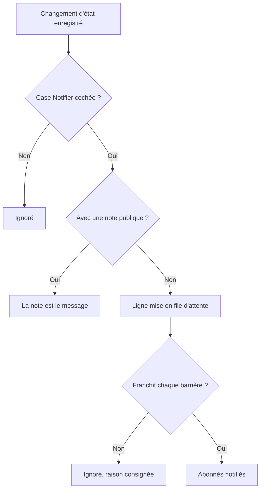

# États et sévérités des incidents

Chaque incident porte deux classements : un **état**, qui dit où en est votre intervention, et une **gravité**, qui dit à quel point il fait mal. Cette page explique ce que fait chaque état, comment ajouter les vôtres et comment les gravités sont classées — pour quiconque configure les incidents, ou veut savoir pourquoi l'un d'eux a alerté ou non, a été résolu ou non, ou s'est affiché ou non sur une page de statut.

:::cards
- [Ajouter vos propres états](#ajouter-vos-propres-états): Modélisez votre intervention, et voyez ce que compte chaque état.
- [Ce que fait la prise en compte](#ce-que-fait-la-prise-en-compte): Les alertes s'arrêtent et le SLA est marqué comme répondu.
- [Ce que fait la résolution](#ce-que-fait-la-résolution): Les moniteurs sont rendus et le SLA est clos.
- [Prévenir les abonnés](#prévenir-les-abonnés-de-la-page-de-statut-dun-changement-détat): Les barrières que franchit un changement d'état avant qu'une page de statut en soit informée.
:::

## Comment ça marche

Dans le tableau de bord, états et gravités se ressemblent — les deux s'affichent en pastilles colorées dans la liste des incidents et en point coloré devant le nom partout où vous en choisissez un, et les deux sont des listes propres au projet que vous pouvez renommer et recolorer. Ils font pourtant des travaux très différents.

Les états pilotent le comportement. Trois indicateurs booléens sur les lignes d'état, avec l'ordre des états, décident quels incidents comptent comme actifs, quels boutons apparaissent dans l'en-tête de l'incident, quand le compteur du SLA s'arrête et quand l'incident disparaît de votre page de statut. Les gravités ne pilotent rien par elles-mêmes — ce sont des étiquettes qui décrivent l'impact, et sur lesquelles d'autres règles peuvent s'appuyer.

```mermaid title="Les incidents ne font que descendre la liste ; la place d'un état décide de ce qu'il compte"
flowchart TB
    subgraph open["Compte comme non pris en compte"]
        identified["Identifié"]
    end
    subgraph working["Compte comme pris en compte"]
        acknowledged["Pris en compte"]
        mitigated["Mitigated (personnalisé)"]
    end
    subgraph done["Compte comme résolu"]
        resolved["Résolu"]
        closed["Closed (personnalisé)"]
    end
    identified --> acknowledged
    acknowledged --> mitigated
    mitigated --> resolved
    resolved --> closed
    identified -. "sauter des étapes" .-> resolved
```

Le modèle `IncidentState` a un `name`, une `description`, une `color` et un `order`, plus trois booléens : `isCreatedState`, `isAcknowledgedState` et `isResolvedState`. Tout ce que le produit fait avec les états repose sur ces booléens et sur `order` — jamais sur le nom de l'état. C'est pourquoi vous pouvez renommer **Résolu** en « Closed » sans rien casser : l'indicateur suit la ligne.

Le modèle `IncidentSeverity` a un `name`, une `description`, une `color` et un `order`, et rien d'autre. Il n'y a pas d'indicateurs. Rien dans OneUptime ne traite de lui-même **Critical Incident** différemment de **Minor Incident** — la gravité ne compte que là où vous faites pointer quelque chose vers elle, comme le critère de correspondance **Gravités d'incident** d'une règle d'astreinte.

Quelques règles rapides :

- **Choisissez la gravité pour communiquer l'impact** — elle s'affiche dans la liste des incidents, sur la **Vue d'ensemble** de l'incident, et c'est un champ obligatoire quand vous déclarez un incident.
- **Choisissez les états pour modéliser votre processus** — les étapes d'intervention que vous suivez réellement, dans l'ordre où vous les suivez.
- **N'encodez pas l'urgence dans les états** — un état nommé « Critical » n'alerterait personne. C'est la gravité plus une règle d'astreinte qui s'en charge.

> [!TIP]
> Les deux listes sont créées d'office avec votre projet, et les deux se modifient sous **Incidents → Paramètres**. Cette section du menu latéral Incidents est repliée par défaut ; dépliez donc **Paramètres** avant de les chercher.

## Les états créés d'office

Trois états sont créés avec le projet, dans cet ordre. La création est idempotente — un état n'est ajouté que s'il n'en existe pas déjà un de ce nom.

| État               | `order` | Indicateur            | Couleur   | Ce que cela veut dire                              |
| ------------------ | ------- | --------------------- | --------- | -------------------------------------------------- |
| **Identifié**      | `1`     | `isCreatedState`      | `#fd625e` | L'état dans lequel arrivent les nouveaux incidents. |
| **Pris en compte** | `2`     | `isAcknowledgedState` | `#ffbf53` | Quelqu'un a pris l'incident en main.               |
| **Résolu**         | `3`     | `isResolvedState`     | `#2ab57d` | L'incident est terminé et cesse de compter comme actif. |

> [!NOTE]
> Le premier état s'appelle **Identifié**, même si plusieurs descriptions dans le produit l'appellent encore l'état « created ». Quand une documentation ou une infobulle parle d'« état de création », il s'agit de l'état qui porte `isCreatedState` — dans un projet neuf, c'est **Identifié**.

## Ce que fait réellement chaque indicateur d'état

| Indicateur            | Rôle                                                                                                                                                                                                 |
| --------------------- | ---------------------------------------------------------------------------------------------------------------------------------------------------------------------------------------------------- |
| `isCreatedState`      | L'état que reçoit un incident quand personne n'en a choisi. Si aucun état du projet ne porte cet indicateur, la création d'un incident échoue avec une erreur qui vous demande d'ajouter un état d'incident de création depuis les paramètres. |
| `isAcknowledgedState` | Marque l'état pris en compte du projet : celui vers lequel **Prendre en compte** fait passer un incident et dont la tuile de statistiques « pris en compte » porte le nom. Un incident dans cet état, dans un état qui le suit, ou résolu, est pris en compte — **Prendre en compte** ne lui est plus proposé, l'astreinte cesse d'alerter pour lui, et son SLA est marqué comme répondu. |
| `isResolvedState`     | Marque l'état résolu du projet : celui vers lequel **Résoudre** fait passer un incident et que montre la tuile de statistiques « résolu ». Un incident dans cet état, ou dans un état qui le suit, est résolu — il quitte **Incidents actifs** et la section active d'une page de statut, et son SLA est marqué comme résolu. |

Un seul état par projet est censé porter chaque indicateur — les recherches prennent le premier dans l'ordre. Les trois états marqués portent l'étiquette **Intégré** sur la page de paramètres ; survolez-la (ou atteignez-la avec Tab) pour lire ce que OneUptime fait de l'état. Ils peuvent être renommés, recolorés et déplacés, mais :

- **Ils gardent leur ordre.** La création vient avant la prise en compte, et la prise en compte avant la résolution. Un glisser-déposer qui romprait cet ordre — **Résolu** au-dessus de **Pris en compte**, par exemple — est refusé, les lignes reviennent à leur place, et la page dit pourquoi.
- **Ils ne peuvent pas être supprimés.** Leur **Supprimer** reste dans le menu de la ligne, verrouillé, avec la raison. Une suppression groupée les ignore et les liste comme non supprimés. L'API refuse aussi de supprimer le dernier état de création, de prise en compte ou de résolution d'un projet.

Comme l'interface lit les noms d'état dynamiquement, renommer un état change ce que vous voyez partout — les tuiles de statistiques (**Acknowledged in** et **Resolved in** avec les noms créés d'office), la confirmation **Marquer l'incident comme …** d'un état personnalisé, et la pastille de la liste des incidents suivent tous le nom que vous avez donné à la ligne.

## Ajouter vos propres états

Un état que vous ajoutez est une étape de votre intervention que les trois états créés d'office ne nomment pas : « Investigating », « Mitigated », « Monitoring », « Closed ».

:::steps
### Ouvrir la liste des états

Allez dans **Incidents → Paramètres → État de l'incident**. La carte **États d'incident** liste vos états dans leur ordre, une ligne chacun : une poignée pour le faire glisser, sa couleur et son nom, ce que **Compte comme** un incident dans cet état, et sa description. La phrase sous le titre le dit clairement : les incidents ne font jamais que descendre cette liste.

### Créer l'état

Cliquez sur **Créer : État de l'incident**, dans l'en-tête de la carte, et remplissez le formulaire (champs ci-dessous). Le nouvel état est ajouté **juste au-dessus de l'état résolu** — là où la plupart des états ont leur place, et jamais en dessous, où il compterait discrètement comme résolu.

### Le faire glisser à sa place

Faites glisser une ligne par sa poignée pour la déplacer. Le nouvel ordre est enregistré au moment où vous la déposez ; il n'y a pas de numéro d'ordre à saisir. Au clavier, placez le focus sur la poignée, appuyez sur Espace, déplacez avec les flèches et appuyez de nouveau sur Espace. La colonne **Compte comme** se met à jour quand vous déposez la ligne.
:::

**Modifier** ouvre le même formulaire que la création. L'ID de l'état se trouve sous **Afficher l'ID** dans le menu de la ligne.

| Champ           | Obligatoire | Ce qu'il fait                                                                                                                                                                                                                                                      |
| --------------- | ----------- | ------------------------------------------------------------------------------------------------------------------------------------------------------------------------------------------------------------------------------------------------------------------- |
| **Nom**         | Oui         | Au moins deux caractères. Le texte indicatif suggère quelque chose comme « Investigating ».                                                                                                                                                                        |
| **Description** | Non         | Un texte libre qui explique quand un incident se trouve dans cet état.                                                                                                                                                                                             |
| **Couleur**     | Oui         | Déjà choisie à l'ouverture du formulaire : une couleur qu'aucun état de la liste n'utilise encore, si bien qu'un nouvel état ne sort jamais du même rouge que celui du dessus. Choisissez-en une autre dans la rangée de couleurs nommées (Rouge, Orange, Citron vert, Vert, Bleu canard, Bleu, Indigo, Violet, Magenta, Rose), ou utilisez **Couleur personnalisée** pour une couleur de marque exacte comme `#fd625e`. |

La couleur teinte la pastille de l'état et le point devant son nom dans chaque sélecteur d'état : les formulaires de déclaration et de modèle, l'action groupée **Modifier l'état**, le menu d'état de l'en-tête, et les conditions des règles et des filtres. Chacun de ces sélecteurs liste les états dans l'ordre où cette page les place.

Vous ne pouvez pas définir les trois indicateurs depuis ce formulaire — ils appartiennent aux lignes créées d'office. Un état que vous ajoutez est donc un état sans indicateur, ce qui a trois conséquences à anticiper :

- **Sa place décide de ce qu'il compte.** La colonne **Compte comme** l'affiche, et change quand vous faites glisser : au-dessus de l'état pris en compte, un incident qui s'y trouve est **Non pris en compte** ; à partir de l'état pris en compte vers le bas, il compte comme **Pris en compte**, si bien que les politiques d'astreinte cessent de l'escalader ; à partir de l'état résolu vers le bas, il compte comme **Résolu**, si bien que les pages de statut cessent de l'afficher comme actif.
- **Au-dessus de l'état résolu, il garde l'incident actif.** **Incidents actifs** contient les incidents dont l'état courant se situe au-dessus de l'état résolu ; un état que vous ajoutez à cet endroit garde donc l'incident dans la liste active et dans le compteur de la barre latérale. Un état glissé sous l'état résolu compte comme résolu partout — les listes actives, les pages de statut, les rappels et le SLA — et y faire passer un incident depuis **Résolu** n'est pas une seconde résolution.
- **Vous y faites passer un incident depuis le menu de l'en-tête.** Les boutons de l'en-tête ne sont que **Prendre en compte** et **Résoudre** ; un état personnalisé se trouve sous **Changer l'état en** dans le menu **⋯** à côté d'eux, qui liste tous les états situés après l'état courant. Sa confirmation s'intitule **Marquer l'incident comme `<state name>`** avec un bouton d'envoi **Marquer comme `<state name>`**.

> [!TIP]
> Une forme courante est une étape d'atténuation entre l'état pris en compte et l'état résolu — créez « Mitigated » et il arrive juste au-dessus de **Résolu**, après **Pris en compte**, en comptant comme pris en compte. Pour une étape de tri avant que quiconque ait pris l'incident en compte, faites-le glisser au-dessus de **Pris en compte**.

## L'ordre est une vraie contrainte, pas une préférence d'affichage

L'ordre est appliqué quand un changement d'état est écrit, pas seulement quand la liste est dessinée :

- **Les transitions vers l'arrière sont rejetées.** Faire passer un incident à un état situé plus tôt dans l'ordre que son état courant échoue avec une erreur qui nomme les deux états.
- **Resélectionner l'état courant est rejeté.** Mettre un incident dans l'état où il se trouve déjà échoue avec « Incident state cannot be same as previous state. »
- **Une ligne antidatée ne peut pas dupliquer sa voisine.** Insérer une ligne de chronologie dont l'état est celui de la ligne qui la suit est aussi refusé.
- **Les boutons de l'en-tête suivent la position des états marqués dans l'ordre.** **Prendre en compte** et **Résoudre** sont proposés selon la place de l'état courant dans la liste triée par ordre. Un état personnalisé placé *après* l'état résolu n'affiche jamais de bouton **Résoudre**, car un incident qui s'y trouve compte déjà comme résolu.

Alors, quand vous ajoutez un état, placez-le là où un incident passerait réellement par lui. Le mal ordonner n'a pas qu'un air étrange — cela rend des transitions impossibles. Déplacer un état plus loin change la façon dont comptent les incidents qui s'y trouvent déjà, dès que vous le déposez.

Par l'API et Terraform, l'ordre est la colonne `order` : les plus petits nombres viennent en premier. Un état créé sans ordre se place juste au-dessus de l'état résolu ; un état créé ou mis à jour avec un nombre prend cette place, et les états qui la gênent descendent d'un rang. Les nombres que personne d'autre ne détient sont conservés tels qu'écrits, si bien qu'un état géré par Terraform relit le nombre qu'on lui a donné.

## Les gravités créées d'office

Trois gravités sont créées avec le projet, dans cet ordre, de la plus grave à la moins grave :

| Gravité               | `order` | Couleur   | Description créée d'office                                                                                                                                                                |
| --------------------- | ------- | --------- | ----------------------------------------------------------------------------------------------------------------------------------------------------------------------------------------- |
| **Critical Incident** | `1`     | `#b70400` | Issues causing very high impact to customers. Immediate response is required. Examples include a full outage, or a data breach.                                                          |
| **Major Incident**    | `2`     | `#fd625e` | Issues causing significant impact. Immediate response is usually required. We might have some workarounds that mitigate the impact on customers. Examples include an important sub-system failing. |
| **Minor Incident**    | `3`     | `#ffbf53` | Issues with low impact, which can usually be handled within working hours. Most customers are unlikely to notice any problems. Examples include a slight drop in application performance. |

La gravité est obligatoire quand vous déclarez un incident, et elle est obligatoire sur chaque spécification d'incident dans les critères d'un moniteur ; chaque incident — manuel ou automatique — en a donc une. Voir [Déclarer un incident](/docs/incidents/declaring-incidents) pour le parcours de déclaration et [Modèles d'incident et d'alerte](/docs/monitor/incident-alert-templating) pour le chemin piloté par les moniteurs.

## Modifier les gravités

Allez dans **Incidents → Paramètres → Gravité de l'incident**. Même forme que la page des états — une ligne par gravité, de la plus grave à la moins grave, faites glisser une ligne pour changer son rang, **Créer : Gravité de l'incident** en ajoute une à la fin (la moins grave), avec **Nom**, **Description** et **Couleur** dans le formulaire, la couleur déjà choisie comme dans le formulaire des états.

Le rang compte partout où OneUptime compare des gravités : un épisode prend la gravité de son incident le plus grave, et les valeurs Critical et Warning d'une recommandation de moniteur correspondent à votre première et à votre deuxième gravité.

Deux différences avec les états :

- **Il n'y a pas de protection contre la suppression.** Toute gravité peut être supprimée, y compris les trois créées d'office.
- **Il n'y a pas d'indicateurs à hériter, ni de « Compte comme ».** Une nouvelle gravité se comporte exactement comme celles créées d'office — c'est une étiquette avec une couleur et un rang.

Là où la gravité fait plus que décrire : dans **Incidents → Règles → Règles d'astreinte**, le champ **Gravités d'incident** d'une règle est un critère de correspondance. Y lister **Critical Incident**, c'est ainsi qu'on exprime « alerter l'équipe base de données pour tout ce qui est critique » — la politique d'astreinte vit sur la règle, pas sur la gravité.

**Changer la gravité d'un incident** — via **Modifier** sur la carte **Détails de l'incident** de l'incident, par l'API ou Terraform (`incidentSeverityId`), avec un workflow ou avec les outils d'IA — fait les quatre mêmes choses quelle que soit la façon dont c'est envoyé : le fil d'activité de l'incident reçoit une entrée **Incident updated** qui nomme la nouvelle gravité, les échéances SLA de l'incident sont recalculées, sa règle de rappel est de nouveau appariée, et les métriques d'incident comptent un changement de gravité. Enregistrer la gravité que l'incident a déjà ne fait rien de tout cela, si bien que modifier seulement le titre d'un incident laisse ses échéances SLA, ses rappels et son compteur de changements de gravité tels qu'ils étaient. La gravité d'une alerte fonctionne de la même façon pour son entrée de fil d'activité et ses rappels.

## Faire passer un incident d'un état à l'autre

Un incident change d'état de quatre façons :

| Façon                     | Où                                                                                          | Ce qui est demandé                                                                                                                                                                                           |
| ------------------------- | ------------------------------------------------------------------------------------------- | ------------------------------------------------------------------------------------------------------------------------------------------------------------------------------------------------------------ |
| **Boutons de l'en-tête**  | L'en-tête de l'incident : **Prendre en compte** et **Résoudre**, et **Changer l'état en** dans son menu **⋯** | Une courte confirmation — **Prendre en compte l'incident** ou **Résoudre l'incident** — avec **Notifier les abonnés de la page de statut** et, replié sous **Ajouter une note publique**, la **Note publique** facultative et son sélecteur **Sélectionner le modèle de note** (quand le projet a des modèles de notes). |
| **Chronologie d'état**    | **Chronologie d'état** dans le menu latéral de l'incident                                   | Une ligne ajoutée à la main, avec **Statut de l'incident**, **Commence le** et **Notifier les abonnés de la page de statut**.                                                                               |
| **Modification groupée**  | **Modifier l'état** sur une sélection dans la liste des incidents                           | Une page avec l'état, **Notifier les abonnés de la page de statut** et le même **Ajouter une note publique** replié.                                                                                        |
| **Automatiquement**       | Un critère de moniteur, ou votre propre code                                                | Un critère avec **Résoudre automatiquement l'incident** activé résout son incident quand le critère n'est plus rempli. L'API change l'état en créant une ligne à `/api/incident-state-timeline`.           |

Si l'état courant précède l'état pris en compte, l'en-tête propose **Prendre en compte** et **Résoudre** ; s'il se situe entre les deux, seulement **Résoudre**. La prise en compte arrête aussi toute escalade d'astreinte de l'incident.

Chacune de ces façons écrit une ligne de chronologie. Un changement d'état fait aussi quelques choses que vous n'avez pas à demander : il publie une entrée dans le fil d'activité de l'incident, désigne un Responsable d'incident si l'incident n'en a pas encore, et met à jour le compteur du SLA. Rouvrir un incident résolu démarre un nouvel enregistrement SLA à partir de l'heure de réouverture.

## Ce que fait la prise en compte

Un incident est pris en compte dès qu'il passe dans votre état pris en compte, dans un état qui le suit — un état **Mitigated** ou **Investigating** que vous avez placé sous **Pris en compte** — ou dans un état résolu, quelle que soit celle des quatre façons ci-dessus qui le déplace. La colonne **Compte comme** de la page de paramètres des états montre de quels états il s'agit. Une fois qu'il est pris en compte :

- **Prendre en compte n'est plus proposé.** Ni dans l'en-tête de l'incident, ni dans l'application mobile (son bouton et son balayage), ni dans Slack ou Microsoft Teams, ni via `acknowledge_incident` du serveur MCP de OneUptime. Le prendre en compte malgré tout — depuis une alerte d'astreinte, Slack ou Teams — est refusé avec « Incident is already acknowledged. » (ou « Incident is already resolved. »), au lieu de le faire remonter dans sa liste.
- **L'astreinte cesse d'alerter pour lui.** Un intervenant qui prend en compte son alerte après qu'un collègue a pris l'incident en compte, ou l'a fait avancer, voit son alerte prise en compte et l'incident reste où il est.
- **Le SLA est marqué comme répondu**, au premier passage de ce type ; avancer ensuite dans des états ultérieurs conserve cette heure.
- **Le délai de prise en compte court jusqu'à ce premier passage** — la tuile de statistiques de la **Vue d'ensemble** de l'incident, la métrique **Time to Acknowledge**, une mesure qui se termine quand **L'incident est pris en compte**, et le MTTA des résumés Slack et Microsoft Teams. Un incident passé directement de **Identifié** à **Investigating** a été pris en compte à ce moment-là ; un incident résolu tout de suite a été pris en compte au moment de sa résolution.
- **Un filtre Pris en compte** — sur le widget de liste d'incidents d'un tableau de bord, par exemple — montre les incidents dans votre état pris en compte et dans tout état qui le suit, avant la résolution.

Les alertes et les épisodes suivent la même règle, avec vos états d'alerte.

## Ce que fait la résolution

Un incident est résolu quand il passe d'un état situé au-dessus de votre état résolu à l'état résolu, ou à tout état qui le suit — quelle que soit celle des quatre façons ci-dessus qui le déplace. Chaque résolution :

- **Rend les moniteurs que l'incident retient.** Un incident déclaré ouvert retient ses moniteurs : il les a mis dans son statut **Changer le statut du moniteur en**, quand il en nomme un, et, déclaré à la main, a mis leur surveillance en pause. Une modification pendant qu'il est ouvert — ajouter des moniteurs, ou changer ce statut — lui fait aussi les retenir. La résolution reprend leur surveillance et les remet en état opérationnel, sauf si un autre incident ouvert les concerne encore, et à partir de là l'incident ne retient plus rien. Un incident déclaré déjà résolu ne rend donc rien, pas plus qu'une seconde résolution après une réouverture : un statut que ses moniteurs ont reçu entre-temps — de leurs sondes, d'une maintenance ou défini à la main — reste.
- **Marque le SLA comme résolu** et, quand les brouillons de post-mortem de OneUptime AI sont activés, rédige un post-mortem.

Passer de **Résolu** à un état qui le suit — **Closed**, par exemple — n'est pas une seconde résolution : rien de tout cela ne s'exécute de nouveau, et aucun nouveau SLA ne démarre. Un incident déclaré avant que OneUptime ne commence à enregistrer cela rend ses moniteurs à sa prochaine résolution, comme avant.

## La chronologie d'état

La page **Chronologie d'état** du menu latéral de l'incident est la piste d'audit de chaque état par lequel l'incident est passé. La carte de cette page s'intitule **Chronologie de statut**, et elle est triée de la plus récente à la plus ancienne.

| Colonne                                  | Ce qu'elle montre                                                                                                                                                                                                                                              |
| ---------------------------------------- | -------------------------------------------------------------------------------------------------------------------------------------------------------------------------------------------------------------------------------------------------------------- |
| **Statut de l'incident**                 | Une pastille colorée avec le nom et la couleur de l'état.                                                                                                                                                                                                      |
| **Commence le**                          | Quand l'incident est entré dans cet état.                                                                                                                                                                                                                      |
| **Se termine le**                        | Quand il l'a quitté. L'état courant affiche `Currently Active`.                                                                                                                                                                                                |
| **Durée**                                | Le temps passé dans l'état, compté jusqu'à maintenant pour l'état courant.                                                                                                                                                                                     |
| **Statut de notification de l'abonné**   | Si la notification de page de statut pour ce changement a été envoyée, ignorée ou est encore en attente, avec un lien **plus de détails** et — quand l'envoi a échoué — une action **Réessayer**. **Réessayer** renvoie le changement d'état à chaque page de statut que l'incident atteint maintenant, y compris les abonnés qui l'ont déjà reçu. |

Chaque ligne a deux actions :

- **Voir la cause** — ouvre une boîte de dialogue **Cause racine** qui affiche le Markdown enregistré avec ce changement d'état.
- **Voir les journaux** — ouvre une boîte de dialogue qui explique pourquoi le statut a changé, avec une visionneuse **Journal des états de l'incident**.

Dans le tableau de bord, les lignes de chronologie peuvent être ajoutées et supprimées, mais pas modifiées ; un incident garde toujours au moins une ligne. Par l'API, le `startsAt` d'une ligne peut être corrigé, et chaque mesure calculée à partir de la chronologie le suit.

> [!WARNING]
> Supprimer la mauvaise ligne réécrit l'historique de l'incident ; traitez donc cela comme un outil de correction plutôt que comme une habitude de nettoyage.

## La liste Incidents actifs

**Incidents → Incidents actifs** est la liste que vous surveillez pendant une garde. Sa définition tient en une seule condition : l'état courant de l'incident se situe au-dessus de votre état résolu — le premier état dans l'ordre marqué `isResolvedState`. Rien d'autre n'est pris en compte — ni la gravité, ni l'ancienneté, ni le fait que quelqu'un l'ait pris en compte.

L'entrée du menu latéral porte un badge rouge de compteur qui utilise la même requête, si bien que le badge et la liste concordent toujours. Quand il n'y a rien à voir, la page le dit.

La conséquence pratique : un état personnalisé que vous ajoutez au-dessus de l'état résolu garde les incidents dans cette liste — « Mitigated » ne veut pas dire « terminé » — et un état que vous placez après les en retire, comme le fait l'état résolu. Les alertes et les épisodes suivent la même règle avec leurs propres états, et les compteurs du menu latéral, les rappels, les pages de statut et l'application mobile la lisent tous.

## Prévenir les abonnés de la page de statut d'un changement d'état

Un changement d'état peut notifier les abonnés de votre page de statut, mais il passe par plusieurs barrières. Les comprendre évite bien des enquêtes du type « pourquoi personne n'a été notifié ».



La notification est demandée pour chaque ligne de chronologie par **Notifier les abonnés de la page de statut** (`shouldStatusPageSubscribersBeNotified`), la case à cocher de la boîte de dialogue de changement d'état et du formulaire manuel de la chronologie. Dans la boîte de dialogue de changement d'état, elle démarre décochée quand l'incident a été déclaré sans notifier les abonnés. La même case décide aussi si la note publique de la boîte de dialogue notifie quelqu'un. Quand elle est décochée, la ligne est enregistrée avec un statut ignoré et une explication. Quand elle est cochée, la ligne est mise en file d'attente et une tâche d'arrière-plan la prend en charge — la tâche s'exécute chaque minute, l'envoi est donc rapide mais pas instantané.

**La ligne en file d'attente est ensuite ignorée dans chacun de ces cas :**

- **Le nouvel état est l'état de création.** Les abonnés ont déjà été prévenus quand l'incident a été déclaré ; la première ligne de chronologie n'envoie donc volontairement pas de second message.
- **L'incident n'a aucun moniteur rattaché.** Sans ressources, il n'y a aucune page de statut sur laquelle placer l'incident.
- **L'incident n'est pas visible sur la page de statut** (`isVisibleOnStatusPage` est désactivé).
- **La page de statut a les incidents désactivés** (`showIncidentsOnStatusPage` est désactivé). Ce cas est propre à chaque page de statut — les autres pages qui affichent le même moniteur sont tout de même notifiées.
- **La page de statut est hors de la portée de l'incident.** Un incident limité à certaines pages de statut avec **Limiter à ces pages de statut** ne notifie que ces pages parmi celles qui listent ses moniteurs, et une page avec **Afficher uniquement les incidents limités à cette page** activé n'est jamais notifiée d'un incident qui ne lui est pas limité. Ce cas aussi est propre à chaque page de statut. Voir [Une page de statut par public](/docs/status-pages/one-status-page-per-audience).

**Encore une chose qui change le résultat.** Si vous rédigez une **Note publique** dans la boîte de dialogue de changement d'état (sous **Ajouter une note publique**) ou dans l'action groupée **Modifier l'état** pendant que **Notifier les abonnés de la page de statut** est cochée, la ligne de chronologie est marquée comme déjà notifiée au lieu d'être mise en file d'attente, et son message de statut dit que la note l'a portée. C'est la note elle-même qui atteint les abonnés : ils reçoivent un message au lieu de deux. Une note qui ne contient que des espaces n'est pas publiée, et la ligne est mise en file d'attente comme d'habitude. Les changements d'état de maintenance planifiée fonctionnent de la même façon. Le type d'événement derrière le message simple de changement d'état est `Subscriber Incident State Changed`.

**La note dit où en est maintenant l'incident.** Parce que la note est l'unique message, elle nomme le nouvel état sur chaque canal, comme l'aurait fait le message de changement d'état : l'objet de l'e-mail est `[Resolved Incident] <title>` et ses détails affichent une ligne **Statut** dans la couleur de l'état, le SMS dit `Incident <title> on <status page> is Resolved.`, les messages Slack et Microsoft Teams portent une ligne `**Status:** Resolved`, et la charge utile `IncidentNoteCreated` du webhook porte `incidentState` dans `data`. Une note publiée seule garde son message habituel, tout comme la notification de mise à jour d'une modification.

**Publier la note demande sa propre autorisation.** Changer l'état et publier une note publique sont des autorisations distinctes (**Create Incident State Timeline** et **Create Incident Status Page Note** dans un rôle personnalisé ; les rôles intégrés d'incident et de projet ont les deux). Changer l'état ne demande aucune autorisation de modifier l'incident : voir [Changer un état](/docs/permissions/index#changer-un-état). Une personne qui peut changer l'état d'un incident mais pas publier de notes publiques ne se voit pas proposer **Ajouter une note publique** dans la boîte de dialogue ni dans l'action groupée **Modifier l'état**. Un changement d'état qu'elle envoie avec une note par l'API est refusé en bloc, avec un message qui dit que l'état n'a pas été changé et pourquoi, pour qu'un changement ne soit jamais consigné comme porté par une note qui n'a jamais été publiée. Sans la note, le changement passe. Les alertes, les épisodes d'alerte et les épisodes d'incident proposent à la place une note privée avec un changement d'état (**Ajouter une note privée**), et elle fonctionne de la même façon : la publier demande l'autorisation propre de la note (**Create Alert Internal Note**, **Create Alert Episode Internal Note** ou **Create Incident Episode Internal Note** dans un rôle personnalisé ; les rôles intégrés d'alerte, d'incident et de projet les ont), et un changement d'état envoyé avec une note privée par quelqu'un qui ne l'a pas est refusé en bloc ; l'état n'est donc pas changé.

**Envoyé veut dire envoyé à chaque abonné.** La tâche attend chaque message et le compte comme envoyé ou en échec, par page de statut et par canal, et le message de statut de la ligne liste ces nombres. Un seul message en échec, ou un envoi qui a manqué de temps ou a été interrompu, rend la ligne **Échec**. Voir [Abonnés et annonces](/docs/status-pages/subscribers).

Pour savoir qui reçoit ces messages et comment les modèles sont choisis, voir [Abonnés et annonces](/docs/status-pages/subscribers).

## Garder un incident hors de la page de statut

Quatre éléments distincts décident si un incident apparaît sur une page publique, et les quatre doivent être vrais :

- **Afficher les incidents** (`showIncidentsOnStatusPage`) sur la page de statut elle-même.
- **Visible sur la page de statut** (`isVisibleOnStatusPage`) sur l'incident — un interrupteur de la page **Paramètres** de l'incident. Il vaut true par défaut et ne figure pas dans l'assistant de déclaration ; un critère de moniteur peut le définir avec **Afficher l'incident sur la page de statut**. Un incident déclaré masqué ne prévient aucun abonné à sa création ; quand vous activez cet interrupteur plus tard, le formulaire de modification propose **Notifier les abonnés que cet incident a été créé**. Voir [Déclarer un incident](/docs/incidents/declaring-incidents).
- **La page est à la portée de l'incident.** La page liste l'un des moniteurs de l'incident et, si l'incident est limité à certaines pages de statut, en fait partie. Une page avec **Afficher uniquement les incidents limités à cette page** activé n'affiche que les incidents qui lui sont limités. Voir [Une page de statut par public](/docs/status-pages/one-status-page-per-audience).
- **L'état courant se situe au-dessus de l'état résolu.** C'est ce qui retire un incident de la section active : la requête de la page de statut récupère les incidents dont l'état courant est au-dessus de votre état résolu, si bien que l'état résolu et tout état qui le suit retirent l'incident. Vous n'archivez ni ne fermez rien — vous le résolvez, et il passe dans l'historique.

**Les incidents privés n'apparaissent jamais.** Activer **Incident privé** masque l'incident sur toutes les pages de statut, quels que soient les interrupteurs ci-dessus, et le réserve à ses propriétaires ainsi qu'aux administrateurs et propriétaires du projet. Rien de lui n'atteint non plus un abonné de page de statut : ni sa création, ni ses changements d'état, ni ses notes publiques, ni son post-mortem. Les images de sa description, de son post-mortem, de ses champs personnalisés et de ses notes publiques ne sont pas visibles par tout le monde tant qu'il est privé.

Les deux interrupteurs sont maintenus en phase, si bien que la page **Paramètres** de l'incident montre toujours ce que font les pages de statut :

- Rendre un incident privé désactive **Visible sur la page de statut** en même temps.
- Activer **Visible sur la page de statut** pendant que l'incident reste privé le laisse désactivé. Pour publier un incident privé, désactivez **Incident privé** et activez **Visible sur la page de statut** — en un seul enregistrement, ou l'un après l'autre.

Cela vaut quelle que soit la façon dont l'incident est écrit : le tableau de bord, l'API, Terraform, un workflow, un moniteur, un modèle d'incident ou une règle de confidentialité. Une valeur envoyée sous forme de texte, comme `"true"`, compte autant que `true`. Une écriture sur plusieurs incidents qui active **Visible sur la page de statut** — l'**Update Many** d'un workflow, par exemple — affiche ceux qui ne sont pas privés et laisse chaque incident privé masqué. Chaque incident est tranché tel qu'il est au moment où l'écriture l'atteint, si bien qu'un changement de sa confidentialité arrivant au même instant n'est jamais écrasé : un incident n'est jamais enregistré à la fois privé et visible. Un incident créé privé est créé masqué, et ne prévient aucun abonné de sa création.

**Les épisodes suivent la même règle.** Un épisode d'incident privé est masqué sur toutes les pages de statut, quoi que dise son interrupteur **Visible sur la page de statut**, et ses abonnés n'entendent rien à son sujet. Sur la page **Paramètres** de l'épisode, l'interrupteur le dit, et reste désactivé tant que l'épisode est privé. Un incident privé n'amène jamais son épisode sur une page de statut : un épisode n'atteint une page qu'à travers des incidents qui ne sont pas privés.

:::details Mise à niveau depuis une version sans ces règles
Les incidents et les épisodes enregistrés comme privés avec **Visible sur la page de statut** encore activé, d'avant ces règles, voient cet interrupteur désactivé lors de la mise à niveau. Rien n'est envoyé à personne. Les images qu'un tel incident ou épisode avait rendues visibles par tout le monde redeviennent privées, sauf si quelque chose que montrent vos pages de statut les contient encore. Il en va de même des images des notes publiques d'incidents, d'épisodes et d'événements de maintenance planifiée que vos pages de statut ne montrent pas, qui restaient visibles par tout le monde auparavant.
:::

La quantité d'historique résolu que conserve la page est un réglage de la page de statut, pas de l'incident. Voir [Ressources et groupes de la page de statut](/docs/status-pages/resources-and-groups) pour savoir comment les moniteurs de la page décident quels incidents s'affichent.

## Étapes suivantes

:::cards
- [Déclarer un incident](/docs/incidents/declaring-incidents): Choisissez un état de départ et une gravité au moment de déclarer.
- [Notes, propriétaires et fil d'incident](/docs/incidents/notes-owners-and-feed): Publiez la note publique qui part avec un changement d'état.
- [Paramètres et automatisation des incidents](/docs/incidents/settings): Mesurez le temps entre les états, et utilisez les gravités dans les règles.
- [Abonnés et annonces](/docs/status-pages/subscribers): Qui reçoit les messages qu'envoie un changement d'état.
:::
