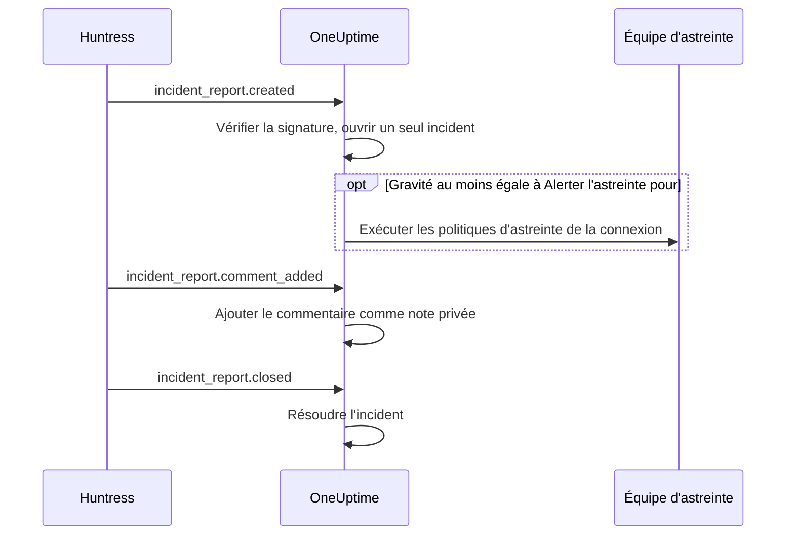

# Intégration Huntress

Alertez votre équipe d'astreinte pour les rapports d'incident Huntress. Quand le SOC de Huntress envoie un rapport d'incident sur un poste ou une identité, OneUptime ouvre un seul incident pour lui, avec la gravité de votre choix, alerte les politiques d'astreinte que vous choisissez, et résout l'incident quand le rapport est clos dans Huntress.

Cette intégration est **entrante** : Huntress envoie chaque événement d'un rapport d'incident à une URL de webhook que OneUptime vous donne, signé avec le secret de signature du point de terminaison. OneUptime n'appelle jamais Huntress, il n'a donc besoin d'aucune clé d'API Huntress.

:::cards
- [Fonctionnement](#fonctionnement) : Ce que OneUptime fait de chaque événement d'un rapport.
- [Mise en place](#mettre-en-place-lintégration) : Connecter dans OneUptime, ajouter le point de terminaison dans Huntress, enregistrer son secret de signature, envoyer un test.
- [Paramètres](#paramètres) : Alertes, gravités, organisations, étiquettes et résolution.
- [Dépannage](#dépannage) : Ce que signifient les erreurs de la connexion, et quoi changer.
:::

## Fonctionnement

Huntress envoie un événement sur un rapport d'incident quand le rapport est envoyé, quand quelqu'un le commente et quand il est clos. Chaque événement contient le rapport entier.

1. **Vérifier.** Une requête doit être signée avec le secret de signature du point de terminaison, au plus cinq minutes avant son arrivée. Tout le reste est refusé, et la page de la connexion dit pourquoi.
2. **Ouvrir un seul incident.** Le premier événement d'un rapport ouvre un incident nommé d'après le rapport, par exemple `Huntress: Incident on DESKTOP-01 (Acme Corp)`. Sa description contient le résumé du rapport, sa gravité dans Huntress, l'organisation, l'hôte ou l'identité concerné, les indicateurs trouvés par Huntress et un lien vers le rapport dans Huntress. Les événements suivants du même rapport, et les livraisons que Huntress renvoie, retrouvent cet incident : un rapport n'en ouvre jamais deux.
3. **Alerter.** L'incident s'ouvre avec la gravité d'incident que la connexion associe à la gravité Huntress du rapport. Quand cette gravité est au moins égale à **Alerter l'astreinte pour**, les **Politiques d'astreinte** de la connexion sont exécutées.
4. **Suivre le rapport.** Un commentaire ajouté dans Huntress devient une note privée sur l'incident. Quand le rapport est clos ou rejeté, l'incident est résolu.

Les incidents ouverts ainsi n'apparaissent jamais sur une page de statut. Vos règles d'incident (règles d'astreinte, de propriétaires, d'étiquettes et de confidentialité) s'y appliquent comme à tout autre incident.

## Avant de commencer

- Dans OneUptime, le rôle **Project Owner** ou **Project Admin**. Les membres, les lecteurs et les rôles d'incident voient la connexion et les rapports reçus, sans pouvoir la modifier.
- Dans Huntress, le rôle **Account Admin** : seuls les administrateurs du compte peuvent ajouter des webhooks.
- Une politique d'astreinte à alerter. Sans elle, les rapports ouvrent des incidents et n'alertent personne, sauf si une règle d'astreinte des incidents leur correspond.
- Pour une installation auto-hébergée, un OneUptime que Huntress peut joindre depuis Internet en HTTPS : Huntress n'envoie de webhooks qu'à des URL `https://`.

## Mettre en place l'intégration

:::steps
### Connecter Huntress dans OneUptime

Ouvrez **Incidents → Intégrations → Huntress** (`/dashboard/{projectId}/incidents/integrations/huntress`). La section **Intégrations** du menu latéral des incidents est repliée par défaut : dépliez-la d'abord. Cliquez sur **Connecter Huntress**.

Choisissez les **Politiques d'astreinte** à alerter. **Alerter l'astreinte pour** demande alors quels rapports les alertent, et commence sur **Rapports élevés et critiques**. Tout le reste attend sous **Plus de champs**, avec une valeur par défaut (voir [Paramètres](#paramètres)). Cliquez sur **Connecter Huntress**. La page de la connexion s'ouvre, avec une carte **Connecter Huntress** qui vous guide dans les trois étapes suivantes.

### Ajouter un point de terminaison webhook dans Huntress

Sur la page de la connexion, cliquez sur **Copier l'URL du webhook**. L'URL ressemble à `https://oneuptime.com/api/huntress/webhook/<connection-id>` ; sur une installation auto-hébergée, elle commence par votre propre hôte.

Dans Huntress, ouvrez le menu en haut à droite et choisissez **Integrations**. Cliquez sur **Add an Integration**, choisissez **Webhooks**, puis cliquez sur **Add Endpoint**. Collez l'URL, activez **Incident Reports** et enregistrez. Laissez **Escalations**, **Platform Actions** et **Account Notices** désactivés : OneUptime accepte ces événements et n'en fait rien.

### Enregistrer le secret de signature du point de terminaison

Dans Huntress, ouvrez le menu du point de terminaison (⋯) et choisissez **View Signing Secret**. Copiez-le en entier : il commence par `whsec_`. Sur la page de la connexion, cliquez sur **Enregistrer le secret de signature**, collez-le, puis cliquez sur **Enregistrer le secret de signature**. Le secret est chiffré et n'est plus jamais affiché.

Tant que le secret n'est pas enregistré, OneUptime refuse toute requête vers l'URL. Huntress renvoie plus tard un événement refusé : un événement refusé maintenant arrive quand même.

### Envoyer un test

Dans Huntress, ouvrez le menu du point de terminaison (⋯) et choisissez **Send Test**. En quelques secondes, la carte de la page de la connexion devient **Connexion**, avec l'état **Reçoit les rapports**.

> [!NOTE]
> Quel que soit le contenu du test, la connexion montre qu'il est arrivé. Un test qui contient un rapport d'incident ouvre un incident comme n'importe quel rapport, et alerte l'astreinte s'il est assez grave.
:::

## Paramètres

**Connecter Huntress** ne demande que qui est alerté, et pour quels rapports. Tout le reste attend sous **Plus de champs**, avec une valeur par défaut qui convient à la plupart des équipes. Pour modifier un paramètre plus tard, cliquez sur **Modifier les paramètres** sur la carte **Paramètres** de la connexion.

| Paramètre | Ce qu'il fait | Par défaut |
| --- | --- | --- |
| **Politiques d'astreinte** | Les politiques exécutées quand un rapport est assez grave. Laissez vide pour ouvrir des incidents sans alerter personne. | Aucune |
| **Alerter l'astreinte pour** | Quels rapports alertent les politiques : **Rapports critiques uniquement**, **Rapports élevés et critiques** ou **Tous les rapports**. Chaque rapport ouvre un incident dans tous les cas. | **Rapports élevés et critiques** |
| **Nom** | Le nom de la connexion dans OneUptime. | `Huntress` |
| **Gravité pour les rapports critiques**, **Gravité pour les rapports élevés**, **Gravité pour les rapports faibles** | La gravité d'incident avec laquelle s'ouvre chaque gravité Huntress. | Vos trois gravités d'incident les plus élevées, dans l'ordre |
| **Uniquement ces organisations** | Les organisations Huntress dont les rapports ouvrent des incidents, un nom ou un ID d'organisation par ligne. Les noms ignorent la casse. | Vide : toutes les organisations |
| **Étiquettes** | Les étiquettes ajoutées à chaque incident, en plus de celle au nom de l'organisation du rapport. | Aucune |
| **Résoudre quand Huntress clôt le rapport** | Résoudre l'incident quand son rapport est clos ou rejeté dans Huntress. Désactivé, une note privée sur l'incident l'indique à la place. | Activé |

### Gravités

Huntress donne à chaque rapport d'incident l'une de trois gravités. Sauf si vous choisissez une gravité d'incident pour l'une d'elles, le rapport s'ouvre selon l'ordre de vos gravités d'incident, tel que **Incidents → Paramètres → Gravité de l'incident** les liste :

| Gravité Huntress | Ce que Huntress entend par là | Gravité d'incident |
| --- | --- | --- |
| Critical | Attaquants aux commandes, logiciels malveillants dangereux ou compromission active, à contenir immédiatement. | La plus élevée |
| High | Logiciel malveillant confirmé qui demande une remédiation urgente, ou compromission d'identité exploitable. | La deuxième |
| Low | Programmes potentiellement indésirables, restes de logiciels malveillants et découvertes plus anciennes sur les identités. | La troisième |

Un projet qui a moins de gravités utilise sa moins élevée pour le reste. Un rapport sans gravité est traité comme élevé. Si une gravité que vous avez choisie est supprimée, l'ordre décide de nouveau.

### Organisations

Chaque incident reçoit une étiquette au nom de l'organisation Huntress du rapport, par exemple _Acme Corp_. Une connexion reçoit les rapports de toutes les organisations de votre compte Huntress, et **Uniquement ces organisations** restreint cela.

> [!TIP]
> Pour alerter l'équipe propre à chaque client, laissez vides les **Politiques d'astreinte** de la connexion et ajoutez une règle d'astreinte des incidents par organisation, par exemple « Si **Étiquettes d'incident** contient l'une de _Acme Corp_ », qui exécute la politique de ce client. Voir [Règles d'astreinte des incidents](/docs/incidents/settings#règles-dastreinte-des-incidents).

## Rapports sur la page de la connexion

La liste **Rapports d'incident** de la connexion montre chaque rapport envoyé par Huntress, le plus récent en premier : l'hôte ou l'identité concerné, sa gravité et son statut dans Huntress, et son **Résultat**.

| Résultat | Ce qui s'est passé |
| --- | --- |
| **Incident ouvert** | Le rapport a ouvert un incident. **Voir l'incident** l'ouvre ; **Astreinte alertée** indique que la connexion a alerté ses politiques. |
| **Incident résolu** | Huntress a clos le rapport, et son incident a été résolu. |
| **Ignoré : organisation non surveillée** | L'organisation du rapport n'est pas dans **Uniquement ces organisations**. |
| **Ignoré : déjà clos dans Huntress** | Le rapport était déjà clos la première fois que OneUptime en a entendu parler. |

Un rapport ignoré le reste si vous modifiez les paramètres plus tard. Quand **Résoudre quand Huntress clôt le rapport** est désactivé, un rapport clos garde le résultat **Incident ouvert**.

## Sécurité

- **Uniquement des requêtes signées.** OneUptime vérifie les en-têtes `svix-id`, `svix-timestamp` et `svix-signature` envoyés par Huntress par rapport au corps de la requête, tel qu'il est arrivé. Une requête qui n'est pas signée avec le secret enregistré, ou qui a été signée plus de cinq minutes avant ou après, est refusée.
- **Le secret reste secret.** Il est chiffré au repos, jamais renvoyé par l'API et plus jamais affiché. **Remplacer le secret de signature** sur la page de la connexion en enregistre un autre, comme le secret d'un nouveau point de terminaison.
- **L'URL est une adresse, pas un mot de passe.** Elle désigne la connexion ; seule une requête signée avec le secret du point de terminaison est traitée.
- **Un point de terminaison par connexion.** Chaque connexion a sa propre URL et son propre secret. Pour recevoir les rapports d'un deuxième compte Huntress, connectez-vous à nouveau.

## Utiliser plutôt l'e-mail

Huntress envoie aussi les rapports d'incident par e-mail, et un [moniteur d'e-mails entrants](/docs/monitor/incoming-email-monitor) peut ouvrir des incidents à partir de ces e-mails, par exemple quand l'objet contient `Critical Incident Report`. Il traite toutefois les e-mails comme le statut d'un seul moniteur : tant que son incident est ouvert, le rapport suivant n'en ouvre aucun, et l'incident est résolu par les critères du moniteur plutôt que quand Huntress clôt le rapport. La connexion Huntress ouvre un incident par rapport et résout chacun avec son rapport : préférez-la. Dès que la connexion reçoit des rapports, cessez d'envoyer les e-mails au moniteur, sinon chaque rapport alerte deux fois.

## Dépannage

Quand OneUptime refuse une requête, la page de la connexion en donne la raison sous **La dernière requête a été refusée**. Dans Huntress, **View Delivery Attempts** dans le menu du point de terminaison (⋯) liste chaque livraison avec la réponse de OneUptime.

:::details "A request arrived but was refused, because no signing secret is saved for this connection yet"
Enregistrez le secret de signature du point de terminaison : voir [Mettre en place l'intégration](#mettre-en-place-lintégration). Huntress renvoie la requête refusée.
:::

:::details "The request's signature does not match the signing secret"
Le secret enregistré n'est pas celui de ce point de terminaison. Chaque point de terminaison a le sien : dans Huntress, ouvrez le menu du point de terminaison (⋯), choisissez **View Signing Secret**, copiez-le en entier et enregistrez-le avec **Remplacer le secret de signature**.
:::

:::details "The request was signed more than five minutes from now"
Les horloges de Huntress et de votre serveur OneUptime ont plus de cinq minutes d'écart, ou la requête est rejouée. Sur une installation auto-hébergée, vérifiez que l'horloge du serveur est juste.
:::

:::details "No Huntress connection has this address."
La connexion a été supprimée, ou l'URL du point de terminaison dans Huntress n'est pas celle de la connexion. Cliquez sur **Copier l'URL du webhook** sur la page de la connexion et collez de nouveau l'URL dans le point de terminaison dans Huntress.
:::

:::details "This project has no incident severities, so a Huntress report cannot open an incident"
Ajoutez-en une sous **Incidents → Paramètres → Gravité de l'incident**. Huntress renvoie le rapport.
:::

:::details Personne n'a été alerté
Un rapport sous **Alerter l'astreinte pour** ouvre un incident sans alerter. Dans la liste **Rapports d'incident**, **Astreinte alertée** sous le résultat d'un rapport indique que la connexion a alerté. La page **Exécutions d'astreinte** de l'incident montre ce que chaque politique a fait.
:::

## Étapes suivantes

:::cards
- [Règles d'astreinte des incidents](/docs/incidents/settings#règles-dastreinte-des-incidents) : Alerter l'équipe propre à chaque organisation, par son étiquette.
- [États et sévérités des incidents](/docs/incidents/states-and-severities) : Ordonner les gravités avec lesquelles s'ouvrent les rapports Huntress.
- [Règles d'escalade](/docs/on-call/escalation-rules) : Décider qui est alerté, et quand l'alerte passe à la suite.
- [Présentation des intégrations](/docs/integrations/index) : Les autres outils que vous pouvez connecter.
:::
