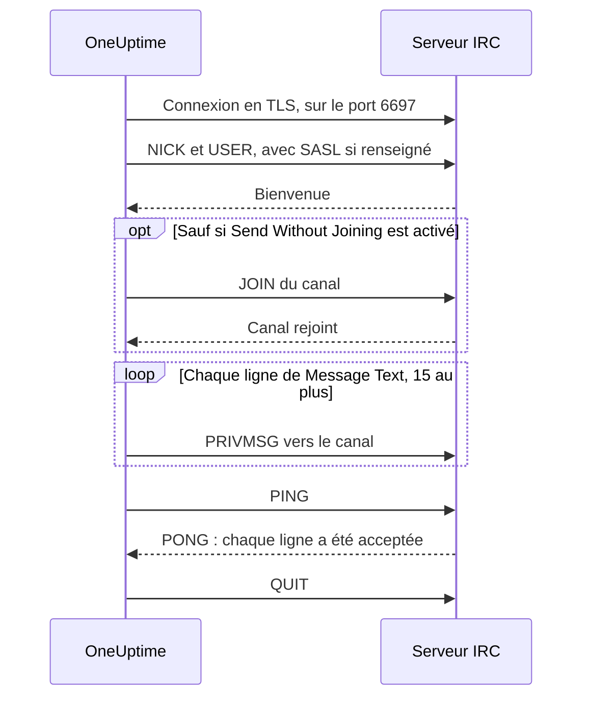

# Intégration IRC

Publiez les mises à jour d'incidents dans un canal de n'importe quel réseau IRC : Libera.Chat, OFTC ou votre propre serveur.

IRC n'a pas de webhooks : l'étape de workflow **Send Message to IRC** de OneUptime se connecte donc elle-même au serveur, comme n'importe quel client IRC. Il n'y a rien à installer et aucune application à enregistrer. Cette intégration est **sortante** : OneUptime publie dans le canal et ne lit pas ce qui s'y dit.

:::cards
- [Fonctionnement](#fonctionnement) : Ce qu'une exécution de l'étape échange avec le serveur.
- [Mise en place](#mettre-en-place-lintégration) : Serveur et canal, mots de passe, puis le workflow : à partir du modèle ou de zéro.
- [Conseils](#conseils) : Publier sans rejoindre, SASL, longs messages et rafales.
- [Dépannage](#dépannage) : Ce que signifient les erreurs de l'étape, et quoi changer.
:::

## Fonctionnement

Chaque exécution de l'étape tient une courte conversation avec le serveur IRC, comme le ferait un client IRC, puis raccroche.

1. **Connexion.** L'étape se connecte en TLS sur le port `6697` et vérifie le certificat du serveur.
2. **Enregistrement.** Elle s'enregistre sous le nom `OneUptime`, sauf si vous définissez un autre **Nickname**, et se connecte avec SASL quand **SASL Username** et **SASL Password** sont renseignés.
3. **Entrée dans le canal.** Elle rejoint le canal, sauf si **Send Without Joining** est activé, avec la **Channel Key** si le canal en a une.
4. **Envoi.** Chaque ligne de **Message Text** part comme un message IRC à part entière, un `PRIVMSG`.
5. **Confirmation.** IRC ne dit jamais « remis » : l'étape envoie donc un `PING` et attend le `PONG` du serveur. Un serveur répond dans l'ordre, si bien qu'à ce moment-là tout refus du message est déjà arrivé.
6. **Départ.** Elle quitte le serveur.

L'étape prend sa sortie **Succès** dès que le serveur a accepté chaque ligne. Elle prend **Erreur**, avec la raison dans les termes du serveur quand il en a donné, quand le serveur est injoignable, ou qu'il refuse la connexion, le pseudo, un mot de passe, le canal ou le message.

## Avant de commencer

- Sur OneUptime Cloud, l'offre **Growth** ou une offre supérieure : les workflows et leurs variables en font partie. Les installations auto-hébergées sans facturation n'ont pas de limites d'offre.
- Un rôle qui construit des workflows : **Project Owner**, **Project Admin** ou **Workflow Admin**.
- Un compte sur le réseau IRC, s'il exige que vous soyez connecté. C'est le cas de Libera.Chat pour les connexions depuis certaines adresses de cloud et de VPN.

## Mettre en place l'intégration

:::steps
### Choisir un serveur et un canal

Décidez où vont les messages : le nom d'hôte du serveur, par exemple `irc.libera.chat`, et le canal, par exemple `#your-channel`.

- **IRC Server** prend le nom d'hôte et rien d'autre : pas de `ircs://`, et pas de port. L'étape se connecte en TLS sur le port `6697`. Si votre serveur accepte TLS sur un autre port, indiquez-le dans **Port**, sous **Plus de champs**.
- **Channel** doit être un canal. Un pseudo saisi à cet endroit est refusé, si bien que l'étape n'envoie jamais un message privé à quelqu'un par erreur.

Le serveur doit être un serveur auquel OneUptime a le droit de se connecter. Les adresses de bouclage (`localhost`, `127.0.0.1`), link-local et de métadonnées cloud sont toujours refusées. Sur OneUptime Cloud, un serveur sur une adresse de réseau privé est refusé aussi. Une installation auto-hébergée peut joindre un serveur IRC sur son propre réseau, sauf si `DATA_SOURCE_BLOCK_PRIVATE_ADDRESSES` vaut `true`.

### Enregistrer les mots de passe dans des variables secrètes

Passez cette étape si votre serveur, votre réseau et votre canal ne demandent aucun mot de passe. Sinon, enregistrez chaque mot de passe dans une [variable globale](/docs/workflows/variables#variables-globales) secrète. Le workflow contient alors le nom de la variable au lieu du mot de passe, et vous changez le mot de passe à un seul endroit.

| Paramètre           | À renseigner quand                                                                                | Variable, par exemple |
| ------------------- | ------------------------------------------------------------------------------------------------- | --------------------- |
| **Server Password** | Le serveur ou votre bouncer demande un mot de passe à la connexion.                               | `IRC_SERVER_PASSWORD` |
| **SASL Password**   | Le réseau exige que vous soyez connecté à votre compte. **SASL Username** prend le nom du compte. | `IRC_SASL_PASSWORD`   |
| **Channel Key**     | Le canal a une clé (mode `+k`).                                                                   | `IRC_CHANNEL_KEY`     |

Pour en enregistrer une, ouvrez **Flux de travail → Variables globales** et cliquez sur **Créer : Variable de flux de travail**. Saisissez le nom dans **Nom** et cliquez sur **Suivant**. Collez le mot de passe dans **Contenu**, activez **Secret**, puis cliquez sur **Créer : Variable de flux de travail**. Les journaux d'exécution affichent `[REDACTED]` à la place de la valeur d'une variable secrète.

### Construire le workflow

Partez du modèle, qui construit tout le workflow pour vous, ou de zéro.

:::tabs
@tab À partir du modèle
1. Ouvrez **Flux de travail** et cliquez sur **Créer un flux de travail**.
2. Tapez `IRC` dans **Rechercher des modèles…**, cliquez sur **Tell IRC when an incident opens**, puis sur **Utiliser ce modèle**.
3. Gardez le nom **Notify IRC on new incident** ou changez-le, et cliquez sur **Suivant**.
4. Saisissez **IRC Server** et **IRC Channel**, puis cliquez sur **Créer un flux de travail**.

Le workflow s'ouvre dans le **Constructeur** avec trois étapes : **On Create Incident** ; **Send Message to IRC**, qui publie le numéro, le titre, la gravité et l'état de l'incident en deux lignes ; et une étape **Journal** sur sa sortie **Erreur**, qui consigne pourquoi un message n'a pas été remis. Le serveur et le canal sont enregistrés dans les variables `ircServer` et `ircChannel` du workflow. Si vous avez enregistré des mots de passe à l'étape précédente, cliquez sur **Send Message to IRC**, ouvrez **Plus de champs** et choisissez chaque variable avec le bouton **{ }** de son paramètre.
@tab De zéro
1. Ouvrez **Flux de travail**, cliquez sur **Créer un flux de travail**, choisissez **Partir de zéro**, nommez le workflow et cliquez sur **Créer un flux de travail**.
2. Dans le **Constructeur**, cliquez sur **Choisissez ce qui démarre ce flux de travail** et choisissez **On Create Incident** sous **Popular**. Cliquez sur le déclencheur et, dans **Select Fields**, choisissez les champs de l'incident que votre message affiche, par exemple son titre.
3. Cliquez sur **Ajouter un composant**, cherchez `irc` et cliquez sur **Send Message to IRC**. Reliez la sortie **Succès** du déclencheur à cette étape.
4. Cliquez sur la nouvelle étape et renseignez **IRC Server**, **Channel** et **Message Text**. Le bouton **{ }** de **Message Text** insère les champs de l'incident, par exemple son titre.
5. Si vous avez enregistré des mots de passe à l'étape précédente, ouvrez **Plus de champs**. Dans **Server Password**, **SASL Password** ou **Channel Key**, cliquez sur **{ }** et choisissez la variable sous **Variables globales**. Mettez le nom de votre compte dans **SASL Username**.
:::

### L'activer et le tester

Basculez l'interrupteur **Activé** en haut du **Constructeur**. À partir de là, chaque nouvel incident est publié dans le canal.

Pour tester sans ouvrir d'incident, cliquez sur **Exécuter le flux de travail** et indiquez l'ID d'un incident existant dans **ID d'incident**. La page de l'incident affiche son ID. Cliquez sur **Run Workflow Manually** et confirmez avec **Run**. Le panneau **Exécution du flux de travail** suit l'exécution : le journal de l'étape IRC indique combien de lignes elle a envoyées, par exemple `Sent 2 lines to #your-channel.`, et le message apparaît dans le canal. Si l'étape prend **Erreur** à la place, son journal dit pourquoi : voir [Dépannage](#dépannage).
:::

## Conseils

- **Publier sans rejoindre.** La plupart des canaux n'acceptent que les messages de leurs membres (mode `+n`) : l'étape rejoint donc le canal avant de publier et le quitte aussitôt après. Un canal en `-n` accepte les messages venus de l'extérieur : activez **Send Without Joining** sous **Plus de champs**, et le canal ne voit pas l'étape aller et venir.
- **Se connecter avec SASL.** Sur les réseaux qui utilisent SASL, comme Libera.Chat, renseignez **SASL Username** et **SASL Password** pour vous connecter à votre compte. Libera.Chat l'exige pour les connexions depuis certaines adresses de cloud et de VPN. Voir [le guide SASL de Libera.Chat](https://libera.chat/guides/sasl).
- **Tenir compte de la limite de 15 lignes.** Chaque ligne de **Message Text** est un message IRC à part entière, une ligne longue est découpée pour tenir, et les lignes vides sont ignorées. Un message est envoyé en 15 lignes IRC au plus : un message plus long est coupé, et sa dernière ligne le signale. Les quatre premières lignes partent d'un coup et les suivantes une par seconde, le rythme des clients IRC, si bien que 15 lignes prennent environ 11 secondes.
- **Regrouper les rafales en un seul message.** Chaque exécution est une connexion à part, et les réseaux IRC limitent la fréquence à laquelle une même adresse peut se connecter. Une rafale d'exécutions peut être refusée avec une raison comme `Reconnecting too fast`, et prend **Erreur** comme tout autre refus. Pour un workflow qui peut se déclencher de nombreuses fois par minute, regroupez ce qu'il a à dire en un seul message, ou passez par votre propre serveur.
- **Mettre en forme avec les codes d'IRC.** IRC n'a pas de Markdown : le texte est envoyé tel qu'il est saisi. Les codes de mise en forme d'IRC, comme le gras et les couleurs, fonctionnent.
- **Un serveur sans TLS.** N'activez **Disable TLS** que pour un serveur qui ne propose pas TLS : l'étape se connecte alors sur le port `6667`, et tout mot de passe est envoyé en clair. Pour faire confiance au certificat d'un serveur émis par votre propre autorité de certification, une installation auto-hébergée définit plutôt `NODE_EXTRA_CA_CERTS`.
- **Un autre pseudo.** Les messages viennent de `OneUptime`, sauf si vous définissez **Nickname**. Si le pseudo est pris, l'étape ajoute un tiret bas ou un nombre.

## Dépannage

Quand l'étape prend **Erreur**, le journal d'exécution dit pourquoi, dans une phrase qui commence comme l'une de celles-ci.

:::details "The IRC server refused the connection"
Le serveur, ou votre bouncer, a refusé la connexion, et le message se termine par sa raison. Quand le serveur veut un mot de passe, le message le dit : renseignez **Server Password**, ou vérifiez-le.
:::

:::details "SASL sign-in failed"
Le réseau a refusé le compte ou le mot de passe. Vérifiez **SASL Username** et **SASL Password**.
:::

:::details "Could not join #your-channel"
Le canal a refusé l'étape, pour la raison qu'indique le message. Un canal qui a une clé en a besoin dans **Channel Key**.
:::

:::details "Could not send to #your-channel"
Le serveur a refusé le message, pour la raison qu'indique le message. Avec **Send Without Joining** activé, le canal n'accepte peut-être que les messages de ses membres : désactivez-le.
:::

:::details "The TLS certificate of the IRC server … is not trusted"
Le certificat du serveur n'est pas un certificat auquel OneUptime fait confiance. Une installation auto-hébergée peut faire confiance à sa propre autorité de certification avec `NODE_EXTRA_CA_CERTS`. N'activez **Disable TLS** que pour un serveur qui ne propose pas TLS.
:::

## Étapes suivantes

:::cards
- [Composants → IRC](/docs/workflows/components#irc) : Chaque paramètre de l'étape, et ce que signifient ses sorties.
- [Variables](/docs/workflows/variables#variables-globales) : Les variables globales secrètes, et comment les étapes les utilisent.
- [Exécutions](/docs/workflows/runs-and-logs) : Lire ce qu'a fait chaque exécution du workflow.
- [Vue d'ensemble des intégrations](/docs/integrations/index) : Le modèle sortant, et les autres outils que vous pouvez connecter.
:::
