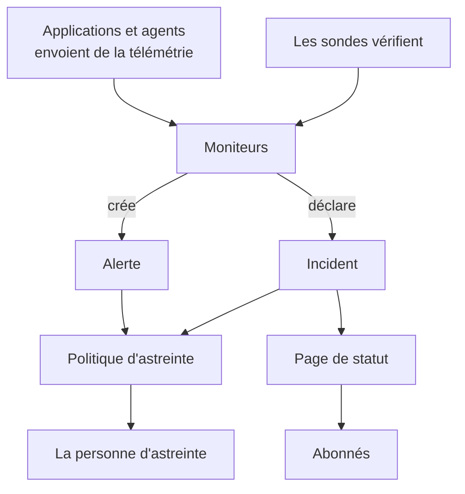

# Concepts clés

OneUptime compte de nombreux produits, mais ils reposent sur une poignée d'idées : les projets, les moniteurs, les incidents et les alertes, l'astreinte, les pages de statut et la télémétrie. Cette page explique chacune en quelques phrases, montre comment elles s'articulent et renvoie vers les pages qui les traitent en détail. Lisez-la une fois, et toutes les autres pages de la documentation se liront plus facilement.

:::cards
- [Projets et personnes](#projets-et-personnes): Où tout se trouve, et qui peut faire quoi.
- [Moniteurs et sondes](#moniteurs-et-sondes): Comment OneUptime remarque que quelque chose ne va pas.
- [Incidents et alertes](#incidents-et-alertes): L'élément à partir duquel votre équipe travaille.
- [Astreinte](#astreinte): Qui est alerté, comment, et qui vient ensuite.
:::

## Comment les éléments s'articulent

Un problème traverse OneUptime dans un seul sens. Les sondes et votre propre télémétrie alimentent les moniteurs. Les critères d'un moniteur décident quand quelque chose ne va pas et de ce qu'il faut ouvrir : un incident, une alerte, ou les deux. Les politiques d'astreinte alertent des personnes à leur sujet, et les pages de statut informent vos clients des incidents.

## Projets et personnes

Un **projet** contient tout : moniteurs, incidents, politiques d'astreinte, pages de statut, télémétrie et paramètres. La plupart des entreprises en ont besoin d'un seul, certaines en tiennent un par environnement ou par activité. Rien de ce que vous créez dans un projet n'est visible dans un autre.

Votre **compte** est distinct de vos projets. Un compte, avec une adresse e-mail et un mot de passe, peut appartenir à autant de projets que vous voulez ; passez de l'un à l'autre avec le sélecteur de projet en haut à gauche. Consultez [Votre compte](/docs/introduction/your-account).

Les personnes font partie d'un projet par l'intermédiaire d'**équipes**, et les autorisations d'une équipe décident de ce que ses membres peuvent faire. Chaque nouveau projet commence avec trois équipes : Owners, dont vous faites partie, Admin et Members. Sur OneUptime Cloud, chaque projet a son propre forfait.

:::cards
- [Utilisateurs, équipes et autorisations](/docs/permissions/index): Inviter des personnes et décider de ce qu'elles peuvent faire.
:::

## Moniteurs et sondes

Un **moniteur** vérifie une chose que vous exploitez et décide si elle fonctionne. La plupart des moniteurs sont vérifiés par des **sondes** : des machines qui exécutent la vérification selon un calendrier, par exemple en demandant une page, en appelant une API, en envoyant un ping à un hôte ou en interrogeant une base de données. OneUptime Cloud exécute des sondes dans plusieurs régions, une installation auto-hébergée exécute les siennes, et vous pouvez ajouter des sondes personnalisées dans votre réseau. D'autres moniteurs lisent plutôt ce que vous envoyez : la télémétrie de vos applications, ou les données qu'un agent remonte depuis vos serveurs, vos clusters Kubernetes et le reste de votre infrastructure.

Les **critères** d'un moniteur décident de ce que signifie chaque résultat. Ils sont examinés dans l'ordre, et le premier qui correspond peut changer l'état du moniteur, déclarer un incident, créer une alerte, ou les trois. Chaque nouveau projet a trois états de moniteur : **Opérationnel**, **Dégradé** et **Hors ligne**.

:::cards
- [Créer un moniteur](/docs/monitor/create-monitor): Choisir un type, dire quoi vérifier, et à quelle fréquence.
- [Sondes personnalisées](/docs/probe/custom-probe): Vérifier ce que seul votre propre réseau peut atteindre.
:::

## Incidents et alertes

Tous deux consignent un problème, et tous deux peuvent alerter la personne d'astreinte. Ce qui les distingue, c'est qui le problème touche.

| | Incident | Alerte |
| --- | --- | --- |
| **Ce que c'est** | Un problème qui touche vos utilisateurs, comme une panne ou un ralentissement | Un problème que votre équipe doit examiner avant que les utilisateurs ne soient touchés |
| **Sur les pages de statut** | Peut apparaître, et prévient les abonnés | Jamais |
| **États de départ** | **Identifié**, **Pris en compte**, **Résolu** | **Identifié**, **Pris en compte**, **Résolu** |
| **Gravités de départ** | Critical Incident, Major Incident, Minor Incident | **Élevé**, **Low** |

Le prendre en compte indique que quelqu'un s'en occupe, et empêche ses politiques d'astreinte d'alerter le niveau suivant. Le résoudre le clôt. Vous pouvez ajouter vos propres états et gravités, et lier des alertes à l'incident dont elles faisaient partie.

Un **épisode** regroupe des incidents liés, ou des alertes liées, pour que votre équipe les traite comme un seul. Des règles de regroupement décident de ce qui va ensemble.

:::cards
- [Vue d'ensemble des incidents](/docs/incidents/index): Comment les incidents sont déclarés, traités et résolus.
- [Alertes liées](/docs/incidents/linked-alerts): Rattacher les alertes déclenchées par une panne à son incident.
:::

## Astreinte

Une **politique d'astreinte** décide de qui est alerté pour un incident ou une alerte, et de qui vient ensuite si personne ne répond. Ses **règles d'escalade** sont ses niveaux : chacune alerte ses personnes, puis attend que quelqu'un prenne en compte avant que le niveau suivant soit alerté. Un niveau peut alerter des personnes, des équipes ou un **planning d'astreinte**, une rotation qui sait à tout moment qui est d'astreinte.

Chaque personne décide de la façon dont on la joint. Dans les **Paramètres utilisateur**, chacun conserve les moyens par lesquels OneUptime peut le joindre, comme l'e-mail, le SMS, les appels, les notifications push, Slack ou Microsoft Teams, et ceux à utiliser quand il est alerté.

:::cards
- [Règles d'escalade](/docs/on-call/escalation-rules): Alerter niveau par niveau jusqu'à ce que quelqu'un réponde.
- [Plannings d'astreinte](/docs/on-call/schedules): Rotations, couches et passations.
:::

## Pages de statut et maintenance

Une **page de statut** montre à vos clients si vos services fonctionnent. Vous choisissez les moniteurs qu'elle affiche, sous des noms que vos clients comprennent. Tant qu'un incident sur l'un de ces moniteurs est actif, la page l'affiche, et ses **abonnés** sont prévenus par e-mail, SMS, Slack, Microsoft Teams ou webhook. Une page de statut peut être publique, ou privée pour les personnes que vous y admettez.

La **maintenance planifiée** annonce à l'avance des travaux prévus. Un événement passe par **Planifié**, **En cours**, **Terminé** et **Achevé**, et les pages de statut sur lesquelles vous l'affichez en informent les visiteurs et les abonnés.

:::cards
- [Vue d'ensemble des pages de statut](/docs/status-pages/index): Créer une page de statut et décider de ce qu'elle affiche.
- [Abonnés et annonces](/docs/status-pages/subscribers): Qui est prévenu, et quand.
:::

## Télémétrie

La **télémétrie** est ce que vos systèmes envoient à OneUptime : journaux, métriques, traces, exceptions et profils. Les applications l'envoient avec OpenTelemetry, et les agents de OneUptime l'envoient depuis des hôtes, des clusters Kubernetes, des hôtes Docker et le reste de votre infrastructure. Chaque émetteur utilise une **clé d'ingestion**, créée sous **Paramètres du projet → Télémétrie & APM → Clés d'ingestion**. Vous recherchez la télémétrie, la représentez sur des tableaux de bord et la surveillez avec des moniteurs de télémétrie, qui déclenchent des incidents et des alertes comme n'importe quel autre moniteur.

:::cards
- [OpenTelemetry](/docs/telemetry/open-telemetry): Envoyer les journaux, les métriques et les traces de vos applications.
- [Surveillance des journaux](/docs/monitor/logs-monitor): Être prévenu quand un motif apparaît dans vos journaux.
:::

## Automatisation et IA

- Les **Flux de travail** exécutent des actions quand quelque chose se produit, comme publier un message dans Slack quand un incident est déclaré.
- Les **Runbooks** transforment une procédure d'intervention en étapes que votre équipe peut exécuter, à la main ou automatiquement.
- **OneUptime AI** enquête sur les nouveaux incidents et les nouvelles alertes et publie ce qu'elle a trouvé dans leur chronologie, et **Demander à l'IA** répond aux questions sur votre projet. Un nouveau projet démarre avec l'IA activée ; l'interrupteur **Activer l'IA** sous **Paramètres du projet → IA → Fonctionnalités IA** la désactive entièrement.

:::cards
- [Présentation des workflows](/docs/workflows/index): Automatiser des actions avec des déclencheurs et des composants.
- [AI SRE](/docs/ai/ai-sre): Comment OneUptime AI enquête sur les incidents et les alertes.
:::

## Étiquettes et propriétaires

Les **étiquettes** sont des mots-clés que vous posez sur les moniteurs, les incidents, les pages de statut et la plupart des autres ressources, pour les filtrer et les regrouper. Les autorisations d'une équipe peuvent être limitées aux ressources portant certaines étiquettes. Les **propriétaires** sont les personnes et les équipes responsables d'une ressource : ils sont prévenus quand il lui arrive quelque chose. Les règles d'étiquettes et de propriétaires ajoutent pour vous des étiquettes et des propriétaires aux nouvelles ressources.

:::cards
- [Règles d'étiquettes et de propriétaires](/docs/configuration/label-and-owner-rules): Étiqueter les nouvelles ressources et leur donner des propriétaires automatiquement.
:::

## Étapes suivantes

:::cards
- [Démarrage rapide](/docs/introduction/quickstart): Mettre ces idées en pratique en quinze minutes.
- [Page d'accueil et raccourcis](/docs/introduction/home): Trouver chaque produit dans le tableau de bord.
- [Créer un moniteur](/docs/monitor/create-monitor): Votre premier moniteur, champ par champ.
- [Vue d'ensemble des incidents](/docs/incidents/index): Ce qui se passe après qu'un moniteur déclare un incident.
:::
