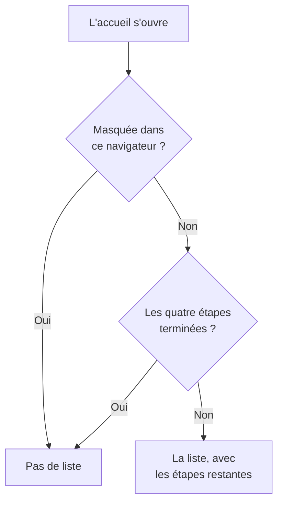

# Page d'accueil et raccourcis

L'accueil est la première page que vous voyez dans un projet. Il vous dit d'un coup d'œil si quelque chose demande votre attention en ce moment, et guide un nouveau projet dans sa première configuration. Cette page explique ce que montre l'accueil, comment trouver n'importe quel produit, page ou action dans le tableau de bord, et les raccourcis clavier qui vous évitent des allers-retours dans les menus.

:::cards
- [Ce que montre l'accueil](#ce-que-montre-laccueil): La liste de bienvenue, les cinq tuiles et les incidents actifs.
- [Se repérer](#se-repérer): Le menu Produits et les barres en haut de chaque page.
- [Rechercher](#rechercher-une-page-un-paramètre-ou-une-action): Trouver n'importe quelle page, paramètre ou action en tapant son nom.
- [Raccourcis clavier](#raccourcis-clavier): Aller à l'accueil, aux moniteurs ou aux incidents en deux touches.
:::

## Ce que montre l'accueil

Ouvrez **Accueil** dans la barre du haut, ou appuyez sur `g` puis `h` depuis n'importe où. De haut en bas, l'accueil affiche :

1. **Bienvenue sur OneUptime 👋**, une liste de vérification pour un nouveau projet, jusqu'à ce qu'elle soit terminée.
2. Cinq tuiles qui comptent ce qui demande de l'attention.
3. **Incidents actifs**, chaque incident qui n'est pas encore résolu.

### La liste de bienvenue

La liste vous guide à travers les quatre choses dont un projet a besoin pour être utile. Chaque étape ouvre la page où vous la réalisez, et se coche d'elle-même quand le projet a ce qu'elle demande.

| Étape | Terminée quand | Ouvre |
| --- | --- | --- |
| **Créez votre premier moniteur** | Le projet a un moniteur. | Le formulaire **Créer un moniteur**, ou la liste **Moniteurs** pour quelqu'un qui ne peut pas créer de moniteurs. |
| **Publiez une page de statut** | Le projet a une page de statut. | **Pages de statut** |
| **Invitez votre équipe** | Quelqu'un d'autre que vous est dans le projet, ou y est invité. | **Utilisateurs** |
| **Configurez une politique d'astreinte** | Le projet a une politique d'astreinte. | **Astreinte** |

Sous les étapes, **Comment fonctionne OneUptime** montre les quatre produits essentiels dans l'ordre où un problème les traverse : **Moniteurs**, **Incidents et alertes**, **Astreinte** et **Pages de statut**. Cliquez sur l'un d'eux pour l'ouvrir.

La liste disparaît une fois les quatre étapes terminées. Pour la masquer plus tôt, cliquez sur **Masquer**. Le masquage vaut pour ce navigateur et ce projet ; tout ce que les étapes ouvrent reste dans le menu **Produits**.

### Les tuiles

Chaque tuile compte quelque chose, dit si cela demande votre attention, et ouvre la liste qui se cache derrière le nombre.

| Tuile | Ce qu'elle compte | Quand le nombre est zéro |
| --- | --- | --- |
| **Incidents actifs** | Les incidents qui ne sont pas résolus | **Tout va bien** |
| **Alertes actives** | Les alertes qui ne sont pas résolues | **Tout va bien** |
| **Moniteurs non opérationnels** | Les moniteurs dont l'état n'est pas un état opérationnel. Les moniteurs archivés ne comptent pas. | **Tous opérationnels** |
| **Maintenance en cours** | Les événements de maintenance planifiée en cours | **Aucune en cours** |
| **SLO à risque** | Les SLO activés qui sont à risque ou ont épuisé leur budget d'erreur | **Budgets sains** |

Un nombre supérieur à zéro affiche **Attention requise**, ou **En cours** et **Budget qui s'épuise** sur les tuiles de maintenance et de SLO. Un projet sans moniteur voit **Aucun moniteur pour l'instant** sur la tuile des moniteurs, et un projet sans SLO voit **Aucun SLO pour l'instant** : un projet vide n'est pas un projet en bonne santé. Ces deux tuiles ouvrent alors les listes **Moniteurs** et **SLOs**, où vous en créez un.

### Le menu latéral de l'accueil

Le menu latéral de l'accueil contient les mêmes listes, chacune avec un compteur :

| Section | Pages |
| --- | --- |
| **Incidents** | **Incidents actifs** et **Épisodes actifs** |
| **Alertes** | **Alertes actives** et **Épisodes actifs** |
| **Moniteurs** | **Non opérationnel** |
| **Événements planifiés** | **En cours** |

Un épisode regroupe des incidents ou des alertes liés pour que vous les traitiez comme un seul. Consultez [Concepts clés](/docs/introduction/core-concepts#incidents-et-alertes).

## Se repérer

Tout dans OneUptime se trouve sous **Produits** dans la barre du haut. Le menu présente ses groupes comme les lignes d'une seule liste, et s'ouvre toujours avec le premier d'entre eux, les essentiels, déplié : Moniteurs, Incidents, Alertes, Astreinte, Pages de statut, Maintenance planifiée et SLO. Chaque autre groupe (Observabilité, AI, Code, Ressources, Infrastructure, Tableaux de bord et automatisation et Paramètres) est replié en une ligne de la même liste. Chaque ligne nomme les produits du groupe et indique leur nombre. Cliquez sur une ligne pour la déplier ou la replier, ou atteignez-la avec les flèches et appuyez sur **Entrée**.

- **La recherche trouve tout.** Tapez dans le champ de recherche du menu pour trouver n'importe quel produit par son nom, par ce qu'il fait, ou par un mot familier comme `k8s` ou `RUM`. La recherche regarde aussi dans les groupes repliés.
- **Vous partez de là où vous êtes.** Le groupe de la page sur laquelle vous êtes se déplie tout seul, et les produits que vous avez ouverts récemment sont listés en haut.
- **Vos choix restent.** Le menu retient, dans votre navigateur, quels autres groupes vous avez dépliés ou repliés. Les essentiels sont de nouveau dépliés chaque fois que vous ouvrez le menu, même si vous les aviez repliés.
- **Sur un téléphone**, le bouton du menu liste les produits de la même façon : les essentiels dépliés en haut, et chaque autre groupe sous la forme d'une ligne qui s'ouvre d'un toucher.

### Les barres du haut

Deux barres traversent le haut de chaque page.

| Où | Ce qu'il y a |
| --- | --- |
| En haut à gauche | Le sélecteur de projet : passer à un autre de vos projets, ou en créer un nouveau. |
| En haut à droite | **Rechercher** et **Demander à l'IA**, la cloche de notifications avec ce qui vous attend (incidents et alertes actifs, politiques d'astreinte dont vous êtes de garde, invitations en attente), **Aide**, et votre photo, qui ouvre le menu de votre [compte](/docs/introduction/your-account). |
| En dessous | **Accueil** et **Produits** à gauche, **Paramètres utilisateur** à droite : comment OneUptime vous joint dans ce projet. |

**Aide** ouvre cette documentation (**Documentation**) et la liste **Raccourcis clavier**, et propose du support par e-mail et sur Slack. Sur un écran étroit, comme un téléphone, **Rechercher**, **Demander à l'IA** et **Aide** disparaissent pour gagner de la place ; la cloche et votre photo restent.

## Rechercher une page, un paramètre ou une action

Appuyez sur **Cmd+K** (Mac) ou **Ctrl+K** (Windows et Linux), ou cliquez sur l'icône de recherche dans la barre du haut, et commencez à taper. La recherche trouve :

- **Chaque page des menus**, sous le nom que le menu lui donne : Clés API, Zone de danger, Plannings d'astreinte, Gravité de l'incident, vos propres Méthodes de notification. Chaque résultat indique où il se trouve, par exemple *Paramètres du projet › Avancé*, si bien que les pages qui portent le même nom (Champs personnalisés dans Incidents, Alertes et Moniteurs) se distinguent facilement.
- **Actions**, d'après ce que vous voulez faire : Déclarer un incident, Créer un moniteur, ou Supprimer le projet, qui ouvre la Zone de danger. Une action qui modifie quelque chose n'est proposée qu'aux personnes autorisées à la faire.
- **Vos moniteurs, incidents, alertes, pages de statut et politiques d'astreinte**, par leur nom.

La recherche lit ce que vous tapez comme vous l'entendez :

- La casse, les accents, les espaces et les traits d'union ne comptent pas : *on-call*, *on call* et *oncall* trouvent les mêmes pages, et les mots peuvent venir dans n'importe quel ordre.
- Elle connaît d'autres mots pour de nombreuses pages, en anglais : *pager* ou *escalation* pour Politiques d'astreinte, *rota* pour Plannings d'astreinte, *2fa* pour l'authentification à deux facteurs, *delete project* pour la Zone de danger.
- Ajoutez le nom du produit pour affiner une recherche : *incident custom fields* trouve la page Champs personnalisés des incidents.
- Une petite faute de frappe, comme *incidnet*, trouve quand même ce que vous vouliez quand rien ne correspond tel quel.

Avec le champ de recherche vide, la recherche liste les pages ouvertes récemment, les actions et les produits.

## Raccourcis clavier

Appuyez sur `?` n'importe où dans le tableau de bord pour voir tous les raccourcis, ou ouvrez **Aide** et choisissez **Raccourcis clavier**. Sur un Mac, `Mod` est la touche Commande ; sous Windows et Linux, c'est Ctrl.

| Touches | Ce qu'elles font |
| --- | --- |
| `Mod` + `K` | Ouvrir la palette de commandes : rechercher n'importe quelle page, paramètre ou action. |
| `Mod` + `I` | Demander à l'IA au sujet de ce que vous regardez. |
| `/` | Rechercher dans la liste de cette page. |
| `?` | Afficher les raccourcis clavier. |
| `Esc` | Fermer une boîte de dialogue ou un panneau. |

### Aller à un produit

Appuyez sur `g`, puis sur une lettre, pour aller directement à un produit. Appuyez sur la lettre dans les 1,5 secondes qui suivent `g`.

| Touches | Va à |
| --- | --- |
| `g` puis `h` | Accueil |
| `g` puis `m` | Moniteurs |
| `g` puis `i` | Incidents |
| `g` puis `a` | Alertes |
| `g` puis `o` | Astreinte |
| `g` puis `s` | Pages de statut |
| `g` puis `e` | Maintenance planifiée |
| `g` puis `d` | Tableaux de bord |
| `g` puis `l` | Journaux |
| `g` puis `t` | Traces |

Les raccourcis ne vous gênent pas. `?`, `/` et `g` ne font rien pendant que vous tapez dans un champ, et rien ne vous fait quitter la page tant qu'une boîte de dialogue est ouverte : une touche accidentelle ne peut pas vous faire perdre un formulaire à moitié rempli. Tout autre produit est à une recherche de vous avec `Mod` + `K`.

## Étapes suivantes

:::cards
- [Démarrage rapide](/docs/introduction/quickstart): Suivre la liste de bienvenue, étape par étape.
- [Votre compte](/docs/introduction/your-account): Votre profil, la sécurité de votre connexion, la langue et le thème.
- [Demander à l'IA](/docs/ai/ask-ai): Ce que l'IA peut vous répondre et faire pour vous.
- [Concepts clés](/docs/introduction/core-concepts): Ce que sont les moniteurs, les incidents, les alertes et l'astreinte.
:::
