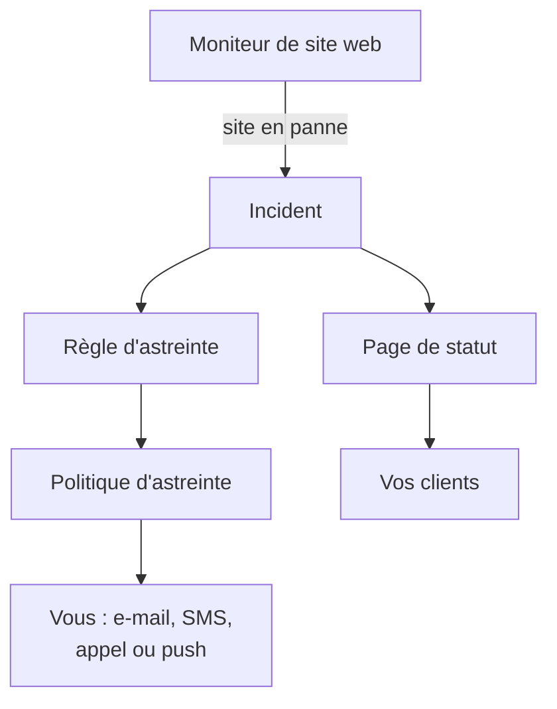

# Démarrage rapide

Ce guide vous mène d'un nouveau compte à une configuration qui fonctionne en une quinzaine de minutes : un moniteur qui vérifie votre site web toutes les cinq minutes, une politique d'astreinte qui vous alerte quand le site tombe, et une page de statut qui informe vos clients. Il suit la liste de vérification **Bienvenue sur OneUptime 👋** de la page d'accueil de votre projet.

## Avant de commencer

- **Un compte.** Sur OneUptime Cloud, inscrivez-vous sur [oneuptime.com](https://oneuptime.com/accounts/register) et ouvrez le lien de l'e-mail que vous recevez. Sur votre propre installation, ouvrez-la dans votre navigateur et inscrivez-vous : le premier compte devient l'administrateur principal. Pour en installer une, consultez [Docker Compose](/docs/installation/docker-compose).
- **Un site web à surveiller.** N'importe quelle adresse qui répond en HTTP ou HTTPS, comme la page d'accueil de votre entreprise.

## Créer un projet

Dans OneUptime, tout se trouve dans un projet : vos moniteurs, incidents, politiques d'astreinte, pages de statut et les personnes qui y travaillent.

:::steps
### Commencer un nouveau projet

À votre première connexion, OneUptime affiche **Aucun projet**. Cliquez sur **Créer un nouveau projet**. Si quelqu'un vous a déjà invité dans un projet, acceptez plutôt l'invitation sur la même page.

### Lui donner un nom

Saisissez un **Nom du projet**, par exemple le nom de votre entreprise. Sur OneUptime Cloud, l'étape suivante vous demande de choisir un forfait.

### Le créer

Cliquez sur **Créer un projet**. La page d'accueil de votre projet s'ouvre, avec la liste de vérification **Bienvenue sur OneUptime 👋** en haut.
:::

## Surveiller votre site web

:::steps
### Ouvrir la création d'un moniteur

Dans la liste de vérification, cliquez sur **Créez votre premier moniteur**. Vous pouvez aussi ouvrir **Moniteurs** depuis le menu **Produits** et cliquer sur **Créer un moniteur**.

### Choisir Site web

Sous **Type de moniteur**, choisissez **Site web**. Saisissez un **Nom**, par exemple `Website`, et cliquez sur **Suivant**.

### Saisir l'adresse

Saisissez l'adresse complète de votre site dans **URL du site web**, par exemple `https://example.com`. OneUptime ajoute les critères pour vous : le moniteur passe **Hors ligne** et déclare un incident quand le site ne répond pas, ou répond par une erreur. Cliquez sur **Suivant**.

### Créer le moniteur

Gardez les **Sondes** sélectionnées et l'**Intervalle de surveillance** **Toutes les 5 minutes**, puis cliquez sur **Créer un moniteur**. La page du moniteur s'ouvre, et les sondes commencent à vérifier votre site.
:::

Pour essayer la vérification avant d'enregistrer, cliquez sur **Tester le moniteur** à la deuxième étape. Tous les autres types de moniteurs sont décrits dans [Créer un moniteur](/docs/monitor/create-monitor).

## Être alerté en cas de panne

En l'état, un incident sans propriétaire est envoyé par e-mail aux propriétaires du projet, dont vous faites partie. Pour être alerté jusqu'à ce que quelqu'un réponde, créez une politique d'astreinte et faites-la déclencher par chaque incident.

:::steps
### Créer une politique d'astreinte

Dans la liste de vérification, cliquez sur **Configurez une politique d'astreinte**, ou ouvrez **Astreinte** depuis le menu **Produits**. Cliquez sur **Créer : Politique d'astreinte** et saisissez un **Nom**. Sous **Qui est alerté en premier ?**, cliquez sur **Ajouter un intervenant** et choisissez-vous. Cliquez sur **Créer : Politique d'astreinte**.

### La déclencher pour chaque incident

Ouvrez **Incidents** depuis le menu **Produits**, dépliez **Règles** dans le menu latéral et choisissez **Règles d'astreinte**. Cliquez sur **Créer : Règle d'astreinte des incidents**, saisissez un **Nom** et cliquez sur **Suivant**. Laissez **Critères de correspondance** vide, pour que la règle s'applique à chaque incident, et cliquez sur **Suivant**. Choisissez votre politique sous **Politiques d'astreinte** et cliquez sur **Créer : Règle d'astreinte des incidents**.

### Choisir comment vous êtes joint

Votre e-mail de connexion est déjà un moyen de vous joindre. Pour recevoir aussi des SMS ou des appels, ouvrez **Paramètres utilisateur** dans la barre sous la barre supérieure, allez dans **Méthodes de notification** et, dans l'onglet **Direct Contact**, ajoutez votre numéro sous **Numéros de téléphone pour les notifications SMS** ou **Numéros de téléphone pour les notifications par appel**. Cliquez sur **Vérifier** et saisissez le code que OneUptime vous envoie. Un numéro vérifié sert aussitôt aux alertes d'astreinte.
:::

> [!NOTE]
> Les SMS et les appels téléphoniques sont désactivés dans un nouveau projet. Un propriétaire du projet, un Billing Admin ou une personne disposant de Manage Billing les active dans la carte **Canaux de notification**, sous **Paramètres du projet → Notifications → Paramètres de notification**.

Pour plus de niveaux, des rotations et le délai d'attente de chaque niveau, consultez [Règles d'escalade](/docs/on-call/escalation-rules) et [Plannings d'astreinte](/docs/on-call/schedules).

## Publier une page de statut

:::steps
### Créer la page de statut

Dans la liste de vérification, cliquez sur **Publiez une page de statut**, ou ouvrez **Pages de statut** depuis le menu **Produits**. Cliquez sur **Créer une page de statut**, saisissez un **Nom**, par exemple `Acme Status`, et cliquez sur **Créer une page de statut**.

### Ajouter votre moniteur

Ouvrez la nouvelle page de statut. Dans son menu latéral, sous **Ressources**, choisissez **Moniteurs** ; l'entrée s'appelle **Ressources** dans les projets où les groupes de moniteurs sont activés. Cliquez sur **Ajouter un moniteur**, choisissez votre moniteur de site web et cliquez sur **Ajouter un moniteur**. La ligne montre aux visiteurs le nom du moniteur ; modifiez-le sous **Nom d'affichage** si vous le souhaitez.

### Ouvrir la page

Choisissez **Vue d'ensemble** dans le menu latéral. La carte **Status Page Preview URL** pointe vers votre page de statut : ouvrez-la, et votre site web y apparaît comme opérationnel.
:::

Une nouvelle page de statut est publique : toute personne disposant de son adresse peut l'ouvrir. Pour lui donner votre propre domaine, votre logo et vos couleurs, consultez [Personnalisation et domaines de la page de statut](/docs/status-pages/branding-and-domains).

## Inviter votre équipe

Dans la liste de vérification, cliquez sur **Invitez votre équipe**, ou ouvrez **Utilisateurs** depuis le menu **Produits**, sous **Paramètres**. Cliquez sur **Inviter un utilisateur**, saisissez son **E-mail** et choisissez une **Équipe** : l'équipe des membres est choisie au départ. Cliquez sur **Inviter**. OneUptime lui envoie l'invitation par e-mail, et l'équipe décide de ce que la personne peut faire. Consultez [Utilisateurs, équipes et autorisations](/docs/permissions/index).

## L'essayer

Déclarez un incident de test pour voir toute la chaîne fonctionner.

:::steps
### Déclarer un incident de test

Ouvrez **Incidents** et cliquez sur **Déclarer un incident**. Saisissez un **Titre**, par exemple `Test incident`, choisissez une **Gravité de l'incident** et cliquez sur **Suivant**. Sous **Moniteurs**, choisissez votre moniteur de site web, pour que l'incident apparaisse sur votre page de statut. Cliquez sur **Suivant** jusqu'au récapitulatif, puis sur **Déclarer un incident**.

### Observer ce qui se passe

En une minute ou deux, votre politique d'astreinte vous alerte, et l'incident apparaît sur votre page de statut.

### Le résoudre

Sur la page de l'incident, cliquez sur **Résoudre**. Les alertes s'arrêtent, et l'incident quitte votre page de statut.
:::

> [!WARNING]
> Toute personne qui ouvre votre page de statut voit l'incident de test jusqu'à ce que vous le résolviez. Faites le test avant de partager l'adresse de la page.

## Dépannage

:::details Je n'ai pas été alerté
Ouvrez l'incident et choisissez **Exécutions d'astreinte** dans son menu latéral : vous y voyez si votre politique s'est exécutée et qui elle a alerté. Si elle ne s'est pas exécutée, vérifiez que votre règle d'astreinte est activée et qu'elle désigne la politique. Si elle s'est exécutée, vérifiez que vos méthodes sous **Paramètres utilisateur → Méthodes de notification** sont vérifiées.
:::

:::details L'incident n'apparaît pas sur ma page de statut
Une page de statut affiche un incident quand l'un des moniteurs de l'incident figure sur la page. Vérifiez que l'incident indique votre moniteur dans ses ressources affectées, et que le moniteur figure sur la page de statut.
:::

:::details Le moniteur indique hors ligne, mais mon site fonctionne
Ouvrez le moniteur et regardez ce que les sondes ont reçu. Consultez la section de dépannage de [Surveillance de site web](/docs/monitor/website-monitor).
:::

## Étapes suivantes

:::cards
- [Concepts clés](/docs/introduction/core-concepts): Les idées derrière ce que vous venez de configurer.
- [Plannings d'astreinte](/docs/on-call/schedules): Partager l'astreinte avec votre équipe.
- [Personnalisation et domaines de la page de statut](/docs/status-pages/branding-and-domains): Faire de la page de statut la vôtre.
- [OpenTelemetry](/docs/telemetry/open-telemetry): Envoyer les journaux, les métriques et les traces de vos applications.
:::
