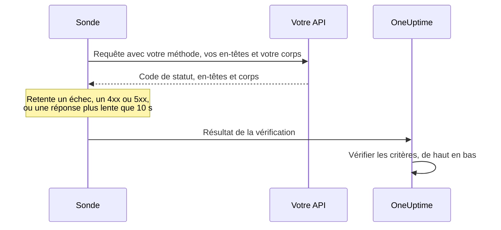

# Surveillance d'API

Un moniteur d'API appelle un point de terminaison HTTP selon une planification, avec la méthode, les en-têtes et le corps que vous choisissez, et vérifie ce qui revient : le code de statut, le temps de réponse, les en-têtes et le corps. Utilisez-le pour les points de terminaison REST, JSON et GraphQL, les vérifications de santé, et tout appel dont vos utilisateurs dépendent.

:::cards
- [Créer le moniteur](#créer-un-moniteur-dapi): Six étapes dans le tableau de bord.
- [Options de configuration](#options-de-configuration): Méthode, en-têtes, corps, redirections, certificats, délais d'expiration et nouvelles tentatives.
- [Critères de surveillance](#critères-de-surveillance): Ce qui compte comme disponible ou en panne, dès le départ.
- [Dépannage](#dépannage): Quand une vérification échoue alors qu'elle devrait réussir.
:::

## Fonctionnement

À chaque vérification, une sonde envoie la requête, suit les redirections et enregistre le code de statut, le temps de réponse, les en-têtes et le corps. Une requête qui échoue, expire, répond avec un statut `4xx` ou `5xx`, ou prend plus de 10 secondes est retentée, jusqu'au nombre de nouvelles tentatives que vous autorisez. OneUptime passe ensuite le résultat dans les critères du moniteur.



Une sonde qui a perdu sa propre connexion réseau ne rapporte aucun résultat, elle ne peut donc pas marquer votre API hors ligne.

## Avant de commencer

- **Un rôle qui peut créer des moniteurs** : Project Owner, Project Admin, Project Member, Monitor Admin ou Monitor Member, ou un rôle personnalisé avec l'autorisation Create Monitor.
- **Une sonde qui peut joindre l'API.** Les sondes par défaut de votre projet sont choisies pour chaque nouveau moniteur. Si un pare-feu protège l'API, autorisez les [adresses IP des sondes de OneUptime Cloud](/docs/configuration/ip-addresses). Une API sur un réseau privé a besoin d'une [sonde personnalisée](/docs/probe/custom-probe) dans ce réseau, autorisée à joindre des adresses privées : voir [Accès au réseau privé](/docs/self-hosted/private-network-access).
- **Des identifiants en secrets de moniteur.** Si l'API a besoin d'une clé ou d'un jeton, stockez-le d'abord comme [secret de moniteur](/docs/monitor/monitor-secrets), pour que le moniteur ne contienne qu'une référence vers lui.

## Créer un moniteur d'API

:::steps
### Commencer un nouveau moniteur

Allez dans **Moniteurs** et cliquez sur **Créer un moniteur**. Sous **Type de moniteur**, choisissez **API**.

### Le nommer

Saisissez un **Nom**, comme `Orders API`, puis cliquez sur **Suivant**.

### Saisir la requête

Dans **URL de l'API**, saisissez l'URL complète du point de terminaison, comme `https://api.example.com/health`. Choisissez le **Type de requête API** (**GET** sauf si vous le changez). Pour ajouter des en-têtes ou un corps, ouvrez **Plus de champs** et renseignez **En-têtes de la requête** et **Corps de la requête (en JSON)**.

### Le tester

Cliquez sur **Tester le moniteur**, choisissez une sonde sous **Sélectionner la sonde** et cliquez sur **Exécuter le test**. **Résultat du test du moniteur** montre ce que l'API a répondu.

### Passer en revue les critères

**Critères du moniteur** commence avec les [critères par défaut](#critères-par-défaut) : hors ligne quand l'API ne répond pas ou répond avec une erreur, en ligne pour tout statut `2xx` ou `3xx`. Pour vérifier aussi ce que l'API renvoie, ajoutez un filtre, puis cliquez sur **Suivant**.

### Choisir les sondes et créer

Gardez ou changez les **Sondes** et l'**Intervalle de surveillance** (il commence à **Toutes les 5 minutes**), puis cliquez sur **Créer un moniteur**. La page du moniteur s'ouvre.
:::

## Options de configuration

### URL de l'API

Le point de terminaison à appeler, sous forme d'URL complète avec son schéma, comme `https://api.example.com/v1/health`. Vous pouvez placer un [secret de moniteur](/docs/monitor/monitor-secrets) dans l'URL sous la forme `{{monitorSecrets.NAME}}`.

### Espaces réservés d'URL dynamiques

Quand un CDN ou un proxy de cache se trouve devant l'API, une sonde peut recevoir une réponse du cache au lieu de votre serveur. Pour passer le cache, ajoutez un espace réservé à l'URL ; la sonde le remplace par une nouvelle valeur à chaque vérification.

| Espace réservé | Remplacé par | Exemple de valeur |
| --- | --- | --- |
| `{{timestamp}}` | L'heure Unix actuelle, en secondes | `1719500000` |
| `{{random}}` | Une chaîne aléatoire et unique de 32 caractères hexadécimaux | `3f2b8c1d9e7a4b6c8d0e1f2a3b4c5d6e` |

Une URL avec un espace réservé :

```text
https://api.example.com/health?cb={{timestamp}}
```

Ce que la sonde demande lors de deux vérifications à cinq minutes d'intervalle :

```text
https://api.example.com/health?cb=1719500000
https://api.example.com/health?cb=1719500300
```

Utilisez `{{random}}` de la même façon : `https://api.example.com/health?nocache={{random}}`.

### Type de requête API

La méthode HTTP à envoyer. **GET** est la valeur par défaut ; les autres sont **POST**, **PUT**, **PATCH**, **DELETE** et **HEAD**. Si une requête **HEAD** reçoit une réponse avec un statut `4xx` ou `5xx`, la sonde la répète en `GET`.

### Plus de champs

Ces réglages sont repliés sous **Plus de champs**. L'en-tête replié les nomme et montre ceux que vous avez changés.

| Champ | Par défaut | Ce qu'il fait |
| --- | --- | --- |
| **En-têtes de la requête** | Aucun | Les en-têtes à envoyer, sous forme de paires nom et valeur. Cliquez sur **Ajouter : Request Header** pour chacun. |
| **Corps de la requête (en JSON)** | Aucun | Un objet JSON à envoyer comme corps, généralement avec **POST**, **PUT** ou **PATCH**. Il doit être du JSON valide. |
| **Ne pas suivre les redirections** | Désactivé | Juger la première réponse au lieu de suivre les redirections. Voir [ci-dessous](#ne-pas-suivre-les-redirections). |
| **Autoriser les certificats auto-signés** | Désactivé | Ignorer la validation du certificat TLS pour le nom d'hôte du moniteur lui-même. |
| **Utiliser un certificat client (mTLS)** | Désactivé | Présenter un certificat client et une clé privée. Voir [Certificat client (mTLS)](#certificat-client-mtls). |
| **Délai d'expiration de la requête (secondes)** | `60` | Combien de temps attendre chaque tentative. Le maximum est de 60 secondes. |
| **Tentatives en cas d'échec** | Valeur par défaut de la sonde, généralement `3` | Combien de fois retenter une tentative échouée. Le maximum est 3. Voir [Nouvelles tentatives et délais](#nouvelles-tentatives-et-délais). |

Les en-têtes et le corps de la requête peuvent utiliser des [secrets de moniteur](/docs/monitor/monitor-secrets), par exemple un en-tête `Authorization` avec la valeur `Bearer {{monitorSecrets.ApiKey}}`.

#### Ne pas suivre les redirections

Par défaut, la sonde suit les redirections (`301`, `302`, `303`, `307` et `308`), jusqu'à 10, et juge la réponse sur laquelle elle aboutit. Activez **Ne pas suivre les redirections** pour juger plutôt la réponse de redirection elle-même. Les [critères par défaut](#critères-par-défaut) comptent une réponse de redirection comme en ligne.

Quand elle suit une redirection :

- Un `303`, ou un `301` ou `302` en réponse à un `POST`, transforme la requête en `GET` sans corps, comme le font les navigateurs.
- Vos en-têtes de requête ne vont qu'à l'origine propre de l'URL (le même schéma, le même hôte et le même port). Une redirection vers une autre origine est envoyée sans eux.
- Une redirection vers une autre origine fait échouer la vérification si la requête a encore un corps, ou une méthode autre que `GET` ou `HEAD`.
- **Autoriser les certificats auto-signés** suit les redirections qui restent sur le nom d'hôte du moniteur lui-même. Une redirection vers un autre nom d'hôte est vérifiée comme d'habitude.

#### Certificat client (mTLS)

Si l'API exige un TLS mutuel, activez **Utiliser un certificat client (mTLS)** et renseignez :

| Champ | Ce qu'il faut saisir |
| --- | --- |
| **Certificat client (PEM)** | Le certificat client encodé en PEM à présenter. |
| **Clé privée client (PEM)** | La clé privée correspondante, encodée en PEM. |
| **Phrase secrète de la clé privée client** | Facultatif. La phrase secrète, seulement si la clé privée est chiffrée. |

C'est l'équivalent des options `--cert` et `--key` de curl :

```bash
curl --cert client.crt --key client.key https://api.example.com/health
```

Pour garder la clé hors des réglages du moniteur, stockez le certificat et la clé comme [secrets de moniteur](/docs/monitor/monitor-secrets) et saisissez `{{monitorSecrets.NAME}}` dans ces champs. Les secrets sont insérés sur le serveur, et leurs valeurs n'apparaissent jamais dans le tableau de bord.

Le certificat client n'est présenté que tant que la requête reste sur l'origine de l'URL. Après une redirection vers une autre origine, la sonde continue sans lui.

#### Nouvelles tentatives et délais

**Tentatives en cas d'échec** compte les nouvelles tentatives _après_ la première, donc `0` exécute la vérification une fois et `2` jusqu'à trois fois. Laissé vide, il utilise la valeur par défaut de la sonde : 3, sauf si `PROBE_MONITOR_RETRY_LIMIT` de la sonde indique autre chose. La sonde attend une seconde entre les tentatives, et chaque tentative dispose de tout le **Délai d'expiration de la requête (secondes)**.

Ces échecs sont retentés : erreurs de connexion, expirations, réponses `4xx` et `5xx`, et réponses plus lentes que 10 secondes. Ceux-ci ne le sont pas, parce que réessayer n'y change rien : une URL invalide ou bloquée, plus de 10 redirections et une réponse de plus de 512 Kio.

## Critères de surveillance

Les critères décident quand l'API compte comme en ligne, dégradée ou hors ligne, et si cela déclare un incident ou crée une alerte. Chaque critère vérifie un ou plusieurs filtres :

| Filtre | Conditions | Ce qu'il vérifie |
| --- | --- | --- |
| **Is Online** | **Vrai**, **Faux** | Si l'API a répondu, quel que soit le code de statut. |
| **Code de statut de la réponse** | **Equal To**, **Not Equal To**, **Greater Than**, **Less Than**, **Greater Than Or Equal To**, **Less Than Or Equal To** | Le code de statut HTTP. |
| **Temps de réponse (en ms)** | **Greater Than**, **Less Than**, **Greater Than Or Equal To**, **Less Than Or Equal To** | Le temps qu'a pris la requête, redirections comprises. |
| **Corps de la réponse** | **Contient**, **Not Contains** | Du texte dans le corps de la réponse. La correspondance respecte la casse. |
| **Response Header** | **Contient**, **Not Contains** | Si la réponse a un en-tête avec ce nom. Saisissez le nom en minuscules, comme `x-request-id`. |
| **Response Header Value** | **Contient**, **Not Contains** | Si un en-tête a exactement cette valeur, comparée en minuscules, comme `application/json`. |
| **JavaScript Expression** | **Evaluates To True** | Une expression sur la réponse. Voir [Expressions JavaScript](/docs/monitor/javascript-expression). |
| **Is Request Timeout** | **Vrai**, **Faux** | Si la requête a expiré à chaque tentative. |

Une réponse JSON est vérifiée sous sa forme compacte, sans espaces entre les clés et les valeurs. Pour trouver `"status": "ok"` avec **Corps de la réponse**, saisissez `"status":"ok"`.

**Ajouter un critère** ajoute un critère déjà nommé d'après son filtre, par exemple _Response Time (in ms) is above 3000_. Le nom change avec les filtres jusqu'à ce que vous saisissiez votre propre nom. Une description est facultative : pour en ajouter une, ouvrez les **Paramètres** du critère.

Avec deux filtres ou plus, **Condition de correspondance** décide si **Tous** doivent correspondre ou si **Tout** filtre suffit. Les **Actions** d'un critère décident de ce qu'il fait : changer l'état du moniteur, créer une alerte, déclarer un incident, ou plusieurs de ces actions.

### Critères par défaut

Un nouveau moniteur d'API commence avec deux critères, il fonctionne donc sans rien changer :

- **Hors ligne** — l'API ne répond pas, ou répond avec un code de statut de `400` ou plus (ou inférieur à `200`). Le moniteur est marqué **Hors ligne** et un incident est créé. L'incident se résout de lui-même quand l'API revient.
- **En ligne** — l'API répond avec n'importe quel code de statut `2xx` ou `3xx`, comme `200`, `201`, `202` ou `204`. Le moniteur est marqué **Opérationnel**.

Dans la liste des critères, ils sont nommés d'après le moniteur : _Check if (name) is offline_ et _Check if (name) is online_.

Ainsi, un point de terminaison qui répond `201 Created` ou `204 No Content` compte comme disponible. Si un seul code de statut signifie « en bonne santé » pour vous, modifiez les deux critères sur la page **Configuration → Critères** du moniteur : par exemple **Code de statut de la réponse** / **Equal To** / `200` dans le critère en ligne et **Not Equal To** / `200` dans le critère hors ligne, à la place des deux filtres de code de statut de chacun. Pour vérifier aussi ce que l'API renvoie, ajoutez un filtre **Corps de la réponse** ou **JavaScript Expression** au critère hors ligne.

Les critères sont vérifiés de haut en bas, et le premier qui correspond décide de ce qui se passe.

Quand aucun ne correspond, le moniteur revient à son état par défaut : **Opérationnel**, sauf si vous en choisissez un autre sous **Plus de champs**, sous les critères. L'en-tête replié de **Plus de champs** montre de quel état il s'agit.

Les moniteurs créés avant que OneUptime change ces valeurs par défaut gardent les critères avec lesquels ils ont été créés, qui ne comptent que `200` comme en ligne. Les moniteurs créés via l'API ou Terraform utilisent les critères que vous envoyez.

### Évaluer sur une période

**Évaluer ce critère sur une période donnée** est une case à cocher sous un filtre, proposée pour **Is Online**, **Code de statut de la réponse** et **Temps de réponse (en ms)**. Activez-la pour juger une fenêtre de vérifications passées au lieu de la dernière : choisissez une agrégation sous **Évaluer** et une fenêtre, de 2 à 60 minutes, sous **Pour les dernières (en minutes)**.

| Agrégation | Correspond quand |
| --- | --- |
| **Moyenne**, **Somme**, **Maximum Value**, **Minimum Value** | Cette valeur, sur la fenêtre, remplit la condition. Filtres numériques seulement. |
| **All Values** | Chaque vérification de la fenêtre remplit la condition. |
| **Any Value** | Au moins une vérification de la fenêtre remplit la condition. |

**All Values** ne correspond qu'une fois la fenêtre réellement couverte par des données. Un moniteur qui vient d'être créé, ou dont les vérifications ont cessé d'être enregistrées, n'a pas assez d'historique pour dire quoi que ce soit des N dernières minutes, donc le critère attend au lieu de correspondre sur la seule mesure qu'il possède. **Any Value** est le réglage pour « prévenez-moi dès qu'une seule vérification dépasse le seuil » et se déclenche toujours immédiatement.

**En l'absence de données** décide de ce qui se passe tant que la fenêtre ne peut pas étayer le critère :

| Option | Ce qui se passe | À utiliser pour |
| --- | --- | --- |
| **Ignore** (par défaut) | Le critère ne correspond pas. | Les alertes de seuil ordinaires. |
| **Déclencheur** | Les données manquantes comptent comme le problème. | Les vérifications où le silence est lui-même une panne. |
| **Treat As Zero** | La fenêtre est comparée comme un seul zéro. | Les compteurs où l'absence d'événements signifie vraiment zéro. |

### Exemples de critères

| Objectif | Filtre | Condition | Valeur |
| --- | --- | --- | --- |
| Marquer l'API dégradée quand elle est lente | **Temps de réponse (en ms)** | **Greater Than** | `1000` |
| Hors ligne quand la vérification de santé signale un problème | **Corps de la réponse** | **Not Contains** | `"status":"ok"` |
| La même chose, lue dans le JSON analysé | **JavaScript Expression** | **Evaluates To True** | `"{{responseBody.status}}" !== "ok"` |
| N'accepter que `201` d'un `POST` | **Code de statut de la réponse** | **Equal To** | `201` |

## Dépannage

:::details L'API répond à mes requêtes, mais le moniteur est hors ligne
La sonde a reçu une autre réponse que vous. La cause racine de l'incident, et **Journaux de surveillance** sur le moniteur, montrent ce que la sonde a vu. Vérifiez que la sonde envoie ce que l'API attend : la méthode, l'en-tête `Authorization`, le corps. Un pare-feu ou un limiteur de débit devant l'API peut aussi bloquer les sondes : autorisez les [adresses IP des sondes de OneUptime Cloud](/docs/configuration/ip-addresses).
:::

:::details Le moniteur envoie `{{monitorSecrets.NAME}}` tel quel
Le moniteur ne peut pas utiliser le secret, ou le nom ne correspond pas. Voir [Secrets de moniteur](/docs/monitor/monitor-secrets) pour savoir qui peut utiliser un secret.
:::

:::details La vérification échoue avec « unsafe cross-origin redirect »
L'API a redirigé une requête avec un corps, ou avec une méthode autre que `GET` ou `HEAD`, vers une autre origine, et la sonde ne transmet pas celles-ci. Pointez le moniteur vers l'URL vers laquelle l'API redirige, ou activez **Ne pas suivre les redirections** et vérifiez la redirection elle-même.
:::

:::details La vérification échoue avec « Remote response exceeded the allowed size. »
La sonde lit au plus 512 Kio d'une réponse, et celle-ci est plus grande. Appelez un point de terminaison qui renvoie moins, par exemple avec une taille de page plus petite.
:::

## Étapes suivantes

:::cards
- [Expressions JavaScript](/docs/monitor/javascript-expression): Vérifier des champs profonds dans une réponse JSON.
- [Secrets de surveillance](/docs/monitor/monitor-secrets): Garder les clés d'API et les jetons hors des réglages des moniteurs.
- [Surveillance de site web](/docs/monitor/website-monitor): Vérifier une page web plutôt qu'un point de terminaison.
- [Modèles d'incident et d'alerte](/docs/monitor/incident-alert-templating): Mettre des détails de la réponse dans les titres d'incident et d'alerte.
:::
