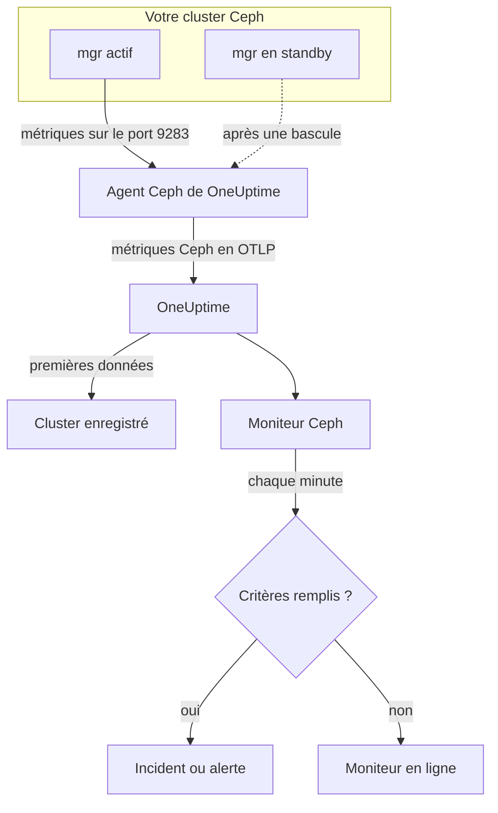

# Surveillance Ceph

Un moniteur Ceph surveille un cluster Ceph — son état de santé, ses health checks, le quorum des moniteurs, les OSD, les pools et les placement groups — et vous prévient dès que la santé se dégrade, qu'un OSD tombe ou que la capacité vient à manquer. Il lit les métriques `ceph_*` que le module `prometheus` du mgr Ceph exporte, collectées par l'agent Ceph de OneUptime ; rien n'est donc sondé de l'extérieur.

:::cards
- [Créer le moniteur](#créer-un-moniteur-ceph): Six étapes dans le tableau de bord.
- [Modèles](#modèles-dalerte-prédéfinis): 23 alertes prêtes à l'emploi pour la santé, les OSD, les placement groups et la capacité.
- [Health checks](#séries-des-health-checks): Alerter sur n'importe quel health check Ceph par son nom.
- [Métriques](#métriques-collectées): Chaque série `ceph_*` sur laquelle le moniteur peut alerter.
:::

## Fonctionnement

Le module `prometheus` du mgr Ceph expose les métriques du cluster sur le port 9283. L'agent Ceph de OneUptime interroge chaque démon mgr toutes les 30 secondes — l'actif répond, les standby ne renvoient rien tant qu'ils n'ont pas pris le relais —, conserve les labels propres à Ceph (`ceph_daemon`, `pool_id`) et envoie les métriques à OneUptime en OTLP, marquées du nom du cluster, `ceph.cluster.name`. Les premières données enregistrent le cluster.

Un moniteur Ceph est lié à un seul cluster. Chaque minute, il exécute sa requête sur les métriques de ce cluster et compare le résultat à ses critères.



## Avant de commencer

- **Activez le module `prometheus` du mgr** sur le cluster :

  ```bash
  ceph mgr module enable prometheus
  ```

- **Installez l'agent Ceph** sur une machine qui peut joindre chaque démon mgr sur le port 9283, et listez-les tous dans `CEPH_MGR_ENDPOINTS`. Le [guide de l'agent Ceph](/docs/telemetry/ceph) décrit l'installation.
- **Vérifiez que le cluster est enregistré.** Il apparaît sous **Produits → Infrastructure → Ceph → Tous les clusters**, nommé d'après la variable `CEPH_CLUSTER_NAME` de l'agent, environ une minute après la première collecte.
- **Pour les alertes sur les health checks**, utilisez Ceph Quincy ou une version ultérieure. Les versions plus anciennes n'exportent pas `ceph_health_detail`.

## Créer un moniteur Ceph

:::steps
### Démarrer un nouveau moniteur

Allez dans **Moniteurs** et cliquez sur **Créer un moniteur**.

### Choisir Ceph

Sous **Type de moniteur**, cliquez sur **Plus de types de moniteurs** et choisissez **Ceph** sous **Infrastructure**, ou tapez `ceph` dans la zone de recherche. Saisissez un **Nom** — il est repris dans les titres des incidents et des alertes — et cliquez sur **Suivant**.

### Choisir le cluster

Sous **Configuration du moniteur Ceph**, choisissez le cluster dans **Cluster Ceph**. Tout cluster ayant envoyé des données figure dans la liste.

### Choisir ce qu'il faut surveiller

Choisissez l'un des trois onglets :

- **Quick Setup** — cliquez sur un [modèle](#modèles-dalerte-prédéfinis). Il définit les métriques, les filtres, l'agrégation, la plage temporelle et les seuils, et remplace les critères ci-dessous par les siens. Vous pouvez encore modifier la **Plage temporelle**.
- **Custom Metric** — choisissez une métrique dans **Métrique Ceph**, puis réglez **Agrégation** et **Plage temporelle**. **OSD** et **Pool ID** la limitent à un démon ou à un pool.
- **Avancé** — construisez vous-même requêtes et formules sous **Sélectionner les métriques**, par exemple un ratio de capacité utilisée à partir de `ceph_cluster_total_used_bytes / ceph_cluster_total_bytes`. Utilisez **Regrouper par** `ceph_daemon` ou `pool_id` pour juger chaque démon ou pool séparément.

### Vérifier les critères

Ouvrez chaque critère sous **Critères du moniteur** et vérifiez sa **Métrique**, son **Agrégation**, sa **Condition** et son **Threshold**. Un modèle les remplit. Avec **Custom Metric** ou **Avancé**, le moniteur démarre avec les [critères par défaut](#critères-par-défaut), qui ne remarquent qu'une métrique qui tombe à zéro : définissez donc votre propre seuil.

### Créer le moniteur

Cliquez sur **Créer un moniteur**. OneUptime ouvre la page du moniteur et l'évalue chaque minute. Les incidents et alertes qu'il déclenche figurent aussi dans les pages **Incidents** et **Alertes** du cluster.
:::

> [!TIP]
> Pour configurer plusieurs modèles à la fois, ouvrez le cluster depuis **Produits → Infrastructure → Ceph** et allez dans **Recommendations**. Choisissez les modèles voulus et qui est alerté, et OneUptime crée un moniteur par modèle.

## Paramètres du moniteur

| Champ | Onglet | Rôle |
| --- | --- | --- |
| **Cluster Ceph** | Tous | Obligatoire. Limite chaque requête à `resource.ceph.cluster.name`. |
| **OSD** | Custom Metric, Avancé | Facultatif. Correspondance exacte sur le label `ceph_daemon`, par exemple `osd.3`. |
| **Pool ID** | Custom Metric, Avancé | Facultatif. Correspondance exacte sur le label `pool_id`, par exemple `2`. |
| **Métrique Ceph** | Custom Metric | Une métrique du [catalogue](#métriques-collectées). |
| **Agrégation** | Custom Metric | Comment les échantillons sont combinés : **Moyenne**, **Maximum**, **Minimum**, **Somme** ou **Comptage**. Commence avec l'agrégation habituelle de la métrique. |
| **Plage temporelle** | Tous | La fenêtre glissante lue par la requête, de **Past 1 Minute** à **Past 365 Days**. Un nouveau moniteur commence à **Past 1 Minute** ; les modèles définissent la leur. |
| **Sélectionner les métriques** | Avancé | Le générateur de requêtes : **Métrique**, **Agréger par**, **Filtrer par attributs**, **Regrouper par**, plus **Ajouter une métrique** et **Ajouter une formule** pour combiner des requêtes. |

Les séries de données des pools ne portent que le label `pool_id` : le nom du pool n'existe que dans `ceph_pool_metadata`. Filtrez et regroupez les séries de pools par `pool_id`, et cherchez le nom dans `ceph_pool_metadata` au besoin.

### Séries des health checks

`ceph_health_detail` exporte **une série par health check actif**, avec les labels `name` (par exemple `OSD_NEARFULL` ou `RECENT_CRASH`) et `severity`. Une série n'existe que tant que son check se déclenche ; pas de série signifie donc que tout va bien. Pour alerter sur n'importe quel health check Ceph, filtrez sur son `name`, déclenchez sur **Maximum** au-dessus de `0` et rétablissez à `0` avec **En l'absence de données** réglé sur **Treat As Zero** — exactement comme sont construits les modèles de health checks. `ceph_daemon_health_metrics` fonctionne de la même façon par démon, avec un label `type` (par exemple `SLOW_OPS`) et `ceph_daemon`.

## Modèles d'alerte prédéfinis

**Quick Setup** propose 23 modèles couvrant la santé du cluster, les OSD, les placement groups et la capacité. Chacun construit un moniteur complet — requêtes, filtres de labels, un regroupement, un critère qui déclenche et un qui rétablit. Les seuils sont des points de départ modifiables.

Les modèles lisent les 5 dernières minutes sauf indication contraire dans le tableau. Un critère ne se déclenche que si la condition est vraie pendant chaque minute de sa fenêtre, et un critère à seuil se rétablit 10 % au-delà de son seuil, pour qu'une valeur qui oscille autour de la limite ne bascule pas sans cesse. **Gravité** est le libellé affiché par le sélecteur ; l'incident et l'alerte créés par un modèle démarrent avec la gravité d'incident et d'alerte la plus élevée de votre projet.

### Modèles de santé du cluster

| Modèle | Gravité | Surveille | Se déclenche quand | Se rétablit quand |
| --- | --- | --- | --- | --- |
| Cluster Health Error | Critique | `ceph_health_status`, Max, dernière minute | 2 ou plus : `HEALTH_ERR` | Sous 1,8 : `HEALTH_WARN` ou mieux |
| Cluster Health Warning | Warning | `ceph_health_status`, Max | 1 ou plus : `HEALTH_WARN` ou pire | Sous 0,9 : `HEALTH_OK` |
| Monitor Quorum Degraded | Critique | `ceph_mon_quorum_status`, Min par `ceph_daemon`, dernière minute | Un moniteur passe sous 1, hors du quorum. Un incident par moniteur | Revient à 1 |
| Slow Operations | Warning | `ceph_healthcheck_slow_ops`, Max | Au-dessus de 0 : le check `SLOW_OPS` du cluster est actif | À 0 |
| Daemon Slow Operations | Warning | `ceph_daemon_health_metrics` pour `type = SLOW_OPS`, Max par `ceph_daemon` | Au-dessus de 0. Un incident par OSD ou moniteur | La série disparaît |
| Daemon Crash | Critique | `ceph_health_detail` pour `name = RECENT_CRASH`, Max | Le check est actif : des plantages de démons non archivés existent. Le mgr n'a pas de métrique `ceph_crash_*`, c'est donc le seul signal de plantage | Les plantages sont archivés |
| Monitor Clock Skew | Warning | `ceph_health_detail` pour `name = MON_CLOCK_SKEW`, Max | Le check est actif : les horloges des moniteurs dérivent au-delà de l'écart autorisé (0,05 s par défaut) | Le check disparaît |
| Monitor Disk Critically Low | Critique | `ceph_health_detail` pour `name = MON_DISK_CRIT`, Max | Le check est actif : le disque de base de données d'un moniteur a moins de 5 % d'espace libre (par défaut) | Le check disparaît |
| Monitor Disk Space Low | Warning | `ceph_health_detail` pour `name = MON_DISK_LOW`, Max | Le check est actif : moins de 30 % d'espace libre (par défaut) | Le check disparaît |

### Modèles OSD

| Modèle | Gravité | Surveille | Se déclenche quand | Se rétablit quand |
| --- | --- | --- | --- | --- |
| OSD Down | Critique | `ceph_osd_up`, Min par `ceph_daemon` | Un OSD passe sous 1. Un incident par OSD | Revient à 1 |
| OSD Out | Warning | `ceph_osd_in`, Min par `ceph_daemon` | Un OSD passe sous 1 : retiré de la distribution des données | Revient à 1 |
| OSD High Latency | Warning | `ceph_osd_apply_latency_ms`, Avg par `ceph_daemon` | Au-dessus de 100 ms. Un incident par OSD | À 90 ms ou moins |
| OSD Slow Heartbeats | Warning | `ceph_health_detail` pour `name = OSD_SLOW_PING_TIME_FRONT` et `name = OSD_SLOW_PING_TIME_BACK`, Max | L'un des checks est actif : les heartbeats sur le réseau public ou le réseau du cluster sont lents. Le mgr n'exporte aucune jauge de temps de ping | Les deux checks disparaissent |

### Modèles de placement groups

| Modèle | Gravité | Surveille | Se déclenche quand | Se rétablit quand |
| --- | --- | --- | --- | --- |
| Inactive Placement Groups | Critique | `ceph_pg_total` − `ceph_pg_active`, Max par `pool_id` | Au-dessus de 0 : des PG ne peuvent pas servir d'E/S, et les requêtes des clients vers elles restent bloquées. Un incident par pool | À 0 |
| Degraded Placement Groups | Warning | `ceph_pg_degraded`, Max par `pool_id` | Au-dessus de 0 : des objets ont moins de répliques que prévu | À 0 |
| Undersized Placement Groups | Warning | `ceph_pg_undersized`, Max par `pool_id` | Au-dessus de 0 : des PG sont réparties sur moins d'OSD que leur nombre de répliques | À 0 |
| Damaged Placement Groups | Critique | `ceph_health_detail` pour `name = PG_DAMAGED` et `name = OSD_SCRUB_ERRORS`, Max | L'un des checks est actif : le scrubbing a trouvé des dommages ou des erreurs de lecture | Les deux checks disparaissent |

### Modèles de capacité

| Modèle | Gravité | Surveille | Se déclenche quand | Se rétablit quand |
| --- | --- | --- | --- | --- |
| Cluster Near Full | Warning | `ceph_cluster_total_used_bytes` ÷ `ceph_cluster_total_bytes` × 100 | Au-dessus de 85 %, le ratio nearfull par défaut de Ceph | À 76,5 % ou moins |
| Cluster Full | Critique | Le même ratio | Au-dessus de 95 %, le ratio full par défaut de Ceph, où les écritures s'arrêtent dans tout le cluster | À 85,5 % ou moins |
| Pool Near Full | Warning | `ceph_pool_stored` ÷ (`ceph_pool_stored` + `ceph_pool_max_avail`) × 100, par `pool_id` | Au-dessus de 85 % de ce que le pool peut contenir. Un incident par pool | À 76,5 % ou moins |
| OSD Nearfull | Warning | `ceph_health_detail` pour `name = OSD_NEARFULL`, Max | Le check est actif : un OSD a dépassé le seuil nearfull (85 % par défaut). Un OSD isolé se remplit bien avant la moyenne du cluster | Le check disparaît |
| OSD Backfillfull | Warning | `ceph_health_detail` pour `name = OSD_BACKFILLFULL`, Max | Le check est actif : le backfill vers l'OSD est refusé (90 % par défaut), ce qui bloque la récupération | Le check disparaît |
| OSD Full | Critique | `ceph_health_detail` pour `name = OSD_FULL`, Max, dernière minute | Le check est actif : un OSD a atteint le seuil full (95 % par défaut) et les écritures sont refusées | Le check disparaît |

- **Les modèles de panne et de quorum utilisent le minimum**, pour qu'un seul OSD en panne ou un seul moniteur hors quorum les déclenche au lieu d'être masqué par la majorité saine.
- **Les modèles de comptage et de health checks utilisent le maximum**, pour qu'une seule mauvaise collecte suffise.
- **Les séries de PG et de pools sont par pool** : il n'existe pas de jauge pour tout le cluster, donc ces modèles regroupent par `pool_id` et ouvrent un incident par pool.
- **Les ratios de capacité** prennent la **Somme** des deux côtés. Les deux viennent de la même collecte du mgr, le résultat est donc un vrai pourcentage. **Inactive Placement Groups** utilise plutôt **Maximum** par pool, car une somme additionnerait les collectes dans une soustraction.
- **Les modèles de health checks** se rétablissent quand le check disparaît : leurs critères de rétablissement comptent une série absente comme 0.

Certaines alertes n'ont pas de modèle. Le déséquilibre des PG demande des statistiques sur plusieurs séries que les critères ne savent pas calculer. La prévision de capacité demande un ajustement de croissance, que le tableau de bord du cluster trace à la place. La prédiction de panne de disque et l'ancienneté du scrubbing n'ont pas de métrique mgr, et NVMe-oF, la réplication RBD et cephadm demandent d'autres exportateurs.

## Métriques collectées

L'agent interroge chaque démon mgr toutes les 30 secondes et conserve les labels propres à Ceph : les séries par démon portent `ceph_daemon` (`osd.3`, `mon.a`) et les séries par pool portent `pool_id`.

### Métriques de santé du cluster

| Métrique | Unité | Description |
| --- | --- | --- |
| `ceph_health_status` | — | Santé globale : 0 = `HEALTH_OK`, 1 = `HEALTH_WARN`, 2 = `HEALTH_ERR`. |
| `ceph_health_detail` | nombre | Une série par health check **actif**, avec les labels `name` et `severity`. Quincy et versions ultérieures uniquement. |
| `ceph_healthcheck_slow_ops` | nombre | Opérations lentes des OSD et des moniteurs signalées par le check `SLOW_OPS`. |
| `ceph_daemon_health_metrics` | nombre | Métriques de santé par démon, identifiées par `type` (par exemple `SLOW_OPS`) et `ceph_daemon`. |
| `ceph_mon_quorum_status` | nombre | 1 quand le moniteur est dans le quorum, par `ceph_daemon` (par exemple `mon.a`). |
| `ceph_mon_metadata` | nombre | Métadonnées du moniteur, toujours 1. Additionnez-les pour compter les moniteurs. |
| `ceph_cluster_total_bytes` | octets | Capacité brute totale. |
| `ceph_cluster_total_used_bytes` | octets | Capacité brute utilisée. |

### Métriques des OSD

| Métrique | Unité | Description |
| --- | --- | --- |
| `ceph_osd_up` | nombre | 1 quand l'OSD est actif, par `ceph_daemon` (par exemple `osd.3`). |
| `ceph_osd_in` | nombre | 1 quand l'OSD fait partie de la distribution des données. |
| `ceph_osd_apply_latency_ms` | ms | Temps pour appliquer une opération au stockage sous-jacent. |
| `ceph_osd_commit_latency_ms` | ms | Temps pour valider une opération dans le journal ou le WAL. |
| `ceph_osd_stat_bytes` | octets | Capacité brute du périphérique de l'OSD. |
| `ceph_osd_stat_bytes_used` | octets | Octets bruts utilisés sur l'OSD. Comparez au total pour repérer des OSD inégalement remplis ou presque pleins. |
| `ceph_osd_numpg` | nombre | Placement groups sur l'OSD. |
| `ceph_osd_metadata` | nombre | Métadonnées de l'OSD (nom d'hôte, classe de périphérique, version), toujours 1. Additionnez-les pour compter les OSD. |

### Métriques des pools

| Métrique | Unité | Description |
| --- | --- | --- |
| `ceph_pool_stored` | octets | Données utilisateur stockées dans le pool. |
| `ceph_pool_max_avail` | octets | Octets encore inscriptibles dans le pool, compte tenu de son profil de réplication ou d'erasure coding. |
| `ceph_pool_objects` | nombre | Objets du pool. |
| `ceph_pool_rd` | ops | Opérations de lecture sur le pool. Un compteur cumulé depuis le début. |
| `ceph_pool_wr` | ops | Opérations d'écriture sur le pool. Un compteur cumulé depuis le début. |
| `ceph_pool_rd_bytes` | octets | Octets lus depuis le pool. Un compteur cumulé depuis le début. |
| `ceph_pool_wr_bytes` | octets | Octets écrits dans le pool. Un compteur cumulé depuis le début. |
| `ceph_pool_metadata` | nombre | Métadonnées du pool, toujours 1 — la seule série qui associe `pool_id` à un nom. |

### Métriques des placement groups

Chaque série `ceph_pg_*` est par pool, avec le label `pool_id` ; additionnez sur les pools pour un total à l'échelle du cluster.

| Métrique | Unité | Description |
| --- | --- | --- |
| `ceph_pg_total` | nombre | Placement groups du pool. |
| `ceph_pg_active` | nombre | PG dans l'état `active`, capables de servir des E/S. |
| `ceph_pg_clean` | nombre | PG dans l'état `clean`, entièrement répliquées. |
| `ceph_pg_degraded` | nombre | PG dans l'état `degraded`. |
| `ceph_pg_undersized` | nombre | PG dans l'état `undersized`. |
| `ceph_num_objects_degraded` | nombre | Objets ayant moins de répliques que prévu. |
| `ceph_num_objects_misplaced` | nombre | Objets qui ne sont pas là où CRUSH les veut. Les données sont en sécurité ; seul le placement est incorrect. |

## Critères de surveillance

Un critère compare l'une des requêtes ou formules du moniteur à un seuil. Les critères d'un moniteur Ceph n'ont pas de **Type de filtre** : chaque règle vérifie la valeur de la métrique, avec ces champs.

| Champ | Rôle |
| --- | --- |
| **Métrique** | La requête ou formule à vérifier, par son nom de variable. |
| **Agrégation** | Comment les valeurs de la fenêtre deviennent une seule réponse : **Moyenne**, **Somme**, **Maximum Value**, **Minimum Value**, **All Values** (chaque valeur doit correspondre) ou **Any Value** (une seule suffit). |
| **Condition** | **Greater Than**, **Less Than**, **Greater Than Or Equal To**, **Less Than Or Equal To** ou **Equal To** — ou une condition d'anomalie : **Anomalously High**, **Anomalously Low** ou **Anomalous**. |
| **Threshold** | La valeur de comparaison. Une liste d'unités s'affiche à côté quand la métrique a une unité. Non affiché pour les conditions d'anomalie. |
| **Sensibilité** | Conditions d'anomalie uniquement. **Low** (4σ), **Medium** (3σ, par défaut) ou **Élevé** (2σ). |
| **Fenêtre de référence** | Conditions d'anomalie uniquement. 14 jours (par défaut), 28, 60 ou 90 jours d'historique. |
| **En l'absence de données** | Sous **Plus de champs**. Ce qui se passe quand la fenêtre ne contient aucun échantillon : **Ignore** (par défaut), **Treat As Zero** ou **Déclencheur**. |

Les conditions d'anomalie comparent chaque valeur à la même heure de la semaine dans la référence. Elles restent dans l'état « Learning » et ne déclenchent rien tant que la fenêtre de référence ne contient pas assez d'historique.

Chaque critère indique aussi quoi faire quand il correspond : changer le statut du moniteur, créer une alerte ou déclarer un incident. Les critères sont vérifiés de haut en bas, et le premier qui correspond l'emporte.

### Critères par défaut

Un moniteur que vous ne construisez pas à partir d'un modèle démarre avec deux critères :

| Ordre | Critère | Correspond quand | Ensuite |
| --- | --- | --- | --- |
| 1 | Check if _nom du moniteur_ is offline | Une valeur de la première requête vaut `0` | Passe le moniteur à **Hors ligne** et déclare l'incident « _nom du moniteur_ is offline », qui se résout tout seul quand le moniteur se rétablit. |
| 2 | Check if _nom du moniteur_ is online | Une valeur est au-dessus de `0` | Passe le moniteur à **Opérationnel**. |

Ces valeurs par défaut conviennent à peu de métriques Ceph : `ceph_health_status` vaut 0 quand le cluster est sain. Choisissez un modèle ou définissez vos propres critères.

> [!IMPORTANT]
> Le silence ne correspond à aucun des deux critères : un cluster qui n'envoie plus de données laisse le moniteur dans son état. Pour être prévenu quand les données s'arrêtent, réglez **En l'absence de données** sur **Déclencheur** dans un critère.

## Dépannage

:::details Le cluster n'apparaît pas dans la liste Cluster Ceph
Les clusters s'enregistrent d'eux-mêmes à partir des données de l'agent. Vérifiez que l'agent tourne et envoie des données (voir le [guide de l'agent Ceph](/docs/telemetry/ceph)) et que `CEPH_CLUSTER_NAME` est défini.
:::

:::details Les métriques se sont arrêtées après une bascule du mgr
L'agent doit interroger **chaque** démon mgr, pas seulement l'actif : les standby ne renvoient rien tant qu'ils n'ont pas pris le relais. Listez chaque mgr dans `CEPH_MGR_ENDPOINTS`.
:::

:::details ceph_health_status vaut 1 mais rien ne se déclenche
Vérifiez que le critère utilise **Greater Than Or Equal To** `1` et non **Greater Than**, et que la **Plage temporelle** du moniteur couvre au moins une collecte de 30 secondes.
:::

:::details Les modèles de health checks ne se déclenchent jamais
Les modèles qui surveillent `ceph_health_detail` — Daemon Crash, Monitor Clock Skew, OSD Nearfull, OSD Backfillfull, OSD Full, les deux modèles de disque des moniteurs, Damaged Placement Groups et OSD Slow Heartbeats — ont besoin du module `prometheus` du mgr de Quincy ou ultérieur. Pendant qu'un check est actif, vérifiez que la série existe :

```bash
curl http://ACTIVE_MGR:9283/metrics | grep ceph_health_detail
```

Les séries de health checks, `ceph_daemon_health_metrics` compris, n'existent que lorsqu'un check se déclenche ; n'en trouver aucune quand le cluster est sain est donc normal.
:::

:::details Des compteurs comme ceph_pool_wr_bytes ne font que croître
Les séries d'E/S des pools sont des compteurs cumulés, et les critères comparent des valeurs brutes : il n'y a pas d'opérateur de taux, et **Convertir en taux par seconde** dans le générateur de requêtes ne change que le graphique. Affichez-les comme un taux, ou alertez sur leur croissance avec une formule, par exemple une requête **Maximum** moins une requête **Minimum** du même compteur.
:::

## Étapes suivantes

:::cards
- [Agent Ceph](/docs/telemetry/ceph): Installer et mettre à jour l'agent que lit ce moniteur.
- [Moniteur Proxmox](/docs/monitor/proxmox-monitor): Surveiller le cluster Proxmox VE qui utilise le stockage.
- [Moniteur de baies de stockage](/docs/monitor/storage-array-monitor): Le même type de moniteur pour les baies Pure Storage.
- [Incidents](/docs/incidents/index): Ce qui se passe après qu'un critère a déclaré un incident.
:::
