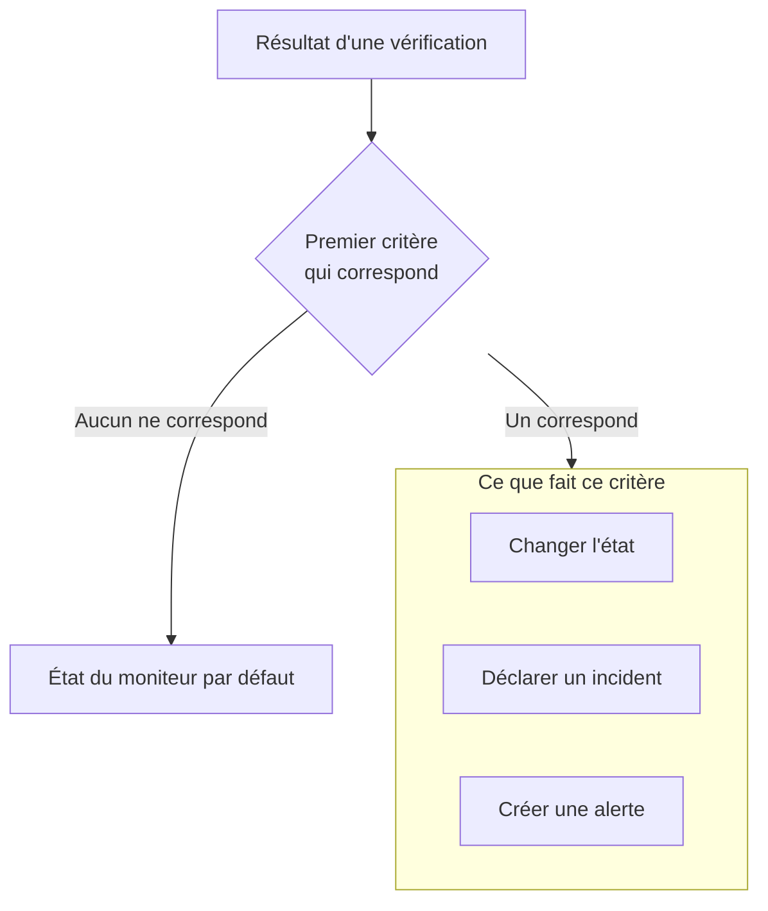

# Créer un moniteur

Un moniteur vérifie quelque chose que vous exploitez, comme un site web, une API, un hôte ou un cluster Kubernetes, et vous prévient quand cela cesse de fonctionner. **Créer un moniteur** demande d'abord quoi surveiller, puis quoi vérifier, puis à quelle fréquence. Tout, sauf le type, le nom et ce qu'il faut vérifier, commence avec des valeurs par défaut qui conviennent à la plupart des moniteurs.

> [!NOTE]
> Pour créer un moniteur, il vous faut le rôle Project Owner, Project Admin, Project Member, Monitor Admin ou Monitor Member, ou un rôle personnalisé avec l'autorisation Create Monitor.

## Informations sur le moniteur

La première étape demande quoi surveiller et comment appeler le moniteur.

:::steps
### Ouvrir Créer un moniteur

Allez dans **Moniteurs** et cliquez sur **Créer un moniteur**. Le formulaire s'ouvre sur sa première étape, **Informations sur le moniteur**.

### Choisir le type de moniteur

La première question est le **Type de moniteur** : que voulez-vous surveiller ?

- Les six types que la plupart des gens créent viennent en premier : **Site web**, **API**, **Ping**, **Port**, **SSL Certificate** et **Requête entrante**, pour les heartbeats des tâches cron et des webhooks.
- **Plus de types de moniteurs** liste tous les autres types sous leur catégorie, comme **Infrastructure** (Kubernetes, Docker, hôte) et **Télémétrie** (journaux, métriques, traces). **Manuel**, un moniteur dont vous définissez vous-même l'état, se trouve sous **Autre**.
- Ou tapez dans le champ de recherche. Il connaît les mots que vous utilisez déjà, comme `k8s`, `postgres`, `heartbeat` ou `tls`, et **Entrée** choisit le premier résultat.

Le type choisi se réduit à une ligne. Cliquez sur **Modifier** pour en choisir un autre ; appuyez sur **Escape** pendant le choix pour garder le type que vous aviez.

### Nommer le moniteur

Renseignez le **Nom**. Il est utilisé dans les alertes et les titres d'incident. **Description** et **Étiquettes** sont facultatifs et attendent sous **Plus de champs**.

Un moniteur **Manuel** n'a besoin de rien de plus, donc **Créer un moniteur** se trouve sur cette étape. Pour tout autre type, cliquez sur **Suivant**.
:::

## Critères

La deuxième étape demande quoi vérifier et décide de ce qui compte comme un problème.

:::steps
### Saisir ce qu'il faut vérifier

Cette étape s'ouvre sur ce qu'il faut vérifier. Pour un site web, c'est son URL, avec un exemple dans le champ ; les autres types demandent un hôte, une requête, un cluster ou un filtre de journaux. Les réglages que la plupart des moniteurs ne changent jamais, comme les délais d'expiration et les nouvelles tentatives, sont repliés sous **Plus de champs**.

Pour un moniteur que des sondes vérifient, **Tester le moniteur** exécute la vérification une fois avant que vous enregistriez : choisissez une sonde sous **Sélectionner la sonde** et cliquez sur **Exécuter le test**. La réponse s'ouvre dans **Résultat du test du moniteur**.

### Passer en revue les critères

En dessous, les **Critères du moniteur** décident quand le moniteur change d'état, déclare un incident ou crée une alerte. Un nouveau moniteur commence avec des critères qui conviennent à la plupart des moniteurs, chacun replié sur une ligne qui dit ce qu'il vérifie et ce qu'il fait. Un nouveau moniteur de site web, par exemple, est marqué hors ligne et déclare un incident quand le site ne répond pas ou répond avec un code de statut d'erreur.

Cliquez sur un critère pour l'ouvrir et le modifier. **Ajouter un critère** en ajoute un, ouvert et prêt à remplir. Pour changer l'ordre, faites glisser un critère par la poignée à sa gauche.

### Passer à l'étape suivante

Cliquez sur **Suivant**. Rien sur cette étape n'est signalé comme manquant avant que vous cliquiez sur **Suivant**.
:::

### Comment les critères sont évalués

Le résultat de chaque vérification passe par les critères de haut en bas, et le premier qui correspond décide de ce qui se passe. Ce critère peut changer l'état du moniteur, déclarer un incident, créer une alerte, ou toute combinaison des trois. Quand aucun ne correspond, le moniteur affiche son **État du moniteur par défaut**, défini sous **Plus de champs** sous les critères (**Opérationnel**, sauf si vous en choisissez un autre).

Les incidents et les alertes réglés pour se résoudre automatiquement, comme ceux des critères par défaut, se résolvent d'eux-mêmes dès que leur critère ne correspond plus. Un moniteur vérifié par plusieurs sondes ne change que lorsque ses sondes sont d'accord : par défaut, chaque sonde activée et connectée doit arriver au même résultat. Pour en exiger moins, réglez **Accord des sondes** sur la page **Configuration → Sondes et intervalle** du moniteur.

## Sondes et intervalle

Les moniteurs que des sondes vérifient se terminent par cette étape : Site web, API, Ping, IP, Port, SSL Certificate, DNS, DNSSEC, NTP, Domaine, SQL Query, Santé de la base de données, Synthetic Monitor, Custom JavaScript Code et Page de statut externe. Les **Sondes** sont les machines qui exécutent les vérifications, et les sondes par défaut de votre projet sont déjà sélectionnées. L'**Intervalle de surveillance** commence à **Toutes les 5 minutes**.

:::steps
### Choisir les sondes

Gardez les **Sondes** sélectionnées ou choisissez-en d'autres. Un moniteur sans sonde n'est jamais vérifié. Pour vérifier quelque chose sur un réseau privé, exécutez une [sonde personnalisée](/docs/probe/custom-probe) dans ce réseau et choisissez-la ici.

### Choisir la fréquence des vérifications

Choisissez un **Intervalle de surveillance**, de **Chaque minute** à **Chaque semaine**. Les moniteurs Synthetic Monitor, Custom JavaScript Code et SSL Certificate se voient proposer des intervalles de 5 minutes ou plus.

### Créer le moniteur

Cliquez sur **Créer un moniteur**. La page du nouveau moniteur s'ouvre. Pour changer ses sondes ou son intervalle plus tard, ouvrez **Configuration → Sondes et intervalle** sur cette page.
:::

Tous les autres types, sauf Manuel, sont créés depuis l'étape **Critères**.

## Partir d'un modèle ou d'un lien

Un modèle de moniteur, et les liens qui créent un moniteur ailleurs dans OneUptime (sur un graphique de métriques, un équipement réseau ou une règle de détection), ouvrent **Créer un moniteur** avec le type choisi et le reste rempli. Cliquez sur **Modifier** pour choisir un autre type. Le formulaire d'un modèle utilise le même sélecteur de type : voir [Modèles de moniteur](/docs/monitor/monitor-templates).

Chaque type de moniteur a sa propre page, avec ses réglages, ses critères par défaut et des exemples. De bons points de départ :

:::cards
- [Surveillance de site web](/docs/monitor/website-monitor): Vérifier qu'une page se charge, et ce qu'elle répond.
- [Surveillance d'API](/docs/monitor/api-monitor): Appeler un point de terminaison avec une méthode, des en-têtes et un corps.
- [Modèles de moniteur](/docs/monitor/monitor-templates): Créer de nombreux moniteurs à partir d'une configuration et les garder alignés.
- [Incidents](/docs/incidents/index): Ce qui se passe après qu'un moniteur a déclaré un incident.
:::
