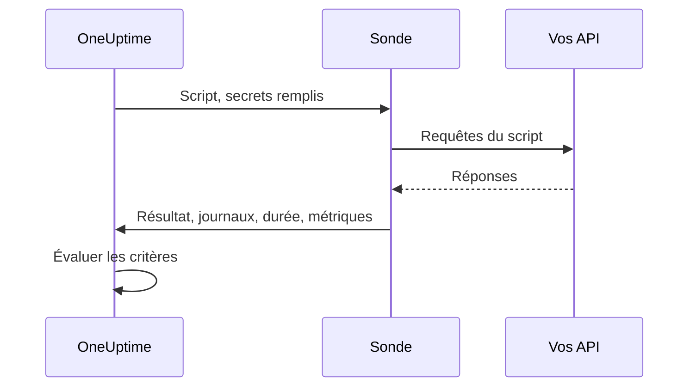

# Surveillance par code personnalisé

Un moniteur Custom Code exécute selon un calendrier un script JavaScript que vous écrivez, depuis une sonde. Utilisez-le pour les vérifications que les autres types de moniteurs ne savent pas exprimer — une connexion suivie d'un appel d'API authentifié, une transaction en plusieurs étapes, ou une valeur que vous calculez à partir de plusieurs réponses. Si le script lève une erreur, la vérification échoue ; ce qu'il renvoie est à la disposition de vos critères et de vos modèles d'incident.

:::cards
- [Créer le moniteur](#créer-un-moniteur-custom-code): Écrire un script et choisir les sondes qui l'exécutent.
- [Écrire le script](#écrire-le-script): Une vérification d'API en plusieurs étapes, prête à l'emploi, comme point de départ.
- [Utiliser des secrets](#utiliser-les-secrets-de-moniteur): Garder mots de passe et jetons hors du script.
- [Capturer des métriques personnalisées](#métriques-personnalisées): Tracer n'importe quel nombre calculé par votre script.
:::

## Fonctionnement

À chaque vérification, une sonde exécute votre script dans un bac à sable JavaScript isolé, avec vos secrets de moniteur déjà remplis. Le script appelle ce dont il a besoin, puis renvoie un résultat ou lève une erreur. La sonde rapporte le résultat, les messages de journal du script, sa durée d'exécution et les métriques capturées, et OneUptime évalue vos critères sur cette base.



Le bac à sable n'est pas Node.js : il n'y a ni `require`, ni `process`, ni `fetch`, ni système de fichiers, seulement les [modules listés plus bas](#modules-disponibles-dans-le-script).

## Avant de commencer

- Une **sonde** qui atteint chaque point de terminaison appelé par le script. Utilisez une [sonde personnalisée](/docs/probe/custom-probe) pour les points de terminaison de votre réseau.
- Pour appeler une adresse privée (comme `10.0.0.5`), la sonde doit l'autoriser : définissez `PROBE_ALLOW_PRIVATE_NETWORK_MONITORS=true` sur cette sonde. Les adresses de bouclage, link-local et de métadonnées cloud sont toujours refusées. Voir [Accès au réseau privé](/docs/self-hosted/private-network-access).
- Chaque mot de passe, clé d'API ou jeton dont le script a besoin, stocké comme [secret de moniteur](/docs/monitor/monitor-secrets).

## Créer un moniteur Custom Code

:::steps
### Commencer un nouveau moniteur

Allez dans **Moniteurs** et cliquez sur **Créer un moniteur**. Sous **Type de moniteur**, cliquez sur **Plus de types de moniteurs** et choisissez **Custom JavaScript Code** sous **Synthetic Monitoring**, ou tapez `script` dans le champ de recherche. Saisissez un **Nom**, puis cliquez sur **Suivant**.

### Ajouter le script

Écrivez votre script dans l'éditeur **Code JavaScript**. Partez de l'[exemple ci-dessous](#écrire-le-script).

### Le tester

Cliquez sur **Tester le moniteur** pour exécuter le script une fois depuis une sonde, et vérifiez son résultat.

### Passer en revue les critères

Le moniteur commence avec deux critères : il est hors ligne, et déclare un incident, quand le script échoue, et en ligne quand il réussit. Modifiez-les ou ajoutez les vôtres — voir [Critères](#critères) — puis cliquez sur **Suivant**.

### Choisir les sondes et créer

Sélectionnez les **Sondes** qui atteignent vos points de terminaison et un **Intervalle de surveillance** — les moniteurs Custom Code se voient proposer des intervalles de 5 minutes ou plus — puis cliquez sur **Créer un moniteur**.
:::

## Écrire le script

Le script est le corps d'une fonction `async` : vous pouvez utiliser `await` au premier niveau, renvoyer un résultat avec `return`, et faire échouer la vérification avec `throw`. Cet exemple se connecte, appelle un point de terminaison avec le jeton obtenu, et échoue si la réponse n'est pas celle attendue :

```javascript title="Custom code monitor script"
// 1. Log in. axios rejects a 4xx or 5xx response, which fails the check.
const login = await axios.post("https://api.example.com/v1/login", {
  username: "monitoring@example.com",
  password: "{{monitorSecrets.ApiPassword}}",
});

// 2. Call an endpoint that needs the token.
const orders = await axios.get("https://api.example.com/v1/orders?limit=10", {
  headers: { Authorization: `Bearer ${login.data.token}` },
  timeout: 10000,
});

// 3. Fail the check when the data is wrong, not only when the request fails.
if (!Array.isArray(orders.data.items)) {
  throw new Error("The orders endpoint returned no items");
}

console.log(`Fetched ${orders.data.items.length} orders`);

// 4. Return what the criteria and incident templates should see.
return {
  data: orders.data.items.length,
};
```

| Pour | Faites | Ce que OneUptime enregistre |
| --- | --- | --- |
| Rapporter un résultat | `return { data: ... }` avec n'importe quelle valeur JSON | Le **Résultat**. Seule la propriété `data` est conservée : `return 5` n'enregistre aucun résultat. |
| Faire échouer la vérification | `throw new Error("...")` | L'**Erreur de script**, que les critères par défaut transforment en incident. |
| Laisser une trace | `console.log(...)` | Les **Messages du journal**, jusqu'à 1 000 par exécution. |

Pour voir une exécution, ouvrez la **Vue d'ensemble** du moniteur : la carte **Résumé du moniteur** montre la sonde, la durée d'exécution et l'erreur, et **Afficher plus de détails** montre le résultat, l'erreur de script et les messages du journal. **Journaux de surveillance** propose le même résumé pour les vérifications précédentes.

> [!NOTE]
> Dans ce bac à sable, `axios` ne suit pas les redirections, et ses requêtes ne passent pas par un proxy configuré sur la sonde. Demandez l'URL finale.

## Utiliser les secrets de moniteur

Faites référence à un secret avec `{{monitorSecrets.NAME}}` n'importe où dans le script. OneUptime remplace la référence par la valeur du secret, en texte brut, avant que le script n'atteigne la sonde. Mettez donc un secret entre guillemets pour l'utiliser comme chaîne, et laissez-le nu pour l'utiliser comme nombre ou booléen :

```javascript
// Used as a string: wrap it in quotes.
const apiKey = "{{monitorSecrets.ApiKey}}";

// Used as a number or a boolean: leave it bare.
const retryLimit = {{monitorSecrets.RetryLimit}};
const verbose = {{monitorSecrets.Verbose}};

// Check the secret was filled in without logging the secret itself.
console.log(apiKey.length > 0);
```

Une valeur de secret qui contient un guillemet casse la chaîne qui l'entoure. Une référence que le moniteur n'a pas le droit d'utiliser reste dans le script telle qu'elle est écrite. Pour créer un secret et choisir les moniteurs qui peuvent l'utiliser, voir [Secrets de surveillance](/docs/monitor/monitor-secrets).

## Métriques personnalisées

Vous pouvez capturer des métriques personnalisées depuis votre script avec la fonction `oneuptime.captureMetric()`. Ces métriques sont stockées dans OneUptime et peuvent être tracées dans des tableaux de bord avec l'explorateur de métriques.

```javascript
oneuptime.captureMetric(name, value, attributes);
```

| Paramètre | Type | Description |
| --- | --- | --- |
| `name` | string, obligatoire | Le nom de la métrique (p. ex. `"api.response.time"`). Il est stocké automatiquement avec le préfixe `custom.monitor.`. |
| `value` | number, obligatoire | La valeur numérique de la métrique. Une valeur qui n'est pas un nombre est ignorée. |
| `attributes` | object, facultatif | Des paires clé-valeur pour plus de contexte. Les chaînes, nombres et booléens sont enregistrés (nombres et booléens sous forme de texte, car les attributs de métrique sont des dimensions et non des mesures). Les valeurs de tout autre type sont ignorées. |

### Exemple

```javascript
const response = await axios.get("https://api.example.com/health");

// Capture a simple metric
oneuptime.captureMetric("api.response.time", response.data.latency);

// Capture a metric with attributes
oneuptime.captureMetric("api.queue.depth", response.data.queueDepth, {
  region: "us-east-1",
  environment: "production",
});

return {
  data: response.data,
};
```

Une fois capturées, ces métriques apparaissent dans l'explorateur de métriques sous des noms comme `custom.monitor.api.response.time`, et sur la page **Métriques** du moniteur sous **Métriques personnalisées**. OneUptime ajoute le moniteur et la sonde à chaque point de données, pour que vous puissiez les tracer, alerter dessus, et filtrer par moniteur, par sonde ou par n'importe quel attribut que vous avez fourni.

### Limites

| Limite | Valeur | Au-delà de la limite |
| --- | --- | --- |
| Métriques par exécution de script | 100 | Les appels suivants sont ignorés. |
| Longueur du nom de métrique | 200 caractères | Le nom est tronqué. |
| Attributs par métrique | 50 | Les attributs suivants sont supprimés. |
| Longueur d'une clé d'attribut | 200 caractères | La clé est tronquée. |
| Longueur d'une valeur d'attribut | 1000 caractères | La valeur est tronquée. |

### Clés d'attribut réservées

Certains noms d'attribut appartiennent à OneUptime, et un script ne peut pas les écrire. Si votre script en définit un, l'attribut est supprimé — la métrique elle-même est quand même enregistrée — et un avertissement nommant la clé est écrit dans les journaux du serveur OneUptime. Ce sont :

- L'identité du moniteur : `monitorId`, `projectId`, `monitorName`, `probeName`, `probeId`, `isCustomMetric`.
- Tout ce qui est dans les espaces de noms `oneuptime.` ou `resource.` — ils portent les identifiants que OneUptime appose à l'ingestion.
- Les attributs d'identité de ressource : `service.name`, `host.name`, `k8s.cluster.name`, `iot.fleet.name`, `proxmox.cluster.name`, `vmware.vcenter.name`, `ceph.cluster.name`, `storage.array.name` et `docker.swarm.cluster.name`.

Ces noms ne sont pas de simples étiquettes — OneUptime les relit comme l'affirmation de la ressource à laquelle appartient un point de données. Une métrique marquée `service.name: payments-api` apparaîtrait dans l'onglet Métriques de ce service, et si vous construisiez plus tard un moniteur de métriques regroupé par `service.name`, ses alertes seraient liées à ce service, préviendraient les propriétaires de ce service, et se tairaient pendant une fenêtre de maintenance sur celui-ci. Pour associer un moniteur à un service ou à un hôte, utilisez plutôt les propres étiquettes du moniteur.

## Critères

Les critères d'un moniteur Custom Code peuvent vérifier :

| Type de filtre | Ce qu'il vérifie | Conditions de filtre |
| --- | --- | --- |
| **Erreur** | L'erreur levée par le script, le cas échéant. | Contient, Not Contains, Equal To, Not Equal To, Is Empty, Is Not Empty |
| **Result Value** | Les `data` renvoyées par le script. Comparées comme un nombre quand c'en est un. | Les mêmes, plus Greater Than, Less Than, Greater Than Or Equal To, Less Than Or Equal To, Vrai et Faux |
| **Temps d'exécution (en ms)** | La durée d'exécution du script. | Comparaisons numériques |

Les critères par défaut marquent le moniteur en ligne quand **Erreur** est vide, et hors ligne — avec un incident qui se résout de lui-même quand le script réussit à nouveau — dans le cas contraire. Dans les modèles d'incident et d'alerte, l'exécution est disponible sous `{{result}}`, `{{scriptError}}`, `{{logMessages}}` et `{{executionTimeInMs}}` : voir [Modèles d'incident et d'alerte](/docs/monitor/incident-alert-templating).

### Alerter sur les données renvoyées

Ce que le script renvoie comme `data` est la **Result Value** du moniteur, et un critère peut la comparer — par exemple _Result Value est Equal To `UP`_.

Quand `data` est un objet ou un tableau, renseignez **Chemin du champ (facultatif)** dans le filtre Result Value pour comparer un de ses champs plutôt que la valeur entière. Utilisez des points pour les champs imbriqués et `[n]` pour les éléments de tableau :

```javascript
const response = await axios.get("https://api.example.com/health");

return {
  data: {
    status: response.data.status, // "UP"
    cpu_busy_percent: response.data.cpu, // 42
    healthy: response.data.healthy, // true
    checks: response.data.checks, // [{ name: "db", latency: 12 }]
  },
};
```

| Chemin du champ | Compare | Exemple de condition |
| --- | --- | --- |
| `status` | `"UP"` | Not Equal To `UP` |
| `cpu_busy_percent` | `42` | Greater Than `90` |
| `healthy` | `true` | Faux |
| `checks[0].latency` | `12` | Greater Than `500` |

Ajoutez un filtre par champ à vérifier ; chacun peut avoir sa propre condition et sa propre valeur.

- Laissez le chemin du champ vide pour comparer la valeur entière, comme pour un script qui renvoie un seul nombre ou une seule chaîne.
- Greater Than, Less Than et les autres conditions numériques ne correspondent qu'à un nombre : renvoyez donc un champ sous la forme `42`, pas `"42"`. Vrai et Faux ne correspondent qu'à un booléen.
- Un champ absent des données renvoyées — une clé manquante, ou un index de tableau au-delà de la fin — est comparé comme vide : **Is Empty** y correspond, et aucune autre condition.
- Un champ dont le nom contient un point ne peut pas être atteint par un chemin.
- Dans Terraform, le `custom_code_monitor_options` du filtre définit le chemin du champ : voir [Étapes de moniteur](/docs/terraform/monitor-steps#comparing-one-field-of-a-scripts-result).

## Modules disponibles dans le script

| Nom | Ce que c'est |
| --- | --- |
| `axios` | Un client HTTP à base de promesses : appelez `axios(...)`, ou `axios.get`, `post`, `put`, `patch`, `delete`, `head`, `options`, `request` et `create`. La taille des requêtes et des réponses est limitée (10 Mo chacune), les redirections ne sont pas suivies, et le proxy d'une sonde n'est pas utilisé. |
| `crypto` | `createHash` et `createHmac` (appelez `update()` une fois, puis `digest()`), `randomBytes`, `randomInt` et `randomUUID`. Ce n'est pas le module `crypto` de Node.js : il n'y a ni chiffrements ni signatures. |
| `http`, `https` | Uniquement leur classe `Agent`, à passer à `axios` — par exemple `httpsAgent: new https.Agent({ rejectUnauthorized: false })`. Il n'y a ni `request` ni `get`. |
| `console.log` | Journalise des données pour le débogage. Seul `console.log` existe ; `console.error` et les autres n'existent pas. |
| `oneuptime.captureMetric` | Capture une métrique personnalisée. Voir [Métriques personnalisées](#métriques-personnalisées). |
| `setTimeout`, `clearTimeout`, `sleep(ms)` | Attendre à l'intérieur du script. Un délai ne dépasse jamais le temps limite du script. |

## Points à considérer

- **Temps limite.** Un script qui s'exécute plus de 60 secondes est arrêté et la vérification échoue avec "Script execution timed out". Sur une sonde auto-hébergée, `PROBE_CUSTOM_CODE_MONITOR_SCRIPT_TIMEOUT_IN_MS` modifie la limite.
- **Mémoire.** Chaque exécution a son propre bac à sable, avec une limite de mémoire de 128 Mo.
- **Redirections.** `axios` ne les suit pas, donc une URL qui redirige fait échouer la requête. Utilisez l'URL finale.

## Dépannage

:::details La vérification échoue avec "Script execution timed out"
Le script a dépassé le temps limite. Donnez à chaque requête son propre `timeout` (en millisecondes) pour qu'un point de terminaison lent échoue vite, avec une erreur qui le nomme.
:::

:::details Une requête échoue avec un statut 301 ou 302
Ici, `axios` ne suit pas les redirections. Remplacez l'URL par l'adresse vers laquelle elle redirige.
:::

:::details Une requête vers une adresse interne est refusée
La sonde n'autorise pas les adresses de réseau privé. Définissez `PROBE_ALLOW_PRIVATE_NETWORK_MONITORS=true` sur une sonde de votre réseau et exécutez le moniteur depuis celle-ci — voir [Accès au réseau privé](/docs/self-hosted/private-network-access).
:::

:::details Un secret n'est pas rempli
Le moniteur n'a pas le droit d'utiliser le secret, ou le nom dans la référence ne correspond pas exactement au nom du secret. Voir [Secrets de surveillance](/docs/monitor/monitor-secrets).
:::

## Prochaines étapes

:::cards
- [Surveillance synthétique](/docs/monitor/synthetic-monitor): Piloter un vrai navigateur au lieu d'appeler des API.
- [Secrets de surveillance](/docs/monitor/monitor-secrets): Stocker les identifiants utilisés par votre script.
- [Modèles d'incident et d'alerte](/docs/monitor/incident-alert-templating): Mettre le résultat et les journaux du script dans les incidents.
:::
