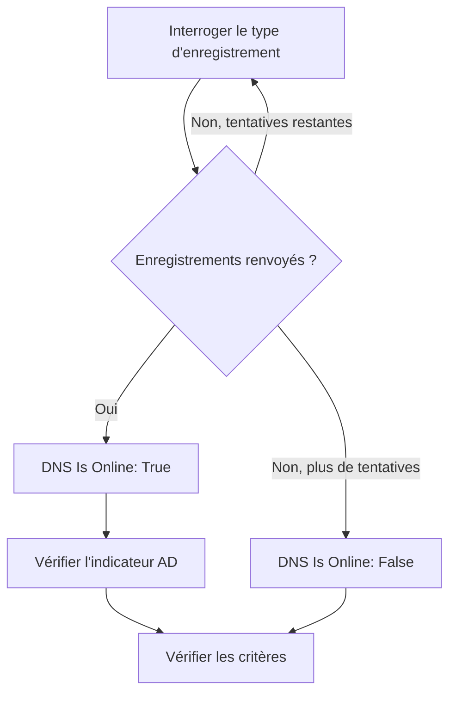

# Surveillance DNS

Un moniteur DNS interroge un enregistrement DNS à intervalle régulier et vérifie la réponse : que le nom se résout, en combien de temps, et ce que disent les enregistrements. Utilisez-le pour repérer une panne DNS, un enregistrement modifié ou disparu, ou un résolveur lent, avant que vos utilisateurs ne s'en aperçoivent.

:::cards
- [Créer le moniteur](#créer-un-moniteur-dns): Six étapes dans le tableau de bord.
- [Options de configuration](#options-de-configuration): Le nom, le type d'enregistrement et le serveur DNS.
- [Critères de surveillance](#critères-de-surveillance): Résolution, enregistrements, temps de réponse et DNSSEC.
- [Dépannage](#dépannage): Quand le moniteur et `dig` ne sont pas d'accord.
:::

## Fonctionnement

À chaque vérification, une sonde demande à un serveur DNS un type d'enregistrement d'un nom, comme les enregistrements `A` de `example.com`. Le nom est en ligne quand le serveur répond avec au moins un enregistrement de ce type. Une requête qui échoue, expire ou ne renvoie aucun enregistrement est retentée une seconde plus tard, dans la limite du nombre de tentatives que vous fixez. La sonde demande ensuite à un résolveur validant si la réponse porte l'indicateur authenticated-data (AD) de DNSSEC, et OneUptime passe le résultat au crible des critères du moniteur.



Une sonde qui a perdu sa propre connexion réseau ne rapporte aucun résultat, elle ne peut donc pas marquer votre DNS hors ligne.

## Avant de commencer

- **Un rôle qui peut créer des moniteurs** : Project Owner, Project Admin, Project Member, Monitor Admin ou Monitor Member, ou un rôle personnalisé avec l'autorisation Create Monitor.
- **Une sonde qui peut joindre le serveur DNS.** Les sondes par défaut de votre projet sont choisies pour chaque nouveau moniteur. Pour interroger un serveur DNS sur un réseau privé, comme un résolveur interne, utilisez une [sonde personnalisée](/docs/probe/custom-probe) dans ce réseau.

## Créer un moniteur DNS

:::steps
### Commencer un nouveau moniteur

Allez dans **Moniteurs** et cliquez sur **Créer un moniteur**. Sous **Type de moniteur**, cliquez sur **Plus de types de moniteurs** et choisissez **DNS** sous **DNS Monitoring**.

### Le nommer

Saisissez un **Nom**, comme `example.com A records`, puis cliquez sur **Suivant**.

### Saisir la requête

Saisissez le **Nom de domaine** à interroger, comme `example.com`, et choisissez son **Type d'enregistrement**. Pour interroger un serveur précis, saisissez-le dans **Serveur DNS (facultatif)** ; laissez le champ vide pour utiliser le résolveur de la sonde.

### Le tester

Cliquez sur **Tester le moniteur**, choisissez une sonde sous **Sélectionner la sonde** et cliquez sur **Exécuter le test**. **Résultat du test du moniteur** montre les enregistrements que la sonde a reçus.

### Passer en revue les critères

**Critères du moniteur** commence avec les [critères par défaut](#critères-par-défaut) : hors ligne quand le nom ne se résout pas, en ligne quand il se résout. Pour vérifier ce que disent les enregistrements, ajoutez un filtre **DNS Record Value**, puis cliquez sur **Suivant**.

### Choisir les sondes et créer

Gardez ou changez les **Sondes** et l'**Intervalle de surveillance** (il commence à **Toutes les 5 minutes**), puis cliquez sur **Créer un moniteur**. La page du moniteur s'ouvre.
:::

## Options de configuration

| Champ | Par défaut | Ce qu'il faut saisir |
| --- | --- | --- |
| **Nom de domaine** | Aucun | Le nom à interroger, comme `example.com` ou `_sip._tcp.example.com`. Pour un enregistrement `PTR`, le nom inverse, comme `34.216.184.93.in-addr.arpa`. |
| **Type d'enregistrement** | `A` | Le type d'enregistrement à interroger. Voir [Types d'enregistrement](#types-denregistrement). |
| **Serveur DNS (facultatif)** | Le résolveur de la sonde | Un serveur DNS à interroger à la place, comme `8.8.8.8` ou `ns1.example.com`. Chaque type d'enregistrement, `CAA` compris, lui est demandé. |
| **Port** (sous **Plus de champs**) | `53` | Le port du serveur indiqué dans **Serveur DNS (facultatif)**. La vérification DNSSEC interroge le même port. |
| **Délai d'expiration (ms)** (sous **Plus de champs**) | `5000` | Combien de temps attendre une réponse, en millisecondes. |
| **Tentatives** (sous **Plus de champs**) | `3` | Nouvelles tentatives après l'échec de la première. `0` signifie une seule tentative. |

### Types d'enregistrement

Un critère **DNS Record Value** compare votre texte à chaque enregistrement tel que la sonde l'écrit, alors respectez ce format :

| Type d'enregistrement | Ce qu'il contient | Format de la valeur, pour les critères |
| --- | --- | --- |
| `A` | Des adresses IPv4 | `93.184.216.34` |
| `AAAA` | Des adresses IPv6 | `2606:2800:220:1:248:1893:25c8:1946` |
| `CNAME` | Le nom dont celui-ci est un alias | `example.net` |
| `MX` | Les serveurs de messagerie | `10 mail.example.com` (priorité, puis le serveur) |
| `NS` | Les serveurs de noms | `ns1.example.com` |
| `TXT` | Du texte, comme les enregistrements SPF et de vérification | `v=spf1 include:_spf.example.com ~all` |
| `SOA` | Le début d'autorité de la zone | `ns1.example.com hostmaster.example.com 2024010101 7200 3600 1209600 3600` (serveur, contact, numéro de série, refresh, retry, expire, TTL minimal) |
| `PTR` | Le nom vers lequel une adresse renvoie (DNS inverse) | `server1.example.com` |
| `SRV` | Des services | `10 5 5060 sip.example.com` (priorité, poids, port, cible) |
| `CAA` | Les autorités de certification autorisées à émettre pour le nom | `0 letsencrypt.org` (indicateur, puis l'autorité) |

Un enregistrement `TXT` découpé en plusieurs chaînes est réuni en une seule valeur.

## Critères de surveillance

Les critères décident quand le nom compte comme en ligne, dégradé ou hors ligne, et si cela déclare un incident ou crée une alerte. Chaque critère vérifie un ou plusieurs filtres :

| Filtre | Conditions | Ce qu'il vérifie |
| --- | --- | --- |
| **DNS Is Online** | **Vrai**, **Faux** | Si la requête a renvoyé au moins un enregistrement du type. |
| **DNS Response Time (in ms)** | **Greater Than**, **Less Than**, **Greater Than Or Equal To**, **Less Than Or Equal To** | La durée de la requête. |
| **DNS Record Exists** | **Vrai**, **Faux** | Si un enregistrement du type est revenu. |
| **DNS Record Value** | **Contient**, **Not Contains**, **Starts With**, **Ends With**, **Equal To**, **Not Equal To** | Les valeurs des enregistrements. Le filtre correspond quand un seul enregistrement correspond. |
| **DNSSEC Is Valid** | **Vrai**, **Faux** | Si un résolveur validant pose l'indicateur AD sur la réponse. |

**DNS Record Value** correspond quand _n'importe lequel_ des enregistrements correspond. Avec plusieurs enregistrements `A`, **Equal To** `93.184.216.34` correspond quand l'un d'eux est cette adresse, et **Not Equal To** correspond quand l'un d'eux ne l'est pas.

**DNSSEC Is Valid** interroge le serveur indiqué dans **Serveur DNS (facultatif)**, sur son **Port**, ou Google Public DNS (`8.8.8.8`) quand ce champ est vide : le serveur que vous indiquez doit donc valider DNSSEC. Le filtre n'a pas de valeur, et ne correspond dans aucun sens, quand la sonde ne peut pas faire cette vérification. Pour une vérification complète d'une zone signée, utilisez un [moniteur DNSSEC](/docs/monitor/dnssec-monitor).

Avec deux filtres ou plus, **Condition de correspondance** décide si **Tous** doivent correspondre ou si **Tout** filtre suffit. Les **Actions** d'un critère décident de ce qu'il fait : changer l'état du moniteur, créer une alerte, déclarer un incident, ou plusieurs de ces actions.

### Critères par défaut

Un nouveau moniteur DNS commence avec deux critères :

- **Hors ligne** — le nom ne se résout pas, ou n'a aucun enregistrement du type, après chaque nouvelle tentative. Le moniteur est marqué **Hors ligne** et un incident appelé « _monitor name_ is offline » est créé. L'incident se résout de lui-même quand le nom se résout de nouveau.
- **En ligne** — le nom se résout. Le moniteur est marqué **Opérationnel**.

Les critères sont vérifiés de haut en bas, et le premier qui correspond décide de ce qui se passe. Quand aucun ne correspond, le moniteur affiche son état par défaut : **Opérationnel**, sauf si vous en choisissez un autre sous **Plus de champs**, sous les critères.

### Évaluer sur une période

**Évaluer ce critère sur une période donnée** est une case à cocher sous un filtre, proposée pour **DNS Is Online** et **DNS Response Time (in ms)**. Activez-la pour juger une fenêtre de vérifications passées au lieu de la dernière : choisissez une agrégation sous **Évaluer** et une fenêtre, de 2 à 60 minutes, sous **Pour les dernières (en minutes)**.

| Agrégation | Correspond quand |
| --- | --- |
| **Moyenne**, **Somme**, **Maximum Value**, **Minimum Value** | Cette valeur, sur la fenêtre, remplit la condition. **DNS Response Time (in ms)** seulement. |
| **All Values** | Chaque vérification de la fenêtre remplit la condition. |
| **Any Value** | Au moins une vérification de la fenêtre remplit la condition. |

**All Values** ne correspond qu'une fois la fenêtre réellement couverte par des données. Un moniteur qui vient d'être créé, ou dont les vérifications ont cessé d'être enregistrées, n'a pas assez d'historique pour dire quoi que ce soit des N dernières minutes, donc le critère attend au lieu de correspondre sur la seule mesure qu'il possède. **Any Value** est le réglage pour « prévenez-moi dès qu'une seule vérification dépasse le seuil » et se déclenche toujours immédiatement.

**En l'absence de données** décide de ce qui se passe tant que la fenêtre ne peut pas étayer le critère :

| Option | Ce qui se passe | À utiliser pour |
| --- | --- | --- |
| **Ignore** (par défaut) | Le critère ne correspond pas. | Les alertes de seuil ordinaires. |
| **Déclencheur** | Les données manquantes comptent comme le problème. | Les vérifications où le silence est lui-même une panne. |
| **Treat As Zero** | La fenêtre est comparée comme un seul zéro. | Les compteurs où l'absence d'événements signifie vraiment zéro. |

### Exemples de critères

| Objectif | Filtre | Condition | Valeur |
| --- | --- | --- | --- |
| Hors ligne quand le nom ne se résout plus | **DNS Is Online** | **Faux** | — |
| Alerter quand l'unique enregistrement `A` d'un nom change | **DNS Record Value** | **Not Equal To** | `93.184.216.34` |
| Alerter quand un enregistrement `MX` pointe hors de votre domaine | **DNS Record Value** | **Not Contains** | `example.com` |
| Marquer le DNS dégradé quand il est lent | **DNS Response Time (in ms)** | **Greater Than** | `500` |
| Alerter quand la validation DNSSEC échoue | **DNSSEC Is Valid** | **Faux** | — |

## Dépannage

:::details Le moniteur dit hors ligne, mais le nom se résout chez moi
La sonde a interrogé un autre serveur, ou demandé un autre type d'enregistrement. Vérifiez le **Type d'enregistrement** : un nom qui n'a qu'un `CNAME`, ou que des enregistrements `AAAA`, n'a pas d'enregistrement `A`. Comparez avec `dig` sur le même serveur :

```bash
dig @8.8.8.8 example.com A
```
:::

:::details Un critère Not Equal To se déclenche alors que la bonne adresse est là
**DNS Record Value** correspond quand un seul enregistrement correspond. Avec plusieurs enregistrements, **Not Equal To** se déclenche dès que l'un d'eux diffère. Pour vérifier qu'une valeur précise figure parmi les enregistrements, appuyez-vous sur l'ordre des critères, puisque le premier qui correspond l'emporte :

1. Gardez en haut le critère hors ligne par défaut : **DNS Is Online** / **Faux**.
2. En dessous, ajoutez un critère avec **DNS Record Value** / **Equal To** / la valeur attendue, qui marque le moniteur **Opérationnel**.
3. En dessous encore, ajoutez un critère avec **DNS Is Online** / **Vrai**, qui marque le moniteur **Hors ligne** et déclare un incident. Il ne correspond qu'aux réponses qui n'ont pas la valeur.
:::

:::details DNSSEC Is Valid ne correspond jamais
Le serveur indiqué dans **Serveur DNS (facultatif)** ne valide pas DNSSEC, donc il ne pose jamais l'indicateur AD, ou la sonde n'a pas pu faire la vérification. Laissez le champ vide pour valider avec `8.8.8.8`, ou utilisez un [moniteur DNSSEC](/docs/monitor/dnssec-monitor).
:::

## Étapes suivantes

:::cards
- [Surveillance DNSSEC](/docs/monitor/dnssec-monitor): Valider la chaîne de confiance d'une zone signée.
- [Surveillance de domaine](/docs/monitor/domain-monitor): Suivre l'enregistrement et l'expiration du domaine.
- [Sondes personnalisées](/docs/probe/custom-probe): Interroger des serveurs DNS internes depuis votre propre réseau.
- [Vue d'ensemble des incidents](/docs/incidents/index): Ce qui se passe une fois que le moniteur en a déclaré un.
:::
