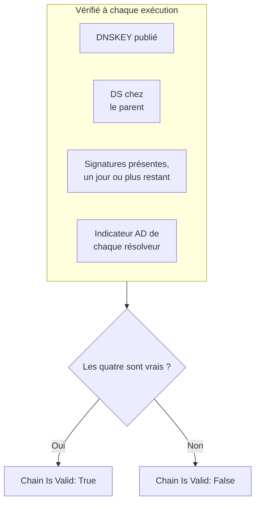

# Surveillance DNSSEC

Un moniteur DNSSEC vérifie qu'une zone DNS signée se valide toujours : qu'elle publie ses clés, que sa zone parente se porte garante d'elle, que ses signatures n'ont pas expiré et que les résolveurs validants l'acceptent. Utilisez-le pour repérer une chaîne de confiance rompue avant que les résolveurs ne répondent `SERVFAIL` pour votre domaine.

:::cards
- [Créer le moniteur](#créer-un-moniteur-dnssec): Six étapes dans le tableau de bord.
- [Ce qui est vérifié](#fonctionnement): Les vérifications derrière une chaîne valide.
- [Critères de surveillance](#critères-de-surveillance): Validité de la chaîne, clés, enregistrements DS, signatures, résolveurs et serveurs de noms.
- [Bonnes pratiques](#bonnes-pratiques): Des seuils et des résolveurs qui fonctionnent.
:::

## Fonctionnement

À chaque vérification, une sonde exécute une série de requêtes DNS sur la zone :

| Requête | Posée à | Ce qu'elle vous apprend |
| --- | --- | --- |
| `DNSKEY` | Le premier résolveur de **Résolveurs** | Si la zone publie ses clés de signature. |
| `DS` | Le premier résolveur de **Résolveurs** | Si la zone parente publie un enregistrement de signataire de délégation pour la zone. |
| `SOA`, avec les enregistrements DNSSEC | Le premier résolveur de **Résolveurs** | Si les enregistrements de la zone sont signés (le `RRSIG` qui signe son enregistrement `SOA`), et quand expire la signature la plus proche de son échéance. |
| `A`, avec validation DNSSEC | Chaque résolveur de **Résolveurs** | Si chaque résolveur validant accepte la zone, ce qu'il indique avec l'indicateur authenticated-data (AD). |
| `NS`, puis `SOA` | Le premier résolveur, puis chaque serveur de noms faisant autorité qu'il cite | Si chaque serveur de noms sert le même numéro de série SOA. Seulement quand **Vérifier la cohérence des serveurs de noms** est activé. |

Les résolveurs validants vérifient la chaîne de confiance depuis la racine, donc l'indicateur AD vous dit que toute la chaîne tient. La chaîne compte comme valide quand tout ceci est vrai :

Une signature à qui il reste moins d'un jour compte déjà comme rompue, donc vous l'apprenez jusqu'à un jour avant que les résolveurs ne rejettent la zone. Une vérification qui trouve la chaîne rompue, ou les serveurs de noms désaccordés, est relancée une seconde plus tard, dans la limite du nombre de tentatives que vous fixez, avant que OneUptime ne passe le résultat au crible des critères du moniteur. Toutes les requêtes d'une tentative partagent un délai de trois fois le **Délai d'expiration (ms)** ; une tentative qui manque de temps signale une expiration, pas un verdict sur la zone.

## Avant de commencer

- **Un rôle qui peut créer des moniteurs** : Project Owner, Project Admin, Project Member, Monitor Admin ou Monitor Member, ou un rôle personnalisé avec l'autorisation Create Monitor.
- **Une zone signée.** La zone doit être signée, et son enregistrement DS publié chez le parent par votre registraire.
- **Du DNS sortant depuis la sonde** vers les résolveurs que vous indiquez et, pour la vérification de cohérence des serveurs de noms, vers les serveurs de noms faisant autorité de la zone. Les sondes par défaut de votre projet sont choisies pour chaque nouveau moniteur.

## Créer un moniteur DNSSEC

:::steps
### Commencer un nouveau moniteur

Allez dans **Moniteurs** et cliquez sur **Créer un moniteur**. Sous **Type de moniteur**, cliquez sur **Plus de types de moniteurs** et choisissez **DNSSEC** sous **DNS Monitoring**.

### Le nommer

Saisissez un **Nom**, comme `example.com DNSSEC`, puis cliquez sur **Suivant**.

### Saisir la zone

Dans **Zone (nom de domaine)**, saisissez la zone à valider, comme `example.com`. Gardez les **Résolveurs** par défaut, ou indiquez les vôtres, séparés par des virgules. Laissez **Vérifier la cohérence des serveurs de noms** activé, sauf si votre réseau bloque le DNS vers des serveurs arbitraires.

### Le tester

Cliquez sur **Tester le moniteur**, choisissez une sonde sous **Sélectionner la sonde** et cliquez sur **Exécuter le test**. **Résultat du test du moniteur** montre ce que chaque vérification a trouvé.

### Passer en revue les critères

**Critères du moniteur** commence avec les [critères par défaut](#critères-par-défaut) : hors ligne quand la chaîne est rompue, en ligne quand elle est valide. Pour être averti avant l'expiration des signatures, ajoutez un critère (voir [Bonnes pratiques](#bonnes-pratiques)), puis cliquez sur **Suivant**.

### Choisir les sondes et créer

Gardez ou changez les **Sondes** et l'**Intervalle de surveillance** (il commence à **Toutes les 5 minutes**), puis cliquez sur **Créer un moniteur**. La page du moniteur s'ouvre.
:::

## Options de configuration

| Champ | Par défaut | Ce qu'il faut saisir |
| --- | --- | --- |
| **Zone (nom de domaine)** | Aucune | La zone à valider, comme `example.com`. |
| **Résolveurs** | `1.1.1.1, 8.8.8.8, 9.9.9.9` | Les résolveurs validants à interroger, séparés par des virgules. Chacun doit renvoyer l'indicateur AD pour que la chaîne compte comme valide. |
| **Vérifier la cohérence des serveurs de noms** | Activé | Interroger directement chaque serveur de noms faisant autorité et comparer leurs numéros de série SOA. Désactivez-le si votre réseau bloque le DNS sortant vers des serveurs arbitraires. |
| **Avertissement d'expiration de la signature (jours)** (sous **Plus de champs**) | `7` | Enregistré avec le moniteur. Le filtre **DNSSEC Signature Expires In Days** utilise la valeur que vous lui donnez dans le critère, donc fixez votre seuil là. |
| **Délai d'expiration (ms)** (sous **Plus de champs**) | `10000` | Combien de temps attendre chaque requête DNS, en millisecondes. Une tentative peut durer jusqu'à trois fois plus au total. |
| **Tentatives** (sous **Plus de champs**) | `3` | Nouvelles tentatives après l'échec de la première. `0` signifie une seule tentative. |

## Critères de surveillance

Les critères décident quand la zone compte comme en ligne, dégradée ou hors ligne, et si cela déclare un incident ou crée une alerte. Chaque critère vérifie un ou plusieurs filtres :

| Filtre | Conditions | Ce qu'il vérifie |
| --- | --- | --- |
| **DNSSEC Chain Is Valid** | **Vrai**, **Faux** | Les quatre vérifications ci-dessus sont vraies : clés publiées, DS chez le parent, signatures présentes avec un jour ou plus restant, et l'indicateur AD de chaque résolveur. |
| **DNSSEC DNSKEY Record Exists** | **Vrai**, **Faux** | La zone publie au moins un enregistrement DNSKEY. |
| **DNSSEC DS Record Exists At Parent** | **Vrai**, **Faux** | La zone parente publie un enregistrement DS pour la zone. |
| **DNSSEC Signature Expires In Days** | **Greater Than**, **Less Than**, **Greater Than Or Equal To**, **Less Than Or Equal To** | Les jours entiers avant l'expiration de la signature (RRSIG) la plus proche de son échéance. |
| **DNSSEC Resolver Consensus (AD Flag)** | **Vrai**, **Faux** | Chaque résolveur de **Résolveurs** renvoie l'indicateur AD. |
| **DNSSEC Nameservers Are Consistent** | **Vrai**, **Faux** | Chaque serveur de noms faisant autorité répond avec le même numéro de série SOA. Toujours **Vrai** tant que **Vérifier la cohérence des serveurs de noms** est désactivé. |

Avec deux filtres ou plus, **Condition de correspondance** décide si **Tous** doivent correspondre ou si **Tout** filtre suffit. Les **Actions** d'un critère décident de ce qu'il fait : changer l'état du moniteur, créer une alerte, déclarer un incident, ou plusieurs de ces actions.

### Critères par défaut

Un nouveau moniteur DNSSEC commence avec deux critères :

- **Chaîne rompue** — **DNSSEC Chain Is Valid** est **Faux**. Le moniteur est marqué **Hors ligne** et un incident appelé « _monitor name_ DNSSEC chain is broken » est créé. L'incident se résout de lui-même dès que la chaîne est de nouveau valide.
- **Chaîne valide** — le moniteur est marqué **Opérationnel**.

Les critères sont vérifiés de haut en bas, et le premier qui correspond décide de ce qui se passe. Quand aucun ne correspond, le moniteur affiche son état par défaut : **Opérationnel**, sauf si vous en choisissez un autre sous **Plus de champs**, sous les critères.

Les critères par défaut ne surveillent pas d'eux-mêmes l'expiration des signatures ni la cohérence des serveurs de noms. Ajoutez des critères pour cela, comme ci-dessous.

### Exemples de critères

| Objectif | Filtre | Condition | Valeur |
| --- | --- | --- | --- |
| Hors ligne quand la chaîne est rompue (un critère par défaut) | **DNSSEC Chain Is Valid** | **Faux** | — |
| Avertir avant l'expiration des signatures | **DNSSEC Signature Expires In Days** | **Less Than** | `7` |
| Repérer une délégation qui a perdu son enregistrement DS | **DNSSEC DS Record Exists At Parent** | **Faux** | — |
| Repérer des résolveurs en désaccord | **DNSSEC Resolver Consensus (AD Flag)** | **Faux** | — |
| Repérer des serveurs de noms désaccordés | **DNSSEC Nameservers Are Consistent** | **Faux** | — |

## Bonnes pratiques

1. **Choisissez des résolveurs toujours joignables.** Chaque résolveur doit renvoyer l'indicateur AD pour que la chaîne compte comme valide, donc un résolveur que la sonde ne peut pas joindre fait échouer la vérification une fois les tentatives épuisées. Les valeurs par défaut, `1.1.1.1`, `8.8.8.8` et `9.9.9.9`, sont exploitées par trois opérateurs différents, ce qui repère aussi une zone qui se valide sur un résolveur mais pas sur un autre.
2. **Soyez averti avant l'expiration des signatures.** Les signataires re-signent une zone avant que ses signatures n'expirent, donc une signature proche de son échéance signifie que la re-signature s'est arrêtée. Ajoutez un critère avec **DNSSEC Signature Expires In Days** / **Less Than** / `7` qui crée une alerte, et un second à `2` qui déclare un incident. Faites glisser les deux au-dessus du critère qui marque la chaîne valide, celui à `2` jours en premier, car le premier critère qui correspond l'emporte. Choisissez des seuils inférieurs au temps que votre signataire laisse normalement sur une signature avant de re-signer, pour qu'ils restent silencieux tant que la re-signature fonctionne.
3. **Surveillez chaque zone signée.** Incluez le domaine apex, les sous-domaines signés et toute zone déléguée à un autre opérateur.
4. **Gardez la vérification de cohérence des serveurs de noms activée,** et ajoutez un critère pour elle. Elle repère un serveur secondaire qui ne reçoit plus les transferts du primaire, ce que la validation DNSSEC seule peut manquer.

## Dépannage

:::details La chaîne est signalée rompue, mais la zone se valide avec `dig`
L'un des résolveurs de **Résolveurs** n'a pas renvoyé l'indicateur AD : il était injoignable depuis la sonde, ou il ne valide pas DNSSEC. Le tableau **Resolver Checks**, dans **Résultat du test du moniteur** et dans le résumé de chaque vérification, montre la réponse et l'erreur de chaque résolveur. Retirez les résolveurs que la sonde ne peut pas joindre, et n'indiquez que des résolveurs validants.
:::

:::details Les serveurs de noms sont signalés incohérents juste après une modification
Les secondaires peuvent être en retard sur le primaire un moment après une modification de la zone. Le tableau **Cohérence des serveurs de noms** dans le résumé de la vérification montre le numéro de série SOA de chaque serveur de noms. Si l'un reste en arrière, ce secondaire a cessé de recevoir les transferts. Si chaque serveur de noms affiche une erreur, la sonde est peut-être empêchée de les interroger directement : désactivez **Vérifier la cohérence des serveurs de noms**.
:::

:::details La vérification signale une expiration
Toutes les requêtes d'une tentative partagent trois fois le **Délai d'expiration (ms)**. Un résolveur lent ou injoignable consomme ce temps ; retirez-le de **Résolveurs**, ou augmentez le délai.
:::

## Étapes suivantes

:::cards
- [Surveillance DNS](/docs/monitor/dns-monitor): Vérifier qu'un nom se résout, et ce que disent ses enregistrements.
- [Surveillance de domaine](/docs/monitor/domain-monitor): Suivre l'enregistrement et l'expiration du domaine.
- [Surveillance de certificat SSL](/docs/monitor/ssl-certificate-monitor): Suivre les certificats servis sur le domaine.
- [Vue d'ensemble des incidents](/docs/incidents/index): Ce qui se passe une fois que le moniteur en a déclaré un.
:::
