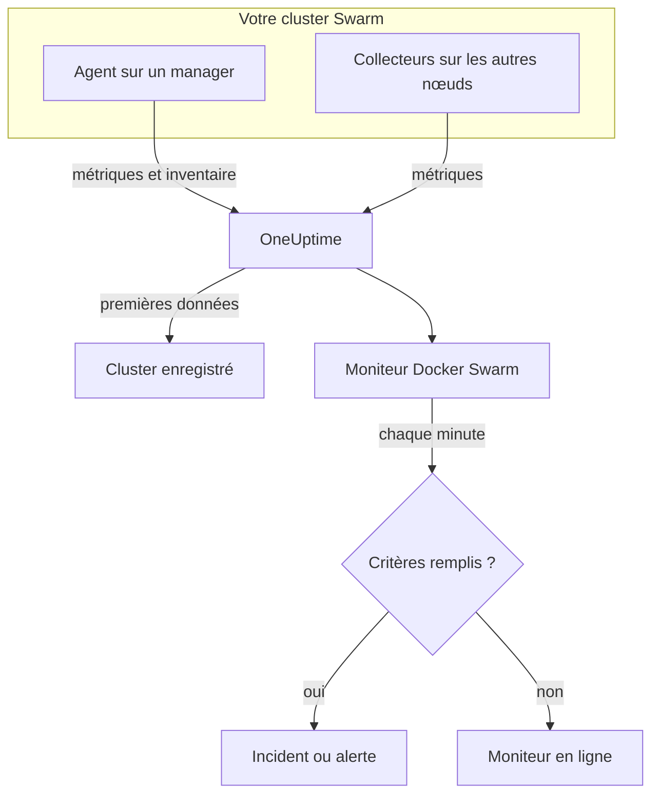

# Surveillance Docker Swarm

Un moniteur Docker Swarm surveille les conteneurs derrière les tâches de service d'un cluster Swarm et vous prévient quand une tâche redémarre, chauffe ou manque de mémoire. Il lit les métriques de conteneurs qu'envoie l'agent Docker Swarm de OneUptime, si bien que rien n'est sondé depuis l'extérieur : installez l'agent, puis créez le moniteur à partir d'un modèle ou de votre propre requête.

:::cards
- [Créer le moniteur](#créer-un-moniteur-docker-swarm): Six étapes dans le tableau de bord.
- [Modèles](#modèles-dalerte-prêts-à-lemploi): Quatre alertes prêtes à l'emploi, un incident par tâche.
- [Métriques](#métriques-collectées): Les métriques de conteneurs sur lesquelles vous pouvez alerter.
- [Filtres](#paramètres-du-moniteur): Restreindre un moniteur à un service, une tâche ou une image.
:::

## Fonctionnement

L'agent Docker Swarm de OneUptime s'exécute sur un nœud manager. Son collecteur lit les statistiques des conteneurs auprès du démon Docker de ce nœud toutes les 30 secondes et marque chaque lot du nom du cluster, `docker.swarm.cluster.name`. Un petit collecteur d'inventaire à ses côtés lit les nœuds, services et tâches du cluster via l'API Swarm toutes les 5 minutes. Les premières données enregistrent le cluster dans OneUptime.

Le collecteur ne voit que les conteneurs du nœud sur lequel il tourne. Pour obtenir les métriques de chaque nœud, exécutez le collecteur sur chaque nœud avec le même `DOCKER_SWARM_CLUSTER_NAME`.

Un moniteur Docker Swarm est lié à un cluster. Chaque minute, il exécute sa requête sur les métriques des conteneurs de ce cluster et compare le résultat à ses critères.

## Avant de commencer

- **Installez l'agent Docker Swarm** sur un nœud manager. Le [guide de l'agent Docker Swarm](/docs/telemetry/docker-swarm) couvre son installation et sa mise à jour, ainsi que l'exécution du collecteur sur les autres nœuds.
- **Vérifiez que le cluster est enregistré.** Il apparaît sous **Produits → Infrastructure → Docker Swarm → Tous les clusters**, nommé d'après le `DOCKER_SWARM_CLUSTER_NAME` de l'agent, dès l'arrivée de ses premières données.

## Créer un moniteur Docker Swarm

:::steps
### Commencer un nouveau moniteur

Allez dans **Moniteurs** et cliquez sur **Créer un moniteur**.

### Choisir Docker Swarm

Sous **Type de moniteur**, cliquez sur **Plus de types de moniteurs** et choisissez **Docker Swarm** sous **Infrastructure**, ou tapez `swarm` dans le champ de recherche. Saisissez un **Nom** – il est utilisé dans les titres des incidents et des alertes – et cliquez sur **Suivant**.

### Choisir le cluster

Sous **Configuration du moniteur Docker Swarm**, choisissez le cluster dans **Cluster Docker Swarm**. Chaque cluster qui a envoyé des données figure dans la liste.

### Choisir ce qu'il faut surveiller

Choisissez l'un des trois onglets :

- **Quick Setup** – cliquez sur un [modèle](#modèles-dalerte-prêts-à-lemploi). Il définit la métrique, l'agrégation, la plage temporelle et les seuils, et remplace les critères plus bas par les siens. Vous pouvez toujours changer la **Plage temporelle**.
- **Custom Metric** – choisissez une métrique dans **Métrique Docker Swarm**, puis définissez l'**Agrégation** et la **Plage temporelle**. Les [filtres](#paramètres-du-moniteur) la restreignent à certaines tâches.
- **Avancé** – construisez vous-même des requêtes et des formules sous **Sélectionner les métriques**. Utilisez **Regrouper par** `resource.container.name` pour juger chaque tâche séparément.

### Vérifier les critères

Ouvrez chaque critère sous **Critères du moniteur** et vérifiez sa **Métrique**, son **Agrégation**, sa **Condition** et son **Threshold**. Un modèle les remplit. Avec **Custom Metric** ou **Avancé**, le moniteur commence avec les [critères par défaut](#critères-par-défaut), qui ne remarquent qu'une métrique tombant à zéro ; définissez donc votre propre seuil.

### Créer le moniteur

Cliquez sur **Créer un moniteur**. OneUptime ouvre la page du moniteur et l'évalue chaque minute. Les incidents et alertes qu'il déclenche sont aussi listés sur les pages **Incidents** et **Alertes** du cluster.
:::

> [!TIP]
> Pour configurer plusieurs modèles à la fois, ouvrez le cluster depuis **Produits → Infrastructure → Docker Swarm** et allez dans **Recommendations**. Choisissez les modèles voulus, choisissez qui est alerté, et OneUptime crée un moniteur par modèle.

## Paramètres du moniteur

| Champ | Onglet | Ce qu'il fait |
| --- | --- | --- |
| **Cluster Docker Swarm** | Tous | Obligatoire. Limite chaque requête à `resource.docker.swarm.cluster.name`. C'est le seul attribut de ressource que l'agent appose, si bien que le moniteur n'ajoute aucun filtre `container.runtime` ou `host.name`. |
| **Nom du service** | Custom Metric, Avancé | Facultatif. Correspondance exacte sur `docker.swarm.service.name`, par exemple `web`. |
| **Nom du nœud** | Custom Metric, Avancé | Facultatif. Correspondance exacte sur `docker.swarm.node.name`, par exemple `swarm-node-1`. |
| **Nom du conteneur** | Custom Metric, Avancé | Facultatif. Correspondance exacte sur `resource.container.name`. Le conteneur d'une tâche s'appelle `<service>.<slot>.<taskid>`, par exemple `web.1.abc123`. |
| **Image du conteneur** | Custom Metric, Avancé | Facultatif. Correspondance exacte sur `resource.container.image.name`, par exemple `nginx:latest`. |
| **Métrique Docker Swarm** | Custom Metric | Une métrique du [catalogue](#métriques-collectées). |
| **Agrégation** | Custom Metric | Comment les mesures sont combinées : **Moyenne**, **Maximum**, **Minimum**, **Somme** ou **Comptage**. Commence à l'agrégation habituelle de la métrique. |
| **Plage temporelle** | Tous | La fenêtre glissante que lit la requête, de **Past 1 Minute** à **Past 365 Days**. Un nouveau moniteur commence à **Past 1 Minute** ; les modèles définissent la leur. |
| **Sélectionner les métriques** | Avancé | Le constructeur de requêtes : **Métrique**, **Agréger par**, **Filtrer par attributs**, **Regrouper par**, plus **Ajouter une métrique** et **Ajouter une formule** pour combiner des requêtes. |

> [!WARNING]
> L'agent fourni ne définit pas encore `docker.swarm.service.name` ni `docker.swarm.node.name`, si bien qu'un moniteur dont **Nom du service** ou **Nom du nœud** est rempli ne trouve aucune donnée. Restreignez plutôt par **Image du conteneur**, ou regroupez par `resource.container.name`.

## Modèles d'alerte prêts à l'emploi

**Quick Setup** propose quatre modèles. Chacun construit un moniteur complet : une requête regroupée par `resource.container.name`, un critère qui se déclenche et un autre qui rétablit. Chaque tâche est jugée séparément et reçoit son propre incident et sa propre alerte, dont la cause racine liste les tâches concernées et leurs valeurs. Les seuils sont des points de départ que vous pouvez modifier.

Sauf indication contraire dans le tableau, un critère ne se déclenche que si la condition est remplie à chaque minute de sa fenêtre, et il se rétablit 10 % au-delà du seuil pour qu'une valeur qui oscille autour de la limite ne bascule pas sans cesse.

| Modèle | Gravité | Surveille | Se déclenche quand | Se rétablit quand |
| --- | --- | --- | --- | --- |
| Task Down (Low Uptime) | Critique | `container.uptime`, Min par tâche, dernière 1 minute | Une valeur quelconque est sous 60 secondes | Chaque valeur est à 66 secondes ou plus |
| High Task CPU Usage | Warning | `container.cpu.utilization`, Avg par tâche, 5 dernières minutes | Au-dessus de 80 (% d'un cœur) | À 72 ou moins |
| High Task Memory Usage | Warning | `container.memory.percent`, Avg par tâche, 5 dernières minutes | Au-dessus de 85 % | À 76,5 % ou moins |
| High Task Process Count | Warning | `container.pids.count`, Max par tâche, 5 dernières minutes | Au-dessus de 500 | À 450 ou moins |

**Gravité** est le libellé qu'affiche le sélecteur. L'incident et l'alerte qu'un modèle crée commencent avec la gravité d'incident et d'alerte la plus élevée de votre projet ; changez-les dans les critères.

> [!NOTE]
> **Task Down (Low Uptime)** se déclenche sur une seule mesure récente, car un redémarrage est un événement, pas un niveau. Swarm donne à une tâche de remplacement un nouveau conteneur, donc une nouvelle série ; c'est pourquoi le modèle cherche une durée de fonctionnement inférieure à une minute plutôt qu'un 0. Un déploiement ou une montée en charge le déclenche aussi, et il se rétablit une fois que les nouvelles tâches dépassent une minute de fonctionnement. Une tâche qui meurt sans être remplacée n'envoie rien et n'est donc pas détectée.

## Métriques collectées

Le collecteur de l'agent utilise le récepteur OpenTelemetry `docker_stats` ; les métriques sont donc les métriques de conteneurs standard, une série par conteneur de tâche. Il n'existe pas de métriques `docker_swarm_*` : les nœuds, services et tâches sont suivis comme inventaire, sur les pages **Services**, **Tâches**, **Nœuds** et apparentées du cluster.

### CPU

| Métrique | Unité | Description |
| --- | --- | --- |
| `container.cpu.utilization` | % | Utilisation du CPU du conteneur d'une tâche, où 100 % correspond à un cœur de CPU complet. |

### Mémoire

| Métrique | Unité | Description |
| --- | --- | --- |
| `container.memory.usage.total` | bytes | Mémoire utilisée par le conteneur d'une tâche. |
| `container.memory.percent` | % | Mémoire utilisée en pourcentage de la limite du conteneur, ou de la mémoire totale du nœud quand le service ne fixe pas de limite. |

### Réseau

| Métrique | Unité | Description |
| --- | --- | --- |
| `container.network.io.usage.rx_bytes` | bytes | Octets reçus par le conteneur d'une tâche. Un compteur sur toute la durée de vie. |
| `container.network.io.usage.tx_bytes` | bytes | Octets envoyés par le conteneur d'une tâche. Un compteur sur toute la durée de vie. |

### Conteneur

| Métrique | Unité | Description |
| --- | --- | --- |
| `container.pids.count` | count | Processus dans le conteneur d'une tâche. Une hausse soudaine peut signaler une fork bomb ou une fuite. |
| `container.uptime` | seconds | Depuis combien de temps le conteneur d'une tâche tourne. Une tâche replanifiée ou redémarrée démarre un nouveau conteneur à 0. |

Chaque série porte l'identité du conteneur comme attributs de ressource : `resource.container.name` (`<service>.<slot>.<taskid>`), `resource.container.image.name` et `resource.docker.swarm.cluster.name`.

## Critères de surveillance

Un critère compare l'une des requêtes ou formules du moniteur à un seuil. Les critères d'un moniteur Docker Swarm n'ont pas de **Type de filtre** : chaque règle vérifie la valeur de la métrique, avec ces champs.

| Champ | Ce qu'il fait |
| --- | --- |
| **Métrique** | La requête ou la formule à vérifier, par son nom de variable. |
| **Agrégation** | Comment les valeurs de la fenêtre deviennent une seule réponse : **Moyenne**, **Somme**, **Maximum Value**, **Minimum Value**, **All Values** (chaque valeur doit correspondre) ou **Any Value** (une seule suffit). |
| **Condition** | **Greater Than**, **Less Than**, **Greater Than Or Equal To**, **Less Than Or Equal To** ou **Equal To** – ou une condition d'anomalie : **Anomalously High**, **Anomalously Low** ou **Anomalous**. |
| **Threshold** | La valeur de comparaison. Une liste d'unités se trouve à côté quand la métrique a une unité. Non affiché pour les conditions d'anomalie. |
| **Sensibilité** | Conditions d'anomalie uniquement. **Faible** (4σ), **Moyen** (3σ, la valeur par défaut) ou **Élevé** (2σ). |
| **Fenêtre de référence** | Conditions d'anomalie uniquement. 14 jours (la valeur par défaut), 28, 60 ou 90 jours d'historique. |
| **En l'absence de données** | Sous **Plus de champs**. Ce qui se passe quand la fenêtre n'a aucune mesure : **Ignore** (par défaut), **Treat As Zero** ou **Déclencheur**. |

Les conditions d'anomalie comparent chaque valeur à la même heure de la semaine dans la référence. Elles restent dans un état « Learning », et ne déclenchent rien, tant que la fenêtre de référence ne contient pas assez d'historique.

Chaque critère indique aussi quoi faire quand il correspond : changer le statut du moniteur, créer une alerte ou déclarer un incident. Les critères sont vérifiés de haut en bas, et le premier qui correspond l'emporte.

### Critères par défaut

Un moniteur que vous ne créez pas à partir d'un modèle commence avec deux critères :

| Ordre | Critère | Correspond quand | Ensuite |
| --- | --- | --- | --- |
| 1 | Check if _monitor name_ is offline | Une valeur quelconque de la première requête vaut `0` | Marque le moniteur **Hors ligne** et déclare l'incident « _monitor name_ is offline », qui se résout de lui-même quand le moniteur se rétablit. |
| 2 | Check if _monitor name_ is online | Une valeur quelconque est au-dessus de `0` | Marque le moniteur **Opérationnel**. |

> [!IMPORTANT]
> Le silence ne correspond à aucun des deux critères : un cluster qui cesse d'envoyer des données laisse le moniteur tel qu'il était. Pour être prévenu quand les données s'arrêtent, réglez **En l'absence de données** sur **Déclencheur** dans un critère. Le temps pendant lequel OneUptime lui-même ne recevait pas de données n'est jamais une absence de données : une vérification dont la fenêtre en contient attend à la place, comme l'explique [Quand OneUptime ne reçoit pas de données](/docs/monitor/when-oneuptime-is-not-receiving).

## Dépannage

:::details Le cluster n'est pas dans la liste Cluster Docker Swarm
Les clusters s'enregistrent eux-mêmes à partir des données de l'agent. Vérifiez que l'agent tourne sur un nœud manager, que `DOCKER_SWARM_CLUSTER_NAME` est défini et que le cluster figure sous **Produits → Infrastructure → Docker Swarm → Tous les clusters**. Le [guide de l'agent Docker Swarm](/docs/telemetry/docker-swarm) contient les vérifications à exécuter sur le nœud.
:::

:::details Seules certaines tâches ont des métriques
Le collecteur lit le démon Docker du nœud sur lequel il tourne, il ne voit donc que les tâches de ce nœud. Exécutez le collecteur sur chaque nœud avec le même `DOCKER_SWARM_CLUSTER_NAME`.
:::

:::details Un moniteur filtré par service ou par nœud ne trouve aucune donnée
**Nom du service** et **Nom du nœud** correspondent à `docker.swarm.service.name` et `docker.swarm.node.name`, que l'agent fourni ne définit pas. Videz-les et restreignez par **Image du conteneur**, ou regroupez par `resource.container.name`.
:::

:::details Toutes les tâches apparaissent comme une seule série
Regroupez par l'attribut de ressource, `resource.container.name`, comme le font les modèles. Le simple `container.name` ne correspond à rien, si bien que toutes les tâches fusionnent en une seule série au nom vide.
:::

## Étapes suivantes

:::cards
- [Agent Docker Swarm](/docs/telemetry/docker-swarm): Installer et mettre à jour l'agent que lit ce moniteur.
- [Surveillance Docker](/docs/monitor/docker-monitor): Surveiller les conteneurs d'un seul hôte Docker.
- [Vue d'ensemble des incidents](/docs/incidents/index): Ce qui se passe après qu'un critère a déclaré un incident.
- [Plannings d'astreinte](/docs/on-call/schedules): Décider qui est alerté quand une tâche tombe en panne.
:::
