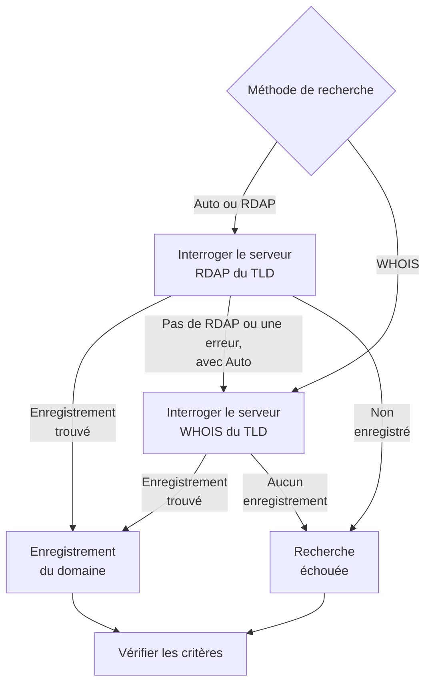

# Surveillance de domaine

Un moniteur de domaine lit à intervalle régulier l'enregistrement de votre domaine auprès du registre, pour suivre sa date d'expiration, son registraire, ses serveurs de noms et ses codes de statut, et vous avertir avant son expiration. Utilisez-le pour chaque domaine dont dépendent vos sites web, vos API et vos e-mails : un enregistrement expiré les met tous hors service d'un coup.

:::cards
- [Créer le moniteur](#créer-un-moniteur-de-domaine): Six étapes dans le tableau de bord.
- [Méthodes de recherche](#méthodes-de-recherche): RDAP, WHOIS, et pourquoi **Auto** est la valeur par défaut.
- [Critères par défaut](#critères-par-défaut): Un avertissement d'expiration 30 jours à l'avance, sans rien configurer.
- [Dépannage](#dépannage): Serveurs WHOIS retirés, proxys et dates manquantes.
:::

## Fonctionnement

À chaque vérification, une sonde recherche l'enregistrement du domaine par RDAP ou WHOIS, selon la **Méthode de recherche**, et normalise ce qu'elle trouve : la date d'expiration, le registraire, les serveurs de noms et les codes de statut. Une recherche qui échoue est retentée, dans la limite du nombre de tentatives que vous fixez. OneUptime passe ensuite l'enregistrement au crible des critères du moniteur.

Si une recherche ne peut pas produire de données d'enregistrement — parce que le service du TLD est retiré, ou que le domaine n'est pas enregistré —, le moniteur est signalé **hors ligne** avec la raison affichée dans la réponse de sonde du moniteur, au lieu d'être signalé en bonne santé avec une date d'expiration vide. Un registre qui répond « ce domaine est disponible » (par exemple le `Status: free` de DENIC) est traité comme **non enregistré**, pas comme un enregistrement en bonne santé.

Les noms de domaine internationalisés sont acceptés sous les deux formes : `münchen.de` est converti en son A-label (`xn--mnchen-3ya.de`) avant la recherche.

## Avant de commencer

- **Un rôle qui peut créer des moniteurs** : Project Owner, Project Admin, Project Member, Monitor Admin ou Monitor Member, ou un rôle personnalisé avec l'autorisation Create Monitor.
- **Un accès sortant depuis la sonde** vers les registres. Les sondes par défaut de votre projet sont choisies pour chaque nouveau moniteur ; une [sonde personnalisée](/docs/probe/custom-probe) doit pouvoir joindre :

| Destination | Protocole | Utilisé pour |
| --- | --- | --- |
| `https://data.iana.org/rdap/dns.json` | HTTPS, port 443 | Le registre d'amorçage RDAP de l'IANA, qui indique où se trouve le serveur RDAP de chaque TLD. Récupéré une fois et mis en cache 24 heures. |
| Les serveurs RDAP des registres | HTTPS, port 443 | Les recherches RDAP. |
| Les serveurs WHOIS | TCP, port 43 | Les recherches WHOIS. |

Les requêtes RDAP respectent les réglages `HTTP_PROXY_URL` / `HTTPS_PROXY_URL` / `NO_PROXY` de la sonde. WHOIS passe par une socket brute et ne les respecte pas. Si une sonde ne peut pas joindre `data.iana.org`, **Auto** se rabat sur WHOIS et réessaie l'IANA au bout de cinq minutes.

## Créer un moniteur de domaine

:::steps
### Commencer un nouveau moniteur

Allez dans **Moniteurs** et cliquez sur **Créer un moniteur**. Sous **Type de moniteur**, cliquez sur **Plus de types de moniteurs** et choisissez **Domaine** sous **Basic Monitoring**.

### Le nommer

Saisissez un **Nom**, comme `example.com registration`, puis cliquez sur **Suivant**.

### Saisir le domaine

Saisissez le **Nom de domaine**, comme `example.com`. Laissez **Méthode de recherche** sur **Auto**, sauf si vous avez une raison de faire autrement (voir [Méthodes de recherche](#méthodes-de-recherche)).

### Le tester

Cliquez sur **Tester le moniteur**, choisissez une sonde sous **Sélectionner la sonde** et cliquez sur **Exécuter le test**. **Résultat du test du moniteur** montre l'enregistrement que la sonde a lu, et si RDAP ou WHOIS a répondu.

### Passer en revue les critères

**Critères du moniteur** commence avec les [critères par défaut](#critères-par-défaut) : hors ligne quand l'enregistrement a expiré ou ne peut pas être lu, une alerte quand il expire dans 30 jours ou moins. Modifiez-les si besoin, puis cliquez sur **Suivant**.

### Choisir les sondes et créer

Gardez ou changez les **Sondes** et l'**Intervalle de surveillance** (il commence à **Toutes les 5 minutes**), puis cliquez sur **Créer un moniteur**. La page du moniteur s'ouvre.
:::

## Options de configuration

| Champ | Par défaut | Ce qu'il faut saisir |
| --- | --- | --- |
| **Nom de domaine** | Aucun | Le domaine enregistré, comme `example.com`. Une adresse collée fonctionne aussi : `https://example.com/pricing` est lu comme `example.com`. |
| **Méthode de recherche** | **Auto** | **Auto**, **RDAP** ou **WHOIS**. Voir [Méthodes de recherche](#méthodes-de-recherche). |
| **Délai d'expiration (ms)** (sous **Plus de champs**) | `10000` | Combien de temps attendre chaque recherche d'enregistrement, en millisecondes. |
| **Tentatives** (sous **Plus de champs**) | `3` | Nouvelles tentatives après l'échec de la première. `0` signifie une seule tentative. |

Chaque recherche échouée est retentée, avec une pause d'une seconde entre les tentatives. Cela inclut un registre qui répond que le domaine n'est pas enregistré, ou qu'il n'a pas de service d'enregistrement, au cas où la réponse aurait été une panne passagère. Seul un nom de domaine mal formé est signalé tout de suite, sans recherche.

Le délai s'applique à chaque requête, pas à la vérification entière : une vérification **Auto** qui essaie RDAP puis se rabat sur WHOIS peut prendre deux fois plus de temps, ou davantage.

### Méthodes de recherche

Les données d'enregistrement peuvent se lire par deux protocoles, et celui qui fonctionne dépend du TLD.

| Méthode | Comportement |
| --- | --- |
| **Auto** | Par défaut. Utilise RDAP quand le TLD publie un service RDAP, et se rabat sur WHOIS quand ce n'est pas le cas, ou quand la recherche RDAP échoue. |
| **RDAP** | RDAP seulement. Échoue avec une erreur claire si le TLD ne publie aucun service RDAP. |
| **WHOIS** | WHOIS seulement. |

**RDAP** ([RFC 9083](https://www.rfc-editor.org/rfc/rfc9083)) est le remplaçant de WHOIS imposé par l'ICANN. Le serveur faisant autorité de chaque TLD est découvert depuis le [registre d'amorçage de l'IANA](https://www.rfc-editor.org/rfc/rfc9224), il reste donc juste quand les registres déménagent. Chaque gTLD en publie un. Quand le serveur RDAP du TLD dit que le domaine n'est pas enregistré, **Auto** prend cela comme réponse et n'interroge pas WHOIS.

**WHOIS** n'a pas de mécanisme de découverte équivalent — les clients embarquent une correspondance fixe entre TLD et hôte WHOIS, et ces correspondances vieillissent. Chaque TLD d'Identity Digital (`.digital`, `.email`, `.life`, `.today`, `.zone` et environ 290 autres) est encore associé à un hôte retiré qui répond désormais à chaque requête par le texte littéral `TLD is not supported.` au lieu d'un enregistrement. WHOIS reste la seule option pour les nombreux ccTLD qui ne publient aucun service RDAP, comme `.io`, `.co`, `.de`, `.ch` et `.jp`.

## Critères de surveillance

Les critères décident quand le domaine compte comme bon ou défaillant, et si cela déclare un incident ou crée une alerte. Chaque critère vérifie un ou plusieurs filtres :

| Filtre | Conditions | Ce qu'il vérifie |
| --- | --- | --- |
| **Is Online** | **Vrai**, **Faux** | Si la recherche d'enregistrement elle-même a réussi. |
| **Is Request Timeout** | **Vrai**, **Faux** | Si la recherche a expiré, à chaque tentative. |
| **Domain Expires In Days** | **Greater Than**, **Less Than**, **Greater Than Or Equal To**, **Less Than Or Equal To** | Les jours avant l'expiration de l'enregistrement, arrondis au jour entier supérieur. |
| **Domain Is Expired** | **Vrai**, **Faux** | Si la date d'expiration est passée. |
| **Domain Registrar** | **Contient**, **Not Contains**, **Starts With**, **Ends With**, **Equal To**, **Not Equal To** | Le nom du registraire. |
| **Domain Name Server** | **Contient**, **Not Contains**, **Starts With**, **Ends With**, **Equal To**, **Not Equal To** | Les serveurs de noms du domaine. Correspond quand l'un d'eux correspond. |
| **Domain Status Code** | **Contient**, **Not Contains**, **Starts With**, **Ends With**, **Equal To**, **Not Equal To** | Les codes de statut EPP du domaine. Correspond quand l'un d'eux correspond. |

Les codes de statut sont normalisés vers leur nom EPP (`clientTransferProhibited`) quel que soit le protocole qui a répondu, donc un critère continue de correspondre quand **Auto** passe de RDAP à WHOIS. Les _noms_ de registraire sont ce que publie le service qui répond et peuvent légèrement différer entre les deux protocoles, alors préférez **Contient** à **Equal To** pour un critère **Domain Registrar**.

Les dates sont normalisées en ISO 8601. Une date qu'un registre publie sous une forme impossible à analyser est omise plutôt qu'enregistrée, donc un critère d'expiration ne peut pas trancher, et ne correspond pas, au lieu de répondre en silence « non expiré » pour toujours.

Avec deux filtres ou plus, **Condition de correspondance** décide si **Tous** doivent correspondre ou si **Tout** filtre suffit. Les **Actions** d'un critère décident de ce qu'il fait : changer l'état du moniteur, créer une alerte, déclarer un incident, ou plusieurs de ces actions.

### Critères par défaut

Un nouveau moniteur de domaine commence avec trois critères, donc il vous avertit avant l'expiration d'un enregistrement sans rien configurer :

1. **Vérification du domaine échouée** — l'enregistrement a expiré, ou ses données n'ont pas pu être lues. Le moniteur est marqué **Hors ligne** et un incident appelé « _monitor name_ domain check failed » est créé. L'incident se résout de lui-même dès que l'enregistrement est de nouveau lu et à jour.
2. **Domaine bientôt expiré** — l'enregistrement n'a pas expiré mais expire dans 30 jours ou moins. Une **alerte** appelée « _monitor name_ domain expires soon » est créée.
3. **Domaine non expiré** — le moniteur est marqué **Opérationnel**.

L'avertissement « bientôt expiré » est une alerte, pas un incident : il n'apparaît pas sur vos pages de statut, il ne prévient personne tant que vous n'y ajoutez pas une politique d'astreinte, et il ne change pas l'état du moniteur. Il utilise la deuxième gravité d'alerte de votre projet, **Low** sur un nouveau projet. Dès que le renouvellement apparaît dans l'enregistrement, l'alerte se résout d'elle-même. Un registre qui ne publie aucune date d'expiration ne donne rien à l'avertissement, qui reste donc silencieux.

Les critères sont vérifiés de haut en bas, et le premier qui correspond décide de ce qui se passe. C'est pourquoi « bientôt expiré » se trouve au-dessus de « non expiré » : un domaine sur le point d'expirer n'a pas encore expiré, il correspondrait donc aux deux.

Pour être averti plus tôt, changez la valeur du filtre **Domain Expires In Days** dans le critère « bientôt expiré », par exemple à `60`. Pour faire prévenir quelqu'un à la place, ouvrez les **Actions** de ce critère : activez **Lorsque les filtres correspondent, déclarer un incident.**, ou gardez l'alerte et ajoutez-lui une politique d'astreinte sous **Politiques d'astreinte**.

:::details Ajouter l'avertissement à un moniteur créé avant son existence
Les moniteurs créés avant que OneUptime n'ajoute cet avertissement n'ont pas de critère « bientôt expiré ». Pour l'ajouter :

1. Sur le moniteur, ouvrez **Configuration → Critères** et cliquez sur **Modifier les critères de surveillance**.
2. Cliquez sur **Ajouter un critère**. Réglez son filtre sur **Domain Is Expired** / **Faux**, cliquez sur **Ajouter un filtre** et réglez le second sur **Domain Expires In Days** / **Less Than Or Equal To** / `30`. Laissez **Condition de correspondance** sur **Tous** (il apparaît sous les filtres dès qu'il y en a deux).
3. Sous **Actions**, activez **Lorsque les filtres correspondent, créer une alerte.** et laissez **Lorsque les filtres correspondent, modifier le statut du moniteur.** désactivé, pour qu'il crée une alerte sans changer l'état du moniteur.
4. Faites glisser le nouveau critère au-dessus du critère qui marque le moniteur en ligne, puis enregistrez.
:::

### Exemples de critères

| Objectif | Filtre | Condition | Valeur |
| --- | --- | --- | --- |
| Alerter quand le domaine expire dans les 30 jours (un critère par défaut) | **Domain Expires In Days** | **Less Than Or Equal To** | `30` |
| Hors ligne quand le domaine a expiré | **Domain Is Expired** | **Vrai** | — |
| Hors ligne quand l'enregistrement ne peut pas être lu | **Is Online** | **Faux** | — |
| Alerter quand les serveurs de noms changent | **Domain Name Server** | **Not Contains** | `ns1.example.com` |
| Alerter quand le domaine est déverrouillé pour un transfert | **Domain Status Code** | **Not Contains** | `clientTransferProhibited` |

**Domain Name Server** et **Domain Status Code** correspondent quand _n'importe quelle_ valeur correspond, donc **Not Contains** correspond dès qu'un serveur de noms, ou un code de statut, ne contient pas le texte.

## Bonnes pratiques

1. **Gardez-vous le temps de renouveler** — L'avertissement par défaut arrive 30 jours avant l'expiration. Si le renouvellement demande des validations ou un paiement qui prend plus de temps, passez-le à 60 jours.
2. **Couvrez les recherches échouées** — Incluez un filtre **Is Online** / **Faux** dans votre critère hors ligne pour qu'un enregistrement illisible ne soit pas pris pour un enregistrement en bonne santé. Les nouveaux moniteurs l'ont dans leurs critères par défaut ; un moniteur créé avant son ajout a besoin qu'on l'ajoute à la main. Pour encaisser un serveur WHOIS qui limite la sonde de temps en temps, cochez **Évaluer ce critère sur une période donnée** sous ce filtre et choisissez **All Values** : le domaine ne passe alors hors ligne que quand chaque recherche de la fenêtre a échoué.
3. **Surveillez tous les domaines critiques** — Incluez les domaines principaux, les sous-domaines enregistrés séparément et tous les domaines utilisés pour les e-mails ou les API.
4. **Suivez les changements de registraire** — Ajoutez un critère avec **Domain Registrar** / **Not Contains** / le nom de votre registraire, pour repérer un transfert non autorisé.

## Dépannage

:::details Le serveur WHOIS « answered without any registration data »
L'hôte WHOIS du TLD est retiré, limite la sonde, ou est brièvement en panne. Un hôte retiré, comme celui encore associé aux TLD d'Identity Digital, répond `TLD is not supported.` à chaque fois. Si l'échec persiste avec **Méthode de recherche** sur **WHOIS**, passez à **Auto**, pour que la sonde lise le service RDAP du TLD quand il en existe un.
:::

:::details La vérification échoue avec « No RDAP service is published »
Le moniteur utilise **RDAP**, et le TLD ne publie aucun service RDAP, comme beaucoup de ccTLD. Passez **Méthode de recherche** sur **Auto**, qui se rabat sur WHOIS.
:::

:::details Le domaine est signalé comme non enregistré
Le registre a répondu que le domaine est disponible. Vérifiez l'orthographe, et que vous avez saisi le domaine enregistré, comme `example.com`, et non un sous-domaine.
:::

:::details Les recherches échouent sur une sonde derrière un proxy
RDAP passe par les réglages de proxy de la sonde, WHOIS non. Autorisez le port TCP 43 sortant pour WHOIS, ou utilisez **Auto** ou **RDAP** pour les TLD qui publient un service RDAP.
:::

:::details La date d'expiration est vide, et les critères d'expiration ne se déclenchent jamais
Le registre ne publie aucune date d'expiration, ou une date sous une forme impossible à analyser. Les critères d'expiration ne peuvent pas trancher sans date, ils restent donc silencieux. **Is Online** vous dit toujours si l'enregistrement peut être lu.
:::

## Étapes suivantes

:::cards
- [Surveillance de certificat SSL](/docs/monitor/ssl-certificate-monitor): Être averti avant l'expiration des certificats du domaine.
- [Surveillance DNS](/docs/monitor/dns-monitor): Vérifier que les enregistrements du domaine se résolvent, et ce qu'ils disent.
- [Surveillance DNSSEC](/docs/monitor/dnssec-monitor): Valider la chaîne de confiance d'une zone signée.
- [Règles d'escalade](/docs/on-call/escalation-rules): Décider qui est prévenu par les alertes et les incidents.
:::
