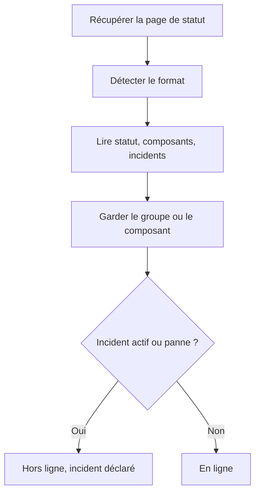

# Surveillance de page de statut externe

Un moniteur de page de statut externe surveille la page de statut publique d'un service dont vous dépendez — AWS, GCP, Azure, GitHub, OpenAI, Anthropic et bien d'autres — et vous alerte quand ce fournisseur signale une panne ou des performances dégradées. Utilisez-le pour apprendre l'existence de problèmes en amont dès que le fournisseur les signale, et pour les distinguer des vôtres.

:::cards
- [Créer le moniteur](#créer-un-moniteur-de-page-de-statut-externe): Coller l'URL d'une page de statut et choisir quoi surveiller.
- [Délimiter le périmètre](#options-de-configuration): Surveiller un groupe de composants ou un composant.
- [Critères](#critères-de-surveillance): Ce qui compte comme une panne, d'emblée.
- [Pages de statut populaires](#url-de-pages-de-statut-populaires): Les URL des services dont dépendent la plupart des équipes.
:::

## Fonctionnement

À chaque vérification, une sonde récupère la page de statut, détermine son format, et lit le statut global, les composants et les incidents actifs. Si vous avez limité le moniteur à un groupe de composants ou à un composant, seuls ceux-ci comptent. Les critères décident ensuite si le moniteur est en ligne ou hors ligne.

Vous pouvez l'utiliser pour :

- Surveiller la disponibilité des services tiers dont dépend votre application
- Être alerté quand des fournisseurs en amont subissent des pannes
- Suivre le statut de chaque composant
- Limiter la surveillance à un seul groupe de composants (p. ex. seulement les "APIs" d'OpenAI), pour que des incidents sans rapport ailleurs sur la page ne déclenchent pas votre moniteur
- Détecter des performances dégradées avant qu'elles n'affectent vos utilisateurs
- Rapprocher vos propres incidents des problèmes des fournisseurs en amont

## Fournisseurs pris en charge

| Fournisseur | Description |
| ------------------------ | ---------------------------------------------------------------------- |
| **Auto** (par défaut) | Détecte automatiquement le format de la page de statut |
| **Atlassian Statuspage** | Pages de statut propulsées par Atlassian Statuspage (API JSON) |
| **incident.io** | Pages de statut propulsées par incident.io (p. ex. `https://status.openai.com`) |
| **RSS** | Pages de statut qui fournissent un flux RSS |
| **Atom** | Pages de statut qui fournissent un flux Atom |

### Détection automatique

Avec **Auto**, OneUptime détecte automatiquement le format de la page de statut, dans cet ordre :

1. D'abord, il essaie l'API de page de statut d'incident.io (`/proxy/<host>`).
2. Ensuite, il essaie l'API JSON d'Atlassian Statuspage (`/api/v2/status.json`, `/api/v2/components.json` et `/api/v2/incidents/unresolved.json`).
3. Si celles-ci échouent, il tente de lire la page comme un flux RSS ou Atom.
4. En dernier recours, il effectue une simple vérification d'accessibilité HTTP.

> [!NOTE]
> incident.io est vérifié en premier parce que certaines pages de statut incident.io (comme `https://status.openai.com`) exposent aussi un point de terminaison limité compatible Atlassian, qui omet les groupes de composants et les incidents actifs. Vérifier incident.io d'abord garantit l'utilisation des données plus riches, qui connaissent les groupes.

La vérification d'accessibilité est aussi le recours quand un fournisseur choisi explicitement échoue. Elle indique seulement si la page répond — en ligne sur une réponse `2xx` ou `3xx` — et ne rapporte ni composants ni incidents.

## Créer un moniteur de page de statut externe

:::steps
### Commencer un nouveau moniteur

Allez dans **Moniteurs** et cliquez sur **Créer un moniteur**. Sous **Type de moniteur**, cliquez sur **Plus de types de moniteurs** et choisissez **Page de statut externe** sous **Basic Monitoring**, ou tapez `statuspage` dans le champ de recherche. Saisissez un **Nom**, puis cliquez sur **Suivant**.

### Saisir l'URL de la page de statut

Saisissez l'**URL de la page de statut**. Laissez le **Fournisseur** sur **Auto** sauf si vous connaissez le format.

### Délimiter le périmètre, si nécessaire

Ouvrez **Plus de champs** pour saisir un **Filtre de groupe de composants (facultatif)**, comme `APIs`, et un **Filtre par nom de composant (facultatif)** pour surveiller un seul composant (dans le groupe, si un groupe est défini).

### Le tester

Cliquez sur **Tester le moniteur** pour récupérer la page une fois, et vérifiez le fournisseur, les composants et les incidents trouvés.

### Passer en revue les critères

L'étape des critères commence avec [les critères par défaut](#critères-par-défaut), qui marquent le moniteur hors ligne quand le fournisseur signale un incident actif ou une panne dans le périmètre. Modifiez-les si besoin, puis cliquez sur **Suivant**.

### Choisir les sondes et créer

Sélectionnez les **Sondes** et un **Intervalle de surveillance** — il commence à **Toutes les 5 minutes** — puis cliquez sur **Créer un moniteur**.
:::

## Options de configuration

| Option | Ce qu'il faut saisir | Par défaut |
| --- | --- | --- |
| **URL de la page de statut** | L'URL de la page de statut. Pour les sites propulsés par Atlassian Statuspage et incident.io, c'est généralement l'URL racine (p. ex. `https://status.example.com`). Pour les flux RSS/Atom, saisissez directement l'URL du flux. | — |
| **Fournisseur** | **Auto** pour détecter le format, ou **Atlassian Statuspage**, **incident.io**, **RSS** ou **Atom** si vous le connaissez. | **Auto** |
| **Filtre de groupe de composants (facultatif)** | Le groupe auquel limiter le moniteur. Sous **Plus de champs**. | Tous les groupes |
| **Filtre par nom de composant (facultatif)** | Le composant à surveiller. Sous **Plus de champs**. | Tous les composants du périmètre |
| **Délai d'expiration (ms)** | Le temps maximal d'attente de la page de statut. Sous **Plus de champs**. | `10000` (10 secondes) |
| **Tentatives** | Combien de fois réessayer, à une seconde d'intervalle, après l'échec de la première tentative ; `0` signifie une seule tentative. Sous **Plus de champs**. | `3` (jusqu'à 4 tentatives) |

### Filtre de groupe de composants

Si la page de statut organise ses composants en groupes, vous pouvez limiter le moniteur à un seul groupe. Par exemple, sur `https://status.openai.com`, saisir `APIs` limite le moniteur aux services d'API d'OpenAI.

Quand un groupe de composants est défini, le **nombre d'incidents actifs** et le **statut global** sont calculés uniquement à partir des composants de ce groupe — un incident touchant un groupe sans rapport (par exemple ChatGPT) ne déclenchera pas un moniteur limité au groupe "APIs".

Le filtrage par groupe de composants est pris en charge pour les fournisseurs **Atlassian Statuspage** et **incident.io**. Les flux RSS et Atom n'exposent pas de groupes de composants.

### Filtre par nom de composant

Si la page de statut rapporte plusieurs composants, vous pouvez indiquer un nom de composant pour ne surveiller que celui-ci. Le filtre correspond à tout composant dont le nom contient ce que vous saisissez, sans tenir compte de la casse — `actions` correspond à un composant nommé "Actions".

Quand un groupe de composants est aussi défini, le filtre par nom de composant s'applique **à l'intérieur** de ce groupe, ce qui vous permet de cibler un seul composant dans un groupe plus large. Quand aucun filtre n'est indiqué, tous les composants du périmètre sont surveillés. Sur un flux RSS ou Atom, le filtre par nom est comparé aux titres des éléments du flux.

> [!WARNING]
> Un filtre qui ne correspond à rien a l'air sain : sans composants dans le périmètre, rien ne peut signaler de panne. Vérifiez l'orthographe sur la page de statut, et utilisez **Tester le moniteur** pour voir ce que garde le filtre.

## Critères de surveillance

Vous pouvez configurer des critères pour décider quand le service externe est considéré comme en ligne ou hors ligne, en fonction de :

| Type de filtre | Ce qu'il vérifie | Conditions de filtre |
| --- | --- | --- |
| **External Status Page Is Online** | Si la page de statut est accessible et renvoie des données de statut | Vrai ou Faux |
| **External Status Page Overall Status** | Le statut global indiqué par la page | Equal To, Not Equal To, Contient, Not Contains, Starts With, Ends With |
| **External Status Page Component Status** | Le statut des composants du périmètre (en respectant les filtres de groupe / de nom de composant) : Opérationnel, Under Maintenance, Performances dégradées, Partial Outage, Panne majeure ou Panne totale | Equal To, Not Equal To, Contient, Not Contains, Starts With, Ends With |
| **External Status Page Active Incidents** | Le nombre d'incidents actuellement actifs signalés sur la page de statut (limité au groupe / composant quand un filtre est défini) | Equal To, Not Equal To, et les comparaisons numériques |
| **External Status Page Response Time (in ms)** | Le temps nécessaire pour récupérer les données de la page de statut | Greater Than, Less Than, Greater Than Or Equal To, Less Than Or Equal To |

Le statut global est ce que dit la page : ses valeurs varient donc selon le fournisseur. Une Atlassian Statuspage rapporte sa propre description, comme `All Systems Operational` ; un flux rapporte `operational` ou `degraded_performance` ; la vérification d'accessibilité rapporte `reachable` ou `unreachable`. Ces comparaisons sont sensibles à la casse. Pour alerter sur les pannes, **External Status Page Active Incidents** et **External Status Page Component Status** sont généralement plus fiables.

Sur un flux RSS ou Atom, les éléments des dernières 24 heures comptent comme incidents actifs : un élément RSS selon sa date de publication, une entrée Atom selon sa date de mise à jour.

### Critères par défaut

Par défaut, OneUptime crée des critères fondés sur ce qui compte vraiment pour une page de statut — ses incidents actifs et la santé de ses composants, plutôt que la simple accessibilité :

| Critère | Filtres | Effet |
| --- | --- | --- |
| Hors ligne | **Tout** parmi : la page n'est pas en ligne ; il y a au moins un incident actif dans le périmètre ; un composant du périmètre signale Performances dégradées, Partial Outage, Panne majeure ou Panne totale | Marque le moniteur hors ligne et déclare un incident, qui se résout de lui-même quand le critère cesse de correspondre |
| En ligne | **Tous** parmi : la page est en ligne ; il n'y a aucun incident actif dans le périmètre | Marque le moniteur en ligne |

Comme le nombre d'incidents actifs et les statuts des composants respectent les filtres de groupe / de nom de composant, ces critères par défaut ne ciblent automatiquement que les composants qui vous intéressent.

## Variables de modèle

Quand vous créez des incidents ou des alertes à partir de moniteurs de page de statut externe, vous pouvez utiliser ces variables dans les titres, les descriptions et les notes de remédiation (voir [Modèles d'incident et d'alerte](/docs/monitor/incident-alert-templating)) :

| Variable | Description |
| ------------------------- | ------------------------------------------------------------------------------- |
| `{{isOnline}}`            | Si la page de statut est en ligne (true/false) |
| `{{responseTimeInMs}}`    | Temps de réponse en millisecondes |
| `{{failureCause}}`        | Cause de l'échec, le cas échéant |
| `{{overallStatus}}`       | La valeur de l'indicateur de statut global |
| `{{activeIncidentCount}}` | Nombre d'incidents actifs (limité par le filtre, s'il y en a un) |
| `{{componentStatuses}}`   | Tableau JSON des statuts de composants (`name`, `status`, `description`, `groupName`) |
| `{{provider}}`            | Fournisseur détecté (Atlassian Statuspage, incident.io, RSS, Atom) ; vide après une vérification d'accessibilité |
| `{{componentGroup}}`      | Groupe de composants auquel le moniteur est limité, le cas échéant |
| `{{componentName}}`       | Composant auquel le moniteur est limité, le cas échéant |

## URL de pages de statut populaires

Voici une liste de pages de statut de services populaires. Beaucoup utilisent Atlassian Statuspage ou incident.io, donc le fournisseur **Auto** les détecte automatiquement. Une page construite sur aucun des deux, et qui n'est pas un flux, ne reçoit que la vérification d'accessibilité — pour celles-ci, surveillez plutôt le flux RSS ou Atom du fournisseur, s'il en publie un.

| Service | URL de la page de statut |
| ---------------------------- | --------------------------------------------- |
| AWS                          | `https://health.aws.amazon.com/health/status` |
| Google Cloud Platform        | `https://status.cloud.google.com`             |
| Microsoft Azure              | `https://status.azure.com`                    |
| GitHub                       | `https://www.githubstatus.com`                |
| OpenAI                       | `https://status.openai.com`                   |
| Anthropic                    | `https://status.anthropic.com`                |
| Cloudflare                   | `https://www.cloudflarestatus.com`            |
| Datadog                      | `https://status.datadoghq.com`                |
| PagerDuty                    | `https://status.pagerduty.com`                |
| Twilio                       | `https://status.twilio.com`                   |
| Stripe                       | `https://status.stripe.com`                   |
| Slack                        | `https://status.slack.com`                    |
| Atlassian (Jira, Confluence) | `https://status.atlassian.com`                |
| Vercel                       | `https://www.vercel-status.com`               |
| Netlify                      | `https://www.netlifystatus.com`               |
| DigitalOcean                 | `https://status.digitalocean.com`             |
| Heroku                       | `https://status.heroku.com`                   |
| MongoDB Atlas                | `https://status.cloud.mongodb.com`            |
| Fastly                       | `https://status.fastly.com`                   |
| New Relic                    | `https://status.newrelic.com`                 |
| Sentry                       | `https://status.sentry.io`                    |
| CircleCI                     | `https://status.circleci.com`                 |

## Bonnes pratiques

- **Utilisez le fournisseur Auto**, sauf si vous connaissez le format exact — la détection automatique fonctionne bien pour la plupart des pages de statut.
- **Limitez-vous à un groupe de composants** si vous ne dépendez que d'une partie d'un fournisseur (p. ex. seulement les "APIs" d'OpenAI), pour que les incidents sans rapport ne fassent pas de bruit.
- **Surveillez des composants précis** si vous ne dépendez que de certains services.
- **Combinez avec vos propres moniteurs** — associez les moniteurs de page de statut externe à vos propres moniteurs d'API et de site web. Quand les deux tombent en même temps, la page de statut en amont vous oriente plus vite vers la cause racine.

## Dépannage

:::details Le moniteur est hors ligne, mais l'incident concerne une partie du service que je n'utilise pas
Limitez le moniteur avec un **Filtre de groupe de composants**, un **Filtre par nom de composant**, ou les deux. Le nombre d'incidents actifs et les statuts des composants ne comptent alors que ce qui est dans le périmètre.
:::

:::details Le moniteur ne passe jamais hors ligne, même pendant une panne
Les filtres ne correspondent peut-être à rien, ce qui a l'air sain, ou la page ne reçoit que la vérification d'accessibilité. Lancez **Tester le moniteur** et vérifiez le fournisseur et les composants trouvés.
:::

:::details Auto choisit le mauvais format, ou ne trouve aucun composant
Réglez le **Fournisseur** sur celui que vous savez utilisé par la page. Pour un flux RSS ou Atom, saisissez l'URL du flux lui-même plutôt que celle de la page de statut.
:::

:::details Une page de statut interne est injoignable
Une sonde refuse les adresses de réseau privé, sauf si elle est autorisée à les atteindre. Définissez `PROBE_ALLOW_PRIVATE_NETWORK_MONITORS=true` sur une sonde de votre réseau — voir [Accès au réseau privé](/docs/self-hosted/private-network-access).
:::

## Prochaines étapes

:::cards
- [Modèles d'incident et d'alerte](/docs/monitor/incident-alert-templating): Mettre le statut du fournisseur dans vos titres d'incident.
- [Surveillance d'API](/docs/monitor/api-monitor): Vérifier vos propres points de terminaison à côté du statut de votre fournisseur.
- [Créer un moniteur](/docs/monitor/create-monitor): Les étapes communes à tous les types de moniteurs.
:::
