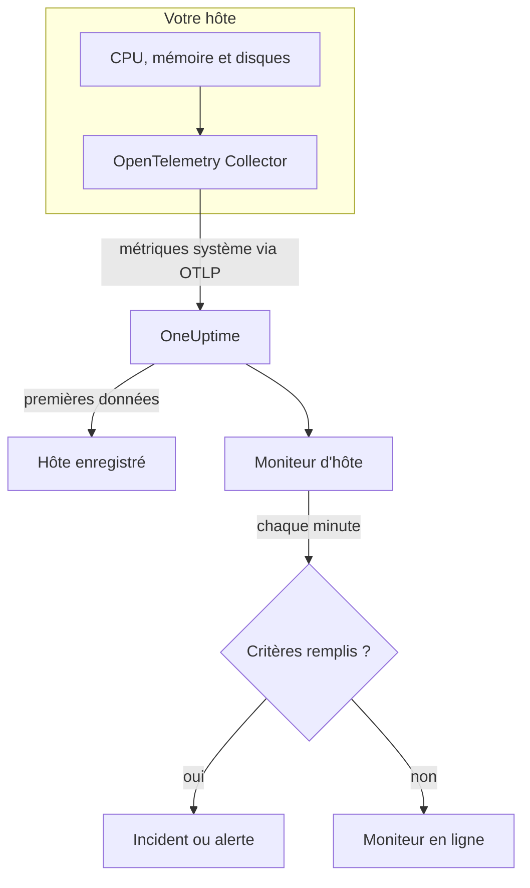

# Surveillance des hôtes

Un moniteur d'hôte surveille une machine – son CPU, sa mémoire, ses disques, sa charge et ses processus – et vous prévient quand elle est saturée ou se remplit. Il lit les métriques OpenTelemetry `system.*` qu'un OpenTelemetry Collector envoie depuis l'hôte, les mêmes données que montre le produit **Hôtes**, si bien que rien n'est sondé depuis l'extérieur.

:::cards
- [Créer le moniteur](#créer-un-moniteur-dhôte): Six étapes dans le tableau de bord.
- [Modèles](#modèles-dalerte-prêts-à-lemploi): Cinq alertes prêtes à l'emploi pour le CPU, la mémoire, le disque, la charge et les processus.
- [Métriques](#métriques-collectées): Les métriques d'hôte sur lesquelles vous pouvez alerter, et leurs unités.
- [Hôte ou Serveur / VM ?](#moniteur-dhôte-ou-moniteur-serveur-vm): Lequel des deux moniteurs de machines utiliser.
:::

## Fonctionnement

Un OpenTelemetry Collector s'exécute sur l'hôte avec le récepteur `hostmetrics`. Toutes les 30 secondes, il lit les chiffres de CPU, de mémoire, de disque, de réseau, de charge et de processus de l'hôte et les envoie à OneUptime via OTLP. Les premières données d'un hôte l'enregistrent sous **Hôtes**.

Un moniteur d'hôte est lié à un hôte. Chaque minute, il exécute sa requête sur les métriques de cet hôte et compare le résultat à ses critères.

### Moniteur d'hôte ou moniteur Serveur / VM ?

OneUptime a deux moniteurs pour les machines. Ils peuvent fonctionner sur le même hôte.

| | Moniteur d'hôte | Moniteur Serveur / VM |
| --- | --- | --- |
| **Agent** | Un OpenTelemetry Collector avec le récepteur `hostmetrics` | L'agent d'infrastructure OneUptime |
| **Données** | Les métriques OpenTelemetry `system.*` et `process.*`, les mêmes que tracent les pages **Hôtes** | Un rapport d'état que l'agent envoie au moniteur |
| **Critères** | Seuils ou détection d'anomalies sur n'importe quelle requête de métrique ou formule | Des vérifications intégrées comme l'utilisation du CPU, de la mémoire et du disque |
| **Configuration** | Installer le collecteur ; l'hôte s'enregistre lui-même | Créer le moniteur, puis donner sa clé secrète à l'agent |

Utilisez le moniteur d'hôte quand l'hôte envoie déjà des données OpenTelemetry, ou quand vous voulez des journaux et des métriques plus riches depuis le même collecteur. Voir [Surveillance de serveur / VM](/docs/monitor/server-monitor) pour l'autre.

## Avant de commencer

- **Exécutez un OpenTelemetry Collector sur l'hôte** avec le récepteur `hostmetrics`. [Collecteur OpenTelemetry sur l'hôte](/docs/telemetry/host-otel-collector) couvre Linux, macOS et Windows, et **Produits → Infrastructure → Hôtes → Documentation** fournit une configuration prête à l'emploi.
- **Activez les métriques d'utilisation.** `system.cpu.utilization`, `system.memory.utilization` et `system.filesystem.utilization` sont facultatives dans le récepteur, et les modèles de CPU, de mémoire et de système de fichiers en ont besoin. La configuration du tableau de bord les active.
- **Vérifiez que l'hôte est enregistré.** Il apparaît sous **Produits → Infrastructure → Hôtes → Tous les hôtes**, nommé d'après son `host.name`, dès l'arrivée de ses premières données.

## Créer un moniteur d'hôte

:::steps
### Commencer un nouveau moniteur

Allez dans **Moniteurs** et cliquez sur **Créer un moniteur**.

### Choisir Hôte

Sous **Type de moniteur**, cliquez sur **Plus de types de moniteurs** et choisissez **Hôte** sous **Infrastructure**. Saisissez un **Nom** – il est utilisé dans les titres des incidents et des alertes – et cliquez sur **Suivant**.

### Choisir l'hôte

Sous **Configuration du moniteur d'hôte**, choisissez la machine dans **Hôte**. Chaque hôte qui a envoyé des données figure dans la liste.

### Choisir ce qu'il faut surveiller

Choisissez l'un des trois onglets :

- **Quick Setup** – cliquez sur un [modèle](#modèles-dalerte-prêts-à-lemploi). Il définit la métrique, l'agrégation, la plage temporelle et les seuils, et remplace les critères plus bas par les siens. Vous pouvez toujours changer la **Plage temporelle**.
- **Custom Metric** – choisissez une métrique dans **Métrique d'hôte**, puis définissez l'**Agrégation** et la **Plage temporelle**.
- **Avancé** – construisez vous-même des requêtes et des formules sous **Sélectionner les métriques**, par exemple un filtre sur `state` ou un regroupement par `mountpoint`.

### Vérifier les critères

Ouvrez chaque critère sous **Critères du moniteur** et vérifiez sa **Métrique**, son **Agrégation**, sa **Condition** et son **Threshold**. Un modèle les remplit. Avec **Custom Metric** ou **Avancé**, le moniteur commence avec les [critères par défaut](#critères-par-défaut), qui ne remarquent qu'une métrique tombant à zéro ; définissez donc votre propre seuil.

### Créer le moniteur

Cliquez sur **Créer un moniteur**. OneUptime ouvre la page du moniteur et l'évalue chaque minute. Les incidents et alertes qu'il déclenche sont aussi listés sur les pages **Incidents** et **Alertes** de l'hôte.
:::

> [!TIP]
> Pour configurer plusieurs modèles à la fois, ouvrez l'hôte depuis **Produits → Infrastructure → Hôtes** et allez dans **Recommendations**. Choisissez les modèles voulus, choisissez qui est alerté, et OneUptime crée un moniteur par modèle.

## Paramètres du moniteur

| Champ | Onglet | Ce qu'il fait |
| --- | --- | --- |
| **Hôte** | Tous | Obligatoire. Limite chaque requête au `resource.host.name` de l'hôte. |
| **Métrique d'hôte** | Custom Metric | Une métrique du [catalogue](#métriques-collectées), regroupée en CPU, mémoire, disque, réseau, charge et processus. |
| **Agrégation** | Custom Metric | Comment les mesures sont combinées : **Moyenne**, **Maximum**, **Minimum**, **Somme** ou **Comptage**. Commence à l'agrégation habituelle de la métrique. |
| **Plage temporelle** | Tous | La fenêtre glissante que lit la requête, de **Past 1 Minute** à **Past 365 Days**. Un nouveau moniteur commence à **Past 1 Minute** ; les modèles définissent la leur. |
| **Sélectionner les métriques** | Avancé | Le constructeur de requêtes : **Métrique**, **Agréger par**, **Filtrer par attributs**, **Regrouper par**, plus **Ajouter une métrique** et **Ajouter une formule** pour combiner des requêtes. |

## Modèles d'alerte prêts à l'emploi

**Quick Setup** propose cinq modèles. Chacun construit un moniteur complet : une requête, un critère qui se déclenche et un autre qui rétablit. Les seuils sont des points de départ que vous pouvez modifier.

Un critère ne se déclenche que si la condition est remplie à chaque minute de sa fenêtre, et il se rétablit 10 % au-delà du seuil pour qu'une valeur qui oscille autour de la limite ne bascule pas sans cesse.

| Modèle | Gravité | Surveille | Se déclenche quand | Se rétablit quand |
| --- | --- | --- | --- | --- |
| High CPU Utilization | Warning | `system.cpu.utilization` pour les états `user` et `system`, additionnés et affichés en pourcentage, 5 dernières minutes | Au-dessus de 80 % | À 72 % ou moins |
| High Memory Utilization | Warning | `system.memory.utilization` pour l'état `used`, en pourcentage, 5 dernières minutes | Au-dessus de 85 % | À 76,5 % ou moins |
| High Filesystem Usage | Critique | `system.filesystem.utilization`, Max par `mountpoint` et `device`, en pourcentage, 5 dernières minutes | Au-dessus de 90 % | À 81 % ou moins |
| High Load Average (1m) | Warning | `system.cpu.load_average.1m`, Avg, 5 dernières minutes | Au-dessus de 4 | À 3,6 ou moins |
| High Process Count | Warning | `system.processes.count`, Max, 5 dernières minutes | Au-dessus de 2000 | À 1800 ou moins |

**Gravité** est le libellé qu'affiche le sélecteur. L'incident et l'alerte qu'un modèle crée commencent avec la gravité d'incident et d'alerte la plus élevée de votre projet ; changez-les dans les critères.

- **CPU** correspond au temps occupé (`user` plus `system`), le même chiffre que trace la **Vue d'ensemble** de l'hôte. L'attente d'E/S et le steal sont exclus.
- **Mémoire** exclut les tampons et le cache de pages, si bien qu'un hôte surtout rempli de cache ne le déclenche pas.
- **Système de fichiers** ouvre un incident par montage. Les pseudo-systèmes de fichiers en lecture seule, comme les montages snap `squashfs` ou `devfs` sous macOS, sont toujours pleins à 100 % ; excluez-les dans le scraper `filesystem` du collecteur.
- **Charge moyenne** est une longueur brute de file d'exécution, non divisée par le nombre de cœurs : 4 est une saturation sur un hôte à 2 cœurs et une routine sur un hôte à 32 cœurs, alors relevez-le sur les grands hôtes.
- **Nombre de processus** compare le plus grand état de processus (`running`, `sleeping`, …), pas le total de l'hôte, il ne correspondra donc pas à une liste de processus. Le scraper de processus ne remonte des données que sous Linux.

## Métriques collectées

La liste **Métrique d'hôte** propose ces métriques. Chacune porte `resource.host.name`, par lequel le moniteur limite ses requêtes à un hôte.

> [!IMPORTANT]
> Les métriques d'utilisation sont un ratio de 0 à 1, pas un pourcentage : utilisez `0.8` pour 80 % dans un seuil sur la métrique brute. Les modèles convertissent en pourcentage avec une formule, si bien que leurs seuils indiquent 80, 85 et 90.

### CPU

| Métrique | Unité | Description |
| --- | --- | --- |
| `system.cpu.utilization` | ratio | Part du temps CPU passée dans chaque `state` (`user`, `system`, `idle`, …). Filtrez sur `state` : une moyenne sur tous les états n'atteint jamais un seuil utile. |
| `process.cpu.utilization` | ratio | Utilisation du CPU de chaque processus de l'hôte. |

### Mémoire

| Métrique | Unité | Description |
| --- | --- | --- |
| `system.memory.utilization` | ratio | Part de la mémoire physique dans chaque `state` (`used`, `free`, `cached`, …). Filtrez sur `state = used` pour la mémoire utilisée. |
| `system.memory.usage` | bytes | Utilisation de la mémoire en octets. |

### Disque

| Métrique | Unité | Description |
| --- | --- | --- |
| `system.filesystem.utilization` | ratio | Part de la capacité de chaque système de fichiers utilisée, par `mountpoint` et `device`. |
| `system.filesystem.usage` | bytes | Utilisation du système de fichiers en octets. |

### Réseau

| Métrique | Unité | Description |
| --- | --- | --- |
| `system.network.io` | bytes | Octets reçus et envoyés. Un compteur sur toute la durée de vie. |

### Charge

| Métrique | Unité | Description |
| --- | --- | --- |
| `system.cpu.load_average.1m` | count | Charge moyenne de la dernière minute. |
| `system.cpu.load_average.5m` | count | Charge moyenne des 5 dernières minutes. |
| `system.cpu.load_average.15m` | count | Charge moyenne des 15 dernières minutes. |

### Processus

| Métrique | Unité | Description |
| --- | --- | --- |
| `system.processes.count` | count | Processus de l'hôte, une série par `status` de processus. |

Le constructeur de requêtes de **Avancé** liste chaque métrique que l'hôte envoie, pas seulement celles-ci.

## Critères de surveillance

Un critère compare l'une des requêtes ou formules du moniteur à un seuil. Les critères d'un moniteur d'hôte n'ont pas de **Type de filtre** : chaque règle vérifie la valeur de la métrique, avec ces champs.

| Champ | Ce qu'il fait |
| --- | --- |
| **Métrique** | La requête ou la formule à vérifier, par son nom de variable. |
| **Agrégation** | Comment les valeurs de la fenêtre deviennent une seule réponse : **Moyenne**, **Somme**, **Maximum Value**, **Minimum Value**, **All Values** (chaque valeur doit correspondre) ou **Any Value** (une seule suffit). |
| **Condition** | **Greater Than**, **Less Than**, **Greater Than Or Equal To**, **Less Than Or Equal To** ou **Equal To** – ou une condition d'anomalie : **Anomalously High**, **Anomalously Low** ou **Anomalous**. |
| **Threshold** | La valeur de comparaison. Une liste d'unités se trouve à côté quand la métrique a une unité. Non affiché pour les conditions d'anomalie. |
| **Sensibilité** | Conditions d'anomalie uniquement. **Faible** (4σ), **Moyen** (3σ, la valeur par défaut) ou **Élevé** (2σ). |
| **Fenêtre de référence** | Conditions d'anomalie uniquement. 14 jours (la valeur par défaut), 28, 60 ou 90 jours d'historique. |
| **En l'absence de données** | Sous **Plus de champs**. Ce qui se passe quand la fenêtre n'a aucune mesure : **Ignore** (par défaut), **Treat As Zero** ou **Déclencheur**. |

Les conditions d'anomalie comparent chaque valeur à la même heure de la semaine dans la référence. Elles restent dans un état « Learning », et ne déclenchent rien, tant que la fenêtre de référence ne contient pas assez d'historique.

Chaque critère indique aussi quoi faire quand il correspond : changer le statut du moniteur, créer une alerte ou déclarer un incident. Les critères sont vérifiés de haut en bas, et le premier qui correspond l'emporte.

### Critères par défaut

Un moniteur que vous ne créez pas à partir d'un modèle commence avec deux critères :

| Ordre | Critère | Correspond quand | Ensuite |
| --- | --- | --- | --- |
| 1 | Check if _monitor name_ is offline | Une valeur quelconque de la première requête vaut `0` | Marque le moniteur **Hors ligne** et déclare l'incident « _monitor name_ is offline », qui se résout de lui-même quand le moniteur se rétablit. |
| 2 | Check if _monitor name_ is online | Une valeur quelconque est au-dessus de `0` | Marque le moniteur **Opérationnel**. |

> [!IMPORTANT]
> Le silence ne correspond à aucun des deux critères : un hôte qui cesse d'envoyer des données laisse le moniteur tel qu'il était. Pour être prévenu quand l'hôte se tait, réglez **En l'absence de données** sur **Déclencheur** dans un critère. Le temps pendant lequel OneUptime lui-même ne recevait pas de données n'est jamais une absence de données : une vérification dont la fenêtre en contient attend à la place, comme l'explique [Quand OneUptime ne reçoit pas de données](/docs/monitor/when-oneuptime-is-not-receiving).

## Dépannage

:::details L'hôte n'est pas dans la liste Hôte
Les hôtes s'enregistrent eux-mêmes à partir des données du collecteur, qui ont besoin d'un `host.name` et du type de système d'exploitation de l'hôte – tous deux fournis par le processeur `resourcedetection` du collecteur. Vérifiez que le collecteur tourne et que l'hôte figure sous **Produits → Infrastructure → Hôtes → Tous les hôtes**. [Collecteur OpenTelemetry sur l'hôte](/docs/telemetry/host-otel-collector) couvre la configuration.
:::

:::details Un seuil de CPU ou de mémoire ne se déclenche jamais
Les métriques d'utilisation sont des ratios qui plafonnent à `1.0`, donc un seuil saisi à la main de `80` n'est jamais franchi : utilisez `0.8`, ou partez d'un modèle, qui convertit en pourcentage. Filtrez aussi sur `state` – `user` et `system` pour le CPU, `used` pour la mémoire. Une moyenne sur tous les états reste autour de 1 divisé par le nombre d'états.
:::

:::details Des incidents se déclenchent pour le mauvais hôte
Le moniteur limite chaque requête au `resource.host.name` égal à l'hôte choisi. Les hôtes qui remontent le même `host.name` fusionnent en une seule série ; donnez donc à chaque hôte un nom unique.
:::

:::details High Filesystem Usage se déclenche pour un montage toujours plein
Les pseudo-systèmes de fichiers en lecture seule, comme les montages en boucle snap `squashfs` sous `/snap` ou `devfs` sous macOS, sont pleins à 100 % par conception et ne se rétablissent jamais. Excluez-les du scraper `filesystem` du collecteur.
:::

## Étapes suivantes

:::cards
- [Collecteur OpenTelemetry sur l'hôte](/docs/telemetry/host-otel-collector): Installer et configurer le collecteur que lit ce moniteur.
- [Surveillance de serveur / VM](/docs/monitor/server-monitor): Le moniteur de machines auquel un agent envoie ses rapports.
- [Surveillance des métriques](/docs/monitor/metrics-monitor): Alerter sur n'importe quelle métrique, à travers les hôtes et les services.
- [Vue d'ensemble des incidents](/docs/incidents/index): Ce qui se passe après qu'un critère a déclaré un incident.
:::
