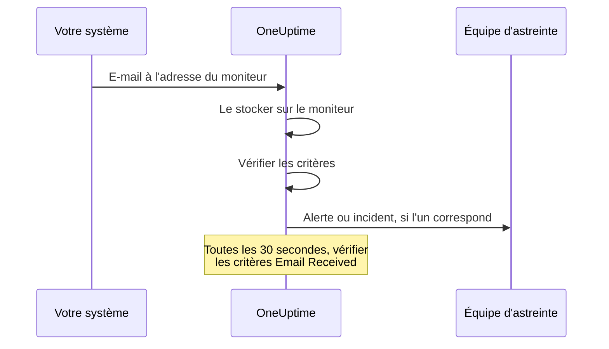

# Surveillance des e-mails entrants

Un moniteur d'e-mails entrants vous donne une adresse e-mail qui appartient à un seul moniteur. Tout ce qui sait envoyer des e-mails — une tâche de sauvegarde, un système ancien, les alertes d'un fournisseur cloud — y envoie ses résultats, et OneUptime vérifie chaque e-mail selon vos critères pour marquer le moniteur en panne, ouvrir un incident ou créer une alerte, et pour les résoudre quand le retour à la normale arrive.

:::cards
- [Créer le moniteur](#créer-un-moniteur-de-mails-entrants): Obtenir une adresse et y diriger votre expéditeur.
- [Vérifier l'adresse](#vérifier-ladresse-auprès-de-lexpéditeur): Lire l'e-mail de confirmation d'un expéditeur sur le moniteur.
- [Écrire des critères](#types-de-filtre-disponibles): Vérifier l'objet, l'expéditeur ou le corps, ou alerter quand les e-mails s'arrêtent.
- [Utiliser l'e-mail dans les alertes](#variables-de-modèle): Mettre l'objet et le corps dans les titres et descriptions.
:::

## Fonctionnement

L'e-mail est un modèle push : votre système envoie, et OneUptime écoute. Chaque e-mail est vérifié selon les critères du moniteur dès son arrivée. Les critères qui recherchent un e-mail qui *aurait dû* arriver sont aussi vérifiés selon un calendrier, toutes les 30 secondes.



1. Quand vous créez un moniteur d'e-mails entrants, OneUptime lui donne une adresse e-mail unique.
2. Chaque e-mail envoyé à cette adresse est stocké sur le moniteur et évalué selon ses critères, depuis le haut ; le premier critère qui correspond décide.
3. Un critère qui correspond peut changer le statut du moniteur, créer une alerte et déclarer un incident. Un incident avec **Résoudre automatiquement l'incident** activé, ou une alerte avec **Résoudre automatiquement l'alerte** activé, est résolu quand un autre critère correspond plus tard — celui qui marque le moniteur en ligne, par exemple.

## Créer un moniteur d'e-mails entrants

:::steps
### Commencer un nouveau moniteur

Allez dans **Moniteurs** et cliquez sur **Créer un moniteur**.

### Choisir Incoming Email

Sous **Type de moniteur**, cliquez sur **Plus de types de moniteurs** et choisissez **Incoming Email** sous **Inbound Monitoring**, ou tapez `email` dans le champ de recherche. Saisissez un **Nom**, puis cliquez sur **Suivant**.

### Passer en revue les critères

L'étape **Critères** commence avec [les critères par défaut](#ce-que-vous-obtenez-demblée), qui marquent le moniteur hors ligne quand un e-mail mentionne `error`. Cliquez sur un critère pour le modifier, ou sur **Ajouter un critère** pour en ajouter un. Voir [Exemples de configuration](#exemples-de-configuration) pour les configurations courantes.

### Créer le moniteur

Cliquez sur **Créer un moniteur**. Le moniteur s'ouvre sur sa page **Vue d'ensemble**, où la carte **Adresse e-mail entrante** affiche l'adresse avec un bouton de copie jusqu'à l'arrivée du premier e-mail.

### Envoyer des e-mails à l'adresse

Configurez votre système pour qu'il envoie ses notifications à l'adresse. Si l'expéditeur vous demande d'abord de confirmer l'adresse, voir [Vérifier l'adresse auprès de l'expéditeur](#vérifier-ladresse-auprès-de-lexpéditeur).
:::

> [!NOTE]
> L'adresse contient la clé secrète du moniteur : seules les personnes qui peuvent modifier les moniteurs peuvent la voir. Les autres voient que les détails de configuration sont masqués.

## Format de l'adresse e-mail

Chaque moniteur d'e-mails entrants reçoit une adresse unique dans ce format :

```text
monitor-{secret-key}@{inbound-domain}
```

La clé secrète est un UUID, par exemple `monitor-3f2b8c1e-5d4a-4f6b-9a7c-2e1d0b9f8a6c@inbound.yourdomain.com`. Après l'arrivée du premier e-mail, l'adresse reste sur la page **Vue d'ensemble** du moniteur dans la carte **Inbound email address**, à côté de l'heure du dernier e-mail. La page **Documentation** du moniteur l'affiche aussi.

## Réinitialiser ou personnaliser l'adresse e-mail

Allez dans l'onglet **Paramètres** du moniteur. La carte **Adresse e-mail entrante** affiche l'adresse actuelle et propose deux façons de la remplacer :

| Action | Ce qu'elle fait | Quand l'utiliser |
| --- | --- | --- |
| **Reset Address** | Donne au moniteur une nouvelle adresse `monitor-{secret-key}@{inbound-domain}` générée aléatoirement. Si le moniteur a une adresse personnalisée, la réinitialisation la supprime. Une confirmation vous est d'abord demandée. | L'adresse a fuité, ou vous voulez couper ce qui y envoie. |
| **Personnaliser l'adresse** | Vous laisse choisir la partie avant le @, par exemple `nightly-backups@{inbound-domain}`. Saisissez-la dans **Nom de l'adresse** — vous pouvez taper le nom ou coller l'adresse entière — et cliquez sur **Save Address**. | Vous voulez une adresse que les gens reconnaissent. |

Les deux actions se terminent en affichant la nouvelle adresse avec un bouton de copie.

> [!WARNING]
> **L'ancienne adresse cesse de fonctionner immédiatement** : les e-mails qui lui sont envoyés sont ignorés, alors mettez à jour chaque système qui envoie des e-mails à ce moniteur.

Règles des adresses personnalisées :

- 3 à 64 caractères : lettres minuscules, chiffres, points (`.`), traits d'union (`-`) et tirets bas (`_`), sans deux points d'affilée. Elle doit commencer et finir par une lettre ou un chiffre. Les majuscules saisies sont converties en minuscules pour vous.
- Le domaine est toujours le domaine de réception d'e-mails du serveur.
- Le nom ne doit pas déjà être utilisé par un autre moniteur. Tous les projets du serveur partagent le domaine de réception : le nom doit donc être unique pour tous.
- Les noms de la forme `monitor-{id}` et `workflow-{id}` sont réservés aux adresses générées. Les noms de boîte qui appartiennent au domaine lui-même sont aussi réservés : `abuse`, `admin`, `administrator`, `hostmaster`, `mailer-daemon`, `noc`, `postmaster`, `root`, `security` et `webmaster`.

Une adresse personnalisée est un identifiant au même titre qu'une adresse générée : quiconque la connaît peut envoyer des e-mails que ce moniteur évalue. Les adresses générées sont pratiquement impossibles à deviner, mais un nom court et évident ne l'est pas. Choisissez quelque chose de difficile à deviner si cela compte pour vous.

Les utilisateurs de l'API peuvent faire de même via l'API Monitor, sur un moniteur existant : définissez `incomingEmailCustomLocalPart` sur le nom pour utiliser une adresse personnalisée, ou sur `null` pour revenir à l'adresse générée. Réinitialiser signifie écrire un nouveau `incomingEmailSecretKey` et définir `incomingEmailCustomLocalPart` sur `null` dans la même mise à jour.

## Vérifier l'adresse auprès de l'expéditeur

Certains services n'envoient pas d'alertes à une nouvelle adresse tant que quelqu'un n'a pas prouvé qu'il peut y lire des e-mails. Ils envoient d'abord un e-mail de vérification, qui arrive sur le moniteur comme n'importe quel autre e-mail. Pour le lire :

:::steps
### Ajouter l'adresse au service

Ajoutez l'adresse du moniteur au service et enregistrez. Le service envoie son e-mail de vérification.

### Ouvrir l'e-mail le plus récent

Dans OneUptime, ouvrez le moniteur. Sur sa page **Vue d'ensemble**, la carte **Résumé du moniteur** affiche l'e-mail le plus récent. Vérifiez que **De** et **Objet** sont ceux de l'e-mail de vérification, puis cliquez sur **Afficher plus de détails**.

### Copier le code ou le lien

Le code ou le lien se trouve dans **Corps de l'e-mail (Texte)**. **Corps de l'e-mail (HTML)** affiche le source HTML : si vous copiez un lien depuis celui-ci, remplacez chaque `&amp;` par `&`.

### Terminer la vérification

Terminez la vérification comme l'e-mail vous l'indique.
:::

Si un autre e-mail est arrivé depuis, la carte n'affiche plus l'e-mail de vérification. Ouvrez **Journaux de surveillance**, trouvez l'e-mail de vérification par son objet dans la colonne **E-mail**, et cliquez sur **Voir le résumé** sur cette ligne.

> [!IMPORTANT]
> **Vos critères le voient aussi.** L'e-mail de vérification est évalué comme n'importe quel autre e-mail. Une formulation comme "if you received this in error" correspond au critère par défaut `error` et marque le moniteur hors ligne. Pour l'éviter, désactivez **Vérifier ce moniteur** dans la carte **Surveillance** de la page **Paramètres** du moniteur pendant la vérification (une confirmation vous est demandée). Un moniteur dont la surveillance est désactivée enregistre quand même l'e-mail, et la carte **Résumé du moniteur** l'affiche toujours. Mais il n'évalue rien, donc l'e-mail n'a pas de ligne dans **Journaux de surveillance** : lisez-le avant l'arrivée d'un autre e-mail. Quand vous avez terminé, cliquez sur **Activer la surveillance** dans le bandeau en haut des pages du moniteur, ou réactivez l'interrupteur.

**La vérification appartient à l'adresse.** Si vous [réinitialisez ou personnalisez l'adresse](#réinitialiser-ou-personnaliser-ladresse-e-mail), le service voit un nouveau destinataire, et vous devez vérifier à nouveau.

### Groupes d'actions Azure Monitor

Depuis juillet 2026, Azure déploie progressivement l'obligation de vérifier chaque nouveau destinataire **Email** d'un groupe d'actions avec un code à usage unique. Tant qu'il ne l'est pas, le groupe d'actions n'envoie à cette adresse ni alertes ni notifications de test.

:::steps
1. Ajoutez au groupe d'actions une notification **Email** avec l'adresse du moniteur, et enregistrez le groupe d'actions. Azure envoie l'e-mail de vérification depuis une adresse Microsoft comme `azure-noreply@microsoft.com`.
2. Lisez-le sur le moniteur comme décrit plus haut, et suivez ses instructions dans les 30 minutes qui suivent l'enregistrement du groupe d'actions. Si le code expire, ouvrez le groupe d'actions et sélectionnez **Resend**.
3. Ouvrez le groupe d'actions et sélectionnez **Test** pour envoyer une notification de test. Elle arrive sur le moniteur comme une vraie alerte, ce qui montre aussi si vos critères correspondent aux e-mails d'Azure.
:::

La vérification couvre tous les groupes d'actions du même locataire Azure : chaque adresse ne doit donc être vérifiée qu'une fois.

### Amazon SNS

Un abonnement e-mail à une rubrique SNS ne reçoit rien tant qu'il n'est pas confirmé. Quand vous créez l'abonnement, Amazon SNS envoie un e-mail de confirmation à l'adresse. Lisez-le sur le moniteur comme décrit plus haut, et ouvrez son lien **Confirm subscription** dans votre navigateur. SNS supprime un abonnement qui n'est pas confirmé dans les 48 heures ; dans ce cas, recréez l'abonnement.

## Ce que vous obtenez d'emblée

Un nouveau moniteur d'e-mails entrants est créé avec deux critères qui lisent le corps de l'e-mail :

| Critère | Type de filtre | Condition de filtre | Valeur | Effet |
| -------- | ----------- | ---------------- | ------- | -------------------------------------------- |
| Hors ligne | Email Body | Contient | `error` | Marque le moniteur hors ligne, ouvre un incident |
| En ligne | Email Body | Not Contains | `error` | Marque le moniteur en ligne |

Cela convient au cas courant où une tâche ou un outil tiers envoie son propre résultat par e-mail : un message dont le corps mentionne `error` met le moniteur hors ligne, et le message suivant sans ce mot le remet en ligne et résout l'incident. La correspondance sur le corps ne tient pas compte de la casse : `Error` et `ERROR` correspondent aussi.

Remplacez la valeur par ce que votre expéditeur écrit réellement (`FAILED`, `exit code 1`, etc.).

> [!NOTE]
> Ces critères par défaut ne sont **pas** un interrupteur de l'homme mort : rien ici ne se déclenche quand les e-mails cessent d'arriver. Les critères qui ne lisent que l'objet, l'expéditeur, le corps ou le destinataire sont évalués à l'arrivée d'un e-mail et jamais à un autre moment. Pour être alerté en cas de silence, ajoutez un critère **Email Received** / **Not Recieved In Minutes** — voir l'[Exemple 3](#exemple-3-moniteur-heartbeat-pas-de-mail-alerte).

## Types de filtre disponibles

Vous pouvez créer des critères à partir de ces champs de l'e-mail :

| Type de filtre | Description |
| ------------------------- | ----------------------------------------------------------------------------------- |
| **Objet de l'e-mail** | La ligne d'objet de l'e-mail entrant |
| **Email From Address** | L'adresse de l'expéditeur : l'adresse seule, en minuscules, sans nom d'affichage |
| **Email Body** | La partie texte brut du corps de l'e-mail |
| **Email To Address** | L'adresse e-mail du destinataire |
| **Email Received** | Critères temporels sur la réception des e-mails |
| **JavaScript Expression** | Une expression JavaScript personnalisée qui doit valoir vrai |

L'adresse du moniteur lui-même est masquée avant qu'un critère ne lise l'e-mail : dans **Email To Address**, **Objet de l'e-mail** et **Email Body**, elle apparaît donc comme `[REDACTED]`.

## Conditions de filtre

### Filtres de chaîne (objet, expéditeur, corps, destinataire)

| Condition de filtre | Description | Exemple |
| ---------------- | ----------------------------------------- | ---------------------------------- |
| **Contient** | Le champ contient le texte indiqué | L'objet contient "CRITICAL" |
| **Not Contains** | Le champ ne contient pas le texte indiqué | L'objet ne contient pas "TEST" |
| **Equal To** | Le champ correspond exactement au texte indiqué | L'expéditeur est égal à "alerts@service.com" |
| **Not Equal To** | Le champ ne correspond pas au texte indiqué | L'objet est différent de "OK" |
| **Starts With** | Le champ commence par le texte indiqué | L'objet commence par "[ALERT]" |
| **Ends With** | Le champ se termine par le texte indiqué | L'objet se termine par "- Production" |
| **Is Empty** | Le champ est vide | Le corps est vide |
| **Is Not Empty** | Le champ a un contenu | L'objet n'est pas vide |

Toutes ces comparaisons ignorent la casse. Un filtre dont la valeur est vide ne correspond jamais.

### Filtres temporels (Email Received)

Le tableau de bord écrit ces conditions "Recieved".

| Condition de filtre | Description | Exemple |
| --------------------------- | ----------------------------------- | -------------------------------- |
| **Recieved In Minutes** | Un e-mail a été reçu dans les X minutes | E-mail reçu dans les 30 minutes |
| **Not Recieved In Minutes** | Aucun e-mail reçu en X minutes | Aucun e-mail reçu en 60 minutes |

Un moniteur qui n'a jamais reçu d'e-mail compte son heure de création comme le dernier e-mail.

### JavaScript Expression

| Condition de filtre | Description |
| --------------------- | ------------------------------------- |
| **Evaluates To True** | L'expression renvoie une valeur vraie |

L'expression s'exécute dans un bac à sable auquel aucun champ de l'e-mail n'est lié : elle ne peut donc lire ni l'objet, ni l'expéditeur, ni le corps, ni le destinataire du message qui a déclenché la vérification. Utilisez les types de filtre **Objet de l'e-mail**, **Email From Address**, **Email Body** et **Email To Address** pour vérifier le contenu de l'e-mail.

## Exemples de configuration

Chaque exemple est une paire de critères. Un critère a des filtres, une **Condition de correspondance** (**Tous** ou **Tout** de ses filtres) et des actions : changer le statut du moniteur, créer une alerte, déclarer un incident. Activez **Résoudre automatiquement l'alerte** (ou **Résoudre automatiquement l'incident**) sous **Plus de champs** dans l'alerte ou l'incident, pour que le second critère résolve ce que le premier a ouvert.

### Exemple 1 : créer une alerte sur les e-mails critiques

| Critère | Filtres | Condition de correspondance | Actions |
| --- | --- | --- | --- |
| E-mail critique | **Objet de l'e-mail** Contient `CRITICAL` ; **Objet de l'e-mail** Contient `ALERT` ; **Objet de l'e-mail** Contient `ERROR` | **Tout** | Passer le statut à hors ligne ; créer une alerte |
| E-mail de rétablissement | **Objet de l'e-mail** Contient `RESOLVED` ; **Objet de l'e-mail** Contient `RECOVERED` | **Tout** | Passer le statut à en ligne |

Placez le critère critique en premier : les critères sont vérifiés depuis le haut, et le premier qui correspond décide.

### Exemple 2 : surveiller un expéditeur précis

| Critère | Filtres | Condition de correspondance | Actions |
| --- | --- | --- | --- |
| Tâche échouée | **Email From Address** Equal To `monitoring@legacy-system.com` ; **Objet de l'e-mail** Contient `Failed` | **Tous** | Passer le statut à hors ligne ; déclarer un incident |
| Tâche réussie | **Email From Address** Equal To `monitoring@legacy-system.com` ; **Objet de l'e-mail** Contient `Success` | **Tous** | Passer le statut à en ligne |

### Exemple 3 : moniteur heartbeat (pas d'e-mail = alerte)

| Critère | Filtres | Actions |
| --- | --- | --- |
| E-mail en retard | **Email Received** Not Recieved In Minutes `60` | Passer le statut à hors ligne ; créer une alerte |
| E-mail arrivé | **Email Received** Recieved In Minutes `60` | Passer le statut à en ligne |

Le premier critère se déclenche quand aucun e-mail n'est arrivé depuis 60 minutes — utile pour les tâches planifiées ou les traitements par lots qui envoient un e-mail de fin. Le second résout l'alerte dès qu'un e-mail arrive. Les minutes pendant lesquelles OneUptime lui-même ne recevait pas d'e-mails ne comptent pas dans les 60, comme l'explique [Quand OneUptime ne reçoit pas de données](/docs/monitor/when-oneuptime-is-not-receiving).

## Cas d'usage

| Cas d'usage | Ce que fait le moniteur |
| --- | --- |
| Intégration de systèmes anciens | Transforme les alertes par e-mail uniquement des anciens systèmes en incidents OneUptime, et les résout à l'arrivée de l'e-mail de rétablissement. |
| Services tiers | Reçoit les notifications des fournisseurs cloud (AWS, GCP, Azure), des scanners de sécurité, des outils de sauvegarde et les avertissements d'expiration de certificats. |
| Tâches planifiées | Alerte quand un e-mail de fin est en retard, ou quand une tâche signale un échec par e-mail. |
| Agrégation d'alertes | Rassemble les alertes par e-mail de Nagios, Zabbix ou d'autres outils, pour que OneUptime soit l'unique endroit où vous les gérez. |

## Variables de modèle

Les titres, descriptions et notes de remédiation des alertes et incidents que crée ce moniteur peuvent utiliser ces variables. Les formulaires d'alerte et d'incident du critère les listent sous **Variables de modèle**, et [Modèles d'incident et d'alerte](/docs/monitor/incident-alert-templating) en explique la syntaxe.

| Variable | Description |
| --------------------- | ----------------------------------------------------------------- |
| `{{emailSubject}}`    | L'objet de l'e-mail reçu |
| `{{emailFrom}}`       | L'adresse e-mail de l'expéditeur |
| `{{emailTo}}`         | À qui l'e-mail a été envoyé, avec l'adresse de ce moniteur masquée |
| `{{emailBody}}`       | Le corps en texte brut de l'e-mail |
| `{{emailReceivedAt}}` | L'heure de réception de l'e-mail, sous forme d'horodatage ISO 8601 en UTC |

- **Un titre reçoit une ligne de chacune.** Dans un titre, chaque variable est coupée à une ligne d'au plus 150 caractères, et se termine par `...` quand elle était plus longue. Un titre ne peut pas dépasser 500 caractères, et une alerte ou un incident dont le titre est trop long n'est pas créé du tout : citer un e-mail entier empêcherait donc le moniteur d'alerter sur les e-mails longs. Les descriptions et notes de remédiation reçoivent la valeur complète.
- **L'adresse de ce moniteur est masquée.** L'adresse fonctionne comme un mot de passe : elle est donc masquée avant que l'e-mail ne soit stocké, et `{{emailTo}}` vaut `monitor-[REDACTED]@{inbound-domain}` (ou `[REDACTED]@{inbound-domain}` pour une adresse personnalisée).
- **Une vérification d'e-mail manquant utilise le dernier e-mail.** Quand un critère **Email Received** ouvre une alerte parce qu'aucun e-mail n'est arrivé à temps, les variables décrivent le dernier e-mail reçu par le moniteur. Elles sont vides si aucun n'est encore arrivé.

## Vue Résumé du moniteur

Une fois que le moniteur a reçu un e-mail, la carte **Résumé du moniteur** de sa page **Vue d'ensemble** affiche le plus récent :

- **Dernier e-mail reçu le** : quand l'e-mail le plus récent a été reçu
- **De** : l'expéditeur du dernier e-mail
- **Objet** : la ligne d'objet du dernier e-mail

Cliquez sur **Afficher plus de détails** pour voir le reste :

- **En-têtes de l'e-mail** : les en-têtes complets du dernier e-mail
- **Corps de l'e-mail (Texte)** : le corps en texte brut
- **Corps de l'e-mail (HTML)** : le corps HTML, affiché sous forme de source HTML plutôt que rendu

### E-mails précédents

La carte n'affiche que l'e-mail le plus récent. Chaque e-mail que le moniteur évalue est aussi écrit dans **Journaux de surveillance** : la colonne **E-mail** affiche son objet et son expéditeur, et **Voir le résumé** sur sa ligne affiche l'e-mail entier comme le fait la carte. Un moniteur dont la surveillance est désactivée n'évalue rien : les e-mails qu'il reçoit n'ont donc pas de ligne. Si l'un de vos critères vérifie **Email Received**, le moniteur écrit aussi une ligne à chaque vérification d'e-mail manquant. La colonne **E-mail** indique "Scheduled check" sur ces lignes, et leur **Voir le résumé** affiche l'e-mail le plus récent au moment de la vérification, ou "No email yet" si aucun n'était arrivé. Les journaux de surveillance sont conservés un jour par défaut. Sur un serveur auto-hébergé, un administrateur peut changer cela avec **Rétention des journaux du moniteur (jours)** dans les paramètres du tableau de bord d'administration.

## Configuration auto-hébergée

Si vous auto-hébergez OneUptime, vous devez configurer un fournisseur d'e-mails entrants. Actuellement pris en charge :

- **SendGrid Inbound Parse** - Voir [E-mail entrant SendGrid](/docs/self-hosted/sendgrid-inbound-email) pour les instructions de configuration

Tant qu'il n'est pas configuré, la carte d'adresse du moniteur indique que la réception d'e-mails n'est pas configurée.

## Points à considérer

- **Sécurité de l'adresse e-mail** : l'adresse e-mail du moniteur fonctionne comme un mot de passe : quiconque la connaît peut envoyer des e-mails au moniteur. Ne la partagez pas publiquement, et réinitialisez-la depuis l'onglet **Paramètres** du moniteur si elle fuit.
- **Taille des e-mails** : OneUptime accepte un e-mail entrant jusqu'à 50 Mo, pièces jointes comprises. Les pièces jointes ne sont pas stockées — seulement leurs noms, types et tailles.
- **Délai de traitement** : les e-mails sont traités de façon asynchrone. Quelques secondes peuvent séparer l'envoi d'un e-mail et la création de l'alerte.
- **Insensibilité à la casse** : toutes les comparaisons de chaînes (Contient, Equal To, etc.) ignorent la casse.
- **Texte brut** : les critères sur le corps lisent la partie texte brut de l'e-mail. Un e-mail envoyé uniquement en HTML a un corps vide pour les critères — il ne contient donc pas `error`, et les critères par défaut marquent le moniteur en ligne.

## Dépannage

### Les e-mails ne sont pas reçus

1. Vérifiez que l'adresse e-mail est correcte (attention aux fautes de frappe).
2. Vérifiez si l'expéditeur attend que vous confirmiez l'adresse. Les groupes d'actions Azure Monitor et Amazon SNS n'envoient rien à une nouvelle adresse tant qu'elle n'est pas vérifiée. Voir [Vérifier l'adresse auprès de l'expéditeur](#vérifier-ladresse-auprès-de-lexpéditeur).
3. Vérifiez si l'e-mail est bloqué par des filtres anti-spam.
4. Vérifiez que votre fournisseur d'e-mails entrants est correctement configuré.
5. Consultez les journaux de OneUptime à la recherche de messages d'erreur.

### Les alertes ne sont pas créées

1. Vérifiez que vos critères correspondent au contenu de l'e-mail. Rappelez-vous que l'adresse du moniteur lui-même apparaît comme `[REDACTED]`, et qu'un e-mail uniquement HTML a un corps vide.
2. Vérifiez que la surveillance est activée : page **Paramètres** du moniteur, carte **Surveillance**.
3. Ouvrez **Journaux de surveillance** et cliquez sur **Voir le résumé** sur la ligne de l'e-mail pour voir ce que les critères ont lu.
4. Vérifiez l'ordre de vos critères : le premier qui correspond décide.

### Les alertes ne sont pas résolues

1. Vérifiez que vos critères de résolution correspondent à l'e-mail de rétablissement.
2. Vérifiez que **Résoudre automatiquement l'alerte** (ou **Résoudre automatiquement l'incident**) est activé dans le critère qui l'a ouverte.
3. Vérifiez que l'e-mail de résolution est envoyé à la même adresse de moniteur.

## Prochaines étapes

:::cards
- [Modèles d'incident et d'alerte](/docs/monitor/incident-alert-templating): Mettre l'objet et le corps de l'e-mail dans les alertes.
- [Surveillance des requêtes entrantes](/docs/monitor/incoming-request-monitor): Recevoir plutôt heartbeats et webhooks par HTTP.
- [E-mail entrant SendGrid](/docs/self-hosted/sendgrid-inbound-email): Configurer la réception d'e-mails sur un serveur auto-hébergé.
:::
