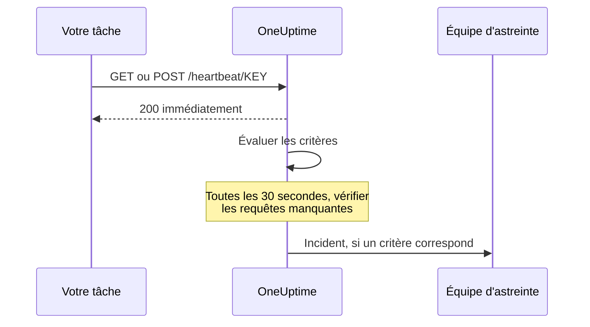

# Surveillance des requêtes entrantes

Un moniteur de requêtes entrantes vous donne une URL à laquelle d'autres systèmes envoient des requêtes HTTP. OneUptime évalue chaque requête selon vos critères, et peut changer le statut du moniteur, déclarer des incidents et appeler votre équipe d'astreinte.

Il couvre deux usages différents :

- **Surveillance par heartbeat** — une tâche cron, un worker ou un appareil appelle l'URL selon un calendrier, et OneUptime ouvre un incident quand les appels cessent d'arriver.
- **Recevoir les alertes d'un autre système** — Prometheus Alertmanager, Grafana ou tout ce qui sait envoyer du JSON en POST y pousse ses alertes, et OneUptime transforme chacune en incident avec escalade d'astreinte et résolution automatique au rétablissement.

Les deux utilisent le même type de moniteur. Ce qui les distingue, ce sont les critères que vous configurez.

:::cards
- [Créer le moniteur](#créer-un-moniteur-de-requêtes-entrantes): Obtenir une URL de heartbeat en quelques étapes.
- [Envoyer un heartbeat](#envoyer-un-heartbeat): Depuis curl, cron, Node.js, Python ou Go.
- [Alerter quand les appels cessent](#marquer-hors-ligne-sil-ny-a-pas-de-heartbeat-en-10-minutes-un-interrupteur-de-lhomme-mort): Faire du moniteur un interrupteur de l'homme mort.
- [Recevoir des alertes](#recevoir-les-alertes-dun-autre-système): Un incident par alerte Alertmanager ou Grafana.
:::

## Fonctionnement

Rien ne vérifie votre système depuis l'extérieur : votre système appelle l'URL du moniteur, OneUptime répond immédiatement, puis évalue la requête selon les critères du moniteur. Un critère qui vérifie les requêtes qui ont *cessé* d'arriver est aussi réévalué en arrière-plan toutes les 30 secondes, pour que le silence puisse lui aussi ouvrir un incident.



Utilisez-le pour :

- Surveiller les tâches cron et les tâches planifiées
- Vérifier que les workers d'arrière-plan tournent
- Surveiller des services derrière des pare-feu, injoignables depuis l'extérieur
- Recevoir les alertes de Prometheus Alertmanager, Grafana et d'autres systèmes d'alerte
- Suivre les signaux de heartbeat de tout système capable de parler HTTP

## Créer un moniteur de requêtes entrantes

:::steps
### Commencer un nouveau moniteur

Allez dans **Moniteurs** et cliquez sur **Créer un moniteur**.

### Choisir Requête entrante

Sous **Type de moniteur**, choisissez **Requête entrante** — c'est l'un des types courants affichés en haut. Saisissez un **Nom**, puis cliquez sur **Suivant**.

### Passer en revue les critères

L'étape **Critères** commence avec [les critères par défaut](#ce-que-vous-obtenez-demblée). Pour un heartbeat, cliquez sur **Ajouter un critère** et donnez au nouveau critère un filtre **Requête entrante** / **Not Recieved In Minutes** qui passe le statut à hors ligne et déclare un incident, avec **Résoudre automatiquement l'incident** activé. Faites-le ensuite glisser en haut de la liste — voir [Exemples de critères](#exemples-de-critères) pour savoir pourquoi.

### Créer le moniteur

Cliquez sur **Créer un moniteur**. Le moniteur s'ouvre sur sa page **Vue d'ensemble**, où la carte **Send the first heartbeat** affiche l'**URL de heartbeat** avec un bouton de copie et un exemple de commande `curl`.

### Envoyer la première requête

Configurez votre service pour qu'il envoie des requêtes à cette URL (voir [Envoyer un heartbeat](#envoyer-un-heartbeat)). Quand la première requête arrive, la carte laisse la place à l'historique du moniteur, et une carte **URL de heartbeat** affiche l'URL et l'heure de la dernière requête.
:::

> [!NOTE]
> L'URL contient la clé secrète du moniteur : seules les personnes qui peuvent modifier les moniteurs peuvent la voir. Vous la retrouvez à tout moment sur la page **Documentation** du moniteur, dans la section **Configuration** de son menu latéral.

## L'URL de requête

Votre moniteur a une URL unique dans ce format :

```text
https://oneuptime.com/heartbeat/YOUR_SECRET_KEY
```

Remplacez `https://oneuptime.com` par l'URL de votre instance OneUptime si vous l'auto-hébergez.

Envoyez des requêtes **GET** ou **POST** à cette URL. HEAD est accepté et traité comme GET ; PUT, PATCH et DELETE renvoient 404. La clé secrète dans le chemin est le seul identifiant — aucun en-tête ni jeton n'est nécessaire. Les chaînes de requête sont ignorées : envoyez ce que les critères doivent lire dans le corps ou les en-têtes.

> [!WARNING]
> Quiconque connaît cette URL peut marquer le moniteur comme sain : traitez-la donc comme un secret. Si elle fuit, ouvrez la page **Paramètres** du moniteur et cliquez sur **Réinitialiser la clé secrète des requêtes entrantes**, puis mettez à jour chaque expéditeur. Chaque en-tête que vous envoyez est stocké sur le moniteur et visible par toute personne qui peut le lire — n'envoyez pas de clés d'API ni de jetons dans les en-têtes vers ce point de terminaison.

> [!IMPORTANT]
> OneUptime répond immédiatement `200` avec un objet JSON vide (`{}`) et traite la requête dans une file d'attente. Cette réponse est écrite avant toute validation : un `200` n'est donc **pas** la confirmation que la requête a été acceptée — une clé secrète erronée, un moniteur supprimé et un moniteur désactivé renvoient aussi `200`. Vérifiez la chronologie du moniteur pour confirmer que les requêtes arrivent.

### Envoyer un corps de requête

Si vous voulez atteindre des champs du corps — `{{requestBody.status}}` dans un titre d'incident, un chemin JSON dans le regroupement d'incidents, ou un critère d'expression JavaScript —, envoyez `Content-Type: application/json`. C'est le format que cette documentation suppose partout. Le corps doit être un objet ou un tableau JSON : un JSON mal formé, ou une valeur nue comme `"error"`, est refusé avec un `500`.

| Type de contenu | Ce que voient critères et modèles |
| --- | --- |
| `application/json` | Le JSON analysé. |
| `application/x-www-form-urlencoded` | Le formulaire analysé. Les clés entre crochets s'imbriquent (`alerts[0][status]=firing`), et chaque valeur est une chaîne. |
| Tout autre, ou aucun | Un corps vide (`{}`) : chaque référence à `requestBody` ne donne donc rien. |

Les corps jusqu'à 50 Mo sont acceptés ; un corps plus grand est refusé avec un `413`. Ne compressez pas le corps avec `Content-Encoding: gzip` : il ne serait pas stocké comme JSON, et les chemins vers son contenu ne se résoudraient pas.

### Envoyer un heartbeat

Chaque exemple envoie une requête. Remplacez `YOUR_SECRET_KEY` par la clé de l'URL de votre moniteur.

:::tabs
@tab curl
```bash
# Simple GET request
curl https://oneuptime.com/heartbeat/YOUR_SECRET_KEY

# POST request with a JSON body
curl -X POST https://oneuptime.com/heartbeat/YOUR_SECRET_KEY \
  -H "Content-Type: application/json" \
  -d '{"status": "healthy", "version": "1.2.3"}'
```
@tab Cron
```bash
# Send a heartbeat every 5 minutes
*/5 * * * * curl -fsS https://oneuptime.com/heartbeat/YOUR_SECRET_KEY > /dev/null

# Or ping only when the job succeeds, so a failed run counts as a missed heartbeat
0 2 * * * /usr/local/bin/backup.sh && curl -fsS https://oneuptime.com/heartbeat/YOUR_SECRET_KEY > /dev/null
```
@tab Node.js
```javascript title="heartbeat.mjs"
// Node.js 18 or later: fetch is built in. Run with `node heartbeat.mjs`.
const response = await fetch(
  "https://oneuptime.com/heartbeat/YOUR_SECRET_KEY",
  {
    method: "POST",
    headers: { "Content-Type": "application/json" },
    body: JSON.stringify({ status: "healthy", version: "1.2.3" }),
  },
);

console.log(response.status); // 200
```
@tab Python
```python title="heartbeat.py"
# Python 3, standard library only. Run with `python3 heartbeat.py`.
import json
import urllib.request

request = urllib.request.Request(
    "https://oneuptime.com/heartbeat/YOUR_SECRET_KEY",
    data=json.dumps({"status": "healthy", "version": "1.2.3"}).encode(),
    headers={"Content-Type": "application/json"},
    method="POST",
)

with urllib.request.urlopen(request, timeout=10) as response:
    print(response.status)  # 200
```
@tab Go
```go title="heartbeat.go"
// Run with `go run heartbeat.go`.
package main

import (
	"bytes"
	"fmt"
	"net/http"
)

func main() {
	body := []byte(`{"status": "healthy", "version": "1.2.3"}`)

	resp, err := http.Post(
		"https://oneuptime.com/heartbeat/YOUR_SECRET_KEY",
		"application/json",
		bytes.NewReader(body),
	)
	if err != nil {
		panic(err)
	}
	defer resp.Body.Close()

	fmt.Println(resp.StatusCode) // 200
}
```
@tab PowerShell
```powershell
# Windows PowerShell 5.1 or PowerShell 7
Invoke-RestMethod -Method Post `
  -Uri "https://oneuptime.com/heartbeat/YOUR_SECRET_KEY" `
  -ContentType "application/json" `
  -Body '{"status": "healthy", "version": "1.2.3"}'
```
:::

## Critères de surveillance

Vous pouvez configurer des critères pour déterminer quand votre service est considéré comme en ligne, dégradé ou hors ligne. Chaque filtre de critère a un **Type de filtre** (ce qui est examiné), une **Condition de filtre** (comment comparer) et une **Valeur**.

### Ce que vous obtenez d'emblée

Un nouveau moniteur de requêtes entrantes est créé avec deux critères qui lisent le corps de la requête :

| Critère | Type de filtre | Condition de filtre | Valeur | Effet |
| -------- | ------------ | ---------------- | ------- | -------------------------------------------- |
| Hors ligne | Corps de la requête | Contient | `error` | Marque le moniteur hors ligne, ouvre un incident |
| En ligne | Corps de la requête | Not Contains | `error` | Marque le moniteur en ligne |

Cela convient au cas courant où l'expéditeur rapporte sa propre santé dans la charge utile : une requête dont le corps mentionne `error` met le moniteur hors ligne, et la requête suivante sans ce mot le remet en ligne et résout l'incident. Une requête sans corps du tout compte comme « ne contient pas `error` » : un simple appel de heartbeat garde donc le moniteur en ligne.

Remplacez la valeur par ce que votre expéditeur émet réellement (`"status":"firing"`, `FAILED`, etc.) — la correspondance est une recherche de sous-chaîne sensible à la casse sur tout le corps, clés comprises : `{"error":null}` correspond donc aussi à `error`.

> [!NOTE]
> Ces critères par défaut ne sont **pas** un interrupteur de l'homme mort : rien ici ne se déclenche quand les requêtes cessent d'arriver. Pour être alerté en cas de silence, ajoutez un critère **Requête entrante** / **Not Recieved In Minutes** comme décrit plus bas.

### Types de filtre disponibles

| Type de filtre | Vérifie | Remarques |
| --------------------- | ------------------------------------------------------ | -------------------------------------------------------------------------------------------- |
| Requête entrante | Si une requête a été reçue dans une fenêtre de temps | La seule vérification qui peut se déclencher quand rien n'arrive |
| Corps de la requête | Le corps de la requête | Correspondance de sous-chaîne. Les corps objets sont comparés en JSON compact |
| Request Header | Les noms des en-têtes de la requête | Correspondance exacte avec un nom d'en-tête entier, sans tenir compte de la casse |
| Request Header Value | Les valeurs des en-têtes de la requête | Correspondance exacte avec une valeur d'en-tête entière, sans tenir compte de la casse |
| JavaScript Expression | Toute expression sur `requestBody` et `requestHeaders` | L'option la plus souple — voir [Expressions JavaScript](/docs/monitor/javascript-expression) |

### Conditions de filtre

Chaque type de filtre propose ses propres conditions :

| Type de filtre | Conditions |
| --- | --- |
| **Requête entrante** | **Recieved In Minutes** — une requête a été reçue dans le nombre de minutes indiqué. **Not Recieved In Minutes** — aucune requête n'a été reçue dans le nombre de minutes indiqué. (Le tableau de bord les écrit ainsi.) |
| **Corps de la requête**, **Request Header**, **Request Header Value** | **Contient** et **Not Contains** |
| **JavaScript Expression** | **Evaluates To True** |

> [!NOTE]
> Les noms et valeurs d'en-tête sont comparés en minuscules, au nom ou à la valeur entière, pas à une sous-chaîne : `application/json` ne correspond pas à `application/json; charset=utf-8`. Seul **Corps de la requête** fait une recherche de sous-chaîne. Les en-têtes qu'ajoutent votre proxy ou l'équilibreur de charge de OneUptime (`x-forwarded-for`, `x-real-ip`) sont stockés aussi.

Les corps objets sont comparés en JSON compact, sans espaces : un filtre **Corps de la requête** / **Contient** doit donc s'écrire `"status":"firing"` — copier `"status": "firing"` depuis une charge utile mise en forme ne correspondra jamais.

### Exemples de critères

#### Marquer hors ligne s'il n'y a pas de heartbeat en 10 minutes (un interrupteur de l'homme mort)

| Champ | Valeur |
| --- | --- |
| **Type de filtre** | Requête entrante |
| **Condition de filtre** | Not Recieved In Minutes |
| **Valeur** | `10` |

#### Marquer dégradé selon le contenu du corps de la requête

| Champ | Valeur |
| --- | --- |
| **Type de filtre** | Corps de la requête |
| **Condition de filtre** | Contient |
| **Valeur** | `"status":"degraded"` |

> [!IMPORTANT]
> Placez l'interrupteur de l'homme mort **au-dessus** des critères par défaut. Les critères sont vérifiés depuis le haut, et le premier qui correspond décide. La vérification en arrière-plan relit la dernière requête : le critère en ligne par défaut — "Request Body Not Contains `error`" — continue donc d'y correspondre, et un critère placé en dessous n'a jamais son tour. **Ajouter un critère** ajoute un critère en bas : faites-le remonter.

> [!WARNING]
> Un moniteur n'est réévalué en arrière-plan que si au moins un de ses critères vérifie **Requête entrante**. Un moniteur dont les critères ne vérifient que le corps de la requête, Request Header ou une expression JavaScript est évalué à l'arrivée d'une requête et jamais à un autre moment — il ne peut donc jamais passer hors ligne de lui-même. Si vous voulez une alarme sur heartbeat manquant, il vous faut un critère **Requête entrante**.

La vérification en arrière-plan compte des minutes entières et se déclenche une fois que *plus* que la valeur s'est écoulée : "Not Recieved In Minutes: 10" se déclenche environ 11 minutes après la dernière requête (la vérification tourne toutes les 30 secondes). Un moniteur qui n'a jamais reçu de requête est traité comme si son heure de création était la dernière requête : le même critère sur un moniteur tout neuf se déclenche donc environ 11 minutes après sa création, même si l'expéditeur n'a jamais été branché. Seules comptent les minutes où OneUptime recevait : les minutes pendant lesquelles OneUptime lui-même redémarre, est mis à jour ou rattrape son retard ne comptent pas, comme l'explique [Quand OneUptime ne reçoit pas de données](/docs/monitor/when-oneuptime-is-not-receiving).

## Recevoir les alertes d'un autre système

Alertmanager, Grafana et les outils similaires envoient en POST un document JSON décrivant une ou plusieurs alertes. Par défaut, un critère ouvre **un** incident : une charge utile portant cinq alertes produirait un seul incident. Le regroupement d'incidents change cela : il extrait une valeur de la charge utile et ouvre un **incident distinct par valeur différente**, tous pouvant être ouverts en même temps.

```mermaid title="Regroupement d'incidents : un incident par alerte de la charge utile"
flowchart TB
    payload["Charge utile du webhook"] --> keys["Une clé par alerte"]
    keys --> state{"Alerte résolue ?"}
    state -->|Non| open["Ouvrir ou garder son incident"]
    state -->|Oui| resolve["Résoudre son incident"]
```

### Activer le regroupement d'incidents

:::steps
1. Ouvrez le critère et dépliez **Paramètres**.
2. Activez **Regrouper les incidents et alertes par un champ de la charge utile**.
3. Renseignez **Ouvrir un incident distinct pour chaque…**. Pour que chaque incident se résolve de lui-même, renseignez aussi le champ et la valeur sous **Auto-resolve each incident when…** (ci-dessous). Enregistrez ensuite le moniteur.
:::

| Champ | Exemple | Ce qu'il fait |
| ---------------------------------- | ---------------------------------------- | ---------------------------------------------------------------------- |
| Ouvrir un incident distinct pour chaque… | `requestBody.alerts[*].labels.alertname` | Le chemin dont les valeurs différentes séparent les incidents |
| Champ qui signale le rétablissement | `requestBody.alerts[*].status` | Le chemin vérifié pour décider qu'une alerte s'est rétablie |
| Value that means recovered | `resolved` | La valeur exacte qui marque le rétablissement |
| Incidents max par requête | `100` (par défaut) | Plafond de sécurité, pour qu'un champ à forte cardinalité ne puisse pas ouvrir des incidents sans limite |

### Syntaxe des chemins

Les chemins doivent commencer par le préfixe littéral `requestBody.`. Un chemin sans lui — `alerts[*].labels.alertname` — ne correspond à rien, sans le signaler. L'enveloppe `{{ }}` est facultative : `requestBody.status` et `{{requestBody.status}}` se comportent de la même façon.

- `[*]` se déploie sur un tableau — un incident par valeur **différente**. Deux éléments qui donnent la même valeur fusionnent en un seul incident, dont l'état (déclenché/résolu) est pris sur le **premier** élément correspondant. **Seul le premier `[*]` d'un chemin est un joker** ; `requestBody.groups[*].alerts[*].name` ne correspond à rien.
- `[0]` et `[last]` sélectionnent un seul élément, et peuvent suivre un `[*]`.
- Les valeurs objet et tableau, les chaînes vides et les valeurs nulles sont ignorées. `0` et `false` sont des clés valides.
- Le corps doit être un objet JSON ; une charge utile dont le niveau supérieur est un tableau n'est pas regroupée.

### La résolution est pilotée par les événements

Un webhook ne décrit que ce que contient cette charge utile : OneUptime ne résout donc jamais un incident parce que sa clé n'apparaît plus. Un incident n'est résolu que quand une charge utile indique explicitement que cette clé s'est rétablie. Deux conditions doivent être réunies :

1. **Champ qui signale le rétablissement** et **Value that means recovered** sont définis et correspondent à la charge utile. La comparaison est exacte et sensible à la casse — `Resolved` ne correspond pas à `resolved`.
2. L'incident du critère a **Résoudre automatiquement l'incident** activé, sous **Plus de champs** dans le formulaire d'incident. Sans cela, les événements de rétablissement correspondants sont ignorés et les incidents restent ouverts. (Il en va de même pour les alertes et **Résoudre automatiquement l'alerte**.) Le critère hors ligne par défaut l'a activé dès le départ ; un incident que vous ajoutez vous-même à un critère commence avec l'option désactivée.

**Incidents max par requête** plafonne l'extraction, pas seulement la création. Les clés au-delà du plafond sont aussi invisibles pour le rétablissement : dans une charge utile portant plus de clés différentes que le plafond, une alerte qui signale `resolved` au-delà de celui-ci ne fermera pas son incident.

> [!NOTE]
> Quand un moniteur reçoit des requêtes plus vite que OneUptime ne les évalue, il évalue la plus récente et saute celles d'entre-deux : une rafale de webhooks peut donc laisser une alerte déclenchée ou résolue sans évaluation. Sur un serveur auto-hébergé, définir `INCOMING_REQUEST_INGEST_COALESCE_ENABLED=false` dans l'environnement de l'application OneUptime évalue chaque requête séparément.

> [!WARNING]
> Si **Champ qui signale le rétablissement** contient `[*]` mais pas **Ouvrir un incident distinct pour chaque…**, rien ne sera jamais résolu. Utilisez `[*]` dans les deux, ou dans aucun. Un chemin de rétablissement sans `[*]` est évalué sur toute la charge utile : un `status: resolved` au niveau de la charge utile résout donc chaque clé de cette charge utile — y compris les alertes dont le propre statut est encore déclenché.

### Nommer les incidents

La clé de regroupement est exposée aux modèles d'incident et d'alerte sous la forme d'une variable nommée d'après le **dernier segment du chemin** :

| Chemin | Variable |
| ---------------------------------------- | ----------------- |
| `requestBody.alerts[*].labels.alertname` | `{{alertname}}`   |
| `requestBody.alerts[*].fingerprint`      | `{{fingerprint}}` |
| `requestBody.commonLabels.severity`      | `{{severity}}`    |

La charge utile complète est disponible à côté : un titre d'incident `{{alertname}}` et une description qui fait référence à `{{requestBody.commonAnnotations.summary}}` fonctionnent donc tous les deux. Voir [Modèles d'incident et d'alerte](/docs/monitor/incident-alert-templating).

> [!WARNING]
> Le nom de variable fait partie de l'identité qu'utilise OneUptime pour rattacher un événement de rétablissement à un incident ouvert. Changer le chemin de regroupement pour un autre dont le dernier segment diffère rend orphelins tous les incidents actuellement ouverts sous l'ancien chemin — ils ne peuvent plus être résolus automatiquement et doivent être fermés à la main.

`[*]` ne fonctionne **que** dans les deux champs de chemin de regroupement. Ailleurs, il ne se résout pas, et un espace réservé non résolu est affiché **tel quel** au lieu d'être vidé — un titre `{{requestBody.alerts[*].labels.alertname}}` s'affiche avec ses accolades. Un titre `{{requestBody.alerts[0].annotations.summary}}` se résout, mais lit toujours la première alerte de la charge utile, pas celle pour laquelle cet incident a été ouvert. Préférez la variable de regroupement plus les champs partagés `commonAnnotations` de la charge utile.

### Exemple complet

Pour une configuration Alertmanager complète, voir [Prometheus Alertmanager](/docs/integrations/prometheus-alertmanager). Pour Grafana, voir [Grafana](/docs/integrations/grafana).

## Bonnes pratiques

1. **Choisissez une fenêtre de temps adaptée** — Si votre tâche cron s'exécute toutes les 5 minutes, réglez le seuil "Not Recieved In Minutes" sur 10 à 15 minutes pour absorber les retards occasionnels, et placez ce critère en premier.
2. **Envoyez des données utiles** — Mettez des informations d'état dans le corps de la requête pour pouvoir définir des critères fins.
3. **Utilisez POST avec `Content-Type: application/json`** — tout ce qui lit le corps en dépend.
4. **Ne mélangez pas les deux usages sur un même moniteur** — un moniteur qui reçoit des alertes pilotées par les événements n'a pas de cadence régulière : un critère "Not Recieved In Minutes" y basculerait sans cesse. Utilisez un moniteur à part pour l'interrupteur de l'homme mort.
5. **Surveillez le surveillant** — Assurez-vous que le service qui envoie les requêtes gère correctement les erreurs, pour que les requêtes échouées ne passent pas inaperçues.

## Dépannage

:::details Mon expéditeur reçoit un 200, mais rien n'apparaît sur le moniteur
Le `200` est envoyé avant la validation de la requête : il ne prouve donc pas qu'elle a été acceptée. Vérifiez que la clé secrète de l'URL correspond à l'**URL de heartbeat** du moniteur, et que le moniteur n'est pas désactivé. Regardez ensuite la chronologie du moniteur pour voir si les requêtes arrivent.
:::

:::details Le moniteur ne passe jamais hors ligne quand les heartbeats cessent
Seul un critère **Requête entrante** (**Not Recieved In Minutes**) peut remarquer le silence. Ajoutez-en un s'il n'y en a pas, et faites-le glisser au-dessus des critères par défaut : le critère en ligne par défaut correspond à la dernière requête à chaque vérification en arrière-plan, et le premier critère qui correspond décide.
:::

:::details Un filtre Corps de la requête ne correspond jamais
Envoyez `Content-Type: application/json`, et écrivez la valeur en JSON compact — `"status":"firing"`, sans espace après les deux-points. Sans type de contenu JSON ou formulaire, le corps n'est pas analysé.
:::

:::details Un filtre Request Header ne correspond jamais
Les noms et valeurs d'en-tête sont comparés en entier. Donnez la valeur complète, comme `application/json; charset=utf-8`, plutôt qu'une partie.
:::

:::details L'expéditeur reçoit un 500
La requête annonce `Content-Type: application/json` mais son corps n'est pas un objet ou un tableau JSON. Envoyez un JSON valide, ou un autre type de contenu.
:::

## Prochaines étapes

:::cards
- [Prometheus Alertmanager](/docs/integrations/prometheus-alertmanager): Une configuration complète d'alertes entrantes.
- [Grafana](/docs/integrations/grafana): La même chose pour les alertes Grafana.
- [Modèles d'incident et d'alerte](/docs/monitor/incident-alert-templating): Toutes les variables disponibles dans les titres et descriptions.
- [Expressions JavaScript](/docs/monitor/javascript-expression): Syntaxe des expressions et règles de guillemets.
:::
