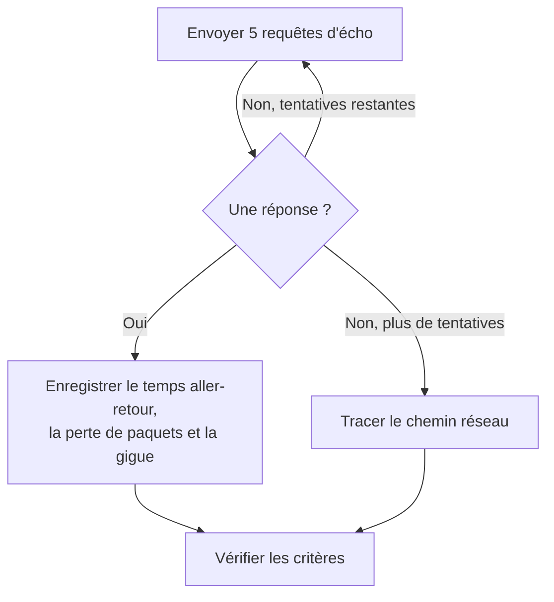

# Surveillance IP

Un moniteur IP vérifie qu'une adresse IPv4 ou IPv6 répond au ping (requêtes d'écho ICMP), et mesure le temps aller-retour, la perte de paquets et la gigue. Utilisez-le pour l'infrastructure que vous connaissez par son adresse, comme une passerelle, l'IP virtuelle d'un répartiteur de charge ou un serveur à adresse fixe.

:::cards
- [Créer le moniteur](#créer-un-moniteur-ip): Six étapes dans le tableau de bord.
- [Options de configuration](#options-de-configuration): L'adresse, le délai d'expiration et les nouvelles tentatives.
- [Critères de surveillance](#critères-de-surveillance): Joignabilité, latence, perte de paquets et gigue.
- [Dépannage](#dépannage): Quand l'adresse répond mais que le moniteur la dit hors ligne.
:::

## Fonctionnement

Un moniteur IP exécute la même vérification qu'un [moniteur ping](/docs/monitor/ping-monitor). À chaque vérification, une sonde envoie cinq requêtes d'écho à l'adresse. Si au moins une réponse revient, l'adresse est en ligne, et la sonde enregistre le temps aller-retour moyen comme temps de réponse, avec la perte de paquets, la gigue et les réponses la plus rapide et la plus lente. Si aucune réponse ne revient, la sonde réessaie, jusqu'au nombre de nouvelles tentatives que vous autorisez. OneUptime passe ensuite le résultat dans les critères du moniteur.

Quand une vérification échoue, la sonde trace aussi la route vers l'adresse, puis joint ce qu'elle a trouvé au résultat sous **Chemin réseau au moment de l'échec**, pour que vous voyiez où la route s'est interrompue.

Lequel utiliser :

| Moniteur | Accepte | À utiliser quand |
| --- | --- | --- |
| **IP** | Une adresse IP seulement | C'est l'adresse elle-même que vous surveillez, et elle ne change pas. |
| [Ping](/docs/monitor/ping-monitor) | Un nom d'hôte ou une adresse IP | Vous connaissez l'hôte par son nom ; le nom est résolu à chaque vérification, donc le moniteur suit les changements DNS. |

> [!NOTE]
> Certains hébergeurs bloquent l'ICMP sur les machines où tourne une sonde. Une sonde qui ne peut pas du tout envoyer de pings vérifie à la place le port TCP `80` de l'adresse, pour que le moniteur dise quand même si elle est joignable. La perte de paquets et la gigue ne sont alors pas mesurées.

Une sonde qui a perdu sa propre connexion réseau ne rapporte aucun résultat, elle ne peut donc pas marquer votre adresse hors ligne.

## Avant de commencer

- **Un rôle qui peut créer des moniteurs** : Project Owner, Project Admin, Project Member, Monitor Admin ou Monitor Member, ou un rôle personnalisé avec l'autorisation Create Monitor.
- **Une sonde qui peut joindre l'adresse**, avec l'ICMP autorisé sur le chemin. Les sondes par défaut de votre projet sont choisies pour chaque nouveau moniteur. Si un pare-feu la protège, autorisez les requêtes d'écho ICMP depuis les [adresses IP des sondes de OneUptime Cloud](/docs/configuration/ip-addresses). Une adresse privée a besoin d'une [sonde personnalisée](/docs/probe/custom-probe) sur ce réseau, et une adresse IPv6 d'une sonde avec une connectivité IPv6.

## Créer un moniteur IP

:::steps
### Commencer un nouveau moniteur

Allez dans **Moniteurs** et cliquez sur **Créer un moniteur**. Sous **Type de moniteur**, cliquez sur **Plus de types de moniteurs** et choisissez **IP** sous **Basic Monitoring**.

### Le nommer

Saisissez un **Nom**, comme `Office gateway`, puis cliquez sur **Suivant**.

### Saisir l'adresse

Dans **Adresse IP**, saisissez l'adresse IPv4 ou IPv6 à vérifier, comme `192.168.1.1` ou `2001:db8::1`. Un nom d'hôte n'est pas accepté : le champ affiche une erreur. Pour pinger un hôte par son nom, utilisez un [moniteur ping](/docs/monitor/ping-monitor).

### Le tester

Cliquez sur **Tester le moniteur**, choisissez une sonde sous **Sélectionner la sonde** et cliquez sur **Exécuter le test**. **Résultat du test du moniteur** montre les temps aller-retour et la perte de paquets que la sonde a constatés.

### Passer en revue les critères

**Critères du moniteur** commence avec les [critères par défaut](#critères-par-défaut) : hors ligne quand l'adresse ne répond pas, en ligne quand elle répond. Modifiez-les si besoin, puis cliquez sur **Suivant**.

### Choisir les sondes et créer

Gardez ou changez les **Sondes** et l'**Intervalle de surveillance** (il commence à **Toutes les 5 minutes**), puis cliquez sur **Créer un moniteur**. La page du moniteur s'ouvre.
:::

## Options de configuration

| Champ | Par défaut | Ce qu'il faut saisir |
| --- | --- | --- |
| **Adresse IP** | Aucune | Une adresse IPv4, comme `192.168.1.1`, ou une adresse IPv6, comme `2001:db8::1`. Les crochets autour d'une adresse IPv6 sont retirés. |
| **Délai d'expiration de la requête (secondes)** (sous **Plus de champs**) | `60` | Combien de temps attendre une réponse à chaque tentative. Le maximum est de 60 secondes. |
| **Tentatives en cas d'échec** (sous **Plus de champs**) | Valeur par défaut de la sonde, généralement `3` | Combien de fois retenter une tentative échouée. Le maximum est 3. |

**Tentatives en cas d'échec** compte les nouvelles tentatives _après_ la première, donc `0` exécute la vérification une fois et `2` jusqu'à trois fois. Laissé vide, il utilise la valeur par défaut de la sonde : 3, sauf si `PROBE_MONITOR_RETRY_LIMIT` de la sonde indique autre chose. Chaque échec est retenté, expirations comprises, avec une pause d'une seconde entre les tentatives. Une vérification réussie dont les réponses ont pris plus de 10 secondes est aussi vérifiée à nouveau.

## Critères de surveillance

Les critères décident quand l'adresse compte comme en ligne, dégradée ou hors ligne, et si cela déclare un incident ou crée une alerte. Chaque critère vérifie un ou plusieurs filtres :

| Filtre | Conditions | Ce qu'il vérifie |
| --- | --- | --- |
| **Is Online** | **Vrai**, **Faux** | Si au moins une requête d'écho a reçu une réponse. |
| **Temps de réponse (en ms)** | **Greater Than**, **Less Than**, **Greater Than Or Equal To**, **Less Than Or Equal To** | Le temps aller-retour moyen des réponses. |
| **Packet Loss (in %)** | **Greater Than**, **Less Than**, **Greater Than Or Equal To**, **Less Than Or Equal To** | La part des cinq requêtes d'écho restées sans réponse. |
| **Jitter (in ms)** | **Greater Than**, **Less Than**, **Greater Than Or Equal To**, **Less Than Or Equal To** | L'écart type des temps aller-retour sur les paquets envoyés lors d'une vérification. |
| **Is Request Timeout** | **Vrai**, **Faux** | Si le ping a expiré à chaque tentative. |

Avec deux filtres ou plus, **Condition de correspondance** décide si **Tous** doivent correspondre ou si **Tout** filtre suffit. Les **Actions** d'un critère décident de ce qu'il fait : changer l'état du moniteur, créer une alerte, déclarer un incident, ou plusieurs de ces actions.

### Critères par défaut

Un nouveau moniteur IP commence avec deux critères :

- **Hors ligne** — l'adresse ne répond à aucune des requêtes d'écho, ou n'est pas joignable du tout, après chaque nouvelle tentative. Le moniteur est marqué **Hors ligne** et un incident appelé « _monitor name_ is offline » est créé. L'incident se résout de lui-même quand l'adresse répond de nouveau.
- **En ligne** — l'adresse répond. Le moniteur est marqué **Opérationnel**.

Les critères sont vérifiés de haut en bas, et le premier qui correspond décide de ce qui se passe. Quand aucun ne correspond, le moniteur affiche son état par défaut : **Opérationnel**, sauf si vous en choisissez un autre sous **Plus de champs**, sous les critères.

### Évaluer sur une période

**Évaluer ce critère sur une période donnée** est une case à cocher sous un filtre, proposée pour **Is Online**, **Temps de réponse (en ms)**, **Packet Loss (in %)** et **Jitter (in ms)**. Activez-la pour juger une fenêtre de vérifications passées au lieu de la dernière : choisissez une agrégation sous **Évaluer** et une fenêtre, de 2 à 60 minutes, sous **Pour les dernières (en minutes)**.

| Agrégation | Correspond quand |
| --- | --- |
| **Moyenne**, **Somme**, **Maximum Value**, **Minimum Value** | Cette valeur, sur la fenêtre, remplit la condition. Filtres numériques seulement. |
| **All Values** | Chaque vérification de la fenêtre remplit la condition. |
| **Any Value** | Au moins une vérification de la fenêtre remplit la condition. |

**All Values** ne correspond qu'une fois la fenêtre réellement couverte par des données. Un moniteur qui vient d'être créé, ou dont les vérifications ont cessé d'être enregistrées, n'a pas assez d'historique pour dire quoi que ce soit des N dernières minutes, donc le critère attend au lieu de correspondre sur la seule mesure qu'il possède. **Any Value** est le réglage pour « prévenez-moi dès qu'une seule vérification dépasse le seuil » et se déclenche toujours immédiatement.

**En l'absence de données** décide de ce qui se passe tant que la fenêtre ne peut pas étayer le critère :

| Option | Ce qui se passe | À utiliser pour |
| --- | --- | --- |
| **Ignore** (par défaut) | Le critère ne correspond pas. | Les alertes de seuil ordinaires. |
| **Déclencheur** | Les données manquantes comptent comme le problème. | Les vérifications où le silence est lui-même une panne. |
| **Treat As Zero** | La fenêtre est comparée comme un seul zéro. | Les compteurs où l'absence d'événements signifie vraiment zéro. |

### Exemples de critères

| Objectif | Filtre | Condition | Valeur |
| --- | --- | --- | --- |
| Hors ligne quand l'adresse est injoignable | **Is Online** | **Faux** | — |
| Alerter quand la latence est élevée | **Temps de réponse (en ms)** | **Greater Than** | `100` |
| Marquer l'adresse dégradée sur un lien qui perd des paquets | **Packet Loss (in %)** | **Greater Than** | `20` |
| Alerter sur une connexion instable | **Jitter (in ms)** | **Greater Than** | `30` |

## Dépannage

:::details L'adresse répond, mais le moniteur la dit hors ligne
L'adresse, ou un pare-feu devant elle, ne répond pas aux requêtes d'écho ICMP de la sonde. Autorisez les requêtes d'écho ICMP depuis les sondes, ou surveillez plutôt un service sur cette adresse avec un [moniteur de port](/docs/monitor/port-monitor). **Chemin réseau au moment de l'échec**, sur la vérification échouée, montre jusqu'où la route est allée.
:::

:::details Une adresse IPv6 échoue toujours
La sonde qui a exécuté la vérification n'a pas de connectivité IPv6 ; l'échec le dit. Exécutez le moniteur sur une sonde avec IPv6 : voir [Sondes personnalisées](/docs/probe/custom-probe).
:::

:::details La perte de paquets et la gigue sont vides
La sonde qui a exécuté la vérification ne peut pas envoyer de pings, donc elle a vérifié à la place le port TCP `80`, qui ne mesure ni l'une ni l'autre. Exécutez le moniteur sur une sonde autorisée à envoyer de l'ICMP.
:::

## Étapes suivantes

:::cards
- [Surveillance par ping](/docs/monitor/ping-monitor): Pinger un hôte par son nom, en suivant les changements DNS.
- [Surveillance de port](/docs/monitor/port-monitor): Vérifier un service sur l'adresse, pas seulement l'adresse.
- [Sondes personnalisées](/docs/probe/custom-probe): Vérifier des adresses privées et IPv6 depuis votre propre réseau.
- [Incidents](/docs/incidents/index): Ce qui se passe après que le moniteur en a déclaré un.
:::
