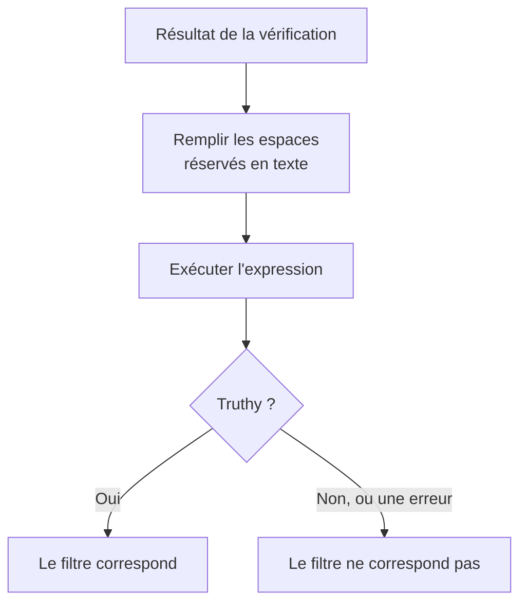

# Expressions JavaScript

Un filtre de critère **JavaScript Expression** décide si le critère d'un moniteur est rempli avec une ligne de JavaScript au lieu d'une comparaison fixe. Utilisez-le quand les filtres intégrés ne peuvent pas exprimer la condition — un champ enfoui dans une réponse JSON, deux valeurs comparées entre elles, ou plusieurs vérifications combinées avec `&&` et `||`.

:::cards
- [Fonctionnement](#fonctionnement): Les espaces réservés sont remplis, puis l'expression s'exécute.
- [Variables](#variables-par-type-de-moniteur): Ce que chaque type de moniteur vous fournit.
- [Exemples](#exemples): Des expressions pour les API, les requêtes entrantes et les bases de données.
- [Règles des guillemets](#règles-des-guillemets): L'erreur que presque tout le monde fait.
:::

## Fonctionnement

Avant que l'expression ne s'exécute, chaque espace réservé `{{variable}}` qu'elle contient est remplacé par la valeur de la dernière vérification du moniteur — en texte brut. Le résultat est ensuite exécuté comme du JavaScript. S'il donne une valeur vraie (truthy), le filtre correspond ; toute autre chose, y compris une erreur, signifie qu'il ne correspond pas.



Comme les espaces réservés sont remplacés en texte, `{{responseBody.item}}` devient la valeur brute. Une chaîne doit être entourée de guillemets pour être une chaîne JavaScript ; un nombre ou un booléen non — voir [Règles des guillemets](#règles-des-guillemets). Les expressions s'exécutent sur le serveur OneUptime, dans un bac à sable isolé.

## Ajouter un filtre JavaScript Expression

:::steps
### Ouvrir les critères

Sur le moniteur, ouvrez **Configuration → Critères** et cliquez sur **Modifier les critères de surveillance**, ou utilisez l'étape **Critères** de **Créer un moniteur**. Travaillez dans le critère à modifier, ou cliquez sur **Ajouter un critère** pour en créer un.

### Ajouter un filtre

Sous **Filtres**, cliquez sur **Ajouter un filtre** et réglez son **Type de filtre** sur **JavaScript Expression**. La **Condition de filtre** est **Evaluates To True**.

### Écrire l'expression

Saisissez l'expression dans **Valeur**, en utilisant les [variables du type de moniteur](#variables-par-type-de-moniteur). Le lien sous le filtre, **Read documentation for using JavaScript expressions here.**, ouvre cette page.

### Enregistrer

Enregistrez le moniteur. Le filtre est évalué à la prochaine vérification du moniteur.
:::

## Variables par type de moniteur

Les expressions JavaScript sont proposées pour les moniteurs de type Site web, API, Requête entrante, Incoming Email, SQL Query et Santé de la base de données.

### Moniteurs de site web et d'API

| Variable | Description | Type |
| --- | --- | --- |
| `responseBody` | Le corps de la réponse. Si le corps de la réponse est du JSON, il est analysé ; sinon, par exemple pour du HTML ou du XML, c'est une chaîne. | `string` ou `JSON` |
| `responseHeaders` | Les en-têtes de la réponse, avec des noms en minuscules. | `Dictionary<string>` |
| `responseStatusCode` | Le code de statut de la réponse. | `number` |
| `responseTimeInMs` | Le temps de réponse en millisecondes. | `number` |
| `isOnline` | Si le moniteur compte la réponse comme en ligne. | `boolean` |

### Moniteurs de requêtes entrantes

| Variable | Description | Type |
| --- | --- | --- |
| `requestBody` | Le corps de la requête. | `string` ou `JSON` |
| `requestHeaders` | Les en-têtes de la requête, avec des noms en minuscules. | `Dictionary<string>` |

### Moniteurs de requêtes SQL

| Variable | Description | Type |
| --- | --- | --- |
| `rowCount` | Le nombre de lignes que la requête a renvoyées. | `number` |
| `scalarValue` | La première colonne de la première ligne. | quelconque |
| `firstRow` | La première ligne, sous forme de paires colonne/valeur. | `JSON` |
| `executionTimeInMs` | La durée de la requête, en millisecondes. | `number` |
| `queryError` | L'erreur de la requête, s'il y en a eu une. | `string` |
| `isOnline` | Si la base de données était joignable et que la requête a réussi. | `boolean` |

### Moniteurs de santé de base de données

`isOnline`, `engineVersion`, `connectionError`, `collectedGroups`, `unavailableGroups` et `metrics`. Voir [Variables d'expression JavaScript](/docs/monitor/database-health-monitor#variables-des-expressions-javascript) sur la page de surveillance de la santé des bases de données.

### Moniteurs d'e-mails entrants

Le filtre est proposé, mais aucun champ d'e-mail ne lui est lié : une expression ne peut lire ni l'objet, ni l'expéditeur, ni le corps, ni le destinataire. Utilisez plutôt les types de filtres d'e-mail — voir [Surveillance des e-mails entrants](/docs/monitor/incoming-email-monitor#types-de-filtre-disponibles).

## Exemples

Chaque ligne ci-dessous est une expression complète. Pour un corps de réponse JSON comme celui-ci :

```json
{
  "item": "hello",
  "count": 3,
  "items": [{ "name": "hello" }]
}
```

| Expression | Correspond quand |
| --- | --- |
| `"{{responseBody.item}}" === "hello"` | Le champ `item` vaut `hello`. |
| `{{responseBody.count}} > 2` | Le champ `count` est supérieur à 2. |
| `"{{responseBody.items[0].name}}" === "hello"` | Le premier élément de `items` a pour nom `hello`. |
| `{{responseStatusCode}} === 200 && {{responseTimeInMs}} < 500` | Le statut est 200 et la réponse a pris moins d'une demi-seconde. |
| `/hel+o/.test("{{responseBody.item}}")` | Le champ `item` correspond à une expression régulière. |
| `"{{responseHeaders.content-type}}".startsWith("application/json")` | La réponse est du JSON. Les noms d'en-têtes sont en minuscules. |

Combinez les conditions avec `&&` et `||`, et regroupez-les avec des parenthèses :

```javascript
({{responseStatusCode}} === 200 || {{responseStatusCode}} === 204) && {{responseTimeInMs}} < 1000
```

Pour un moniteur de requêtes entrantes qui reçoit `{"status": "degraded", "region": "eu"}` en `Content-Type: application/json` :

```javascript
"{{requestBody.status}}" === "degraded" && "{{requestBody.region}}" === "eu"
```

Pour un moniteur de requêtes SQL dont la requête renvoie un nombre, alerter sur un nombre élevé ou une requête lente :

```javascript
{{scalarValue}} > 50 || {{executionTimeInMs}} > 2000
```

Pour un moniteur de santé de base de données, lisez une métrique en indexant tout l'objet `metrics` — les noms des séries contiennent des points, ils ne peuvent donc pas aller entre les accolades :

```javascript
{{metrics}}['oneuptime.monitor.database.connections.used.percent'] > 90
```

## Règles des guillemets

`{{var}}` est remplacé par la valeur, en texte. Pour comparer une chaîne, entourez-la de guillemets, comme dans `"{{responseBody.item}}" === "hello"` ; pour comparer un nombre, laissez-le nu, comme dans `{{responseStatusCode}} === 200`.

| Type de valeur | À écrire | Exemple |
| --- | --- | --- |
| Chaîne | Entre guillemets | `"{{responseBody.status}}" === "ok"` |
| Nombre | Nu | `{{responseTimeInMs}} < 500` |
| Booléen | Nu | `{{isOnline}} === true` |
| Objet ou tableau | Nu, puis indexé | `{{responseHeaders}}['content-type']` |

Trois points de vigilance :

- **Un espace réservé seul entre guillemets est toujours vrai.** `"{{responseBody.healthy}}"` est la chaîne non vide `"false"` quand le champ vaut `false`. Comparez-le : `"{{responseBody.healthy}}" === "true"`, ou laissez-le nu : `{{responseBody.healthy}} === true`.
- **Les valeurs ne sont pas échappées.** Une valeur qui contient un guillemet double ou un saut de ligne termine la chaîne trop tôt, et l'expression échoue. Pour chercher du texte dans une page HTML, utilisez plutôt le filtre **Corps de la réponse**.
- **Un chemin absent reste tel quel.** Si la vérification n'a pas ce champ, `{{responseBody.item}}` reste tel quel dans l'expression, ce qui est en général une erreur de syntaxe — le filtre ne correspond donc pas.

## Limites

Une expression dispose de 5 secondes pour s'exécuter. Une expression qui prend plus de temps, ou qui lève une erreur, ne correspond pas, et l'erreur est écrite dans le journal du serveur OneUptime.

## Dépannage

:::details L'expression ne correspond jamais
Vérifiez d'abord les guillemets : un espace réservé de chaîne sans guillemets devient un mot nu, ce qui est une erreur de syntaxe, et une erreur ne correspond jamais. Vérifiez ensuite que le chemin existe dans le résultat de la vérification — un espace réservé pour un chemin absent n'est pas rempli.
:::

:::details L'expression correspond toujours
Un espace réservé seul entre guillemets est une chaîne non vide, qui est toujours truthy. Comparez-le à une valeur.
:::

## Étapes suivantes

:::cards
- [Modèles d'incident et d'alerte](/docs/monitor/incident-alert-templating): Utiliser les mêmes espaces réservés dans les titres et descriptions d'incidents.
- [Surveillance d'API](/docs/monitor/api-monitor): Vérifier un point de terminaison HTTP et sa réponse.
- [Surveillance des requêtes entrantes](/docs/monitor/incoming-request-monitor): Évaluer les requêtes que d'autres systèmes vous envoient.
:::
