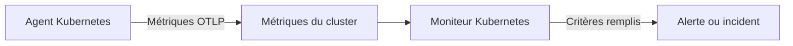

# Surveillance Kubernetes

Un moniteur Kubernetes alerte sur les métriques que l'agent Kubernetes de OneUptime envoie depuis un cluster : nœuds, pods, conteneurs, charges de travail, autoscalers et plan de contrôle. Partez d'un modèle d'alerte prêt à l'emploi, choisissez une seule métrique ou écrivez votre propre requête, puis définissez le seuil qui ouvre une alerte ou un incident.

:::cards
- [Installer l'agent](/docs/monitor/kubernetes-agent): Une seule commande Helm fait entrer le cluster dans OneUptime.
- [Créer le moniteur](#créer-un-moniteur-kubernetes): Choisir le cluster, puis un modèle, une métrique ou une requête.
- [Modèles d'alerte](#modèles-dalerte-prêts-à-lemploi): Dix-sept alertes prêtes à l'emploi, de CrashLoopBackOff à etcd.
- [Critères](#critères-de-surveillance): Seuils statiques et détection d'anomalies.
:::

## Fonctionnement

L'agent envoie les métriques du cluster à OneUptime via OTLP, chacune marquée du nom du cluster (`k8s.cluster.name`, le `clusterName` du chart). Les premières données d'un nouveau nom enregistrent le cluster sous **Kubernetes**, et dès lors le cluster peut être choisi dans un moniteur Kubernetes. Chaque minute, le moniteur interroge ces métriques sur sa **Plage temporelle**, les agrège et compare le résultat à ses critères.

## Avant de commencer

- L'agent Kubernetes de OneUptime en cours d'exécution dans le cluster. Voir [Agent Kubernetes (installation Helm)](/docs/monitor/kubernetes-agent) ; le cluster apparaît sous **Kubernetes** quelques minutes après l'installation.
- Pour les modèles du plan de contrôle (**etcd No Leader**, **API Server Request Saturation**, **Scheduler Backlog**) : la collecte du plan de contrôle par l'agent, `controlPlane.enabled`. Les clusters managés (EKS, GKE, AKS) n'exposent pas ces points de terminaison, si bien que ces moniteurs n'y reçoivent jamais de données.

## Créer un moniteur Kubernetes

:::steps
### Commencer un nouveau moniteur

Allez dans **Moniteurs** et cliquez sur **Créer un moniteur**. Sous **Plus de types de moniteurs**, choisissez **Kubernetes** – ou tapez `k8s` dans le champ de recherche.

### Choisir le cluster

Sélectionnez-le dans **Cluster Kubernetes**. La liste contient chaque cluster depuis lequel l'agent a envoyé des données.

### Choisir ce qu'il faut surveiller

Utilisez l'un des trois onglets :

| Onglet | Ce que vous choisissez |
| --- | --- |
| **Quick Setup** | Un [modèle d'alerte prêt à l'emploi](#modèles-dalerte-prêts-à-lemploi). Il remplit la métrique, la portée, la plage temporelle et les critères ; vous pouvez toujours changer la **Plage temporelle**. |
| **Custom Metric** | Une métrique du [catalogue de métriques](#catalogue-de-métriques), puis sa **Portée de la ressource**, ses filtres, son **Agrégation** (Moyenne, Maximum, Minimum, Somme ou Comptage) et sa **Plage temporelle**. |
| **Avancé** | La **Portée de la ressource**, les filtres et la **Plage temporelle**, ainsi que vos propres requêtes de métriques et formules sous **Sélectionner les métriques**, avec un graphique en direct du résultat. |

### Définir les critères

Définissez quand le moniteur change de statut et quand il ouvre une alerte ou un incident – voir [Critères de surveillance](#critères-de-surveillance). Un modèle les a déjà remplis : vérifiez les seuils, les gravités et les politiques d'astreinte.

### Enregistrer le moniteur

Terminez le formulaire et enregistrez. Le moniteur apparaît sous **Moniteurs**, et son statut suit vos critères dès sa première évaluation.
:::

## Options de configuration

### Portée de la ressource et filtres

**Portée de la ressource** fixe le niveau auquel la métrique est évaluée et décide quels filtres le formulaire affiche. Chaque filtre est facultatif.

| Portée | Surveille | Filtres |
| --- | --- | --- |
| Cluster | Le cluster entier | — |
| Espace de noms | Les ressources d'un espace de noms | **Espace de noms** |
| Charge de travail | Un deployment, statefulset, daemonset, job ou cronjob | **Espace de noms**, **Nom de la charge de travail** |
| Nœud | Un nœud du cluster | **Nom du nœud** |
| Pod | Un pod | **Espace de noms**, **Nom du pod** |

### Plage temporelle

**Plage temporelle** est la fenêtre que couvre la requête de métrique à chaque évaluation du moniteur, de **Past 1 Minute** à **Past 365 Days**. Les fenêtres courtes (1 à 15 minutes) conviennent aux alertes ; les plus longues lissent les métriques bruitées.

### Requêtes de métriques et formules

Dans l'onglet **Avancé**, chaque requête nomme une métrique, la façon dont ses valeurs sont agrégées et des filtres d'attributs facultatifs. Une **formule** combine des requêtes avec de l'arithmétique – les modèles d'utilisation des nœuds, par exemple, divisent l'utilisation par la capacité allouable.

## Catalogue de métriques

L'onglet **Custom Metric** propose ces métriques, regroupées par type de ressource :

| Catégorie | Métriques |
| --- | --- |
| Pod | Pod CPU Usage, Pod Memory Usage, Pod Phase (Code), Pod Filesystem Usage, Pod Memory Limit Utilization, Pod CPU Limit Utilization, Pod Network I/O (Cumulative, Both Directions) |
| Nœud | Node CPU Usage, Node Allocatable CPU, Node Memory Usage, Node Filesystem Usage, Node Allocatable Memory, Node Ready Condition, Node Filesystem Available |
| Conteneur | Container Restarts, Container CPU Limit, Container CPU Request, Container Memory Limit, Container Memory Request, Container Ready |
| Charge de travail | Deployment Available Replicas, Deployment Desired Replicas, DaemonSet Misscheduled Nodes, DaemonSet Ready Nodes, StatefulSet Ready Replicas, Job Failed Pods, Job Successful Pods |
| HPA | HPA Current Replicas, HPA Desired Replicas, HPA Max Replicas, HPA Min Replicas |
| Plan de contrôle | etcd Has Leader, API Server In-Flight Requests, Scheduler Pending Pods |

> [!NOTE]
> **Pod CPU Usage** et **Node CPU Usage** sont exprimés en cœurs, pas en pourcentage : `0.18` correspond à 0,18 cœur. **Pod Phase (Code)** est un code (1 Pending, 2 Running, 3 Succeeded, 4 Failed, 5 Unknown) – agrégez-le avec Maximum ou Minimum, jamais avec Somme. Les métriques du plan de contrôle n'arrivent que si la collecte du plan de contrôle par l'agent est activée.

## Critères de surveillance

### Ce qui est évalué

Ces moniteurs évaluent toujours la **Metric Value** – la valeur de la requête de métrique ou de la formule configurée. Le formulaire de critère n'a pas de sélecteur de type de filtre ; il affiche **Métrique**, **Agrégation**, **Condition** et **Threshold**.

### Types d'agrégation

| Agrégation | Description |
| --- | --- |
| Moyenne | Valeur moyenne sur la fenêtre de temps |
| Somme | Somme de toutes les valeurs |
| Maximum Value | Valeur la plus élevée de la fenêtre de temps |
| Minimum Value | Valeur la plus basse de la fenêtre de temps |
| All Values | Toutes les valeurs doivent correspondre au critère |
| Any Value | Au moins une valeur doit correspondre |

### Conditions

Les seuils statiques sont comparés au **Threshold** que vous saisissez : **Greater Than**, **Less Than**, **Greater Than Or Equal To**, **Less Than Or Equal To** et **Equal To**.

La détection d'anomalies par rapport à une référence n'a pas besoin de seuil. Choisissez l'une de ces conditions, et le formulaire affiche **Sensibilité** et **Fenêtre de référence** à la place :

| Condition | Correspond quand la valeur |
| --- | --- |
| **Anomalously High** | Monte au-dessus de la plage attendue |
| **Anomalously Low** | Descend sous la plage attendue |
| **Anomalous** | Sort de la plage attendue dans un sens ou dans l'autre |

Chaque mesure est comparée à une référence de la même heure de la semaine, construite à partir de la **Fenêtre de référence** (14 jours par défaut ; 28, 60 ou 90 jours). **Sensibilité** fixe la largeur de la plage attendue : **Faible (4σ — écarts flagrants uniquement)**, **Moyen (3σ — recommandé)**, la valeur par défaut, ou **Élevé (2σ — plus bruyant, services très stables)**. Les conditions d'anomalie restent dans un état « Learning » et ne produisent aucune alerte tant qu'au moins la fenêtre de référence choisie d'historique de métrique n'existe pas.

**En l'absence de données**, sous **Plus de champs**, décide de ce qui se passe quand la requête ne renvoie rien dans la fenêtre : **Ignore** (par défaut) ne correspond pas, **Déclencheur** traite le silence comme le problème, et **Treat As Zero** compare un zéro. Le temps pendant lequel OneUptime lui-même ne recevait pas de données n'est jamais une absence de données : une vérification dont la fenêtre en contient attend à la place, comme l'explique [Quand OneUptime ne reçoit pas de données](/docs/monitor/when-oneuptime-is-not-receiving).

## Modèles d'alerte prêts à l'emploi

L'onglet **Quick Setup** liste ces modèles, regroupés par catégorie. Chacun remplit deux critères : l'un marque le moniteur hors ligne et ouvre un incident et une alerte tant que la condition est remplie, l'autre le remet en ligne quand elle cesse de l'être.

| Modèle | Catégorie | Se déclenche quand | Gravité |
| --- | --- | --- | --- |
| CrashLoopBackOff Detection | Charge de travail | Un conteneur a redémarré plus de 5 fois depuis la création de son pod | Critique |
| Pod Stuck in Pending | Planification | Un pod est en phase Pending dans chaque mesure d'une fenêtre de 15 minutes | Warning |
| Node Not Ready | Nœud | Un nœud signale NotReady | Critique |
| High Node CPU Utilization | Nœud | L'utilisation moyenne du CPU d'un nœud dépasse 90 % de son CPU allouable | Warning |
| High Node Memory Utilization | Nœud | L'utilisation moyenne de la mémoire d'un nœud dépasse 85 % de sa mémoire allouable | Warning |
| Deployment Replica Mismatch | Charge de travail | Un deployment a moins de réplicas disponibles que souhaité pendant 15 minutes | Warning |
| Job Failures | Charge de travail | Un job a des pods en échec | Warning |
| etcd No Leader | Plan de contrôle | etcd n'a pas de leader élu | Critique |
| API Server Request Saturation | Plan de contrôle | Le serveur d'API maintient 200 requêtes en cours ou plus pendant toute la fenêtre | Critique |
| Scheduler Backlog | Planification | La file des pods en attente du scheduler n'est pas vide pendant 5 minutes | Warning |
| High Node Disk Usage | Stockage | Le système de fichiers d'un nœud est plein à plus de 90 % | Warning |
| DaemonSet Misscheduled Nodes | Charge de travail | Un DaemonSet exécute des pods sur des nœuds qui ne correspondent plus à son sélecteur de nœuds, à son affinité ou à ses tolérances | Warning |
| High Node CPU Request Commitment | Nœud | La somme des requêtes CPU des conteneurs d'un nœud dépasse 90 % de son CPU allouable | Warning |
| High Node Memory Request Commitment | Nœud | La somme des requêtes mémoire des conteneurs d'un nœud dépasse 90 % de sa mémoire allouable | Warning |
| HPA Saturated at Max Replicas | Charge de travail | Un HPA tourne à 90 % ou plus de ses `maxReplicas` | Critique |
| Pod Memory Saturating Container Limit | Charge de travail | Un pod utilise plus de 90 % de la limite de mémoire de ses conteneurs | Critique |
| Pod CPU Saturating Container Limit | Charge de travail | Un pod utilise plus de 90 % de la limite de CPU de ses conteneurs | Warning |

Les modèles fondés sur des métriques par objet évaluent chaque nœud, pod, deployment, job, DaemonSet ou HPA séparément, si bien qu'un cluster avec plusieurs pods défaillants reçoit un incident par pod plutôt qu'un seul pour tout le cluster.

> [!NOTE]
> **CrashLoopBackOff Detection** lit le nombre de redémarrages du conteneur sur toute la vie de son pod actuel, et non un taux. Un conteneur qui a bouclé sur des plantages puis s'est rétabli garde l'alerte ouverte jusqu'à ce que son pod soit remplacé.

### Repérer les causes, pas seulement les symptômes

Les modèles au niveau des nœuds (High Node CPU Utilization, High Node Memory Utilization, Node Not Ready, Pod Stuck in Pending) se déclenchent à la *fin* d'une chaîne d'épuisement des ressources, quand le cluster est déjà dégradé. Trois modèles se déclenchent à son *début*, là où se trouve généralement la solution :

- **Pod Memory Saturating Container Limit** et **Pod CPU Saturating Container Limit** repèrent une charge de travail plaquée contre ses propres limites. Dépasser une limite de mémoire provoque un OOMKill immédiat ; dépasser une limite de CPU pousse le noyau à brider le pod, qui ralentit sans jamais renvoyer d'erreur. Les deux sont la cause habituelle des CrashLoopBackOff et des latences inexpliquées.
- **HPA Saturated at Max Replicas** repère un autoscaler sans marge restante. Une charge de travail dont les limites par pod sont trop basses est bridée ou tuée, ce qui gonfle la métrique même sur laquelle le HPA se base – l'autoscaler continue donc d'ajouter des réplicas tous aussi affamés, jusqu'à atteindre son plafond. Relever les limites est la solution ; relever `maxReplicas` aggrave la situation.

Activez-les ensemble dans tout espace de noms qui exécute une charge de travail mise à l'échelle automatiquement : la combinaison distingue « a vraiment besoin de plus de capacité » de « sous-dimensionnée par pod ».

> [!NOTE]
> Les deux modèles de limite de pod divisent l'utilisation du pod par la **somme** des limites de ses conteneurs, si bien que les pods avec sidecars sont mesurés correctement. Le chiffre de mémoire de pod du kubelet inclut le cache de pages récupérable, donc une charge de travail qui manipule beaucoup de fichiers peut rester haut sur le modèle de mémoire sans jamais subir d'OOMKill : lisez-le comme « approche de la limite », pas « sur le point d'être tué ».

## Dépannage

:::details Le cluster n'est pas dans la liste Cluster Kubernetes
Les clusters s'enregistrent eux-mêmes à partir des données de l'agent, sous le `clusterName` avec lequel l'agent a été installé. Vérifiez que les pods de l'agent tournent et que le cluster figure sous **Produits → Infrastructure → Kubernetes → Tous les clusters**. [Agent Kubernetes (installation Helm)](/docs/monitor/kubernetes-agent) couvre l'installation et ce qu'il faut vérifier quand aucune donnée n'arrive.
:::

:::details Un modèle du plan de contrôle ne se déclenche jamais
**etcd No Leader**, **API Server Request Saturation** et **Scheduler Backlog** lisent des métriques que seule la collecte du plan de contrôle par l'agent recueille. Activez `controlPlane.enabled` dans les valeurs Helm de l'agent ; elle est désactivée par défaut. Les clusters managés (EKS, GKE, AKS) n'exposent pas ces points de terminaison, si bien que ces moniteurs n'y reçoivent jamais de données.
:::

:::details Un seuil de CPU ne se déclenche jamais
**Pod CPU Usage** et **Node CPU Usage** sont exprimés en cœurs, pas en pourcentage, donc un seuil de `80` signifie 80 cœurs. Définissez le seuil en cœurs, ou partez de **High Node CPU Utilization** ou de **Pod CPU Saturating Container Limit**, qui comparent un pourcentage.
:::

:::details CrashLoopBackOff Detection reste ouvert après le rétablissement du pod
Le modèle lit le nombre de redémarrages du conteneur sur toute la vie de son pod actuel, donc ce nombre ne redescend pas une fois qu'il a dépassé 5. L'alerte se résout quand le pod est remplacé, par exemple par un redéploiement, une éviction ou la vidange d'un nœud.
:::

## Étapes suivantes

:::cards
- [Agent Kubernetes (installation Helm)](/docs/monitor/kubernetes-agent): Installer, mettre à jour et régler l'agent avec Helm.
- [Agent Kubernetes](/docs/telemetry/kubernetes-agent): Filtres d'espaces de noms, métriques du plan de contrôle, filtres de gravité des journaux et l'agent IA.
- [Surveillance des métriques](/docs/monitor/metrics-monitor): Alerter sur n'importe quelle métrique, y compris les métriques personnalisées et eBPF de l'agent.
- [Modèles d'incident et d'alerte](/docs/monitor/incident-alert-templating): Mettre le pod ou le nœud en cause dans les titres d'incident.
:::
