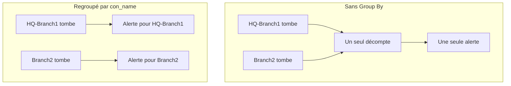

# Surveillance des journaux

Un moniteur de journaux compte, sur une fenêtre de temps, les journaux que vos services envoient à OneUptime et qui correspondent à vos filtres – texte, gravité, service, attributs. Quand ce nombre remplit vos critères, il change le statut du moniteur, crée une alerte ou déclare un incident. Servez-vous-en pour repérer les pics d'erreurs, un message d'échec précis ou un service qui a cessé d'écrire des journaux.

:::cards
- [Créer le moniteur](#créer-un-moniteur-de-journaux): Choisir les journaux à compter et quand alerter.
- [Comment il est évalué](#comment-il-est-évalué): La fenêtre de temps, le décompte et le cycle d'une minute.
- [Critères](#critères): Seuils, détection d'anomalies et valeurs par défaut.
- [Alertes par groupe](#alertes-par-groupe-group-by): Une alerte par tunnel, utilisateur ou interface.
:::

## Fonctionnement

```mermaid title="Chaque minute, un moniteur de journaux compte et vérifie"
flowchart TB
    App["Vos services"] -->|OpenTelemetry| Store[("Journaux dans OneUptime")]
    Store --> Count["Compter les journaux correspondants<br/>dans la fenêtre de temps"]
    Count --> Check{"Critères remplis ?"}
    Check -->|"Première correspondance"| Act["Changer le statut,<br/>alerte ou incident"]
    Check -->|Aucun| Default["Statut par défaut"]
```

Chaque minute, OneUptime compte les journaux qui correspondent aux filtres du moniteur et sont arrivés dans sa fenêtre de temps. Il compare ce nombre aux critères du moniteur de haut en bas, et le premier critère qui correspond décide de ce qui se passe. Si aucun ne correspond, le moniteur revient à son statut par défaut.

## Avant de commencer

- Vos services envoient des journaux à OneUptime via OpenTelemetry (ou une autre source de journaux qu'OneUptime ingère). Voir [OpenTelemetry](/docs/telemetry/open-telemetry).
- Pour filtrer ou regrouper sur une valeur contenue dans la ligne de journal, comme un nom de tunnel ou d'utilisateur, transformez-la d'abord en attribut avec un [pipeline de journaux](/docs/telemetry/log-pipelines).

## Créer un moniteur de journaux

:::steps
### Commencer un nouveau moniteur

Allez dans **Moniteurs** et cliquez sur **Créer un moniteur**.

### Choisir Logs

Sous **Type de moniteur**, cliquez sur **Plus de types de moniteurs** et choisissez **Journaux** sous **Télémétrie**, ou tapez `logs` dans le champ de recherche. Saisissez un **Nom**, puis cliquez sur **Suivant**.

### Choisir les journaux à compter

Dans **Configuration du moniteur de journaux**, renseignez **Surveiller les journaux qui incluent ce texte**, **Surveiller les journaux pendant (durée)** et **Gravité du journal**. Un filtre laissé vide correspond à tous les journaux. **Aperçu des journaux**, sous les filtres, montre les journaux qu'ils sélectionnent en ce moment.

### Affiner (facultatif)

Ouvrez **Plus de champs** pour filtrer par service de télémétrie, entité d'infrastructure ou attribut. Pour obtenir une alerte par tunnel, utilisateur ou interface plutôt qu'une seule pour tout le moniteur, ajoutez l'attribut dans **Group by Attributes** – voir [Alertes par groupe](#alertes-par-groupe-group-by).

### Définir les critères

La carte **Critères du moniteur** commence avec deux critères : hors ligne, avec un incident, quand aucun journal ne correspond ; en ligne dès qu'au moins un correspond. Adaptez-les à ce sur quoi vous voulez alerter – voir [Critères](#critères).

### Créer le moniteur

Cliquez sur **Créer un moniteur**. Le moniteur s'ouvre sur sa page **Vue d'ensemble**, et sa première évaluation a lieu dans la minute.
:::

## Ce qu'il interroge

| Champ | Ce qu'il sélectionne | Par défaut |
| --- | --- | --- |
| **Surveiller les journaux qui incluent ce texte** | Les journaux dont le corps contient ce texte, sans tenir compte de la casse. | Vide : tous les journaux |
| **Surveiller les journaux pendant (durée)** | Les journaux des 5 dernières secondes jusqu'aux 24 dernières heures. | **Dernière minute** |
| **Gravité du journal** | Les journaux ayant l'une des gravités choisies. | Vide : toutes les gravités |
| **Group by Attributes** | Pas un filtre : compte séparément chaque combinaison de valeurs de ces attributs. | Vide : un seul décompte |
| **Filtrer par service de télémétrie** (sous **Plus de champs**) | Les journaux de l'un des services choisis. | Vide : tous les services |
| **Filtrer par entité d'infrastructure** (sous **Plus de champs**) | Les journaux de l'un des hôtes, pods, conteneurs et autres entités choisis. | Vide : toutes les entités |
| **Filtrer par attributs** (sous **Plus de champs**) | Les journaux dont les attributs remplissent chaque condition. Chaque condition a son propre opérateur, comme « égal à » ou « contient ». | Vide : aucune condition |

Tous les filtres que vous définissez doivent correspondre pour qu'un journal soit compté.

### Gravité des journaux

Chaque journal est enregistré avec l'une de sept gravités. Pour les journaux OpenTelemetry, elle provient du numéro de gravité du journal ; choisissez donc la gravité, pas le texte affiché par votre logger :

| Gravité | Numéros de gravité OpenTelemetry |
| --- | --- |
| **Trace** | 1–4 |
| **Débogage** | 5–8 |
| **Information** | 9–12 |
| **Warning** | 13–16 |
| **Erreur** | 17–20 |
| **Fatal** | 21–24 |
| **Non spécifié** | Tout le reste |

## Comment il est évalué

- **Chaque minute.** Un moniteur de journaux n'est pas vérifié par des sondes ; il n'a donc pas d'intervalle à régler ni de page **Sondes et intervalle**.
- **Un seul nombre par évaluation.** Le moniteur compte les journaux qui correspondent à chaque filtre et sont arrivés dans la durée **Surveiller les journaux pendant (durée)** précédant l'évaluation. Avec **Dernières 5 minutes**, chaque évaluation remonte cinq minutes en arrière, si bien que les fenêtres d'évaluations successives se chevauchent.
- **Aucun journal, c'est un décompte de 0.** Un service qui cesse d'écrire des journaux produit 0, ce que recherche le critère hors ligne par défaut.
- **L'indisponibilité d'OneUptime lui-même n'est pas un silence.** Tant que la fenêtre de temps contient une période où OneUptime lui-même ne recevait pas de données – il redémarrait, était mis à jour ou rattrapait un retard –, la vérification attend : le statut ne change pas, et aucun incident ni aucune alerte n'est ouvert ni résolu. Voir [Quand OneUptime ne reçoit pas de données](/docs/monitor/when-oneuptime-is-not-receiving).
- **Les critères de haut en bas.** Le premier critère qui correspond décide ; placez donc le plus grave en premier. Un moniteur regroupé fonctionne autrement : il vérifie chaque critère pour chaque groupe – voir [L'évaluation des critères diffère](#lévaluation-des-critères-diffère).

Chaque changement de statut est enregistré, avec sa raison, dans la **Chronologie de statut** du moniteur.

## Critères

Les critères d'un moniteur de journaux ont un seul **Type de filtre** : **Log Count**, le nombre de journaux qui ont correspondu dans la fenêtre. Choisissez une **Condition de filtre** et, pour une condition de seuil, une **Valeur**.

| Condition de filtre | Correspond quand le nombre de journaux est… |
| --- | --- |
| **Greater Than** | au-dessus de la valeur |
| **Greater Than Or Equal To** | égal ou supérieur à la valeur |
| **Less Than** | en dessous de la valeur |
| **Less Than Or Equal To** | égal ou inférieur à la valeur |
| **Equal To** | exactement la valeur |
| **Anomalously High** | au-dessus de la plage attendue pour cette heure de la semaine |
| **Anomalously Low** | en dessous de cette plage |
| **Anomalous** | hors de cette plage, dans un sens ou dans l'autre |

Les conditions d'anomalie ne prennent pas de **Valeur**. Choisissez une **Sensibilité** – Low, Medium (la valeur par défaut) ou High – et une **Fenêtre de référence** de 14 (la valeur par défaut), 28, 60 ou 90 jours. OneUptime convertit le décompte en taux par minute et le compare à la même heure de la semaine sur cette fenêtre. La référence ne couvre que les services et les gravités du moniteur : ses filtres de texte et d'attributs n'en font pas partie. Tant que cette heure de la semaine n'a pas assez d'historique, le critère est encore en apprentissage et ne se déclenche pas.

Un nouveau moniteur de journaux commence avec ces critères :

| Critère | Filtre | Effet |
| --- | --- | --- |
| Check if … is offline | **Log Count** **Equal To** `0` | Passe le moniteur hors ligne et déclare un incident, résolu automatiquement |
| Check if … is online | **Log Count** **Greater Than** `0` | Passe le moniteur en ligne |

> [!TIP]
> Pour alerter sur les erreurs plutôt que sur le silence, réglez **Gravité du journal** sur **Erreur** et changez le critère hors ligne en **Log Count** **Greater Than** le nombre d'erreurs que vous tolérez dans la fenêtre.

## Exemple : un pic d'erreurs

Vous voulez un incident quand le service checkout journalise plus de 50 erreurs en cinq minutes :

- **Gravité du journal** : **Erreur**
- **Surveiller les journaux pendant (durée)** : **Dernières 5 minutes**
- **Filtrer par service de télémétrie** : `checkout`
- Critère 1 : **Log Count** **Greater Than** `50` – passer le moniteur hors ligne et déclarer un incident
- Critère 2 : **Log Count** **Less Than Or Equal To** `50` – passer le moniteur en ligne

Quatre évaluations successives :

| Heure | Journaux d'erreur des 5 dernières minutes | Critère qui correspond | Ce qui se passe |
| --- | --- | --- | --- |
| 10:00 | 12 | 2 | Le moniteur est en ligne. |
| 10:01 | 64 | 1 | Le moniteur passe hors ligne et un incident est déclaré. |
| 10:02 | 81 | 1 | Toujours hors ligne. L'incident est déjà ouvert, donc aucun second n'est déclaré. |
| 10:06 | 9 | 2 | Le moniteur est de nouveau en ligne, et l'incident se résout de lui-même parce que **Résoudre automatiquement l'incident** est activé. |

Comme les fenêtres se chevauchent, une seule rafale d'erreurs maintient le décompte élevé jusqu'à cinq minutes après sa fin. Utilisez une fenêtre plus courte pour un moniteur qui doit se rétablir plus vite.

## Alertes par groupe (Group By)

**Group by Attributes** divise le décompte d'un moniteur de journaux en un décompte par combinaison distincte de valeurs d'attributs – un par tunnel IPsec, par utilisateur VPN, par interface de pare-feu – et évalue les critères pour chaque groupe séparément. C'est l'équivalent, pour les journaux, du [Group By](/docs/monitor/metrics-monitor#alertes-par-série-group-by) d'un moniteur de métriques.

### Une alerte par groupe

Sans Group By, un moniteur qui surveille les tunnels IPsec interrompus n'est qu'un seul décompte pour tout le moniteur et lève **une seule alerte pour tout le moniteur**. Tant que cette alerte est ouverte, la chute d'un second tunnel ne produit rien de nouveau : le moniteur alerte déjà.

Avec Group By sur le nom du tunnel, l'interruption du tunnel `HQ-Branch1` ouvre sa propre alerte, et l'interruption du tunnel `Branch2` dix minutes plus tard ouvre une **seconde alerte, distincte**, à côté.



### Résolution indépendante

L'alerte ou l'incident de chaque groupe se résout de son côté. Dès qu'un groupe ne remplit plus les critères – `HQ-Branch1` ne journalise plus d'interruption dans la fenêtre de temps –, son alerte se résout, tandis que celle de `Branch2` reste ouverte jusqu'à ce que `Branch2` s'arrête aussi. Le rétablissement d'un groupe ne ferme jamais l'alerte d'un autre.

Un moniteur de journaux voit des événements, pas un état : l'alerte d'un groupe se résout dès que ce groupe n'a rien journalisé qui remplisse les critères pendant toute une fenêtre de temps, que le tunnel soit revenu ou non.

### Exemple : une alerte par tunnel IPsec Sophos

Cela suppose que les lignes syslog du pare-feu sont découpées en attributs par un [analyseur Key=Value](/docs/telemetry/log-pipelines#keyvalue-parser), sans préfixe cible, de sorte que le nom du tunnel est l'attribut `con_name` :

```text
log_component="IPSec" con_name="HQ-Branch1" status="Terminated" message="IPSec Connection HQ-Branch1 between 10.171.4.117 and 10.171.4.118 for Child HQ-Branch1 terminated."
```

:::steps
1. Créez un moniteur **Journaux**.
2. Réglez **Surveiller les journaux qui incluent ce texte** sur `terminated` et **Surveiller les journaux pendant (durée)** sur **Dernières 5 minutes**.
3. Sous **Plus de champs**, ajoutez le filtre d'attribut `log_component` = `IPSec`.
4. Dans **Group by Attributes**, ajoutez `con_name`.
5. Ajoutez un critère avec le filtre **Log Count** **Greater Than** `0` qui crée une alerte ou un incident intitulé `IPsec tunnel {{con_name}} terminated`.
:::

Chaque tunnel qui journalise une interruption reçoit désormais sa propre alerte – `IPsec tunnel HQ-Branch1 terminated`, `IPsec tunnel Branch2 terminated` – et chacune se résout de son côté.

### Valeurs de groupe dans les titres et les descriptions

La valeur de chaque attribut de Group By est une [variable de modèle](/docs/monitor/incident-alert-templating) dans le titre, la description et les notes de remédiation de l'alerte ou de l'incident, comme les étiquettes d'une série de métriques : regrouper par `con_name` vous donne `{{con_name}}`. Une clé contenant des points se lit comme un chemin : `sophos.con_name` donne donc `{{sophos.con_name}}`. Quand le titre ne nomme pas déjà le groupe, le groupe y est ajouté (`IPsec tunnel terminated - Con Name: HQ-Branch1`), et `{{seriesResourceSuffix}}` et `{{seriesResourceSummary}}` fonctionnent comme sur les moniteurs de métriques.

### Comment les groupes sont comptés

- Jusqu'à 10 attributs. Chaque combinaison distincte de leurs valeurs forme un groupe.
- Un journal qui ne porte pas un attribut de Group By est compté sous une **valeur vide** pour celui-ci ; les journaux sans l'attribut forment donc leur propre groupe, dont l'alerte ne nomme aucune valeur pour lui. Si toutes les alertes arrivent sans valeur de groupe, vérifiez la clé de l'attribut : un pipeline de journaux avec un préfixe cible enregistre `con_name` sous `sophos.con_name`.
- Les valeurs de groupe de plus de 256 caractères sont tronquées à 256.
- Au plus **100 groupes** sont évalués par vérification : les 100 qui ont le plus de journaux. Quand davantage correspondent, les autres sont ignorés pour cette vérification et un avertissement est journalisé – resserrez les filtres du moniteur pour les couvrir.

### L'évaluation des critères diffère

- **Chaque critère est évalué**, comme sur un moniteur de métriques regroupé, si bien que différents groupes peuvent remplir différents critères en même temps. Un groupe qui remplit deux critères ne reçoit toujours qu'une alerte, celle du premier ; ordonnez donc les critères du plus grave au moins grave.
- **Un groupe n'existe que s'il a journalisé quelque chose dans la fenêtre de temps.** Les critères **Equal To 0** et **Less Than** ne se déclenchent donc que pour les groupes qui ont journalisé au moins une fois ; pour alerter quand les journaux cessent complètement d'arriver, utilisez un moniteur sans Group By.
- **La détection d'anomalies** (**Anomalously High**, **Anomalously Low**, **Anomalous**) n'est pas évaluée par groupe – sa référence couvre tout le moniteur –, si bien que ces filtres ne correspondent jamais sur un moniteur regroupé.
- Le statut du moniteur suit le premier critère que remplit un groupe. Quand aucun groupe ne remplit de critère, le moniteur revient à son statut par défaut.

## Dépannage

:::details Le moniteur est hors ligne, mais mon service écrit des journaux
Le décompte valait 0 : les filtres ne correspondent donc à aucun des journaux que le service envoie. Ouvrez la page **Critères** du moniteur (sous **Configuration**) et cliquez sur **Modifier les critères de surveillance** : **Aperçu des journaux** montre ce que les filtres sélectionnent en ce moment. Les causes habituelles sont une gravité choisie d'après le texte affiché par le logger plutôt que d'après son numéro de gravité (voir [Gravité des journaux](#gravité-des-journaux)), un filtre de service ou d'attribut qui ne correspond pas, et une fenêtre de temps plus courte que l'intervalle entre les journaux du service.
:::

:::details Un pic s'est produit, mais rien n'a alerté
Les critères sont vérifiés de haut en bas et la première correspondance décide. Un critère large placé au-dessus de celui que vous attendiez, comme **Log Count** **Greater Than** `0`, correspond en premier et arrête les autres. Placez le critère le plus grave en haut.
:::

:::details Un critère d'anomalie ne se déclenche jamais
Il est encore en apprentissage : l'heure de la semaine à laquelle il se compare n'a pas encore assez d'historique. Sur un moniteur avec **Group by Attributes**, les conditions d'anomalie ne correspondent jamais – utilisez-y un seuil.
:::

:::details Les alertes de groupe arrivent sans valeur de groupe
Les journaux qui ne portent pas l'attribut de Group By sont comptés sous une valeur vide. Vérifiez le nom exact de la clé dans l'explorateur de journaux : un pipeline de journaux avec un préfixe cible enregistre `con_name` sous `sophos.con_name`.
:::

## Étapes suivantes

:::cards
- [Pipelines de journaux](/docs/telemetry/log-pipelines): Découper les lignes de journal en attributs sur lesquels filtrer et regrouper.
- [Modèles d'incident et d'alerte](/docs/monitor/incident-alert-templating): Mettre les valeurs de groupe et les décomptes dans les titres et les descriptions.
- [Surveillance des métriques](/docs/monitor/metrics-monitor): Alerter sur une métrique, par hôte ou par conteneur.
- [Surveillance des traces](/docs/monitor/traces-monitor): Alerter de la même façon sur les spans en échec.
:::
