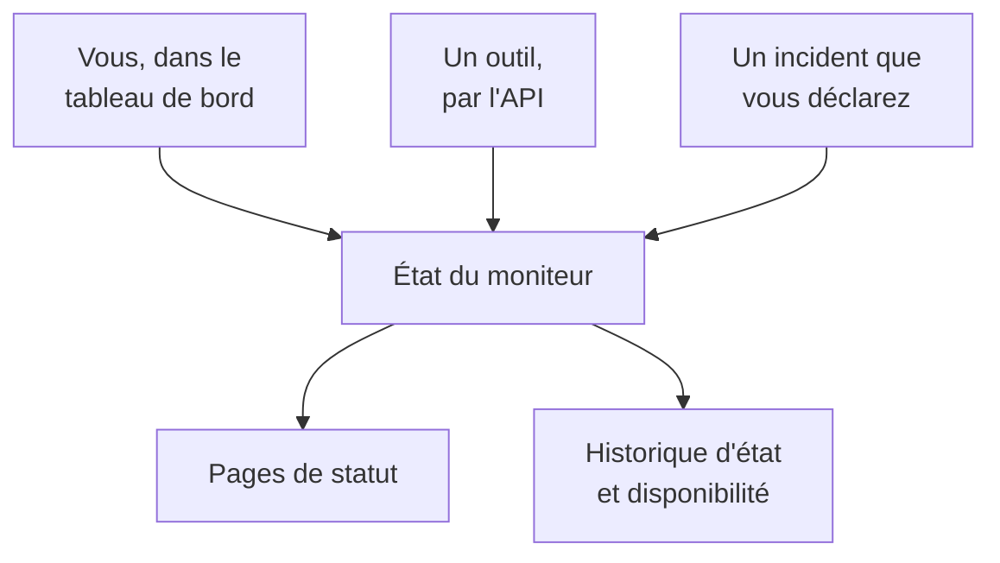

# Surveillance manuelle

Un moniteur manuel n'a aucune vérification automatique : son état est celui que vous définissez, dans le tableau de bord ou par l'API. Utilisez-le pour représenter quelque chose que OneUptime ne peut pas vérifier lui-même — une dépendance tierce, un système physique, un processus métier — sur vos pages de statut et dans vos incidents.

:::cards
- [En créer un](#créer-un-moniteur-manuel): Une étape dans le tableau de bord.
- [Changer son état](#mettre-à-jour-létat): Dans le tableau de bord, ou depuis vos propres outils par l'API.
- [Incidents et alertes](#incidents-et-alertes): Déclarer un incident et définir l'état dans la même étape.
:::

## Quand utiliser un moniteur manuel

| Cas d'usage | Description |
| --- | --- |
| Services tiers | Suivre l'état de services externes dont vous dépendez mais que vous ne pouvez pas surveiller directement. |
| Infrastructure physique | Représenter du matériel ou des systèmes physiques sans surveillance réseau. |
| Processus métier | Suivre des processus non techniques qui influent sur l'état du service. |
| État piloté par l'API | Laisser vos propres outils définir l'état par l'API de OneUptime. |
| Espaces réservés de page de statut | Afficher sur votre page de statut des composants gérés hors de OneUptime. |

Un fournisseur qui publie une page de statut n'en a pas besoin : un [moniteur de page de statut externe](/docs/monitor/external-status-page-monitor) suit cette page pour vous.

## Fonctionnement

Un moniteur manuel n'a ni intervalle de surveillance, ni sondes, ni critères. Son état reste tel que vous l'avez défini jusqu'à ce que vous, un outil passant par l'API ou un incident que vous déclarez le changiez — et le nouvel état s'affiche partout où le moniteur apparaît.



Chaque changement est une entrée de la **Chronologie de statut** du moniteur, donc sa disponibilité et son historique d'état sont conservés comme pour tout autre moniteur. Un moniteur manuel n'est pas un moniteur actif : sur OneUptime Cloud, il n'ajoute rien à votre facture.

## Créer un moniteur manuel

:::steps
### Commencer un nouveau moniteur

Allez dans **Moniteurs** et cliquez sur **Créer un moniteur**.

### Choisir Manuel

Sous **Type de moniteur**, cliquez sur **Plus de types de moniteurs** et choisissez **Manuel** sous **Autre**.

### Le nommer et le créer

Saisissez un **Nom** — et une **Description** sous **Plus de champs**, si vous le souhaitez — puis cliquez sur **Créer un moniteur**. Un moniteur manuel n'a besoin de rien d'autre, il est donc créé dès cette première étape.
:::

## Mettre à jour l'état

### Dans le tableau de bord

:::steps
1. Ouvrez le moniteur et cliquez sur **Chronologie de statut** dans son menu latéral.
2. Cliquez sur **Créer : Événement de statut du moniteur**.
3. Choisissez le **Statut du moniteur**. **Commence le** vaut maintenant ; indiquez une heure antérieure si le changement s'est produit plus tôt.
4. Cliquez sur **Créer : Événement de statut du moniteur**. Le nouvel état s'affiche aussitôt sur le moniteur, et sur chaque page de statut qui le liste.
:::

### Par l'API

Envoyez le nouvel état sous forme d'événement de statut du moniteur, avec une [clé d'API](/docs/api-reference/api-reference) de votre projet dans l'en-tête `ApiKey` :

```bash
curl -X POST https://oneuptime.com/api/monitor-status-timeline \
  -H "ApiKey: $ONEUPTIME_API_KEY" \
  -H "Content-Type: application/json" \
  -d '{"data": {"monitorId": "<monitor id>", "monitorStatusId": "<monitor status id>"}}'
```

- `monitorId` est l'identifiant du moniteur : cliquez sur la ligne **ID** de sa page pour le copier.
- `monitorStatusId` est l'état à définir : dans **Moniteurs → Paramètres → Statut du moniteur**, choisissez **Afficher l'ID** sur la ligne de cet état.
- `startsAt` est facultatif. S'il est omis, le changement commence maintenant.
- Sur une installation auto-hébergée, envoyez la requête à votre propre hôte au lieu de `oneuptime.com`.

Envoyer l'état que le moniteur a déjà est refusé avec `Monitor Status cannot be same as previous status.` et n'enregistre rien, donc un outil qui rapporte à chaque exécution peut ignorer cette réponse.

## Incidents et alertes

Un moniteur manuel se choisit comme n'importe quel autre partout où l'on choisit des moniteurs :

- Déclarez un incident et choisissez le moniteur sous **Moniteurs**. Avec **Changer le statut du moniteur en**, la déclaration définit aussi l'état du moniteur, et sa résolution remet le moniteur en état opérationnel, sauf si un autre incident sur lui est encore ouvert. Voir [Déclarer un incident](/docs/incidents/declaring-incidents#étape-2-ressources-affectées).
- Créez une alerte à son sujet, pour un problème que votre équipe doit traiter sans en informer vos clients.
- Ajoutez-le à une page de statut, pour montrer à vos clients une dépendance que vous surveillez à la main.

## Étapes suivantes

:::cards
- [Créer un moniteur](/docs/monitor/create-monitor): Les types de moniteurs qui vérifient les choses pour vous.
- [Surveillance de page de statut externe](/docs/monitor/external-status-page-monitor): Suivre plutôt automatiquement la page de statut d'un fournisseur.
- [Vue d'ensemble des pages de statut](/docs/status-pages/index): Montrer l'état du moniteur à vos clients.
:::
