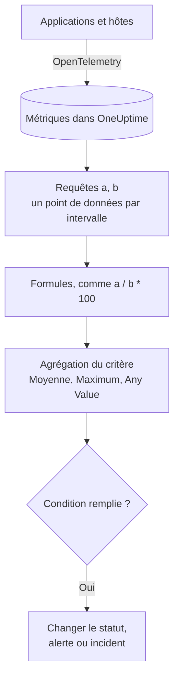

# Surveillance des métriques

Un moniteur de métriques interroge les métriques que vos applications et votre infrastructure envoient à OneUptime, les combine avec des formules quand vous avez besoin d'un ratio ou d'un total, et compare le résultat à vos critères sur une plage de temps glissante. Utilisez-le pour les taux de requêtes, les ratios d'erreurs, la profondeur des files, le CPU, la mémoire et le disque – n'importe quelle série numérique –, avec une alerte par hôte ou par conteneur quand vous le regroupez.

:::cards
- [Créer le moniteur](#créer-un-moniteur-de-métriques): Requêtes, formules, une plage de temps et des critères.
- [Comment il est évalué](#comment-il-est-évalué): Points de données, formules et agrégation des critères.
- [Exemple](#exemple-une-file-qui-grossit): Les mêmes données sous chaque agrégation.
- [Alertes par série](#alertes-par-série-group-by): Une alerte par hôte, conteneur ou point de montage.
:::

## Fonctionnement

Chaque minute, OneUptime exécute chaque requête de métriques du moniteur sur sa plage de temps. Une requête renvoie un point de données par intervalle de temps, et les formules combinent les requêtes intervalle par intervalle. Chaque critère réduit ensuite les points de données de la requête ou de la formule qu'il vérifie – à leur moyenne, à leur maximum ou à un test de chaque point – et compare le résultat à son seuil.

## Avant de commencer

- Vos applications ou votre infrastructure envoient des métriques à OneUptime via OpenTelemetry. Voir [OpenTelemetry](/docs/telemetry/open-telemetry).
- Connaissez le nom de la métrique et les attributs sur lesquels vous voulez filtrer ou regrouper. Les listes **Métrique** et **Regrouper par** ne proposent que des noms et des attributs qu'OneUptime a reçus.

## Créer un moniteur de métriques

:::steps
### Commencer un nouveau moniteur

Allez dans **Moniteurs** et cliquez sur **Créer un moniteur**.

### Choisir Metrics

Sous **Type de moniteur**, cliquez sur **Plus de types de moniteurs** et choisissez **Métriques** sous **Télémétrie**, ou tapez `metrics` dans le champ de recherche. Saisissez un **Nom**, puis cliquez sur **Suivant**.

### Choisir la plage de temps

Dans **Configuration du moniteur de métriques**, choisissez une **Plage temporelle** : la profondeur à laquelle chaque évaluation remonte. Elle commence à **Past 1 Minute**.

### Ajouter les requêtes de métriques

Sous **Sélectionner les métriques**, choisissez une **Métrique** et la façon de l'**Agréger par**. Ouvrez **Filtres et regroupement** pour filtrer par attributs ou **Regrouper par** l'un d'eux. Cliquez sur **Ajouter une métrique** pour une autre requête, ou sur **Ajouter une formule** pour les combiner. Le graphique sous les requêtes prévisualise la plage de temps, pour que vous voyiez les valeurs que les critères vérifieront.

### Définir les critères

Dans **Critères du moniteur**, chaque critère choisit la **Métrique** à vérifier (une requête ou une formule), son **Agrégation**, une **Condition** et un **Threshold**. Voir [Critères](#critères) pour ce avec quoi un nouveau moniteur commence.

### Créer le moniteur

Cliquez sur **Créer un moniteur**. Le moniteur s'ouvre sur sa page **Vue d'ensemble**, et sa première évaluation a lieu dans la minute.
:::

## Ce qu'il interroge

### Requêtes de métriques

| Champ | Ce qu'il fait | Par défaut |
| --- | --- | --- |
| **Métrique** | La métrique à interroger. | Obligatoire |
| **Agréger par** | Comment les valeurs de chaque intervalle de temps sont combinées en un point de données : Moy., Somme, Min, Max, Comptage, ou un centile – P50, P75, P90, P95 ou P99. | Moy. |
| **Filtrer par attributs** (sous **Filtres et regroupement**) | Seulement les séries dont les attributs remplissent ces conditions. | Aucun filtre |
| **Regrouper par** (sous **Filtres et regroupement**) | Une série par valeur unique de ces attributs – voir [Alertes par série](#alertes-par-série-group-by). | Une seule série |

Chaque requête et chaque formule reçoit une variable – `a`, `b`, `c` et ainsi de suite – dans l'ordre où vous les ajoutez.

### Formules

Une formule combine des variables de requête avec `+`, `-`, `*`, `/`, `%`, `^` et des parenthèses, intervalle par intervalle. Vous pouvez écrire les variables avec ou sans `$` devant :

- `a / b * 100` – la part de `b` que représente `a`, en pourcentage
- `a + b` – deux métriques additionnées
- `a - b` – la différence entre elles

### Fenêtre de temps glissante

**Plage temporelle** fixe la profondeur à laquelle chaque évaluation remonte : **Past 1 Minute**, **Past 5 Minutes**, **Past 10 Minutes**, **Past 15 Minutes**, **Past 30 Minutes**, **Past 1 Hour**, **Past 2 Hours**, **Past 3 Hours**, **Past 6 Hours**, **Past 12 Hours**, **Past 1 Day**, **Past 2 Days**, **Past 3 Days**, **Past 7 Days**, **Past 14 Days**, **Past 30 Days**, **Past 60 Days**, **Past 90 Days**, **Past 180 Days** ou **Past 365 Days**.

Plus la plage est longue, plus chaque intervalle de temps est large, si bien qu'un point de données représente plus de temps :

| Plage temporelle | Un point de données par |
| --- | --- |
| Past 1 Minute à Past 3 Hours | minute |
| Past 6 Hours, Past 12 Hours | 5 minutes |
| Past 1 Day | 15 minutes |
| Past 2 Days, Past 3 Days | 30 minutes |
| Past 7 Days | heure |
| Past 14 Days, Past 30 Days | jour |
| Past 60 Days à Past 180 Days | semaine |
| Past 365 Days | mois |

## Comment il est évalué

- **Chaque minute.** Un moniteur de métriques n'est pas vérifié par des sondes ; il n'a donc pas d'intervalle à régler ni de page **Sondes et intervalle**.
- **Les requêtes, puis les formules.** Chaque requête renvoie un point de données par intervalle de temps de la plage, selon son **Agréger par**. Les formules sont calculées pour chaque intervalle à partir des points de données des requêtes.
- **Puis l'agrégation du critère.** Chaque critère réduit les points de données de sa **Métrique** à ce qu'il compare au seuil :

| Agrégation | La condition est vérifiée sur… |
| --- | --- |
| Moyenne | la moyenne des points de données |
| Somme | la somme des points de données |
| Maximum Value | le point de données le plus élevé |
| Minimum Value | le point de données le plus bas |
| All Values | chaque point de données : tous doivent remplir la condition |
| Any Value | chaque point de données : il suffit que l'un d'eux remplisse la condition |

- **Les critères de haut en bas.** Sur un moniteur sans Group By, le premier critère qui correspond décide ; placez donc le plus grave en premier. Un moniteur regroupé vérifie chaque critère pour chaque série – voir [L'évaluation des critères diffère](#lévaluation-des-critères-diffère).
- **L'absence de données n'est pas zéro.** Quand la requête ne renvoie aucun point de données sur la plage, un critère fait ce que dit son réglage **En l'absence de données**, sous **Plus de champs** : **Ignore** (la valeur par défaut – le critère ne correspond pas), **Treat As Zero** ou **Déclencheur**.
- **L'indisponibilité d'OneUptime lui-même n'est pas un silence.** Tant que la plage de temps contient une période où OneUptime lui-même ne recevait pas de données – il redémarrait, était mis à jour ou rattrapait un retard –, la vérification attend : le statut ne change pas, et aucun incident ni aucune alerte n'est ouvert ni résolu, quoi que dise **En l'absence de données**. Voir [Quand OneUptime ne reçoit pas de données](/docs/monitor/when-oneuptime-is-not-receiving).

## Critères

Ces moniteurs évaluent toujours la **Metric Value** – la valeur agrégée de la requête de métriques ou de la formule configurée. Le formulaire des critères n'a pas de sélecteur de type de filtre ; il affiche **Métrique**, **Agrégation**, **Condition** et **Threshold**. Quand la métrique a une unité, choisissez l'unité du seuil à côté.

| Condition | Correspond quand la valeur est… |
| --- | --- |
| **Greater Than** | au-dessus du seuil |
| **Greater Than Or Equal To** | égale ou supérieure au seuil |
| **Less Than** | en dessous du seuil |
| **Less Than Or Equal To** | égale ou inférieure au seuil |
| **Equal To** | exactement le seuil |
| **Anomalously High** | au-dessus de la plage attendue pour cette heure de la semaine |
| **Anomalously Low** | en dessous de cette plage |
| **Anomalous** | hors de cette plage, dans un sens ou dans l'autre |

Les conditions d'anomalie n'ont pas de seuil. Le formulaire affiche à la place **Sensibilité** – Low, Medium (la valeur par défaut) ou High – et **Fenêtre de référence** – 14 jours (la valeur par défaut), 28, 60 ou 90 –, et compare chaque point de données à la référence de la même heure de la semaine construite sur cette fenêtre. Tant que cette heure de la semaine n'a pas assez d'historique, le critère est encore en apprentissage et ne produit aucune alerte.

Un nouveau moniteur de métriques commence avec deux critères sur sa première requête, tous deux avec l'agrégation **Any Value** :

| Critère | Condition | Effet |
| --- | --- | --- |
| Check if … is offline | **Equal To** `0` | Passe le moniteur hors ligne et déclare un incident, résolu automatiquement |
| Check if … is online | **Greater Than** `0` | Passe le moniteur en ligne |

> [!NOTE]
> Le critère hors ligne se déclenche sur une valeur rapportée de 0, pas sur le silence. Pour alerter quand une métrique cesse d'arriver, réglez son **En l'absence de données** sur **Déclencheur**.

## Exemple : une file qui grossit

Vous voulez un incident quand la file de checkout reste profonde. La requête `a` est la jauge `checkout.queue.depth`, avec **Agréger par** Max, et la **Plage temporelle** est **Past 5 Minutes**. Une évaluation voit ces cinq points de données d'une minute :

| Minute | 10:01 | 10:02 | 10:03 | 10:04 | 10:05 |
| --- | --- | --- | --- | --- | --- |
| `a` | 640 | 980 | 1 500 | 1 620 | 1 100 |

Un critère avec **Métrique** `a`, **Condition** **Greater Than** et **Threshold** `1000` donne une réponse différente pour chaque **Agrégation** :

| Agrégation | Comparé à 1 000 | Correspond ? |
| --- | --- | --- |
| Moyenne | 1 168 | Oui |
| Somme | 5 840 | Oui |
| Maximum Value | 1 620 | Oui |
| Minimum Value | 640 | Non |
| All Values | 640, 980, 1 500, 1 620, 1 100 | Non – deux points ne dépassent pas 1 000 |
| Any Value | 640, 980, 1 500, 1 620, 1 100 | Oui – 1 500 le dépasse |

**Moyenne** alerte sur un engorgement qui dure et ignore une minute isolée ; **All Values** attend que chaque minute de la plage soit profonde ; **Any Value** alerte dès la première minute profonde.

## Alertes par série (Group By)

**Regrouper par** sur une requête de métriques divise cette requête en une série par valeur unique d'attribut – une par hôte, une par conteneur, une par point de montage –, et un moniteur avec Group By évalue chaque série indépendamment. Ce seul réglage fait la différence entre « la flotte n'est pas en bonne santé » et « `prod-db-01` n'est pas en bonne santé ».

### Une alerte par groupe

Avec Group By sur `host.name`, un moniteur d'utilisation du disque qui surveille cinquante hôtes lève **une alerte (ou un incident) par hôte en dépassement**. L'hôte A qui se remplit ouvre sa propre alerte ; l'hôte B qui se remplit dix minutes plus tard ouvre une seconde alerte, distincte, à côté.

Sans Group By, le même moniteur est un scalaire unique : la requête réduit tous les hôtes à un seul nombre et le moniteur lève **une seule alerte pour tout le moniteur**. Tant que cette alerte est ouverte, un second hôte en dépassement ne produit rien – le moniteur alerte déjà, il n'y a donc rien de nouveau à lever, et l'ingénieur d'astreinte n'apprend jamais l'existence de l'hôte B. **Définir Group By, c'est ainsi qu'on obtient des alertes par hôte.** Si vous voulez être alerté par hôte, par conteneur ou par point de montage, définissez-le.

### Résolution indépendante

Chaque alerte par groupe suit son propre groupe. Quand l'hôte A repasse sous le seuil, son alerte se résout de son côté, et l'alerte de l'hôte B reste ouverte jusqu'à ce que l'hôte B se rétablisse. Le rétablissement d'un groupe ne ferme jamais l'alerte d'un autre.

### L'évaluation des critères diffère

- **Les moniteurs regroupés évaluent chaque critère.** Des niveaux de gravité peuvent donc se déclencher sur différents groupes en même temps : avec « Critical – supérieur à 95 » au-dessus de « Warning – supérieur à 80 », un hôte à 96 % ouvre une alerte critique tandis qu'un hôte à 85 % ouvre un avertissement, lors de la même vérification. Un hôte qui dépasse les deux niveaux ne reçoit toujours qu'une alerte – celle du premier critère qui correspond ; **ordonnez donc les critères du plus grave au moins grave**.
- **Les moniteurs non regroupés s'arrêtent au premier critère qui correspond.** Seul ce critère se déclenche, ce qui est une raison de plus de placer le critère d'alerte au-dessus du critère sain : un critère sain large placé en premier correspond à presque chaque vérification et empêche le critère d'alerte en dessous d'être jamais évalué.

| Hôte | Disque utilisé | Critical (> 95) | Warning (> 80) | Alerte levée |
| --- | --- | --- | --- | --- |
| `prod-db-01` | 96 % | Oui | Oui | Critical |
| `prod-db-02` | 85 % | Non | Oui | Warning |
| `prod-db-03` | 40 % | Non | Non | Aucune |

### Choisir un attribut de regroupement

Regroupez par un attribut qui identifie vraiment une chose distincte pour laquelle vous alerteriez quelqu'un : l'attribut d'hôte pour une métrique d'hôte à l'échelle de la flotte, l'attribut de conteneur ou de pod pour une métrique de conteneur, l'attribut de point de montage ou de périphérique pour une métrique de système de fichiers ou d'E/S disque, l'attribut d'interface pour une métrique réseau. La liste **Regrouper par** est remplie à partir des attributs que votre collecteur envoie réellement ; choisissez donc dans la liste plutôt que de taper une clé à la main.

Ne regroupez pas une métrique qui est déjà un scalaire unique pour tout le système – un indicateur de leader à l'échelle du cluster, un arriéré d'ordonnanceur, ou le CPU d'un seul hôte sur un moniteur mono-hôte. Les regrouper produit exactement une série et ne change rien, à part les titres des alertes.

Les valeurs de l'attribut de regroupement sont aussi disponibles comme [variables de modèle](/docs/monitor/incident-alert-templating) dans le titre, la description et les notes de remédiation de l'alerte ou de l'incident – regrouper par `host.name` permet au titre de dire `Disk almost full on {{host.name}}`.

## Dépannage

:::details Le graphique montre un dépassement, mais le moniteur n'a pas alerté
Vérifiez d'abord l'**Agrégation** du critère : **All Values** ne correspond que quand chaque point de données de la plage dépasse, et **Moyenne** lisse un pic bref. Vérifiez ensuite que la **Métrique** du critère est bien la requête ou la formule voulue (`a` n'est pas la formule `c`), et que le seuil est dans l'unité que vous pensez.
:::

:::details La métrique a cessé d'arriver et rien ne s'est passé
Une plage sans aucun point de données n'est pas une valeur de 0. Avec **En l'absence de données** à sa valeur par défaut, **Ignore**, le critère ne correspond pas. Réglez-le sur **Déclencheur** sous **Plus de champs** du critère pour alerter sur le silence.
:::

:::details Je reçois une seule alerte pour toute la flotte
La requête n'a pas de **Regrouper par** : tous les hôtes sont réduits à un seul nombre. Regroupez la requête par l'attribut d'hôte, de conteneur ou de point de montage – voir [Alertes par série](#alertes-par-série-group-by).
:::

:::details Un critère d'anomalie ne se déclenche jamais
Il est encore en apprentissage : l'heure de la semaine à laquelle il se compare n'a pas encore assez d'historique dans la **Fenêtre de référence**.
:::

## Étapes suivantes

:::cards
- [Modèles d'incident et d'alerte](/docs/monitor/incident-alert-templating): Mettre l'hôte et la valeur dans les titres d'alerte.
- [Surveillance des journaux](/docs/monitor/logs-monitor): Alerter sur le volume et le contenu des journaux, par groupe.
- [Surveillance des hôtes](/docs/monitor/host-monitor): Des vérifications prêtes à l'emploi de CPU, de mémoire et de disque pour vos hôtes.
- [OpenTelemetry](/docs/telemetry/open-telemetry): Envoyer des métriques à OneUptime.
:::
